# The Puzzle {background=#00345E}

## A Simple Question

> Why do voters choose candidates whose **policies** they oppose?

. . .

- 90% of Argentines reject cuts to public health and education (Pulsar UBA, 2023-24)
- Yet Milei won promising exactly that

. . .

- 4 in 10 US Republicans support universal healthcare (Pew Research, 2023)
- Yet they vote for candidates who oppose it

## The Standard Answer: Ideology

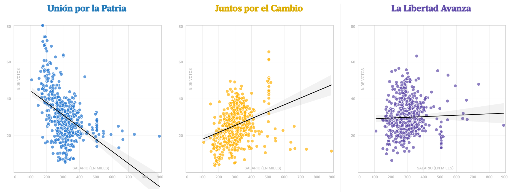{fig-align="center" width="70%"}

## But This Raises a Deeper Question

**What IS ideology?**

- Is it *symbolic* (how you identify)?
- Or *operational* (what policies you support)?

. . .

**Ellis & Stimson (2012)**: 25-32% of Americans are "conflicted conservatives"

- Self-identify as conservative
- But support liberal policies

## Related Literature

- **Ideology puzzle**: Symbolic vs. operational ideology (Converse 1964; Ellis & Stimson 2012; Claassen et al. 2015)
- **Probabilistic voting**: Lindbeck & Weibull (1987); Roemer (1998); Lee & Roemer (2006)
- **Social identity**: Tajfel & Turner (1979); Akerlof & Kranton (2000); Shayo (2009)
- **Misperceptions**: Alesina, Stantcheva & Teso (2018); Hvidberg, Kreiner & Stantcheva (2023)

. . .

**Gap in literature**: No empirical framework to *measure* the ideology-policy gap at individual level

## Our Approach: Separate Ideology from Policy

| | Ideology | Policy |
|---|---|---|
| **Nature** | Abstract, identitarian | Concrete, operational |
| **Example** | "Smaller government is better" | "Privatize Aerolíneas Argentinas" |
| **Measurement** | Vague, philosophical questions | Specific, real-world questions |

. . .

**Key insight**: The *gap* between ideology and policy positions may predict voting better than either alone.

# Research Design {background=#00345E}

## Two Linked Questionnaires

:::: {.columns}
::: {.column width="50%"}
**Ideology Questionnaire**

- 28 items (8 economic, 9 social, 11 varias)
- Vague, identitarian language
- "Countries with smaller governments are more successful"
- "Climate change is a serious global concern"
:::

::: {.column width="50%"}
**Policy Questionnaire**

- 17 parallel items
- Concrete, operational language  
- "Privatize Aerolíneas, BNA, ARSAT"
- "Argentina should withdraw from Paris Agreement"
:::
::::

Each ideology question has a corresponding policy question.

## The Political Compass

Two dimensions following standard spatial models (Poole & Rosenthal 1997):

- **X-axis**: Economic (Left ↔ Right)
- **Y-axis**: Social (Liberal ↔ Conservative)

. . .

Each respondent gets **two positions**:

1. Where they stand *ideologically*
2. Where they stand on *policy*

The **arrow** between them = the ideology-policy gap

## Sample

- N = 25 university students (FCE-UNC)
- Surveyed around 2023 presidential election
- Tracked votes: PASO → General → Ballotage

. . .

**Limitation**: Small, homogeneous sample (similar to Alesina & Fuchs-Schündeln 2007 classroom designs)

**Advantage**: Individual-level tracking; proof of concept for methodology

# Finding Candidate Positions {background=#00345E}

## The Problem

We know where voters stand. But where do *candidates* stand?

**Traditional approaches**:

- Expert surveys: Chapel Hill Expert Survey (Bakker et al. 2020)
- Manifesto coding: CMP/MARPOR (Volkens et al. 2023)
- Roll-call scaling: NOMINATE (Poole & Rosenthal 1997)

. . .

All are resource-intensive or unavailable for new democracies/candidates.

## Our Innovation: LLM-Based Inference

We used **Google Gemini 2.5 Pro** to:

1. Analyze presidential debate transcript (Oct 1, 2023)
2. Answer our survey questions *as each candidate*
3. Provide verbatim quotes as justification

. . .

**Related work**: Argyle et al. (2023) on LLMs simulating survey responses; Wu et al. (2023) on scaling political texts with LLMs

## Candidate Positions

:::: {.columns}
::: {.column width="50%"}
{fig-align="center"}
:::

::: {.column width="50%"}
{fig-align="center"}
:::
::::

# Results {background=#00345E}

## The Ideology-Policy Map

{fig-align="center" width="70%"}

## Key Observations

**1. Voters are more centrist than their candidates**

- Both Milei and Massa voters cluster near the center
- Candidates occupy more extreme positions
- Cf. Fiorina (2017) on elite polarization vs. mass moderation

. . .

**2. The ideology-policy gap varies systematically**

- Some voters: ideology ≈ policy (consistent)
- Other voters: large gap (conflicted)

## The Probabilistic Voting Model

Following Lindbeck & Weibull (1987) and Persson & Tabellini (2000):

$$V^{ij} = V^{j}(\mathbf{q}) + \sigma^{ij}(P)$$

We adapt to multidimensional space:

$$P(\text{Vote}_A) = f(\alpha \cdot d_{\text{ideo}} + \beta \cdot d_{\text{pol}})$$

Where $d$ = Euclidean distance to candidate in respective space

## Main Result

| Variable | Coefficient | p-value |
|----------|-------------|---------|
| Intercept | 1.93 | 0.03** |
| Ideology distance | -0.07 | 0.56 |
| Policy distance | -0.30 | 0.09* |

. . .

**Policy proximity matters more than ideological proximity** ($\beta > \alpha$)

Accuracy: 76% (19/25 correctly predicted)

# Interpretation {background=#00345E}

## What Does This Mean?

1. **Voting is more "pocketbook" than "heart"**
   - Consistent with economic voting literature (Lewis-Beck & Stegmaier 2000)

. . .

2. **The ideology puzzle has a spatial dimension**
   - Extends Ellis & Stimson (2012) from unidimensional to two-dimensional space

. . .

3. **Candidate positioning matters**
   - Voters are centrist; candidates are extreme
   - Challenges MVT convergence prediction (Downs 1957)

## Alternative Interpretations

**Why might ideology matter less in this sample?**

- Politically sophisticated respondents (economics students)
- High-information environment (3 electoral rounds)
- Economic crisis made policy unusually salient (cf. Singer 2011 on issue salience)

. . .

**Caution**: Small sample, single election—replication needed

# Implications & Next Steps {background=#00345E}

## Broader Implications

**For understanding populism** (Mudde & Rovira Kaltwasser 2017):

- If voters vote *policy* but identify *ideologically*...
- Politicians may rationally pursue "bait and switch" strategies
- Speaks to literature on populist rhetoric vs. policy (Roberts 2022)

. . .

**For democratic theory**:

- Representation gap may emerge even with informed voters
- Multidimensional competition complicates accountability

## Next Steps

1. **Scale up**: Larger, representative sample (online panels, cross-university)
2. **Add social identity**: In-group/out-group measures (following Huddy 2001)
3. **Validate LLM method**: Compare to expert surveys; test inter-model reliability
4. **Comparative extension**: Brazil 2022, US 2024

. . .

**The payoff**: Better understanding of why democracies produce policies voters don't want.

# Thank You {background=#00345E}

## Questions?

**Contact**: sfreille@unc.edu.ar

**Collaborators**: Rubio, M; Jaroszewski, V.; Hofmann, R.; Albarracin, C.; Prazoni, G.; Larovere, S.; Seia, L; Bachiglione, C.; Balbo, S.

# Appendix {background=#00345E}

## Appendix: Survey Instruments

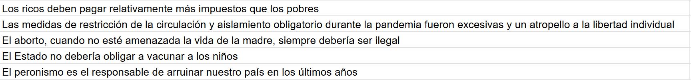{fig-align="center" width="80%"}

## Appendix: Policy Questions

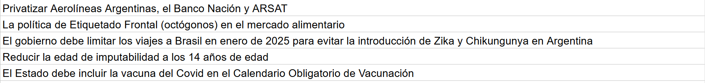{fig-align="center" width="80%"}

## Appendix: AI Interaction Example

::: {layout-ncol=3}
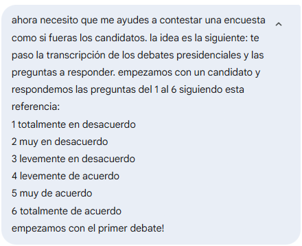

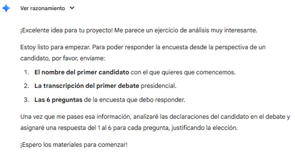

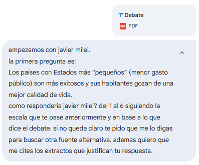
:::

## Appendix: AI Interaction Example (cont.)

::: {layout-ncol=3}

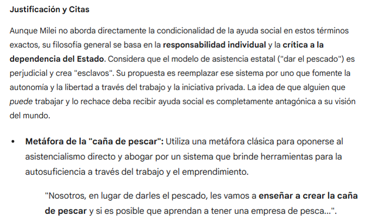

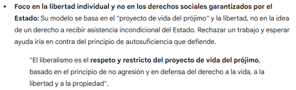
:::

## Appendix: AI Interaction Example (cont.)

::: {layout-ncol=3}

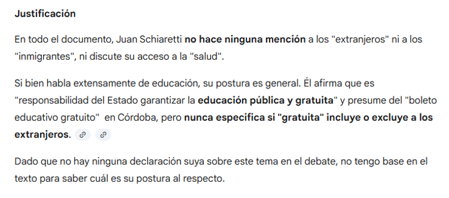

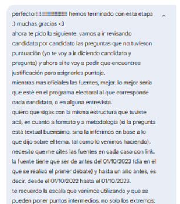
:::

## Appendix: AI Interaction Example (cont.)

- We then asked the AI model to use external sources to try to score
  questions which went unanswered on the basis of the
  transcripts. These sources could be personal interviews, political
  platforms in the CNE and additional indirect sources. 
  - we limited the search to information within one year prior to the
    Presidential debate
- As in the first stage, we asked the AI model to provide quotes and
  excerpts used in its scoring. 
- All the questions were thus answered using this procedure. 

## Appendix: AI Interaction Example (cont.)

::: {layout-ncol=3}
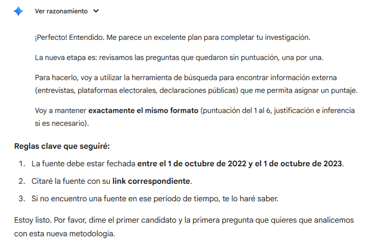

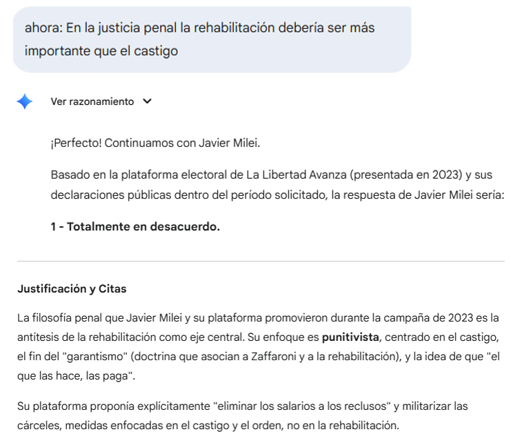

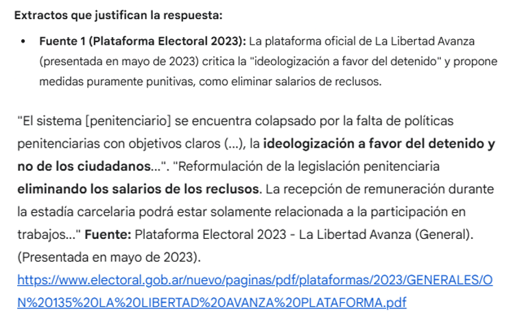
:::

