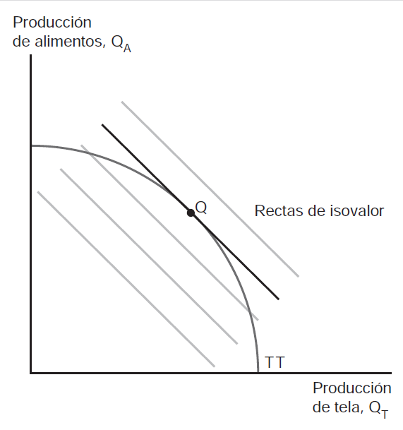
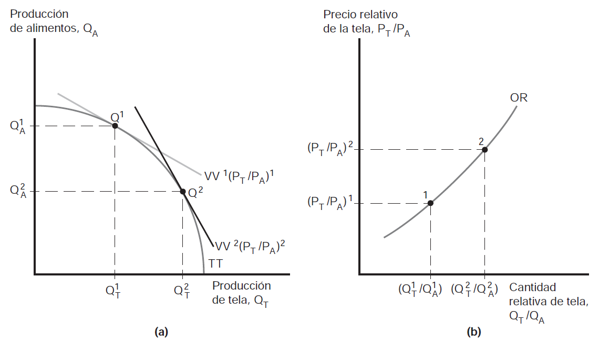
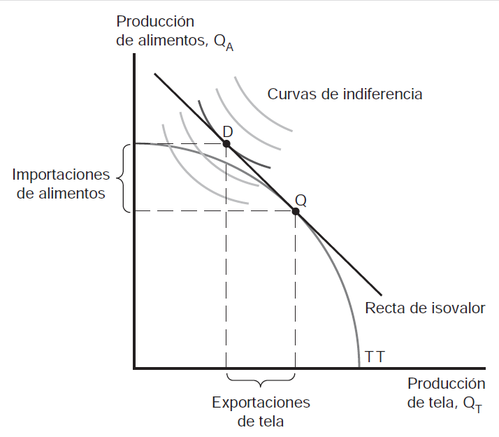
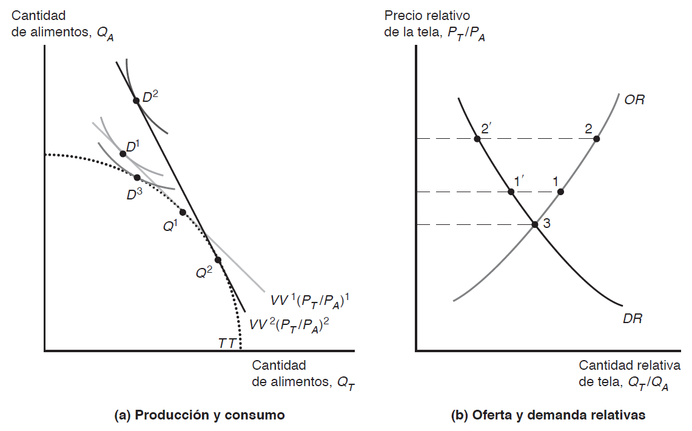
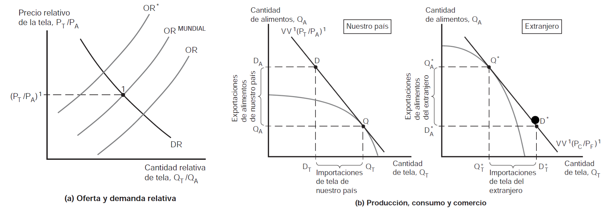
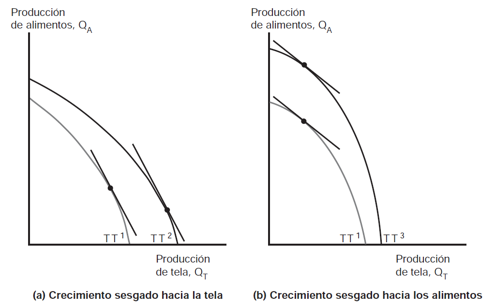
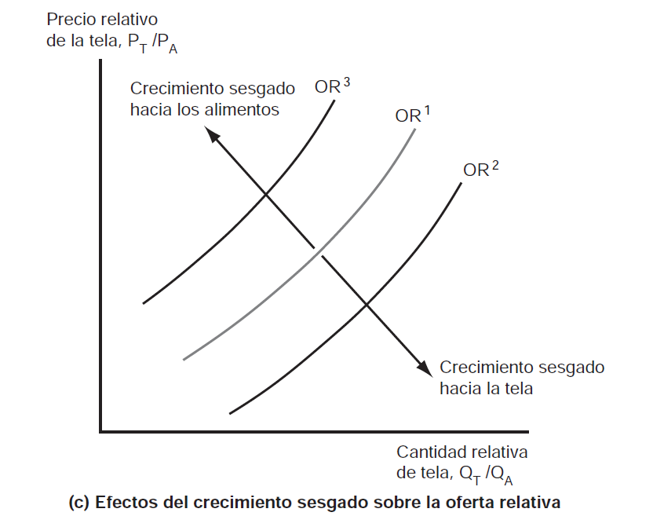
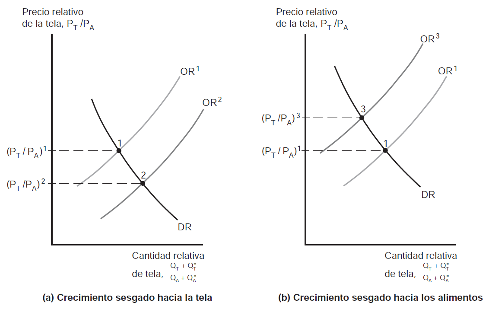

# **El modelo estándar de comercio** {background="#4b6e5c"}

## ¿Cuál modelo?

- Hasta ahora hemos visto 3 (tres) modelos distintos de comercio
  internacional. Difieren en supuestos y también en
  conclusiones. Repasemos sus características
  1. **Modelo ricardiano** $\longrightarrow$ 1 (un) sólo factor --$L$-,
     y 2 (sectores). La asignación de $L$ entre sectores determina la
     FPP. Aporta idea de ventaja comparativa pero no avanza en
     distribución de la renta
  2. **Modelo factores específicos** $\longrightarrow$ 3 (tres)
     factores --$L$, $K$ y $T$. Foco en consecuencias distributivas *a
     corto plazo*
  3. **Modelo de Heckscher-Ohlin** $\longrightarrow$ 2 (dos) factores
     --$L$, $K$- con libre movilidad. Diferencias en dotacion relativa
     determina patrón de comercio. Foco en consecuencias distributivas
     *a largo plazo*
	 
## Todos!

- Cuando analizamos problemas, solemos tomar una combinación de los
  mismos. Para analizar un rapido crecimiento de $X$ de nuevos países
  industrializados por razones de productividad, el modelo ricardiano
  es util. Para analizar consecuencias distributivas, los modelos de
  factores específicos y H-O son más utiles que el ricardiano
- Características compartidas
  1. Todos parten de posibilidades de producción (FPP) --diferencias
     en las FPP origen del comercio
  2. FPP determinan funcion de OR de un país
  3. Equilibrio mundial determinado por cruce de DR y OR *mundiales*,
     estas ultimas situadas entre OR nacionales

## Modelo general

- El **modelo estándar de comercio** se construye a partir de 4
  (cuatro) relaciones clave
  1. Relación entre FPP y curva de OR
  2. Relación entre precios relativos y curva de DR
  3. Determinación de equilibrio mundial a través de OR y DR mundiales
  4. Efecto de la relación de intercambio --$\frac{P_{X}}{P_{M}}$
     sobre bienestar nacional
- Modelo estándar supone:
  - Cada país produce 2 (dos) bienes --$A$ y $T$
  - FPP es una curva *cóncava*
  
## Modelo general: FPP (producción) y OR

{fig-align="center"}

## Modelo general: FPP (producción) y OR (cont.)

- La economía produce en el punto de tangencia entre FPP y el relativo
  de precios, $\frac{P_{T}}{P_{A}}$. Para precios de mercado *dados*
  economía elegirá punto de producción que aumente al máximo el valor
  de producción --$P_{T}Q_{T}+P_{A}Q_{A}$
- La recta de isovalor es línea a lo largo de la cual valor de
  producción es constante
  --$Q_{A}=\frac{V}{P_{A}}-\frac{P_{T}}{P_{A}}Q_{T}$, donde $V$ es el
  valor de la producción
- Si $\frac{P_{T}}{P_{A}}$ aumenta, recta de isovalor mayor pendiente
  y se produce más $T$ y menos $A$ $\longrightarrow$ **aumenta la OR
  de tela, $T$**

## Modelo general: FPP (producción) y OR (cont.)

{fig-align="center"}

## Modelo general: precios relativos y demanda

- En una economía sin comercio, el valor de la producción debe igualar
  el valor del consumo --por lo tanto *producción* y *consumo* deben
  estar en la misma curva de isovalor

\begin{equation}
P_{T}Q_{T}+P_{A}Q_{A}=P_{T}D_{T}+P_{A}D_{A}
\end{equation}

- el punto de consumo depende de las preferencias de consumidores
  --curvas de indiferencia [supuestos de las CI]

## Modelo general: precios relativos y demanda (cont.)

{fig-align="center"}

## Modelo general: precios relativos y demanda (cont.)

- En la figura puede verse que tanto la elección de consumo como de
  producción están en la misma curva de isovalor (y la más alta
  posible) pero $\longrightarrow$ la economía exporta $T$ e importa
  $A$ [¿por qué?]
- Interesa saber que pasa cuando aumenta $\frac{P_{T}}{P_{A}}$
  - Economía produce más $T$ y menos $A$ --producción de
    $Q_{1}$ a $Q_{2}$ (cambia recta de isovalor)
  - Pero también cambia el consumo --consumo de $D_{1}$ a $D_{2}$

## Modelo general: precios relativos y demanda (cont.)

{fig-align="center"}

## Modelo general: precios relativos y demanda (cont.)

- Existen 2 (dos) efectos que hacen que suceda este movimiento
  - Economía se traslada a CI más alta porque al subir precio
    relativo de $T$ puede tener más $M$ para una cantidad dada
    de $X$ $\longrightarrow$ **efecto ingreso**
  - Economía se traslada a lo a largo de la CI hacia más consumo de
    $A$ y menos de $T$ dado que tela es ahora relativamente más cara
    $\longrightarrow$ **efecto sustitución**
- Lo importante aquí es que la DR de $T$ disminuye cuando aumenta
  $P_{T}$; mientras que la OR de $T$ aumenta cuando aumenta $P_{T}$
  - el hecho de que la DR de tela caiga sugiere que domina el efecto
    sustitución 
- ¿Si la economía no puede comerciar? Consume en el punto 3 ($D_{3}$)
  donde $OR=DR$

## Modelo general: efectos de cambios en la relación de intercambio sobre el bienestar

- Hemos visto que cuando aumenta $\frac{P_{T}}{P_{A}}$ en un país que
  inicialmente exporta $T$ mejora su situación. 
- Ahora, si el país fuera inicialmente exporta $A$ el efecto se
  invierte $\longrightarrow$ un aumento de $\frac{P_{T}}{P_{A}}$
  equivale a una disminución de $\frac{P_{A}}{P_{T}}$
  $\longrightarrow$ país empeora porque baja el precio relativo del
  bien que exporta
- Podemos definir ahora la **relación de intercambio** como el precio
  del bien que el país exporta (inicialmente) dividido el precio del
  bien que el país importa (inicialmente)

## Modelo general: efectos de cambios en la relación de intercambio sobre el bienestar

> Un aumento en la relacion de intercambio incrementa el bienestar de
> un país mientras que una reducción de la relación de intercambio
> disminuye su bienestar

> Cambios en la relación de intercambio, sin embargo, no reducen el
> bienestar por debajo del nivel de bienestar que tendría sin comercio
> --en el gráfico representado por punto $D_{3}$. Note que es el peor
> nivel de bienestar posible

## Determinación de los precios relativos

- Nuestro país exporta $T$ y país extranjero exporta $A$. Relación de
  intercambio en nuestro país es $\frac{P_{T}}{P_{A}}$; la del país
  extranjero es $\frac{P_{A}}{P_{T}}$
- Si ambos comparten mismas curvas de DR, para cualquier precio dado
	$\frac{P_{T}}{P_{A}}$, nuestro país produce $Q_{T}$ y $Q_{A}$ y
	país extranjero produce $Q_{T}^{*}$ y $Q_{A}^{*}$ donde
	$\frac{Q_{T}}{Q_{A}} > \frac{Q_{T}^{*}}{Q_{A}^{*}}$
- Y de esa manera se obtiene la OR mundial: $\frac{(Q_{T}+Q_{T}^{*})}{(Q_{A}+Q_{A}^{*})}$
- La DR se obtiene de manera similar, $\frac{(D_{T}+D_{T}^{*})}{(D_{A}+D_{A}^{*})}$

## Determinación de los precios relativos (cont.)

 

## Determinación de los precios relativos (cont.)

- $DR$ son igual al ser iguales las preferencias. Precio relativo via
  intersección de $OR$ y $DR$. Este precio determina el perfil de
  exportación e importación de cada país
  - las exportaciones de tela de nuestro país, $Q_{T}-D_{T}$ son
    iguales a las importaciones de tela del extranjero
    $D_{T}^{*}-Q_{T}^{*}$; del mismo modo, las importaciones de
    alimentos de nuestro país, $D_{A}-Q_{A}$ son iguales a las
    exportaciones de alimentos del extranjero, $Q_{A}^{*}-D_{A}^{*}$. 
- De esta manera vemos como se determinan la $OR$, $DR$, la relación
  de intercambio y el bienestar en el **modelo estándar de comercio**

# **Crecimiento económico** {background="#4b6e5c"}	

## Desplazmiento de la OR

- Dos temas relevantes cuando hay crecimiento económico mundial
  1. ¿Crecimiento económico en otros países es positivo o negativo
     para nuestro país?
  2. ¿Crecimiento económico en un país es más o menos valioso cuando
     el país forma parte de un mundo integrado?
- Ambas preguntas dan lugar a respuestas que no terminan siendo
  concluyentes --i.e. ambigüedades en los efectos, hay beneficios y
  costos en ambos casos
  
## Crecimiento y FPP

- Sabemos que el crecimiento puede ser visto como un desplazamiento
  hacia afuera de la FPP de un país --FPP puede desplazarse por
  aumento de factores o por cambio tecnológico
- El crecimiento no siempre suele ser paralelo --es decir, todos los
  sectores iguales- sino que suele ser **sesgado**
- Dos razones principales detrás del **crecimiento sesgado**
  1. Progreso tecnológico sesgado $\longrightarrow$ progreso técnico
     es sólo o mayor en un sector
  2. Aumento oferta de factor de producción $\longrightarrow$ sesgo a
     favor del bien cuya producción es intensiva en factor que aumentó

## Crecimiento sesgado

 

## Crecimiento sesgado (cont.)

 

## Crecimiento sesgado y OR

- Con el crecimiento sesgado la economía puede en principio **producir
  más de ambos bienes** pero para un *precio relativo constante* la
  producción de $T$ se reduce cuando el sesgo favorece a $A$ y la
  producción de $A$ se reduce cuando el sesgo favorece a $T$ [¿por
  qué?]
- Esto quiere decir que la curva de $OR$ se desplazará hacia la
  derecha si el crecimiento es aunque sea levemente sesgado hacia $T$
  --aumento de producción de $T$ relativo a la de $A$ (de $OR1$ a
  $OR2$). Algo similar si el movimiento es en la otra dirección

## OR mundial y relación de intercambio

- Suponga que nuestro país tiene un **crecimiento sesgado hacia la
  tela** producción relativa de $T$ aumenta a nivel mundial y se
  desplaza $OR$ a la derecha
- La consecuencia de esto es una **reducción del precio relativo de la
  $T$** $\longrightarrow$ deterioro de la relación de intercambio para
  nuestro país
  - importante $\longrightarrow$ no es **qué** país experimenta el
    crecimiento sesgado sino **cuál es el sesgo** 
- De ahí que surgen las nociones de **crecimiento sesgado hacia la
  exportación** y **crecimiento sesgado hacia la importacion**
  - el primero empeora la relación de intercambio para nuestro país y
    beneficia al otro; el segundo es al revés!

## OR mundial y relación de intercambio (cont.)

 

## Efectos del crecimiento en el resto del mundo

- ¿Qué pasa si el crecimiento sesgado ocurre en el **país extranjero**
  en lugar del nuestro?
- Si el extranjero tiene crecimiento sesgado hacia $A$ (su bien de
  exportación):
  - Aumenta la OR mundial de $A$ relativo a $T$
  - Disminuye $\frac{P_{A}}{P_{T}}$ $\longrightarrow$ aumenta
    $\frac{P_{T}}{P_{A}}$
  - **Mejora** la relación de intercambio de nuestro país
- Si el extranjero tiene crecimiento sesgado hacia $T$ (su bien de
  importación):
  - **Empeora** la relación de intercambio de nuestro país

## Efectos del crecimiento: resumen

| Tipo de crecimiento | Efecto en relación de intercambio |
|---------------------|-----------------------------------|
| Sesgado hacia exportaciones (local) | Empeora |
| Sesgado hacia importaciones (local) | Mejora |
| Sesgado hacia exportaciones (extranjero) | Mejora |
| Sesgado hacia importaciones (extranjero) | Empeora |

- El crecimiento sesgado hacia las exportaciones tiende a empeorar la
  relación de intercambio del país que crece
- El crecimiento sesgado hacia las importaciones tiende a mejorarla

## Crecimiento empobrecedor

- En casos extremos, un país puede empeorar su situación como
  resultado de su propio crecimiento $\longrightarrow$ **crecimiento
  empobrecedor** (*immiserizing growth*)
- Condiciones necesarias:
  1. Crecimiento fuertemente sesgado hacia las exportaciones
  2. País es "grande" en el mercado mundial (afecta precios)
  3. Demanda mundial muy inelástica para el bien exportado
  4. País muy dependiente del comercio internacional
- En este caso, el deterioro de la relación de intercambio es tan
  grande que supera las ganancias directas del crecimiento

## Crecimiento empobrecedor (cont.)

- Ejemplo clásico: países en desarrollo que expanden producción de
  materias primas
  - Aumento de producción de café en Brasil $\longrightarrow$ caída
    del precio mundial del café
  - Si la caída de precios es muy grande, el valor total de las
    exportaciones puede caer
- Este resultado es teóricamente posible pero empíricamente raro
  - Requiere condiciones muy específicas
  - Históricamente más relevante para economías pequeñas muy
    especializadas

# **Transferencias internacionales** {background="#4b6e5c"}

## Transferencias de renta

- Las transferencias internacionales de renta son comunes:
  - Ayuda externa (países desarrollados a países en desarrollo)
  - Reparaciones de guerra
  - Remesas de trabajadores migrantes
- Pregunta clave: ¿Cómo afectan las transferencias a la relación de
  intercambio y al bienestar de los países involucrados?

## Efectos de una transferencia

- Suponga que nuestro país realiza una transferencia al extranjero
- Efectos directos obvios:
  - Nuestro país puede gastar menos $\longrightarrow$ menor bienestar
  - País extranjero puede gastar más $\longrightarrow$ mayor bienestar
- Pero también hay efectos indirectos a través de la relación de
  intercambio que pueden reforzar o contrarrestar los efectos directos

## Transferencias y demanda relativa

- La transferencia reduce el ingreso de nuestro país y aumenta el del
  extranjero
- Efecto sobre la DR mundial depende de las **propensiones marginales
  a gastar** en cada bien:
  - Si nuestro país tiene mayor propensión a gastar en $T$ (su
    exportación), la transferencia reduce la DR de $T$
  - Si el extranjero tiene mayor propensión a gastar en $A$ (su
    exportación), la transferencia aumenta la DR de $A$

## Transferencias y relación de intercambio

- Caso normal: cada país tiene preferencia por su propio bien de
  exportación
  - Nuestro país gasta más en $T$, extranjero gasta más en $A$
- Cuando nuestro país transfiere al extranjero:
  - Cae demanda de $T$, sube demanda de $A$
  - $\frac{P_{T}}{P_{A}}$ cae $\longrightarrow$ **empeora** relación
    de intercambio de nuestro país
- El deterioro de la relación de intercambio **refuerza** el efecto
  negativo de la transferencia sobre nuestro país

## Transferencias y relación de intercambio (cont.)

- ¿Puede la transferencia beneficiar al país que la realiza?
  - Teóricamente sí, si el país receptor tiene mayor propensión a
    gastar en el bien que exporta el país donante
  - En ese caso, la transferencia mejoraría la relación de intercambio
    del donante
- Este caso es conocido como **transferencia paradójica** pero es
  empíricamente improbable
  
## El problema de la transferencia

- En la práctica, se espera que:
  - El país donante sufra una pérdida adicional por el deterioro de su
    relación de intercambio
  - El país receptor obtenga una ganancia adicional por la mejora de
    su relación de intercambio
- Esto implica que el "costo" real de la ayuda externa puede ser mayor
  que el monto nominal transferido
- Y el "beneficio" real puede ser mayor que el monto recibido

# **Aranceles y subsidios a la exportación** {background="#4b6e5c"}

## Instrumentos de política comercial

- Los gobiernos intervienen frecuentemente en el comercio
  internacional mediante:
  - **Aranceles** $\longrightarrow$ impuestos a las importaciones
  - **Subsidios a la exportación** $\longrightarrow$ pagos a los
    exportadores
- Estos instrumentos afectan los precios relativos y, por ende, la
  asignación de recursos y el bienestar

## Efectos de un arancel: país pequeño

- Un **país pequeño** no puede afectar los precios mundiales
- Si impone un arancel sobre las importaciones de $A$:
  - Precio interno de $A$ sube (por el monto del arancel)
  - Precio mundial de $A$ no cambia
  - Relación de intercambio no cambia
- El arancel genera una **pérdida neta de bienestar** para el país
  pequeño (triángulos de pérdida)

## Efectos de un arancel: país grande

- Un **país grande** sí puede afectar los precios mundiales
- Si nuestro país (grande) impone un arancel sobre $A$:
  - Reduce demanda de importaciones de $A$
  - Precio mundial de $A$ cae
  - Relación de intercambio de nuestro país **mejora**
- El arancel tiene dos efectos contrapuestos:
  1. Distorsión en la asignación de recursos (negativo)
  2. Mejora en la relación de intercambio (positivo)

## Aranceles y oferta/demanda relativas

- El arancel afecta los precios relativos internos
- Si nuestro país importa $A$ y exporta $T$:
  - Arancel sobre $A$ $\longrightarrow$ sube $\frac{P_{A}}{P_{T}}$
    internamente
  - Producción de $A$ aumenta, producción de $T$ cae
  - Consumo de $A$ cae, consumo de $T$ sube
- Resultado: caen las importaciones de $A$ y las exportaciones de $T$

## Aranceles y relación de intercambio

- En el mercado mundial:
  - Menor demanda de $A$ por parte de nuestro país
  - Menor oferta de $T$ por parte de nuestro país
- Esto reduce el precio mundial de $A$ relativo a $T$
- La relación de intercambio de nuestro país,
  $\frac{P_{T}}{P_{A}}$, **mejora**

> Un arancel impuesto por un país grande mejora su relación de
> intercambio a expensas del país extranjero

## El arancel óptimo

- Si un país grande puede mejorar su relación de intercambio con un
  arancel, ¿cuál es el arancel óptimo?
- El **arancel óptimo** balancea:
  - Ganancias por mejora en relación de intercambio
  - Pérdidas por distorsión interna
- El arancel óptimo es positivo pero finito
  - Un arancel demasiado alto reduce tanto el comercio que las
    pérdidas por distorsión dominan
- Para un país pequeño, el arancel óptimo es cero

## Subsidios a la exportación

- Un **subsidio a la exportación** es un pago del gobierno a los
  exportadores
- Efectos opuestos al arancel:
  - Aumenta el precio interno del bien exportado
  - Fomenta la producción y exportación de ese bien
  - **Empeora** la relación de intercambio del país que subsidia

## Subsidios y relación de intercambio

- Si nuestro país subsidia sus exportaciones de $T$:
  - Aumenta la producción de $T$
  - Aumenta la oferta mundial de $T$
  - Cae el precio mundial de $T$ relativo a $A$
  - Relación de intercambio de nuestro país **empeora**
- El subsidio a la exportación siempre reduce el bienestar de un país
  grande (a diferencia del arancel)
  - Distorsiona la producción Y empeora la relación de intercambio

## Subsidios a la exportación (cont.)

- ¿Por qué los países subsidian exportaciones si es perjudicial?
  - Beneficia a sectores específicos (productores del bien exportado)
  - Objetivos de empleo o desarrollo industrial
  - Consideraciones estratégicas (ganar cuota de mercado)
- Los subsidios a la exportación están limitados por acuerdos
  internacionales (OMC)

## Aranceles vs. subsidios: resumen

| Instrumento | Precio interno | Relación de intercambio | Bienestar (país grande) |
|-------------|----------------|-------------------------|-------------------------|
| Arancel a importaciones | Sube P del bien importado | Mejora | Ambiguo (puede mejorar) |
| Subsidio a exportaciones | Sube P del bien exportado | Empeora | Empeora |

- El arancel puede beneficiar a un país grande; el subsidio no
- Ambos instrumentos generan distorsiones internas
- Ambos perjudican al país extranjero

# **Resumen del modelo estándar** {background="#4b6e5c"}

## Ideas clave

1. **Relación de intercambio y bienestar**: Una mejora en la relación
   de intercambio aumenta el bienestar; un deterioro lo reduce
2. **Crecimiento económico**: El crecimiento sesgado hacia
   exportaciones tiende a empeorar la relación de intercambio; hacia
   importaciones tiende a mejorarla
3. **Transferencias**: Normalmente empeoran la relación de intercambio
   del donante y mejoran la del receptor
4. **Aranceles**: Un país grande puede mejorar su relación de
   intercambio con un arancel, pero genera distorsiones
5. **Subsidios**: Siempre empeoran la relación de intercambio del país
   que los aplica
