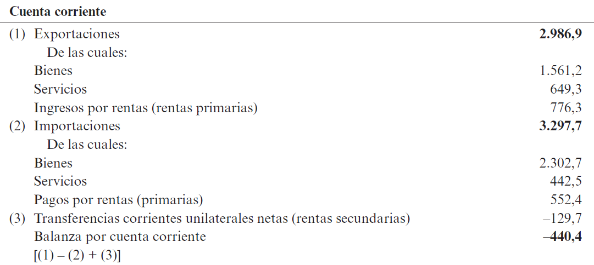
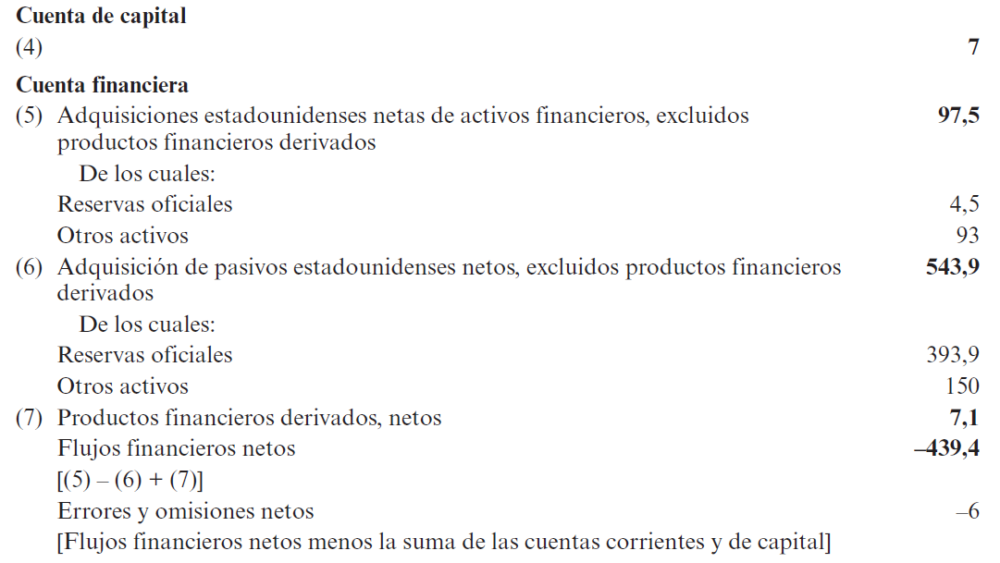

# **La contabilidad nacional** {background="#4b6e5c"}

## Un cambio de enfoque

- Hasta ahora en la materia hemos privilegiado un **enfoque
  microeconómico** $\longrightarrow$ utilización eficiente de
  recursos, ganancias de bienestar (Pareto), y efectos distributivos
- Nos enfocamos ahora en los grandes agregados de la economía, es
  decir, privilegiamos un **enfoque macroeconómico**
  - ¿qué determina que los recursos estén en pleno empleo? ¿cómo se
    determina el nivel de ingreso y las variaciones del mismo? ¿cómo
    se determinan las tasa de interés? ¿qué impacto tienen los tipos
    de cambio?
- No se analizan ya al nivel de las decisiones individuales sino al
  nivel de los grandes agregados

## Cuatro grandes problemas

- Existen (al menos) cuatro grandes temas de los que se preocupa el
  análisis macroeconómico
  1. Desempleo $\longrightarrow$ factores que causan el desempleo y
     medidas de política para prevenirlo
  2. Ahorro $\longrightarrow$ la economía internacional ofrece una
     nueva dimensión para el ahorro y/o endeudamiento
  3. Desequilibrios comerciales $\longrightarrow$ rara vez sucede que
     las exportaciones e importaciones de un país están balanceadas
     --esto tiene implicancias importantes
  4. Dinero y nivel de $P$ $\longrightarrow$ hasta ahora hemos
     supuesto (implícitamente) una economía de trueqe --precios
     relativos (no monetarios). Hay 2 (dos) aspectos nuevos: 1)
     introducción de dinero; 2) cambio de monedas

## Contabilidad nacional en economía abierta

- Si no hay comercio exterior toda el ingreso nacional debe ser
  generada a través del consumo interno, $C$, la inversión, $I$ y el
  gasto público, $G$
- Si hay comercio exterior, un parte del producto interno es destina a
  exportaciones y una parte del ingreso interno se gasta en
  importaciones
- Es importante analizar ciertas relaciones entre el ahorro nacional,
  la inversión y los desequilibrios comerciales 
  - en economía abierta, no hay necesidad de que coincidan el ahorro
    nacional y la inversión --países pueden ahorrar (si $X>M$) o
    desahorrar (si $X<M$)

## Identidad nacional en economía abierta

- En economía cerrada, cualquier bien que no sea adquirido por
  consumidores o por gobierno, debe ser utilizado por empresas como
  gasto de inversion. Esto es, el **producto nacional bruto, PNB** es:
  
\begin{equation}
Y=C+I+G
\end{equation}

- Las importaciones $M$ de otros países no forman parte del PNB; las
  exportaciones $X$ que se vende a extranjeros son gastos en nuestros bienes y añaden al PNB

\begin{equation}
Y=C+I+G+X-M
\end{equation}

## Identidad nacional en economía abierta (cont.)

> El ingreso nacional de una economía abierta es la suma del gasto
> efectuado por los residentes y no residentes en bienes y servicios
> producidos por los factores de producción nacionales

## PNB vs PIB: una distinción importante

- **Producto Interno Bruto (PIB)**: valor de todos los bienes y
  servicios producidos **dentro del territorio** de un país
- **Producto Nacional Bruto (PNB)**: valor de todos los bienes y
  servicios producidos por **factores de producción nacionales**
  
\begin{equation}
PNB = PIB + \text{Rentas netas del exterior}
\end{equation}

- Las **rentas netas** incluyen:
  - Intereses y dividendos recibidos menos pagados
  - Salarios de residentes trabajando en el exterior menos salarios de
    extranjeros trabajando localmente

## PNB vs PIB: ejemplo Argentina

> **Ejemplo:** Una empresa argentina tiene una filial en Brasil que
> genera ganancias. Esas ganancias se cuentan en el PIB de Brasil
> (producidas allí), pero también en el PNB de Argentina (propiedad de
> factores argentinos). Si Argentina paga intereses de deuda externa,
> eso **reduce** el PNB argentino pero no afecta el PIB.

- Para países muy endeudados, $PNB < PIB$
- Para países acreedores netos, $PNB > PIB$

## Identidad nacional: ejemplo

- Suponga una economía, Campestre, que produce sólo trigo. Cada
  ciudadano es consumidor ($C$) y productor ($I$); además hay un
  gobierno ($G$) que toma parte del trigo para alimentar al
  ejército. Cosecha anual es igual a 100 kgs
- Campestre puede importar ($M$) leche a cambio de exportar trigo
  --supongamos que el precio de un litro de leche es igual a 0.5kg de
  trigo y que a ese precio ciudadanos de Campestre desean consumir 40
  litros de leche (equivalentes a 20kg de trigo)
- Puede ponerse esta información en una tabla suponiendo que se
  consume 55 kgs de trigo y 40 litros de leche

## Identidad nacional: ejemplo (cont.)


| PNB 	| = 	| C  	| + 	| I  	| + 	| G  	| + 	| X  	| - 	| M  	|
|-----	|---	|----	|---	|----	|---	|----	|---	|----	|---	|----	|
| 100 	| = 	| 75 	| + 	| 25 	| + 	| 10 	| + 	| 10 	| - 	| 20 	|

- Note que 55kgs de trigo + 40lts de leche (equivalentes a 20kgs
  de trigo) resulta en $C=75$, $I=25$, $G=10$, $X=10$, y $M=20$
  - ¿por qué el $C$ es 75? 
- En este caso usando la fórmula anterior, quedaría que el gasto
  doméstico ($C+I+G$) es igual a 110, si restamos 20 de $M$ y sumamos
  10 de $X$ el gasto total es igual al $PNB$

## Intuición: vivir por encima de los medios

> **Caja de intuición:** Campestre produce 100 kg de trigo pero consume
> bienes por valor de 110 kg (75+25+10). ¿Cómo es posible? El país
> **importa** más de lo que **exporta** ($M=20 > X=10$). La diferencia
> de 10 kg la financia con **deuda externa** o reduciendo **activos
> externos**. Campestre está "viviendo por encima de sus medios".

## Balanza de cuenta corriente (CC)

- La balanza de cuenta corriente o simplemente cuenta corriente es la
  **diferencia entre las $X$ e $M$ de bienes y servicios** --si $X>M$
  hay *superávit de CC*; SI $X<M$ hay *déficit de CC*
- La CC es relevante porque mide la magnitud y sentido del
  endeudamiento externo $\longrightarrow$ si compro más de lo que
  vendo al exterior tendré que financiar ese déficit de CC
  -esto implica a **aumentar el endeudamiento exterior neto** en la
  magnitud del déficit de CC
- En resumen, **la balanza de cuenta corriente (CC) iguala a la
  variación del nivel de riqueza exterior neta de un país**

## Balanza de cuenta corriente (CC) (cont.)

- Podemos expresar esto:

\begin{equation}
Y-(C+I+G)=X-M=CC
\end{equation}

> Un país con *déficit de CC* importa consumo presente y exporta
> consumo futuro. Un país con *superavit de CC* exporta consumo
> presente e importa consumo futuro

## Ejemplo: Argentina y la cuenta corriente

- Argentina históricamente ha tenido períodos de déficit de CC:
  - **1990s (Convertibilidad):** déficit persistente, financiado con
    entrada de capitales y privatizaciones
  - **2001:** crisis cuando el financiamiento externo se cortó
  - **Post-2002:** superávit de CC por devaluación y boom de commodities
- El déficit de CC no es "malo" per se, pero debe ser **sostenible**:
  - ¿Se usa para inversión productiva o para consumo?
  - ¿Hay capacidad de repago futura?

## Balanza de cuenta corriente (CC) (cont.)

- Volviendo al ejemplo de Campestre, el valor de su absorción nacional
  ($C+I+G$) es mayor a
  su PNB; esto sería imposible en economía cerrada. En economía
  abierta es posible porque el país se endeuda con el extranjero
  $\longrightarrow$ $X=10$ y $M=20$ por lo que tiene un déficit de CC
  igual $X-M=-10$
- Podemos ahora relacionar el ahorro con la cuenta corriente

## Ahorro y CC

- El **ahorro nacional, $S$** es la parte del PNB que no es ni $C$ ni $G$
  --en economía cerrada *ahorro nacional es siempre igual a
  inversión*. Teniendo en cuenta que $I=Y-C-G$:

\begin{align}
S&=Y-C-G \\
S&=I \\
\end{align}

- En una economía abierta, $S$ puede diferir $I$ --existe ahorro (desahorro) externo

\begin{equation}
S=I+CC
\end{equation}

## Ahorro y CC (cont.)

- Note una diferencia importante $\longrightarrow$ una economía
  abierta puede ahorrar no sólo con acumulación de capital sino
  también con adquisición de riqueza externa
- Es decir los países no necesariamente tienen que aumentar su ahorro
  para financiar un gasto de inversión $\longrightarrow$ podrían
  importar desde otro país (crédito)
  - esto aumentará la $I$ en el país pero también su endeudamiento
    (vía un aumento del déficit de CC)
- Note que esto es posible en la medida que haya ahorro dispuesto a
  ser prestado a otro país
  - un país importa consumo presente (se endeuda con otro) y exporta
    consumo futuro (cuando devuelva el prestamo)

## La relación S = I + CC

| Situación | Ahorro vs Inversión | CC | Interpretación |
|-----------|---------------------|-----|----------------|
| $S > I$ | Ahorro excede inversión | Superávit | País presta al resto del mundo |
| $S < I$ | Inversión excede ahorro | Déficit | País se endeuda con el resto del mundo |
| $S = I$ | Iguales | Equilibrio | Sin flujos netos de capital |

## Ahorro público y privado

- El **ahorro privado, $S^{P}$** es la parte del $Y$ que se ahorra. El
  **ahorro público, $S^{G}$** es los ingresos menos los gastos del
  gobierno

\begin{align}
S^{P}&=Y-T-C \\
S^{G}&=T-G \\
S&=Y-C-G=(Y-T-C)+(T-G)=S^{P}+S^{G} \\
S^{P}&=I+CC-S^{G}=I+CC-(T-G)=I+CC+(G-T)
\end{align}

- El ahorro privado de un país puede adoptar 3 formas: 1) inversión
  en $K$ nacional, $I$; 2) adquisición de riqueza exterior, $CC$;
  y 3) compra deuda pública, $G-T$ 
  
## Ahorro público y privado (cont.)

> En otras palabras, el ahorro de los residentes privados de un país
> puede ser destinado al financiamiento de tres elementos. En primer
> lugar, de la inversión doméstica (empresas). En segundo lugar, de
> países que nos vendan a nuestro país menos de lo que le vendemos a
> ellos (cuenta corriente). En tercer lugar, del sector público a
> través de comprarle bonos y crédito público (gobierno). 

## Los déficits gemelos

- De la identidad $S^{P}=I+CC+(G-T)$ se deriva:

\begin{equation}
CC = (S^{P}-I) - (G-T)
\end{equation}

> **Déficits gemelos:** Si el sector privado mantiene constante su
> balance $(S^{P}-I)$, un aumento del déficit fiscal $(G-T)$ se traduce
> en un aumento del déficit de cuenta corriente. El gobierno gasta más
> de lo que recauda, y el país importa más de lo que exporta.

- Ejemplo clásico: EEUU en los años 1980s con Reagan

## Ejemplo numérico: tres escenarios

| Variable | Escenario A | Escenario B | Escenario C |
|----------|-------------|-------------|-------------|
| $Y$ | 1000 | 1000 | 1000 |
| $C$ | 600 | 650 | 600 |
| $I$ | 200 | 200 | 250 |
| $G$ | 150 | 150 | 150 |
| $X-M$ (CC) | 50 | 0 | 0 |
| $S=Y-C-G$ | 250 | 200 | 250 |
| $S-I$ | 50 | 0 | 0 |

- **A:** Superávit de CC, el país presta al exterior
- **B:** Más consumo, CC balanceada
- **C:** Más inversión (financiada con ahorro interno)

# **Contabilidad de la balanza de pagos** {background="#4b6e5c"}

## La balanza de pagos

- La **balanza de pagos** es un registro detallado de la composición
  de la balanza por cuenta corriente y las diferentes transacciones
  que la financian
- Su interpretación se presta a bastante confusión --¿déficit de
  balanza de pagos es bueno o malo? ¿Superávit de cuenta corriente es
  bueno o malo? ¿Qué significa una salida de divisas?
  - En otras palabras, las cuentas de la BP representan pagos e
    ingresos procedentes del exterior
	- **Crédito** $\longrightarrow$ ingreso procedente del exterior
	- **Débito** $\longrightarrow$ pago/egreso al exterior
   
## Estructura de la balanza de pagos

```{mermaid}
%%| fig-align: center
%%{init: {'theme': 'base', 'themeVariables': { 'fontSize': '14px'}}}%%
flowchart TB
    BP["<b>BALANZA DE PAGOS</b>"]
    
    subgraph CC["<b>CUENTA CORRIENTE (CC)</b>"]
        CC1["Bienes (balanza comercial)"]
        CC2["Servicios"]
        CC3["Rentas primarias<br/>(intereses, dividendos)"]
        CC4["Rentas secundarias<br/>(transferencias)"]
    end
    
    subgraph CK["<b>CUENTA CAPITAL (CK)</b>"]
        CK1["Transferencias de capital"]
    end
    
    subgraph CF["<b>CUENTA FINANCIERA (CF)</b>"]
        CF1["Inversión directa"]
        CF2["Inversión de cartera"]
        CF3["Otra inversión"]
        CF4["Variación de reservas"]
    end
    
    BP --> CC
    BP --> CK
    BP --> CF
    
    style CC fill:#d4edda,stroke:#28a745
    style CK fill:#fff3cd,stroke:#856404
    style CF fill:#cce5ff,stroke:#004085
```

## La balanza de pagos (cont.)

- Se registran 3 (tres) tipos de transacciones
  1. Aquellas que surgen por $X$ e $M$ de bienes y servicios (ingresan
     directamente en $CC$) --un consumidor brasilero compra zapatillas
     argentinas, es un **crédito en $CC$ de Argentina**
  2. Aquellas que surgen por compra y venta de activos financieros
     --si una empresa argentina compra un fábrica brasilera se
     registra como un **débito en $CF$ de Argentina** [requiere un
     pago de Argentina al exterior]
  3. Aquellas que implican transferencia de riqueza entre países --se
     registran en **cuenta capital** [son generalmente marginales,
     muchas veces intangibles]
 
## La balanza de pagos (cont.)

> **Principio de partida doble.** Toda transacción internacional se
> registra 2 (dos) veces en la balanza de pagos, una como un crédito y
> otra como un débito. Esto refleja el hecho de que cualquier
> transacción tiene 2 (dos) lados: si compramos un bien a un proveedor
> no residente debemos pagarle y este proveedor deberá gastar ese
> dinero o ahorrarlo

 
## La balanza de pagos: ejemplos

- Un residente (empresa, persona) de Argentina compra una máquina de fax a Brasil y paga con un cheque
  por $1000 pesos. Se registra como **débito en CC** (bienes) y como **crédito
  en CF** [un banco de Argentina ha vendido un activo financiero al
  proveedor Brasilero]

| Tipo                                      | Crédito | Débito |
|-------------------------------------------|---------|--------|
| Compra maquina fax [CC/ARG/M bien]        |         | 1000   |
| Venta depósito bancario [CF/ARG/X activo] | 1000    |        |
 
   
## La balanza de pagos: ejemplos (cont.)

- Un residente (empresa, persona) de Argentina viaja a Brasil y sale a
  cenar por $200 pesos pagando con tarjeta de crédito. Se registra
  como **débito en CC**(servicios) y como **crédito en CF** [el
  restaurant tiene un derecho de cobro ante la empresa de tarjeta de
  crédito; crédito en cuenta de capital de EEUU]

| Tipo                                      | Crédito | Débito |
|-------------------------------------------|---------|--------|
| Cena en restaurante [CC/ARG/M servicio]   |         | 200    |
| Venta derecho de cobro [CF/ARG/X activo]  | 200     |        |
 
   
## La balanza de pagos: ejemplos (cont.)

- Un residente (empresa, persona) de Argentina compra una acción de
  Petrobrás (PBR) y paga con un cheque. Se registra
  como **débito en CF**(activos) y como **crédito en CF** [Petrobrás
  ha incrementado su tenencia de activos argentinos]

| Tipo                                      | Crédito | Débito |
|-------------------------------------------|---------|--------|
| Compra de acción de PBR [CF/ARG/M activos]|         | 95     |
| Deposito pago en banco [CF/ARG/X activos] | 95      |        |

## Ejemplo adicional: exportación con pago diferido

- Una bodega argentina vende vino a EEUU por USD 50,000 con pago a 90
  días

| Tipo                                      | Crédito | Débito |
|-------------------------------------------|---------|--------|
| Exportación de vino [CC/ARG/X bien]       | 50000   |        |
| Crédito comercial [CF/ARG/M activo]       |         | 50000  |

- Argentina **exporta** un bien (crédito CC) y **adquiere** un activo
  financiero (derecho de cobro = débito CF)

## La balanza de pagos: identidad fundamental

- Recuerde que cualquier transacción internacional da lugar a dos
  entradas que se compensan en la BP, los saldos por balanza de CC, CF
  y CK deben dar igual a cero

\begin{equation}
CC+CK=CF
\end{equation}

- Verifique que se cumpla esto en los ejemplos anteriors --[se cumple]

## La balanza de pagos: identidad fundamental (cont.)

> Dado que la suma de las balanzas de CC y CK es la variación total de
> la riqueza exterior neta de un país, esa suma debe ser
> necesariamente igual a la diferencia entre las importaciones de
> activos de un país extranjero y sus exportaciones de activos --es
> decir, el saldo de la CF. Es decir hay una relación directa entre la
> CC y el crédito (endeudamiento) externo

## La balanza de pagos: en la práctica

- La $CC$ divide las $X$ e $M$ en tres categorías
  1. De bienes (soja, alimentos, vestimenta)
  2. De servicios (asistencia legal y medica, gastos turistas)
  3. De rentas (intereses, dividendos, salarios trabajo remoto, repatriacion)
- Tambien existe cuenta de transferencias unilaterales --incluye
  donaciones sin contraprestacion alguna; también algun tipo de ayuda

## Balanza comercial vs cuenta corriente

> **Caja de intuición:** La **balanza comercial** (sólo bienes) puede
> mostrar superávit mientras la **cuenta corriente** (total) muestra
> déficit. ¿Cómo? Si un país exporta muchos bienes pero paga mucho en
> intereses de deuda externa, la CC será peor que la balanza comercial.
> Esto ocurrió en Argentina en los 1990s: exportaciones crecían pero el
> pago de intereses deterioraba la CC.

## La balanza de pagos: en la práctica (cont.)

{fig-align="center"}

## La balanza de pagos: en la práctica

- La $CF$ mide la diferencia entre adquisiciones de activos de los
  extranjeros y la acumulacion de pasivos 
- Recuerde que cuando Argentina toma deuda de no residentes en
  realidad venden un activo a no residentes (una promesa de pago); de
  la misma forma cuando Argentina presta a residentes extranjeros está
  comprando un activo (derecho a cobro)

## La balanza de pagos: en la práctica (cont.)

{fig-align="center"}

## Tipos de flujos financieros

| Tipo | Descripción | Ejemplo |
|------|-------------|---------|
| **IED** | Inversión directa, control > 10% | Toyota instala fábrica |
| **Cartera** | Acciones y bonos sin control | Fondo compra bonos soberanos |
| **Otra inversión** | Préstamos, depósitos | Banco presta a empresa |
| **Reservas** | Activos del banco central | BCRA compra dólares |

## Transacciones de reservas oficiales

- Esto incluye la compra/venta de reservas oficiales por parte de los
  bancos centrales
  - reservas oficiales internacionales son activos del exterior en
    manos de los bancos centrales
- Se usan como amortiguador y herramienta de política para paliar
  crisis económicas internas 
- Los bancos centrales usan estas reservas en los mercados de divisas
  y se llaman **intervenciones oficiales en el mercado de divisas**
  
## Transacciones de reservas oficiales (cont.)

- Estas compras y ventas del banco central figura en la **cuenta
  financiera**

> Una concesionaria argentina quiere comprar autos de Saab Motors y
> quiere pagar con pesos argentinos. Entonces la concesionaria le
> compra con pesos los dolares (coronas suecas) necesarias para
> pagarle a Saab Motors. Las reservas internacionales del BCRA
> disminuirán en el monto de la venta. Esto implica un crédito en la
> $CF$ de Argentina y un débito en la $CC$ por la adquisición de autos 

## Reservas internacionales: ¿para qué sirven?

- Las **reservas internacionales** cumplen varias funciones:
  1. **Intervenir en el mercado cambiario** para suavizar volatilidad
  2. **Respaldar la moneda** y generar confianza
  3. **Financiar importaciones** en momentos de crisis
  4. **Pagar deuda externa** cuando no hay acceso a mercados
- Regla práctica: reservas deberían cubrir 3-6 meses de importaciones

## Ejemplo: intervención del BCRA

- Suponga que el peso se está depreciando rápidamente
- El BCRA decide vender USD 500 millones para defender el tipo de cambio

| Tipo                                      | Crédito | Débito |
|-------------------------------------------|---------|--------|
| Venta de reservas [CF/ARG/X activo]       | 500     |        |
| Compra de pesos [no registra, es interno] |         |        |

- Las reservas **bajan**, el BCRA "pierde" activos externos
- A cambio, retira pesos del mercado (reduce oferta de pesos)
 
## La balanza de pagos

- Informalmente se denomina **balanza de pagos** a la suma de la
  balanza por $CC$ y $CK$ menos la parte de la $CF$ que no son
  reservas
  - el saldo de esta cuenta implica la **variación (positiva o
    negativa) de reservas internacionales** de un país
- Mantener saldos deficitarios continuos y constantes en la balanza de
  pagos puede llevar a un crisis de la balanza de pagos que requieren
  fuertes ajustes internos (i.e. devaluación brusca) para reequilibrar
  los flujos

## Crisis de balanza de pagos: el mecanismo

```{mermaid}
%%| fig-align: center
%%{init: {'theme': 'base', 'themeVariables': { 'fontSize': '15px'}}}%%
flowchart TB
    A["<b>Déficit CC persistente</b>"] --> B["Necesidad de financiamiento externo"]
    B --> C["Acumulación de deuda /<br/>pérdida de reservas"]
    C --> D["Pérdida de confianza<br/>de inversores"]
    D --> E["<b>Salida de capitales</b><br/>('sudden stop')"]
    E --> F["Presión sobre el tipo de cambio"]
    F --> G["<b>Devaluación y/o<br/>ajuste recesivo</b>"]
    
    style A fill:#fff3cd,stroke:#856404
    style E fill:#f8d7da,stroke:#721c24
    style G fill:#f8d7da,stroke:#721c24
```

## Ejemplo histórico: crisis argentina 2001

- **1990s:** déficit de CC financiado con entrada de capitales
- **1998-2001:** caen flujos de capital, reservas se agotan
- **Diciembre 2001:** 
  - Reservas < USD 15 mil millones
  - Corralito bancario
  - Default de deuda
  - Abandono de la convertibilidad
- **Lección:** los déficits de CC deben ser sostenibles

# **Resumen del capítulo** {background="#4b6e5c"}

## Conceptos clave

1. **Identidad de economía abierta:** $Y = C + I + G + X - M$
2. **Cuenta corriente:** $CC = X - M = S - I$
3. **Ahorro privado:** $S^P = I + CC + (G-T)$
4. **Partida doble:** toda transacción tiene dos registros
5. **Identidad BP:** $CC + CK = CF$

## Preguntas de repaso

1. ¿Por qué un país puede consumir más de lo que produce?
2. ¿Qué relación hay entre déficit fiscal y déficit de CC?
3. Si Argentina exporta soja y paga intereses de deuda, ¿cómo se
   registra en la BP?
4. ¿Por qué un déficit de CC no es necesariamente "malo"?
5. ¿Qué indica una caída persistente de reservas internacionales?
