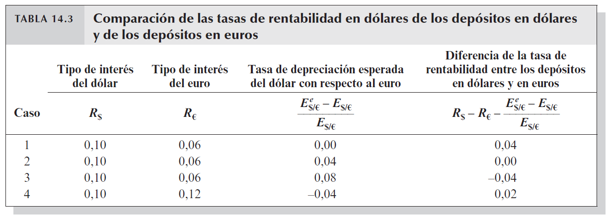
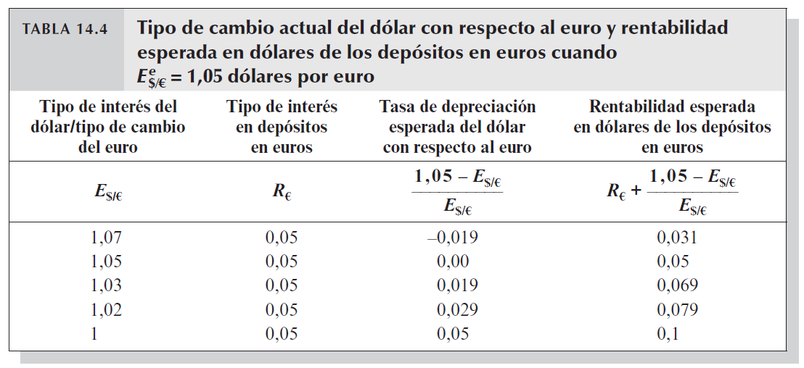
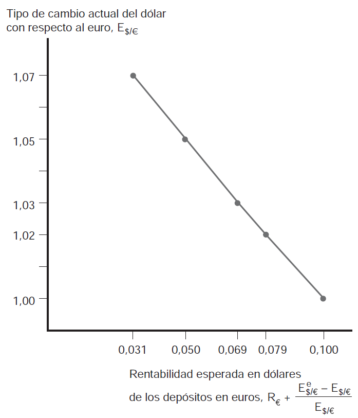
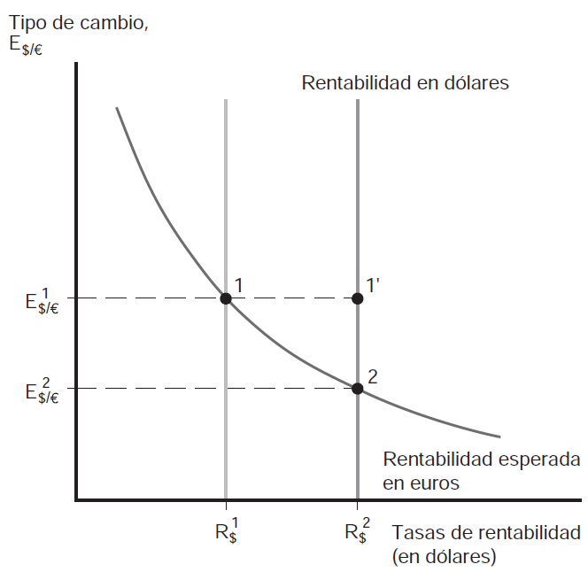
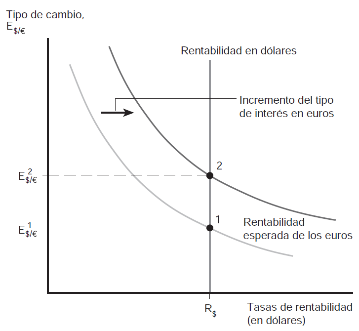

# **El mercado de divisas** {background="#4b6e5c"}

## Introducción al mercado de divisas

- El **mercado de divisas** (forex o FX) es donde se intercambian
  monedas de diferentes países
- Es el **mercado más grande del mundo**:
  - Volumen diario: > USD 7.5 billones (2022)
  - Opera 24 horas, 5 días a la semana
  - Principales centros: Londres, Nueva York, Tokio, Singapur
- Participantes:
  - Bancos comerciales y de inversión
  - Bancos centrales
  - Empresas multinacionales
  - Inversores institucionales
  - Especuladores

## ¿Por qué existe el mercado de divisas?

- **Comercio internacional:** exportadores e importadores necesitan
  cambiar monedas
- **Inversión extranjera:** inversores necesitan moneda local para
  comprar activos
- **Turismo:** viajeros necesitan moneda del país de destino
- **Especulación:** agentes buscan beneficiarse de movimientos del
  tipo de cambio
- **Cobertura (hedging):** empresas se protegen del riesgo cambiario

## El tipo de cambio: definiciones

- El **tipo de cambio** es el precio de una moneda en términos de otra
- Dos formas de expresarlo:
  - **Cotización directa:** unidades de moneda local por unidad de
    moneda extranjera
    - Ejemplo: $E = 900$ pesos por dólar
  - **Cotización indirecta:** unidades de moneda extranjera por unidad
    de moneda local
    - Ejemplo: $1/E = 0.00111$ dólares por peso
- En este curso usamos la **cotización directa**

## Apreciación vs Depreciación

| Movimiento | Significado | Ejemplo |
|------------|-------------|---------|
| **Apreciación** | Moneda local gana valor | E baja de 900 a 800 |
| **Depreciación** | Moneda local pierde valor | E sube de 900 a 1000 |

> **Atención:** Con cotización directa, si $E$ **sube**, el peso se
> **deprecia** (se necesitan más pesos por dólar). Si $E$ **baja**, el
> peso se **aprecia**.

## Tipos de cambio: bilateral vs efectivo

- **Tipo de cambio bilateral:** entre dos monedas específicas
  - Ejemplo: peso/dólar, peso/euro
- **Tipo de cambio efectivo (multilateral):** promedio ponderado
  contra varias monedas
  - Ponderadores: participación en comercio del país
  - Ejemplo: si Argentina comercia 60% con EEUU y 40% con Europa, el
    tipo de cambio efectivo pondera 60% peso/dólar y 40% peso/euro

## Tipo de cambio nominal vs real

- **Tipo de cambio nominal ($E$):** precio relativo de dos monedas
- **Tipo de cambio real ($q$):** precio relativo de bienes

\begin{equation}
q = \frac{E \times P^*}{P}
\end{equation}

- donde $P$ es nivel de precios local, $P^*$ es nivel de precios
  extranjero
- $q$ mide la **competitividad**: si $q$ sube, bienes locales son más
  baratos en términos relativos

## Ejemplo: tipo de cambio real

- Supongamos:
  - $E = 900$ pesos por dólar
  - Hamburguesa en Argentina: $P = 4500$ pesos
  - Hamburguesa en EEUU: $P^* = 5$ dólares
  
\begin{equation}
q = \frac{900 \times 5}{4500} = 1
\end{equation}

- Si $q = 1$: una hamburguesa cuesta lo mismo en ambos países
- Si $q > 1$: hamburguesas argentinas son relativamente **baratas**
- Si $q < 1$: hamburguesas argentinas son relativamente **caras**

# **Tipos de cambio y rentabilidad de los activos** {background="#4b6e5c"}

## El problema del inversor internacional

- Un inversor argentino tiene pesos y quiere maximizar su rendimiento
- Puede invertir en:
  - **Depósito en pesos** al tipo de interés $R_{ARS}$
  - **Depósito en dólares** al tipo de interés $R_{USD}$
- Pero para comparar, debe expresar todo en la **misma moneda**
- La rentabilidad del depósito en dólares depende no sólo de $R_{USD}$
  sino también de **cómo varíe el tipo de cambio**

## Tipo de cambio y rentabilidad de los activos

- Las tasas de interés ofrecidos por depósitos (activos) en pesos y en
  dólares nos dicen cómo variará su valor en pesos o en dólares
- Pero para saber qué nos conviene como inversores, debemos además
  tener en cuenta el tipo de cambio --o mejor dicho, **la variación
  del tipo de cambio**
- En otras palabras, lo que queremos saber es si utilizamos pesos para
  adquirir un activo en dólares cuántos pesos tendremos al cabo de un
  año
  
## Tipo de cambio y rentabilidad de los activos (cont.)

> De esta manera estamos calculando y comparando
> correctamente. Habremos calculado *la tasa de rentabilidad en pesos*
> de un depósito bancario en dólares. Es decir, habremos comparado el
> precio en pesos de hoy con su precio en pesos dentro de un año

## Ejemplo numérico paso a paso

- **Datos:**
  - Tipo de interés en pesos: $R_{ARS} = 10\%$ anual
  - Tipo de interés en dólares: $R_{USD} = 5\%$ anual
  - Tipo de cambio hoy: $E_0 = 1000$ pesos por dólar
  - Tipo de cambio esperado en un año: $E^e_1 = 1100$ pesos por dólar

## Ejemplo numérico: opción 1 (pesos)

**Invertir en pesos:**

1. Invierto 1000 pesos hoy
2. En un año tengo: $1000 \times (1 + 0.10) = 1100$ pesos

**Rentabilidad en pesos: 10%**

## Ejemplo numérico: opción 2 (dólares)

**Invertir en dólares:**

1. Cambio 1000 pesos a dólares: $1000 / 1000 = 1$ dólar
2. Invierto el dólar al 5% anual
3. En un año tengo: $1 \times (1.05) = 1.05$ dólares
4. Cambio a pesos: $1.05 \times 1100 = 1155$ pesos

**Rentabilidad en pesos:** $(1155 - 1000) / 1000 = 15.5\%$

## La fórmula de rentabilidad

- La rentabilidad en pesos de un depósito en dólares es
  **aproximadamente**:

\begin{equation}
R_{ARS}^{USD} \approx R_{USD} + \frac{E^e - E}{E}
\end{equation}

- En el ejemplo: $5\% + \frac{1100-1000}{1000} = 5\% + 10\% = 15\%$
- La aproximación funciona bien para tasas pequeñas

## Tipo de cambio y rentabilidad de los activos (cont.)

- Hay una regla sencilla que podemos usar para abreviar todos estos
  pasos. Primero definimos la **tasa de depreciación** del peso
  respecto al dólar como **el incremento porcentual del tipo de cambio
  del peso en relación con el dólar** durante un año
  - i.e. en el ejemplo anterior sería
    $\frac{(1100-1000)}{1000}=0.10$ o 10%

> La tasa de rentabilidad *en pesos* de los depósitos en dólares es
> aproximadamente el tipo de interés del dólar más la tasa de
> depreciación del peso con respecto al mismo

## Tipo de cambio y rentabilidad de los activos (cont.)

- Podemos poner esto en formato de ecuación:

\begin{equation}
R_{ARS}=R_{USD}+\frac{(E^{e}-E)}{E}
\end{equation}

- donde $R_{USD}$ es el tipo de interés actual aplicado a los depósitos
  en dólares; $E$ es el tipo de cambio actual (precio del
  dólar en términos de pesos); y $E^{e}$ es el tipo de
  cambio del peso con respecto al dólar *que se espera esté vigente*
  al cabo de un año
  
## Tipo de cambio y rentabilidad de los activos (cont.)

- El lado izquierdo es la *rentabilidad (en pesos) de los depósitos
  denominados en pesos* y el lado derecho es la *rentabilidad (en
  pesos) de los depósitos denominados en dólares*. Podemos también
  expresarlo: 
  
\begin{equation}
R_{ARS}-\left[R_{USD}+\frac{(E^{e}-E)}{E}\right]=R_{ARS}-R_{USD}-\frac{(E^{e}-E)}{E}
\end{equation}

- si esta *diferencia es positiva* entonces los depósitos denominados
  en pesos ofrecen la tasa de rentabilidad más elevada; si la
  *diferencia es negativa* entonces los depósitos denominados en dólares
  dan la tasa de rentabilidad más elevada
  
## Tipo de cambio y rentabilidad de los activos (cont.)

{fig-align="center"}

## El rol de las expectativas

> **Caja de intuición:** La rentabilidad de invertir en dólares depende
> crucialmente de lo que **esperamos** que ocurra con el tipo de
> cambio. Si esperamos que el peso se deprecie mucho, el dólar se
> vuelve más atractivo aunque pague menor interés. Las expectativas
> sobre el futuro afectan las decisiones de hoy.

# **Equilibrio en el mercado de divisas** {background="#4b6e5c"}

## Equilibrio en el mercado de divisas

- Nos interesa conocer cómo se determinan los tipos de cambio en el
  mercado $\longrightarrow$ suponemos dado por ahora el tipo de cambio
  futuro esperado, $E^{e}$

> **Equilibrio en el mercado de divisas.** El mercado cambiario se
> encuentra en equilibrio cuando los depósitos de todas las divisas
> ofrecen la misma tasa de rentabilidad esperada. 

- esta condición se denomina **condición de paridad de intereses**
  [¿por qué? ¿qué pasaría si las rentabilidades fueran diferentes?]

## Paridad de intereses: la condición clave

\begin{equation}
R_{ARS} = R_{USD} + \frac{E^e - E}{E}
\end{equation}

- Esta condición establece que en equilibrio **no hay oportunidades de
  arbitraje**
- Si no se cumple, los inversores moverían fondos de una moneda a otra
  hasta que se restablezca

## Equilibrio en el mercado de divisas (cont.)

- En otras palabras, el equilibrio se da cuando desaparecen los
  **excesos de oferta** y **excesos de demanda** de depósitos en
  diferentes monedas
  - suponga que el tipo de interés de un activo denominado en
    pesos es del $10%$, el tipo de interés de un activo denominado
    en dólares es del $6%$, y se espera una depreciación del peso del
    $8%$
	- nadie querrá mantener activos en pesos (exceso de oferta de
      depósitos en pesos) y todos querrán mantener activos en dólares
      (exceso de demanda de depósitos en dólares)
- Recuerde que las tasas de rentabilidad esperada son iguales cuando
  $R_{ARS}=R_{USD}+\frac{(E^{e}-E)}{E}$

## ¿Qué pasa si no hay equilibrio?

| Situación | Acción de inversores | Resultado |
|-----------|---------------------|-----------|
| Rend. pesos > Rend. dólares | Compran pesos, venden dólares | Peso se aprecia (E baja) |
| Rend. pesos < Rend. dólares | Venden pesos, compran dólares | Peso se deprecia (E sube) |

- El tipo de cambio se ajusta hasta que las rentabilidades se igualan
  
## Equilibrio en el mercado de divisas (cont.)

> **Mecanismo de ajuste.** De la ecuación de la paridad de intereses
> se deduce que cuando los depósitos en pesos ofrecen una
> rentabilidad mayor a los depósitos en dólares, **el peso se aprecia
> con respecto al dólar** dado que los inversores se deshacen de sus
> depósitos en dólares (ofrecen más dólares) y los convierten a depósitos
> en pesos (demandan más pesos)

- esta es la forma e intuición correcta de interpretar esta ecuación y
  condición

## Paridad cubierta vs descubierta

- **Paridad descubierta de intereses (UIP):** usa el tipo de cambio
  **esperado** $E^e$
  - Implica tomar riesgo cambiario
  
\begin{equation}
R_{ARS} = R_{USD} + \frac{E^e - E}{E}
\end{equation}

- **Paridad cubierta de intereses (CIP):** usa el tipo de cambio
  **forward** $F$ (contratado hoy para entrega futura)
  - Elimina el riesgo cambiario
  
\begin{equation}
R_{ARS} = R_{USD} + \frac{F - E}{E}
\end{equation}
  
## Variación del tipo de cambio y rentabilidad esperada

- Recordemos el supuesto de que el tipo de cambio futuro esperado está
  dado. Si la moneda local (peso) se deprecia hoy, esto implica que el
  rendimiento esperado de los depósitos en dólares **disminuye**; la
  apreciación de la moneda local aumenta el rendimiento esperado de los
  depósitos en dólares
- Ejemplo $\longrightarrow$ suponga que dado un tipo de cambio futuro
  esperado de $E^e = 1050$, el tipo de cambio actual pasa de $1000$ a
  $1030$; según la fórmula la tasa de depreciación esperada será de
  $1.9\%$ y no de $5\%$;
  - si la tasa de interés de los depósitos en dólares no cambia entonces
    la tasa de depreciación de la moneda local se ha reducido
	- por lo que esto reduce el rendimiento esperado de los depósitos
      en dólares!
  
## Variación del tipo de cambio y rentabilidad esperada (cont.)

{fig-align="center"}

## Variación del tipo de cambio y rentabilidad esperada (cont.)

> **¿Contraintuitivo?** Puede parecer contraintuitivo. Pero piense en
> lo que está pasando. Estamos suponiendo **dados el tipo de cambio
> futuro esperado y la tasa de interés de los depósitos en dólares**, en
> ese caso una depreciación (repentina) de la moneda local implica que
> el peso ahora **necesita depreciarse menos** para alcanzar un nivel
> dado de rentabilidad esperada en el futuro. 

- En otras palabras, una depreciación *presente* del peso que no afecte
  el valor del tipo de cambio *futuro* esperado ni la tasa de interés
  de los depósitos en dólares $\longrightarrow$ hace que los depósitos
  en dólares se vuelvan menos atractivos

## Intuición gráfica

- **Eje vertical:** tipo de cambio $E$ (pesos por dólar)
- **Eje horizontal:** tasa de rentabilidad
- Rentabilidad de pesos: línea vertical (no depende de $E$)
- Rentabilidad de dólares: curva con pendiente negativa
  - A mayor $E$ hoy (más depreciado), menor depreciación esperada,
    menor rentabilidad del dólar

## Variación del tipo de cambio y rentabilidad esperada (cont.)

{fig-align="center"}

## Tipo de cambio de equilibrio

- Spoiler $\longrightarrow$ los **tipos de cambio siempre se ajustarán
  de forma que se cumpla la condición de la paridad de intereses**
  - continuamos con supuestos anteriores (tipo de cambio futuro
    esperado y tasas de interés externa dados)
- La figura siguiente muestra el esquema gráfico usado para entender
  la determinación del tipo de cambio de equilibrio
  
## Tipo de cambio de equilibrio (cont.)

{fig-align="center"}

## Tipo de cambio de equilibrio (cont.)

- Recta vertical $\longrightarrow$ representa **rentabilidad de
  depósitos en pesos** (para una $R_{ARS}$ dada)
- Función de pendiente negativa $\longrightarrow$ relación entre
  **rentabilidad (en pesos) esperada de depósitos en dólares** y **el
  tipo de cambio del peso respecto del dólar**
- En el equilibrio, $E^{1}$ dado en el punto 1 se cumple la
  **condición de la paridad de intereses**
  - ¿qué pasaría si el tipo de cambio estuviera en punto 2?
    rentabilidad de depósitos en dólares sería menor a la de depósitos
    en pesos $\longrightarrow$ agentes venden dólares y compran
    pesos $\longrightarrow$ apreciación del peso (cae el tipo de cambio)

# **Estática comparativa** {background="#4b6e5c"}

## Tipo de interés, expectativas y equilibrio

- Podemos preguntarnos cómo cambia el equilibrio cuando cambian: a) el
  tipo de interés; b) las expectativas sobre el futuro
  1. Variaciones del tipo de interés local $\longrightarrow$ en diarios y
     redes se suele leer "BCRA sube el tipo de interés y el peso se
     fortalece" --un aumento del tipo de interés local provoca una
     **apreciación del peso** [¿mecanismo?] 
  2. Variaciones del tipo de interés extranjero $\longrightarrow$ un
     aumento del tipo de interés extranjero provoca que se desplace la
     curva de pendiente negativa a la derecha --**depreciación del peso**
- De esta manera pueden comprenderse los mecanismos que se activan
     cuando hay variaciones de algunas variables claves

## Efecto de aumento del tipo de interés local

```{mermaid}
%%| fig-align: center
%%{init: {'theme': 'base', 'themeVariables': { 'fontSize': '15px'}}}%%
flowchart TB
    A["<b>↑ R_ARS</b><br/>(BCRA sube tasa)"] --> B["Depósitos en pesos<br/>más atractivos"]
    B --> C["Inversores venden dólares,<br/>compran pesos"]
    C --> D["↑ Demanda de pesos<br/>↓ Demanda de dólares"]
    D --> E["<b>Peso se APRECIA</b><br/>(E baja)"]
    
    style A fill:#d4edda,stroke:#28a745
    style E fill:#cce5ff,stroke:#004085
```

## Efecto de aumento del tipo de interés externo

```{mermaid}
%%| fig-align: center
%%{init: {'theme': 'base', 'themeVariables': { 'fontSize': '15px'}}}%%
flowchart TB
    A["<b>↑ R_USD</b><br/>(Fed sube tasa)"] --> B["Depósitos en dólares<br/>más atractivos"]
    B --> C["Inversores venden pesos,<br/>compran dólares"]
    C --> D["↓ Demanda de pesos<br/>↑ Demanda de dólares"]
    D --> E["<b>Peso se DEPRECIA</b><br/>(E sube)"]
    
    style A fill:#d4edda,stroke:#28a745
    style E fill:#f8d7da,stroke:#721c24
```
 
## Tipo de interés, expectativas y equilibrio (cont.)

{fig-align="center"}

## Tipo de interés, expectativas y equilibrio (cont.)

{fig-align="center"}

## Efecto de cambio en expectativas

- ¿Qué pasa si cambia $E^e$ (expectativa sobre tipo de cambio futuro)?
- Si los inversores **esperan mayor depreciación** ($E^e$ sube):
  - La rentabilidad esperada de depósitos en dólares aumenta
  - Inversores compran dólares hoy
  - El peso se deprecia **hoy**
  
> **Profecías autocumplidas:** Si todos esperan que el peso se
> deprecie, venden pesos hoy, y el peso efectivamente se deprecia. Las
> expectativas pueden volverse "autocumplidas".

## Resumen de efectos

| Shock | Efecto sobre E | Interpretación |
|-------|----------------|----------------|
| ↑ $R_{ARS}$ | ↓ (apreciación) | Peso más atractivo |
| ↑ $R_{USD}$ | ↑ (depreciación) | Dólar más atractivo |
| ↑ $E^e$ | ↑ (depreciación) | Expectativa de depreciación |
| ↑ Riesgo país | ↑ (depreciación) | Menos confianza en peso |

## Ejemplo: política monetaria y tipo de cambio

- **Marzo 2024:** El BCRA sube la tasa de interés de referencia
- **Efecto esperado según el modelo:**
  - Mayor rentabilidad de depósitos en pesos
  - Apreciación del peso
- **Pero también importan las expectativas:**
  - Si el mercado interpreta la suba como señal de problemas...
  - Podría aumentar la desconfianza y generar depreciación
- La **credibilidad** del banco central es crucial

# **Conceptos adicionales** {background="#4b6e5c"}

## Mercado spot vs forward

- **Mercado spot (contado):** entrega inmediata (T+2)
  - Tipo de cambio: $E$ (spot rate)
- **Mercado forward (a plazo):** entrega futura acordada hoy
  - Tipo de cambio: $F$ (forward rate)
  - Se acuerda hoy el precio para intercambiar en 30, 90, 180 días
- **Prima/descuento forward:**

\begin{equation}
\text{Prima forward} = \frac{F - E}{E} \times \frac{360}{n}
\end{equation}

## ¿Para qué sirve el mercado forward?

> **Ejemplo:** Un importador argentino debe pagar USD 100,000 en 90
> días. Si hoy $E = 900$ pero teme que suba, puede comprar dólares
> forward a $F = 920$. Así fija su costo en 92 millones de pesos,
> independientemente de lo que pase con el tipo de cambio. Esto es
> **cobertura (hedging)**.

## Carry trade

- **Carry trade:** estrategia de pedir prestado en moneda con baja tasa
  e invertir en moneda con alta tasa
- Ejemplo: pedir en yenes (tasa ~0%), invertir en pesos (tasa ~50%)
- **Riesgo:** si el peso se deprecia más de lo esperado, se pierde
- Esta estrategia es **rentable mientras la paridad de intereses no se
  cumpla exactamente**
- Muy común en mercados emergentes con altas tasas

## ¿Por qué la paridad puede no cumplirse exactamente?

1. **Costos de transacción:** comisiones, spreads
2. **Riesgo de default:** riesgo de que el país no pague
3. **Riesgo político:** controles de capital, corralito
4. **Riesgo de liquidez:** dificultad para entrar/salir del mercado
5. **Información asimétrica:** no todos tienen la misma información

## El riesgo país

- Los inversores requieren una **prima de riesgo** para invertir en
  países con mayor incertidumbre
- Se mide con el **EMBI (Emerging Markets Bond Index)**
  - Diferencia entre rendimiento de bonos del país y bonos del Tesoro
    de EEUU
- Argentina históricamente ha tenido uno de los EMBI más altos
- Alto riesgo país = altas tasas de interés necesarias para atraer
  capital

# **Resumen del capítulo** {background="#4b6e5c"}

## Conceptos clave

1. **Tipo de cambio nominal:** precio de una moneda en términos de otra
2. **Tipo de cambio real:** $q = EP^*/P$
3. **Paridad de intereses:** $R = R^* + (E^e - E)/E$
4. **Equilibrio:** rentabilidades esperadas iguales
5. **Efectos:** ↑R local → apreciación; ↑R externo → depreciación

## Fórmulas importantes

| Concepto | Fórmula |
|----------|---------|
| Tipo de cambio real | $q = \frac{E \times P^*}{P}$ |
| Rentabilidad en pesos de USD | $R_{ARS}^{USD} \approx R_{USD} + \frac{E^e - E}{E}$ |
| Paridad de intereses | $R_{ARS} = R_{USD} + \frac{E^e - E}{E}$ |
| Prima forward | $\frac{F - E}{E} \times \frac{360}{n}$ |

## Preguntas de repaso

1. ¿Por qué una depreciación presente del peso reduce la rentabilidad
   esperada de los dólares (dado $E^e$ fijo)?
2. Si la Fed sube la tasa de interés, ¿qué pasa con el peso?
3. ¿Qué diferencia hay entre paridad cubierta y descubierta?
4. ¿Por qué el carry trade puede ser riesgoso?
5. ¿Cómo afecta el riesgo país al tipo de cambio?
