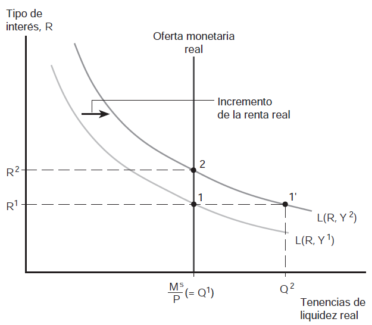
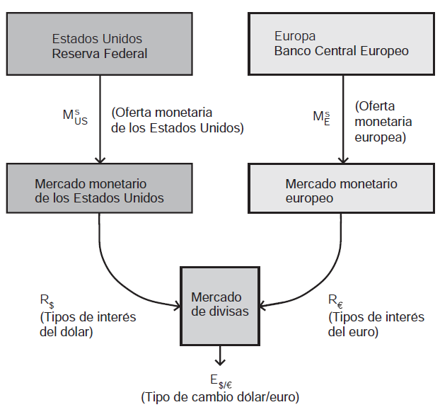
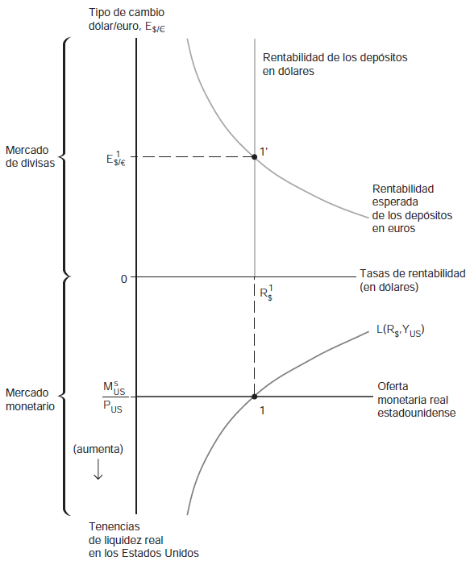
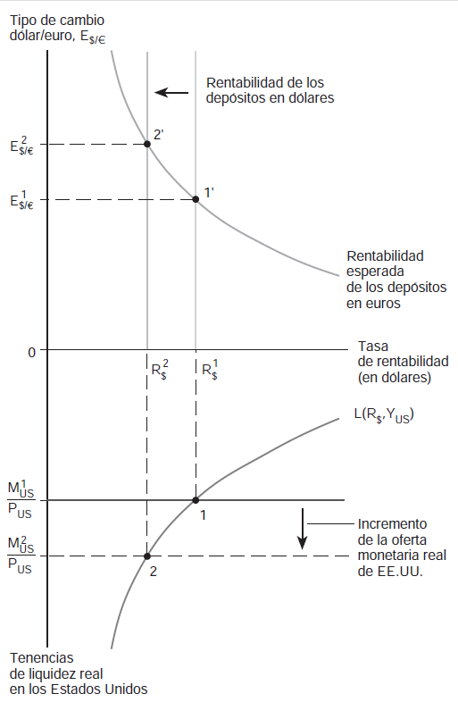
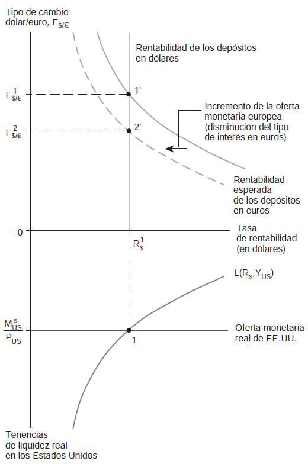
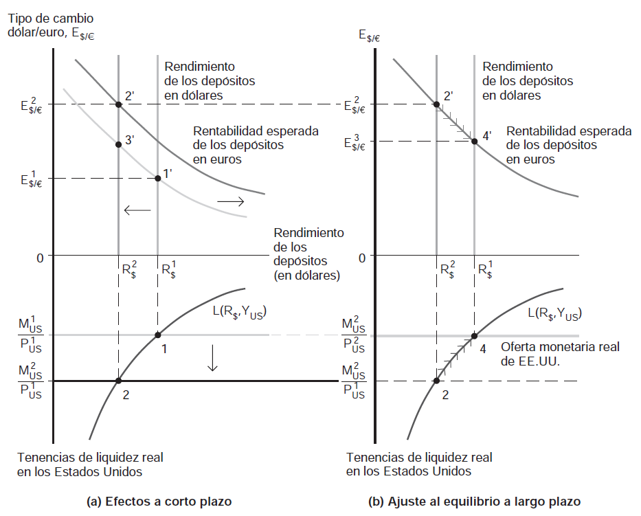
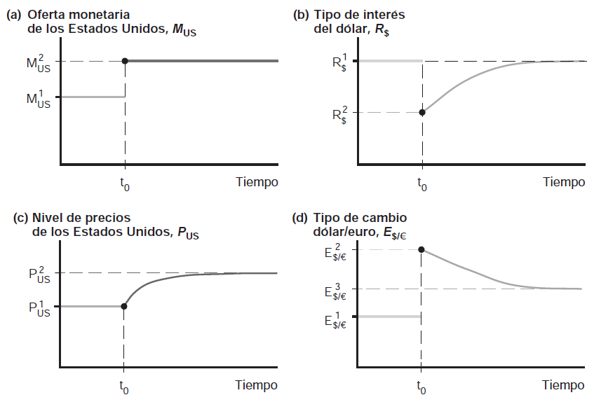

---
title: Dinero, tasas de interés y tipos de cambio
subtitle: Comercio y Finanzas Internacionales
---

# **El dinero: definición y funciones** {background="#4b6e5c"}

## ¿Qué es el dinero?

- El **dinero** es un activo ampliamente aceptado como medio de pago
  - es el activo más **líquido** $\longrightarrow$ puede intercambiarse
    directamente por bienes y servicios sin costos de transacción
- El dinero cumple 3 (tres) funciones esenciales:
  1. **Medio de cambio** $\longrightarrow$ elimina necesidad de doble
     coincidencia de deseos (trueque)
  2. **Unidad de cuenta** $\longrightarrow$ permite expresar precios de
     bienes y servicios en una unidad común
  3. **Depósito de valor** $\longrightarrow$ permite transferir poder
     adquisitivo del presente al futuro

## ¿Qué es el dinero? (cont.)

- La función de **medio de cambio** es la más importante
  - sin dinero, el intercambio requiere **trueque** $\longrightarrow$
    doble coincidencia de deseos (yo quiero lo que tienes y tú quieres
    lo que tengo)
  - el dinero elimina esta fricción y facilita el comercio
- La función de **unidad de cuenta** simplifica el cálculo económico
  - sin dinero, necesitaríamos $N(N-1)/2$ precios relativos para $N$
    bienes
  - con dinero, sólo necesitamos $N$ precios

## ¿Qué activos funcionan como dinero?

- Históricamente, diversos activos han funcionado como dinero
  - metales preciosos (oro, plata)
  - monedas acuñadas
  - billetes de banco
  - depósitos bancarios
- En las economías modernas, el dinero incluye:
  - **Efectivo (circulante)** $\longrightarrow$ billetes y monedas en
    manos del público
  - **Depósitos a la vista** $\longrightarrow$ cuentas corrientes en
    bancos comerciales (transferibles por cheque o electrónicamente)

## Agregados monetarios

- Los bancos centrales definen diferentes **agregados monetarios**:
  - **M1** $\longrightarrow$ efectivo + depósitos a la vista (dinero
    más líquido)
  - **M2** $\longrightarrow$ M1 + depósitos de ahorro + depósitos a
    plazo pequeños
  - **M3** $\longrightarrow$ M2 + depósitos a plazo grandes + otros
    instrumentos
- La **oferta monetaria, $M^{s}$** se refiere típicamente a M1 o M2
  - controlada (principalmente) por el **banco central** a través de:
    - operaciones de mercado abierto
    - tasa de encaje (reservas requeridas)
    - tasa de descuento (préstamos a bancos)

# **La demanda de dinero** {background="#4b6e5c"}

## Demanda individual de dinero

- ¿Cuánto dinero desea mantener un individuo?
- Los individuos mantienen dinero por tres **motivos**:
  1. **Motivo transacciones** $\longrightarrow$ para realizar compras
     planeadas de bienes y servicios
  2. **Motivo precaución** $\longrightarrow$ para gastos imprevistos
  3. **Motivo especulación** $\longrightarrow$ como alternativa a otros
     activos financieros

## Demanda individual de dinero (cont.)

- La demanda de dinero implica un **trade-off**:
  - Mantener dinero proporciona **liquidez** (facilidad de transacción)
  - Pero mantener dinero tiene un **costo de oportunidad**
    $\longrightarrow$ el interés que se podría ganar invirtiendo en
    otros activos (bonos, depósitos a plazo)
- Este trade-off implica que la demanda de dinero depende del **tipo de
  interés, $R$**
  - a mayor $R$, mayor costo de oportunidad de mantener dinero
  - por lo tanto, menor demanda de dinero

## Factores que afectan la demanda de dinero

- La demanda de dinero de un individuo depende de:
  1. **Tipo de interés, $R$** $\longrightarrow$ costo de oportunidad
     - relación negativa: $\uparrow R \Rightarrow \downarrow M^{d}$
  2. **Nivel de precios, $P$** $\longrightarrow$ a mayor $P$, se
     necesita más dinero nominal para las mismas transacciones
     - relación positiva: $\uparrow P \Rightarrow \uparrow M^{d}$
  3. **Ingreso real, $Y$** $\longrightarrow$ a mayor ingreso, mayor
     volumen de transacciones
     - relación positiva: $\uparrow Y \Rightarrow \uparrow M^{d}$

## Demanda agregada de dinero

- La **demanda agregada de dinero** es la suma de las demandas
  individuales
- Puede expresarse como:

\begin{equation}
M^{d}=P \times L(R,Y)
\end{equation}

- donde $L(R,Y)$ es la **demanda de saldos reales** (o de dinero real)
  - mide la cantidad de **poder adquisitivo** que los agentes desean
    mantener en forma líquida
  - $L$ es decreciente en $R$: $\frac{\partial L}{\partial R}<0$
  - $L$ es creciente en $Y$: $\frac{\partial L}{\partial Y}>0$

## Demanda agregada de dinero (cont.)

- La función $L(R,Y)$ puede tomar diferentes formas específicas
- Una especificación común es la forma **lineal**:

\begin{equation}
L(R,Y)=kY-hR
\end{equation}

- donde $k>0$ mide la sensibilidad de la demanda de dinero al ingreso y
  $h>0$ mide la sensibilidad al tipo de interés
- Otra especificación común es la forma **log-lineal**:

\begin{equation}
\ln L=\alpha + \beta \ln Y - \gamma R
\end{equation}

- donde $\beta$ es la elasticidad-ingreso y $\gamma$ es la
  semi-elasticidad-interés de la demanda de dinero

## Demanda de saldos reales

- Reordenando la ecuación de demanda de dinero:

\begin{equation}
\frac{M^{d}}{P}=L(R,Y)
\end{equation}

- El lado izquierdo es la **demanda de saldos reales** (o dinero real)
  - mide el poder adquisitivo demandado, no la cantidad nominal de
    dinero
- Esta formulación implica **homogeneidad de grado uno en precios**:
  - si $P$ se duplica, $M^{d}$ también se duplica
  - los agentes se preocupan por el valor real del dinero, no el
    nominal

# **El equilibrio en el mercado monetario** {background="#4b6e5c"}

## Determinación del tipo de interés de equilibrio

- El mercado monetario está en equilibrio cuando la **oferta de dinero
  iguala a la demanda de dinero**:

\begin{equation}
M^{s}=M^{d}=P \times L(R,Y)
\end{equation}

- Reordenando, obtenemos la condición de equilibrio en términos de
  saldos reales:

\begin{equation}
\frac{M^{s}}{P}=L(R,Y)
\end{equation}

> El tipo de interés de equilibrio es aquel que iguala la oferta real
> de dinero ($M^{s}/P$) con la demanda real de dinero $L(R,Y)$

## Determinación del tipo de interés de equilibrio (cont.)

- Gráficamente:
  - La **oferta real de dinero** es una línea vertical (controlada por
    el banco central, dado $P$)
  - La **demanda real de dinero** es una curva con pendiente negativa
    (respecto a $R$)
  - El equilibrio se encuentra en la intersección

## Mecanismo de ajuste al equilibrio

- ¿Cómo se ajusta el mercado al equilibrio?
- **Exceso de oferta de dinero** (si $R$ es muy alto):
  - demanda de dinero es baja (agentes prefieren bonos)
  - agentes usan el exceso de dinero para comprar bonos
  - sube el precio de los bonos $\longrightarrow$ baja el tipo de
    interés
- **Exceso de demanda de dinero** (si $R$ es muy bajo):
  - demanda de dinero es alta (costo de oportunidad bajo)
  - agentes venden bonos para obtener más dinero
  - baja el precio de los bonos $\longrightarrow$ sube el tipo de
    interés

## Mecanismo de ajuste al equilibrio (cont.)

> **Relación inversa entre precio de bonos y tipo de interés.** Un bono
> promete pagar un valor fijo $F$ al vencimiento. Si el precio actual
> del bono es $P_{B}$, la rentabilidad es $R=\frac{F-P_{B}}{P_{B}}$.
> Cuando $P_{B}$ sube, $R$ baja y viceversa

- Este mecanismo de ajuste asegura que el mercado monetario siempre
  tiende hacia el equilibrio

## Efectos de cambios en la oferta monetaria

- ¿Qué sucede si el banco central **aumenta $M^{s}$**?
  - A corto plazo (con $P$ fijo) $\longrightarrow$ aumenta $M^{s}/P$
  - Hay exceso de oferta de dinero al tipo de interés inicial
  - Agentes compran bonos $\longrightarrow$ sube precio de bonos
  - **Cae el tipo de interés** hasta que $L(R,Y)=M^{s}/P$

> Un **aumento de la oferta monetaria reduce el tipo de interés de
> equilibrio**; una **reducción de la oferta monetaria aumenta el tipo
> de interés de equilibrio**

## Efectos de cambios en la oferta monetaria (cont.)

- Este efecto sobre el tipo de interés se conoce como **efecto
  liquidez**
  - más dinero en la economía $\longrightarrow$ dinero es más "barato"
    (menor tipo de interés)
- Pero este efecto es de **corto plazo**:
  - supone que el nivel de precios $P$ está fijo
  - en el largo plazo, $P$ se ajusta y el efecto puede revertirse
  - veremos esto con más detalle más adelante

## Efectos de cambios en el ingreso

- ¿Qué sucede si aumenta el **ingreso real $Y$**?
  - Aumenta la demanda de dinero $L(R,Y)$ (motivo transacciones)
  - Hay exceso de demanda de dinero al tipo de interés inicial
  - Agentes venden bonos $\longrightarrow$ baja precio de bonos
  - **Sube el tipo de interés** hasta restaurar el equilibrio

> Un **aumento del ingreso real aumenta el tipo de interés de
> equilibrio** (dado $M^{s}$ y $P$)

## Aumento del ingreso

{fig-align="center" width="70%"}

## Aumento del ingreso (cont.)

- La figura muestra el mercado de dinero con oferta real fija
- Equilibrio inicial (punto 1) con ingreso Y1, tipo de interes R1
- Si Y sube, la curva de demanda se desplaza a la derecha
- Nuevo equilibrio (punto 2): el tipo de interes sube a R2

# **La oferta monetaria y el tipo de cambio a corto plazo** {background="#4b6e5c"}

## Vinculación mercado monetario y divisas

- Hemos visto cómo se determina el tipo de interés en el mercado
  monetario
- También sabemos (de temas anteriores) que el tipo de cambio depende
  del tipo de interés vía la **paridad de intereses**:

\begin{equation}
R=R^{*}+\frac{E^{e}-E}{E}
\end{equation}

- donde $R$ es el tipo de interés local, $R^{*}$ es el extranjero, $E$
  es el tipo de cambio, y $E^{e}$ es el tipo de cambio esperado

## Vinculación mercado monetario y divisas (cont.)

- Podemos combinar ambas condiciones:
  1. Equilibrio mercado monetario: $M^{s}/P=L(R,Y)$
  2. Paridad de intereses: $R=R^{*}+\frac{E^{e}-E}{E}$
- Esto nos da un sistema de dos ecuaciones que determina simultáneamente
  $R$ y $E$
- **Mecanismo:**
  - Cambios en $M^{s}$ afectan $R$
  - Cambios en $R$ afectan $E$ vía paridad de intereses

## Interacción de mercados

{fig-align="center" width="70%"}

## Interacción de mercados (cont.)

- El diagrama muestra cómo se conectan los mercados de ambos países
- Los bancos centrales controlan las ofertas monetarias
- Cada mercado monetario determina su tipo de interés
- Ambos tipos de interés fluyen hacia el mercado de divisas

## Equilibrio simultáneo

{fig-align="center" width="65%"}

## Equilibrio simultáneo (cont.)

- Dos cuadrantes muestran el equilibrio conjunto
- El cuadrante superior muestra el mercado de divisas
- El cuadrante inferior muestra el mercado monetario de EE.UU.
- La línea vertical punteada conecta ambos equilibrios

## Efectos de un aumento de OM sobre E

1. Banco central aumenta $M^{s}$
2. Exceso de oferta de dinero $\longrightarrow$ cae $R$
3. Si $R<R^{*}+\frac{E^{e}-E}{E}$, depósitos en moneda extranjera son
   más atractivos
4. Agentes venden moneda local y compran moneda extranjera
5. **Se deprecia la moneda local** (sube $E$)
6. La depreciación continúa hasta que se restablece la paridad de
   intereses

## Efectos de un aumento de OM sobre E (cont.)

> **Resultado clave.** A corto plazo (con $P$ fijo), un aumento de la
> oferta monetaria reduce el tipo de interés y deprecia la moneda local

- Este es el mecanismo básico de transmisión de la política monetaria en
  economía abierta
- Explica por qué los anuncios del banco central afectan inmediatamente
  el tipo de cambio

## Aumento de Ms en EE.UU.

{fig-align="center" width="60%"}

## Aumento de Ms en EE.UU. (cont.)

- La figura muestra el efecto de un aumento de la oferta monetaria de EE.UU.
- Cuadrante inferior: la oferta monetaria real aumenta, cae el tipo de interes
- Cuadrante superior: la curva de rentabilidad de dolares se desplaza
- Resultado: el dolar se deprecia

## Aumento de Ms en Europa

{fig-align="center" width="60%"}

## Aumento de Ms en Europa (cont.)

- Un aumento de la oferta monetaria europea reduce el tipo de interes del euro
- La curva de rentabilidad esperada de euros se desplaza a la izquierda
- El tipo de cambio baja: el dolar se aprecia
- Simetria: expansion monetaria deprecia la propia moneda

## El papel de las expectativas

- Las **expectativas** juegan un rol crucial
- El tipo de cambio de hoy depende del tipo de cambio **esperado**
  futuro, $E^{e}$
- Si los agentes esperan que la moneda se deprecie en el futuro:
  - exigen mayor tipo de interés local para mantener activos en moneda
    local
  - o la moneda se deprecia hoy
- Las expectativas pueden ser **autocumplidas**:
  - si todos esperan depreciación $\longrightarrow$ venden moneda local
    $\longrightarrow$ depreciación

# **Dinero, nivel de precios y tipo de cambio a largo plazo** {background="#4b6e5c"}

## El largo plazo: precios flexibles

- Hasta ahora supusimos que el nivel de precios $P$ está **fijo** (corto
  plazo)
- En el **largo plazo**, los precios son **flexibles**:
  - se ajustan para equilibrar el mercado de bienes
  - se cumple la **neutralidad del dinero**
- El nivel de precios de largo plazo se determina por:

\begin{equation}
P=\frac{M^{s}}{L(R,Y)}
\end{equation}

## Neutralidad del dinero en el largo plazo

> **Neutralidad del dinero.** En el largo plazo, un aumento de la
> oferta monetaria no tiene efectos sobre variables reales (producción,
> empleo, tipo de cambio real, tipo de interés real) --sólo afecta
> variables nominales (precios, salarios nominales, tipo de cambio
> nominal)

- Intuición: si todos los precios (incluyendo salarios) aumentan
  proporcionalmente, los precios relativos no cambian

## Efecto de largo plazo de un aumento en $M^{s}$

- Si $M^{s}$ aumenta permanentemente:
  - **Largo plazo:** $P$ aumenta proporcionalmente
  - $M^{s}/P$ vuelve a su nivel inicial
  - $R$ vuelve a su nivel inicial
  - Pero el **tipo de cambio nominal** $E$ aumenta proporcionalmente
- Esto es consistente con la **Paridad del Poder Adquisitivo (PPA)**:

\begin{equation}
E=\frac{P}{P^{*}}
\end{equation}

## Efecto de largo plazo de un aumento en $M^{s}$ (cont.)

- Resumen de efectos de un aumento permanente de $M^{s}$:

| Variable           | Corto Plazo | Largo Plazo        |
|--------------------|-------------|--------------------|
| Nivel de precios P | Sin cambio  | Aumenta (prop.)    |
| Tipo de interés R  | Disminuye   | Sin cambio         |
| Tipo de cambio E   | Aumenta     | Aumenta (prop.)    |
| Tipo cambio real q | Aumenta     | Sin cambio         |

## Ajuste dinámico: del corto al largo plazo

- El ajuste del corto al largo plazo no es instantáneo
- **Secuencia de eventos:**
  1. Aumento de $M^{s}$ $\longrightarrow$ cae $R$, sube $E$
     (sobrerreacción)
  2. Precios comienzan a subir gradualmente
  3. $M^{s}/P$ comienza a caer $\longrightarrow$ $R$ comienza a subir
  4. A medida que $R$ sube, $E$ comienza a apreciarse
  5. Largo plazo: $P$ ha subido proporcionalmente, $R$ y $q$ vuelven a
     niveles iniciales

## Corto plazo vs. largo plazo

{fig-align="center" width="95%"}

## Corto plazo vs. largo plazo (cont.)

- Panel (a) muestra efectos a corto plazo con overshooting
- Panel (b) muestra ajuste al equilibrio de largo plazo
- En el largo plazo, el dinero es neutral para variables reales

## Trayectorias temporales

{fig-align="center" width="85%"}

## Trayectorias temporales (cont.)

- La figura muestra la dinamica temporal tras aumento permanente de Ms
- (a) Oferta monetaria: salta y permanece
- (b) Tipo de interes: cae y luego sube gradualmente
- (c) Nivel de precios: sube gradualmente
- (d) Tipo de cambio: overshooting inicial, luego apreciacion gradual

# **Inflación y dinámica del tipo de cambio** {background="#4b6e5c"}

## El tipo de interés y la inflación esperada

- Hasta ahora hemos trabajado con el **tipo de interés nominal**, $R$
- Debemos distinguir entre:
  - **Tipo de interés nominal, $R$** $\longrightarrow$ rendimiento en
    términos de dinero
  - **Tipo de interés real, $r$** $\longrightarrow$ rendimiento en
    términos de poder adquisitivo

\begin{equation}
r=R-\pi^{e}
\end{equation}

- donde $\pi^{e}$ es la tasa de inflación esperada

## El efecto Fisher

- La **ecuación de Fisher** establece:

\begin{equation}
R=r+\pi^{e}
\end{equation}

- Si el tipo de interés real está determinado por factores reales
  (productividad, ahorro), entonces:
  - un aumento de la inflación esperada $\longrightarrow$ aumento del
    tipo de interés nominal

> **Efecto Fisher.** Los tipos de interés nominales tienden a aumentar
> uno a uno con la inflación esperada, dejando inalterado el tipo de
> interés real

## El efecto Fisher en economía abierta

- Combinando el efecto Fisher con la paridad de intereses:

\begin{equation}
R-R^{*}=(r-r^{*})+(\pi^{e}-\pi^{*e})
\end{equation}

- Si los tipos de interés reales tienden a igualarse entre países (por
  movilidad de capital):

\begin{equation}
R-R^{*}=\pi^{e}-\pi^{*e}
\end{equation}

> El diferencial de tipos de interés nominales refleja el diferencial
> de inflación esperada

## El efecto Fisher en economía abierta (cont.)

- Implicancia importante:
  - Si Argentina tiene $R=40\%$ y EEUU tiene $R^{*}=5\%$
  - No significa que invertir en Argentina sea más rentable
  - El diferencial refleja expectativa de **mayor inflación** en
    Argentina
  - Y por la PPA, expectativa de **depreciación** del peso

## Tasa de crecimiento monetario e inflación

- En el largo plazo, la tasa de inflación está determinada por la tasa
  de crecimiento de la oferta monetaria
- De la ecuación de equilibrio del mercado monetario:

\begin{equation}
M^{s}=P \times L(R,Y)
\end{equation}

- Tomando tasas de crecimiento (aproximación):

\begin{equation}
\mu = \pi + \eta_{Y}g_{Y} - \eta_{R}\Delta R
\end{equation}

- donde $\mu$ es el crecimiento de $M^{s}$, $\pi$ es inflación, $g_{Y}$
  es crecimiento del PIB real

## Tasa de crecimiento monetario e inflación (cont.)

- En estado estacionario ($\Delta R=0$):

\begin{equation}
\pi = \mu - \eta_{Y}g_{Y}
\end{equation}

> La inflación de largo plazo es igual al crecimiento monetario menos
> el crecimiento del PIB real (ajustado por elasticidad-ingreso de
> demanda de dinero)

- Esta es la **teoría cuantitativa del dinero** en su versión moderna
- Explica por qué países con alto crecimiento monetario tienen alta
  inflación

## Inflación y tipo de cambio

- Combinando la teoría cuantitativa con la PPA relativa:

\begin{equation}
\frac{\Delta E}{E}=\pi-\pi^{*}=(\mu-\eta_{Y}g_{Y})-(\mu^{*}-\eta_{Y}^{*}g_{Y}^{*})
\end{equation}

- La **tasa de depreciación** del tipo de cambio depende de:
  - diferencial de crecimiento monetario
  - diferencial de crecimiento del PIB (ajustado)

> Países con mayor crecimiento monetario (relativo a crecimiento del
> PIB) tendrán mayor inflación y depreciación de su moneda

## Hiperinflación y tipo de cambio

- En **hiperinflaciones**, la relación dinero-precios-tipo de cambio se
  vuelve muy evidente
- Ejemplos históricos:
  - Alemania 1922-23
  - Zimbabwe 2007-08
  - Venezuela 2016-presente
- En estos casos:
  - el tipo de cambio se deprecia a tasas diarias/semanales
  - los precios se ajustan casi instantáneamente
  - la demanda de dinero colapsa (huida hacia dólares u otros activos)

# **Apéndice: Modelo formal del mercado monetario** {background="#4b6e5c"}

## Especificación matemática

- Función de demanda de dinero (forma Cagan):

\begin{equation}
\frac{M^{d}}{P}=Y^{\alpha}e^{-\beta R}
\end{equation}

- En logaritmos:

\begin{equation}
m-p=\alpha y - \beta R
\end{equation}

- donde $m=\ln M$, $p=\ln P$, $y=\ln Y$

## Equilibrio y determinación del tipo de interés

- Condición de equilibrio:

\begin{equation}
m^{s}-p=\alpha y - \beta R
\end{equation}

- Resolviendo para $R$:

\begin{equation}
R=\frac{1}{\beta}(\alpha y - m^{s} + p)
\end{equation}

- Estática comparativa:
  - $\frac{\partial R}{\partial m^{s}}=-\frac{1}{\beta}<0$
  - $\frac{\partial R}{\partial y}=\frac{\alpha}{\beta}>0$
  - $\frac{\partial R}{\partial p}=\frac{1}{\beta}>0$

## Velocidad del dinero

- La **velocidad del dinero**, $V$, mide cuántas veces circula cada
  unidad monetaria por año:

\begin{equation}
V=\frac{PY}{M}
\end{equation}

- De la ecuación cuantitativa: $MV=PY$
- La velocidad no es constante; depende de $R$, tecnología financiera,
  etc.
- En el modelo: $V=Y/L(R,Y)$
