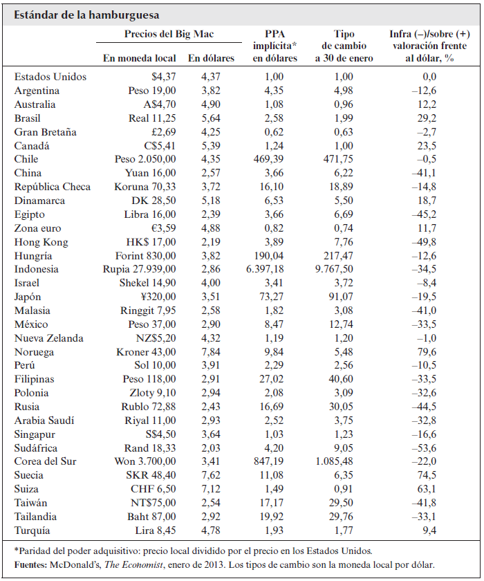
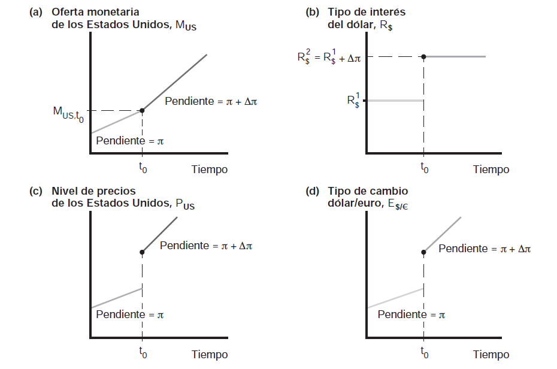
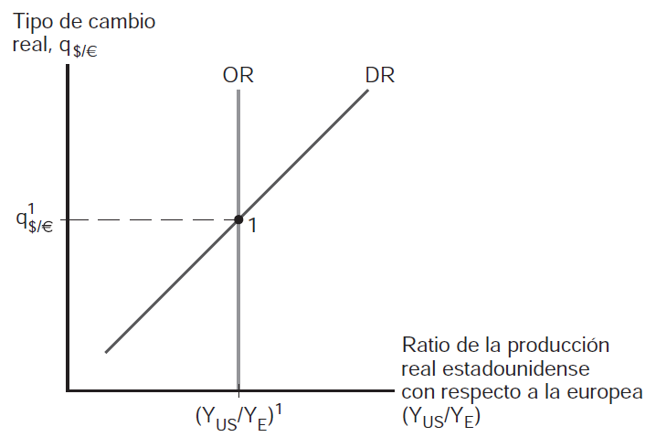
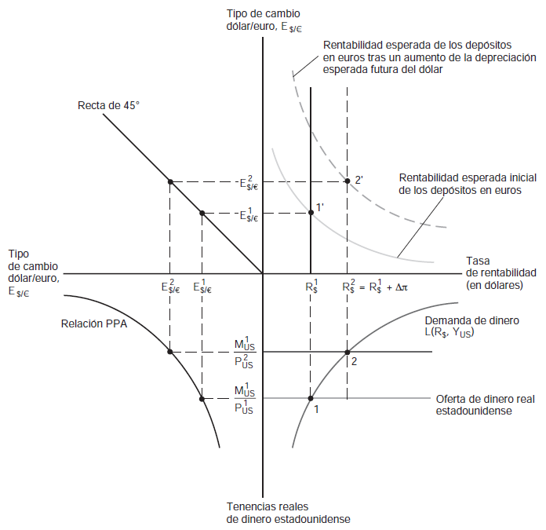

---
title: Niveles de precios y tipo de cambio en el largo plazo
subtitle: Comercio y Finanzas Internacionales
---

# **La ley del precio único** {background="#4b6e5c"}

## Introducción

- En el capítulo anterior vimos cómo el dinero afecta el tipo de cambio
  a corto y largo plazo
- Ahora profundizamos en la **determinación del tipo de cambio en el
  largo plazo**
- Pregunta central: ¿qué determina el valor de equilibrio del tipo de
  cambio cuando los precios se han ajustado completamente?

## La ley del precio único

- La **ley del precio único** establece que:

> En mercados competitivos, libres de costos de transporte y barreras
> comerciales, bienes idénticos vendidos en diferentes países deben
> tener el mismo precio cuando se expresan en una moneda común

- Formalmente, para el bien $i$:

\begin{equation}
P_{i}=E \times P_{i}^{*}
\end{equation}

## La ley del precio único (cont.)

- donde:
  - $P_{i}$ es el precio del bien $i$ en moneda local
  - $P_{i}^{*}$ es el precio del bien $i$ en moneda extranjera
  - $E$ es el tipo de cambio (unidades de moneda local por unidad de
    moneda extranjera)
- Ejemplo: si una camiseta cuesta $20 en EEUU y el tipo de cambio es
  $E=100$ pesos por dólar, la camiseta debería costar $2000 pesos en
  Argentina

## Arbitraje y la ley del precio único

- ¿Por qué debería cumplirse la ley del precio único?
- Por **arbitraje de bienes**:
  - Si $P_{i}>E \times P_{i}^{*}$: conviene comprar en el extranjero e
    importar $\longrightarrow$ presión a la baja sobre $P_{i}$
  - Si $P_{i}<E \times P_{i}^{*}$: conviene comprar localmente y
    exportar $\longrightarrow$ presión al alza sobre $P_{i}$
- El arbitraje continúa hasta que $P_{i}=E \times P_{i}^{*}$

## Limitaciones de la ley del precio único

- En la práctica, la ley del precio único **no se cumple exactamente**
- Razones:
  1. **Costos de transporte** $\longrightarrow$ trasladar bienes tiene
     costo
  2. **Barreras comerciales** $\longrightarrow$ aranceles, cuotas,
     regulaciones
  3. **Bienes no comerciables** $\longrightarrow$ servicios, bienes
     raíces
  4. **Diferenciación de productos** $\longrightarrow$ marcas,
     preferencias locales
  5. **Rigidez de precios** $\longrightarrow$ contratos, menúes

# **La paridad del poder adquisitivo (PPA)** {background="#4b6e5c"}

## De la ley del precio único a la PPA

- La **Paridad del Poder Adquisitivo (PPA)** extiende la ley del precio
  único a **canastas de bienes**
- Si la ley del precio único se cumple para todos los bienes, entonces
  también debe cumplirse para el nivel general de precios

## PPA absoluta

- La **PPA absoluta** establece:

\begin{equation}
P=E \times P^{*}
\end{equation}

- Reordenando:

\begin{equation}
E=\frac{P}{P^{*}}
\end{equation}

> El tipo de cambio entre dos monedas iguala la relación de los niveles
> de precios de ambos países

## PPA absoluta (cont.)

- Ejemplo numérico:
  - Canasta de bienes cuesta $10.000 pesos en Argentina
  - Misma canasta cuesta $100 dólares en EEUU
  - Tipo de cambio PPA: $E=\frac{10000}{100}=100$ pesos por dólar
- Si el tipo de cambio de mercado difiere del tipo de cambio PPA:
  - $E_{mercado}>E_{PPA}$: peso está **subvaluado**
  - $E_{mercado}<E_{PPA}$: peso está **sobrevaluado**

## El índice Big Mac

- The Economist publica el **Índice Big Mac** desde 1986
- Usa el precio de un Big Mac como "canasta" estandarizada
- Permite comparar si monedas están sobre/subvaluadas respecto a PPA
- Ejemplo (hipotético):
  - Big Mac en EEUU: $5
  - Big Mac en Argentina: $1500 pesos
  - Tipo de cambio PPA: $300 pesos por dólar
  - Si tipo de cambio mercado es $500: peso subvaluado 40%

## Indice Big Mac

{fig-align="center" width="55%"}

## Indice Big Mac (cont.)

- La tabla muestra precios del Big Mac en distintos paises
- Columna "PPA implicita" indica tipo de cambio segun ley precio unico
- Columna "Infra/sobre valoracion" compara con tipo de cambio de mercado
- Permite identificar monedas sub o sobrevaluadas respecto al dolar

## PPA relativa

- La PPA absoluta es muy estricta y raramente se cumple
- La **PPA relativa** es una versión más débil:

\begin{equation}
\frac{E_{t}-E_{t-1}}{E_{t-1}}=\pi_{t}-\pi_{t}^{*}
\end{equation}

> La **tasa de depreciación** del tipo de cambio iguala el
> **diferencial de tasas de inflación** entre los dos países

## PPA relativa (cont.)

- En otras palabras:
  - Si inflación local es mayor que inflación extranjera
    $\longrightarrow$ moneda local se deprecia
  - La depreciación compensa exactamente el diferencial de inflación
- Ejemplo:
  - Inflación en Argentina: 50% anual
  - Inflación en EEUU: 3% anual
  - Depreciación esperada del peso: 47% anual (aproximadamente)

## Derivación de la PPA relativa

- Partiendo de la PPA absoluta: $E=P/P^{*}$
- Tomando logaritmos: $\ln E = \ln P - \ln P^{*}$
- Diferenciando respecto al tiempo:

\begin{equation}
\frac{dE/dt}{E}=\frac{dP/dt}{P}-\frac{dP^{*}/dt}{P^{*}}
\end{equation}

- O en notación discreta aproximada:

\begin{equation}
\frac{\Delta E}{E} \approx \pi - \pi^{*}
\end{equation}

# **Modelo monetario a largo plazo** {background="#4b6e5c"}

## Combinando el enfoque monetario con la PPA

- Recordemos del capítulo anterior:
  - Equilibrio monetario local: $P=M^{s}/L(R,Y)$
  - Equilibrio monetario extranjero: $P^{*}=M^{s*}/L^{*}(R^{*},Y^{*})$
- Combinando con PPA absoluta ($E=P/P^{*}$):

\begin{equation}
E=\frac{M^{s}/L(R,Y)}{M^{s*}/L^{*}(R^{*},Y^{*})}=\frac{M^{s}}{M^{s*}} \times \frac{L^{*}(R^{*},Y^{*})}{L(R,Y)}
\end{equation}

## Predicciones del modelo monetario

- El tipo de cambio se **deprecia** (sube $E$) cuando:
  1. **Aumenta la oferta monetaria local, $M^{s}$**
  2. **Disminuye la oferta monetaria extranjera, $M^{s*}$**
  3. **Aumenta el tipo de interés local, $R$** (reduce demanda de
     dinero local)
  4. **Disminuye el tipo de interés extranjero, $R^{*}$**
  5. **Disminuye el ingreso local, $Y$** (reduce demanda de dinero)
  6. **Aumenta el ingreso extranjero, $Y^{*}$**

## Predicciones del modelo monetario (cont.)

- **Nota importante sobre el tipo de interés:**
  - En el modelo monetario de largo plazo, mayor $R$ local deprecia la
    moneda
  - Esto parece contradecir el resultado de corto plazo (mayor $R$
    aprecia)
  - No hay contradicción: en el largo plazo, mayor $R$ refleja mayor
    inflación esperada (efecto Fisher)
  - Mayor inflación esperada $\longrightarrow$ depreciación

## Versión en tasas de crecimiento

- Tomando tasas de crecimiento del modelo:

\begin{equation}
\frac{\Delta E}{E}=(\mu-\mu^{*})-\eta_{Y}(g_{Y}-g_{Y}^{*})+\eta_{R}(\Delta R - \Delta R^{*})
\end{equation}

- donde $\mu$ es crecimiento monetario, $g_{Y}$ es crecimiento del PIB
- En estado estacionario ($\Delta R=\Delta R^{*}=0$):

\begin{equation}
\frac{\Delta E}{E}=(\mu-\mu^{*})-\eta_{Y}(g_{Y}-g_{Y}^{*})
\end{equation}

## Dinamica del tipo de cambio e inflacion

{fig-align="center" width="70%"}

## Dinamica del tipo de cambio e inflacion (cont.)

- La figura muestra trayectorias tras aumento permanente de inflacion
- (a) Oferta monetaria crece mas rapido (pendiente mayor)
- (b) Tipo de interes salta al nuevo nivel (efecto Fisher)
- (c) Precios suben mas rapido
- (d) Tipo de cambio salta y luego se deprecia continuamente

# **Evidencia empírica sobre la PPA** {background="#4b6e5c"}

## ¿Se cumple la PPA en la práctica?

- La evidencia empírica muestra resultados **mixtos**:
  - La PPA **no funciona bien en el corto plazo**
  - La PPA **funciona mejor en el largo plazo**
  - La PPA funciona mejor en **países con alta inflación**

## Desviaciones de la PPA en el corto plazo

- El tipo de cambio real $q=EP^{*}/P$ debería ser constante bajo PPA
- En la práctica, $q$ fluctúa significativamente
- Ejemplo: el dólar se apreció más de 40% en términos reales entre 1980
  y 1985, luego se depreció
- Las desviaciones de PPA pueden ser **grandes y persistentes**

## Velocidad de convergencia a PPA

- Estudios empíricos estiman la **vida media** de desviaciones de PPA
- Vida media típica: **3 a 5 años**
  - Si el tipo de cambio real se desvía 10% de PPA hoy
  - Después de 3-5 años, la desviación se habrá reducido a la mitad
- Esto es **muy lento** comparado con la velocidad de ajuste de activos
  financieros

## PPA en países de alta inflación

- La PPA funciona mucho mejor para países con **alta inflación**
- Razón: en estos países, los movimientos del tipo de cambio están
  dominados por factores monetarios
- Los "ruidos" de corto plazo se vuelven insignificantes comparados con
  las grandes variaciones de precios
- Ejemplo: durante hiperinflaciones, tipo de cambio y precios se mueven
  casi uno a uno

## PPA en el muy largo plazo

- En horizontes de **décadas o siglos**, la PPA funciona razonablemente
  bien
- Ejemplo: tipo de cambio dólar/libra esterlina
  - En 1913: aproximadamente $4.86 por libra
  - En 2020: aproximadamente $1.30 por libra
  - Consistente con mayor inflación relativa en UK durante el período

# **Explicando los problemas de la PPA** {background="#4b6e5c"}

## ¿Por qué falla la PPA?

- La PPA se basa en la ley del precio único para todos los bienes
- Pero esta ley no se cumple por varias razones:

## Costos de transporte y barreras

- Trasladar bienes entre países tiene **costos**
- Estos costos crean una "banda" dentro de la cual los precios pueden
  diferir sin generar arbitraje
- Si $|P_{i}-EP_{i}^{*}|<c$ (costo de transporte), no hay arbitraje
- Además: aranceles, cuotas, regulaciones

## 2. Bienes no comerciables

- Muchos bienes y servicios **no pueden comerciarse internacionalmente**
- Ejemplos:
  - Servicios personales (cortes de pelo, restaurantes)
  - Bienes raíces
  - Servicios públicos locales
- Estos bienes pueden tener precios muy diferentes entre países

## 3. Competencia imperfecta y diferenciación

- Los mercados no son perfectamente competitivos
- Las empresas pueden **discriminar precios** entre mercados
  - Cobrar diferentes precios en diferentes países
  - "Pricing to market"
- Los productos no son idénticos (marcas, calidad percibida)

## 4. Rigidez de precios

- Los precios no se ajustan instantáneamente
- Contratos a largo plazo, costos de menú
- Esto permite **desviaciones temporales** de la ley del precio único
- A corto plazo, el tipo de cambio puede moverse sin que los precios se
  ajusten

## El efecto Balassa-Samuelson

- **Observación empírica:** países más ricos tienden a tener niveles de
  precios más altos
- El **efecto Balassa-Samuelson** explica esto:
  1. La productividad en bienes comerciables crece más rápido que en no
     comerciables
  2. Los salarios tienden a igualarse entre sectores dentro de cada
     país
  3. Países más productivos tienen salarios más altos
  4. Esto encarece los bienes no comerciables (intensivos en trabajo)
  5. Por lo tanto, el nivel de precios general es más alto

## El efecto Balassa-Samuelson (cont.)

- Implicancia para la PPA:
  - Países en desarrollo tienen precios más bajos que los desarrollados
  - A medida que crecen, sus precios relativos tienden a aumentar
  - El tipo de cambio real se **aprecia** con el desarrollo
- Esto no es una desviación de equilibrio, sino un cambio en el
  equilibrio mismo

# **Modelo del tipo de cambio real** {background="#4b6e5c"}

## El tipo de cambio real de equilibrio

- Si la PPA no se cumple exactamente, ¿qué determina el tipo de cambio
  real de equilibrio?
- El **tipo de cambio real** se define como:

\begin{equation}
q=\frac{E \times P^{*}}{P}
\end{equation}

- $q$ mide el precio relativo de bienes extranjeros en términos de
  bienes locales

## Interpretación del tipo de cambio real

- **Aumento de $q$** (depreciación real):
  - Bienes extranjeros se encarecen relativamente
  - Bienes locales se abaratan para extranjeros
  - Mejora la competitividad del país local
- **Disminución de $q$** (apreciación real):
  - Bienes locales se encarecen relativamente
  - Bienes extranjeros se abaratan para residentes locales
  - Empeora la competitividad del país local

## Factores del tipo de cambio real

1. **Productividad relativa** (efecto Balassa-Samuelson)
   - Mayor productividad local $\longrightarrow$ apreciación real
2. **Términos de intercambio**
   - Aumento del precio de exportaciones $\longrightarrow$ apreciación
     real
3. **Posición neta de activos externos**
   - Déficit externo sostenido $\longrightarrow$ depreciación real
     (eventualmente)
4. **Preferencias de gasto**
   - Cambio en composición de demanda entre bienes locales y
     extranjeros

## Equilibrio del tipo de cambio real

{fig-align="center" width="60%"}

## Equilibrio del tipo de cambio real (cont.)

- OR: oferta relativa de producto (vertical a largo plazo)
- DR: demanda relativa de producto (pendiente positiva)
- El equilibrio determina el tipo de cambio real q y el ratio de produccion
- Cambios en productividad o demanda desplazan las curvas

## Diferenciales de tasas reales y q

- La **paridad de intereses real** establece:

\begin{equation}
r-r^{*}=\frac{q^{e}-q}{q}
\end{equation}

- donde $r$ y $r^{*}$ son tasas de interés reales
- Si $r>r^{*}$: se espera **depreciación real** (caída de $q$)
- Si $r<r^{*}$: se espera **apreciación real** (aumento de $q$)

## Diferenciales de tasas reales y q (cont.)

- Esta relación implica que:
  - Diferencias persistentes en tasas reales reflejan expectativas de
    cambios en $q$
  - Un país con mayor tasa real debe esperar que su moneda se deprecie
    en términos reales
- Esto puede parecer contraintuitivo, pero refleja el proceso de
  **convergencia al equilibrio**

# **PPA y balanza de pagos** {background="#4b6e5c"}

## Tipo de cambio real y cuenta corriente

- El tipo de cambio real afecta la **competitividad** y por lo tanto la
  **cuenta corriente**
- **Depreciación real** ($\uparrow q$):
  - Exportaciones se abaratan para extranjeros $\longrightarrow$
    aumentan
  - Importaciones se encarecen para residentes $\longrightarrow$
    disminuyen
  - Mejora la cuenta corriente (eventualmente)
- **Apreciación real** ($\downarrow q$):
  - Efecto opuesto $\longrightarrow$ deteriora cuenta corriente

## La condición Marshall-Lerner

- Para que una depreciación real mejore la cuenta corriente, debe
  cumplirse la **condición Marshall-Lerner**:

\begin{equation}
\eta_{X}+\eta_{M}>1
\end{equation}

- donde $\eta_{X}$ es la elasticidad-precio de las exportaciones y
  $\eta_{M}$ es la elasticidad-precio de las importaciones
- Si las demandas son suficientemente elásticas, la depreciación mejora
  la CC

## La curva J

- A **corto plazo**, una depreciación puede **empeorar** la cuenta
  corriente
- Razón: los volúmenes de comercio se ajustan lentamente
  - Inicialmente: precios suben pero cantidades no cambian mucho
  - El valor de las importaciones sube (en moneda local)
- A **mediano plazo**: las cantidades se ajustan
  - Exportaciones aumentan, importaciones disminuyen
  - La cuenta corriente mejora
- Este patrón temporal se llama **curva J**

# **Apéndice: Derivaciones formales** {background="#4b6e5c"}

## Modelo monetario extendido

- Incorporando el tipo de cambio real:

\begin{equation}
e=(\bar{m}-\bar{m}^{*})-\phi(\bar{y}-\bar{y}^{*})+\lambda(\pi^{e}-\pi^{*e})+\bar{q}
\end{equation}

- donde variables con barra son valores de largo plazo, $e=\ln E$,
  $\bar{q}=\ln\bar{Q}$
- El tipo de cambio nominal depende de:
  - Fundamentos monetarios (masa monetaria, ingreso)
  - Diferencial de inflación esperada
  - Tipo de cambio real de equilibrio

## Modelo monetario: diagrama completo

{fig-align="center" width="55%"}

## Modelo monetario: diagrama (cont.)

- Cuatro cuadrantes integran mercado monetario, forex y PPA
- Cuadrante inferior derecho: mercado de dinero de EE.UU.
- Cuadrante superior derecho: mercado de divisas
- Cuadrante superior izquierdo: relacion E nominal y real
- Cuadrante inferior izquierdo: relacion PPA

## Test de raíz unitaria para PPA

- Para testear la PPA, se estima:

\begin{equation}
q_{t}=\alpha + \rho q_{t-1}+\epsilon_{t}
\end{equation}

- Si $\rho=1$: el tipo de cambio real tiene raíz unitaria, no hay
  reversión a la media, PPA no se cumple
- Si $|\rho|<1$: hay reversión a la media, PPA se cumple en el largo
  plazo
- La vida media de desviaciones es: $\tau=-\ln 2/\ln\rho$

## Evidencia de cointegración

- Un enfoque alternativo: testear si $P$, $E$, y $P^{*}$ están
  **cointegradas**
- Si existe una relación de largo plazo $P=E \times P^{*}$ (más
  constante), las series están cointegradas
- La evidencia sugiere cointegración en horizontes largos
- Pero la velocidad de ajuste es lenta

## El tipo de cambio real de largo plazo

- El tipo de cambio real de equilibrio puede modelarse como:

\begin{equation}
\bar{q}=f(prod, tot, nfa, gexp)
\end{equation}

- donde:
  - $prod$: productividad relativa
  - $tot$: términos de intercambio
  - $nfa$: posición neta de activos externos
  - $gexp$: composición del gasto público
- Este enfoque se conoce como **BEER** (Behavioral Equilibrium Exchange
  Rate)
