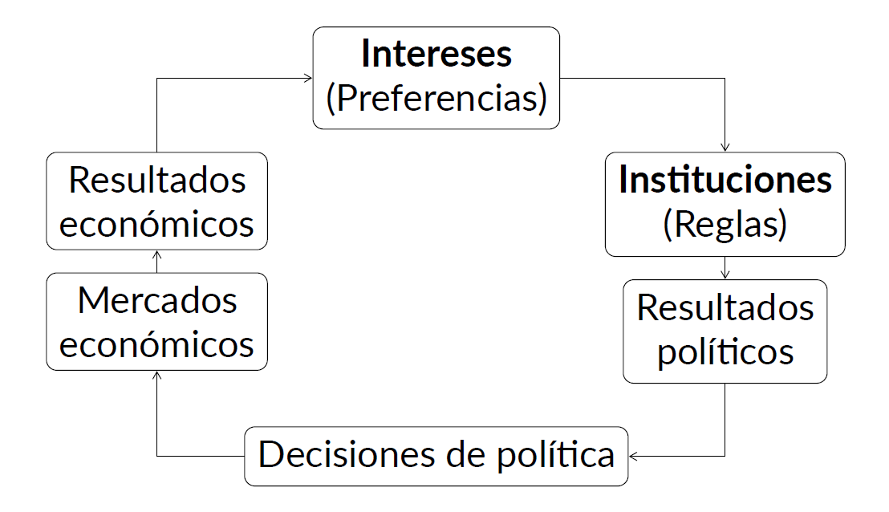
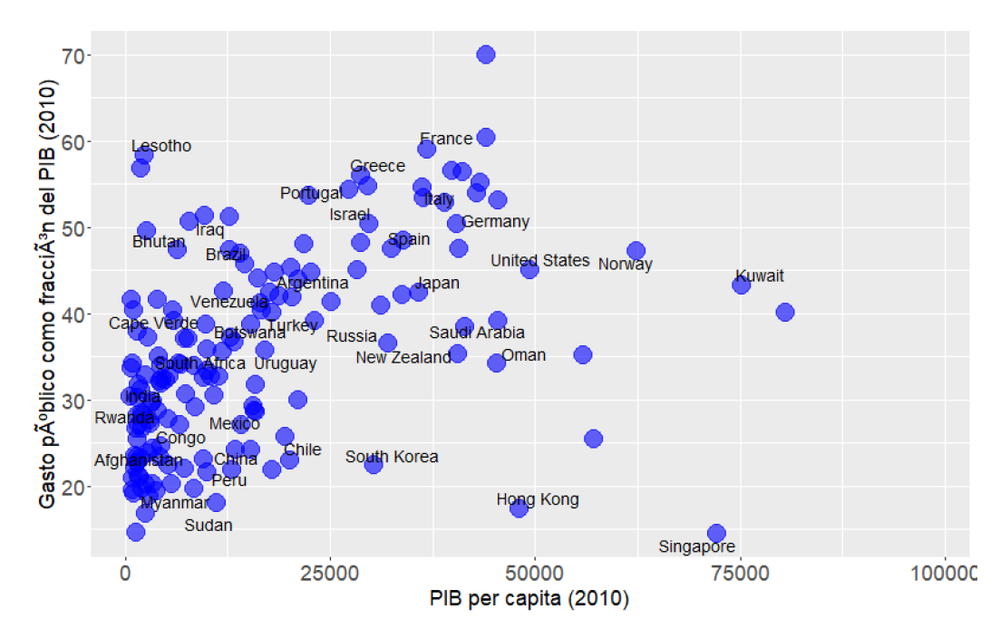
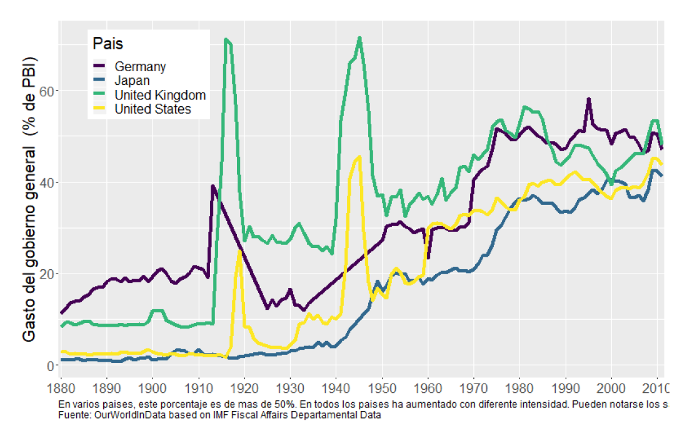
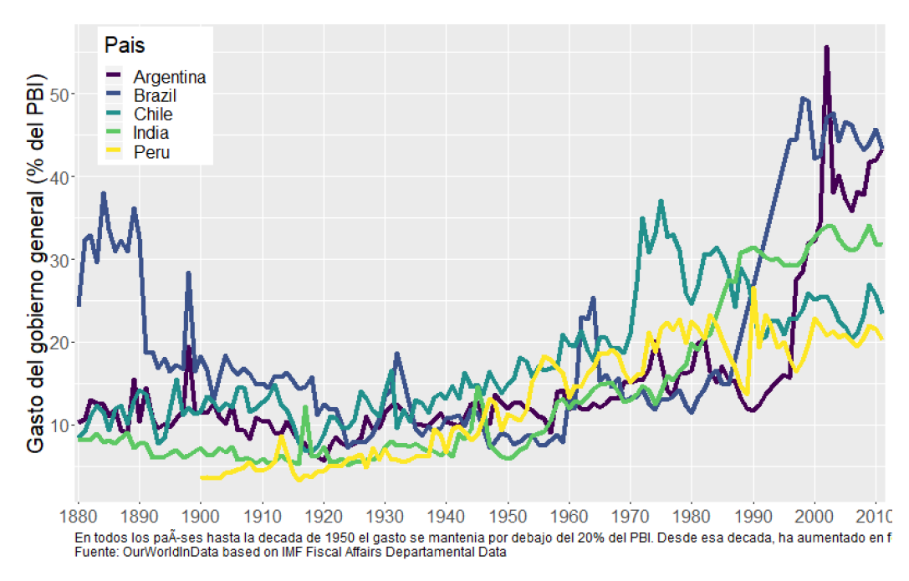
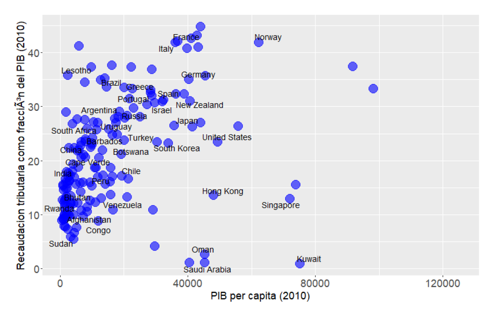
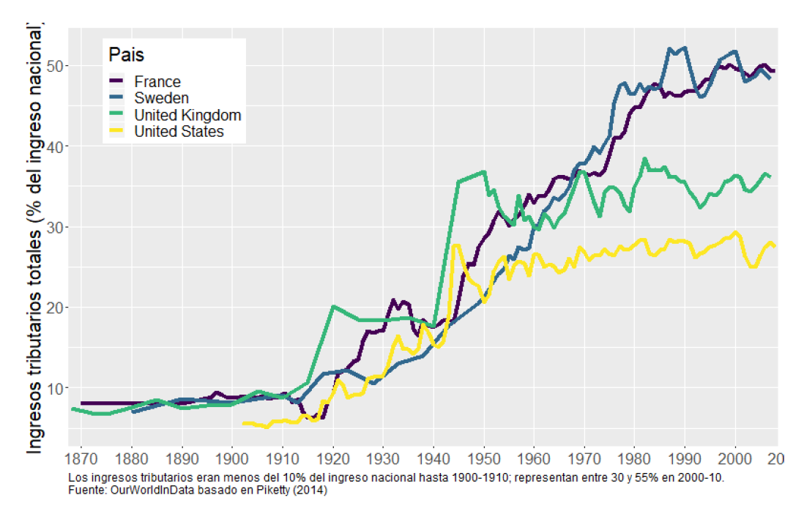

## Los economistas y la política

> Los economistas deben no sólo conocer sus modelos económicos, sino que
también entender de política, intereses, conflictos, pasiones, es
decir, la esencia de la vida colectiva. Por un pequeño período de
tiempo, uno puede realizar cambios a través de decretos: pero para que
ellos persistan, uno debe construir coaliciones y tener gente que los
soporte. Es decir, se debe ser un político.

*Alejandro Foxley, ex ministro de Finanzas de Chile*

## Economía y política

- Economía: uso óptimo de recursos escasos
- Política: estudio del poder y la autoridad
- Poder: habilidad (capacidad) de individuos y/o
  grupos para lograr sus objetivos
- Cualquier estudio que pretenda describir la complejidad de
  las relaciones sociales en sus dimensiones económicas y políticas,
  debe analizar estos elementos en forma conjunta.

## Economía y política (cont.)

- La economía como disciplina nace y se desarrolla como economía
  política (Smith, Ricardo, Marx, JS Mill, Say). La economia
  neoclásica enfoca en **planificador benevolente**
  $\leftarrow$ enfoque normativo 
- ¿Cómo y porqué es la política económica como es? ¿Cómo es el
    proceso político de toma de decisiones colectivas por parte de
    **agentes con preferencias diferentes** $\longrightarrow$
    enfoque positivo
- Esto último es lo que se entiende modernamente por **economia política**

## Economía política: Naturaleza

- Tres enfoques convergen en la economia política
  1. **Teoría de la política macroeconómica** $\longrightarrow$ expectativas racionales, incentivos del policy-maker y comportamiento estratégico. Eminentemente teórica; instituciones políticas poco realistas
  2. **Teoría de la elección pública** $\longrightarrow$ finanzas públicas, política regulatoria. Eje: problema de agencia entre el gobierno (agente) y ciudadanos (principal).
  3. **Teoría de la elección social** $\longrightarrow$ modelos formales de análisis político. Parte de teoría axiomática de la elección social y estudia decisiones colectivas en instituciones políticas específicas.

## Economía política: Enfoque

> La **economía política moderna** utiliza el enfoque de equilibrio general de la teoría macroeconómica y explota las herramientas de la teoría de la elección racional para el análisis de los problemás principales de la teoría de la elección pública

## Economía política: Las tres I's

- **Intereses** --representados por preferencias de diferentes agentes por alternativas de políticas. Se modelan al nivel individual
- **Instituciones** --restricciones creadas por los humanos que estructuran la interacción económica, política y social.
- **Ideas** --incluyen paradigmas, sentimientos públicos, programas y encuadres que moldean e impactan el tipo y forma de las decisiones adoptadas

## Economía política: Intereses

> El análisis de los intereses supone que siempre existe un problema
 bien definido de optimización que incluye una función objetivo, una
 serie de restricciones y un conjunto de alternativas. Esto suele ser
 un supuesto limitante ya que en muchas situaciones esto no se
 cumple

## Economía política: Instituciones

> Las instituciones incluyen tanto restricciones informales (codigos de
 conducta, costumbres, tradiciones) como restricciones formales
 (constituciones, leyes, derechos de propiedad). Las instituciones
 pueden ser exógenas y endogenas

## Economía política: Ideas

> Algunos ejemplos de ideas que en economía han tenido impacto sobre
 las políticas adoptadas --supply-side economics; modern monetary
 theory; consenso de Washington

## Economía política: Sistema

## ¿Por qué difieren las políticas económicas?

- Existe una relación positiva entre gasto público y PIB per capita con alguos *outliers* y posibles no linearidades
- ¿Cómo se explican estas diferencias desde un enfoque puramente económico sin considerar la politica?
- Posibles explicaciones $\longrightarrow$ 1) mayor rol
          redistributivo del Estado; 2) instituciones políticas --presidencialismo vs parlamentarismo, mayoritario vs representación proporcional.

## Ilustración #1

## Ilustración #1 (cont.)

- Si miramos evolución comparada de largo plazo, observamos claras tendencias a mayor participación estatal en la economía $\longrightarrow$ medido tanto por el lado de gastos como de recursos y también para diferentes países
- También aquí la política es importante $\longrightarrow$ expansión y fortalecimiento de las democracias en los últimos 150 años
- ¿Diferentes preferencias? ¿Diferentes instituciones?

## Ilustración #2

## Ilustración #3

## Ilustración #4 

- Países pobres versus ricos con similar recaudación tributaria --ie tamaño del Estado- $\longrightarrow$ Lesotho/Alemania
- Países con similar riqueza pero diferente rol del Estado $\longrightarrow$ Oman y Arabia Saudita / EEUU / Noruega
- Economia puede explicar algunas diferencias  $\longrightarrow$ ley de Wagner, efecto "umbral"
- Varias teorias explicativas desde el estudio de la política $\longrightarrow$ 1) maldición de los recursos, 2) corrupción, 3) incentivos político-electorales

## Ilustración #4 (cont.)

## Ilustración #5

## El rol de la política

- Un aspecto relevante de la política es en lo que hace a la **heterogeneidad de intereses**
- Restricciones políticas derivadas de ello implica que las políticas adoptadas en la práctica **no son óptimas**
- Implicaciones positivas $\longrightarrow$ si la política óptima se encuentra no resulta cierto que esta se implementa (implícito en la *economía del bienestar*)
- Implicaciones normativas $\longrightarrow$ ¿cómo pueden diseñarse instituciones y políticas para lograr ciertos objetivos?

## Equilibrio sin política
- Basado en Drazen (2000) y Ferguson/Querubin (2018)
- Suponga **1 (un) individuo representativo**, Ana, quien debe elegir cuánto destinar de sus recursos iniciales $A_{o}$ para sus  vacaciones de este año y el próximo
- Note que no hay problema político (no conflicto de intereses) sino uno técnico
- ¿Cuál es la manera óptima de dividir los recursos entre dos vacaciones (presente y futuro)?

## Equilibrio sin política (cont.)

- Sea $u(x_{t})$ la utilidad de Ana por destinar $x$ a sus vacaciones en $t$ con $u'>0$ y $u''<0$. El parámetro $\beta$ compara utilidades en distintos momentos --una unidad de utilidad hoy es igual a $\beta$ unidades de utilidad mañana [$0<\beta<1$]
$$\max_{\{x_{t},x_{t+1},s\}} u(x_{t})+\beta u(x_{t+1})$$
- Sujeto a:
\begin{align*}
A_{0}(1-s)&=x_{t} \\
sA_{0}(1+r_{t})&=x_{t+1}
\end{align*}

## Equilibrio sin política (cont.)

- Sustituyendo las restricciones en la ecuación principal:
$$\displaystyle \max_{x_{t}} u(x_{t}) \beta u((A_{0}-x_{t})(1+r_{t}))$$
- Y la solución de esto es:
$$u'(x_{t}) = \beta(1+r_{t})u'(x_{t+1})$$ 
- ¿Cuál es la interpretación de esta solución? [Ecuación de Euler]
    - Nos dice cómo asignar el consumo entre el período $t$ y $t+1$ de modo que la utilidad marginal del consumo presente y futuro sean iguales

## Equilibrio con política 

- **Con individuos heterogéneos ex-ante** $\longrightarrow$
    preferencias diferentes por consumo presente/futuro [dos tipos de heterogeneidad: **ex
      ante** y **ex post**
- Los recursos son los mismos que antes pero ahora hay **dos
      individuos**, Ana (A) y Juan (J) y sea $\beta^{A}>\beta^{J}$ [Juan
      es más impaciente que Ana]
- Problema $\longrightarrow$ maximizar la función de
        bienestar social (suma ponderada de utilidades individuales)
        $\longrightarrow$ $\alpha$ ponderación de cada individuo

## Equilibrio con política (cont.)

- Problema (neoclásico):
$$\displaystyle \max_{x_{t},x_{t+1},s} \alpha\left[u(x_{t})+\beta^{A}u(x_{t+1})\right] + (1-\alpha)\left[u(x_{t})+\beta^{J}u(x_{t+1})\right]$$
- Sujeto a:
$$A_{0}=x_{t}+\frac{x_{t+1}}{(1+r_{t})}$$
- Si el bien "vacaciones" es no rival --unica fuente de conflicto la diferencia ex-ante en el grado de impaciencia de cada uno 

## Equilibrio con política (cont.)

- Sustituyendo las restricciones:
$$u'(x_{t})=(1+r_{t})[\alpha \beta^{A}+(1-\alpha)\beta^{J}]u'(x_{t+1})$$
- Para diferentes $\alpha$ trazamos **curva de contrato** con
  asignaciones de $x_{t}$ y $x_{t+1}$ eficientes en sentido de Pareto
- Varios problemas con esto: 1) cada persona requiere un
    $\alpha$ mas alto, 2) ¿cómo se determina $\alpha$, 3) ¿cómo afecta
    el valor de $\alpha$ a la asignación de recursos, 4) ¿estaremos
    sobre la curva de contrato?

## Equilibrio con política (cont.)

- **Sin individuos heterogéneos ex-ante** $\longrightarrow$
    problema converge al del individuo representativo PERO las
    vacaciones no son un bien no rival. El problema es:
\begin{align*}
\max_{x_{t},x_{t+1},s} & \alpha\left[u(\lambda x_{t})+\beta u(\lambda
      x_{t+1})\right] \\ & +(1-\alpha)\left[u((1-\lambda) x_{t})+\beta u((1-\lambda) x_{t+1})\right]
\end{align*}

- sujeto a [$\lambda$ porcentaje que disfruta Juan del gasto $x$]
\begin{align*}
                A_{0}(1-s)&=x_{t}&=&\lambda x_{t}+(1-\lambda)x_{t} \\
        sA_{0}(1+r_{t})&=x_{t+1}&=&\lambda x_{t+1}+(1-\lambda)x_{t+1} 
\end{align*}

## Equilibrio con política (cont.)

- Resolviendo:
\begin{align*}
\alpha \lambda u'(\lambda
      x_{t})+(1-\alpha)(1-\lambda)u'((1-\lambda)x_{t})= \\
      \beta(1+r_{t})\left[\alpha \lambda u'(\lambda
      x_{t+1})+(1-\alpha)(1-\lambda)u'((1-\lambda)x_{t+1})\right]
\end{align*}
- Note que $\alpha$ es crucial $\longrightarrow$ pero ahora
        $\lambda$ también lo es [aún suponiendo que $\alpha=0.5$
        existe conflicto de interés]
\begin{align*}
\lambda u'(\lambda
          x_{t})+(1-\lambda)u'((1-\lambda)x_{t})= \\
          \beta(1+r_{t})\left[\lambda u'(\lambda
      x_{t+1})+(1-\lambda)u'((1-\lambda)x_{t+1})\right]
\end{align*}
- Si $\lambda=1$, el resultado seria preferido por Juan y si
  $\lambda=0$ el resultado sería preferido por Ana.

## Equilibrio con política (cont.)

- Cuando no hay heterogeneidad, el problema es trivial
      $\longrightarrow$ problema técnico depende de parámetros
      subjetivos
- Cuando hay heterogeneidad en preferencias (**ex ante**) $\longrightarrow$ como se ponderan utilidades
      individuales [$\alpha$ exógeno]
- Cuando hay heterogeneidad en distribución (**ex
          post**) $\longrightarrow$ como se
        ponderan utilidades invididuales y como se
        distribuye/asigna las cantidades consumidas del
        bien
- ¿Cómo se determinan los parámetros $\alpha$ y $\lambda$
          en la práctica? No a través del mercado sino del proceso político

## Economía y política: Dos sistemas

- Una persona, un voto $\longrightarrow$ **política**
- Un dólar, un voto $\longrightarrow$ **economía**
- Función objetivo del gobierno incluye ambos
\begin{align}
        G&=f(W,C)=\alpha W+\sum_{i}C_{i}
\end{align}
- $W$ es bienestar agregado; $C_{i}$ es dinero aportado por grupo $i$
      --$\alpha$ ponderador del bienestar agregado.

## Economía y política: Dos sistemas (cont.)

## Heterogeneidad y preferencias

- Elección de la política económica importa una decisión
      colectiva a partir de intereses (preferencias) individuales e
      instituciones políticas determinadas
- Decisiones difieren según instituciones políticas
        --dictadura versus democracia $\longrightarrow$ tanto en el
        proceso como en los resultados
- Existen dos modelos tipicos de democracia --directa y
         representativa. Si bien difieren en muchos aspectos, ambas
         tienen en el centro del proceso decisorio a mecanismos de
         votacion.
	 
## Heterogeneidad y preferencias 

- Individuos maximizan una función de utilidad
      $U(x_{1},x_{2};\alpha^{i})$ --$x_{1}$ y $x_{2}$ bienes
      privados. El gobierno le saca $\tau$ del $Y$ al individuo y le
      devuelve $T$ como transferencia de suma fija.
$$
p_{1}x_{1}+p_{2}x_{2} \leq (1-\tau)Y+T
$$
- El problema consiste en maximizar la utilidad sujeta a la
        restricción presupuestaria $\longrightarrow$ se obtienen las
        demandas individuales $x_{1}(p_{1},p_{2},Y,\tau,T;\alpha^{i})$
        y $x_{2}(p_{1},p_{2},Y,\tau,T;\alpha^{i})$
- El parámetro $\alpha$ en la función de utilidad captura
          la heterogeneidad de preferencias.

## Heterogeneidad y preferencias

- Reemplazando esas demandas en la función de utilidad, se
      obtiene la funcion de utilidad indirecta:
\begin{align*}
        V(p_{1},p_{2},Y,,\tau,T;\alpha^{i}) \equiv \\
        U(x_{1}(p_{1},p_{2},Y,\tau,T;\alpha^{i}),x_{2}(p_{1},p_{2},Y,\tau,T;\alpha^{i});\alpha^{i})
\end{align*}
- Importante $\longrightarrow$ utilidad es función de las
        variables de política [dado que $x_{1}$ y $x_{2}$ son elegidos
        de manera óptima]
\begin{align*}
V(\tau,T;\alpha^{i}) \equiv \\ V(p_{1}(\tau,T),p_{2}(\tau,T),Y(\tau,T),\tau,T;\alpha^{i})
\end{align*}

## Heterogeneidad y preferencias

- Conociendo $\tau$ conocemos $T$ [¿por qué?] y la fn UI:
$$
V(\tau;\alpha^{i})
$$
- La política preferida por el individuo se obtiene hallando $\tau$
  que maximiza utilidad indirecta:
\begin{equation*}
\frac{\partial V(\tau;\alpha^{i})}{\partial \tau}=0
\end{equation*}
-  $\tau^{*}(\alpha^{i})$ $\longrightarrow$
  dimensión política evidente --$\alpha^{i}$'s diferentes implican
  políticas (alícuotas) preferidas diferentes

## Puntos clave I

- La política económica en las sociedades modernas no puede
      explicarse sólamente en base a teorías y evidencias económicas
      $\longrightarrow$ introducir la política explícitamente en el análisis
- Hay varias formas de introducir la política
        $\longrightarrow$ optamos por la aproximación de la nueva
        economia política
- Pondremos el énfasis en algunos sencillos modelos
          teóricos --de comportamiento-- pero ilustraremos el análisis
          con evidencias empíricas

## Puntos clave II

- La heterogeneidad individual es clave para este enfoque. Dos dimensiones clave:
  1. Heterogeneidad ex-ante $\longrightarrow$ diferencias en preferencias individuales --ie. dos personas con mismo ingreso pero diferentes preferencias políticas
  2. Heterogeneidad ex-post $\longrightarrow$ diferencias en dotaciones individuales --ie. dos personas con mismas preferencias políticas pero diferentes situaciones luego de una reforma tributaria
- Esto da origen al conflicto que adopta generalmente varias formas

## Puntos clave III

- La política económica, en sus diferentes dimensiones, es generalmente el resultado último de la "resolución" de estos conflictos.
- Las variaciones en la misma pueden reflejar variaciones en intereses, instituciones e idea --foco del curso es en las dos primeras
- Los intereses afectan a las instituciones y las instituciones a los intereses --relación dinámica y compleja. Clave para entender e interpretar la variabilidad en políticas económicas

  
