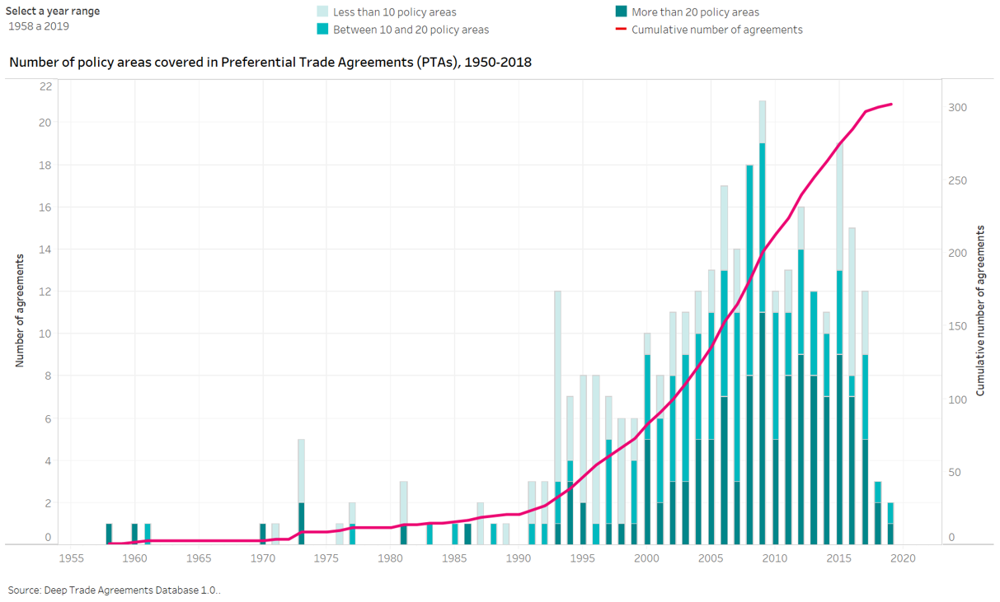
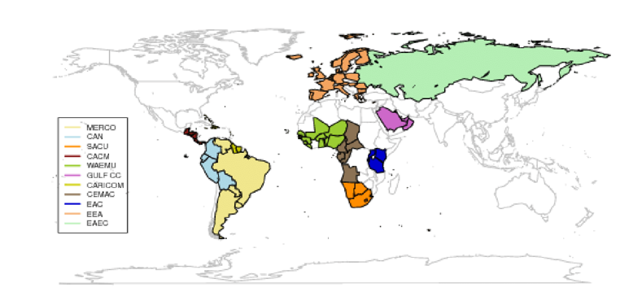
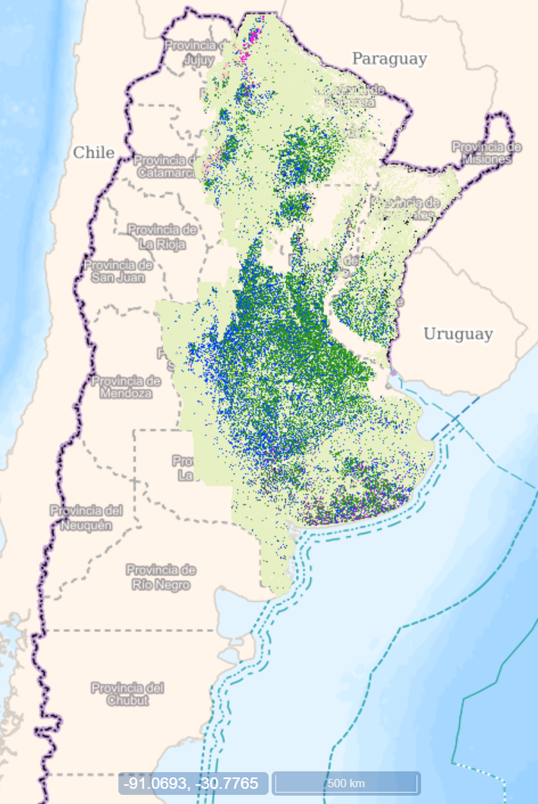
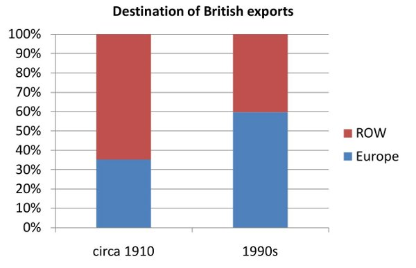

<<<<<<< HEAD
<<<<<<< HEAD
---
title: Economía Política Internacional [UCC]
author: Sebastián Freille
date: (`r Sys.Date()`)
slideNumber: true
output:
  revealjs::revealjs_presentation:
    center: true
    highlight: pygments
    transition: slide
    css: ..\style.css
header-includes:
  - \usepackage{tcolorbox}
  - \newtcolorbox{myquote}{colback=red!5!white, colframe=red!75!black}
  - \renewenvironment{quote}{\begin{myquote}}{\end{myquote}}
---

## Integración: economía y política

- Entre los fenómenos más destacados de la globalización de las últimas 5-6 décadas está el de la creciente organización de la producción y el comercio en regiones
- Importante distinguir entre *regionalización* y *regionalismo*. El primero refiere al resultado de un fenómeno de localización natural que conduce a vínculos económicos estrechos en una región. El segundo refiere esencialmente a la creación de acuerdos preferenciales de comercio.
- Ambos fenómenos son importantes y relevantes y tienen diferentes abordajes desde la economía y economía política

## Regionalismo

- El proceso de regionalismo tuvo sus inicios a principios de siglo XX, tuvo cierta actividad entre los años 1950 y 1990, pero es a partir de la década de 1990 que exhibe un sostenido crecimiento. Este crecimiento se mantiene hasta 2015 en que se estanca y tiende a disminuir
- Resulta interesante notar que el regionalismo no sólo ha evolucionado en términos de cantidad de acuerdos sino también en términos de calidad (acuerdos cada vez más profundos y complejos)

## Regionalismo (cont.)

## Regionalismo (cont.)

- Características del nuevo regionalismo:
  - los países pequeños han logrado reformas unilaterales
    significativas;
  - movimientos hacia el libre comercio suaves y
    graduales;
  - acuerdos típicamente sesgados en contra de países pequeños los que liberalizan su comercio;
  - los acuerdos regionales generalmente involucran una *integración
    profunda* --se suele coordinar políticas
    económicas y harmonizar sistemas impositivos;
  - geografía determinante de acuerdos regionales 

## Regionalismo (cont.)

## Regionalismo (cont.)

- El GATT de la OMC ha siempre mirado de reojo el proceso de regionalismo --en particular en relación a la violación total/parcial del Art. XXIV
- El consenso téorico mayoritario sugiere que los acuerdos preferenciales de comercio (APCs) son una alternativa de *second-best* en relación al multilateralismo (liberalización global no por bloques).

## Regionalismo (cont.)

- No obstante ello, hay diferencias en relación a si el regionalismo y multilateralismo son complementarios, independientes o sustitutos
- Bhagwati y Panagariya (1996) ven al regionalismo como un esquema intrínsecamente discriminatorio
- Otros autores sostienen que el regionalismo colabora con el multilateralismo en una suerte de "escalón necesario" hacia el mismo (Krugman, Sampson)
- El debate, en última instancia, es uno empírico y que sólo se irá saldando con la evidencia

## Regionalismo (cont.)

-   Regionalismo abierto vs regionalismo cerrado $\longrightarrow$ el
    primero implica liberalización hacia adentro del bloque y
    liberalización gradual hacia afuera del bloque; el segundo implica solo
    liberalización hacia adentro y no excluye aumento de aranceles
    externos.
-   RTA's pueden ser:
    -   Building blocks $\longrightarrow$ el mundo se va haciendo más
        globalizado y se promueve cada vez mayor libre comercio a partir
        de integración por bloques
    -   Stumbling blocks $\longrightarrow$ los bloques persiguen su
        propia agenda y prefieren cerrarse hacia adentro del bloque y no
        favorecer el comercio con otros bloques y/o países.

## Regionalización

- La regionalización en el sentido que la usamos se enmarca en el campo de la geografía económica que refiere a su vez a "la distribución geográfica de actividades económicas --producción, consumo, empleo. 
- En particular, uno de los aspectos más relevantes en términos de economía política es la geografía del empleo 
- Las oportunidades de empleo están distribuidas de manera desigual --tanto entre como dentro de los países. 

## Regionalización (cont.)

- Entre países, existen diferencias en las oportunidades y remuneraciones de trabajadores de diferente habilidad. Estas diferencias en la distribución de habilidades tienen importantes consecuencias económicas [Stolper and Samuelson (1941)] y políticas [Milner and Kubota (2005)]
- (Hacia adentro de) un país, también existen diferencias que pueden tener fuertes impactos a nivel económico y político

## Regionalización (cont.)

- Los patrones geográficos de empleo varían entre industrias --algunas industrias demandan trabajo sólo en algunas regiones. Ejemplo de esto son las actividades extractivas y de explotación. Otras industrias, como la construcción, demandan trabajo a lo largo de todo el país. 
- La localización en relación al consumidor final también impacta --mientras que las peluquerías, hoteles y restaurantes *deben ubicarse cerca* del mercado final, las automotrices y electrodomésticos *pueden ubicarse lejos* del mercado final. 

## Regionalización (cont.)

- También varían entre grandes sectores de actividad --sector agropecuario vs manufacturero. La actividad agropecuaria suele exhibir importantes grado de concentración geográfica. Frecuentemente (aunque no siempre) en esos lugares, suele haber pocas oportunidades de empleo no agropecuario
- La actividad manufacturera suele tener menos concentración geográfica que la agropecuaria pero aún así tiene distribución desigual adentro de un país. Las zonas de concentración manufacturera suelen ser muy vulnerables a la apertura del comercio. Las razones de esta desigualdad en la distribución son variadas

## Regionalización (cont.)

{height=600px}

## Regionalización (cont.)

-   En la segunda parte del s. XX, un fenómeno de cambio se observaba
    en el comercio: el **creciente intercambio de bienes similares entre
    países similares** --comercio bidireccional de automóviles entre
    Canadá y EEUU.
-   A principios del s. XX, Inglaterra exportaba bienes manufacturados e importaba
    materias primas y bienes primarios; hacia finales del s. XX,
    Inglaterra exportaba e importaba bienes manufacturados.
-   También cambió el tipo de relaciones comerciales $\longrightarrow$
    a inicios del s. XX, Inglaterra comerciaba intensamente con
    países muy diferentes (EEUU; Latam); a
    finales del s. XX, Inglaterra comerciaba mucho más con países
    similares y mucho menos con países diferentes.

## Regionalización (cont.)

## Regionalización (cont.)

-   Hasta 1990 las teorías del comercio internacional no contemplaban el tema de la localización de la producción y/o comercio dentro de un mismo país.
-   No había una manera sistemática de abordar el tema de los
    rendimientos crecientes a escala (RCE); algunos autores consideraron
    "economías externas" (exógenas) --no se explicaban las externalidades i.e. la producción se concentra por las economías de aglomeración (tautología)
-   Se podía derivar externalidades endógenas usando modelos de competencia monopolística --explicar concentración a partir de (interacción de) ciertas
    características

## La nueva geografía económica

-   La nueva geografía económica (NGE) se remonta a los
    inicios de los '90. Principal diferencia con la economía espacial
    tradicional \[von Thunen (1826), Weber (1909), Christaller (1933)\]
    $\longrightarrow$ modelos de equilibrio general y
    comportamiento agregado
-   Modelo básico: Krugman (1991) $\longrightarrow$ 2 (dos) regiones
    simétricas con 2 (dos) industrias, una móvil e imperfectamente
    competitiva (manufactura) y otra inmóvil y perfectamente competitiva
    (agricultura)
-   Encadenamientos hacia atrás y adelante en la manufactura (genera
    fuerzas centrípetas) y la atracción de los agricultores inmóviles
    (genera fuerzas centrífugas)

## La nueva geografía económica (cont.)

-   Existe un conflicto permanente entre fuerzas opuestas que tienden a
    concentrar por un lado y a desconcentrar por el otro. En la visión
    de Krugman, se puede presentar de la siguiente forma:

  **Fuerzas centrípetas**                            **Fuerzas centrífugas**
  -------------------------------------------------- -----------------------------
  Efectos del tamaño del mercado (encadenamientos)   Factores inmóviles
  Mercados de trabajos densos                        Rentas de la tierra
  Economías externas puras                           Deseconomías externas puras

  : Fuerzas que afectan la concentración geográfica

## La nueva geografía económica (cont.)

-   Interrogante principal $\longrightarrow$ ¿por qué la actividad
    manufacturera (industrial) se concentra en determinadas regiones y
    no en otras? Krugman (1991) delineó un modelo de concentración
    geográfica de la producción manufacturera basado en tres elementos
    centrales:
    -   economías de escala
    -   costos de transporte
    -   tamaño del mercado
-   Un resultado interesante es que esta concentración no necesariamente
    va a ocurrir; en otras palabras, la concentración puede depender de
    algunos parámetros.

## La nueva geografía económica (cont.)

-   Existen dos regiones de actividad. Dos tipos de producción:
    -   **agricultura (A)** $\longrightarrow$ rendimientos constantes -
        sector atado a la tierra (region-specific)
    -   **manufacturas (M)** $\longrightarrow$ rendimientos crecientes -
        actividad puede localizarse en cualquier región
-   Existen dos factores de producción en cada región: cada factor se
    supone específico de cada sector.
-   Costos de transporte --el costo de transporte del bien (A) se supone
    cero; el costo de transporte del bien (M) es del tipo "costo de
    iceberg" (sólo una fracción de la unidad de producto llega a
    destino; el resto es costo de transporte)

## La nueva geografía económica (cont.)

-   Un productor $i$ que abastece a ambas regiones debe decidir donde localizarse --Home (H) o Foreign (F). Decide la cantidad a vender en cada mercado, $S$ unidades en H y $S*$ unidades en F. Además, suponemos que $S>S*$.
-   El costo de transporte por unidad de producto es igual a $\tau$.
-   El productor puede tener una sóla fábrica o dos. Abrir una nueva fábrica elimina $\tau$ pero tiene un costo fijo $F$. Si $$F>\tau S*$$
-   El productor decidirá tener una sóla fábrica y estará ubicada en H
    [¿por qué?]. Abastecerá al mercado H sin costo y al mercado F con
    costos de transporte $\tau$.

## La nueva geografía económica (cont.)

-   **Idea central 1** $\longrightarrow$ si las economías de escala
    --aproximadas por $\frac{F}{S*}>\tau$- son lo suficientemente
    grandes en relación con los costos de transporte, la producción
    estará geográficamente concentrada, y se dará en el mercado más
    grande.
-   **Idea central 2** $\longrightarrow$ si las decisiones de localización
    afectan el tamaño del mercado es posible que se de un proceso de
    retroalimentación (idea de que podemos derivar las economías de
    aglomeración sin necesidad de suponer que existen exógenamente)

## La nueva geografía económica (cont.)

-   ¿Qué explica el resultado de la concentración? La
    interacción entre costos de transporte ($\tau$), economías de escala
    ($F$) y el tamaño del mercado ($S$). La interacción es: 
    -   Los **RCE** crean un incentivo para
        concentrar geográficamente la producción de cualquier bien
    -   Los **costos de transporte** incentivan a localizar la
        producción cerca de mercados mas grandes
    -   Las decisiones de localización también influyen sobre las dimensiones y **tamaño del mercado** 
   -  Bajo ciertas condiciones, este esquema de relaciones produciría un
    **esquema circular autosustentado** 

## La nueva geografía económica (cont.)

## La nueva geografía económica (cont.)

-   La configuración de equilibrios dependerá del nivel de costos de trasnporte:
    -   Si $\tau$ es alto $\Rightarrow$ poco comercio inter-regional y
        salarios igualados; equilibrio único estable y los trabajadores
        móviles se distribuyen igualmente en ambas regiones
    -   Si $\tau$ es bajo $\Rightarrow$ tres equilibrios posibles: dos
        estables con trabajadores concentrados en una u otra región; uno
        inestable con trabajadores divididos igualmente
    -   Un rango de equilibrios posibles que varían entre concentración
        total y reparto igual.

## La nueva geografía económica (cont.)

-   Suponga que la economía parte de una situación de altos costos de
    transporte (equilibrio con igual reparto; segmento A). Luego, se
    produce una gradual disminución de costos de transporte.
-   Cuando la economía llega al punto B, comenzará un proceso
    autogenerado de concentración que culminará con una concentración
    total eventual.
-   Es decir, este simple modelo, permite contemplar una situación en
    que a partir de una situación de no-concentración se pasa a una de
    concentración.

=======
---
title: Economía Política Internacional [UCC]
author: Sebastián Freille
date: (`r Sys.Date()`)
slideNumber: true
output:
  revealjs::revealjs_presentation:
    center: true
    highlight: pygments
    transition: slide
    css: ..\style.css
header-includes:
  - \usepackage{tcolorbox}
  - \newtcolorbox{myquote}{colback=red!5!white, colframe=red!75!black}
  - \renewenvironment{quote}{\begin{myquote}}{\end{myquote}}
---

## Integración: economía y política

- Entre los fenómenos más destacados de la globalización de las últimas 5-6 décadas está el de la creciente organización de la producción y el comercio en regiones
- Importante distinguir entre *regionalización* y *regionalismo*. El primero refiere al resultado de un fenómeno de localización natural que conduce a vínculos económicos estrechos en una región. El segundo refiere esencialmente a la creación de acuerdos preferenciales de comercio.
- Ambos fenómenos son importantes y relevantes y tienen diferentes abordajes desde la economía y economía política

## Regionalismo

- El proceso de regionalismo tuvo sus inicios a principios de siglo XX, tuvo cierta actividad entre los años 1950 y 1990, pero es a partir de la década de 1990 que exhibe un sostenido crecimiento. Este crecimiento se mantiene hasta 2015 en que se estanca y tiende a disminuir
- Resulta interesante notar que el regionalismo no sólo ha evolucionado en términos de cantidad de acuerdos sino también en términos de calidad (acuerdos cada vez más profundos y complejos)

## Regionalismo (cont.)

## Regionalismo (cont.)

- Características del nuevo regionalismo:
  - los países pequeños han logrado reformas unilaterales
    significativas;
  - movimientos hacia el libre comercio suaves y
    graduales;
  - acuerdos típicamente sesgados en contra de países pequeños los que liberalizan su comercio;
  - los acuerdos regionales generalmente involucran una *integración
    profunda* --se suele coordinar políticas
    económicas y harmonizar sistemas impositivos;
  - geografía determinante de acuerdos regionales 

## Regionalismo (cont.)

## Regionalismo (cont.)

- El GATT de la OMC ha siempre mirado de reojo el proceso de regionalismo --en particular en relación a la violación total/parcial del Art. XXIV
- El consenso téorico mayoritario sugiere que los acuerdos preferenciales de comercio (APCs) son una alternativa de *second-best* en relación al multilateralismo (liberalización global no por bloques).

## Regionalismo (cont.)

- No obstante ello, hay diferencias en relación a si el regionalismo y multilateralismo son complementarios, independientes o sustitutos
- Bhagwati y Panagariya (1996) ven al regionalismo como un esquema intrínsecamente discriminatorio
- Otros autores sostienen que el regionalismo colabora con el multilateralismo en una suerte de "escalón necesario" hacia el mismo (Krugman, Sampson)
- El debate, en última instancia, es uno empírico y que sólo se irá saldando con la evidencia

## Regionalismo (cont.)

-   Regionalismo abierto vs regionalismo cerrado $\longrightarrow$ el
    primero implica liberalización hacia adentro del bloque y
    liberalización gradual hacia afuera del bloque; el segundo implica solo
    liberalización hacia adentro y no excluye aumento de aranceles
    externos.
-   RTA's pueden ser:
    -   Building blocks $\longrightarrow$ el mundo se va haciendo más
        globalizado y se promueve cada vez mayor libre comercio a partir
        de integración por bloques
    -   Stumbling blocks $\longrightarrow$ los bloques persiguen su
        propia agenda y prefieren cerrarse hacia adentro del bloque y no
        favorecer el comercio con otros bloques y/o países.

## Regionalización

- La regionalización en el sentido que la usamos se enmarca en el campo de la geografía económica que refiere a su vez a "la distribución geográfica de actividades económicas --producción, consumo, empleo. 
- En particular, uno de los aspectos más relevantes en términos de economía política es la geografía del empleo 
- Las oportunidades de empleo están distribuidas de manera desigual --tanto entre como dentro de los países. 

## Regionalización (cont.)

- Entre países, existen diferencias en las oportunidades y remuneraciones de trabajadores de diferente habilidad. Estas diferencias en la distribución de habilidades tienen importantes consecuencias económicas [Stolper and Samuelson (1941)] y políticas [Milner and Kubota (2005)]
- (Hacia adentro de) un país, también existen diferencias que pueden tener fuertes impactos a nivel económico y político

## Regionalización (cont.)

- Los patrones geográficos de empleo varían entre industrias --algunas industrias demandan trabajo sólo en algunas regiones. Ejemplo de esto son las actividades extractivas y de explotación. Otras industrias, como la construcción, demandan trabajo a lo largo de todo el país. 
- La localización en relación al consumidor final también impacta --mientras que las peluquerías, hoteles y restaurantes *deben ubicarse cerca* del mercado final, las automotrices y electrodomésticos *pueden ubicarse lejos* del mercado final. 

## Regionalización (cont.)

- También varían entre grandes sectores de actividad --sector agropecuario vs manufacturero. La actividad agropecuaria suele exhibir importantes grado de concentración geográfica. Frecuentemente (aunque no siempre) en esos lugares, suele haber pocas oportunidades de empleo no agropecuario
- La actividad manufacturera suele tener menos concentración geográfica que la agropecuaria pero aún así tiene distribución desigual adentro de un país. Las zonas de concentración manufacturera suelen ser muy vulnerables a la apertura del comercio. Las razones de esta desigualdad en la distribución son variadas

## Regionalización (cont.)

{height=600px}

## Regionalización (cont.)

-   En la segunda parte del s. XX, un fenómeno de cambio se observaba
    en el comercio: el **creciente intercambio de bienes similares entre
    países similares** --comercio bidireccional de automóviles entre
    Canadá y EEUU.
-   A principios del s. XX, Inglaterra exportaba bienes manufacturados e importaba
    materias primas y bienes primarios; hacia finales del s. XX,
    Inglaterra exportaba e importaba bienes manufacturados.
-   También cambió el tipo de relaciones comerciales $\longrightarrow$
    a inicios del s. XX, Inglaterra comerciaba intensamente con
    países muy diferentes (EEUU; Latam); a
    finales del s. XX, Inglaterra comerciaba mucho más con países
    similares y mucho menos con países diferentes.

## Regionalización (cont.)

## Regionalización (cont.)

-   Hasta 1990 las teorías del comercio internacional no contemplaban el tema de la localización de la producción y/o comercio dentro de un mismo país.
-   No había una manera sistemática de abordar el tema de los
    rendimientos crecientes a escala (RCE); algunos autores consideraron
    "economías externas" (exógenas) --no se explicaban las externalidades i.e. la producción se concentra por las economías de aglomeración (tautología)
-   Se podía derivar externalidades endógenas usando modelos de competencia monopolística --explicar concentración a partir de (interacción de) ciertas
    características

## La nueva geografía económica

-   La nueva geografía económica (NGE) se remonta a los
    inicios de los '90. Principal diferencia con la economía espacial
    tradicional \[von Thunen (1826), Weber (1909), Christaller (1933)\]
    $\longrightarrow$ modelos de equilibrio general y
    comportamiento agregado
-   Modelo básico: Krugman (1991) $\longrightarrow$ 2 (dos) regiones
    simétricas con 2 (dos) industrias, una móvil e imperfectamente
    competitiva (manufactura) y otra inmóvil y perfectamente competitiva
    (agricultura)
-   Encadenamientos hacia atrás y adelante en la manufactura (genera
    fuerzas centrípetas) y la atracción de los agricultores inmóviles
    (genera fuerzas centrífugas)

## La nueva geografía económica (cont.)

-   Existe un conflicto permanente entre fuerzas opuestas que tienden a
    concentrar por un lado y a desconcentrar por el otro. En la visión
    de Krugman, se puede presentar de la siguiente forma:

  **Fuerzas centrípetas**                            **Fuerzas centrífugas**
  -------------------------------------------------- -----------------------------
  Efectos del tamaño del mercado (encadenamientos)   Factores inmóviles
  Mercados de trabajos densos                        Rentas de la tierra
  Economías externas puras                           Deseconomías externas puras

  : Fuerzas que afectan la concentración geográfica

## La nueva geografía económica (cont.)

-   Interrogante principal $\longrightarrow$ ¿por qué la actividad
    manufacturera (industrial) se concentra en determinadas regiones y
    no en otras? Krugman (1991) delineó un modelo de concentración
    geográfica de la producción manufacturera basado en tres elementos
    centrales:
    -   economías de escala
    -   costos de transporte
    -   tamaño del mercado
-   Un resultado interesante es que esta concentración no necesariamente
    va a ocurrir; en otras palabras, la concentración puede depender de
    algunos parámetros.

## La nueva geografía económica (cont.)

-   Existen dos regiones de actividad. Dos tipos de producción:
    -   **agricultura (A)** $\longrightarrow$ rendimientos constantes -
        sector atado a la tierra (region-specific)
    -   **manufacturas (M)** $\longrightarrow$ rendimientos crecientes -
        actividad puede localizarse en cualquier región
-   Existen dos factores de producción en cada región: cada factor se
    supone específico de cada sector.
-   Costos de transporte --el costo de transporte del bien (A) se supone
    cero; el costo de transporte del bien (M) es del tipo "costo de
    iceberg" (sólo una fracción de la unidad de producto llega a
    destino; el resto es costo de transporte)

## La nueva geografía económica (cont.)

-   Un productor $i$ que abastece a ambas regiones debe decidir donde localizarse --Home (H) o Foreign (F). Decide la cantidad a vender en cada mercado, $S$ unidades en H y $S*$ unidades en F. Además, suponemos que $S>S*$.
-   El costo de transporte por unidad de producto es igual a $\tau$.
-   El productor puede tener una sóla fábrica o dos. Abrir una nueva fábrica elimina $\tau$ pero tiene un costo fijo $F$. Si $$F>\tau S*$$
-   El productor decidirá tener una sóla fábrica y estará ubicada en H
    [¿por qué?]. Abastecerá al mercado H sin costo y al mercado F con
    costos de transporte $\tau$.

## La nueva geografía económica (cont.)

-   **Idea central 1** $\longrightarrow$ si las economías de escala
    --aproximadas por $\frac{F}{S*}>\tau$- son lo suficientemente
    grandes en relación con los costos de transporte, la producción
    estará geográficamente concentrada, y se dará en el mercado más
    grande.
-   **Idea central 2** $\longrightarrow$ si las decisiones de localización
    afectan el tamaño del mercado es posible que se de un proceso de
    retroalimentación (idea de que podemos derivar las economías de
    aglomeración sin necesidad de suponer que existen exógenamente)

## La nueva geografía económica (cont.)

-   ¿Qué explica el resultado de la concentración? La
    interacción entre costos de transporte ($\tau$), economías de escala
    ($F$) y el tamaño del mercado ($S$). La interacción es: 
    -   Los **RCE** crean un incentivo para
        concentrar geográficamente la producción de cualquier bien
    -   Los **costos de transporte** incentivan a localizar la
        producción cerca de mercados mas grandes
    -   Las decisiones de localización también influyen sobre las dimensiones y **tamaño del mercado** 
   -  Bajo ciertas condiciones, este esquema de relaciones produciría un
    **esquema circular autosustentado** 

## La nueva geografía económica (cont.)

## La nueva geografía económica (cont.)

-   La configuración de equilibrios dependerá del nivel de costos de trasnporte:
    -   Si $\tau$ es alto $\Rightarrow$ poco comercio inter-regional y
        salarios igualados; equilibrio único estable y los trabajadores
        móviles se distribuyen igualmente en ambas regiones
    -   Si $\tau$ es bajo $\Rightarrow$ tres equilibrios posibles: dos
        estables con trabajadores concentrados en una u otra región; uno
        inestable con trabajadores divididos igualmente
    -   Un rango de equilibrios posibles que varían entre concentración
        total y reparto igual.

## La nueva geografía económica (cont.)

-   Suponga que la economía parte de una situación de altos costos de
    transporte (equilibrio con igual reparto; segmento A). Luego, se
    produce una gradual disminución de costos de transporte.
-   Cuando la economía llega al punto B, comenzará un proceso
    autogenerado de concentración que culminará con una concentración
    total eventual.
-   Es decir, este simple modelo, permite contemplar una situación en
    que a partir de una situación de no-concentración se pasa a una de
    concentración.

>>>>>>> dfdc4c5fee2ae677e90272e86451614d3da0804a
=======
---
title: Economía Política Internacional [UCC]
author: Sebastián Freille
date: (`r Sys.Date()`)
slideNumber: true
output:
  revealjs::revealjs_presentation:
    center: true
    highlight: pygments
    transition: slide
    css: ..\style.css
header-includes:
  - \usepackage{tcolorbox}
  - \newtcolorbox{myquote}{colback=red!5!white, colframe=red!75!black}
  - \renewenvironment{quote}{\begin{myquote}}{\end{myquote}}
---

## Integración: economía y política

- Entre los fenómenos más destacados de la globalización de las últimas 5-6 décadas está el de la creciente organización de la producción y el comercio en regiones
- Importante distinguir entre *regionalización* y *regionalismo*. El primero refiere al resultado de un fenómeno de localización natural que conduce a vínculos económicos estrechos en una región. El segundo refiere esencialmente a la creación de acuerdos preferenciales de comercio.
- Ambos fenómenos son importantes y relevantes y tienen diferentes abordajes desde la economía y economía política

## Regionalismo

- El proceso de regionalismo tuvo sus inicios a principios de siglo XX, tuvo cierta actividad entre los años 1950 y 1990, pero es a partir de la década de 1990 que exhibe un sostenido crecimiento. Este crecimiento se mantiene hasta 2015 en que se estanca y tiende a disminuir
- Resulta interesante notar que el regionalismo no sólo ha evolucionado en términos de cantidad de acuerdos sino también en términos de calidad (acuerdos cada vez más profundos y complejos)

## Regionalismo (cont.)

## Regionalismo (cont.)

- Características del nuevo regionalismo:
  - los países pequeños han logrado reformas unilaterales
    significativas;
  - movimientos hacia el libre comercio suaves y
    graduales;
  - acuerdos típicamente sesgados en contra de países pequeños los que liberalizan su comercio;
  - los acuerdos regionales generalmente involucran una *integración
    profunda* --se suele coordinar políticas
    económicas y harmonizar sistemas impositivos;
  - geografía determinante de acuerdos regionales 

## Regionalismo (cont.)

## Regionalismo (cont.)

- El GATT de la OMC ha siempre mirado de reojo el proceso de regionalismo --en particular en relación a la violación total/parcial del Art. XXIV
- El consenso téorico mayoritario sugiere que los acuerdos preferenciales de comercio (APCs) son una alternativa de *second-best* en relación al multilateralismo (liberalización global no por bloques).

## Regionalismo (cont.)

- No obstante ello, hay diferencias en relación a si el regionalismo y multilateralismo son complementarios, independientes o sustitutos
- Bhagwati y Panagariya (1996) ven al regionalismo como un esquema intrínsecamente discriminatorio
- Otros autores sostienen que el regionalismo colabora con el multilateralismo en una suerte de "escalón necesario" hacia el mismo (Krugman, Sampson)
- El debate, en última instancia, es uno empírico y que sólo se irá saldando con la evidencia

## Regionalismo (cont.)

-   Regionalismo abierto vs regionalismo cerrado $\longrightarrow$ el
    primero implica liberalización hacia adentro del bloque y
    liberalización gradual hacia afuera del bloque; el segundo implica solo
    liberalización hacia adentro y no excluye aumento de aranceles
    externos.
-   RTA's pueden ser:
    -   Building blocks $\longrightarrow$ el mundo se va haciendo más
        globalizado y se promueve cada vez mayor libre comercio a partir
        de integración por bloques
    -   Stumbling blocks $\longrightarrow$ los bloques persiguen su
        propia agenda y prefieren cerrarse hacia adentro del bloque y no
        favorecer el comercio con otros bloques y/o países.

## Regionalización

- La regionalización en el sentido que la usamos se enmarca en el campo de la geografía económica que refiere a su vez a "la distribución geográfica de actividades económicas --producción, consumo, empleo. 
- En particular, uno de los aspectos más relevantes en términos de economía política es la geografía del empleo 
- Las oportunidades de empleo están distribuidas de manera desigual --tanto entre como dentro de los países. 

## Regionalización (cont.)

- Entre países, existen diferencias en las oportunidades y remuneraciones de trabajadores de diferente habilidad. Estas diferencias en la distribución de habilidades tienen importantes consecuencias económicas [Stolper and Samuelson (1941)] y políticas [Milner and Kubota (2005)]
- (Hacia adentro de) un país, también existen diferencias que pueden tener fuertes impactos a nivel económico y político

## Regionalización (cont.)

- Los patrones geográficos de empleo varían entre industrias --algunas industrias demandan trabajo sólo en algunas regiones. Ejemplo de esto son las actividades extractivas y de explotación. Otras industrias, como la construcción, demandan trabajo a lo largo de todo el país. 
- La localización en relación al consumidor final también impacta --mientras que las peluquerías, hoteles y restaurantes *deben ubicarse cerca* del mercado final, las automotrices y electrodomésticos *pueden ubicarse lejos* del mercado final. 

## Regionalización (cont.)

- También varían entre grandes sectores de actividad --sector agropecuario vs manufacturero. La actividad agropecuaria suele exhibir importantes grado de concentración geográfica. Frecuentemente (aunque no siempre) en esos lugares, suele haber pocas oportunidades de empleo no agropecuario
- La actividad manufacturera suele tener menos concentración geográfica que la agropecuaria pero aún así tiene distribución desigual adentro de un país. Las zonas de concentración manufacturera suelen ser muy vulnerables a la apertura del comercio. Las razones de esta desigualdad en la distribución son variadas

## Regionalización (cont.)

{height=600px}

## Regionalización (cont.)

-   En la segunda parte del s. XX, un fenómeno de cambio se observaba
    en el comercio: el **creciente intercambio de bienes similares entre
    países similares** --comercio bidireccional de automóviles entre
    Canadá y EEUU.
-   A principios del s. XX, Inglaterra exportaba bienes manufacturados e importaba
    materias primas y bienes primarios; hacia finales del s. XX,
    Inglaterra exportaba e importaba bienes manufacturados.
-   También cambió el tipo de relaciones comerciales $\longrightarrow$
    a inicios del s. XX, Inglaterra comerciaba intensamente con
    países muy diferentes (EEUU; Latam); a
    finales del s. XX, Inglaterra comerciaba mucho más con países
    similares y mucho menos con países diferentes.

## Regionalización (cont.)

## Regionalización (cont.)

-   Hasta 1990 las teorías del comercio internacional no contemplaban el tema de la localización de la producción y/o comercio dentro de un mismo país.
-   No había una manera sistemática de abordar el tema de los
    rendimientos crecientes a escala (RCE); algunos autores consideraron
    "economías externas" (exógenas) --no se explicaban las externalidades i.e. la producción se concentra por las economías de aglomeración (tautología)
-   Se podía derivar externalidades endógenas usando modelos de competencia monopolística --explicar concentración a partir de (interacción de) ciertas
    características

## La nueva geografía económica

-   La nueva geografía económica (NGE) se remonta a los
    inicios de los '90. Principal diferencia con la economía espacial
    tradicional \[von Thunen (1826), Weber (1909), Christaller (1933)\]
    $\longrightarrow$ modelos de equilibrio general y
    comportamiento agregado
-   Modelo básico: Krugman (1991) $\longrightarrow$ 2 (dos) regiones
    simétricas con 2 (dos) industrias, una móvil e imperfectamente
    competitiva (manufactura) y otra inmóvil y perfectamente competitiva
    (agricultura)
-   Encadenamientos hacia atrás y adelante en la manufactura (genera
    fuerzas centrípetas) y la atracción de los agricultores inmóviles
    (genera fuerzas centrífugas)

## La nueva geografía económica (cont.)

-   Existe un conflicto permanente entre fuerzas opuestas que tienden a
    concentrar por un lado y a desconcentrar por el otro. En la visión
    de Krugman, se puede presentar de la siguiente forma:

  **Fuerzas centrípetas**                            **Fuerzas centrífugas**
  -------------------------------------------------- -----------------------------
  Efectos del tamaño del mercado (encadenamientos)   Factores inmóviles
  Mercados de trabajos densos                        Rentas de la tierra
  Economías externas puras                           Deseconomías externas puras

  : Fuerzas que afectan la concentración geográfica

## La nueva geografía económica (cont.)

-   Interrogante principal $\longrightarrow$ ¿por qué la actividad
    manufacturera (industrial) se concentra en determinadas regiones y
    no en otras? Krugman (1991) delineó un modelo de concentración
    geográfica de la producción manufacturera basado en tres elementos
    centrales:
    -   economías de escala
    -   costos de transporte
    -   tamaño del mercado
-   Un resultado interesante es que esta concentración no necesariamente
    va a ocurrir; en otras palabras, la concentración puede depender de
    algunos parámetros.

## La nueva geografía económica (cont.)

-   Existen dos regiones de actividad. Dos tipos de producción:
    -   **agricultura (A)** $\longrightarrow$ rendimientos constantes -
        sector atado a la tierra (region-specific)
    -   **manufacturas (M)** $\longrightarrow$ rendimientos crecientes -
        actividad puede localizarse en cualquier región
-   Existen dos factores de producción en cada región: cada factor se
    supone específico de cada sector.
-   Costos de transporte --el costo de transporte del bien (A) se supone
    cero; el costo de transporte del bien (M) es del tipo "costo de
    iceberg" (sólo una fracción de la unidad de producto llega a
    destino; el resto es costo de transporte)

## La nueva geografía económica (cont.)

-   Un productor $i$ que abastece a ambas regiones debe decidir donde localizarse --Home (H) o Foreign (F). Decide la cantidad a vender en cada mercado, $S$ unidades en H y $S*$ unidades en F. Además, suponemos que $S>S*$.
-   El costo de transporte por unidad de producto es igual a $\tau$.
-   El productor puede tener una sóla fábrica o dos. Abrir una nueva fábrica elimina $\tau$ pero tiene un costo fijo $F$. Si $$F>\tau S*$$
-   El productor decidirá tener una sóla fábrica y estará ubicada en H
    [¿por qué?]. Abastecerá al mercado H sin costo y al mercado F con
    costos de transporte $\tau$.

## La nueva geografía económica (cont.)

-   **Idea central 1** $\longrightarrow$ si las economías de escala
    --aproximadas por $\frac{F}{S*}>\tau$- son lo suficientemente
    grandes en relación con los costos de transporte, la producción
    estará geográficamente concentrada, y se dará en el mercado más
    grande.
-   **Idea central 2** $\longrightarrow$ si las decisiones de localización
    afectan el tamaño del mercado es posible que se de un proceso de
    retroalimentación (idea de que podemos derivar las economías de
    aglomeración sin necesidad de suponer que existen exógenamente)

## La nueva geografía económica (cont.)

-   ¿Qué explica el resultado de la concentración? La
    interacción entre costos de transporte ($\tau$), economías de escala
    ($F$) y el tamaño del mercado ($S$). La interacción es: 
    -   Los **RCE** crean un incentivo para
        concentrar geográficamente la producción de cualquier bien
    -   Los **costos de transporte** incentivan a localizar la
        producción cerca de mercados mas grandes
    -   Las decisiones de localización también influyen sobre las dimensiones y **tamaño del mercado** 
   -  Bajo ciertas condiciones, este esquema de relaciones produciría un
    **esquema circular autosustentado** 

## La nueva geografía económica (cont.)

## La nueva geografía económica (cont.)

-   La configuración de equilibrios dependerá del nivel de costos de trasnporte:
    -   Si $\tau$ es alto $\Rightarrow$ poco comercio inter-regional y
        salarios igualados; equilibrio único estable y los trabajadores
        móviles se distribuyen igualmente en ambas regiones
    -   Si $\tau$ es bajo $\Rightarrow$ tres equilibrios posibles: dos
        estables con trabajadores concentrados en una u otra región; uno
        inestable con trabajadores divididos igualmente
    -   Un rango de equilibrios posibles que varían entre concentración
        total y reparto igual.

## La nueva geografía económica (cont.)

-   Suponga que la economía parte de una situación de altos costos de
    transporte (equilibrio con igual reparto; segmento A). Luego, se
    produce una gradual disminución de costos de transporte.
-   Cuando la economía llega al punto B, comenzará un proceso
    autogenerado de concentración que culminará con una concentración
    total eventual.
-   Es decir, este simple modelo, permite contemplar una situación en
    que a partir de una situación de no-concentración se pasa a una de
    concentración.

>>>>>>> dfdc4c5fee2ae677e90272e86451614d3da0804a
