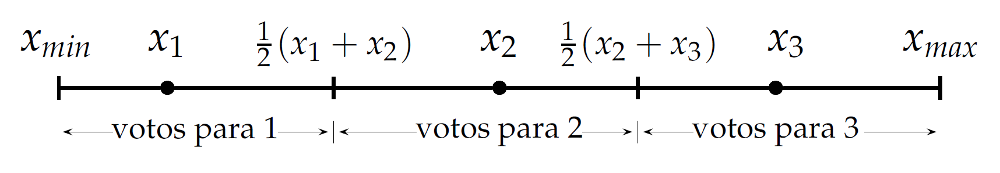
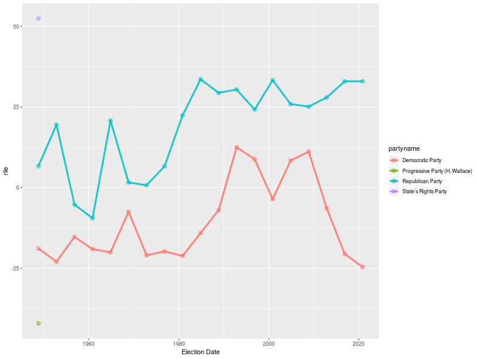
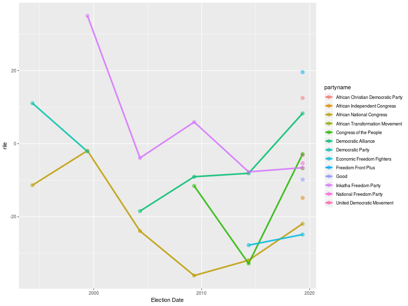
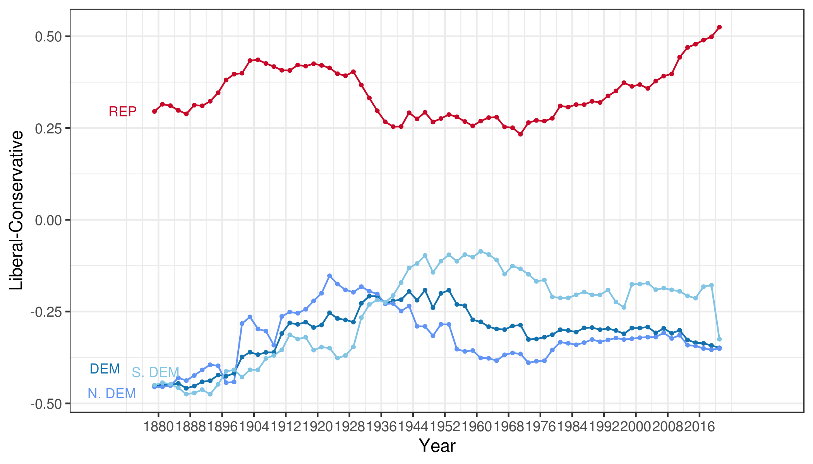
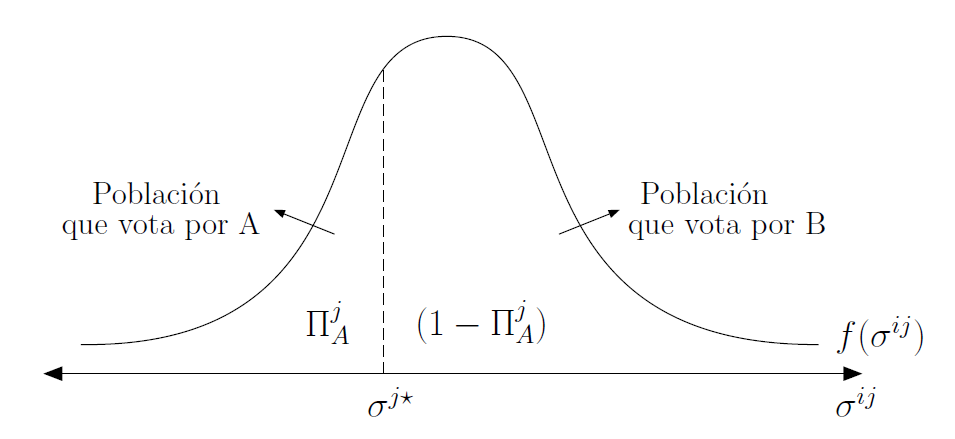
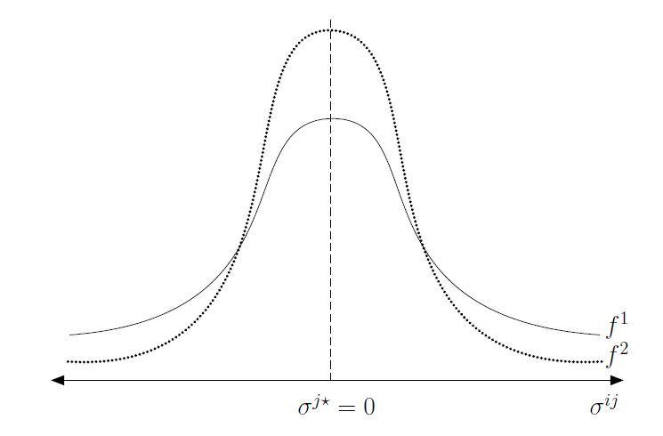

> Politicians neither love nor hate. Interest, not sentiment, governs them.\
**[Fourth Earl of Chesterfield (1748)]**

# Democracia representativa

- Democracia representativa y competencia electoral
- Políticos como representantes
- Modelos de competencia electoral

## Democracia representativa

- En la práctica, la democracia directa es inviable para estructurar y organizar las decisiones colectivas
- Cuando la *polity* es grande $\longrightarrow$ se deben elegir representantes
- Principales aspectos relevantes
  - Conducta de representantes pre- y post- campaña
  - Conducta de votantes ante oferta electoral
  - Características de los resultados de política

## Votantes y representantes

- Caracterizamos a los votantes en función de maximizar su utilidad que depnde de la canasta de bienes que consume
- Caracterizamos a los representantes en función de...
  - ...intereses $\longrightarrow$ ¿pero cuáles?
      + Punto ideal de política
      + Ideología
      + Ganar votos

## Modelo de localización

- En 1929, Hotelling observó que las empresas competidoras solían imitar la calidad de los bienes y la localización. ¿Por qué teniendo un enorme mercado geográfico para localizarse se establecen tan cerca (por qué imitaban calidad del producto)?
- Ejemplo $\longrightarrow$ vendedores de helados en una playa. ¿Donde deben localizarse a lo largo de una playa de 1km si los individuos están distribuidos uniformemente?
- Esto se observa en la vida real $\longrightarrow$ heladeras en supermercados; negocios en una misma cuadra/zona.

## MCE: Downs

- Supuestos contextuales:
  - Cada candidato  político busca ganar para obtener ingreso, prestigio y poder que viene con el cargo
  - El candidato ganador tiene control completo de sus acciones hasta la próxima eleccion
  - Poderes económicos del gobierno ilimitados --dentro del marco democrático. El único límite es político $\longrightarrow$ no puede restringir la libertad política
  - Cada agente en el modelo --votante, candidato o coalicion- es racional en todo momento

## MCE: Downs (cont.)

- Basado en esto desarrolló el **modelo espacial de
  competencia electoral**
- Continuo ideológico unidimensional $[0,100]$, entre economía completamente
  socializada (0) y economía totalmente privada (100).
  - Supuesto $\longrightarrow$ todo puede reducirse a la ideología --unidimensional.

> Los partidos políticos en una democracia formulan la política estrictamente como un medio para obtener votos (y ganar elecciones). Para Downs los partidos políticos no son mas que comerciantes vendiendo *políticas* por *votos*.

## MCE: Downs (cont.)

- Supuestos claves sobre candidatos:
  1. Cumplen sus promesas --se resuelve el equilibrio político (modelo no dinámico)
  2. Son "oportunistas" $\longrightarrow$ sólo les interesa las rentas del poder, no las políticas implementadas
- Sólo relevante en contexto *pre-electoral*
  - Tenga en cuenta que en la práctica pre-electoral y post-electoral están vinculados
- Foco nuevamente es el conflicto entre preferencias

## MCE: Downs (cont.)

- Dos candidatos, $A$ y $B$, cada uno oportunista. Ganar elección brinda $R$
- Cada candidato anuncia $q_{A}$ y $q_{B}$ para maximizar su fn. objetivo:
\begin{align}
p_{p}.R
\end{align}
- donde $p_{p}$ es la probabilidad de ganar la elección para el candidato $P \in {A,B}$. Esta depende de la política anunciada
- Una vez resuelta elección, candidato implementa política anunciada

## MCE: Downs (cont.)

- Suponga que $p_{A}(q_{A},q_{B})$ es la prob. que $A$ gane la elección cuando se anuncian $(q_{A},q_{B})$ y  $p_{B}(q_{A},q_{B})=1-(q_{A},q_{B})$ es la prob. que $B$ gane
- Entonces:
  - $p_{A}(q_{A},q_{B})=1$ si *mayoría* prefiere $q_{A}$ a $q_{B}$
  - $p_{A}(q_{A},q_{B})=0$ si *mayoría* prefiere $q_{B}$ a $q_{A}$
- Preferencias son unimodales y vector de política unidimensional

## MCE: Downs (cont.)

- El equilibrio queda descripto por las preferencias del mediano, $V^{M}(q)$
\begin{align}
p_{A}(q_{A},q_{B})=
\begin{cases}
1 & si \quad V_{M}(q_{A}) > V_{M}(q_{B}) \\
\frac{1}{2} & si \quad V_{M}(q_{A}) = V_{M}(q_{B}) \\
0 & si \quad V_{M}(q_{A}) < V_{M}(q_{B}) \\
\end{cases}
\end{align}

## MCE: Downs (cont.)

- Candidatos enfrentan el siguiente problema de decidir
\begin{align}
A:& \max_{q_{A}} p_{A}(q_{A},q_{B}).R \\
B:& \max_{q_{B}} 1-p_{A}(q_{A},q_{B}).R \\
\end{align}
- En equilibrio, ambos candidatos **convergen** y eligen (anuncian) la política preferida por el mediano, $q_{M}^{*}$.
  - Demostración por contradicción

## MCE: Downs (cont.)
  
- Supong candidatos eligen otras, $q_{A}<q_{B}<q_{M}^{*}$
  - Mediano y todos a su derecha prefieren $q_{B}$
- Misma política, $q_{A}=q_{B}$
- Una a cada lado ($V^{M}(q_{A})=V^{M}(q_{A})$)
  - $q_{A} \leq q_{M}^{*} \leq q_{B}$
  - $q_{A} \geq q_{M}^{*} \geq q_{B}$
- En cualquier caso, si $q_{P} \neq q_{M}^{*}$
  - Cualquier partido tiene incentivo para acercarse mas a mediano
  - Desviaciones cesan cuando se está en $q_{M}^{*}$

## MCE: Downs (cont.)

{#fig:04001 width=80%}

## MCE: Downs (cont.)

{#fig:04002 width=80%}

- Ciudadanos cuyas posición favorita es $\frac{1}{2}(x_{1}+x_{2})$  dividen sus votos por igual entre $x_{1}$ y $x_{2}$.
- Jugadores son los *candidatos*, acciones  el conjunto de *posiciones posibles* y los *payoffs* son $n\succ k \succ 0$

## MCE Downs: Aplicación

- Resultado Downs $\longrightarrow$ válido con  2 (dos) partidos
  - En democracia multipartido no aplica 
- Suponga:
  - Sea $Q=[0,1]$ unidimensional de política
  - $A$, $B$ y $C$ compiten por un mismo cargo. Si empatan, sorteo
  - Candidatos anuncian pol $(q_{A},q_{B},q_{C})$=$(\frac{1}{11},\frac{6}{11},\frac{9}{11})$ simultánea y no cooperativa
  - Población compuesta por $N \in {1,...,11}$ votantes con preferencias unimodales
\begin{align}
u_{i}(q)=-|q-q^{i}|  \quad donde \quad q^{i}=\frac{i}{11}
\end{align}

## MCE Downs: Aplicación (cont.)

- Si todos $i \in N$ votan en forma sincera, $A$ obtiene 3 votos, $B$ 4 votos, y $C$ 4 votos por lo que $B$ y $C$ tienen 1/2 probabilidad de ganar
- $i=1$ prefiere política anunciada por $B$ por lo que su mejor respuesta es votar por $B$ --dado que el resto de votantes vota sinceramente!
- Dado que no se puede asumir votación sincera con 3 o mas candidatos, el problema se vuelve bastante mas complejo

## MCE Downs: Interpretación

- Note que Downs *no requiere* que candidatos siempre vayan al centro
- Si los votantes se distribuyen uniformemente a lo largo del eje $x$ y el candidato A originalmente se ubica en A (25) y y el andidato B se ubica en B (75), a ambos les conviene moverse hacia 50.
- Si la distribución de votantes cambia, los partidos: a)       tiende a ir a los extremos; b) tenderan a posicionarse alrededor de nucleos de votantes

## MCE Downs: Interpretación (cont.)

{#fig:04003 width=80%}

## MCE Downs: Interpretación (cont.)

{#fig:04004 width=80%}

## MCE Downs: Interpretación (cont.)

{#fig:04005 width=80%}

## MCE Downs: Interpretación (cont.)

- Políticas estables en una democracia bi-partidista requiere distribucion normal  $\longrightarrow$ los partidos tienden a parecerse. La *identidad del partido* no importa.
- Si votantes polarizados, *cambio en identidad* del ganador implica cambio en la política. Si continuidad $\longrightarrow$ oposición busca desestabilizar; si alternancia $\longrightarrow$ inestabilidad
- Si distribución multimodal $\longrightarrow$ sistema multi-partido. Cada partido se posiciona en una moda. Mayor rango de opciones, mayor rol de ideología y menor coherencia $\longrightarrow$ gobierno de coaliciones

## MCE Downs: Evidencia

> Thus politicians in our model never seek office as a means of carrying
out particular policies: their only goal is to reap the rewards of holding office \textit{per se}. They treat policies purely as a means to the attainment of their private ends, which they can reach only by being elected. \
**[Anthony Downs, *An economic theory of democracy*}]**

## MCE Downs: Evidencia (cont.)

> **Ley 1.** Los sistemas de votación por mayoría en una elección conducen a un sistema bipartidista

> **Ley 2.** Los sistemas de votación por representación proporcional conducen a un sistema multipartidista. 

> **Ley 3.** Los sistemas de votación por mayoría en 2 vueltas llevan a un
sistema multipartido con tendencia a formar coaliciones

## MCE Downs: Evidencia (cont.)

::: {#tab:2}
  Country      no. of elections   ENP     Sistema
  ----------- ------------------ ------ ------------
  Canada              21          3.07    mayoría
  UK                  17          2.37    mayoría
  US                  17          1.99    mayoría
  Australia           27          2.60   2da vuelta
  France              14          4.31   2da vuelta
  Argentina           4           4.47       PR
  Brazil              7           9.33       PR

  : Número efectivo de partidos
:::

## MCE Downs: Evidencia (cont.)

- Si se cumple Downs, se esperaría un bajo grado de polarización en las plataformas políticas de la vida real. 
- Datos del **Comparative Manifesto Dataset** (2015), polarización
  medida en escala I-D.
- Disponibilidad del "RiLe Index" [Laver and Budge (1992)] $\longrightarrow$ indice que mide la posición izquierda-derecha de los partidos
- Varía entre -100 y 100 y se construye como $rile=R-L$ donde $R$ es la suma (porcentajes) de variables de derecha y $L$ la suma de (porcentajes) de variables de izquierda.

## MCE Downs: Evidencia (cont.)

{#fig:04007 width=80%}

## MCE Downs: Evidencia (cont.)

::: {#tab:3}
  Country      no. Elections   polarization
  ----------- --------------- --------------
  Canada            21             0.10
  UK                17             0.15
  US                17             0.08
  Australia         27             0.16
  France            14             0.21
:::

## MCE Downs: Evidencia (cont.)

{#fig:04006 width=80%}

## MCE Downs: Evidencia (cont.)

{#fig:04008 width=80%}

## MCE Downs: Evidencia (cont.)

{#fig:04009 width=80%}

## MCE Downs: Evidencia (cont.)

- No sólo puede observarse polarización en relacióna propuestas y plataformas partidarias
- También en cierto modo la polarización puede observarse en los recintos legislativos
  - Representantes electos son tanto *ejecutivos* como *legislativos*
- Primer gráfico usa datos de Voteview. El grafo de redes de un paper [Andris et al (2015)] que estudia cooperación entre legisladores, tanto intra- como inter-partido

## MCE Downs: Evidencia (cont.)

{#fig:04010 width=80%}

## MCE Downs: Evidencia (cont.)

{#fig:04011 width=80%}

## MCE Downs: Evidencia (cont.)

{#fig:04012 width=55%}

## MCE Downs: Ejemplo

# Votación probabilística (MVP)

- Problemas de MCE Downs
- Votación probabilísta: incorporando dimensiones
- Rol e importancia del votante *swing*

## TVM: Realismo y ajuste

- Sabemos que el TVM es útil pero en muchas ocasiones supuestos no aplicables
- Tema clave $\longrightarrow$ multidimensional de decisiones políticas
  - El modelo de votación probabilística (MVP) permite relajar algunos supuestos e incorporar más realismo

## MVP: Intuición y supuestos

- Recordemos que
\begin{align}
p_{A}^{i}(q_{A},q_{B})=
\begin{cases}
1 & si \quad V^{i}(q_{A}) > V^{i}(q_{B}) \\
\frac{1}{2} & si \quad V^{i}(q_{A}) = V^{i}(q_{B}) \\
0 & si \quad V^{i}(q_{A}) < V^{i}(q_{B}) \\
\end{cases}
\end{align}
- Es decir, *prob* de que $i$ vote por $A$ cuando plataformas son $(q_{A},q_{B})$ no es continua --saltos discretos
  - Fn objetivo de candidatos discontinuas en espacio de políticas

## MVP: Intuición y supuestos (cont.)

- Por esto, candidatos incentivo a proponer nuevas $q_{i}$ repetidamente
  - Proceso continúa *ad-infinitum* si: 1) preferencias no son de pico único; 2) mnaipulación de agenda y voto estratégico
- El MVP suaviza estas funciones discontinuas aún con espacios de po´litica multidimensionales

## MVP: Intuición y supuestos (cont.)

- Diferentes motivaciones ("microfundamentos") para el MVP
- Individuos motivados por dos dimensiones:
  1. Políticas --$q_{i}$
  2. Ideología --$\sigma^{ij}$
- NOTA: Segunda dimensión No necesariamente debe ser "ideología" en sentido estricto
  - Puede ser cualquier elemento que haga que un votante tenga una *tendencia* a votar por tal o cual candidato

## MVP: Modelo básico

- Sociedad compuesta por número $J$ de grupos diferentes. Población total normalizada a 1. Cada grupo tiene una cantidad/fracción $\alpha_{j}$ de individuos tal que $\sum_{j=1}^{J}\alpha_{j}=1$
- Individuos **dentro de cada grupo** son iguales con excepción de su preferencia "ideológica"
- Dos candidatos $A$ y $B$ compiten ofreciendo políticas contenido en el vector **$q$**.

## MVP: Modelo básico (cont.)

- Sea $\pi_{P}^{j}$ la fracción de votantes en grupo $j$ que vota por $P$ con $P \in {A,B}$.
  - Proporción de votos $\pi_{P}$ que espera obtener:
\begin{align}
\pi_{P}=\sum_{j=1}^{J}\alpha_{j}\pi_{P}^{j}
\end{align}
- En MCE Downs, forma de cada $\pi_{P}^{j}$ se parece a anterior fórmula con saltos de continuidad
  1. Si es *unidimensional*, gana $q_{m}$
  2. Si es *multidimensional*, ciclos interminables (medianos en varias dimensiones)

## MVP: Preferencias

- Cada $i$ en $j$ tiene las preferencias
\begin{align}
V^{ij}=V^{j}(\mathbf{q})+\sigma^{ij}(P)
\end{align}
- donde $V^{j}(\mathbf{q})$ es utilidad indirecta de individuos de grupo $j$ y $\sigma^{ij}(P)$ captura beneficios para votante que, indirectamente de política elegida, recibe el votante $i$ en grupo $j$ si gana $P$
- Sea $p_{A}^{ij}(\mathbf{q}_{A},\mathbf{q}_{B})$ la *prob* que $i$ de $j$ vote por $A$::

\begin{align}
p_{A}^{ij}(\mathbf{q}_{A},\mathbf{q}_{B})=
\begin{cases}
1 & si \quad V^{j}(\mathbf{q}_{A})+\sigma^{ij}(A) > V^{j}(\mathbf{q}_{B})+\sigma^{ij}(B) \\
\frac{1}{2} & si \quad V^{j}(\mathbf{q}_{A})+\sigma^{ij}(A) = V^{j}(\mathbf{q}_{B})+\sigma^{ij}(B) \\
0 & si \quad V^{j}(\mathbf{q}_{A})+\sigma^{ij}(A) < V^{j}(\mathbf{q}_{B})+\sigma^{ij}(B) \\
\end{cases}
\end{align}

## MVP: Preferencias (cont.)

- Definamos $\sigma^{ij}=\sigma^{ij}(B)-\sigma^{ij}(A)$ como la **preferencia ideológica relativa por B**
- Entonces:
\begin{align}
p^{ij}(\mathbf{q}_{A},\mathbf{q}_{B})=
\begin{cases}
1 & si \quad V^{j}(\mathbf{q}_{A})-V^{j}(\mathbf{q}_{B}) \geq \sigma^{ij} \\
\frac{1}{2} & si \quad V^{j}(\mathbf{q}_{A})-V^{j}(\mathbf{q}_{B}) = \sigma^{ij}  \\
0 & si \quad V^{j}(\mathbf{q}_{A})-V^{j}(\mathbf{q}_{B}) \leq \sigma^{ij}  \\
\end{cases}
\end{align}
- Votante $i$ sólo votará por $A$ si los beneficios económicos que recibe *compensan* su preferencia ideológica
- Fn objetivo de políticos se vuelve continua por incertidumbre sobre distribución de preferencias ideológicas

## MVP: Preferencias (cont.)

- Distribución de $\sigma^{j}$ dada por $F^{j}$ definida para cada grupo $j$ sobre intervalo $(-\infty,\infty)$ con fn de densidad $f^{i}$
- Fracción de votantes en grupo $j$ que votarán por $A$ es
\begin{align}
\pi_{A}^{j}=F^{j}(V^{j}(\mathbf{q}_{A})-V^{j}(\mathbf{q}_{b}))=\int_{-\infty}^{(V^{j}(\mathbf{q}_{A})-V^{j}(\mathbf{q}_{b}))}f(\sigma^{ij})d\sigma^{ij}
\end{align}
- Punto $\longrightarrow$ para cada $j$ un individuo $i$ con $\sigma^{ij}$ crítico, $\sigma^{j*}$ igual a $V^{j}(\mathbf{q}_{A})-V^{j}(\mathbf{q}_{b})$ que divide a la población entre los votan por A y los que votan por B
  - Indiferente entre A y B $\longrightarrow$ **swing voter**

## MVP: Preferencias (cont.)

{#fig:04013 width=95%}

## MVP: Preferencias (cont.)

- Agregamos para cada grupo de votantes, fracción de votos que recibe A:
\begin{align}
\pi_{A}=\sum_{j=1}^{J}\alpha^{j}\pi_{A}^{j}=\sum_{j=1}^{J}\alpha^{j}F^{j}(V^{j}(\mathbf{q}_{A})-V^{j}(\mathbf{q}_{b}))
\end{align}
- Recuerde:
  1. Al candidato sólo le interesa ganar (maximizar $\pi_{P}$)
  2. Anuncio de políticas simultáneo(compromiso perfect0)
- Debemos encontrar fn de reacción para candidato (a través de CPO)

## MVP: Preferencias (cont.)

- Funciones de reacción de candidatos son simétricas:
\begin{align}
0=\sum_{j=1}^{J}\alpha^{j}f^{j}(V^{j}(\mathbf{q}_{A})-V^{j}(\mathbf{q}_{b}))\frac{\partial(V^{j}(\mathbf{q}(A)))}{\partial(\mathbf{q}(A))} \\
0=\sum_{j=1}^{J}\alpha^{j}f^{j}(V^{j}(\mathbf{q}_{A})-V^{j}(\mathbf{q}_{b}))\frac{\partial(V^{j}(\mathbf{q}(B)))}{\partial(\mathbf{q}(B))} \\
\end{align}
- Por esta razón, la política elegida por cada candidato...es la misma!
  - Resultado de convergencia donde $\mathbf{q}_{A}=\mathbf{q}_{B}=\mathbf{q}$:
\begin{align}
0=\sum_{j=1}^{J}\alpha^{j}f^{j}(0)\frac{\partial{V^{j}(\mathbf{q})}}{\partial{\mathbf{q}}}
\end{align}

## MVP: Preferencias (cont.)

- Note que la anterior solución equivale a solucionar un problema de maximización de fn de bienestar social ponderada
\begin{align}
\Omega=\sum_{j=1}^{J}\omega^{j}V^{j}(\mathbf{q})
\end{align}
- donde el peso $\omega^{j}$ es $\alpha^{j}f^{j}(0)$ con $f^{j}(0)$ la densidad del "sesgo ideológico" para cada uno de los grupos en el punto en el que ambos candidatos ofrecen la misma política
- Todos tienen un voto pero...
  - algunos más poderosos que otros: 1) grupos más numerosos, $\alpha^{j}$ mayor; 2) grupos menos ideológicos, $f^{j}(0)$

## MVP: Preferencias (cont.)

{#fig:04014 width=95%}