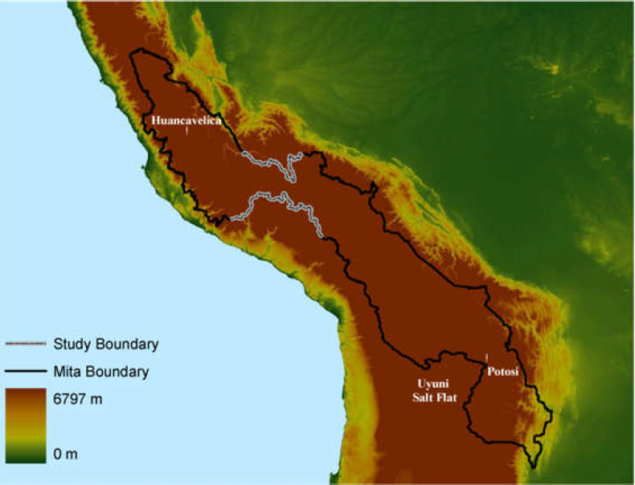

> As in geology, so in social institutions, we may discover the causes of all past changes in the present invariable order of society.\
**[Henry David Thoreau (1849)]**

# Ponele *instituciones* a todo

- Instituciones como reglas de juego
- Dinámica institucional
- Cambio y persistencia institucional

## Hay cuatro tipo de países en el mundo...(Kuznets)

{#fig:06001 width=100%}

## Un cuento de dos ciudades

{#fig:06002 width=100%}

## Un cuento de dos ciudades

> **El caso de las dos Nogales.** La ciudad de Nogales es una ciudad de
frontera. Una mitad pertenece a Arizona (USA), la otra mitad a Sonora
(MEX). Nogales (USA) tiene un PBI per capita de 30k, la mayoría de los
adultos tienen título secundario, la mayoría de los adolescentes asisten
a la escuela, las tasas de crimen son bajas y la corrupción e
ineficiencia son relativamente bajas. Nogales (MEX) tiene un PBI per
capita de 10k, la mayoría de los adultos no tiene titulo secundario y
muchos adolescentes no asisten a la escuela, las tasas de crimen son muy
altas y la corrupción y la ineficiencia son relativamente altas.

## Un cuento de una misma ciudad

{#fig:06003 width=90%}

## Bifurcaciones (y reunificaciones) históricas

- A la izquierda, se ve lo que era Berlín Occidental y a la derecha Berlín Oriental
  - Berlín Oriental mayoritariamente usaba lámparas viejas --lámparas de vapor de sodio- que producen luz más amarillenta
  - Berlín Occidental usa mayoritariamente luces más modernas -LED y fluorescente- produciendo luz más blanca.
- Experimento natural $\longrightarrow$ separación de Corea luego de la 2GM
  - Adoptaron un conjunto de instituciones muy contrastante
    - ...a pesar de tener una enorme homogeneidad étnica, linguística, geográfica, y cultural

## El caso de las dos Coreas

{#fig:06005 width=90%}

## El caso de las dos Coreas (cont.)

{#fig:06006 width=75%} 

## Instituciones como reglas

- Instituciones (económicas, políticas, sociales) representan las *reglas del juego* que agentes juegan. No hay una definición aceptada y general en las ciencias sociales.
- En palabras de Douglas North, "las instituciones son las *reglas del juego* y los métodos de hacerlas valer, los actores y demás participantes configuran el *juego del juego*".
- En este enfoque, las instituciones como reglas del juego podían ser formales, informales y normas de comportamiento

## Instituciones y poder político

- Diferentes conjuntos de instituciones crean diferentes grupos de ganadores y perdedores.
- ¿Cómo decide una sociedad el conjunto de instituciones de equilibrio? ¿Es una alternativa viable la compensación (de ganadores hacia perdedores?
- La clave es el concepto de "poder político", entendido en contexto democrático. Dos tipos de poder político: 1) de iure; 2) de facto.
- Instituciones de equilibrio resultado de la suma de ambos tipos de poder político.

## Instituciones y poder político (cont.)

- Distinción clave $\longrightarrow$ concepto de "poder político", entendido en contexto democrático. Dos tipos de poder político: **1) de iure**; **2) de facto**
  - **De iure** $\longrightarrow$ poder asignado y dado por las instituciones políticas
  - **De facto** $\longrightarrow$ surge de la habilidad para organizarse, usar fuerza bruta, ejercitos, y presión e influencia económica

## Instituciones y poder político (cont.)

- Argumento clave $\longrightarrow$ individuos y grupos con poder político reticentes a aceptar políticas y/o instituciones que aumentan el tamaño de la "torta social". Tres mecanismos por las que se pueden perpetuar instituciones ineficientes
  - Problema del *hold-up* --productores e innovadores diferentes de elite política. Sólo invertirán bajo derechos de propiedad establecidos. ¿Viable? No. Elites no pueden comprometerse a no violar los derechos de propiedad una vez realizada la inversión (problema del atraco)

## Instituciones y poder político (cont.)

- Tres mecanismos (cont.)
  - Perdedores políticos --deseo de elites políticas de proteger su poder político (fuente de ingreso, rentas, privilegios). Cualquier cambio económico que atente contra su poder político será evitado
  - Perdedores económicos --moverse de malas a mejores instituciones hará que algunos grupos/individuos pierdan (not Pareto-improving). Estos grupos tratarán de bloquear estos cambios institucionales a pesar de que puedan ser deseables 
  
## Instituciones e inconsistencia temporal

- Hay **inconsistencia temporal** cuando las decisiones óptimas tomadas en el momento $t$ para un momento $t+j$ futuro es diferente a la decisión óptima al llegar al momento $t+j$
  - Apagar el despertador y dormir más a pesar de planes previos
  - Ahorrar poco a pesar de planes para ahorrar más
  - Postergar abstención (fumadores, adicciones y demás)
  - Estudiante para examen decide dormir y levantarse más temprano al día siguiente
- ¿Soluciones a este problema?
  - Que alguien lo despierte, *wake-up call* (delegación)
  - Poner despertador lejos de la cama (reglas)
  - Acordar encontrarse con amigo (reputación)
- Algunas de estas pueden ser instituciones

## Instituciones: Hacia un marco

{#fig:06004 width=100%}

## Dinámica del sistema

- Variables de "estado" $\longrightarrow$ instituciones políticas y distribución de recursos. Dos motivos:
  - Cambian relativamente poco en el tiempo
  - Determinan instituciones económicas y resultados directa e indirectamente.
- Efecto directo $\longrightarrow$ si las instituciones políticas dan todo el poder a un individuo/grupo dificil tener instituciones económicas "buenas"
- Efecto indirecto $\longrightarrow$ las instituciones políticas determinan la distribución de poder de iure; y esto determina instituciones economicas y resultados

## Dinámica del sistema (cont.)

- Pero no sólo las instituciones económicas son endógenas. La instituciones políticas también lo son $\longrightarrow$ transiciones democráticas; reformas constitucionales;
- Distribución del poder político principal determinante de instituciones políticas. Formal:
    -   $IP_{t}$ $\longrightarrow$ $PPdI_{t}$ $\longrightarrow$
        $IP_{t+1}$. Pero $PPdF_{t}$ $\longrightarrow$ $IP_{t+1}$
- Suele suceder en revoluciones, crisis, y ante amenazas de revuelta.

## Dinámica del sistema (cont.)

- Las instituciones importan $\longrightarrow$ influyen sobre las normas, las creencias y los resultados.
- Las instituciones son endógenas $\longrightarrow$ el tipo y funcionamiento de las instituciones dependerá de la configuracíon de intereses y de las condiciones de las que surgen
- Condiciones $\longrightarrow$ Instituciones $\longrightarrow$.
  - Resultados. Formalmente: $R=f(I)=f(f(C))$
- Entonces, ¿importan las instituciones?. Si es asi, ¿cuánto?

## ¿Importan realmente las instituciones?

- Hace algunas décadas, existía prácticamente un consenso generalizado $\longrightarrow$ las instituciones importan
- Muchos trabajos adjudicaban a las instituciones  un rol fundamental en la explicación de los diferentes resultados entre los países. Visión incluso adoptada por organismos internacionales $\longrightarrow$ consenso de Washington; reformas estructurales e institucionales en países subdesarrollados
- Dos problemas: 1) no podría explicar resultados diferentes de implementar mismas instituciones en paises diferentes; 2) no podría explicar si son verdaderamente las instituciones las que determinan resultados

## Instituciones endógenas

> **Instituciones y condiciones.** Un juego de basket. Dos equipos. Un conjunto universal de reglas y un referee imparcial. Un equipo todos miden 210cm,
el otro 180cm. El resultado de este juego esta predeterminado. Las
reglas del juego (instituciones) tratan a todos por igual pero la
diferencia (resultado) se da en los recursos que cada equipo trae al
juego $\longrightarrow$ poder bruto, pre-institucional. SALIDA: ¿Y si
cambiamos reglas (ajustamos altura de los aros para igualar condiciones?
¿Existirán condiciones para que ambos equipos acepten esto? Y si esto se
así, las instituciones (nuevas) serán estables (self-enforcing)?

## Instituciones endógenas (cont.)

- Problema principal $\longrightarrow$ si **diferentes instituciones** son posibles sólo bajo **diferentes condiciones/situaciones**, ¿cómo podemos saber si lo que importa realmente (en el sentido causal) son las instituciones o las condiciones/situaciones?
- Ejemplo $\longrightarrow$ observancia y acatación de resultados electorales por parte de partidos políticos.
- Cuando un partido A gana una elección, por qué los identificados con el partido B aceptan el resultado? ¿No tendrían incentivo a no acatar el resultado y tratar de usar la fuerza?

## Instituciones endógenas (cont.)

> Condorcet sobre el origen de la autoridad Cuando la práctica de acometer
a todos los individuos a la voluntad de la mayoría se introdujo en las
sociedades, y cuando los ciudadanos empezaron a mirar la decisión de la
mayoría como la voluntad de todos, no fue porque adoptaron ese método
para evitar errores y conducirse en base a decisiones basadas en la
verdad, sino que descubrieron que en miras a la paz y bienestar
generales, era necesario otorgar autoridad donde la fuerza estaba.

- ¿Por qué los ganadores y perdedores observan las reglas? ¿Estan obedeciendo reglas o están haciendo lo que hubieran hecho incluso si no hubieran existido esas reglas?

# Aplicaciones

## Caso I: Del medioevo a la revolución industrial

- El $PPdI$ y $PPdF$ estaba en manos de los Reyes y los derechos de propiedad respondían a sus intereses. Instituciones económicas atentaban contra la inversión y la tecnología. Perjudicó el crecimiento pero aumentó el poder económico de reyes.
- En siglo XVII grandes cambios en $IP$ y $IE$ $\longrightarrow$ cambios en tenencia de tierras y comercio atlántico aumentó $PPdF$ y poder militar de otros grupos --guerra civil inglesa y revolución gloriosa.
- Cambios en $IP$ que redujeron el $PPdF$ del rey e introdujeron derechos de propiedad de terratenientes y dueños de capital. Proceso de crecimiento sostenido culminado en la RI.

## Caso II: Historia colonial como determinante de desarrollo

- ¿Por qué no todos los países se desarrollaron? Algunas explicaciones posibles: geografía; instituciones; cultura; otras ("policies")
- ¿Por qué pueden variar las instituciones? Geografía, accidentes históricos, ideas\...y por qué persisten esas diferencias
- Hay basicamente dos tipos de explicaciones. La primera, asigna a la geografía y a los accidentes históricos impacto sobre elección y persistencia institucional. La segunda, a la cultura.

## Caso II: Historia colonial como determinante de desarrollo (cont.)

- Acemoglu, Robinson & Johnson $\longrightarrow$ la mortalidad potencial de los colonos (colonizadores/inmigrantes) influyó sobre la estrategia colonizadora lo que influyó sobre las instituciones
- En lugares donde la mortalidad potencial de colonos era baja, se desarrollaron colonias de inmigrantes (instituciones inclusivas). Pero donde la mortalidad era alta, se instalaron colonias extractivas (instituciones extractivas).
- En otras palabras, la mortalidad --condiciones preexistentes-- influyó sobre el tipo institucional adoptado.

## Caso II: Historia colonial como determinante de desarrollo (cont.)

{#fig:06007 width=85%}

## Caso III: Los efectos de la esclavitud

- Nunn usa datos sobre embarques con numero estimado de esclavos de cada ciudad costera de Africa
- Supone que los esclavos embarcados en un determinado país son de ese país o de países directamente colindantes
- Posibles errores de medición (esclavos del interior más mortalidad, etc)
- También tienen posibles casos de sesgos $\longrightarrow$ area mmenos desarrolladas mas afectadas por comercio de esclavos.

## Caso III: Los efectos de la esclavitud (cont.)

{#fig:06008 width=80%}

## Caso III: Los efectos de la esclavitud (cont.)

{#fig:06009 width=90%}

## Caso III: Los efectos de la esclavitud (cont.)

{#fig:06010 width=90%}

## Caso III: Los efectos de la esclavitud (cont.)

{#fig:06011 width=90%}

## Caso IV: Instituciones coloniales en Perú

- Un excelente trabajo de Dell (Econometrica, 2010) muestra efectos de largo plazo de persistencia institucional. Su principal conclusión es que los distritos sujetos a la mita muestran peores resultados educacionales, peor integración a infraestructura de caminos y economías más precarias
- Toma el caso de Perú y la institución de la *mita* $\longrightarrow$ sistema extendido de trabajo forzado en Perú y Bolivia impuesto por la Corona española entre 1573 y 1812.
- Utiliza un sistema de experimento natural entre distritos coloniales sujetos a la institución de la mita y los que no.

## Caso IV: Instituciones coloniales en Perú (cont.)

- Primer paper focalizando en canales de persistencia y potenciales mecanismos
  - Rol de propietarios de tierra como "escudos" ante Estados extractivos
- Estudia dos variables principales de resultados
  - Consumo de hogares
  - Retraso en el crecimiento
- Canales
  - Régimenes de tenencia de tierra y sistema de trabajo
  - Bienes públicos
  - Determinantes de consumo de hogar

## Caso IV: Instituciones coloniales en Perú (cont.)

- Minas de Potosí descubiertas en 1545 $\longrightarrow$ depósito más grande de plata --ie minas de Huancavelica
- **La mita minera** $\longrightarrow$ poblaciones indígenas dentro de una región contigua debían contribuir 1/7 de su población masculina adulta como trabajadores de *mita*
- Las autoridades españolas requerían que sólo una porción de distritos del Perú actual contribuyeran a la *mita* --altos costos administrativos de *enforcement*
  - Distancia $\longrightarrow$ a las minas de Potosí y Huancavelica (costos crecientes en proporción a distancia)
  - Elevación $\longrightarrow$ sólo personas que vivían en altitud podían sobrevir a la tarea

## Caso IV: Instituciones coloniales en Perú (cont.)

- Problema $\longrightarrow$ ¿cómo identificar (aislar) el efecto de la *mita* en los resultados medidos 
  - ¿se puede comparar directamente distritos *mita* versus *no mita*?
- Dificultad
  - Criterio de asignación $\longrightarrow$ basado en características geográficas --no aleatorio
  - Distritos pueden tener diferencias pre-existentes en características relevantes

## Caso IV: Instituciones coloniales en Perú (cont.)

{#fig:06012 width=80%}

## Caso IV: Instituciones coloniales en Perú (cont.)

- El tratamiento $D$ es una función de una variable de asignación conocida $X$ de modo que
\begin{align}
D_{i}=\mathds{1} (X_{i} \geq c)
\end{align}
- donde $c$ es el corte. Por lo tanto:
\begin{align}
D_{i}=
\begin{cases}
1 & si \quad X_{i} \geq c \\
0 & si \quad X_{i} < c \\
\end{cases}
\end{align}

## Caso IV: Instituciones coloniales en Perú (cont.)

- La variable de asignación en este caso para la RDD es "geografía"
- El tratamiento *mita* es una función discontinua y determinística de covariables conocidas --latitud y longitud
- La frontera entre distritos *mita* y *no mita* forma una discontinuidad multidimensional (geográfica) en el espacio latitud-longitud
- Idea $\longrightarrow$ comparar hogares *mita* y *no mita* ubicados lo suficientemente cerca de la frontera

## Caso IV: Instituciones coloniales en Perú (cont.)

- El modelo básico es:
\begin{align}
c_{idb}=\alpha + \gamma mita_{d}+f(geog_{d})+X_{id}^{'}\beta+\phi_{b}+\epsilon_{idb}
\end{align}
- $c_{idb}$ la variable de resultado para la observación $i$ en distrito $d$ a lo largo del segmento $b$ de la frontera
- $mita_{d}$ es una *indicator variable* --1 si si la observación pertenece a distrito *mita*
- $X_{id}^{'}$ vector de covariables y $\phi_{b}$ vector efectos fijos de segmentos de frontera

## Caso IV: Instituciones coloniales en Perú (cont.)

{#fig:06013 width=90%}

## Caso IV: Instituciones coloniales en Perú (cont.)

{#fig:06014 width=90%}

## Caso IV: Instituciones coloniales en Perú (cont.)

- Distritos "mita" asociados a 25% menor consumo que distritos "no mita" en 2001.
- Distritos "mita" asociados a un 6% de mayor prevalencia de retrasos en el crecimiento de niños
- Identifica que los canales a través de los cuales se dio la causalidad: a) régimen de tenencia de la tierra (distritos "mita" menos propietarios y más area luego de reforma agraria); b) provisión de bienes públicos (mejores derechos de propiedad en distritos "no mita"); c) participación en el mercado (persistía agricultura de subsistencia en distritos "mita"; rutas peores, mayores costos de transporte, menor incentivo a participar en el mercado).