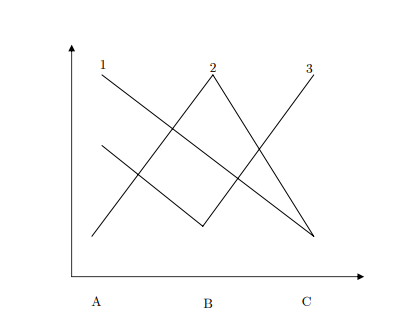

# **Multiple Choice [24 puntos]**

1. En una elección el ganador de Condorcet es:
    a. El candidato con la mayor cantidad de votos de primer lugar
    b. El candidato que vence a cualquier otro candidato en votaciones de a pares
    c. El candidato que es rankeado primero por al menos un votante
    d. El candidato que es rankeado primero por todos los votantes
    e. El candidato que vence a todos los otros candidatos en una votación única de una sola ronda

2. Hay 33 votantes que tienen que elegir una alternativa usando la cuenta de Borda (método n=1) con las siguientes preferencias. Si todos siguen sus preferencias, gana C. ¿Cuántos de los 7 votantes cuya favorita es A deberían cambiar sus órdenes de preferencia para que B resulte ganadora?

    | 7 	| 13 	| 10 	| 3 	|
    |---	|----	|----	|---	|
    | A 	| B  	| C  	| C 	|
    | C 	| C  	| A  	| B 	|
    | B 	| A  	| B  	| A 	|
    a. Al menos 2
    b. Al menos 4
    c. Todos los 7
    d. No importa cuántos cambien, C seguirá ganando

3. Sean 6 partidos en una eleccion que obtienen las siguientes proporciones de votos: [0.47; 0.25; 0.08; 0.08; 0.08; 0.04]. El numero efectivo de partidos para esta elección será: [NOTA: Trabaje a 2 (dos) decimales sin redondear]
    a. 3.53
    b. 3.15
    c. 3.28
    d. 3.00
    e. 4.53
    f. No puede saberse con la información suministrada

4. ¿Cuál de las siguientes NO SON preferencias de pico único?
    a. $x \succ y \succ z \succ w$
    b. $z \succ y \succ x \succ w$
    c. $w \succ z \succ y \succ x$
    d. $w \succ x \succ y \succ z$
    e. $w \succ y \succ x \succ z$
    f. $y \succ z \succ x \succ w$
    g. $y \succ x \succ w \succ z$

5. Sean 5 (cinco) votantes con preferencias de pico único. El número total de coaliciones de mayoría posibles es:
    a. 10
    b. 16
    c. 35
    d. 22
    e. 15
    f. Ninguna es correcta

6. En el modelo de democratización de Acemoglu y Robinson si $\theta > \mu$, entonces
    a. En estado $S=L$, puede haber revolución
    b. En estado $S=H$, nunca hay revolución
    c. En estado $S=H$, sólo hay revolución cuando la misma es excesivamente costosa ($\mu$ alto)
    d. En estado $S=L$, sólo hay revolución cuando la misma es relativamente barata ($\mu$ bajo)
    e. En estado $S=H$, sólo hay revolución cuando la misma es relativamente barata ($\mu$ bajo).
    f. Ninguna es correcta
    
# **Verdadero-Falso [15 pts]** - No requiere justificación

1. [   ] El método de Borda satisface el criterio de independencia de alternativas irrelevantes [V/F]. 
2. [   ] Para un votante cualquiera, el tamaño de su conunto de puntos preferidos a una alternativa cualquiera será inversamente proporcional a la distancia entre esta y su punto ideal [V/F]
3. [   ] En el modelo de no democracia de Acemoglu y Robinson, siempre que se cumpla que $\theta > \mu$, los pobres harán revolución [V/F]
4. [   ] En los modelos con mas de una dimensión (política e ideología), los grupos más numerosos y menos ideológicos tienen un mayor peso/poder en la función de bienestar social ponderada [V/F]
5. [   ] Según el modelo de Baron mientras mayor sea la proporción de votantes no informados, $k$, mayor será la tendencia centrífuga en posiciones/anuncios de política [V/F]
6. [   ] Según el modelo de Meltzer y Richard, mientras más grande sea el ingreso medio en relación al ingreso del mediano, menor será la alícuota resultante del equilibrio político [V/F]

# **Ejercicios [33 puntos]**

1. [10 pts] 25 electores votan por 3 candidatos con la siguiente tabla de preferencias

    | 8 	| 6 	| 7 	| 4 	|
    |---	|---	|---	|---	|
    | A 	| B 	| C 	| B 	|
    | C 	| C 	| A 	| A 	|
    | B 	| A 	| B 	| C 	|

    a. ¿Cuál, si existiera, ganaría bajo mayoría?
    b. ¿Cuál, si existiera, ganaría bajo pluralidad?
    c. ¿Cuál sería el resultado si se usara cuenta de Borda?
    d. ¿Cambiaría alguno de estos resultados si los 8 votantes que prefirieron A intercambiaran su segunda y tercera preferencia?

2. [15 pts] Tres individuos, $i$, $j$ y $k$ están votando sobre 4 alternativas, $q$, $r$, $s$ y $t$. Los ordenamientos de preferencias son:
\begin{align*}
q \succ_{i} s \succ_{i} r \succ_{i} t \\
r \succ_{j} q \succ_{j} t \succ_{j} s \\
t \succ_{k} r \succ_{k} s \succ_{k} q \\
\end{align*}
    a. Si votan sinceramente usando un torneo tipo "round Robin" (votación Condorcet), ¿existen algún/os ciclos de preferencias grupales?
    b. Ahora $k$ cambia de opinión y reordena sus preferencias a $t \succ_{k} s \succ_{k} r \succ_{k} q$ ¿existen ahora algún/os ciclos de preferencias grupales?
    c. Usando las mismas preferencias del punto (a), ¿puede $i$ diseñar una agenda secuencial tal que gane su alternativa más preferida? ¿Y luego de que $k$ cambia de opinión, mantiene su respuesta? Además identifique las agendas que $j$ y $k$ podrían diseñar para favorecer sus primeras preferencias
    d. Ahora usando las preferencias luego de que $k$ cambia de opinión, muestre que si el individuo $j$ propone la agenda $tsrq$ [primero se vota $t$ con $s$, luego el ganador de esa contra $r$ y así], entonces $i$ tiene un incentivo a falsear estratégicamente su voto si ella asume que los otros votarán honestamente. Luego, suponga que $k$ propone agenda $rqst$. ¿Puede $j$ mejorar el resultado que obtendría bajo votación sincera al falsear estratégicamente su voto?

3. [8 pts] Responda si las siguientes preferencias son: a) de pico único, b) de cruce único y demuestre si existe un ganador de Condorcet. *Interprete el resultado*.NOTA: Suponga $A<B<C$. 

{#fig:01001}

# **Ensayos [28 puntos]**

1. [14 pts] ¿Cómo afecta la desigualdad a la probabilidad y senderos de democratización, particularmente en lo que hace a expansiones del sufragio? ¿Existe alguna diferencia si la desigualdad es en ingresos o en activos/tierra? Explique y desarrollo por qué si (o no) y las formas y canales en que actuaría

2. [14 pts] Imagine un país que tiene $m$ distritos electorales uninominales --elige un representante cada uno. De estos, una proporción $k>0.5$ son distritos *swing* y el resto $1-k$ son distritos *core*. Hay 2 (dos) partidos que compiten y múltiples lobbies. Explique, fundamente e ilustre a la luz de los modelos de votación con ideología y grupos de interés, por qué deberían los lobbies seguir estrategias diferentes en relación a las contribuciones de campaña pre-electorales (y cuáles serían estas estrategias). Puede usar diagramas ilustrativos para apoyar y ejemplificar. 

