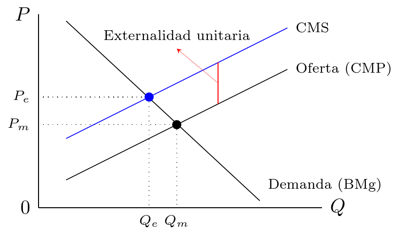

- En muchos casos, los actos de una persona/empresa afectan a otras personas/empresas; en los que una persona/empresa impone costos a otra pero nos las compensa; en los que una persona/empresa genera un beneficio a otras pero no es compensada --contaminación de aire y agua
- Cuando se imponen costos a tercero/s hablamos de **externalidades negativas**; cuando se generan beneficios a tercero/s hablamos de **externalidades positivas**.
- El punto importante es que siempre que haya actividades económicas que generan este tipo de costos/beneficios, la asignacion que realiza el mercado puede no ser eficiente [¿Por qué?]

---

---

- Se pueden **corregir via legislación** --se definen los derechos de propiedad y si los costos de negociación no son muy altos, el mercado puede corregirlas (teorema de Coase)
- Se pueden **corregir via regulación** --se fijan niveles eficientes de producción/consumo --i.e cuotas
- Se pueden **corregir via la aplicación de impuestos y subsidios** para internalizar la externalidad --impulsa a producir menos de la externalidad negativa y mas de la positiva

# Asignación: Recursos de propiedad común (RPC)

- En 1968, Garrett Hardin publicó un célebre artículo en la revista *Science* llamado ["The Tragedy of the Commons"](https://science.sciencemag.org/content/162/3859/1243). 
- Tiene casi 50 mil citaciones reintrodujo una discusión de siglos --como hacer frente al crecimiento poblacional relativo a los recursos y bienes disponibles
- Pero además --y más importante para este curso- introdujo en la discusión el **problema de los recursos de propiedad común ("commons")**, o también conocida como la tragedia de los bienes comunales.  

---

- Un recurso de propiedad común (RPC) **es un bien/factor a cuyos servicios todo el mundo tiene libre acceso** --bancos de pesca, pastos comunales, ríos, lagos y recursos naturales
- La **falla de mercado** se produce ya que estos bienes tienen costo de explotación directo igual a cero.
- Los usuarios individuales no tienen en cuenta el costo de explotación (y sobreexplotación) del recurso
- Los RPC son en realidad **una forma de externalidad** --ya sea entre empresas y/o individuos. Note que el daño aquí es reducir la cantidad el recurso para el resto de empresas y/o individuos.

---

- En décadas recientes, muchos autores desafiaron las ideas de Hardin. La más importante fue Elinor Ostrom
- Ostrom argumentó que **las sociedades y los grupos se organizan para diseñar reglas y mecanismos de cumplimiento** para impedir la degradación de los RCP
- Una de sus contribuciones fue cuestionar los modelos pre-existentes --tragedia de los "commons", dilema del prisionero y la lógica de la acción colectiva.
- Su otra gran contribución fue **explorar soluciones cooperativas al problema de la administración de RPC** y proponer varias reglas plausibles y viables. 

# Asignación: Bienes públicos

- Dos vecinas viven en la misma cuadra. Hay alumbrado de calle (un sólo poste) y un vendededor de pan casero pasa hoy. Sólo le queda un pan. ¿Cuál es la diferencia entre el alumbrado de calle y un pan casero? Las vecinas no pueden consumir el pan casero en forma simultánea: si una lo consume, la otra se queda sin pan. Pero ambas vecinas pueden consumir simultáneamente los servicios de iluminación que da el (único!) poste cuando vuelven del trabajo. En el primer caso, hay rivalidad en el consumo y es posible la exclusión del consumo. En el segundo, no. El pan es un bien privado y el alumbrado es un bien público. 

---

- Un individuo (empresa) tiene incentivos a producir pan casero porque puede cobrar un precio por ellos y así generar ingresos extra. ¿Un individuo (empresa) tiene incentivo a "producir" postes y lámparas de alumbrado de calle en el barrio de ambas amigas? 
- Existen **ciertos bienes y servicios que no pueden proveerse por el mecanismo de mercado**. En algunos casos, el mercado falla totalmente. En otros, produce un resultado ineficiente.
- Estos bienes y servicios **se denominan **bienes públicos** y requieren de un estudio independiente de los bienes privados por sus características. 

---

- Características principales de los **bienes públicos puros (BPP)**
    1. **No hay rivalidad en el consumo**
    2. **No hay exclusión en el consumo**
- ¿Por qué razón se dice que falla el mercado?
    1. Sería ineficiente cobrar un precio por un bien como el alumbrado públic [¿por qué?]
    2. Sería técnicamente imposible excluir de los beneficios de un bien/servicio a un consumidor [¿por qué?]

---

- Si los productores  no tienen incentivos en *proveer* BPP y los consumidores derivan beneficios de consumir BPP, ¿entonces qué sucedería si lo dejáramos librado al mercado sin intervención del Estado? Dos posibles resultados
    1. Provisión cero 
    2. Provisión menor a la óptima

# Asignación: Información imperfecta

- Algunos fallos del mercado provienen del hecho de que existen **asimetrías de información entre diferentes agentes** (consumidores/productores).
- Suele ocurrir que los individuos acuerdan en base a información privada en beneficio propio y en desventaja de la parte menos informada
    1. Mercados privados de seguros
       + Seguros de salud/Seguros de vida
       + Seguros de vivienda y automovil
- Nuevamente aquí el **mercado puede simplemente no existir** (no se desarrolla) o **puede desaparecer/congelarse**. 

---

- Modelo sencillo con **dos tipos de individuos cuya única diferencia es el riesgo**, representado por $p$ --la probabilidad de que el individuo presente un reclamo a la compañía aseguradora
- Los dos tipos de individuos serán entonces, $p_H$ y $p_L$, tal que $p_H > p_L$.
- El individuo conoce su tipo de riesgo pero la compañía aseguradora no [asimetría de información]
- La competencia en el mercado privado de seguros implica la condición de ganacias económicas iguales a cero

---

- Si los individuos tienen información privada sobre su tipo de riesgo entonces:
  + Tipo de riesgo: enfermarse, perder el trabajo, morir
  + Individuos de alto riesgo tienden a subir el precio de mercado para los de bajo riesgo [¿por qué?]
  + Resultado probable: nadie compra seguros de salud aún cuando el beneficio de tener seguro para cada individuo es mayor al costo de proveerlo a ese individuo
  + Sugiere posibilidad de mejorar bienestar (eficiencia) a través de pagos obligatorios [intervención del Estado]

---

- Consumidores (demandantes) mejor informados que productores (oferentes)
- Consumidores con bajo riesgo --buena salud- no participan dado alto costo de precio (prima) que llevan hacia arriba consumidores con alto riesgo --mala salud.
- La cantidad producida de seguros de salud es menor a la óptima (incuso puede ser cero)
- Argumento favorable a la intervención del Estado a través de pagos obligatorios y/o regulación similar --seguro obligatorio de vida, de auto, de salud

---

- Otros ejemplos de fallos de mercado por información imperfecta:
  + Mercado de autos usados
    * Vendedores (oferentes) tienen ventaja de información --conocen el estado de los autos
    * Compradores (demandantes) tienen desventaja de información --no conocen el estado de los autos
  + Mercado de trabajo
    * Trabajadores (oferentes) conocen sus habilidades y su responsabilidad
    * Empresas (demandantes) no conocen las habilidades ni responsabilidad de trabajadores 
- Los principales problemas que surgen aquí son los de selección adversa y riesgo moral. 

# Asignación: Competencia imperfecta

- Cuando los mercados no son competitivos, puede que sea necesaria la intervención del gobierno. 
- Monopolios naturales como los servicios de electricidad y teléfonos --cuando no hay competencia, el mercado produce demasiado poco y a un precio muy alto --el Estado tal vez puede hacerse cargo de producir esos bienes y cobrar precio de competencia (subsidiando a la empresa)
- Normalmente estos análisis se desarrollan en cursos de organización industrial que estudian estructuras de mercado diferentes de la competencia perfecta

# Asignación: Fallos "individuales"

- Cuando los agentes no optimizan, puede ser deseable la intervención del gobierno --i.e. que el gobierno imponga el ahorro via un sistema de seguridad social para el futuro
- Esto no es un fallo del mercado sino que más bien un fallo individual. Problema: ¿por qué el gobierno debería saber más que el individuo lo que es bueno para cada uno? [crítica gobierno paternalista]
- Importantes consideraciones pero difícil de abordar (el individuo no optimiza por preferencias o por otros problemas)

---

> La seguridad social --en particular el sistema de pensiones y jubilaciones- es un ejemplo de problemas de fallos "individuales". Si el gobierno implementa un sistema de reparto como el actual, entonces existe el incentivo de presionar al gobierno por más redistribución sin mayores aportes. Individuos suelen valorar más el (consumo) presente que el (consumo) futuro --**miopía cortoplacista** 

# Distribución

1. Distribución del ingreso
2. Eficiencia y distribución (equidad)
3. Justicia distributiva
   + Enfoque utilitarista (Harsanyi)
   + Enfoque de justicia (Rawls)
   + Enfoque de capacidades (Sen)
   + Enfoque de igualdad de oportunidades (Dworkin/Roemer)

# Distribución: Ingreso y riqueza

- En un momento dado, ¿de qué dependen la distribución de ingreso y riquezas en un pais?.
  1. De las dotaciones de factores y recursos inicial
  2. De los precios de factores y recursos inicial
- Esta distribución puede ajustarse a lo que la sociedad en ese momento dado considera justo. O no. Aún si a todos los factores se les paga el precio de competencia perfecta, puede que la distribución resultante no sea aceptable.
- El gobierno puede entonces hacer política de distribución y/o redistribución de ingresos y riquezas --pueden surgir costos de eficiencia

# Distribución: Ingreso y riqueza (cont.)

- Sea una economía compuesta por 3 (tres) personas
  -Juan, Ana y Carla- y 
  que la cantidad de factores permite producir un PBI de 15.
- Pueden plantearse tres situaciones distributivas hipotéticas:
    1. Juan recibe 5, Ana recibe 5 y Carla recibe 5.
    2. Juan recibe 3, Ana recibe 5 y Carla recibe 7
    3. Juan recibe 0, Ana recibe 5 y Carla recibe 10. 
- Las tres situaciones producen **una asignación eficiente**
      (¿por qué?) pero **con diferencias distribucionales**.
- Es posible que una sociedad encuentre bien (1) y
      hasta (2) pero probablemente no tolere una desigualdad como la (3) 

# Distribución: Eficiencia y equidad

> La economía del bienestar ha dado una definición de la eficiencia en
términos que excluyen consideraciones distributivas. Se afirma que un cambio en las condiciones económicas es
eficiente si y sólo si mejora la posición de A sin
empeorar la posición de (ambos) B y C. Los **problemas
distributivos** no son del tipo alguien gana y ninguno pierde sino
 **alguien gana (Carla) y alguien pierde (Juan)**. Debemos involucrar ideas de filosofía social y juicios de valor. 

# Enfoques de justicia distributiva

- Existen en la discusión de fondo sobre el concepto de justicia sobre el que se basa la funcion de distribución, varios **enfoques de justicia distributiva**. Los más relevantes son:
    1. Enfoque utilitarista (Harsanyi)
    2. Enfoque de justicia (Rawls)
    3. Enfoque de las capacidades (Sen)
    4. Enfoque de igualdad de oportunidades (Dworkin/Roemer)
- Cada uno parte de una determinada dimensión de
  igualdad (resultados, oportunidades).Discuten si hay límites morales/prácticos a la igualación.

---

- El **enfoque utilitarista de Harsanyi** propone que una asignación justa de recursos es aquella sobre la cual *todos los individuos potenciales de la sociedad estarían de acuerdo*.
- Plantea una función de bienestar social:

$$
W(\upsilon^1,\upsilon^2,...,\upsilon^n)
$$

$$W=\frac{1}{n_{h}}\sum_{h=1}^{n_h}\upsilon^h$$

- Ventaja: considera el bienestar de cada persona. Desventaja: es demasiado subjetiva (pobre feliz/rico infeliz) y las comparaciones inter-personales de utilidad

---

- El **enfoque de justicia de Rawls** considera que los principios de
    justicia más aceptables son aquellos que emanan de una situación
    original en las que los individuos desconocen cuál será su lugar
    en la sociedad
- Plantea el principio de libertad y que las desigualdades socio-económicas serán aceptables sólo si:
    1. Todos enfrentan las mismas oportunidades
    2. Aumentan el beneficio esperado de los individuos menos favorecidos de la sociedad
- La situación original es cuestionable. Y tampoco incorpora temas de esfuerzo y responsabilidad. Una referencia clásica en este tema

---

- El **enfoque de capacidades de Sen** plantea que el
    bienestar debe medirse en base a:
    1. Funcionamientos --aquellas cosas que las
      personas pueden alcanzar (tener voz, tener tierra, agruparse y
      participar)
    2. Capacidades --la mayor o menor libertad
        que tienen para lograr esos funcionamientos
- Es un enfoque más integral del bienestar humano --fue la base para el desarrollo de indicadores de desarrollo humano y bienestar. Pero es dificil de operacionalizar (identificar y medir muchas variables)

---

- El **enfoque de (igualdad de) oportunidades de Dworkin/Roemer** plantea
    una separación entre las preferencias individuales ("esfuerzos") y aquellos factores que condicionan las elecciones y decisiones de las personas ("circunstancias").
- No persigue igualación de resultados --admite desigualdad pero siempre que no esté basado en desigualdad de oportunidades (sólo basada en desigualdad de esfuerzo, etc).
- Una desventaja es que no siempre es fácil (ni posible) desglosar la desigualdad debida a diferentes circunstancias y aquella debida a diferentes esfuerzos. 

# Problemas c/justicia distributiva

- Hay dos grandes problemas que hacen
  difícil la articulación de reglas de justicia generales.
    * (Virtualmente) imposible comparar utilidad que
    diferentes personas. Las utilidades no pueden
    ser sumadas de manera obvia [vaso de agua en
    ciudad/desierto]. También la utilidad del
    dinero es diferente para niveles de ingreso
    * Tamaño de la torta no es
      independiente de como se distribuye --las
      políticas de redistribución pueden causar costos de
      eficiencia (distorsiones) que pueden achicar la torta (i.e para
      lograr un objetivo nos alejamos de otro)

# ¿Cuánto redistribuir?

- Mejor aún: ¿hay algún límite a la redistribución? 
    1. Gobierno encargado de **todas** las actividades de asignación, distribución y estabilización de manera directa [economía planificada]
    2. Gobierno encargado de **algunas** actividades de asignación, distribución y estabilización
- La primera alternativa tiene varios problemas:
    1. Información --¿cómo hace el gobierno para agregar preferencias/tecnología?
    2. Distorsiones --vinculadas con políticas de impuestos y subsidios. Alteran incentivos privados  [ej: impuesto a la riqueza de 50% --fuga de patrimonios y capitales]

# ¿Cuánto redistribuir? (cont.)

- La segunda (más realista) tiene el problema de cómo lograr una distribución "adecuada" de funciones entre mercado y Estado --volvemos a: "Primero, el mercado. Sino, el Estado"
- Lo que nos lleva a que el Estado debe intervenir sólo cuando hay fallos del mercado. Pero quedan dos cuestiones pendientes
    1. ¿Y si la redistribución del 2TDB no es posible? Interviene el Estado
    2. ¿Cuánto redistribuir? Es un problema normativo y se resuelve normalmente a través del proceso político

# Estabilización

- La tercer función del Estado es la de **contribuir a mantener
  condiciones macroeconómicas sólidas y estables**. Sin la intervención
  activa del gobierno, las fluctuaciones suelen ser muy importantes
  --más aún en economias globalizadas
- En un período cualquiera, si el nivel de demanda es
    insuficiente y los salarios son rígidos a la baja, entonces habrá
    desempleo.
- El gobierno puede usar instrumentos de política para
      revertir la baja del empleo (medidas expansivas); si la economia
      atravesara una situacion de excesivo gasto, entonces se
      necesitarán medidas contractivas

---

- Existen instrumentos monetarios y fiscales al alcance del Estado para realizar política de estabilización.
- Los instrumentos monetarios clásicos: tasa de interés y oferta monetaria. El BCRA puede controlar la OM --un aumento de la OM aumenta liquidez; una baja de la OM la disminuye
- Los instrumentos fiscales también influyen sobre el nivel de actividad --un aumento del gasto público incrementa la demanda, al igual que una baja de impuestos. Pero ambas aumentan el déficit de gobierno --como se financia el déficit importa (en el sentido del nivel de actividad)

# Funciones: Relaciones

- Funciones del gobierno no son aisladas y están interrelacionadas --cumplir una función puede afectar al cumplimiento de otra

- Algunos ejemplos

> Imagine una política redistributiva
--impuesto a $Y$ altos y subsidio a $Y$ bajos. Con esta política
mejoraría la distribución del ingreso. Sin embargo, al gravar $Y$ altos --disminuye el ahorro promedio-- posible menor crecimiento en el futuro. 

# Funciones: Relaciones (cont.)

> Suponga que las personas desean un aumento en la oferta de servicios
públicos. Para ello hay que aumentar los impuestos (suponga por ahora
que el gobierno no emite ni toma deuda). Depende que
impuestos se usen, puede cambiar la distribución del ingreso. De este
modo, algunos votantes pueden aprobar (rechazar) el cambio propuesto
porque les agrada (desagrada) el cambio propuesto en la distribucion y
no porque les agrada (desagrada) el servicio público.

# Funciones: Relaciones (cont.)

> Supongamos que es necesaria una política fiscal expansiva. Puede
lograrse elevando el gasto en servicios públicos o reduciendo los
impuestos. En el primer caso, se interfiere con el objetivo
asignación. En el segundo, con el objetivo distribución
(potencialmente).

# Tipos de análisis (enfoques)

- Tres tipos de análisis en relación a la ESP:
    1. **Análisis positivo** --análisis de lo que hace el
    Estado y los efectos de ello --i.e. se pregunta por lo que es; no
    es valorativo. Describe como funciona la economía
    2. **Análisis normativo** --análisis de lo que
      debería hacer el Estado  --i.e. se pregunta por lo que debe
      hacer el Estado; es valorativo. Describe como debería funcionar la economía
    3. **Análisis de elección pública/economía política**
        --desarrolla teorías para explicar el
        comportamiento del gobierno e identifica políticas óptimas;
        crítica al análisis normativo (restricciones políticas)

# Ejemplo

>  El **análisis positivo** describiría los efectos del
      impuesto sobre el $P$ del fernet. ¿Subirá el $P$ en 15
      pesos o menos? Describirá en cuánto disminuiría la
      $Q_{d}$ y a qué personas afectaría más. Analizaría la relación entre la $Q_{d}$ y el número de accidentes. Al decidir si debería (o no) adoptarse el impuesto, entran los juicios de valor y el **análisis normativo** deberá valorarse los beneficios de mayores ingresos fiscales, las distorsiones en el consumo, la incidencia sobre consumidores, y los beneficios de salvar vidas en accidentes.

# Diferencias y discrepancias

- Los economistas y policy-makers suelen **discrepar en los efectos** de diferentes medidas y en general sobre el comportamiento de la economía --suele surgir porque los modelos que usan hacen diferentes supuestos. Las diferencias son en cuanto a la dirección del efecto y a la magnitud del mismo.
- También suelen **discrepar en relación a los valores**. Aún si todos están de acuerdo sobre efectos, pueden pensar diferente sobre su conveniencia. Toda política afecta diferentea a individuos y colectivos y pueden valorarse (ponderarse) diferente --algunas valoran más la estabilidad, otras la distribución.
