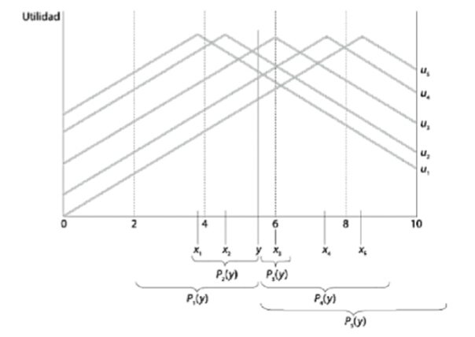

- Existe una relación positiva entre gasto público y PIB per capita con alguos *outliers* y posibles no linearidades
- ¿Cómo se explican estas diferencias desde un enfoque puramente económico sin considerar la politica?
- Posibles explicaciones $\longrightarrow$ 1) mayor rol
          redistributivo del Estado; 2) instituciones políticas --presidencialismo vs parlamentarismo, mayoritario vs representación proporcional.

---

- Si miramos evolución comparada de largo plazo, observamos claras tendencias a mayor participación estatal en la economía $\longrightarrow$ medido tanto por el lado de gastos como de recursos y también para diferentes países
- También aquí la política es importante $\longrightarrow$ expansión y fortalecimiento de las democracias en los últimos 150 años
- ¿Diferentes preferencias? ¿Diferentes instituciones?

# Diferentes preferencias

-   Individuos $\longrightarrow$ diferentes en varias dimensiones. Dos
    son de particular interés:
    -   Diferencias en preferencias individuales y dotaciones
        individuales $\longrightarrow$ implican diferentes preferencias
        por políticas (heterogeneidad "ex-ante")
    -   Diferencias distribucionales $\longrightarrow$ diferencias
        debido a la acción del mercado (heterogeneidad "ex-post")
        "ex-post".
-   Conflicto de intereses $\longrightarrow$ entre ciudadanos pero
    también posible entre ciudadanos y políticos.

# Diferentes instituciones

-   **Preferencias diversas** de ciudadanos y grupos --preferencias de
    ciudadanos por diferentes niveles de gasto público.
-   Las **instituciones políticas** --i.e reglas constitucionales-
    "agregan" estas preferencias diversas originando resultados
    políticos específicos.
-   Estos dan lugar a **políticas públicas** concretas.
-   Las políticas públicas producen **resultados económicos (y de otra
    índole)** e impactan sobre las **preferencias diversas** de los
    individuos.

# No sólo varía en un momento...

{height=550px}

# ...sino también a lo largo del tiempo

{height=550px}

# La economía política de la política pública

# El rol de la política

- Un aspecto relevante de la política es en lo que hace a la **heterogeneidad de intereses**
- Restricciones políticas derivadas de ello implica que las políticas adoptadas en la práctica **no son óptimas**
- Implicaciones positivas $\longrightarrow$ si la política óptima se encuentra no resulta cierto que esta se implementa (implícito en la *economía del bienestar*)
- Implicaciones normativas $\longrightarrow$ ¿cómo pueden diseñarse instituciones y políticas para lograr ciertos objetivos?

---

> **Democracia como forma de gobierno** La democracia es la peor de todas
las formas de gobierno excepto por todas las demás \[Winston Churchill\]

---

- Elección de la política económica importa una decisión
      colectiva a partir de intereses (preferencias) individuales e
      instituciones políticas determinadas
- Decisiones difieren según instituciones políticas
        --dictadura versus democracia $\longrightarrow$ tanto en el
        proceso como en los resultados
- Existen dos modelos tipicos de democracia --directa y
         representativa. Si bien difieren en muchos aspectos, ambas
         tienen en el centro del proceso decisorio a mecanismos de
         votacion.

# Escuela de la elección pública

-   Individuos racionales motivados por el propio interés en las
    interacciones políticas

> **Modelando al individuo.** Los individuos deben ser modelados en cuanto
persiguen su propio interés, definido en términos estrictos, como la
posición de riqueza neta, ya sea predecida o esperada

> **Reglas de juego y juego del juego.** "Para mejorar la política, es
necesario mejorar o reformar las reglas, el marco dentro del cual el
juego de la política se lleva a cabo. De ningún modo se sugiere que el
mejoramiento descansa en la selección de agentes moralmente superiores
que usan sus poderes para la búsqueda del "interés público"

# Racionalidad y preferencias individuales

# Racionalidad y preferencias

> **Racionalidad.** Los individuos que nos interesa estudiar son personas
comunes que tienen **deseos** y **creencias**. Ambos afectan su
comportamiento. Hay **deseos** que provienen desde la propia naturaleza
humana como el deseo de supervivencia y reproducción, otros que
provienen de la vida social, como el tipo de ropa que usamos o la música
que escuchamos y otros que provienen de fuentes religiosas, culturales
ideológicas, entre otras. En el mundo de la economía política, nos
referimos a los deseos como **preferencias**. Y no nos interesa explicar
por qué las preferencias son como son --son *dadas* y *estables*, sino
que nos preocupa analizar el impacto de esas preferencias.

---

-   El mundo de las preferencias es un *mundo interior*
    $\longrightarrow$ las personas no revelan en todo momento y lugar
    sus preferencias sobre todas las cosas.
-   Debemos hacer algunos *supuestos* sobre sus preferencias --pueden
    derivarse de intuiciones, evidencias.
-   Pero también existe un *entorno exterior* $\longrightarrow$
    incertidumbre de diversa indole. Esta incertidumbre *afecta* la
    forma en que los individuos expresan sus preferencias.

--- 

> **Incertidumbre, preferencias y comportamiento.** Sea un *individuo*
cuya *preferencia* sea obtener un 10 en el examen. No
puede elegir "obtener un 10 en el examen". Pero puede elegir un
*instrumento* (acción) para acercarse a un *resultado* acorde su preferencia. Si una acción es "estudiar la noche previa" y la otra es
"ir de joda" y si se sabe con certeza que la primera
conducirá al resultado preferido, entonces como actor racional deberá elegirla. [PERO:]{.ul} los
individuos no tienen conocimiento perfecto de como un instrumento
conduce al resultado. Además, pueden no conocer como afecta al
resultado lo que otros hacen y tampoco anticipar eventos inesperados. Los individuos deben elegir instrumentos
en base a su conocimiento y experiencia personal y la información que
tienen disponible. Es aquí donde entran las **creencias**

---

-   **Creencias** $\longrightarrow$ ideas que un individuo posee en
    relación a la eficacia de un determinado instrumento (comportamiento
    o acción) para obtener un resultado que está en línea con una
    **preferencia** de ese individuo.
-   Las **creencias** conectan los instrumentos con los resultados.
    Cuando un individuo actua de acuerdo tanto en base a sus
    preferencias como a sus creencias, se dice que existe **racionalidad
    instrumental**.
-   Las **creencias** cambian --los individuos aprenden- y eso hace que
    se revisen las ideas sobre la eficacia de los instrumentos.
    Gradualmente se reduce la incertidumbre.

---

> **Elección racional: Preferencias y creencias.** Un **individuo racional** es
aquel que combina **creencias** sobre el **entorno exterior** y
**preferencias** sobre **cosas del entorno exterior** de una manera
consistente. Este enfoque implica una forma de **individualismo
metodológico**. Lo más relevante de este enfoque es la observación de
que los **individuos** tienen preferencias y creencias. Los colectivos
--grupos, clases, empresas, naciones- no tienen preferencias y creencias
en el sentido cognitivo. Aquí entra en juego el tema de la **agregación
de preferencias y creencias**

# Preferencia y elección

-   Sea un individuo, $i$, y 3 objetos --"alternativas"-, $A$,
    $B$, y $C$ sobre los que $i$ tiene preferencias.
-   El individuo $i$ es capaz de evaluar:
    -   "Prefiero $A$ a $B$"
    -   "Soy indiferente entre $B$ y $C$".
-   La relación $A \succ B$ representa al primer enunciado;
    la relación $B \sim C$ representa al segundo
-   La **elección** de $i$ es racional si está de acuerdo con su
    **preferencia**.
-   Relaciones de preferencia sujetas a ciertas propiedades que permita "ordenarlas"

# Propiedades de las relaciones

> **Comparabilidad (completitud).** Las alternativas son comparables en
términos de las preferencias si, dadas dos alternativas posibles, $A$ y
$B$, tenemos ya sea $A \succ
B$, $B \succ A$, o $A \sim B$. Las alternativas son comparables si, dado
cualquier par de ellas, el individuo $i$ prefiere la primera a la
segunda, la segunda a la primera, o es indiferente entre una y otra.

> **Transitividad.** Se dice que la relación de preferencia estricta es
transitiva si, dadas tres alternativas --$A$, $B$, y $C$-, si
$A \succ B$ y $B \succ
C$, entonces $A \succ C$. Si el individuo $i$ prefiere estrictamente $A$
a $B$ y $B$ a $C$, entonces prefiere $A$ a $C$.

# Ordenamiento de preferencias

-   Si las preferencias de $i$ satisfacen estas propiedades, decimos que
    $i$ tiene un **ordenamiento de preferencias racional**. La elección
    racional será la que esté al inicio (izquierda) del ordenamiento
-   Estos ordenamientos de preferencias son **personales** y cada $i$ puede tener uno diferente.
-   No todas las relaciones entre "alternativas" son **completas** o
    **transitivas**. Ejemplos:
    -   La comparación debe tener sentido $\longrightarrow$ elegir entre cosas desconocidas
        (comparabilidad)
    -   La comparación debe ser sobre algo que le importa al individuo
      

# Ejemplo: Preferencias deportivas

-   Supongamos que le pedimos a un ciudadano que elabore su relación de
    preferencias por los equipos del Mundial 2018. En total son 32
    equipos.
-   Si esta persona sólo tiene algun tipo de información sobre 31 de los
    32 equipos --desconoce absolutamente todo sobre Islandia
    $\longrightarrow$ viola propiedad de "comparabilidad"
    ("completitud")
-   Si esta persona puede comparar todos los equipos en su deseo de
    quien le gustaría gane el Mundial y los ordena así: $Ger
        \succ Bra$ y $Bra \succ Uru$, pero prefiere que $Uru \succ Ger$
    $\longrightarrow$ viola propiedad de "transitividad".

# Agregación y preferencias colectivas: Reglas de decisión

# De lo individual a lo social

-   Teoría de la elección social $\longrightarrow$ estudio de los
    procesos colectivos de decisión a través de modelos y paradigmas de
    cómo agregar insumos individuales --preferencias, bienestar- en
    productos colectivos --preferencias, bienestar.
-   Nicolas de Condorcet y Jean-Charles de Borda plantearon el problema
    en el siglo 19; Arrow, Sen y Black lo teorizaron en el siglo 20.
-   La influencia de la teoría de la elección social ha sido fundamental
    en el progreso de la economía, la ciencia política y la sociología,
    entre otras disciplinas

# Supuestos del análisis 

-   Existe un **número impar de individuos** que eligen entre:
    -   Dos (2) alternativas
    -   Más de dos (2) alternativas
-   Los individuos eligen **racionalmente**
-   Los individuos votan **sinceramente** --no estrategicamente
-   Todos los individuos **participan**.

# Sistemas  y reglas de decisión

-   Unanimidad $\longrightarrow$ gana quien recibe **todos** los votos
-   Mayoría (mayoría absoluta) $\longrightarrow$ gana la alternativa que
    recibe la mitad más uno de los votos.
-   Pluralidad (mayoría simple) $\longrightarrow$ gana la que recibe más votos (cada individuo elige su más preferida)
-   Pluralidad con 2da vuelta $\longrightarrow$ gana la que recibe la mayoría absoluta de votos en una elección con sólo las 2 alternativas mas votadas en 1era vuelta.
-   Mayoría absoluta con voto Condorcet $\longrightarrow$
    se combinan en todos los pares posibles y se votan
    - Por puntos (Borda) $\longrightarrow$ cada individuo asigna puntos a
    las alternativas y gana la de mayor puntaje

---

-   En elecciones con 2 (dos) alternativas, los sistemas de
    **unanimidad** y de **mayoría absoluta** suelen funcionar bien. El
    de unanimidad es muy restrictivo y puede no haber ganador. El de
    mayoría absoluta da siempre un ganador.
-   En elecciones con 3 (tres) o más alternativas, la mayoría absoluta
    no siempre funciona. Suelen usarse alternativas que varían entre
    **pluralidad/mayoría simple** y **pluralidad con segunda vuelta**
-   Los sistemas de **mayoría absoluta con voto de a pares** y de
    **puntos** suelen usarse en votaciones en comités y en concursos y
    premios.

# Caso I: Dos alternativas

-   Condiciones deseadas de un sistema de reglas de votación entre dos
    alternativas:
    -   Anonimidad $\longrightarrow$ si 2 votantes intercambian sus votos
        antes de emitirlos, el resultado de la elección no cambia
        (votantes simétricos)
    -   Neutralidad $\longrightarrow$ si cada votante individual revierte su orden de preferencia --i.e
        si votó por A, ahora vota por B y viceversa-,
        el resultado de la elección se revierte (alternativas simétricas)
    -   Monotonicidad $\longrightarrow$ si un votante único que originalmente votó por el perdedor elección, ahora vota por el ganador, el ganador de la elección  sigue siendo el mismo.

---

-   Caso de dos opciones $\longrightarrow$ siempre que el número de
    votantes sea impar, habrá un resultado cierto. Si se vota por regla
    de mayoría absoluta, se elegirá la opción preferida por una mayoría
    de votantes, i.e. $\frac{N+1}{2}$

> **Teorema de May.** El único método que satisface las condiciones de
anonimidad, neutralidad y monotonicidad para determinar un ganador de
una elección entre dos alternativas es la regla de la mayoría absoluta.

---

> Tres votantes, dos alternativas:

1.  $A \succ B$
2.  $A \succ B$
3.  $B \succ A$

> El ganador por mayoría absoluta de esta elección es $A$. ¿Que pasa si
dos votantes intercambian sus votos? (anonimidad)

1.  $A \succ B$
2.  $B \succ A$
3.  $A \succ B$

El resultado no cambia: gana $A$

---

> Tres votantes, dos alternativas ¿Que pasa si cada uno revierte su preferencia? (neutralidad)

1.  $B \succ A$
2.  $B \succ A$
3.  $A \succ B$

El resultado también se revierte: gana $B$ 

> Qué pasa si 3 que
votó antes por el perdedor, ahora vota por el ganador?
(monotonicidad)

1.  $A \succ B$
2.  $A \succ B$
3.  $A \succ B$

El ganador sigue siendo el mismo, $A$.

# Caso II: Más de dos alternativas

-   Con dos alternativas $\longrightarrow$ regla de mayoría absoluta
    para agregar preferencias individuales en preferencias sociales
    produce un claro ganador que satisface propiedades deseadas (siempre
    que número de votantes sea impar)
-   ¿Qué sucede si, como en situaciones de la vida real,
    hay más de 2 alternativas?
-   El problema se vuelve más complejo. Problema $\longrightarrow$
    existe alguna regla de votación que permita agregar preferencias
    individuales en preferencias sociales y que produzca un claro
    ganador y que satisfaga propiedades deseadas?
    -   La respuesta es **no**.

---

::: {#tab:tab1}
   Orden   Juan   Pedro   María
  ------- ------ ------- -------
     1      A       C       B
     2      B       A       C
     3      C       B       A

  : Tres alternativas y tres personas
:::

-   ¿Hay ganador por mayoría absoluta? No. Ninguna tiene la mitad mas
    uno de los votos (2). ¿Hay ganador por mayoría simple (pluralidad)?
    No. Ninguna alternativa tiene más votos que otra --ie. hay triple
    empate.

# El Marqués de Condorcet

-   Condorcet se focalizó en un método específico de votación
    $\longrightarrow$ votación por mayoría.

> **Teorema del jurado de Condorcet.** Si cada miembro de un jurado tiene una $Prob$ igual e
independiente, $0.5<p<1$ de adoptar la decisión correcta sobre la
culpabilidad o inocencia de un acusado, entonces la $Prob$ de que
el jurado adopte la decisión correcta se acercará a 1 a
medida que el tamaño del jurado aumenta.

> **La paradoja de Condorcet.** Aún con preferencias individuales
"racionales" (transitivas), las preferencias del grupo (mayoría)
pueden ser "irracionales" (no transitivas). No hay claro ganador.

# Contribuciones de Condorcet

-   La primera idea de Condorcet permite permite justificar votaciones
    colectivas que incluyan, dentro de lo posible, el mayor tamaño
    posible de grupo --jurados populares, elecciones presidenciales.
-   La segunda idea plantea un problema en relación al metódo de
    decisión colectiva $\longrightarrow$ la elección por mayoría simple
    es un método válido de elección pero puede estar asociado a este
    problema de "irracionalidad" del colectivo.
-   Sus planteos le valieron conceptos actuales como *ganador de
    Condorcet* y *ciclos de Condorcet*.

# Votación Condorcet

-   Suponga que un colectivo debe elegir entre 3 alternativas: A, B
    y C. Hay a priori 6 formas diferentes en que las
    preferencias pueden ser ordenadas:
    -   $A \succ B \succ C$
    -   $A \succ C \succ B$
    -   $B \succ A \succ C$
    -   $B \succ C \succ A$
    -   $C \succ A \succ B$
    -   $C \succ B \succ A$
-   Suponga ahora que el colectivo está compuesto por sólo 3 individuos
    cuyas preferencias son:

---

1.  $A \succ B \succ C$
2.  $B \succ C \succ A$
3.  $C \succ B \succ A$

-   Imagine ahora que se vota de a pares.
    -   Voto entre A y B. ¿Quién gana? B
    -   Voto entre B y C. ¿Quién gana? B
    -   Voto entre C y A (¿es relevante?). ¿Quién gana? C.
-   ¿Hay alguna alternativa que le gana a todas las demás en votaciones
    apareadas? Si. La alternativa B. \[¿Por qué A no puede ser un
    GdC? ¿Por qué C no es un
    ganador de Condorcet?\]
-   La alternativa B es un *ganador de Condorcet*

---

1.  $A \succ B \succ C$
2.  $B \succ C \succ A$
3.  $C \succ A \succ B$

-   Imagine ahora que se vota de a pares.
    -   Voto entre A y B. ¿Quién gana? A
    -   Voto entre B y C. ¿Quién gana? B
    -   Voto entre C y A. ¿Quién gana? C
-   ¿Qué alternativa debería ganar si se cumple la transitividad de las
    preferencias? A
-   No hay transitividad. Se da lo que se llama un *ciclo de Condorcet*
    $$A \succ B \succ C \succ A$$

# Ciclos y ganadores de Condorcet

> **Ganador de Condorcet.** Un *ganador de Condorcet* es una alternativa tal
que recibe la mayoría de los votos cuando es apareada contra cada una de
las otras alternativas

> **Ciclos de Condorcet.** Un *ciclo de Condorcet* ocurre cuando existe una
violación del principio de transitividad en el ordenamiento de las
preferencias sociales

---

> **Teorema I.** Si existe un ciclo de Condorcet, entonces no existe un ganador de Condorcet

> **Ejemplo.** Consideremos el caso con tres alternativas. Sea
$A \succ B \succ C \succ A$\
¿Es A un ganador de Condorcet? $\longrightarrow$ No, dado que $C
\succ A$\
¿Algún otro (B o C) es un ganador de Condorcet? $\longrightarrow$

-   No, porque $A \succ B$ (B no es)
-   No, porque $B \succ C$ (C no es)

> **Teorema II.** Un ciclo de Condorcet ocurre cuando no existe un ganador de Condorcet

# Ilustración: Fijar agenda

-   Supongamos que tenemos 30 personas cuyas preferencias por 4 (cuatro)
    alternativas se distribuyen de la siguiente manera:

::: {#tab:tab1}
   votantes          preferencias
  ---------- -----------------------------
      10      $A \succ D \succ C \succ B$
      10      $B \succ A \succ D \succ C$
      10      $C \succ B \succ A \succ D$

  : 3 alternativas, 3 personas
:::

-   ¿Puede $D$ gane democráticamente? Si, manipulando el
    orden de votación como la siguiente: 1) Voto entre $B$ y $A$; 2)
    Voto entre $B$ y $C$; 3) Voto entre $C$ y $D$ $\longrightarrow$
    todos disconformes con el resultado \[¿Por qué?\]

# Relevancia de los ciclos

-   Recordando las preferencias que generaron un ciclo de Condorcet.
    Sea el orden de votación	:
    -   1ra: A vs B. 2da: ganador de A vs B contra C
        -   Dado que $A \succ B$ y $C \succ A$, [gana C]{.ul}
    -   1ra: A vs C. 2da: ganador de A vs C contra B
        -   Dado que $C \succ A$ y $B \succ C$, [gana B]{.ul}
    -   1ra: B vs C. 2da: ganador de B vs C contra A
        -   Dado que $B \succ C$ y $A \succ B$, [gana A]{.ul}.
-   El ganador depende depende del orden de votación! Este es el problem de los ciclos

---

-   Este simple ejemplo ilustra la importancia decisiva del "poder de
    agenda" --qué alternativas considerar y en qué orden las
    consideramos y votamos.
-   ¿Quiénes establecen la agenda en la vida real?
    -   En el Congreso, el Presidente de la Cámara y los Presidentes de
        Comisión tienen amplios poderes para decidir que asuntos se
        giran y para proponer el orden de votaciones en el recinto. En
        EEUU, es el Speaker of the House
    -   En regímenes presidencialistas, los ejecutivos también tienen
        poder de agenda (DNU, vetos, poderes delegados)
-   El poder de agenda no es ilimitado ni da control absoluto, pero da alguna ventaja

# Votación Borda

-   El **método de Borda** es una alternativa a Condorcet para superar el problema de los ciclos. Sean 5 votantes y 3 alternativas tal que:

::: {#tab:tab2}
   Orden   1   2   3   4   5
  ------- --- --- --- --- ---
     1     A   A   A   B   B
     2     B   B   B   C   C
     3     C   C   C   A   A

  : Método de Borda
:::

-   Cada individuo (grupo de invidiuos) van a
    puntuar las alternativas según el lugar (orden) que ocupen en el
    ordenamiento. A diferencia de Condorcet, este método usa toda la información de preferencias (intensidad de las preferencias).

---

-   Existen dos implementaciones alternativas del método de Borda:
    -   La alternativa en 1er lugar recibe $n$ puntos, la alternativa
        en 2do lugar, recibe $n-1$ puntos, y así hasta la última alternativa
        donde "n" es el número de alternativas. En este caso la última
        alternativa siempre recibe 1 punto.
    -   La alternativa en primer lugar recibe $n-1$ puntos, la
        alternativa en segundo lugar, recibe $n-2$ puntos, y así hasta la
        última donde "n" es el número de alternativas. En
        este caso la última alternativa siempre recibe 0 punto.
-   Pueden utilizarse ambos criterios a menos que esté explícitamente
    indicado un criterio en el ejercicio y/o práctico.

---

-   En este caso (solucionando por método "n-1", las alternativas
    recibirían:
    -   $A$ $\longrightarrow$ 6 votos
    -   $B$ $\longrightarrow$ 7 votos
    -   $C$ $\longrightarrow$ 2 votos
-   Parece un método razonable aunque algo difícil de implementar
    $\longrightarrow$ el candidato C podría desistir de presentarse
-   En ese caso, la primera alternativa recibe 1 (uno) y la segunda 0
    (cero).

---

-   Ahora con este nuevo esquema, el ganador es $A$! (obtiene 3 contra 2
    votos de $B$) $\longrightarrow$ presencia o no de alternativas
    irrelevantes --$C$- puede modificar el resultado de la elección
-   Este método sin embargo se usa mucho en eventos y competiciones
    musicales y en elección de sedes, mejores jugadores, etc.
-   El principal problema del método Borda $\longrightarrow$ viola el
    principio de mayoría y viola el ganador de Condorcet

---

-   Suponga la siguiente distribución de preferencias por 4 (cuatro)
    alternativas entre 3 (tres) grupos de votantes. Identifique cuál es
    el candidato Borda:

::: {#tab:tab3}
                49   48   3  
  ----- ------ ---- ---- --- --
   1ro   4pts   A    B    C  
   2do   3pts   B    D    B  
   3ro   2pts   C    C    D  
   4to   1pts   D    A    A  

  : El método de Borda
:::

--- 

> **Ordenamiento de preferencias.** Considere los siguientes perfiles de
preferencias para tres individuos:

1.  $x \succ y \succ z \succ w$
2.  $y \succ z \succ x \succ w$
3.  $z \succ x \succ y \succ w$

De acuerdo a la regla de la mayoría, obtenemos que $y \succ z \succ x
\succ w$. Sin embargo, hay algo que "está mal" acercad de este
ordenamiento social.

# Tipos de preferencias y el teorema del votante mediano

# ¿Qué hacer cuando hay ciclos de Condorcet?

-   Los ciclos de Condorcet existen, sobre todo, cuando existen muchas
    alternativas entre las cuales elegir y muchos individuos que elijen.
    -   ¿existe alguna forma de agregar preferencias que es mejor a
        otra?
-   La respuesta: no existe una respuesta correcta!
-   Ninguna forma es perfecta
-   Este es uno de los resultados mas famosos en la teoría de la
    elección social y se denomina el **Teorema de la Imposibilidad de
    Arrow**.

# Pero cómo que no sabías!

{#fig:2}

# Teorema de la Imposibilidad

-   Dados:
    -   Un conjunto de alternativas, $O$
    -   Un conjunto de individuos, $G$
    -   Una regla de decisión social, $\succ$
-   Las preferencias de $i$ son "racionales" si son:
    -   **Completas** $\longrightarrow$ dadas dos alternativas
        , $A$ y $B$, c/individuo puede
        rankearlas/ordenarlas --i.e. $A \succ B$, $A=B$, o $B \succ A$.
    -   **Transitivas** $\longrightarrow$ dadas tres alternativas
        cualquiera, $A$, $B$ y $C$, si $A \succ B$ y $B \succ C$,
        entonces $A \succ C$

---

-   Dominio universal $\longrightarrow$ supone que los individuos tienen
    preferencias racionales sobre todas las alternativas del conjunto
    $O$
-   Optimalidad de Pareto $\longrightarrow$ si todo los individuos de
    $G$ prefieren $A$ a $B$, la regla de decisión social debe preferir
    $A$ a $B$.
-   Independencia de alternativas irrelevantes $\longrightarrow$ si hay
    dos conjuntos de individuos, $G$ y $G'$ y en cada uno todos los
    individuos tienen el mismo orden de preferencia entre A y B, el
    ordenamiento social entre A y B debe ser el mismo independientemente
    de las preferencias por otra alternativa C.
-   No dictadura $\longrightarrow$ ningún individuo de G tal que sus
    preferencias determinen el orden social independientemente de los
    otros.

---

> **Teorema de la imposibilidad de Arrow.** No existe una función de
ordenamiento social $\succ$ tal que para cualquier grupo G cuyos
miembros tengan todos preferencias racionales, $\succ$ sea un
ordenamiento racional (transitivo) y que satisfaga los cuatros supuestos
de dominio universal, optimalidad de Pareto, independencia de
alternativas irrelevantes y no dictadura.

-   Houston, tenemos un problema! $\longrightarrow$ los ciclos de
    Condorcet y el tema del poder de agenda representan problemas
    centrales y fundamentales para los que no hay una solución general.
-   Si queremos una función de ordenamiento social que cumpla con todas
    esas propiedades, no será transitiva $\longrightarrow$ habrá ciclos.

---

-   Es díficil relajar cualquiera de los supuestos de optimalidad de
    Pareto, independencia de alternativas irrelevantes y de no dictador
    sin caer en injusticias
-   La condición del dominio universal, sin embargo, puede ser relajada
    ya que no es una condición de equidad, sensatez o adecuación; es un
    requisito de dominio.
-   Este es un requisito sumamente restrictivo ya que exige que el
    mecanismo de decisión colectivo funcione en todos los ámbitos
    imaginables (dominio más amplio posible).
-   ¿Que pasa si restringimos el dominio? (menos generalidad)

# Tipos de preferencias

-   Cuestión del aborto en EEUU $\longrightarrow$ polarización
    -   Provida (V) $\longrightarrow$ prohibir aborto totalmente
    -   Proeleccion (E) $\longrightarrow$ derecho absoluto a
        elegir
    -   Roe-Wade (R) $\longrightarrow$ aborto en etapa temprana
-   ¿Cuáles son las preferencias de los grupos?
    -   $V \succ R \succ E$ (provida)
    -   $E \succ R \succ V$ (proeleccion)
    -   $R \succ V \succ E$ (roe-wade1)
    -   $R \succ E \succ V$ (roe-wade2)
-   Ninguno de los grupos considera a $R$ como la peor alternativa
    $\longrightarrow$ ¿consenso?

---

{#fig:1}

---

> **Teorema del pico único.** Considérese un conjunto $O$ de alternativas del
cual un grupo $G$ de individuos debe escoger una. Si, por cada
subconjunto de tres alternativas de $O$, y para cada miembro del grupo,
una de estas alternativas **nunca** es la peor de las tres, entonces el
consenso es lo suficientemente generalizado como para que el método de
la regla de la mayoría produzca preferencias de grupo que sean
transitivas

-   Implicancia fundamental $\longrightarrow$ aún cuando los miembros
    del grupo tengan puntos de vista **muy diferentes** sobre lo que el
    grupo debería hacer, la **regla de la mayoría funciona a la
    perfección** siempre y cuando se obtenga un grado mínimo de consenso
    (captado mediante una curva de pico único).

---

{#fig:1}

---

-   Si las preferencias de todos los $i$ son de pico único,
    entonces la regla de la mayoría produce una agregación de
    preferencias individuales a sociales que cumple todas las
    condiciones de Arrow y es transitiva.
-   ¿Es razonable restringir las preferencias de este modo?. Considere
    lo siguiente:

    > Suponga que hay 3 partidos: izquierda
    (I), centro (C), y derecha (D). El individuo 1 se identifica con I.
    Si puede ordenar sus preferencias por todas,
    puede que sean $I \succ C
    \succ D$. El individuo 2 se identifica con D. Haciendo lo mismo que
    uno, tendrá $D \succ C \succ I$. Y el de centro podrá tener $C \succ
    \ D \succ I$ o $C \succ I \succ D$.

---

-   Pueden pensarse las preferencias de ciudadanos por diferentes
    asuntos:
    -   Preferencias escala ideológica liberalismo-conservadurismo
    -   Preferencias por tasa impositiva y gasto público en educación
    -   Preferencias por localización de bien público (plaza)
    -   Preferencias por arancel a importación
-   En cualquier caso, una función de utilidad que describe preferencias
    de tipo único es del tipo ($b_i$ es el punto ideal del individuo
    $i$):

$$\begin{aligned}
u_i=-(g-b_i)^2  \\
u_i=1-\lvert g-b_i \rvert\end{aligned}$$

---

{#fig:1}

---

-   Se ha criticado la restricción de las preferencias a las de pico
    único sobre la base de que no aplican a muchas situaciones
    económicas y políticas
-   En realidad, muchos de los problemas económicos que nos importan
    --alícuotas impositivas; tamaño del gobierno; gasto en defensa;
    localización de un bien público- son variables continuas que pueden
    ser adecuadamente modeladas con preferencias de pico único.
-   En cambio, el problema se presenta con elecciones entre cosas que no
    tienen un orden dado --qué banda debería tocar en un evento de fin
    de curso; de qué color pintar las aulas; preferencia por estrellas
    de cine, etc.

# Preferencias espaciales 

-   Problema $\longrightarrow$ escoger un punto de una línea.

> **Problema del directorio.** La junta de directores del BCRA deben adoptar
una decisión sobre la tasa de interés interbancaria. Las tasas de
interés, en cuanto números, son en efecto puntos de una línea: el
extremo inferior es 0%, el extremo superior 10%, es decir la linea se
traza para el intervalo \[0,10\]. Supongamos que hay 5 (cinco)
directores y que cada uno tiene un punto de esa linea (tasa) que es el
que más desea y luego sus preferencias disminuyen a medida que se alejan
de ese punto en cualquier dirección

---

{#fig:1}

---

-   Las cinco personas, $G={1,2,3,4,5}$ tienen las preferencias
    mostradas en el gráfico anterior y representadas como
    $x={x_1,x_2,x_3,x_4,x_5}$.
-   Cada individuo tiene un punto favorito $\longrightarrow$ "punto
    ideal". Esa es la tasa de interés que el/ella prefiere en primer
    lugar. Por ejemplo, para el director 1:
    -   $x_1 \succ x_2 \succ x_3 \succ x_4 \succ x_5$
-   Las preferencias se "miden" a partir de la utilidad --i.e. la altura
    de la curva; cada una de las "campanas" es una función de utilidad
    para cada director.

---

{#fig:1}

---

-   Tomemos ahora solamente al individuo 5. Su perfil de preferencias es
    $x_5 \succ x_4 \succ x_3 \succ x_2 \succ x_1$. Su tasa de interés
    favorita (punto ideal) es de $8.25$.
-   Tomemos una tasa cualquiera --i.e. $7$. El conjunto de puntos
    (tasas) que este individuo prefiere a $7$ es el que se representa
    como $P_5(y)$: ese conjunto contiene a todas las tasas de interés
    entre 7 y 9.25 \[¿Por qué?\]
-   En otras palabras, si la tasa $y$ fuera una propuesta concreta, este
    individuo prefería todos los puntos del conjunto $P_5(y)$ a $y$.

---

{#fig:1}

---

-   Ahora mostramos los "conjuntos preferidos a $y$" de todos los
    directores (note que $y$ está un poco abajo de $6$). Puede verse superposición:
    -   $P_4(y)$ y $P_5(y)$ tienen puntos en común
    -   $P_1(y)$ y $P_2(y)$ tienen puntos en común
    -   Los individuos 3, 4 y 5 tienen conjuntos preferidos a $y$ que se
        superponen; estos tres individuos forman una mayoría --3 contra
        2, por lo que esa mayoría vence a una propuesta como $y$.
-   Así, se tienen todas las mayorías posibles que vencen a $y$
    dependiendo de donde este $y$ en la escala.
-   Puede ahora mostrarse todas las coaliciones de mayorías posibles que
    vencen a $y$.

# Preferencias y coaliciones

::: {#tab:1}
   Tamaño coalicion  Coalicion
  ------------------ ---------------------------------------------------------------------------------
          3          (1,2,3) (1,2,4) (1,2,5) (1,3,4) (1,3,5) (1,4,5) (2,3,4) (2,3,5) (2,4,5) (3,4,5)
          4          (1,2,3,4) (1,2,3,5) (1,2,4,5) (1,3,4,5) (2,3,4,5)
          5          (1,2,3,4,5)

  : Coaliciones de mayorias
:::

# El rol del mediano

{#fig:1}

---

> **Teorema del votante mediano.** Si los miembros de un grupo $G$ tienen
preferencias de pico único, luego el punto ideal del votante mediano es
un ganador de Condorcet.

-   En nuestro ejemplo este sería $x_3$. Suponga el punto $\alpha$ a la
    izquierda de $x_3$. Los miembros 1 y 2 prefieren $\alpha$ pero 3, 4
    y 5 prefieren $x_3$ a $\alpha$. $x_3$.
-   Suponga ahora un punto $\beta$ a la derecha de $x_3$. Los miembros 4
    y 5 pueden preferirlo a $x_3$ pero los miembros 1, 2 y 3 prefieren
    $x_3$ a $\alpha$.
-   $x_3$ vence a todos los puntos restantes. El punto ideal del votante
    mediano no es vencido por ninguno y esta es la decisión de la
    mayoría.

---

-   El teorema postula que existe un único ganador por mayoría y que ese
    ganador es el votante mediano --aquel votante en el medio de la
    distribución en relación a la dimensión explorada
-   Uno de los resultados más importantes en la teoría
    de la votación $\longrightarrow$ postula una convergencia a las
    preferencias del votante mediano.
    -   La mejor forma de obtener la mayoría de los votos es acercarse a
        las preferencias del votante mediano.
-   El TVM no es aplicable a situaciones de más de dos dimensiones de
    las preferencias $\longrightarrow$ originan ciclos también.
-   También el TVM supone que a los políticos sólo les importa ganar y
    no tienen preferencias por política (más sobre esto luego).

---

-   Note que la *intensidad de las preferencias* no importa para nada en
    este resultado.
    -   Puede que me desagrade mucho un candidato pero mi voto cuenta
        exactamente lo mismo que el de otra persona que es casi
        indiferente entre ese candidato y cualquier otro.
-   Se deriva del principio "una persona, un voto" $\longrightarrow$ una
    de las diferencias fundamentales entre las elecciones y las
    decisiones económicas
    -   Se puede relajar esto (volveremos mas adelante)
        $\longrightarrow$ costo de votar (registración); contribuciones
        de campaña; influencia.

# TVM:Elegir nivel de gasto público

> Suponga 5 (cinco) personas. Lucía prefiere 6000 pesos, Tomás 8000 pesos,
Jaime 10000 pesos, Juan 12000 pesos y Jorge 14000 pesos. Los podemos
ordenar en una escala según su preferencia por bien público. El votante
mediano es Jaime por lo que la opción que gana es la de proveer 10000
pesos en bienes públicos. ¿Por qué? Suponga que se decide entre
cualquier gasto menor a 10000 y 10000. Jaime, Juan y Jorge elegirán
10000 antes que un gasto menor a 10000. Si ahora se decide entre
cualquier gasto mayor a 10000 y 10000, Jaime y todos los que quieran
gastar menos de 10000 pesos, preferirán 10000 antes que una gasto mayor
a 10000. La alternativa ganadora es siempre 10000 pesos.

# Supuestos restrictivos del TVM

-   Estos ejemplos y razonamientos se basan en 3 (tres) supuestos
    implícitos:
    -   Número impar de miembros $\longrightarrow$ el mediano es el que
        está siempre en el medio de la distribución (espacial). Si fuera par (4), tanto 2 y 3 son
        medianas $\longrightarrow$ hay GdC pero no
        serían únicos.
    -   Participación total $\longrightarrow$ todos votan. No siempre
        pasa en la práctica (abstenciones, ausencias, etc).
    -   Voto sincero $\longrightarrow$ si las personas no votan de
        acuerdo a sus preferencias (voto sincero), entonces existe voto
        estratégico. 

---

-   Algunas de las principales limitaciones de este tipo de modelos son:
    -   Son modelos de decisión colectiva **unidimensionales**.
        Muchísimas situaciones sociales en que la cuestión no puede
        reducirse a una sola dimensión.
    -   Voto a presidente/gobernador $\longrightarrow$ dimensión
        económica y dimensión social.
    -   Elección en concursos de cantantes, belleza --i.e. varias
        dimensiones
-   Cuando se generaliza a mas de una dimensión, el resultado del
    VM mucho más restrictivo.
-   No da ningún rol a las instituciones políticas $\longrightarrow$ se converge al mediano independientemente de instituciones

# Ejercitación y práctica

> **Ejercicio.** Suponga tres opciones de restaurant:

-   $A$ cuesta 5 dolares
-   $B$ cuesta 10 dolares
-   $C$ cuesta 20 dolares

Hay tres personas $G={1,2,3}$. La persona 1 prefiere $A$; la persona 2
prefiere $B$ y la persona 3 prefiere $C$.

-   ¿Qué implican las preferencias de pico único en este caso?
-   ¿Qué restaurante es elegido? ¿Por qué?

