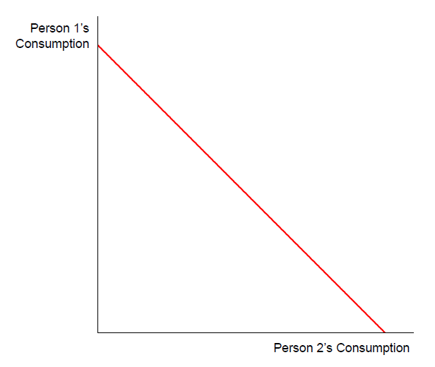
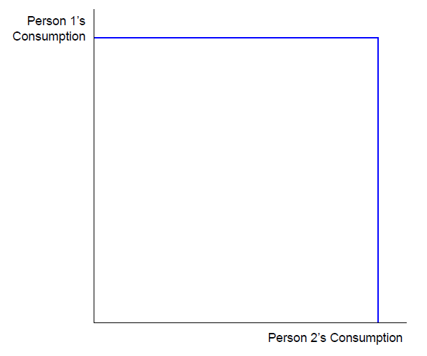
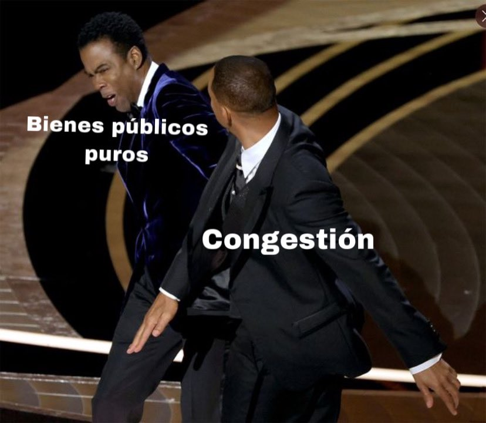
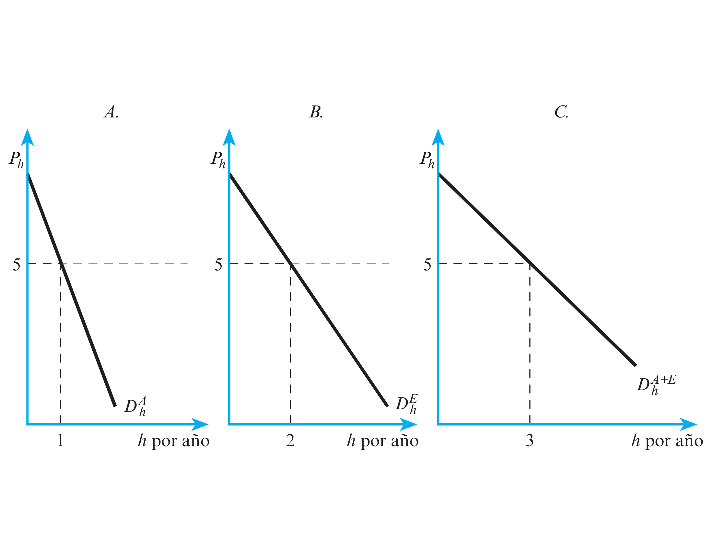
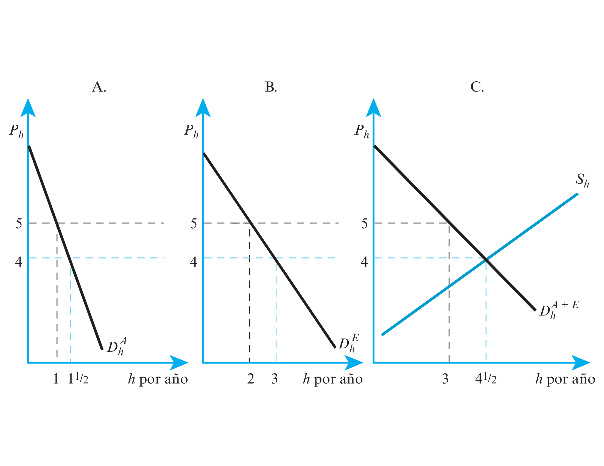
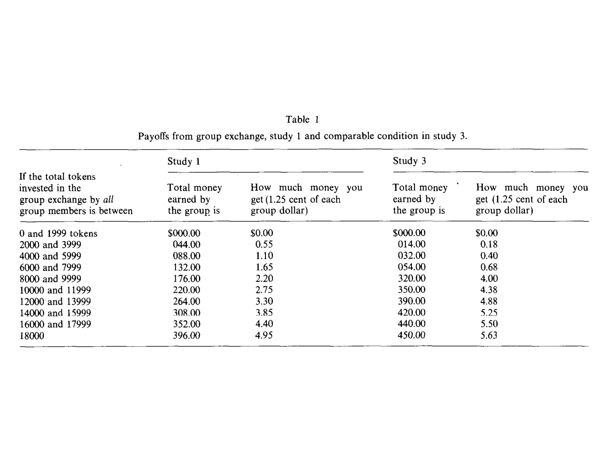

# Bibliografia

-   Rosen, H. S. (2008). Hacienda Pública (7ma. edición). Madrid:
    McGraw-Hill/Interamericana. Capítulo 8, págs 55 a 65 y 165 a 190.
    Disponible:
-   Garriga, M., & Rosales, W. (2013).Finanzas públicas en la práctica.
    Selección de casos y aplicaciones. Buenos Aires: Editorial Dunken.
    Capítulo 2, págs. 15 a 22. **Solicitar por: 336 G 53902.**
-   Nuñez Miñana H. Finanzas Públicas. Buenos Aires: Ed. Macchi.
    Capítulo 2, páginas 35-41. **Solicitar por: T 336.2 N 44058**

---

-   Musgrave y Musgrave (1992). Hacienda Pública Teórica y Aplicada (5a.
    edición). Madrid: Mc. Graw Hill. Capítulo 8. **Solicitar por: T 336
    M 38730**
-   Oficina Nacional de Presupuesto. Ciclo Presupuestario Argentino a
    Nivel Nacional: Disponible:
    http://www.mecon.gov.ar/onp/html/trabajos/ciclo_presupuestario.pdf
-   Oficina Nacional de Presupuesto (2011). El Sistema Presupuestario en
    la Administración Nacional de la República Argentina, Ministerio de
    Economía y Finanzas. Solicitar por: 336 G 53902

# El gasto y Presupuesto público.

1. Los bienes públicos
   + Naturaleza y características
   + Algunas consideraciones
   + Mecanismos de provisión
   + El problema del *free rider*
2. El presupuesto público
   + El ciclo presupuestario
   + Clasificaciones presupuestarias
3. Crecimiento del gasto público: Teoría y empirica
4. Análisis beneficio-costo y análisis costo-eficacia. 
5. Programas de gasto

# Preguntas
-   ¿Qué comprende el gasto público?
-   ¿Cómo caracterizamos a los bienes que deben ser provistos
    públicamente?
-   ¿Cómo se decide cuanto asignar a producción y provisión de bienes
    públicos?
-   ¿Qué es el presupuesto público?
-   ¿Cómo se determina la viabilidad de un proyecto/programa público?
-   ¿Por qué aumenta el gasto público?
-   ¿Hay efectos positivos y negativos de los programas de gasto social
    sobre los incentivos?

# Los bienes públicos

# Naturaleza y características

-   Una empresa tiene incentivos a producir autos porque puede
    cobrar un precio. ¿Una empresa tiene incentivo a
    "producir" espacios verdes?
-   Cuando el gobierno provee defensa nacional todos los
    habitantes están *igualmente* protegidos; un programa radial puede ser recibido *simultáneamente* por todos los oyentes
-   La posibilidad de que *muchos* consumidores se beneficien de *una
    unidad* de provision viola el supuesto de naturaleza privada de los
    bienes $\longrightarrow$ equilibrio competitivo desregulado no
    sera eficiente
-   Bienes públicos sufren el problema del *free rider*
    $\longrightarrow$ provisión privada ineficiente

---

> **Bien público puro.** Un bien público puro posee las dos características
siguientes: 1. **No exclusión.** Si el bien público es provisto, ningún consumidor puede ser excluido de su consumo \[muy caro/indeseable excluirlo\]; 2. **No rivalidad.** El consumo del bien público por parte de un
    consumidor no reduce la cantidad disponible para ser consumida por
    cualquier otro consumidor.

-   Bien privado beneficia un individuo $h$ $$\sum_{h}X_{h} \leq X$$
-   Bien público beneficia a muchos individuos simultáneamente
    $$X_{h} \leq X  \quad \forall h$$

# Bien privado

{width=75%}

# Bien público

{width=75%}

# Algunas consideraciones

-   Los bienes públicos que son excluibles (con un costo) y que sufren
    de congestion más allá de un cierto nivel de uso son llamados
    *impuros*
-   Consumo rival versus no rival
    - Bienes públicos puros son no rivales
-   Excluible versus no excluibles
    - Radio nacional: imposible excluir. Educación: posible excluir.
-   La gran mayoría de los analisis focalizan en los bienes públicos
    puros

---

-   Existen varios tipos de bienes segun su rivalidad y excluibilidad.
    El ejemplo típico de bienes de propiedad común (*commons*) es el de
    un lago para pescar sin restricción. Bienes de club son aquellos en
    que la exclusión es posible ("sport clubs").

|              | Rival                | No rival                 |
|--------------|----------------------|--------------------------|
| Excluible    | Helados (B Pri)      | TV por cable (B de club) |
| No excluible | Lago de pesca (RPC)  | Defensa nacional (BPP)   |            |                      |                          |   |   |
: Tipos de bienes

---

-   Aunque todo el mundo consuma la misma cantidad del bien, este
    consumo no tiene porque ser valorado del mismo modo por todos
    $\longrightarrow$ baño público; defensa nacional; sistema de misiles
-   La calificación de bien público (puro/impuro) no tiene carácter
    absoluto: depende de las condiciones del mercado y del estado de la
    tecnología $\longrightarrow$ un faro es un **bien público puro
    (BPP)**; un faro con un sistema de codificación no lo será; vista
    panorámica es BPP con poca gente; deja de serlo con muchos usuarios
    (congestión).
-   Un **bien público puro** cumple pefectamente con la definición: no
    hay rivalidad en el consumo y no se aplica el principio de
    exclusión. En el caso de un **bien público impuro** hay cierta
    rivalidad o posibilidad de exclusión.

---

{width=75%}

---

-   Un bien puede tener una de las características de los bienes
    públicos pero no necesariamente la otra $\longrightarrow$ calles de
    una ciudad (si rivalidad; no exclusión); franja ancha de playa (no
    rivalidad; si exclusion) \[NOTA: ¿Qué rol juega la tecnología?\]
-   Ciertas cosas a las que no se las considera como bienes y/o
    servicios tienen características de bienes públicos
    $\longrightarrow$ sinceridad; distribución del ingreso; información
    sobre estándares higiénicos.

---

-   No necesariamente los bienes privados son sólo provistos por el
    sector privado $\longrightarrow$ servicios sanitarios y servicios de
    vivienda.
-   La provisión pública de un bien no implica necesariamente que este
    sea producido por el sector público $\longrightarrow$ servicio de
    extinción de incendios en EEUU contratado oa través de empresas
    privadas.

# Mecanismos de provisión

-   Es útil comenzar analizando los bienes privados. Supongamos una
    sociedad con dos individuos: Adan y Eva y dos bienes privados:
    manzanas y hojas de parra. La curva de demanda por hojas de parra de
    Adán y Eva son, $D_h^A$, y $D_h^E$.
-   Si queremos obtener la curva de demanda del mercado, sumamos
    *horizontalmente* las curvas de demanda inviduales. A un precio de
    5, Adán demanda 1 hoja de parra y Eva 2.
-   La curva de demanda del mercado es igual a $D_h^{A+E}$. Para una
    oferta como $S_h$, el precio de equilibrio es 5 y la cantidad de
    equilibrio es 4.5.

---

{width=75%}

---

{width=75%}

---

> **Provisión eficiente bienes privados.** En el caso de bienes privados la
asignación de hojas de parra es eficiente en el sentido de Pareto. La
eficiencia implica que una persona fija su relación marginal de
sustitución de manzanas por hojas de parra, $RMS_{mh}$, como la relación
entre el precio de las hojas de parra y el de las manzanas,
$\frac{P_h}{P_m}$. En el equilibrio eficiente deberá cumplirse que
$RMS_{mh}^A=RMS_{mh}^E=RMT_{mh}$. \[NOTA: Verifique si se cumple la
relación entre las tasas en el equilibrio del ejemplo\]

---

-   Ahora supongamos que Adán y Eva gustan de ver (una exhibición de)
    fuegos artificiales --i.e. bien publico. Ambos prefieren fuegos más
    grandes que más pequeños
-   Si el costo de ampliar en un cohete es de 5 --actualmente son 19
    cohetes-; Adán estaría dispuesto a pagar 6 dólares por el aumento y
    Eva estaría dispuesta a pagar 4 dólares por el mismo.
-   El beneficio marginal es igual a la **suma** de lo que ambos están
    dispuestos a pagar (10). El costo marginal es lo que sale ampliar a
    un cohete más (5).

---

> **Beneficios y costos marginales.** La eficiencia requiere que la provisión
de un bien público se eleve hasta el punto en que la suma de las
valoraciones marginales de cada persona respecto a la última unidad sea
exactamente igual al costo marginal.

--- 

{width=50%}

---

{width=50%}

---

-   El primer gráfico ilustra la demanda de cohetes de Adan, $D_{c}^A$ y
    de Eva, $D_{c}^E$. ¿Cómo deducimos la disposición del **grupo** a
    pagar por los cohetes?
-   NOTA: Los servicios provistos por los fuegos artificiales deben
    consumirse en cantidades iguales. Entonces, debemos sumar los
    precios que cada uno estaría dispuesto a pagar para una cantidad
    dada.
-   La disposicion a pagar del grupo, $D_{c}^{A+E}$ se determina a
    través de la **suma vertical** de las curvas de demanda
    individuales.

---

-   La cantidad eficiente de bienes públicos se da en el punto en que
    Adán y Eva en conjunto están dispuestos a pagar por una unidad
    adicional es exactamente igual al costo marginal de producirla.
-   Este nivel es igual a 45 y el costo marginal para esa cantidad es de
    6 dolares.
-   En este caso, la suma de las RMS es igual a la
    $RMS_{mc}^{Adan}+RMS_{mc}^{Eva}$ y la $RMT$ es igual a 6.

---

> **Provisión eficiente bienes públicos.** En el caso de bienes públicos la
asignación de cohetes es eficiente en el sentido de Pareto. Pero ahora,
la eficiencia implica que la suma de las relaciones marginales de
sustitución de manzanas por cohetes, $RMS_{mc}^{Adan}+RMS_{mc}^{Eva}$,
iguale a la relación entre el precio de los cohetes y las manzanas,
$\frac{P_c}{P_m}$. En el equilibrio eficiente deberá cumplirse que
$RMS_{mc}^{Adan}+RMS_{mc}^{Eva}=RMT_{mc}$. \[NOTA: Verifique si se
cumple la relación entre las tasas en el equilibrio del ejemplo\]

---

> Comparación de condiciones de eficiencia Para un **bien privado** la
eficiencia requiere que cada persona tenga **la misma relación marginal
de sustitución** y que esta se iguale a **la relación marginal de
transformación**. Para un **bien público** la eficiencia requiere que se
iguale **suma de las relaciones marginales de sustitución** a **la
relación marginal de transformación**.

> Valoración total Lo que importa para la eficiencia es que la
**valoración total** de la última unidad provista sea igual al costo de
producirla

# El problema del *free rider*

-   En el caso de BPP, las personas tienen incentivos para
    ocultar sus verdaderas preferencias. Eva (valora en 4 la
    última unidad producida) podría aducir que los fuegos artificiales
    no le reportan ninguna utilidad y dejar que Adan (valora en 6
    la última unidad producida) pague por toda la provisión
    $\longrightarrow$ *free rider*
-   Incluso si se pudiera aplicar el principio de exclusión --i.e.
    cobrar por la feria del libro- sería ineficiente hacerlo
    para un evento de cierto tamaño $\longrightarrow$ costo de admitir a
    una persona mas es 0. Y la eficiencia obliga que $P=CMg$ --el precio sea igual a 0!

---

-   El problema del *free-rider* no conduce a una completa ausencia de
    provisión privada de BPP. La provisión privada puede funcionar mejor
    cuando:
    1.  Algunos individuos valoran los BPP de manera diferente --cuando
        no son idénticos y cuando algunos
        valoran especialmente alto un cierto BPP
    2.  Hay altruismo --cuando los individuos valoran los beneficios y
        los costos acaecidos en los demás cuando realizan sus elecciones
        de consumo
    3.  *Warm glow* $\longrightarrow$ modelos de provisión de bienes
        públicos en que los individuos valoran el monto total de BPP y
        sus propias contribuciones

---

{width=100%}

---

-   Varios experimentos en laboratorios testean esta hipotesis. Usualmente, estudiantes son convocados. Un paper clasico es el de Marwell and Ames (1981):
    1.  10 repeticiones de cada juego
    2.  En cada juego, grupos de 5 personas, cada uno con 10 *tokens*
        para dividir entre dinero y bien público.
    3.  Si se queda con el *token* en dinero, se lleva \$1 en dinero
        real. Si contribuye al BPP, brinda \$0.5 a cada uno de las
        personas.
-   El equilibrio de Nash de este juego es obvio $\longrightarrow$
    quedarse con los *tokens* en dinero. El equilibrio socialmente
    óptimo $\longrightarrow$ contribuir todo al bien público

---

-   Alrededor del 50% de los estudiantes
    contribuyeron al BPP, pero las contribuciones al mismo
    tienden a caer cuando el juego se repite
-   Había diferencias entre los diferentes grupos de estudiantes
    --grado, posgrado, otras.
-   Intuición $\longrightarrow$ la gente tiende a cooperar en un
    principio pero se enfada cuando otros toman ventaja y suele
    "castigar" en rondas sucesivas

---

{width=75%}

---

{width=75%}

---

-   Resumiendo los resultados, la hipótesis estricta del comportamiento
    "free rider" (ninguna contribución voluntaria) se descarta; se
    valida la hipótesis débil del comportamiento "free rider"
    (contribuciones positivas pero sub-optimas).
-   Se les preguntó también qué consideraban una "contribución justa" al
    proyecto G --mas de 3/4 de los muestreados respondieron que más de
    la mitad. Alguna evidencia de individuos no actuando en base a
    racionalidad total sino también consideran "justicia".
-   ¿Por qué los estudiantes de posgrado de economía se comportan
    distinto?

