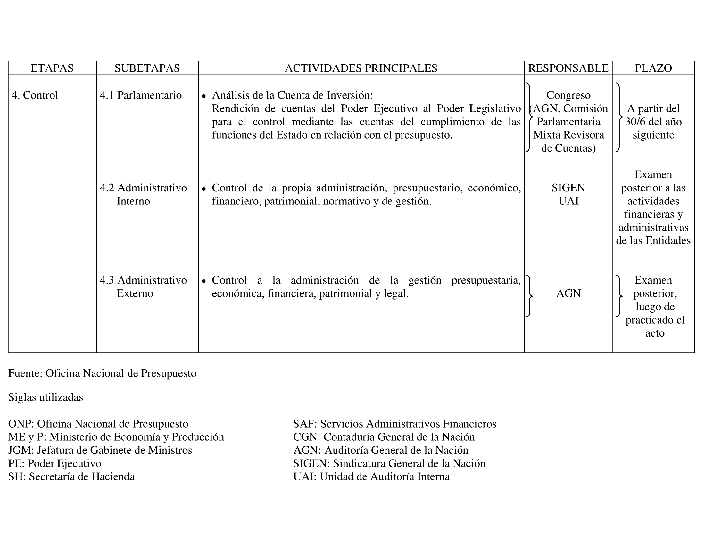
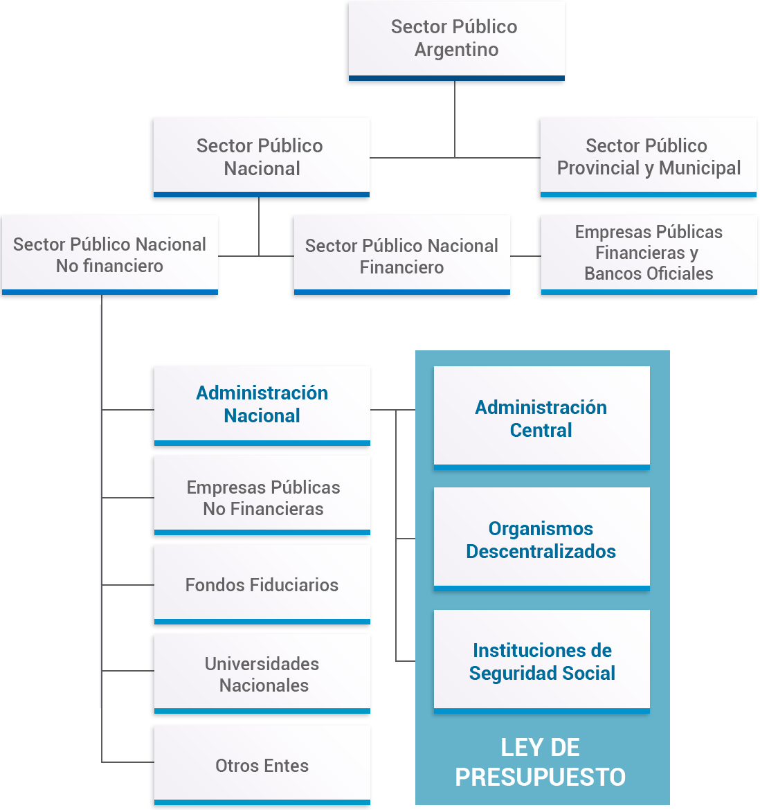
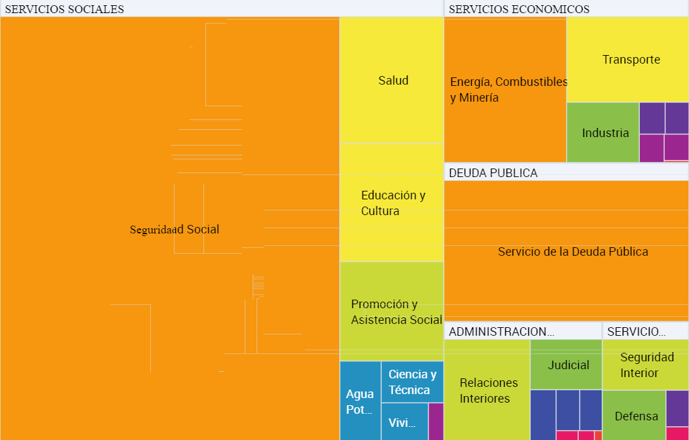
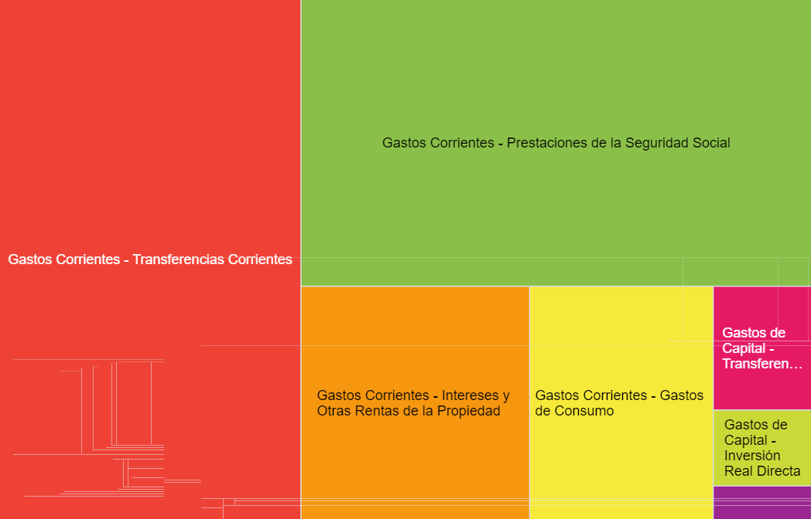
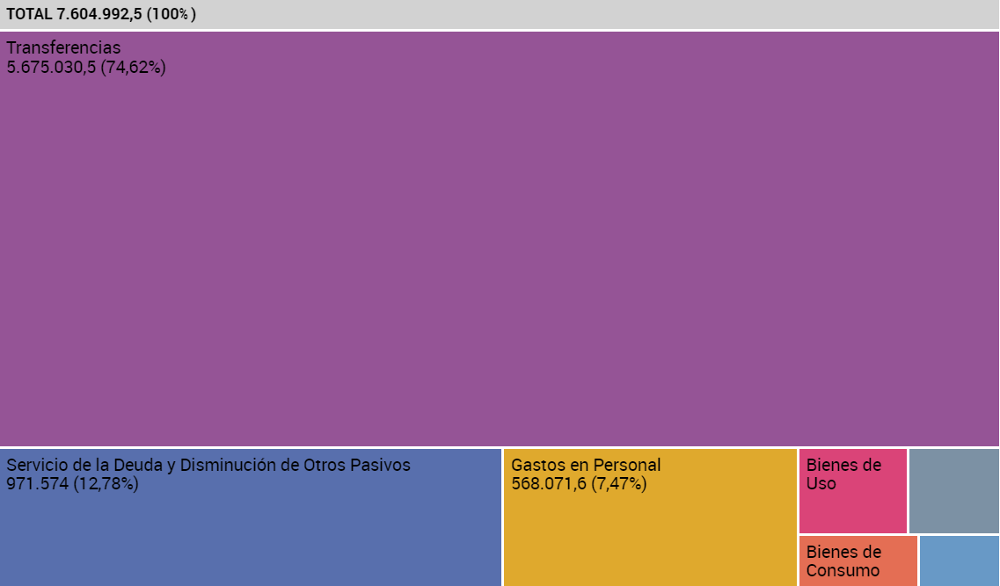
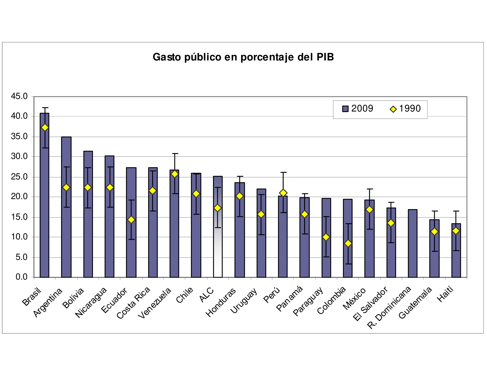
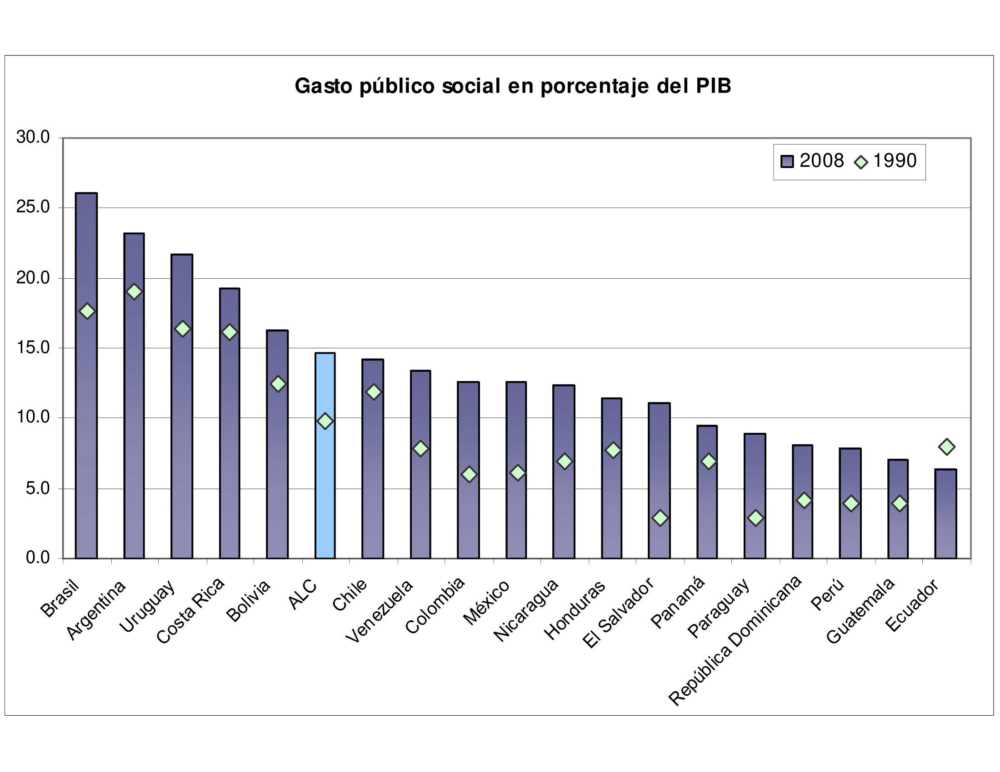
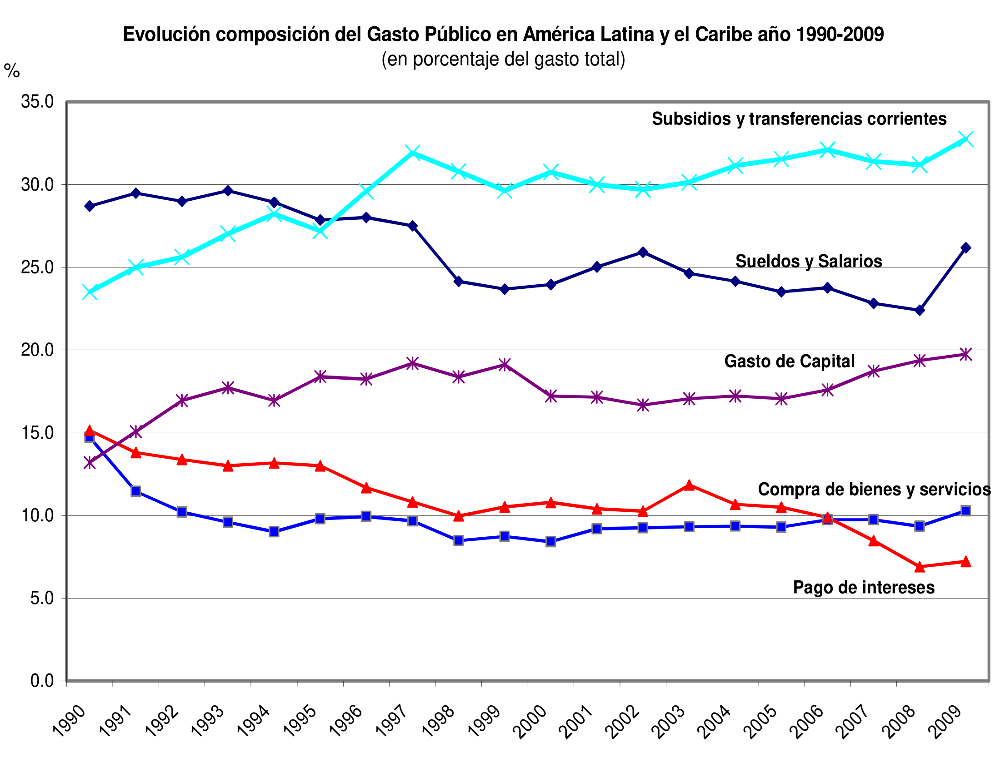

# Bibliografia

-   Rosen, H. S. (2008). Hacienda Pública (7ma. edición). Madrid:
    McGraw-Hill/Interamericana. Capítulo 8, págs 55 a 65 y 165 a 190.
    Disponible:
-   Garriga, M., & Rosales, W. (2013).Finanzas públicas en la práctica.
    Selección de casos y aplicaciones. Buenos Aires: Editorial Dunken.
    Capítulo 2, págs. 15 a 22. **Solicitar por: 336 G 53902.**
-   Nuñez Miñana H. Finanzas Públicas. Buenos Aires: Ed. Macchi.
    Capítulo 2, páginas 35-41. **Solicitar por: T 336.2 N 44058**

---

-   Musgrave y Musgrave (1992). Hacienda Pública Teórica y Aplicada (5a.
    edición). Madrid: Mc. Graw Hill. Capítulo 8. **Solicitar por: T 336
    M 38730**
-   Oficina Nacional de Presupuesto. Ciclo Presupuestario Argentino a
    Nivel Nacional: Disponible:
    http://www.mecon.gov.ar/onp/html/trabajos/ciclo_presupuestario.pdf
-   Oficina Nacional de Presupuesto (2011). El Sistema Presupuestario en
    la Administración Nacional de la República Argentina, Ministerio de
    Economía y Finanzas. Solicitar por: 336 G 53902

# El presupuesto público

# El ciclo presupuestario

-   Visión tradicional $\longrightarrow$ "el presupuesto es la
    expresión, en términos financieros, de lo que el gobierno pretende
    llevar a cabo en un período determinado, por regla general, un año"
-   Visión moderna $\longrightarrow$ "como un instrumento útil para la
    programación económica y social, de gobierno, de administración y
    necesariamente un acto legislativo".

---

-   Se reconocen entonces los siguientes roles al Presupuesto:
    -   **Como instrumento de gobierno**
    -   **Como instrumento de programación económica y
        social** $\longrightarrow$ las acciones de programación en el
        mediano plazo se elaboran en términos de agregados
        macro-económicos.
    -   **Como instrumento de administración**
        $\longrightarrow$ la ejecución del presupuesto involucra a la
        división del trabajo entre diferentes unidades.
    -   **Como acto legislativo** $\longrightarrow$ la
        aprobación del presupuesto constituye un acto legislativo
        indispensable
    -   **Como documento** $\longrightarrow$ se expresa en
        un documento --analítico, sintético, resumen.

---

-   **Ciclo presupuestario** $\longrightarrow$ conjunto de etapas
    por las que atraviesa el proceso presupuestario. En Argentina existen 4/5 fases:
    -   Formulación (programación) $\longrightarrow$ involucra las
        etapas de *preparación* --marzo a junio- y *elaboración* --julio
        a septiembre.
    -   Discusión y aprobación (autorización) $\longrightarrow$ etapas
        de tratamiento y discusión en DIP/SEN y luego Ejecutivo (diciembre)
    -   Ejecución $\longrightarrow$ incluye las etapas de distribución,
        evaluación y cierre de cuentas
    -   Evaluación y control $\longrightarrow$ etapas de control
        parlamentario (legislativo), administrativo interno (SIGEN, UAI)
        y externo (AGN)
    -   Rendición de cuentas 	

---

---

---

---

---

---

# El Sector Público Nacional

{width=60%}

---

> **Una conceptualización.** Conjunto de organismos y unidades económicas
que dependen directamente del Estado, sean organismos integrantes del
propio Estado o haciendas productivas de bienes y servicios de
propiedad, conducción y/o control del Estado \[Nuñez Miñana (1998)\].

---

- El **sector público nacional (SPN)** se divide en dos ramas principales:

  - Sector público nacional no financiero (SPNNF)
  - Sector público nacional financiero (SPNF)

- A su vez, el SPNNF se compone de:

  - Administración nacional (AN)
  - Empresas públicas no financieras
  - Fondos fiduciarios
  - Universidad nacionales
  - Otros entes

---
 
> El principal componente del **sector público nacional no financiero (SPNNF)** es la **administración nacional (AN)**. Está compuesta por lo siguiente: 

  - Administración central $\longrightarrow$ poder Ejecutivo,
    Legislativo y Judicial de orden nacional, provincial y municipal
  - Organismos descentralizados $\longrightarrow$ Auditoría General de
    la Nación (AGN), el INTA, el ENARGAS, el RENAPER, las Universidades
    Nacionales
  - Instituciones de seguridad social $\longrightarrow$ ANSES, Caja de
    Retiros y Jubilaciones de la Policía Federal.

---

> Asimismo el **resto de los componentes del SPNNF** por fuera de la AN son los siguientes: 

-   Empresas públicas no financieras (EPNF) como ENARSA, InterCargo, Aerolineas Argentinas, AR-SAT, SRT (UNC), TELAM, Correo Oficial y FAdeA 
-   Fondos fiduciarios (FF) como el FF para la Vivienda Social, el FF de Infraestructura Hídrica, y Fideicomiso Red de Autopistas y Rutas Seguras
-   Universidad Nacionales $\longrightarrow$ como la UBA, UNC, UTN y la UNLP entre las más importantes
-   Otros entes $\longrightarrow$ expresamente excluidos del presupuesto de la APN como AFIP, INSSJyP, INCAA, Instituto Nacional de la Música y UESTY

---

> Finalmente, dentro del **sector público nacional financiero (SPNF)** se incluyen

-   El sistema de bancos oficiales $\longrightarrow$ incluye BCRA, BNA, Banco Hipotecario y el Banco de Inversión y Comercio Exterior (BICE)
-   Empresas públicas financieras $\longrightarrow$ incluye a Nación Seguros, Nación Bursátil, Fondos Pellegrini entre otros
-   Otras instituciones públicas financieras $\longrightarrow$ como los instituto de vivienda del Ejército y de la Fuerza Aérea

# Estructura del presupuesto

-   Según la Ley 24156 --Administración Financiera y de los Sistemas de
    Control del Sector Público Nacional--, la Ley de Presupuesto General
    debe contener los siguientes títulos:
    -   Titulo I - Disposiciones Generales
    -   Titulo II - Presupuesto de Recursos y Gastos de la
        Administración Central
    -   Titulo III - Presupuesto de Recursos y Gastos de los Organismos
        Descentralizados (incluidas las ISS)
-   Cada una de estas secciones contiene información relativa a
    diferentes aspectos de la planificación presupuestaria del gobierno
    nacional. 

# Presupuesto 2022

-   Proyecto de Ley de Presupuesto 2022 enuncia en su artículo 1:

> **Artículo 1.** *Fíjase* en la suma de PESOS TRECE BILLONES TRESCIENTOS TREINTA Y SEIS MIL QUINIENTOS VEINTE MILLONES CUATROCIENTOS TREINTA Y UN MIL TRESCIENTOS ONCE (\$ 13.336.520.431.311) el total de los gastos corrientes
y de capital del Presupuesto General de la Administración Nacional para
el Ejercicio 2022, con destino a las finalidades que se indican a
continuación, y analíticamente en las planillas números 1, 2, 3, 4, 5, 6
y 7 anexas al presente artículo.

---

-   Mientras que en su artículo 2, enuncia lo siguiente:

> **Artículo 2.** *Estímase* en la suma de PESOS DIEZ BILLONES DOSCIENTOS MIL SEISCIENTOS SESENTA Y CUATRO MILLONES SETECIENTOS TREINTA Y SEIS MIL SESENTA Y NUEVE (\$ 10.200.664.736.069) el cálculo de Recursos
Corrientes y de Capital de la Administración Nacional de acuerdo con el
resumen que se indica a continuación y el detalle que figura en la
planilla anexa 8 al presente artículo.

---

-   Y el artículo 4, enuncia lo siguiente:

> **Artículo 4.** Como consecuencia de lo establecido en los artículos 1, 2 y 3, el **resultado financiero** deficitario queda estimado en la suma de	 PESOS TRES BILLONES CIENTO TREINTA Y CINCO MIL OCHOCIENTOS CINCUENTA Y CINCO MILLONES SEISCIENTOS NOVENTA Y CINCO MIL DOSCIENTOS CUARENTA Y DOS (\$ 3.135.855.695.242) 

# Presupuesto: Clasificaciones

- Las principales clasificaciones de los gastos son:
    -   Por su ubicación geográfica
    -   Por objeto del gasto
    -   Por su caracter económico (corrientes / de capital)
    -   Por finalidad y funciones
    -   Por categoría programática
    -   Por fuentes de financiamiento

# Por finalidad y funcion

-   Las categorías son:
    -   Servicios sociales $\longrightarrow$ salud, asistencia y seguridad social, trabajo, vivienda y agua
    -   Deuda pública e intereses $\longrightarrow$ gastos e intereses
        deuda interna y externa
    -   Administración gubernamental $\longrightarrow$ acciones propias
        del Estado para funciones legislativa, judicial, administración
        fiscal.
    -   Servicios de defensa y seguridad $\longrightarrow$ defensa
        nacional y orden público
    -   Servicios económicos $\longrightarrow$ apoyo a la
        produccion de ByS y promoción del desarrollo económico
        

# Por finalidad y función (cont.)

# Clasificacion económica

-   Permite identificar la naturaleza económica de las transacciones del
    sector público. Las categorías son:
    -   Gastos corrientes $\longrightarrow$ incluyen todos aquellos
        gastos que intervienen en la producción y provisión de todos los
        bienes del Estado. Ejemplo: Gastos de consumo
    -   Gastos de capital $\longrightarrow$ muestran la inversión que
        realiza el sector público y su contribucíon a la capacidad
        instalada de producción
    -   Aplicaciones financieras $\longrightarrow$ incluye aplicaciones
        financieras como amortización de deuda (externa e interna) y
        otros pasivos.

# Clasificación económica (cont.)

# Por objeto del gasto

-   Las categorías son:
    -   Gastos en personal
    -   Bienes de consumo
    -   Servicios no personales
    -   Bienes de uso
    -   Transferencias
    -   Activos financieros
    -   Servicio de deuda y disminución de otros pasivos
    -   Otros gastos y gastos figurativos

# Por objeto del gasto (cont.)

# Crecimiento del gasto público: Teoría y determinantes

# Crecimiento del gasto

# Crecimiento del gasto

# Crecimiento del gasto

# Crecimiento del gasto: Enfoques

-   Existen diferentes hipótesis que explican el crecimiento del gasto
    público, tanto del lado de la demanda como de la oferta.
-   Del lado de la demanda tenemos: 1) leyes de Wagner; 2) efecto
    umbral; 3) grupos de interés; 4) ilusión fiscal
-   Del lado de la oferta: 1) fenómeno "enfermedad de los costos"
    (Baumol); 2) comportamiento perverso políticos y burócratas; 3)
    ciclo político/económico electoral; 4) ideología del partido
    gobernante

# Demanda: Ley de Wagner

-   Cuando la sociedad se desarrolla económicamente, se genera una sustitución de actividades privadas por públicas: bienes públicos
    esenciales (seguridad / justicia / orden interno), regulación
    económica (inocuidad de alimentos, componentes de medicamentos,
    etc.), administración de monopolios naturales.
-   A medida que el ingreso crece, aumenta la
    demanda de algunos bienes y servicios públicos cuya elasticidad
    ingreso es mayor a la unidad (educación, salud), la demanda de mayor
    equidad social (redistribución del ingreso) y la demanda de sistemas
    más amplios de seguridad social (seguros de desempleo, protección a
    grupos vulnerables)

# Demanda: Efecto umbral

-   El sector privado soporta hasta cierto umbral impositivo. Frente a
    situaciones extraordinarias (ejemplo: una guerra, un evento
    climático adverso, una crisis económica), la sociedad relaja ese
    umbral impositivo (se permite que algunos impuestos suban) a los
    efectos de generar el financiamiento requerido para los gastos
    extraordinarios que debe llevar adelante el Estado.
-   Una vez finalizado el evento (ejemplo: terminada la guerra), los
    impuestos se reducen pero no vuelven a su nivel inicial
    $\longrightarrow$ crisis en EEUU

# Demanda: Grupos de interés

-   Si el gobierno es permeable (o débil) ante grupos de interés que lo
    único que buscan es beneficios particulares a costa del resto de la
    población, es posible que aparezcan nuevos costos
-   Algunos de estos costos pueden ser costos de
    contaminación/ambientales (mineras y otros metales), pero
    también costos de eficiencia asociado a estructura
    productiva $\longrightarrow$ actividades de monopolio natural
-   Otro costo no menor es la corrupción
    $\longrightarrow$ si el gasto público tiene desvíos (quita), será necesario un mayor nivel de impupestos para financiar
    un determinado nivel de provisión.

# La "enfermedad" de los costos

-   En su **enfoque de enfermedad de los costos** Baumol sostiene que la
    productividad no crece de manera uniforme en todos los sectores.
    Compara la ejecución de un cuarteto de cuerdas de Mozart que en la
    actualidad requiere de la misma cantidad de músicos que en 1790,
    con un ensamblado de un automóvil
-   Esto hace que los costos de producción de los sectores donde la
    productividad crece más lento (generalmente los servicios), aumenten
    de manera sostenida en el tiempo. La razón de ello se debe a que los
    salarios de los sectores menos dinámicos, producto a la presión que
    hacen sus trabajadores, tienden a subir al igual que en los
    dinámicos.

---

-   Los bienes que provee el Sector Público en general son intensivos en
    mano de obra y los incrementos de productividad suelen producirse
    lentamente $\longrightarrow$ la educación. La tecnología avanza
    velozmente: las computadoras son cada vez más potentes pero la forma
    de proveer educación no avanza al mismo ritmo. La educación se trata
    desde siempre de docentes frente a alumnos \[Garriga y Rosales,
    2013\].
-   Algo similar podría pensarse para servicios similares como la salud,
    y otros bienes públicos. Como puede verse en el gráfio siguiente, el
    gasto en educación y salud ha crecido como porcentaje del PBI.

---

{width=100%}

# Enfoque Leviatánico 

-   El **enfoque Leviatánico** tiene su raíz en la escuela
    de la elección pública.
-   Supone que el gobierno se comporta como un maximizador de su
    presupuesto (ingreso disponible) para uso discrecional
    $\longrightarrow$ una parte (minimo compatible con leyes y
    responsabilidades) financia gasto público; el resto (excedente $S$)
    va a otros fines.
-   El gobierno busca maximizar $S$ que puede usar a voluntad --$S$ será
    función de: $R$ recursos recaudados y $G$ --total destinado al gasto
    público

---

-   El gobierno está interesado en maximizar $R$ y minimizar $\alpha$
-   Así $S=R-G$ y dado que $G$ es una
    proporción fija, $G=\alpha R$, entonces: $S=R-\alpha R=(1-\alpha)R$
-   Ejemplo: si $\alpha=0.3$ y $R=1000$, $S=700$; si $R=2000$, entonces
    $S=1400$
-   Proponen que se relacionen las BI con el gasto --note que a
    mayor $BI$, mayor $R$ 
-   Proponen tambien la descentralización fiscal y competencia
    interjurisdiccional. A mayor descentralización, menor tamaño del
    sector público \[¿Se cumple?\]

# Ciclo político/económico electoral

-   Esto está bien documentado en la literatura. En los años
    electorales, los gastos suelen aumentar y los impuestos disminuir (o
    no aumentar).
-   También en sistemas federales suelen aumentar las transferencias
    inter-gubernamentales a gobiernos de menor nivel como mecanismo para
    "disciplinar" a los gobiernos locales
-   Rara vez suelen bajar estos gastos luego de las elecciones (similar
    a efecto umbral)
-   También puede aumentar el tamaño del Estado por la ideología del
    partido gobernante (nuevas izquierdas, populismos en LatAm en
    últimos 15 años).

---

{width=100%}

