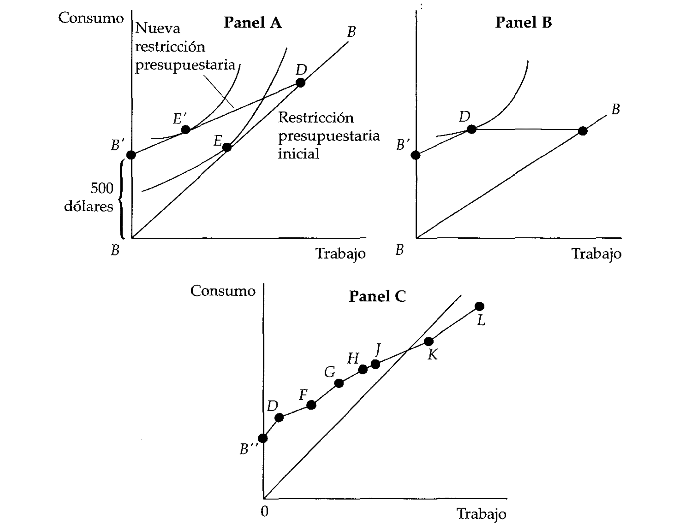

# Bibliografia

-   Rosen, H. S. (2008). Hacienda Pública (7ma. edición). Madrid:
    McGraw-Hill/Interamericana. Capítulo 8, págs 55 a 65 y 165 a 190.
    Disponible:
-   Garriga, M., & Rosales, W. (2013).Finanzas públicas en la práctica.
    Selección de casos y aplicaciones. Buenos Aires: Editorial Dunken.
    Capítulo 2, págs. 15 a 22. **Solicitar por: 336 G 53902.**
-   Musgrave y Musgrave (1992). Hacienda Pública Teórica y Aplicada (5a.
    edición). Madrid: Mc. Graw Hill. Capítulo 8. **Solicitar por: T 336
    M 38730**

---

-   Oficina Nacional de Presupuesto. Ciclo Presupuestario Argentino a
    Nivel Nacional: Disponible:
    <http://www.mecon.gov.ar/onp/html/trabajos/ciclo_presupuestario.pdf>
-   Oficina Nacional de Presupuesto (2011). El Sistema Presupuestario en
    la Administración Nacional de la República Argentina, Ministerio de
    Economía y Finanzas. Solicitar por: 336 G 53902

# Preguntas

-   ¿Qué es el analisis beneficio-costo y por qué es util?
-   ¿En qué se diferencia el análisis costo-beneficio privado del
    público?
-   ¿Qué es el gasto público social?
-   ¿Qué efectos económicos tienen los programas de asistencia social?
-   ¿Qué son los programas de transferencias de ingresos?

# Análisis beneficio-costo y costo-eficacia

# Análisis beneficio-costo

-   Para que haya eficiencia económica en un programa de gasto, los
    beneficios sociales deben ser superiores a los costos sociales
-   El análisis de eficiencia económica define si se debe llevar
    adelante un gasto/programa/inversión pública.
-   La eficiencia técnica y asignativa contribuyen a la eficiencia
    económica, pero no la garantizan.
-   Para determinar la eficiencia económica se utiliza usualmente el
    análisis **beneficio--costo** o el **análisis eficacia--costo**

---

-   El análisis beneficio-costo es un método que **estima los beneficios
    y costos monetarios** de un programa/una decisión de inversión
    pública
-   Como estos se dan en el tiempo, se requiere de una "metodología"
    para poder comparar correctamente. Lo usual es utilizar una **tasa
    de descuento** para traer al presente los valores futuros.
-   Requiere también de una **regla de decisión** para elegir entre
    alternativas
-   Requiere, en la practica de análisis, considerar los beneficios y
    costos tanto para productores y consumidores

---

-   Problema $\longrightarrow$ se debe cruzar un río mediante una barca.
    Un privado maneja la estación y cobra una tarifa regulada, $P_{m}$
-   Ingreso total del privado $\longrightarrow$ $P_{m}ABC_{m}$
-   Gobierno propone bajar la tarifa a $C_{m}$. Al privado no le
    conviene, ¿le conviene a la sociedad?
-   Al considerar costos de usuarios, vemos que ahora aumentaría el
    bienestar de los usuarios en $P_{m}ADC_{m}$ que es mayor que la
    pérdida del privado, $P_{m}ABC_{m}$
-   Validez del principio de compensación $\longrightarrow$ el Estado
    podría hacer que los consumidores estén mejor, que los productores
    privados esten peor pero la sociedad como un todo gana \[¿Por qué?\]

---

---

---

-   Existen o no precios de mercado? (ej.: ¿Cuánto vale una vida?). En
    caso que existan, ¿hay que realizar algún ajuste a esos precios? En
    caso que no existan, ¿qué hacemos?
-   Precios sombra 1 $\longrightarrow$ ajustes a los precios de mercado
    (debido a que se encuentran "distorsionados" por monopolio,
    impuestos, nivel desempleo / recursos no utilizados, etc.)
-   Precios sombra 2 $\longrightarrow$ cuando no existen precios de
    mercado (ej:. intangibles) se acude a técnicas de valoración (valor
    de la vida, medio ambiente, etc.).
-   Valoración de los recursos naturales y efectos sobre medio-ambiente
    $\longrightarrow$ valoración contingente (Exxon Valdez, mas de 1000
    millones de dólares)

---

# Análisis costo-eficacia

-   En algunos casos es difícil o imposible aplicar el analisis
    beneficio-costo. Sobre todo cuando se consideran temas de salud,
    sanidad y otros aspectos delicados
-   En estos casos, es útil "medir" los proyectos en terminos de su
    **eficacia** desde el punto de vista de los costos. En este caso, lo
    que se busca es comparar programas que tengan los mismos beneficios
    e identificar cuál de ellos se puede lograr al menor costo.
   
---

> **Daño auditivo en EEUU.** Un programa de protección de los oidos
ejecutado eficazmente podrfa reportar practicamente los mismos
beneficios, con un coste mucho menor, que el de una reglamentación sobre
el ruido puramente tecnica que afectara al conjunto de la industria \[
\... \]. Una norma que exija la utilización de protectores de los oidos
preparados para 85 decibelios \[tiene\] el coste marginal relativamente
razonable de unos 23.000 dólares por perdida de capacidad auditiva
evitada

# Programas de gasto

# Gasto público social

-   En general hay cierto consenso sobre la conveniencia de que el
    Estado alivie la situación de los más pobres, pero controversia en torno a la forma que debe adoptar tal ayuda
-   El gasto social --gasto público social o gasto público con fines
    sociales- incluye una serie de gastos que varían según diferentes
    conceptualizaciones
-   CEPAL propone una definición de gasto social --"inversión social"-
    como aquel que financia políticas relacionados con 1) protección
    social; 2) educación; 3) salud; 4) vivienda y servicios
    comunitarios; 5) actividades recreativas, cultura y religión; y 6)
    protección del medio ambiente.

---

-   Los programas públicos de **asistencia social** son aquellos que
    transfieren efectivo y bienes de consumo a los más pobres.
-   No es un tema del siglo XX o XXI. En el período medieval, había
    asistencia a los mas pobres pero la realizaba la Iglesia. Hoy la
    realiza mayormente el Estado.
-   El gasto en asistencia social es frecuentemente alabado y atacado
    por diferentes sectores de la sociedad $\longrightarrow$ depende de
    diferentes nociones de justicia distributiva pero también de
    preconceptos.

---

-   Ejemplos de gasto en asistencia social:
    -   En USA: 1)Aid to Families with Dependent Children (AFDC) en
        1935; 2) Temporary Assistance for Needy Families (TANF) en 1966.
    -   En América Latina: 1) Prospera en México (antes Solidaridad
        entre 1998 y 2002, Progresa de 2002 a 2007 y Oportunidades de
        2007 a 2014); 2) Bolsa Familia en Brasil desde 2003.
    -   En Argentina: 1) Plan Jefes y Jefas de Hogar; 2) Asignación
        Universal por Hijo (AUH).
-   Todos estos son ejemplos de programas con fuerte asignación
    presupuestaria y que se han sostenido por una gran cantidad de años
    en los diferentes países.

---

> **Idea sobre la asistencia social.** Clinton en la campaña presidencial
hablaba de "enseñar a ganarse la vida en vez de dar limosnas". Se
pensaba que la asistencia social había creado una especie de
dependencia. Se debía ayudar a los beneficiarios de este sistema a
convertirse en miembros productivos de la sociedad. Se requerían
incentivos económicos $\longrightarrow$ para incentivar a trabajar en
lugar de vivir de la beneficencia. ¿Cómo? **Metáfora del palo y la
zanahoria**: no bastaba con la "zanahoria" del aumento del ingreso sino
que era necesario un "palo" y este consistía en la desaparición de las
prestaciones despúes de un período de tiempo.

---

-   Programas públicos de asistencia social suelen interpretarse como
    que ofrecen una **red de seguridad** y que además prestan una
    especie de **seguro social**. Las personas suelen percibir que
    tienen un riesgo positivo de "caer en la mala".
-   Los programas públicos que apuntan especialmente al sector de la
    niñez se justifican más estrictamente en relación a inversión a
    futuro y de no desproteger y generar diferencias de oportunidades de
    partida.
-   Es importante tener en cuenta que estos programas y la necesidad de
    estos gastos está relacionada con los niveles de pobreza

# Efectos sobre incentivos

-   El principal criterio que orienta la decisión de si otorgar o no un
    beneficio social es el nivel de ingreso. Cuando aumenta el ingreso
    las prestaciones bajan. Si una familia pasa un cierto umbral,
    entonces puede salir del programa.
-   Al individuo le interesa su **ingreso total** --ingreso derivado del
    trabajo como ingreso derivado de subsidios.
-   Ejemplo $\longrightarrow$ un beneficiario de asistencia social que
    gana 100 dls más pierde los 100 dls de asistencia social;
    gana 40 dls por devoluciones de impuestos pero pierde 10 en
    cupones de alimentación $\longrightarrow$ su ingreso neto aumenta
    en sólo 30 --tasa marginal del 70%!

---

-   Al darse esta situación, es claro porque el individuo tendría menos
    incentivo a trabajar $\longrightarrow$ el ingreso neto adicional que
    se obtiene trabajando una hora mas disminuye. Prefieren no trabajar
    y seguir cobrando subsidio.
-   Estudios para EEUU han sugerido que el impacto en términos de
    participación es cerca del 30% $\longrightarrow$ se reduce el numero
    de gente que busca activamente trabajo; para los que están
    trabajando (previamente), el efecto es insignificante.
-   En EEUU existe lo que se llama la **deducción fiscal por rentas
    derivadas del trabajo, EITC**. Pretende incentivar participación.

---

-   Notese cómo la co-existencia de programas TANF y EITC representan de
    alguna manera la "zanahoria" y el "palo" $\longrightarrow$ el EITC
    daba la "zanahoria" de deducción impostiiva por participar (y ganar
    ingresos derivados del trabajo); el "palo" era la restricción de los
    2 años (TANF) para insertarse al mercado de trabajo
-   Programas como Medicaid (USA) producen efectos negativos aún mayores
    en el trabajo $\longrightarrow$ el rendimiento adicional de ganar un
    dólar extra es negativo --i.e se pierde el derecho de cobrar el
    beneficio.
-   Algunos no trabajan para no perder ayudas; otros trabajan pero no lo
    declaran.

---

-   Panel A muestra restricción presupuestaria original (BB)
    trabajo/consumo --pendiente es salario- y curvas de indiferencias
    entre trabajo y consumo.
-   B'DB es la restricción presupuestaria con asistencia social --recibe
    500 dolares al mes-; note que la prestación disminuye cuando aumenta
    el ingreso.
-   El nuevo equilibrio en E' tiene asociado un **menor** nivel de
    trabajo. El trabajo baja por dos razones: 1) ahora tiene más
    bienestar, disfruta de más ocio (efecto ingreso); 2) al disminuir el
    rendimiento del trabajo, trabaja menos (efecto sustitución)

---

---

-   El panel B muestra que pasa cuando pierde 1 dolar de prestacion por
    cada 1 dolar adicional de trabajo $\longrightarrow$ equilibrio en el
    punto D; sólo trabaja hasta el punto D \[¿Por qué?\] si trabaja una
    hora mas pierde el equivalente a una hora mas en prestaciones.
    Fuerte desincentivo a trabajar
-   Los progamas de asistencia social en general reducen los incentivos
    a trabajar mas horas.
-   Pero en definitiva, con la gran cantidad de datos e información que
    existen hoy puede analizarse programa por programa los efectos sobre
    incentivos y oferta de trabajo.

# Transferencias monetarias

-   Los programas de transferencias monetarias (condicionadas o no)
    suelen implicar una **transferencia en efectivo** a la familia y
    buscan atacar la pobreza en dos generaciones: 1) generación presente
    via redistribución del ingreso; 2) generación futura via inversión
    en capital humano de niños.
-   La condicionalidad generalmente se basa en cumplir con un requisito
    y no en cómo debe gastarse el dinero $\longrightarrow$ enviar al
    niño al colegio.
-   Estas transferencias representan un claro efecto ingreso
    $\longrightarrow$ pero podría aumentar el consumo de "deseables"
    como de "no deseables".

---

-   Experimento original $\longrightarrow$ se preguntó a beneficiarias
    de Prospera en que utilizarían 1000 pesos que recibieran de manera
    inesperada; la fuente del ingreso podia ser: a) un pago
    extraordinario de Prospera; b) un premio de lotería; c) un bono de
    algún trabajo realizado.
-   El resultado muestra que **la fuente del ingreso si importa en
    terminos de lo que se gasta**.
-   Cuando el dinero proviene de Prospera, la proporcion de mujeres que
    gasta en Alimentos es mucho mayor que cuando proviene de las otras
    fuentes; cuando proviene de Lotería y/o Bono Laboral, el Ahorro es
    mencionado mucho mas que Salud y Educación (compara con Prospera).

---

---

-   Las **transferencias en especie** se ha dicho que suelen ser
    ineficientes por varias razones:
    -   Altos costos administrativos (cada programa diseñado por
        separado)
    -   Ineficiencias asignativas $\longrightarrow$ provocan efecto
        sustitución. Individuo estaría mejor si recibieran equivalente
        en dinero
    -   Suelen ser ineficaces porque en ocasiones no aumentan
        significativamente el gasto en los artículos deseados.
-   Al reducir el costo de obtener el bien, los induce a consumir
    cantidad mayor de la que consumirían

---

-   Una familia consume leche y otros bienes. En la situación inicial,
    el ingreso es 1000 y el litro de leche cuesta 10 --de acuerdo a sus
    preferencias, consume 40 litros de leche (400) y le quedan 600 para
    otros bienes (punto $E_{0}$)
-   Si el gobierno le hace una **transferencia en especie** --cajas de
    leche- por 80 litros, entonces la familia ahorra ese gasto y puede
    comprar otros bienes --de acuerdo a sus preferencias, consume 95
    litros de leche (80 que le da el Estado y 15 que compra) y le quedan
    850 para otros bienes (punto $E_{2}$ en panel
    [6](#fig:transferencias001){reference-type="ref"
    reference="fig:transferencias001"})
-   Note que la transferencia en especie provoca que la recta
    presupuestaria se mueva de la línea sólida negra a la línea sólida
    (quebrada) azul \[¿por qué?\]

---

{width=47.5%} {width=47.5%}

---

-   Pero si las curvas de indiferencia fueran las del panel
    [7](#fig:transferencias002){reference-type="ref"
    reference="fig:transferencias002"}, la familia terminaría
    consumiendo en el punto $E_{1}$, es decir 80 litros de leche
    (otorgados por el Estado) y le quedan 1000 para otros bienes.
-   Ahora bien ¿podría la familia mejorar su bienestar si el Estado le
    diera la **transferencia en dinero**? Es decir si le da 800 pesos a
    la familia --nuevo ingreso total es 1800 $\longrightarrow$ la
    respuesta es **si**
-   La recta presupuestaria de la familia ahora sería la recta sólida
    azul \[¿por qué?\] --en ese caso la familia termina consumiendo en
    el punto $E_{2}$ --consume 65 litros de leche y le quedan 1150 para
    otros bienes
-   Su bienestar mayor ($U_{2}$ mayor a $U_{1}$) --bajo ciertas
    condiciones transferencias en dinero mejor que transferencias en
    especie

---

> **Transferencies en dinero (TED) y especie (TEE).** Las TED son
generalmente preferidas a las TEE por varias
razones pero también por razones de eficiencia. El punto $U_{2}$ de
mayor utilidad sería imposible de alcanzar con la TEE. Este es un punto importante por cuanto una de las razones
frecuentemente escuchadas a favor de las TEE es
que no se da dinero para ser gastado en otros bienes (incluso bienes no
deseables -alcohol, comida chatarra. Note que aún con la TEE, la familia gasta parte de su ingreso en otros bienes
(reasigna), lo que relativiza el argumento anterior. El punto central es
que **cuando el consumidor tiene preferencias por todos los bienes de
manera pareja** es más probable que la TED le de más
bienestar que la TEE

# La Asignación Universal por Hijo

-   Implementada en 2009 $\longrightarrow$ extiende beneficio de
    asignaciones familiares a hijos de desocupados, trabajadores
    informales (y recientemente a monotributistas)
-   Es un programa basado en la teoría de las CCTs (conditioned cash
    transfers) $\longrightarrow$ transmisión intergeneracional de la
    pobreza se debe a la imposibilidad por parte de familias pobres de
    invertir en el capital humano de sus hijos
-   Son condicionadas porque requieren que los beneficiarios cumplan con
    condiciones de acumulación de capital humano en salud, educacion y
    nutrición

---

> **Asignación Universal por Hijo (AUH).** Es un programa de transferencias destinado
a niños y adolescentes hasta 18 años que extiende el beneficio de
asignaciones familiares a personas en situación de informalidad y
desempleo (también monotributistas). Se trata de beneficios no
contributivos (es decir no hay un aporte). En este sentido, es un
régimen diferente al de Asignaciones Familiares Contributivas para
trabajadores empleados en relación de dependencia vigente en Argentina
desde la década del 50.

---

Requisitos para acceder a la AUH (Artículo 14 ter., Ley N° 24174):

1. *Que la niña, el niño, adolescente y/o la persona con discapacidad  sea argentino o argentina nativo o nativa, naturalizado o naturalizada o por opción. Cuando la niña, el niño, adolescente y/o la persona con discapacidad y sus progenitores o sus progenitoras o las personas que los o las tengan a cargo sean extranjeros o extranjeras, deberán acreditar tanto la niña, el niño, adolescente y/o la persona con discapacidad como el o la titular que percibirá la Asignación, DOS (2) años de residencia legal en el país.*
2.  *Acreditar la identidad del o de la titular del beneficio y de la niña, del niño, adolescente y/o persona con discapacidad, mediante
    Documento Nacional de Identidad.*

---

3.  *Acreditar que la persona que percibirá el beneficio tiene a su
    cargo a la niña, al niño, adolescente y/o persona con discapacidad,
    en función de las disposiciones del Código Civil y Comercial de la
    Nación y de conformidad con la documentación que la ADMINISTRACIÓN
    NACIONAL DE LA SEGURIDAD SOCIAL (ANSES) disponga a estos fines.*
4.  *La acreditación de la condición de discapacidad será determinada en
    los términos del artículo 2º de la Ley Nº 22.431, certificada por
    autoridad competente.*

---

5.  *Hasta los CUATRO (4) años de edad -inclusive-, deberá acreditarse
    el cumplimiento de los controles sanitarios y del plan de vacunación
    obligatorio. Desde los CINCO (5) años de edad y hasta los
    DIECIOCHO (18) años, deberá acreditarse además la concurrencia de
    las niñas, los niños y adolescentes obligatoriamente a
    establecimientos educativos públicos.*
6.  *Acreditar que el o la titular del beneficio y la niña, el niño,
    adolescente y/o persona con discapacidad residen en el país.*
    
-   El texto completo de la ultima norma vigente está disponible en:
    <http://servicios.infoleg.gob.ar/infolegInternet/anexos/340000-344999/343905/norma.htm>

---

-   La AUH ha tenido importantes impactos en términos de la disminución
    de los niveles (tasas) de pobreza y de desigualdad.
-   Sin embargo no ha provocado efectos positivos --y de hecho ha
    provocada efectos negativos de desincentivo a la participación
    formal de los trabajadores con hijos
-   Los incentivos negativos a la participación fueron especialmente
    altos al inicio del programa y luego se han mantenido relativamente
    estables.

---

