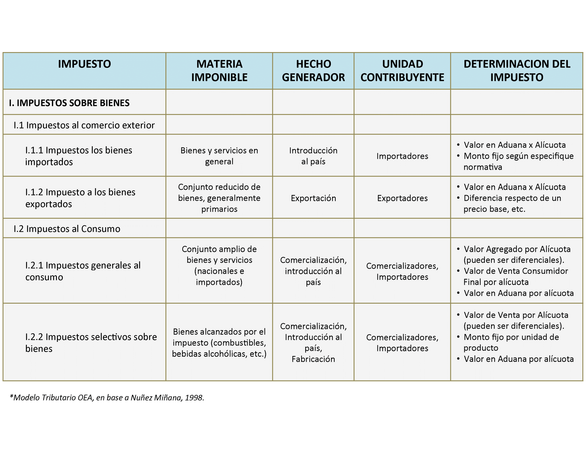
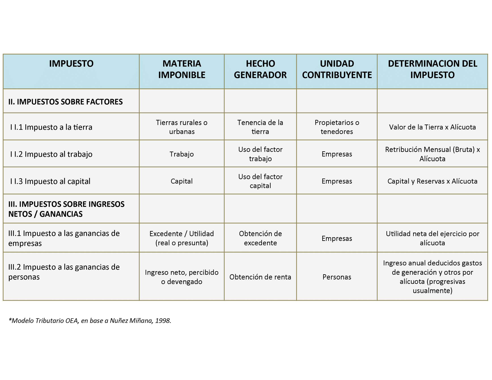

# Bibliografia

-   Rosen, H. S. (2008). Hacienda Pública (7ma. edición). Madrid:
    McGraw-Hill/Interamericana. Capítulo 8, págs 55 a 65 y 165 a 190.
    Disponible:
-   Garriga, M., & Rosales, W. (2013).Finanzas públicas en la práctica.
    Selección de casos y aplicaciones. Buenos Aires: Editorial Dunken.
    Capítulo 2, págs. 15 a 22. **Solicitar por: 336 G 53902.**
-   Musgrave y Musgrave (1992). Hacienda Pública Teórica y Aplicada (5a.
    edición). Madrid: Mc. Graw Hill. Capítulo 8. **Solicitar por: T 336
    M 38730**

# Los recursos del sector público

1. Los recursos del Estado
   + Tributos
   + Otros recursos
2. Atributos deseables de un sistema tributario
3. Principios de tributación y conceptos de equidad
4. Incidencia impositiva
   + Equilibrio parcial
   + Costos de eficiencia
   + *Tax salience*
   + Equilibrio general
   

# Preguntas

-   ¿Con qué recursos cuenta el Estado para financiarse?
-   ¿En qué se diferencian los tributos de los otros tipos de recursos?
-   ¿Qué se entiende por "compromiso" eficiencia-equidad?
-   ¿Sobre quién recaen los impuestos?
-   ¿Los imuestos causan una pérdida de bienestar?
-   ¿Cómo se analiza la incidencia de los impuestos?
-   ¿Es lo mismo analizar los impuestos en un mercado que en multiples
    mercados?
-   ¿Que se entiende por *tax salience*?

# Los recursos del Estado

-   Hay 4 formas en que el Estado puede financiarse:
    -   Tributos $\longrightarrow$ constituyen una prestación pecuniaria
        de carácter coercitivo y que puede ser en efectivo o en especie
    -   Deuda pública $\longrightarrow$ emisión de deuda pública
        --interna o externa- para hacer frente al pago de obligaciones
        de gasto
    -   Emisión monetaria $\longrightarrow$ estrictamente no es un
        recurso del Estado sino del Banco Central pero el Estado puede
        utilizar este recurso
    -   Activos del Estado $\longrightarrow$ no es un recurso permanente
        ni fuente inagotable pero es parte del acervo de propiedad del
        Estado

# Tipos de tributos

-   **Impuestos** $\longrightarrow$ tributos que recaen sobre todos
    los contribuyentes y no consideran
    beneficios recibidos de bienes públicos
    financiados con esos recursos (sin contraprestación
    identificable)
-   **Contribuciones especiales** $\longrightarrow$ tributos que se
    aplican sólo sobre aquellos contribuyentes beneficiados
    por cierto gasto público. El beneficio que se recibe justifica la contribución
-   **Tasas** $\longrightarrow$ pagos por un beneficio
    personal recibido por un servicio del Estado (ej.: expedir un
    pasaporte/licencia). Puede estar calculada para retribuir
    exactamente el costo del servicio y distribuida en proporción a los
    beneficiarios del servicio o no.

# Enfoques de equidad tributaria

-   Hay **dos enfoques de equidad tributaria**:
    -   **Principio del beneficio** $\longrightarrow$ un sistema
        es equitativo cuando cada uno paga en función del
        beneficio que recibe. Problemas: a) no
        revelación de preferencias (free-rider); b) no se podría hacer
        política redistributiva.
    -   **Principio de la capacidad de pago** $\longrightarrow$ se
        necesita "x" monto para financiar bienes públicos y se recauda en función de la capacidad de
        pago de cada persona. Se vincula con los conceptos
        de equidad horizontal --igual trato a iguales-- y de equidad vertical --capacidades diferentes
        implican trato diferente.

# Clasificación de impuestos

-   Impuestos sobre mercados de productos e impuestos sobre mercados de
    factores
-   Impuestos sobre el comprador e impuestos sobre el vendedor
-   Impuestos sobre las familias (individuos) e impuestos sobre empresas
-   Impuestos sobre los ingresos e impuestos sobre los consumos
-   Impuestos personales (a las personas) e impuestos reales (a las
    cosas)
-   Impuestos directos e impuestos indirectos
-   Impuestos sobre flujos e impuestos sobre stocks.

# Estructura de un impuesto

-   **Materia imponible** $\longrightarrow$ elemento material
        elegido como punto de impacto del tributo --i.e. consumo,
        ingreso, riqueza
-   **Hecho imponible** $\longrightarrow$ circunstancia cuya
        realización origina la obligación tributaria --obtención de
        ingresos, venta, etc
-   **Unidad contribuyente/Sujeto pasivo** $\longrightarrow$ la
        persona física o jurídica sobre la que recae la obligación
        tributaria de acuerdo a la ley
-   **Monto del impuesto** $\longrightarrow$ calculado a partir de
        la BI (cantidad fisica/valor) y de las alícuotas
        definidas por ley (monto fijo/porcentajes)

# Caracterización de impuestos

{#fig:fig1}

# Caracterización de impuestos

{#fig:fig1}

# Atributos de un sistema tributario

-   Un "buen" sistema tributario debería tener 5 (cinco) propiedades:
    -   Eficiencia económica $\longrightarrow$ no debe interferir en la
        asignación eficiente de los recursos
    -   Sencillez administrativa $\longrightarrow$ facil, rapido y
        barato de administrar
    -   Flexibilidad $\longrightarrow$ adaptable y con respuesta rápida
        (automática) a cambiantes condiciones
    -   Responsabilidad política $\longrightarrow$ sistema debe ser
        transparente y claro
    -   Justicia $\longrightarrow$ debe ser justo en la forma de tratar
        a los diferentes individuos

# (1) Eficiencia económica

-   La gran mayoría de los impuestos **distorsionan los precios
    relativos** $\longrightarrow$ alteran asignación de recursos
-   Impuesto al ingreso afecta decisión de trabajar, impuesto al consumo
    afecta decisión de que cosas comprar, impuesto a la riqueza afecta
    qué bienes poseer
-   En términos generales, los impuestos afectan la conducta de los
    individuos.
-   Con impuestos altos, incluso, muchas veces los empresarios se
    preocupan más por ver en qué actividades pagan menos impuestos que
    en tratar de diseñar proyectos más rentables

---

-   Efectos financieros $\longrightarrow$ ¿es lo mismo que mi empleador
    me descuente para jubilación que yo ahorre? Los
    impuestos afectan la estructura financiera de las empresas
    (deuda/acciones)
-   Efectos organizativos $\longrightarrow$ si se favorece la
    responsabilidad limitada, será un entorno más favorable a asumir
    riesgos y emprender. El sistema tributario puede favorecer o
    desalentar los bancos y entidades financieras; efectos sobre inversión
-   Efectos sobre el equilibrio general $\longrightarrow$ un impuesto
    sobre los intereses puede reducir oferta de ahorro y a la larga el
    stock de capital
-   Otros efectos $\longrightarrow$ un mero anuncio puede afectar
    el valor actual. Ejemplo: quita de deducción de intereses
    hipotecarios puede bajar precio de casas

---

> **Distorsivos y no distorsivos.** Un impuesto es **no distorsivo** si y solo
si el individuo no puede hacer anda para alterar sus obligaciones
fiscales. Un impuesto es **distorsivo** cuando los individuos intentan
alterar sus obligaciones fiscales. Ejemplos de los primeros son
**impuestos de suma fija**, como por ejemplo, un impuesto de capitación.
No hay efecto sustitución solo efecto renta. Ejemplo de los segundos son
los **impuestos sobre los bienes**. Un individuo puede alterar su
obligación fiscal comprando menos del bien; también puede reducir su
obligación con un impuesto al ingreso disminuyendo su oferta de trabajo
o su ahorro. Hay efecto renta y efecto sustitución. Todo impuesto
distorsivo es ineficiente.

# (2) Sencillez administrativa

-   La administración del sistema fiscal tiene costos directos ("costo de
    hacer andar" AFIP) e indirectos (para los contribuyentes). Estos
    últimos involucran burocracia, archivado, y costos de
    contratar profesionales
-   Estos costos indirectos dependen del tamaño de la empresa, de la
    tecnología, de la complejidad del sistema tributario (deducciones de
    impuesto a ganancias) y del tipo de bienes (consumo/capital).
-   También del tipo y peso relativo de diferentes impuestos --menores
    costos con IVA recauda gran parte de un numero pequeño de empresas
    al nivel productor y fabricantes que imp a las ventas que recauda en ventas finales de miles de minoristas.

# (3) Flexibilidad

-   Las fluctuaciones económicas requieren ajustes en las alícuotas
    impositivas. A veces los ajustes son rápidos, otras difíciles
    políticamente y algunas veces automáticos.
-   Cuando hay una recesión, sería deseable que baje la presión
    tributaria *automáticamente* para facilitar la reactivación
    $\longrightarrow$ impuesto a las ganancias se comporta como
    **estabilizador automático** porque baja la alícuota promedio (y la
    obligación tributaria promedio) cuando bajan los ingresos 
-   Dificil lograr consenso político para aumentar (bajar) impuestos.
    ¿Qué impuestos se suben (bajan)? El imp a las ganancias es
    difícil de subir pero imp a las riquezas no tanto. \[Opine\]

# (4) Responsabilidad política

> **Jean Baptiste Colbert:** "El arte de la tributación consiste en desplumar al
ganso de tal manera que se le pueda quitar el mayor número de plumas con
la menor cantidad posible de ruido"

-   Impuestos transparentes $\longrightarrow$ los individuos saben
    perfectamente quién se beneficia y quién paga (impuesto a las
    ganancias es un buen impuesto)
-   ¿Por qué el IVA es tan frecuentemente usado? Es menos "visible" que
    Ganancias, por ejemplo. Nadie calcula cuanto paga de IVA como si de
    Ganancias.
-   Impuesto a las sociedades? Desde la transparencia malo
    --no lo pagan las personas jurídicas sino los individuos pero
    difícil saber quien

# (5) Justicia (equidad)

-   Principal reclamo a los sistemas tributarios es la falta de equidad. Hay dos conceptos principales de equidad:
    -   Equidad horizontal $\longrightarrow$ un sistema tributario es
        **equitativo horizontalmente** si los individuos que son iguales
        en todos los aspectos relevantes reciben el mismo trato --i.e.
        no discriminación por motivos raciales, sexo, etc.
    -   Equidad vertical $\longrightarrow$ un sistema tributario es
        **equitativo verticalmente** si los que se encuentran en mejores
        condiciones para pagar impuestos efectivamente los pagan.

# Equidad horizontal y vertical

-   Existen dos conceptos vagos en nuestra definición:
    -   ¿Qué significa que dos personas sean iguales en todos los
        aspectos relevantes?
    -   ¿Qué significa que reciban el mismo trato?
-   Considere 2 gemelos. Iguales en todo solo que a uno le gusta el
    helado de chocolate y al otro  vainilla (cuestan igual). ¿Tiene **equidad horizontal** si se grava a los 2 con
    alícuotas diferentes? ¿El sistema no
    discrimina a los individuos?. 
-   Si diferencias de gustos reflejan diferencias
    económicas, no se cumpliría el principio de equidad
    horizontal $\longrightarrow$ no existen dos personas
    idénticas! ¿Dstinciones aceptables?

---

-   En el ideal, todas las distinciones son inadmisibles
    $\longrightarrow$ edad, sexo, religión y estado civil.
-   Pero efectivamente, las sociedades distinguen $\longrightarrow$
    deducciones especiales por edad y por estado civil
-   ¿Dos personas iguales en todo y con el mismo ingreso pero con
    diferentes gastos médicos, deben pagar lo mismo? ¿Gastos medicos
    necesarios o voluntarios? ¿Quién decide?
-   Dos personas --hombre y mujer- con mismo ingreso a lo largo de la
    vida. ¿Prestaciones total iguales o prestaciones anuales iguales?
    Mujer mas esperanza de vida, por lo que en la segunda opción
    recibiría bastante mas. ¿Sería esto justo?

---

-   La **equidad vertical**, por su parte, plantea también ciertos problemas
    y desafíos de especificación:
    -   determinar quién debe pagar una alícuota más alta
    -   elaborar normas fiscales que permitan poner en practica este
        principio
    -   determinar cuánto más debe pagar en relación con los demás con
        los que se compara.

# Criterios para establecer impuestos

-   El **ingreso** como base $\longrightarrow$ ingresos más altos
        tienen capacidad de pagar impuestos más altos. Suelen ser
        *progresivos*
-   El **consumo** como base $\longrightarrow$ idea es gravar según lo que "obtienen" y no lo que "generan". Dos
        personas A y B ganan 1000 por año por 50 años. B ahorra 20% por
        mes: A tendrá 50000 y B tendrá 63478. ¿Quien paga mas?
-   El **ingreso percibido a lo largo de toda la vida**
        $\longrightarrow$ ingreso igual al valor descontado del consumo
        $y^{*}=c_0 +\frac{c_1}{1+r}$.
-   La **riqueza** $\longrightarrow$ se grava un stock y es
        relativamente fácil de recaudar

