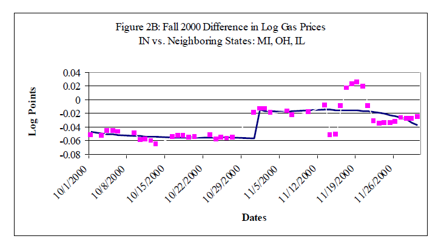

# Bibliografia

-   Rosen, H. S. (2008). Hacienda Pública (7ma. edición). Madrid:
    McGraw-Hill/Interamericana. Capítulo 8, págs 55 a 65 y 165 a 190.
    Disponible:
-   Garriga, M., & Rosales, W. (2013).Finanzas públicas en la práctica.
    Selección de casos y aplicaciones. Buenos Aires: Editorial Dunken.
    Capítulo 2, págs. 15 a 22. **Solicitar por: 336 G 53902.**
-   Musgrave y Musgrave (1992). Hacienda Pública Teórica y Aplicada (5a.
    edición). Madrid: Mc. Graw Hill. Capítulo 8. **Solicitar por: T 336
    M 38730**

# Incidencia impositiva

# Impuestos e incidencia

---

---

-   El campo de la incidencia impositiva estudia los efectos de las
    políticas impositivas sobre los precios y el bienestar de los
    individuos
-   ¿Qué pasa con el precio de mercado de un bien cuando se introduce un
    impuesto?
    -   Ejemplo $\longrightarrow$ ¿qué pasa con el precio de cigarrillos
        cuando ponemos un impuesto de $1$ dolar por paquete?
-   Efecto s/ precio $\longrightarrow$ efectos distributivos en consumidores (fumadores), productores, pero también
    accionistas, agricultores (tabaco)
-   Involucra análisis positivo; normalmente, el primer paso
    para una evaluación de política para luego pensar políticas que
    maximicen el bienestar

---

-   Implica una caracterización analítica de
    cambios en el equilibrio cuando se introducen impuestos
-   Incidencia legal no tiene nada que ver con incidencia económica
-   Punto central $\longrightarrow$ **impuestos pueden ser
    trasladados**; impuestos afectan $P$ en forma directa; y estos
    afectan $Q$ en forma indirecta (respuestas comportamentales);
    y estas afectan $P$ de otros bienes en forma indirecta
-   Ejemplo $\longrightarrow$ liberales proponen gravar al $K$ (distribución altamente concentrada); esto
    implica gravar desproporcionalmente a los mas ricos
-   Problema $\longrightarrow$ omite efectos de $P$ de
    equilibrio general --si los ricos ahorran menos, el stock de $K$ baja; puede bajar salario y afecta a trabajadores

# Incidencia: Equilibrio parcial

# Incidencia: Equilibrio parcial

-   El gobierno pone un impuesto a las ventas ("excise tax"), $t$, sobre
    el bien $x$
-   Se llama asi porque se impone sobre cantidades y es típicamente fijo
    en terminos nominales --1 dolar por cajita \[diferente del
    "ad-valorem" que es un porcentaje sobre precio\]
-   Sea $p$ el precio antes de impuesto (ADI) del bien $x$ (precio del
    productor)
-   Sea además $q=p+t$ el precio con la inclusion del impuesto (precio
    al consumidor)
-   Notese que aquí, a diferencia del equilibrio sin impuesto, existirán
    dos precios a tener en cuenta

---

---

-   La demanda de $x$ es $D(q)$ y disminuye con $q=p+t$. La oferta
    de $x$ es $S(p)$ [$S'(p)>0$]. Equilibrio:
    $$Q=S(p)=D(p+t)$$
-   Suponga que $t=0$ $\longrightarrow$ $S(p)=D(p)$. **Si $t>0$:**
    queremos saber $dp/dt$ --efecto de un pequeño aumento de
    $t$ sobre $p$; esto determina quién soporta
    efectivamente la carga
-   $dp$ responde a $dt$ para equilibrar:
    $$\begin{aligned}
          S(p+dp)=D(p+dp+dt) \\
          S(p)+S'(p)dp=D(p)+D'(p)(dp+dt) \\
          S'(p)dp=D'(p)(dp+dt) \Rightarrow  \frac{dp}{dt}=\frac{D'(p)}{S'(p)-D'(p)}\\
          \end{aligned}$$

---

-   Es util expresarlo en terminos de elasticidades ya que no tienen
    unidad. Sea la elasticidad precio de la demanda:
    $$\epsilon_{D}=\frac{q}{D}\frac{dD}{dq}= \frac{qD'(q)}{D(q)} < 0$$
-   Y sea la elasticidad precio de la oferta:
    $$\epsilon_{S}=\frac{p}{S}\frac{dS}{dp}= \frac{pS'(p)}{S(p)} > 0$$
-   Recordando la ecuación anterior: $$\begin{aligned}
        \frac{dp}{dt}=\frac{D'(p)}{S'(p)-D'(p)}=\frac{\epsilon_{D}}{\epsilon_{S}-\epsilon_{D}} \\
        -1 \leq \frac{dp}{dt} \leq 0  \quad y \quad 0 \leq
        \frac{dq}{dt}=1+\frac{dp}{dt} \leq 1
            \end{aligned}$$

---

$$\frac{dp}{dt}=\frac{\epsilon_{D}}{\epsilon_{S}-\epsilon_{D}}$$

-   ¿Cuándo soportan los consumidores toda la carga? \[$dp/dt=0$ y
    $dq/dt=1$\]
    -   $\epsilon_{D}=0$ \[demanda inelastica\] --demanda de combustible
        de corto plazo
    -   $\epsilon_{S}=\infty$ \[oferta elastica\]
        --ind. competitiva
-   ¿Cuándo soportan los productores toda la carga? \[$dp/dt=-1$ y
    $dq/dt=0$\]
    -   $\epsilon_{S}=0$ \[oferta inelástica\] --capacidad
        fija y costos hundidos.
    -   $\epsilon_{D}=\infty$ \[demanda elástica\]
        --sustituto perfecto

---

---

---

---

-   Lecciones principales del analisis de incidencia:
    -   Incidencia legal no es igual a incidencia económica
    -   El equilibrio es independiente de quién paga el impuesto
        (legalmente)
    -   El factor (agente) más inelástico soporta mayor parte de la
        carga
-   Punto $\longrightarrow$ aún en modelos muchos mas complicados, estos
    resultados se mantienen siempre.

# Factores que afectan la incidencia

-   **Características del mercado**
    -   Estructura mdo: comp. vs monopolio
    -   Grado de informalidad, competencia desleal
-   **Territorio**
    -   Comercio exterior (apertura de la economía)
    -   Impuestos subnacionales (ej: automotor)
-   La economía opera en el **tiempo**
    -   Expectativas, efecto anuncio, duración del impuesto (ej:
        reducción del IVA por tres meses)
    -   Dinámica corto plazo vs largo plazo (clave
        costos de ajuste).

---

-   Comportamiento del **Gobierno**
    -   Destino de RT: 1) aumentar gasto ("incidencia
        presupuestaria"); 2) mejorar ahorro público ("incidencia
        absoluta"); 3) reemplazar otros tributos ("incidencia
        diferencial")
    -   Políticas de la autoridad tributaria $\longrightarrow$ costos de
    administración y cumplimiento
    -   Búsqueda de rentas $\longrightarrow$ tratamientos impositivos diferenciales --i.e promociones
    industriales
-   Comportamiento optimizador de los **consumidores**
    -   Explicitar impuestos en el precio puede cambiar el
    nivel de consumos --*tax salience*

# Incidencia impositiva: Costos de eficiencia impositivos

# Costos de eficiencia

-   Se denomina **perdida de peso muerto** --exceso de carga- a la
    pérdida de bienestar creada por el impuesto sobre y por encima de la
    RT.
-   En $O$ y $D$, bienestar medido por la
    suma de excedentes de productor (EP) y consumidor (EC)
-   La pérdida de peso muerto (DWL, en inglés) se mide
    como el *cambio* en el bienestar de prod+cons menos la
    RT $\longrightarrow$ famoso triángulo en
    diagrama

> **Ineficiencia de impuestos.** Está
dada por el grado en que cons. y prods. alteran conducta para evitar el impuesto --porque ambos eligen cantidades ineficientes para
esquivar el impuesto --sin cambio en *Q*, no habrá
DWL

---

---

---

---

---

-   La DWL de un pequño aumento impositivo, $dt$ (partiendo desde $t=0$)
    se puede medir a través del **triángulo de Haberger**
    $$DWL=\frac{1}{2}dQ.dt= \frac{1}{2}S'(p).dp.dt=\frac{1}{2}\frac{pS'(p)}{S(p)}\frac{Q}{p}.dp.dt$$

-   (recuerde que $Q=S(p)$ y por tanto $dQ=S'(p)dp$)

-   Y recordando que
    $dp/dt=\frac{\epsilon_{D}}{\epsilon_{S}-\epsilon_{D}}$:
    $$DWL=\frac{1}{2}\frac{\epsilon_{S}.\epsilon_{D}}{\epsilon_{S}-\epsilon_{D}}.\frac{Q}{p}(dt)^2$$

---

$$DWL=\frac{1}{2}\frac{\epsilon_{S}.\epsilon_{D}}{\epsilon_{S}-\epsilon_{D}}.\frac{Q}{p}(dt)^2$$

1.  DWL aumenta con el valor absoluto de ambas elasticidades
    $\epsilon_{S}>0$ y $-\epsilon_{D}>0$ --mas eficiente gravar a bienes
    que tienen O y D mas inelásticas
2.  DWL mayor con el cuadrado de la alícuota
    $\longrightarrow$ impuestos bajos tienen DWL menores; impuestos
    altos, DWL mayores --(1) más eficiente distribuir impuestos
    entre muchos bs. que gravar pocos; (2) mejor fondear un
    gasto excepcional (guerra) con deuda antes que con $T$ altos
3.  Distorsiones pre-existentes hacen el costo de imposición mayor
    $\longrightarrow$ nos movemos de un triángulo a un trapezoide!

---

---

# Aplicación: Imposición óptima

> **Problema.** Un individuo consume $K$ bienes diferentes --¿cuáles son las
tasas $t_{1},t_{2},...t_{K}$ para cada bien que recauda una cierta
cantidad *minimizando* la perdida de bienestar individual?

-   Ramsey (1927): $t$  uniformes $t_{1}=t_{2}=...=t_{K}$ no óptimas si demandas de $i$ diferente elasticidad

> **Regla de Ramsey:**  $t$ óptimas son las que igualan DWL marginal de todos los bienes: $$MDWL_{i}=constant \quad x MR_{i}$$

- Óptimo $\longrightarrow$ gravar más fuerte los
bienes inelásticos (menos a más elásticos)

# Incidencia impositiva I: Evidencia

-   Doyle and Sampatharank (2008) estudiaron los recortes impositivos al
    combustible ("gas tax holidays") en USA  $\longrightarrow$ ¿los recortes llegan a consumidores o se los
    quedan los productores?
-   Toman reformas del $T$ al combustible por estado. Situación $\longrightarrow$ $P$ de combustible más de 2 dolares en 2000 --IN/IL suspende un $T$ de 5\%
    al combustible entre julio y diciembre
-   Comparan estados tratados y no tratados
    (vecinos/contiguos) antes y después del cambio
-   Conclusiones $\longrightarrow$ aumento de 10c en $T$ lleva a un
    aumento de 7c en precio consumidor --consumidor soporta un 70\% de la
    incidencia

---

---

---

# Incidencia impositiva II: Evidencia

-   Los impuestos específicos sobre cigarrillo varían fuertemente en los
    estados de EEUU
    -   desde un bajo $0.025$ por paquete en Virginia
    -   a un alto $1.51$ por paquete en Connecticut and Massachusetts
    -   desde 1990, Nueva Jersey aumentó el impuesto en 6 veces
    -   Arizona tambien lo aumento casi 8 veces
-   Muchos estudios existentes s/este tema
-   Casi todos concluyen que el precio de los
    cigarrillos aumenta exactamente en el monto del $T$
    
# Incidencia impositiva: *Tax salience*

# Incidencia: Tax salience

-   Supuesto del análisis anterior: *impuestos son
    equivalentes a los precios*. Es decir:
    $$\frac{dD}{dt}=\frac{dD}{dp}$$
-   Pero los $T$ pueden tener diferentes efectos en $D$ sin que los consumidores se den cuenta o
    no. ¿Las personas son conscientes de las alícuotas
        marginales que enfrentan?

> **Tax salience.** El impuesto $a$ es more *saliente* que el impuesto $b$ si
el cálculo del precio bruto con impuestos bajo $a$ requiere menos
cómputos que el cálculo del precio bruto con impuestos bajo $b$.

---

-   Chetty, Looney and Kroft (2009) testean este supuesto y generalizan
    la teoría para permitir *salience effects*
-   Primera parte $\longrightarrow$ testear si la *salience*
    --visibilidad del precio bruto con $T$- afecta al comportamiento cuando se imponen a bienes
    -   ¿El efecto de un impuesto sobre el consumo depende de si está
        incluido en el **precio impreso**?
-   Segunda parte $\longrightarrow$ desarrollan formulas de incidencia y
    costos de eficiencia que permiten *salience effects* y otros errores
    de optimizacion

---

-   Modelo de economia con 2 bienes, $x$ e $y$.
    Normalizan el precio de $y$ a 1 y sea $p$ el precio (fijo) antes de
    impuesto de $x$.
-   Impuestos $\longrightarrow$ $y$ no sujeto a imposicion; $x$ sujeto a
    un impuesto *ad-valorem* a las ventas, $\tau$ (no incluido en el
    precio impreso)
    -   Precio con $T$ incluido de $x$ es $q=(1+\tau)p$
-   Sea $x(p,\tau)$ la demanda del bien $x$
-   Si los agentes optimizan totalmente, la demanda debería depender
    sobre el precio con impuesto incluido, es decir,
    $x(p,\tau)=x((1+\tau)p,0)$

---

-   La optimizacion total implica que la elasticidad precio iguala la
    elasticidad precio con impuestos:
    $$\epsilon_{x,p}=-\frac{\partial \log x}{\partial \log
      p}=\epsilon_{x,1+\tau}=-\frac{\partial \log x}{\partial \log (1+\tau)}$$

-   Log-linearizamos la fn de demanda
    $x(p,\tau)$ para obtener la ecuación a estimar:
    $$\log x(p,\tau)=\alpha +\beta \log p + \theta\beta \log (1+\tau)$$
-   $\theta$ mide el grado en que los consumidores *sub-reaccionan* al
    impuesto:
    $$\theta=\frac{\partial \log x}{\partial \log (1+\tau)}/\frac{\partial
          \log x}{\partial \log p}=\frac{\epsilon_{x,1+\tau}}{\epsilon_{x,p}}$$

---

-   Proponen dos estrategias para estimar $\theta$:
    -   **Manipular la *tax salience*** $\longrightarrow$ mostrar el
        $T$ tan visible como el precio antes de $T$
        -   Efecto de la intervencion sobre $D$
            $$v=\log x((1+\tau)p,0)-\log x(p,\tau)$$
        -   Compare con el efecto de incremento equivalente de precio
            para estimar $\theta$:
            $$(1-\theta)=-\frac{v}{\epsilon_{x,p}\log(1+\tau)}$$
    -   **Manipular la alícuota** $\longrightarrow$ comparar
        $\epsilon_{x,p}$ y $\epsilon_{x,1+\tau}$ para calcular:
        $$\theta=\epsilon_{x,1+\tau}/\epsilon_{x,p}$$

---

> **El experimento.** Manipulando la *salience* Realizan un experimento de
campo por el que alteran la *salience* --visibilidad- de los impuestos a
las ventas en un supermercado de una gran cadena. Los datos son los
precios semanales y las cantidades vendidas (a nivel de producto). Usan
un *diff-in-diff*. El **grupo de tratamiento** son los cosméticos,
desodorantes y productos para cuidado del pelo en una gran tienda de
California durante tres semanas en 2006. Los **grupos de control**
fueron: 1) otros productos de la misma tienda y de la misma categoría
(pasta de dientes, cuidado de la piel, etc); 2) los mismos productos
pero en una tienda cercana. Los precios impresos de la tienda son

-   Buscan estimar el efecto sobre las cantidades medias vendidas de los
    productos

---

 

---

---

> **La segunda estrategia.** Manipulan alícuotas La idea era comparar efectos
diferenciales de cambios de precios y cambios de impuestos. La
imposición al alcohol es util aqui ya que está sujeta a dos impuestos
estatales en EEUU: 1) impuesto especifico (incluido en el precio); 2)
impuesto a las ventas (agregado en la caja, no mostrado en el precio
impreso)

-   Se explotan cambios en los dos impuestos al nivel de estado y se
    permite estimar $\theta$

---

---

---

---

-   Principal resultado $\longrightarrow$ la *salience* importa!
-   Resultados adicionales $\longrightarrow$ los cambios de precios y
    los cambios de impuestos tienen asociados efectos diferentes
-   A todo nivel, el cambio en la demanda es mayor mientras mas
    *visible* es el impuesto
-   Otros resultados concluyentes $\longrightarrow$ los impuestos sobre
    los productores tienen mayor incidencia sobre los productores que
    impuestos *no salientes* aplicados a los consumidores

---

-   Suponga que $${x(p,t,Z),y(p,t,Z)}$$ son demandas
    empíricamente observadas. Ninguna estructura salvo que sean
    posibles: $$(p+t)x(p,t,Z)+y(p,t,Z)=Z$$
-   La oferta son las mismas que en modelos anteriores. El precio que
    equilibra el mercado satisface: $$D(p,t,Z)=S(p)$$
-   donde $D(p,t,Z)=x(p,t,Z)$ es la demanda de mercado para $x$.

---

---

-   La incidencia sobre los productores de un $\tau$ creciente es:
    $$\frac{dp}{dt}=\frac{\partial D/\partial t}{\partial S/\partial
      p-\partial D/\partial p}=-\theta
    \frac{\epsilon_{D}}{\epsilon_{S}-\epsilon_{D}}$$
-   Note que se dan los siguientes resultados:
    1.  La incidencia sobre los productores es atenuada por la
        existencia de $\theta$
    2.  No neutralidad del impuesto $\longrightarrow$ los impuestos
        sobre los productores tienen mayor incidencia sobre los
        productores que impuestos *no salientes* aplicados a los
        consumidores
-   Intuición $\longrightarrow$ productores necesitan recortar el
    precio *antes de impuesto* cuando los consumidores son menos
    sensibles al $T$

# Incidencia impositiva: Equilibrio general

# Incidencia: Equilibrio general

-   Hasta ahora hemos visto incidencia en *equilibrio
    parcial* $\longrightarrow$ focaliza en un mercado aislado
-   Eq general considera efectos de
    $T$ en otros mdos $\longrightarrow$ efectos de $T$ a los autos puede reducir la $D$ de acero
    --efectos s/ $P$ más allá del mdo de
    autos
-   Considere el mdo de gaseosas en Berkeley; se creó un $T$ a las gaseosas. ¿Quién soporta la carga? Si $D$ inelastica, los consumidores. Pero $D$ gaseosas es elástica
    $\longrightarrow$ si $P$ gaseosas en Berkeley sube, sus
    habitantes compran menos o consumen en
    Oakland.
-   Si $D$ fuera perfectamente elástica, ¿que
    pasaria?

---

---

-   Si la demanda es perfectamente elástica, entonces.
    1.  Los vendedores de gaseosas en Berkeley soportan toda la carga
       del impuesto
    2.  Pero los vendedores de gaseosas no son entidades auto-contenidas
        --en todos esos lugares se combinan factores (K y L) para vender
        gaseosas
    3.  Ambos factores deberán sufrir el costo en terminos de beneficios
        debido al impuesto

---

-   Entonces la incidencia es trasladada "hacia atrás" a los factores
    productivos que producen el bien gravado
-   Si la oferta de trabajo es perfectamente elástica --dado que los
    trabajadores de Berkeley pueden moverse sin costo a Oakland si les
    bajan salario en Berkeley.
-   El capital, en cambio, es perfectamente inelástico en el corto plazo
    $\longrightarrow$ no podes desmantelar negocio sin costos. Al ser
    completamente inelastico, el K sufre toda la carga --pierden los
    empresarios dueños de negocios
-   En el LP, la oferta de K es elastica $\longrightarrow$
    productores/empresarios pueden vender y reasignar a otro rubro.

---

-   ¿Que pasa en el LP? Si L y K son ambos elásticos en el LP, ¿quién
    soporta la carga?
-   El unico factor inelastico en ese caso es la tierra
    $\longrightarrow$ oferta fija
-   Cuando tanto L y K pueden esquivar el impuesto, la unica forma en
    que los vendedores se quedarán en Berkeley será si pueden pagar un
    alquiler menor sobre la tierra
-   En el equilibrio general de LP, el impuesto a las bebidas gaseosas
    termina perjudicando a los propietarios de la tierra en Berkeley
-   En conclusión, efectos de equilibrio general muy importantes y poco
    estudiados cuando se evalúan políticas públicas
