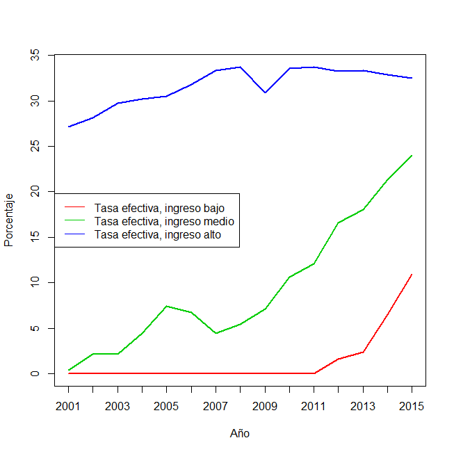
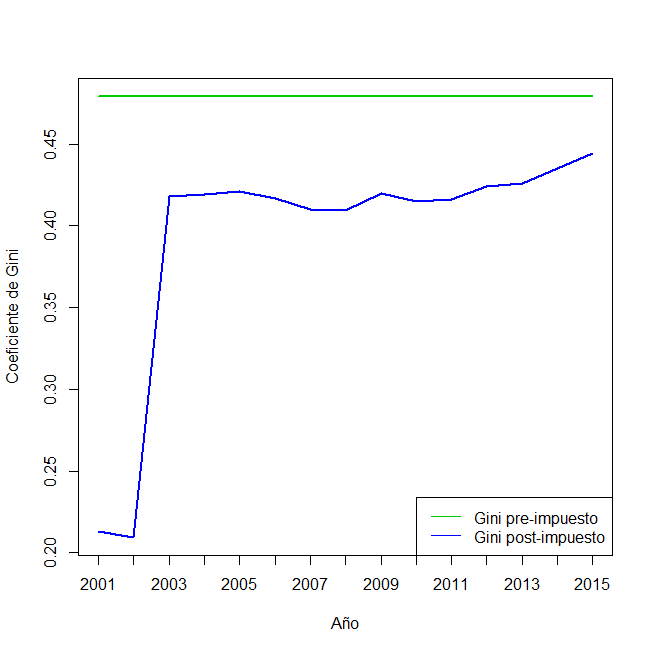

# Bibliografia

-   Due, J. & Friedlaender, A. (1977). Análisis Económico de los
    Impuestos y del Sector Público (4ta Edición). Buenos Aires: El
    Ateneo. Capítulos 10 a 13. Solicitar por: T 336 D 29576
-   Cetrángolo, O., & Gómez Sabaini, J. C. (2007). La tributación
    directa en América Latina y los desafíos a la imposición sobre la
    renta. CEPAL. Capítulo II, págs. 45-92. Disponible:
-   Musgrave y Musgrave (1992). Hacienda Pública Teórica y Aplicada (5a.
    edición). Madrid: Mc. Graw Hill. Capítulo 21. Solicitar por: T 336 M
    38730
-   Albi, E., González-Páramo, J. M., & Zubiri, I. (2009). Economía
    Pública II (3ra. edición). Barcelona: Ariel. Capítulos 4 y 5.
    Solicitar por: T 336 A 53015 T.2
-   Rosen, H. S. (2008). Hacienda Pública (7ma. edición). Madrid:
    McGraw-Hill/Interamericana. Capítulo 15, págs 359 a 400. Disponible:

# Unidad 5. Impuestos a los ingresos. Introducción: aspectos generales

# Preguntas

-   ¿Cuál es la principal herramienta para gravar la renta?
-   ¿Cuáles son los problemas en la definición de la renta?
-   ¿El impuesto a la renta es equitativo y eficiente?
-   ¿Cómo afecta la inflacion a la operación del gravamen?
-   ¿Cuáles son los efectos sobre los incentivos del impuesto a la
    renta?
-   ¿En qué consiste el impuesto a la renta de las sociedades?

# Impuesto a la renta: Personas

-   En muchos países, sobre todo los más desarrollados, el impuesto a la
    renta personal es de los más importantes en términos de relevancia y
    recaudación.
-   Constituye uno de los más importantes instrumentos fiscales en
    relación a la función de distribución del sector público --i.e.
    redistribución.
-   Dependiendo de las rentas que incluye y las deducciones que permite,
    habrá mayores distorsiones sobre la composición de trabajo-ocio,
    sobre la decisión consumo-ahorro y sobre la decisión de composición
    patrimonial (rentas de capital)

---

-   Es un impuesto directo, personal y se aplica sobre todas las
    ganancias obtenidas por personas de existencia física. La ganancia
    es entendida en el sentido de un excedente de ganancias brutas sobre
    gastos necesarios para obtenerla.
-   Es un impuesto que cumple con tres principios basicos de la hacienda
    pública:
    -   suficiencia --i.e. adecuado en terminos de necesidades de gasto
    -   equidad --i.e. medida más apropiada de capacidad contributiva
    -   eficiencia --i.e. distorsiona precio relativo trabajo/ocio pero
        no genera efectos cascada
-   Es un impuesto progresivo $\longrightarrow$ alícuota impositiva
    aumenta al aumentar los ingresos

# La definición de renta

-   Problema $\longrightarrow$ qué se
    entiende por renta. En Arg: "Todas las
    ganancias obtenidas por persona de existencia visible o ideal quedan
    sujetas al gravamen de emergencia que establece esta ley". ¿Qué es renta? $\longrightarrow$ todo.
-   Criterio de Haig y Simmons (H-S) $\longrightarrow$ "renta es el
    valor monetario del incremento neto de la capacidad de consumo de
    una persona en un período de tiempo determinado" $\longrightarrow$
    equivale a lo que **efectivamente** ha consumido durante
    el período más el incremento neto de su riqueza.
-   ¿Por qué debe incluirse el aumento neto de su riqueza (ahorro)?
    Representa un aumento *potencial* del consumo

---

-   Notese que este criterio de H-S implica dos cosas: a) incluir
    *todos* los incrementos potenciales del consumo; b) excluir *todos*
    aquellos conceptos que disminuyan la capacidad de consumo individual
    --gastos necesarios para obtener la renta.
-   Usando criterio de H-S entonces tendremos que:

> **Medición de la renta.** Es la suma del consumo más la variación patrimonial en un período dado
   
-   En la práctica, muchas razones por las que es difícil
    aplicar este criterio $\longrightarrow$ autoconsumo (huerta);
    ingresos en especie (pasajes, departamento pago,
    vouchers comida); transferencias (jubilaciones, subsidios     desempleo y AUH); herencias y donaciones; ganancias de capital no
    realizadas

---

-   A pesar de estos problemas el criterio de H-S sigue siendo teórica y
    empíricamente relevante por cuanto apunta a los dos aspectos clave
    de *equidad* y *eficiencia*
-   Justicia $\longrightarrow$ dos personas que ganan lo mismo deberían
    pagar lo mismo (equidad horizontal) --si uno gana 1000 en dinero y
    el otro 500 en dinero y 500 en especie, entonces se lesiona el
    concepto
-   Eficiencia $\longrightarrow$ impuesto a la renta personal con
    criterio de H-S tiene virtud de neutralidad --trata igual a *todas*
    las formas de renta con independencia de la fuente y en consecuencia
    no distorsiona i.e no hay efecto sustitución. Ejemplo: no gravar la
    renta imputada de un inmueble conduce a inversión excesiva en
    inmuebles!
    
---

-   En la práctica en casi todos los países que aplican el impuesto a la
    renta personal, se utiliza una definición restringida de renta. Se
    toman:
    -   ingresos y rendimientos que puedan ser efectivamente controlados
    -   gastos deducibles y deducciones específicas
-   Se suele gravar un concepto de $Y$ que incluye ingresos netos
    que cumplan los requisitos:
    -   que la riqueza nueva sea material y valuada en dinero;
    -   que exista una fuente generadora (trabajo o capital)
    -   que fuente esté habilitada
    -   que fuente subsista luego de generado el $Y$

---

> **Renta según criterio H-S.** Impuesto sobre la renta abarca **todas** los
ingresos --herencias, donaciones, transferencias, ganancias de capital.
Todas las transacciones se gravan bajo un único y amplio impuesto

> **Renta según criterio restringido.** Impuesto sobre la renta abarca **un
amplio grupo** de ingresos y deja afuera los ingresos que si tiene en
cuenta el criterio H-S. Estos ingresos se gravan, normalmente, a través
de impuestos específicos y/o regímenes especiales. Lo que no se grava es
parte de la renta según el criterio H-S que queda no cubierta por ningún
impuesto.

# Estructura del $Y$ a la renta personal

-   La **determinación de la base imponible** es:
    -   Se suma la **renta bruta** del individuo
        -   Rentas de 1ra cat. $\longrightarrow$ $Y$ del
            suelo
        -   Rentas de 2da cat. $\longrightarrow$ $Y$ de
            capitales
        -   Rentas de 3ra cat. $\longrightarrow$ $Y$ de
            empresas y auxiliares de comercio
        -   Rentas de 4ta cat. $\longrightarrow$ $Y$ trabajo personal
    -   Al total se le restan las **deducciones** --mínimo
        no imponible- y **otros gastos** --gastos para obtención de
        renta; gastos personales y otros
    -   Esto da la **renta imponible**. Se le aplica una tabla de **tramos de ingreso** y **alícuotas**
       

# Unidad contribuyente

-   La incidencia legal y económica coincide en la persona física. Pero
    criterios diferentes:
    -   Individuo como unidad contribuyente
    -   Pareja como unidad contribuyente
    -   Familia como unidad contribuyente
-   Inequidades posibles --si la UC es individuo, un soltero tiene
    menos responsabilidades de gasto que un casado; y éste, menos que uno casado con hijos.
-   Considerar incentivos $\longrightarrow$ ¿conviene
    que ambos cónyuges trabajen o que sólo uno trabaje? ¿conviene
    casarse para pagar menos $T$?

---

-   Sea: de 0 a 5000
    (10%), de 5000-10000 (20%), de 10000-15000 (30%) y de 15000-20000 (40%)

::: {.scriptsize}
::: {#tab:tab5}
  Tipo      Cant   Flia 1   Flia 2   Flia 3   T Flia1   T Flia2   T Flia3
  -------- ------ -------- -------- -------- --------- --------- ---------
  Hombre     1     10000    15000    20000     2000      4500      8000
  Mujer      1     10000     5000      0       2000       500        0
  Hijos      0       0        0        0         0         0         0
             2     20000    20000    20000     4000      5000      8000

  : Unidad contribuyente: Individuo
:::
:::

::: {.scriptsize}
::: {#tab:tab5}
  Tipo        Cant   T Flia1   T Flia2   T Flia3   T Flia1   T Flia2   T Flia3
  ---------- ------ --------- --------- --------- --------- --------- ---------
  Familiar     2      20000     20000     20000     10000     10000     10000
  T pp                 ---       ---       ---      2000      2000      2000
  Total T      2      8000      8000      8000      4000      4000      4000

  : Unidad contribuyente: Familia (sin (izq) y con (der) promediación)
:::
:::

---

-   El ingreso de los conyuges se puede tratar junto --matrimonio como
    UC- o por separado --individuo como UC.
-   Si se tratan por separado, el problema es el de
    que dos grupos de personas que tienen un mismo monto total de
    ingresos conjuntos pueden pagar diferente $T$ total si la
    composición del total es diferente
-   Si se tratan conjuntamente, hay dos maneras:
    -   Sumar ingresos y luego aplicar $t$
    -   Promediar ingresos y luego aplicar $t$ y multiplicar por
        dos.
-   La primera modalidad discrimna contra los casados; la segunda contra
    los solteros

# Progresividad del impuesto

-   La progresividad de un impuesto está vinculada a la definición de la
    BI y el tipo y escala de tasas aplicables.
    -   Si existe desigualdad de ingresos y se aplica una alícuota
        proporcional, entonces la desigualdad no se modifica; si se
        aplican alícuotas crecientes, la desigualdad disminuye.
-   Un impuesto es **progresivo** si la alicuota media aumenta a medida
    que aumenta la base imponible.
-   El $T$ a las ganancias es considerado el que mejor puede
    operativizar la progresividad --por diseño
-   Es importante su estructura --definición de MNI, deducciones personales.

---

::: {#tab:ganancias}
    GNI Acumulada                    Pagarán  Mas el %    S/ el exc. de \$
  --------------- ------------- ------------ ---------- ------------------
        Más de \$          a \$                         
             0,00     33.039,81         0,00     5                    0,00
        33.039,81     66.079.61      1651,99     9                33039,81
        66.079,61     99.119,42     4.625,57     12              66.079,61
        99.119,42    132.159,23      8590,35     15              99.119,42
       132.159,23    198.238,84    13.546,32     19             132.159,23
       198.238,84    264.318,45    26.101,45     23             198.238,84
       264.318,45    396.477,68    41.299,76     27             264.318,45
       396.477,68    528.636,91    76.982,75     31             396.477,68
       528.636,91   en adelante   117.952,11     35             528.636,91

  : Escalas de ingresos y alicuotas
:::

# Efectos de la inflación

# La inflación y sus efectos

-   La inflación afecta a los individuos de distintas maneras
    $\longrightarrow$ como consumidores, como trabajadores asalariados,
    como tenedores de activos, como prestamistas/prestatarios y como
    contribuyentes
-   Nos interesa analizar los efectos de la inflación sobre los
    individuos como contribuyentes y puntualmente como contribuyentes
    del impuesto a la renta personal.
-   Desde una perspectiva histórica, la primera mitad del siglo XX se
    preocupó por los efectos de los impuestos sobre los precios; en la
    segunda mitad, el foco estuvo sobre los efectos de los precios en
    los impuestos.

---

-   La inflación inevitablemente genera *distorsiones* en los sistemas
    tributarios y especialmente en la imposición a los ingresos
    -   La carga tributaria como la distribución de la misma entre los
        contribuyentes se ven alteradas y no necesariamente en la
        dirección deseada
-   Varios aspectos del impuesto a la renta personal pueden verse
    afectados en condiciones de alta inflación $\longrightarrow$
    distorsiones significativas. Esto se agrava más aún si existen
    exenciones discrecionales y regímenes especiales

# Distorsiones sobre el impuesto a la renta personal

-   La inflación produce efectos distorsivos sobre los siguientes
    aspectos del impuesto a la renta personal:
    -   efectos sobre la base imponible del impuesto
    -   efectos sobre la progresividad
    -   efectos sobre el rezago de recaudacion y su magnitud
    -   efectos sobre la evasión impositiva
    -   efectos sobre la ilusión fiscal
    -   efectos sobre la desigualdad de ingresos post-impuesto

# Efectos sobre la base imponible

-   La inflación genera cambios en el valor real de los ingresos --tanto
    proveniente del trabajo como del capital.
-   En el caso de rentas del capital, este efecto puede ser muy
    importante $\longrightarrow$ ganancias de capital infladas ya que
    valor de venta a precios actuales y costos de adquisición a precios
    históricos
-   El problema fundamental surge porque el valor de la moneda cambia
    entre el momento de la erogación y el momento del ingreso.

# Efectos sobre la progresividad

-   La inflación cambia la progresividad del impuesto a la renta
    personal de dos formas:
    -   Reduce el *valor real* de las exenciones, deducciones y créditos
        que están fijos en términos nominales.
    -   Distorsiona la progresividad del impuesto al reducir la amplitud
        real de los tramos de ingresos a los que se aplica el impuesto
        -   Personas van subiendo de tramos sin variar sus ingresos en
            términos reales ("bracket creep")

# Efectos sobre el rezago de recaudación y su magnitud

-   Cuando hay rezago entre el momento de generación
    de $Y$ y de pago del $T$, hay perdida
    en el valor real de la obligación tributaria
    -   Para el contribuyente, es una ganancia.
    -   Pero introduce una desigualdad entre quienes pueden posponer los
        pagos y quienes no (diferentes tipos de ingresos)
-   Resulta conveniente retrasar el pago si los
    intereses o multas no se actualizan $\longrightarrow$ la magnitud
    del rezago es función del diseño de administración del impuesto y
    crece con la inflación.

# Efectos sobre la evasión impositiva

-   Los contribuyentes al verse empujados a tramos de ingresos y
    alícuotas más altas, tienden a tener menor cumplimiento de la
    obligación tributaria.
-   Si a esto se suma que con inflación creciente mas contribuyentes
    tributan el impuesto, se hace más costoso para la administración
    tributaria el control y el castigo.
-   Probablemente, esto se vea mitigado por el hecho de que la avance
    tecnológico en la administración tributaria ha reducido
    significativamente estos costos.

# Efectos sobre la ilusión fiscal

-   Si la inflacion es un fenomeno temporal, es posible que los
    contribuyentes no perciban adecuadamente que la inflación incrementa
    la presión tributaria y reduce sus ingresos despúes de impuestos.
-   Si la inflación se vuelve persistente, los contribuyentes no sufren
    de ilusión fiscal y perciben que la inflación aumenta su presión
    tributaria $\longrightarrow$ trabajadores pedirán aumentos
    salariales para compensar la perdida de ingreso real
-   En Argentina, por ejemplo, esto puede generar un efecto inercial
    sobre las negociaciones paritarias.

# Efectos sobre la desigualdad de ingresos post-impuestos

-   Al existir una alícuota máxima, cuando aumentan los ingresos
    nominales por ajuste de inflación, las personas en el tramo de
    ingresos más altos seguirán pagando la misma alícuota mientras que
    las personas en tramos más bajos pasan a tramos más altos pagando
    una mayor alícuota.
-   Esto genera un efecto regresivo en la distribución del ingreso por
    cuanto las personas de menores ingresos vean aumentada su presión
    tributaria en mayor medida que las personas de mayores ingresos.

# Aplicación al caso argentino

# Aplicación al caso argentino

-   Proponemos una ilustración muy sencilla para el caso argentino
    utilizando datos reales de escalas, deducciones y actualizaciones y
    datos simulados de ingresos e inflación.
-   El propósito de esta aplicación es ilustrar los efectos de la
    inflación sobre la operación del gravamen a nivel empírico-aplicado
    y contrastarlas con las argumentos teóricos provistos anteriormente.
-   En primer lugar, miramos al efecto sobre la base de contribuyentes

# Efectos sobre la base de contribuyentes

::: {#tab:tab1}
                        **inf**                         **sup**   **2008**   **2011**   **2014**   **var**
  ---------------------------------------------------- --------- ---------- ---------- ---------- --------------
                           0                             10000     101300     80216      50063        -50,58
                         10000                           20000     66697      69349      47926        -28,14
                         20000                           30000     49851      64113      46839        -6,04
                         30000                           60000     78955      149220     120898       53,12
                         60000                           90000     38423      92863      107115       178,78
                         90000                          120000     30844      59888      94746        207,18
                         120000                           ---      91307      199552     486967       433,33
                         Total                                     457377     715201     954554       108,70
                                              

  : Declaraciones juradas presentadas con impuesto determinado

:::

---

-   De la tabla anterior se observan dos cosas. En primer lugar, el
    aumento en la cantidad de contribuyentes entre el año 2008 y 2014
    --más de un 100%.
-   En segundo lugar, este aumento no se ha producido en los tramos más
    bajos de la escala sino todo lo contrario $\longrightarrow$ en los
    tres primeros tramos disminuye la cantidad de contribuyentes
    mientras que en los tramos superiores aumenta fuertemente,
    especialmente en los dos más altos.
-   Indica esto acaso mayor progresividad? Dificilmente sea el caso ya
    que lo que ocurre es que cada vez más se "agrupan" en el último
    tramo $\longrightarrow$ en el extremo en que todos estén en el
    último tramo el impuesto pasa a ser proporcional!

# Deducciones e ingresos

-   Trabajamos con datos anuales para el período 2001-2015 y suponemos
    que existen tres individuos (grupos) con ingresos bajos, medios y
    altos.
-   La primera tabla muestra la evolución de los montos de las
    deducciones admitidas y la evolución de ingresos salariales de
    referencia (Salario Minimo Vital y Movil, Salario Medio Privado,
    Salario Basico Neto Imponible)
-   Por simplicidad, omitimos del cálculo del impuesto determinado la
    excepción introducida por el decreto 1242/13

---

::: {.scriptsize}
::: {#tab:tab2}
   año     gni    cony.   hijo     esp    SMVM    Sme    SBNIs   SBNIc
  ------ ------- ------- ------- ------- ------ ------- ------- -------
   2003   4020    2400    2400    18000   260    1050    1694    2063
   2004   4020    2400    2400    18000   450    1209    1694    2063
   2005   4020    2400    2400    18000   630    1408    1694    2063
   2006   6000    4800    4800    22800   800    1712    2215    2954
   2007   7500    8000    8000    36000   980    2073    3346    4577
   2008   9000    10000   10000   43200   1240   2679    4015    5554
   2009   9000    10000   10000   43200   1440   3224    4015    5554
   2010   10800   12000   12000   51400   1740   4073    4785    6631
   2011   12960   14400   14400   62208   2300   5379    5782    7998
   2012   12960   14400   14400   62208   2670   6973    5782    7998
   2013   15552   17280   17280   74650   3300   8835    6939    9597
   2014   15552   17280   17280   74650   4400   11649   6939    9597
   2015   15552   17280   17280   74650   5588   15277   6939    9597

:::
:::

---

# Variaciones ingresos y deducciones

::: {.footnotesize}
::: {#tab:tab3}
    Per.     Var. Deduc (%)   Var. SMVM (%)   Var. Sme (%)   Inflacion (%)
  --------- ---------------- --------------- -------------- ---------------
   2001-15       477,60          2694,00        1630,12         1385,00
   2001-16      1404,63          2930,00        1980,07           NA

  : Variaciones ingresos y deducciones
:::
:::

-   En el 2001, un contribuyente casado y con 2 hijos pagaba el impuesto
    a partir de un salario que representaba más de 8 SMVM. En el 2015,
    lo hacía a partir de un salario que representaba menos de 2 SMVM. En
    países como Brasil, Uruguay y Chile el salario a partir del que se
    paga representa entre 3 y 5 SMVM.

# Ingresos bajos, medios y altos

-   Suponemos que tenemos 3 (tres) personas con diferentes niveles de
    ingreso por mes:
    -   Ingresos bajos $\longrightarrow$ 800 pesos a en 2001
    -   Ingresos medios $\longrightarrow$ 2000 pesos en 2001
    -   Ingresos altos $\longrightarrow$ 10 mil pesos en 2001
-   Suponemos que los ingresos nominales de las 3
    personas crecen a la misma tasa de 25% cada año (compensar por
    inflación).
-   Usando información de deducciones y escala de ingresos y alícuotas vigente, podemos calcular el $T$ determinado para cada individuo.

--- 

::: {.scriptsize}
::: {#tab:tab4}
   año                y1               imp1    pt1                y2                 imp2    pt2                 y3                 imp3    pt3
  ------ ---------------------------- ------- ------ ----------------------------- -------- ------ ------------------------------ -------- ------
   2001   [800]{style="color: blue"}     0     0,0    [2000]{style="color: blue"}    107     0,4    [10000]{style="color: blue"}   35331    27,2
   2002              1000                0     0,0               2500                692     2,1               12500               45710    28,1
   2003              1250                0     0,0               3125                881     2,2               15625               60488    29,8
   2004              1563                0     0,0               3906                2266    4,5               19531               76675    30,2
   2005              1953                0     0,0               4883                4722    7,4               24414               96908    30,5
   2006              2441                0     0,0               6104                5345    6,7               30518               126233   31,8
   2007              3052                0     0,0               7629                4379    4,4               38147               165215   33,3
   2008              3815                0     0,0               9537                6723    5,4               47684               209101   33,7
   2009              4768                0     0,0               11921              11064    7,1               59605               239285   30,9
   2010              5960                0     0,0               14901              20552    10,6              74506               325040   33,6
   2011              7451                0     0,0               18626              29234    12,1              93132               408250   33,7
   2012              9313              1895    1,6               23283              50292    16,6              116415              503840   33,3
   2013             11642              3550    2,3               29104              68313    18,1              145519              630900   33,4
   2014             14552              12292   6,5               36380              101034   21,4              181899              778123   32,9
   2015             18190              25929   11,0              45475              142000   24,0              227374              961164   32,5

:::
:::

# Evolución presión tributaria

# Efectos sobre la desigualdad de ingresos

-   Para evaluar el impacto distributivo de impuestos y sobre la
    desigualdad de ingresos suele compararse el coeficiente de Gini pre-
    y post-impuesto
-   Coeficiente varía entre 0 --distribución perf. igualitaria- y 1 --distribución máxima desigualdad.
-   Interesa comparar no sólo el Gini pre- y
    post-impuesto para todo el período sino también la evolución
    temporal del Gini post-impuesto. La inflación y la falta de
    actualización de deducciones y escala impacta negativamente sobre la
    desigualdad post-impuesto, especialmente a partir del año 2009.

# Impacto sobre Gini

# Propuestas y mecanismos de solución

# Propuestas de solución

-   Ante lo visto y las distorsiones que
    genera, el gobierno tiene tres alternativas:
    -   no hacer nada
    -   introducir ajustes periódicos y discrecionales
    -   introducir ajustes permanentes y automáticos --i.e. mecanismos
        de indexación
-   El grado de respuesta estará influenciado por la tasa de inflación, su persistencia, y la flexibilidad  para cambiar el sistema tributario.
-   Con inflación baja (5%), las distorsiones no serán
    grandes por lo que no hacer nada o a ajustes
    periódicos alcanza; con inflación alta (20%+), tal vez algún mecanismo de indexación.

# Mecanismos y tipos de indexación

-   Existen varios tipos y mecanismos de indexación
    -   Indexación de exenciones/deducciones $\longrightarrow$ buscan
        actualizar los montos a deducir de los ingresos monetarios
        anuales
    -   Indexación de escalas/tramos $\longrightarrow$ ajuste automático
        del rango del intervalo de ingresos a los cuales se aplica la
        tasa
    -   Indexación por ajustes de ingresos de capital $\longrightarrow$
        para mitigar el problema de medición errónea de las ganancias de
        capital se suele indexar los valores históricos de inventario

# El caso de Argentina

-   En Argentina la ley del impuesto a las ganancias dispone de
    mecanismos de ajuste por inflación automáticos de las diferentes
    exenciones y deducciones.
-   Este sistema operó hasta la ley de Convertibilidad que prohibió la
    indexación y desde entonces se dejaron de actualizar
    *permanentemente* y *automáticamente* las deducciones y exenciones.
-   La tabla de tramos y alícuotas se fijó en el año 2000 y desde
    entonces no se actualiza.
-   Se configura una situación actual que tiene *inflación alta y
    persistente*, *actualización periódica y discrecional de exenciones
    y deducciones* y *no indexación de escalas y tramos*.

# Mirando hacia el futuro

-   Actualmente dos proyectos de reforma del impuesto a las ganancias.
    Ambos proponen actualizaciones de las deducciones y actualización de
    los tramos de ingresos y alícuotas.
-   Sin embargo, el proyecto del oficialismo prevee actualización
    periódica y discrecional; el proyecto opositor propone indexación
    automática y permanente.
-   Si bien ambos proyectos devolverían progresividad al impuesto a la
    renta personal, el país tiene aún una inflación alta y las
    expectativas inflacionarios no están del todo ancladas. Desde el
    punto de vista de la progresividad del impuesto el proyecto opositor
    parece mejor diseñado para ello.
