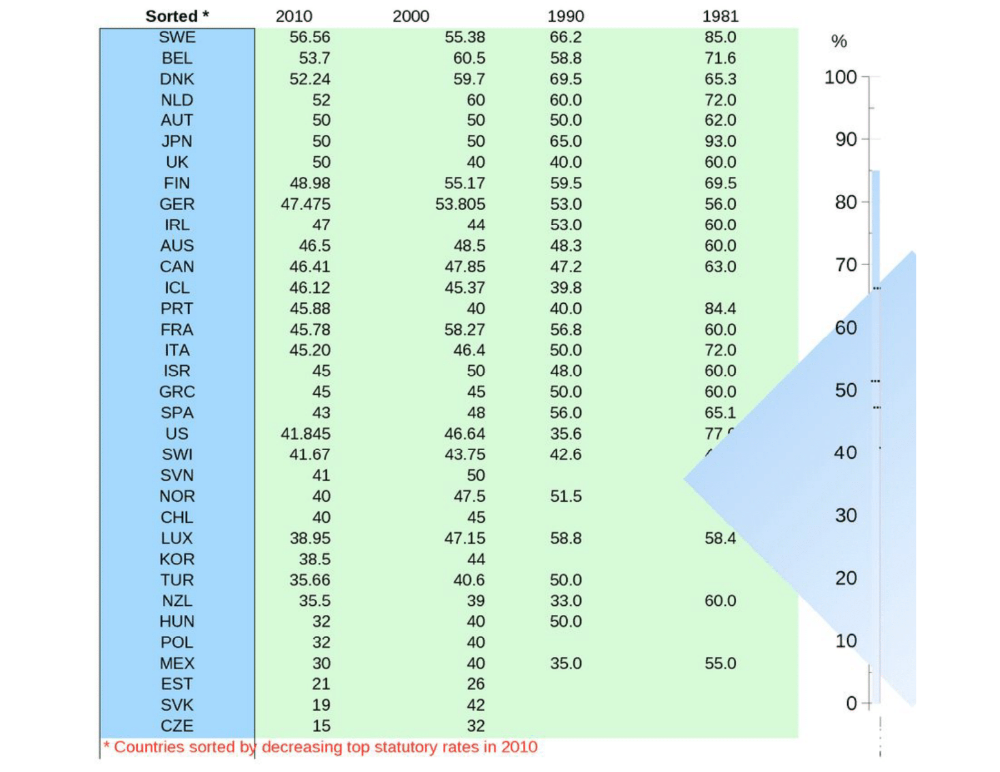

# Bibliografia

-   Cetrángolo, O., & Gómez Sabaini, J. C. (2007). La tributación
    directa en América Latina y los desafíos a la imposición sobre la
    renta. CEPAL. Capítulo II, págs. 45-92. Disponible:
-   Musgrave y Musgrave (1992). Hacienda Pública Teórica y Aplicada (5a.
    edición). Madrid: Mc. Graw Hill. Capítulo 21. Solicitar por: T 336 M
    38730
-   Albi, E., González-Páramo, J. M., & Zubiri, I. (2009). Economía
    Pública II (3ra. edición). Barcelona: Ariel. Capítulos 4 y 5.
    Solicitar por: T 336 A 53015 T.2
-   Rosen, H. S. (2008). Hacienda Pública (7ma. edición). Madrid:
    McGraw-Hill/Interamericana. Capítulo 15, págs 359 a 400. Disponible:

# Unidad 5. Impuestos a los ingresos. Efectos sobre incentivos y distorsiones

# Efectos sobre incentivos y eficiencia

-   Un argumento para la baja de impuestos --sobre
    todo aquellos de tipo personal- es que tienen efectos desfavorables
    para la actividad económica
-   ¿Para qué trabajar más si cada peso adicional genera menos ingresos?
    ¿Por qué ahorrar para mañana si resulta más barato gastar hoy?
-   Incidencia como la eficiencia de un sistema
    fiscal dependen de cómo se afecta el comportamiento
-   Existen 4 aspectos sobre los que el impuesto al $Y$ puede
    afectar el comportamiento: a) oferta de trabajo; b) ahorro; c)
    consumo de vivienda; d) decisiones de inversion financiera

---

-   Un individuo debe decidir como reparte su tiempo semanal entre
    **trabajo** y **ocio**. Tiene un tiempo disponible máximo, $OT$ y
    una restricción presupuestaria entre trabajo y ocio, dado el
    salario, como $TD$.
-   Las preferencias individuales determinan en que punto de la recta
    presupuestaria entre trabajo y ocio el individuo terminará. En el
    punto $E1$ la utilidad del individuo es máxima y dedica $OF$ horas
    al ocio y $FT$ al trabajo. Su renta es igual a $OG$.
-   De esta manera puede representarse la elección trabajo-ocio cuando
    no hay impuestos. Ahora vamos a suponer que hay diferentes versiones
    de imposición personal.

# Trabajo-ocio: Sin impuestos

# Trabajo-ocio: Con impuestos

-   Ahora el Estado aplica un impuesto con una alícuota $t$. Esto
    reducirá el salario a $(1-t)w$. Es decir, ahora debe renunciar a
    *menos* salario para obtener una hora mas de ocio.
-   La recta presupuestaria es ahora mas plana --tiene mas incentivo a
    reemplazar trabajo por ocio. La combinacion $E1$ ya no resultará
    posible y deberá contentarse con un punto como $E2$. Trabaja menos
    ($IT$) y descansa mas ($OI$). La renta que percibe es $OG'$.
-   Como consecuencia del impuesto proporcional, el individuo reduce su
    oferta de trabajo. ¿Podremos generalizar para cada individuo? No.

---

---

---

-   El último gráfico muestra que un individuo que se enfrenta a la
    misma RP que el anterior y trabaja el mismo número de horas ($FT$)
    antes del impuesto.
-   Pero luego del impuesto, aumenta sus horas a $JT$. Esto dependerá
    de las preferencias personales. No hay irracionalidad alguna. 
-   Aquí de nuevo tenemos al efecto
    ingreso (EI) y efecto sustitucion (ES). El impuesto reduce el
    salario disponible --i.e. el costo de oportunidad del trabajo- por
    lo tanto induce a sustituir trabajo por ocio. Pero el impuesto
    reduce todo el ingreso de una persona, por lo que inducirá a
    trabajar más para recuperar ese poder adquisitivo. Ambos operan en direcciones opuestas. 

---

---

-   El gráfico anterior analiza un impuesto progresivo. Ahora la restricción presupuetaria post-impuesto es TLMN \[¿Por
    qué?\]. La pendiente a medida que se trabaja mas es cada vez más
    baja, por las alicuotas crecientes.
-   Nuevamente, el punto final de elección dependerá de sus
    preferencias. Pero noteses que mientras mas progresivo sea la
    alicuota mas probable es que con preferencias (y curvas) normales,
    el efecto sustitución tenderá a dominar al efecto ingreso.
-   Evidencia para EEUU sugiere que varones entre 20 y 60 no reasignan
    mucho trabajo-ocio ante cambios en salario neto; el efecto si es muy
    significativo para las mujeres.

# Impuesto a la renta de sociedades

# Impuesto a la renta de sociedades

-   Pregunta: ¿debe haber un impuesto a la renta de sociedades? además
    de un impuesto a la renta personal. De algún modo detrás de las
    sociedades, hay en definitiva personas físicas.
-   Pero existen varias razones como se vera:
    -   Posible menor evasión -beneficios no distribuidos.
        Muchas veces no declarados por accionistas
    -   Simplifica adm. tributaria --más facil recaudar en
        cabeza de empresa.
    -   Razones de economía política $\longrightarrow$ no queda claro
        quien "paga" el impuesto; bajo costo político. Lo paga una
        sociedad ideal

# Co-existencia con imp al $Y$ 

# Problemas asociados

-   Puede alterar la política de dividendos, a favor de la retención de
    beneficios
-   Puede afectar la estructura de financiamiento de las sociedades, si
    existe un tratamiento asimétrico entre las dos fuentes de
    financiamiento disponibles (capital propio y deuda). Esto sucede
    cuando se permite considerar a los intereses de deuda como gastos
    deducibles (baja el costo del financiamiento con deuda).
-   Puede alterar la organización empresarial espontánea, favoreciendo
    la constitución de organizaciones no societarias

# Efectos de la inflación

-   Riesgo de gravar ganancias ficticias: inflación hace que el valor real de las amortizaciones sea mayor a valor de libros (costos históricos). Solución: ajustes mediante índices de inflación o usar criterio de costo
    de reposición (valor de mdo.); ajustes indirectos vía exenciones
    a las gcia de $K$ por actualización de balance
-   La inflación afecta las existencias. La deuda tributaria se modifica dependiendo del método
    contable de valoración de existencias. Con FIFO, las
    gcias  mayores que con  LIFO.
-   Afecta el valor de los activos fijos de la empresa (valor de venta mayor a valor de compra, se grava incrementos patrimoniales inexistentes)

# Ganancias de capital

-   Ganancias de capital se generan por aumentos en el valor de los
    activos (variaciones reales, no nominales) $\longrightarrow$ pueden ser positivas o negativas
-   Una característica inherente a las mismas es que no son flujos
    regulares ni periódicos
-   Principal problema $\longrightarrow$ son de difcil valuación (son
    fáciles de captar pero cuesta ponerse de acuerdo en su valuación).
    Hay dos criterios centrales:
    -   Incluirlas en un $T$ a la renta de base amplia
    -   Gravarlas por separado cuando se realizan (imp. específico).         Alicuotas bajas para evitar efecto "congelamiento".

# Estructura y composición tributaria: Algunas cifras internacionales y locales

# Imp. al $Y$ personal

# Alicuotas maximas legales

# Imp. a la $Y$ de sociedades

# Composicion tributaria Argentina

# Evolución composición tributos del sector público

