## Bibliografia

-   Stiglitz, J. E. (2000). La Economia del Sector Publico (3ra.
    edicion), Barcelona: Antoni Bosch Editor. Capitulo 7, pags. 181
    a 210. 
-   Garriga, M., & Rosales, W. (2013).Finanzas publicas en la practica.
    Seleccion de casos y aplicaciones. Buenos Aires: Editorial Dunken.
    Capitulo 2, pags. 70 a 80. 
-   Shepsle, A. K., & Bonchek, M. S. (1997). Analyzing politics:
    rationality, behavior, and institutions. New York: Norton. Capitulos
    2 a 5. Paginas 13 a 99. Disponible:

## Las decisiones colectivas: Agregacion de preferencias y decisiones sociales

1. Naturaleza y motivacion
2. Racionalidad y preferencias individuales
3. Agregacion y preferencias colectivas: Reglas de decision
4. Tipos de preferencia y el teorema del votante mediano

# **Naturaleza y motivacion** {background="#43464B"}

## Preguntas

-   ¿Como deciden los colectivos de individuos?
-   ¿Que mecanismos existen para "trasladar" preferencias individuales a
    preferencias sociales?
-   ¿Las preferencias individuales (economicas, politicas, etc) dan
    siempre lugar a preferencias colectivas racionales ?
-   Cuando los deseos de los individuos -por ejemplo, sobre el nivel de
    gasto- difieren, como se resuelven
    esas diferencias?
-   ¿Por que es importante el poder de establecer agenda?
-   ¿Cualquier gobierno puede hacer politica redistributiva?

## Tema: ¿Como se decide el nivel de gasto publico?

-   El nivel de gasto en bienes y servicios publicos (y de impuestos) se
    decide a traves del proceso politico --a diferencia del gasto en
    bienes privados
-   Los ciudadanos eligen a representantes por medio de algun sistema de
    votacion, los cuales votan a su vez un presupuesto publico que
    contiene un determinado nivel de gastos e ingresos
-   Cuando un legislador vota, debe decidir sobre dos cosas: 1)
    averiguar los puntos de vista de sus electores; 2) decidir que peso
    asignar a intereses (potencialmente) divergentes

## ¿Por que difieren las politicas economicas?

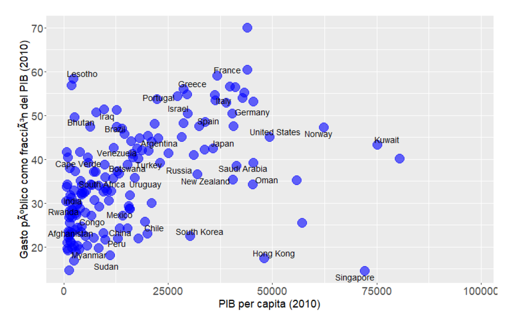{height=450px}

---

- Existe una relacion positiva entre gasto publico y PIB per capita con alguos *outliers* y posibles no linearidades
- ¿Como se explican estas diferencias desde un enfoque puramente economico sin considerar la politica?
- Posibles explicaciones $\longrightarrow$ 1) mayor rol
          redistributivo del Estado; 2) instituciones politicas --presidencialismo vs parlamentarismo, mayoritario vs representacion proporcional.

---

- Si miramos evolucion comparada de largo plazo, observamos claras tendencias a mayor participacion estatal en la economia $\longrightarrow$ medido tanto por el lado de gastos como de recursos y tambien para diferentes paises
- Tambien aqui la politica es importante $\longrightarrow$ expansion y fortalecimiento de las democracias en los ultimos 150 años
- ¿Diferentes preferencias? ¿Diferentes instituciones?

## Diferentes preferencias

-   Individuos $\longrightarrow$ diferentes en varias dimensiones. Dos
    son de particular interes:
    -   Diferencias en preferencias individuales y dotaciones
        individuales $\longrightarrow$ implican diferentes preferencias
        por politicas (heterogeneidad "ex-ante")
    -   Diferencias distribucionales $\longrightarrow$ diferencias
        debido a la accion del mercado (heterogeneidad "ex-post")
        "ex-post".
-   Conflicto de intereses $\longrightarrow$ entre ciudadanos pero
    tambien posible entre ciudadanos y politicos.

## Diferentes instituciones

-   **Preferencias diversas** de ciudadanos y grupos --preferencias de
    ciudadanos por diferentes niveles de gasto publico.
-   Las **instituciones politicas** --i.e reglas constitucionales-
    "agregan" estas preferencias diversas originando resultados
    politicos especificos.
-   Estos dan lugar a **politicas publicas** concretas.
-   Las politicas publicas producen **resultados economicos (y de otra
    indole)** e impactan sobre las **preferencias diversas** de los
    individuos.

## No solo varia en un momento...

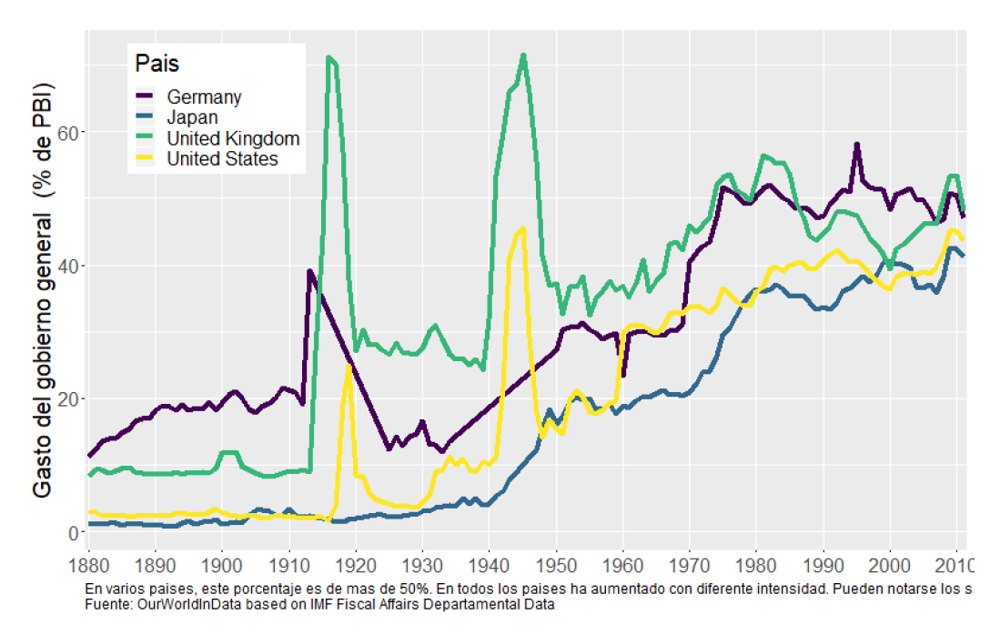{height=550px}

## ...sino tambien a lo largo del tiempo

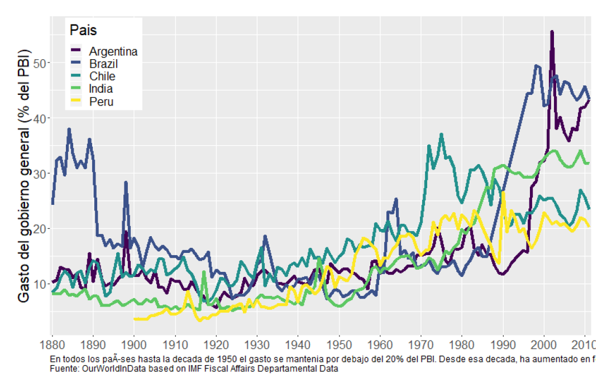{height=550px}

## La economia politica de la politica publica

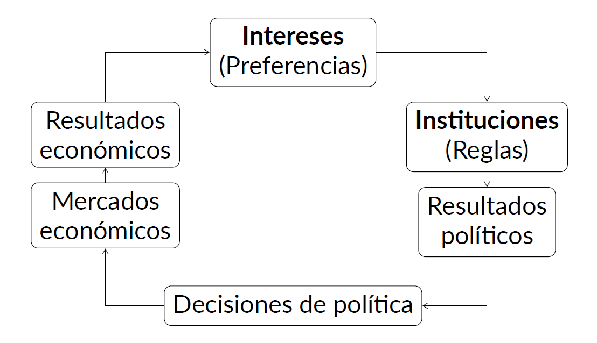

## El rol de la politica

- Un aspecto relevante de la politica es en lo que hace a la **heterogeneidad de intereses**
- Restricciones politicas derivadas de ello implica que las politicas adoptadas en la practica **no son optimas**
- Implicaciones positivas $\longrightarrow$ si la politica optima se encuentra no resulta cierto que esta se implementa (implicito en la *economia del bienestar*)
- Implicaciones normativas $\longrightarrow$ ¿como pueden diseñarse instituciones y politicas para lograr ciertos objetivos?

---

> **Democracia como forma de gobierno** La democracia es la peor de todas
las formas de gobierno excepto por todas las demas \[Winston Churchill\]

---

- Eleccion de la politica economica importa una decision
      colectiva a partir de intereses (preferencias) individuales e
      instituciones politicas determinadas
- Decisiones difieren segun instituciones politicas
        --dictadura versus democracia $\longrightarrow$ tanto en el
        proceso como en los resultados
- Existen dos modelos tipicos de democracia --directa y
         representativa. Si bien difieren en muchos aspectos, ambas
         tienen en el centro del proceso decisorio a mecanismos de
         votacion.

## Escuela de la eleccion publica

-   Individuos racionales motivados por el propio interes en las
    interacciones politicas

> **Modelando al individuo.** Los individuos deben ser modelados en cuanto
persiguen su propio interes, definido en terminos estrictos, como la
posicion de riqueza neta, ya sea predecida o esperada

> **Reglas de juego y juego del juego.** "Para mejorar la politica, es
necesario mejorar o reformar las reglas, el marco dentro del cual el
juego de la politica se lleva a cabo. De ningun modo se sugiere que el
mejoramiento descansa en la seleccion de agentes moralmente superiores
que usan sus poderes para la busqueda del "interes publico"

# **Racionalidad y preferencias individuales** {background="#43464B"}

## Racionalidad y preferencias

> **Racionalidad.** Los individuos que nos interesa estudiar son personas
comunes que tienen **deseos** y **creencias**. Ambos afectan su
comportamiento. Hay **deseos** que provienen desde la propia naturaleza
humana como el deseo de supervivencia y reproduccion, otros que
provienen de la vida social, como el tipo de ropa que usamos o la musica
que escuchamos y otros que provienen de fuentes religiosas, culturales
ideologicas, entre otras. En el mundo de la economia politica, nos
referimos a los deseos como **preferencias**. Y no nos interesa explicar
por que las preferencias son como son --son *dadas* y *estables*, sino
que nos preocupa analizar el impacto de esas preferencias.

---

-   El mundo de las preferencias es un *mundo interior*
    $\longrightarrow$ las personas no revelan en todo momento y lugar
    sus preferencias sobre todas las cosas.
-   Debemos hacer algunos *supuestos* sobre sus preferencias --pueden
    derivarse de intuiciones, evidencias.
-   Pero tambien existe un *entorno exterior* $\longrightarrow$
    incertidumbre de diversa indole. Esta incertidumbre *afecta* la
    forma en que los individuos expresan sus preferencias.

--- 

> **Incertidumbre, preferencias y comportamiento.** Sea un *individuo*
cuya *preferencia* sea obtener un 10 en el examen. No
puede elegir "obtener un 10 en el examen". Pero puede elegir un
*instrumento* (accion) para acercarse a un *resultado* acorde su preferencia. Si una accion es "estudiar la noche previa" y la otra es
"ir de joda" y si se sabe con certeza que la primera
conducira al resultado preferido, entonces como actor racional debera elegirla. [PERO:]{.ul} los
individuos no tienen conocimiento perfecto de como un instrumento
conduce al resultado. Ademas, pueden no conocer como afecta al
resultado lo que otros hacen y tampoco anticipar eventos inesperados. Los individuos deben elegir instrumentos
en base a su conocimiento y experiencia personal y la informacion que
tienen disponible. Es aqui donde entran las **creencias**

---

-   **Creencias** $\longrightarrow$ ideas que un individuo posee en
    relacion a la eficacia de un determinado instrumento (comportamiento
    o accion) para obtener un resultado que esta en linea con una
    **preferencia** de ese individuo.
-   Las **creencias** conectan los instrumentos con los resultados.
    Cuando un individuo actua de acuerdo tanto en base a sus
    preferencias como a sus creencias, se dice que existe **racionalidad
    instrumental**.
-   Las **creencias** cambian --los individuos aprenden- y eso hace que
    se revisen las ideas sobre la eficacia de los instrumentos.
    Gradualmente se reduce la incertidumbre.

---

> **Eleccion racional: Preferencias y creencias.** Un **individuo racional** es
aquel que combina **creencias** sobre el **entorno exterior** y
**preferencias** sobre **cosas del entorno exterior** de una manera
consistente. Este enfoque implica una forma de **individualismo
metodologico**. Lo mas relevante de este enfoque es la observacion de
que los **individuos** tienen preferencias y creencias. Los colectivos
--grupos, clases, empresas, naciones- no tienen preferencias y creencias
en el sentido cognitivo. Aqui entra en juego el tema de la **agregacion
de preferencias y creencias**

## Preferencia y eleccion

-   Sea un individuo, $i$, y 3 objetos --"alternativas"-, $A$,
    $B$, y $C$ sobre los que $i$ tiene preferencias.
-   El individuo $i$ es capaz de evaluar:
    -   "Prefiero $A$ a $B$"
    -   "Soy indiferente entre $B$ y $C$".
-   La relacion $A \succ B$ representa al primer enunciado;
    la relacion $B \sim C$ representa al segundo
-   La **eleccion** de $i$ es racional si esta de acuerdo con su
    **preferencia**.
-   Relaciones de preferencia sujetas a ciertas propiedades que permita "ordenarlas"

## Propiedades de las relaciones

> **Comparabilidad (completitud).** Las alternativas son comparables en
terminos de las preferencias si, dadas dos alternativas posibles, $A$ y
$B$, tenemos ya sea $A \succ
B$, $B \succ A$, o $A \sim B$. Las alternativas son comparables si, dado
cualquier par de ellas, el individuo $i$ prefiere la primera a la
segunda, la segunda a la primera, o es indiferente entre una y otra.

> **Transitividad.** Se dice que la relacion de preferencia estricta es
transitiva si, dadas tres alternativas --$A$, $B$, y $C$-, si
$A \succ B$ y $B \succ
C$, entonces $A \succ C$. Si el individuo $i$ prefiere estrictamente $A$
a $B$ y $B$ a $C$, entonces prefiere $A$ a $C$.

## Ordenamiento de preferencias

-   Si las preferencias de $i$ satisfacen estas propiedades, decimos que
    $i$ tiene un **ordenamiento de preferencias racional**. La eleccion
    racional sera la que este al inicio (izquierda) del ordenamiento
-   Estos ordenamientos de preferencias son **personales** y cada $i$ puede tener uno diferente.
-   No todas las relaciones entre "alternativas" son **completas** o
    **transitivas**. Ejemplos:
    -   La comparacion debe tener sentido $\longrightarrow$ elegir entre cosas desconocidas
        (comparabilidad)
    -   La comparacion debe ser sobre algo que le importa al individuo
      

## Ejemplo: Preferencias deportivas

-   Supongamos que le pedimos a un ciudadano que elabore su relacion de
    preferencias por los equipos del Mundial 2018. En total son 32
    equipos.
-   Si esta persona solo tiene algun tipo de informacion sobre 31 de los
    32 equipos --desconoce absolutamente todo sobre Islandia
    $\longrightarrow$ viola propiedad de "comparabilidad"
    ("completitud")
-   Si esta persona puede comparar todos los equipos en su deseo de
    quien le gustaria gane el Mundial y los ordena asi: $Ger
        \succ Bra$ y $Bra \succ Uru$, pero prefiere que $Uru \succ Ger$
    $\longrightarrow$ viola propiedad de "transitividad".

# **Agregacion y preferencias colectivas: Reglas de decision** {background="#43464B"}

## De lo individual a lo social

-   Teoria de la eleccion social $\longrightarrow$ estudio de los
    procesos colectivos de decision a traves de modelos y paradigmas de
    como agregar insumos individuales --preferencias, bienestar- en
    productos colectivos --preferencias, bienestar.
-   Nicolas de Condorcet y Jean-Charles de Borda plantearon el problema
    en el siglo 19; Arrow, Sen y Black lo teorizaron en el siglo 20.
-   La influencia de la teoria de la eleccion social ha sido fundamental
    en el progreso de la economia, la ciencia politica y la sociologia,
    entre otras disciplinas

## Supuestos del analisis 

-   Existe un **numero impar de individuos** que eligen entre:
    -   Dos (2) alternativas
    -   Mas de dos (2) alternativas
-   Los individuos eligen **racionalmente**
-   Los individuos votan **sinceramente** --no estrategicamente
-   Todos los individuos **participan**.

## Sistemas  y reglas de decision

-   Unanimidad $\longrightarrow$ gana quien recibe **todos** los votos
-   Mayoria (mayoria absoluta) $\longrightarrow$ gana la alternativa que
    recibe la mitad mas uno de los votos.
-   Pluralidad (mayoria simple) $\longrightarrow$ gana la que recibe mas votos (cada individuo elige su mas preferida)
-   Pluralidad con 2da vuelta $\longrightarrow$ gana la que recibe la mayoria absoluta de votos en una eleccion con solo las 2 alternativas mas votadas en 1era vuelta.
-   Mayoria absoluta con voto Condorcet $\longrightarrow$
    se combinan en todos los pares posibles y se votan
    - Por puntos (Borda) $\longrightarrow$ cada individuo asigna puntos a
    las alternativas y gana la de mayor puntaje

---

-   En elecciones con 2 (dos) alternativas, los sistemas de
    **unanimidad** y de **mayoria absoluta** suelen funcionar bien. El
    de unanimidad es muy restrictivo y puede no haber ganador. El de
    mayoria absoluta da siempre un ganador.
-   En elecciones con 3 (tres) o mas alternativas, la mayoria absoluta
    no siempre funciona. Suelen usarse alternativas que varian entre
    **pluralidad/mayoria simple** y **pluralidad con segunda vuelta**
-   Los sistemas de **mayoria absoluta con voto de a pares** y de
    **puntos** suelen usarse en votaciones en comites y en concursos y
    premios.

## Caso I: Dos alternativas

-   Condiciones deseadas de un sistema de reglas de votacion entre dos
    alternativas:
    -   Anonimidad $\longrightarrow$ si 2 votantes intercambian sus votos
        antes de emitirlos, el resultado de la eleccion no cambia
        (votantes simetricos)
    -   Neutralidad $\longrightarrow$ si cada votante individual revierte su orden de preferencia --i.e
        si voto por A, ahora vota por B y viceversa-,
        el resultado de la eleccion se revierte (alternativas simetricas)
    -   Monotonicidad $\longrightarrow$ si un votante unico que originalmente voto por el perdedor eleccion, ahora vota por el ganador, el ganador de la eleccion  sigue siendo el mismo.

---

-   Caso de dos opciones $\longrightarrow$ siempre que el numero de
    votantes sea impar, habra un resultado cierto. Si se vota por regla
    de mayoria absoluta, se elegira la opcion preferida por una mayoria
    de votantes, i.e. $\frac{N+1}{2}$

> **Teorema de May.** El unico metodo que satisface las condiciones de
anonimidad, neutralidad y monotonicidad para determinar un ganador de
una eleccion entre dos alternativas es la regla de la mayoria absoluta.

---

> Tres votantes, dos alternativas:

1.  $A \succ B$
2.  $A \succ B$
3.  $B \succ A$

> El ganador por mayoria absoluta de esta eleccion es $A$. ¿Que pasa si
dos votantes intercambian sus votos? (anonimidad)

1.  $A \succ B$
2.  $B \succ A$
3.  $A \succ B$

El resultado no cambia: gana $A$

---

> Tres votantes, dos alternativas ¿Que pasa si cada uno revierte su preferencia? (neutralidad)

1.  $B \succ A$
2.  $B \succ A$
3.  $A \succ B$

El resultado tambien se revierte: gana $B$ 

> Que pasa si 3 que
voto antes por el perdedor, ahora vota por el ganador?
(monotonicidad)

1.  $A \succ B$
2.  $A \succ B$
3.  $A \succ B$

El ganador sigue siendo el mismo, $A$.

## Caso II: Mas de dos alternativas

-   Con dos alternativas $\longrightarrow$ regla de mayoria absoluta
    para agregar preferencias individuales en preferencias sociales
    produce un claro ganador que satisface propiedades deseadas (siempre
    que numero de votantes sea impar)
-   ¿Que sucede si, como en situaciones de la vida real,
    hay mas de 2 alternativas?
-   El problema se vuelve mas complejo. Problema $\longrightarrow$
    existe alguna regla de votacion que permita agregar preferencias
    individuales en preferencias sociales y que produzca un claro
    ganador y que satisfaga propiedades deseadas?
    -   La respuesta es **no**.

---

   Orden   Juan   Pedro   Maria
  ------- ------ ------- -------
     1      A       C       B
     2      B       A       C
     3      C       B       A

  : Tres alternativas y tres personas

-   ¿Hay ganador por mayoria absoluta? No. Ninguna tiene la mitad mas
    uno de los votos (2). ¿Hay ganador por mayoria simple (pluralidad)?
    No. Ninguna alternativa tiene mas votos que otra --ie. hay triple
    empate.

## El Marques de Condorcet

-   Condorcet se focalizo en un metodo especifico de votacion
    $\longrightarrow$ votacion por mayoria.

> **Teorema del jurado de Condorcet.** Si cada miembro de un jurado tiene una $Prob$ igual e
independiente, $0.5<p<1$ de adoptar la decision correcta sobre la
culpabilidad o inocencia de un acusado, entonces la $Prob$ de que
el jurado adopte la decision correcta se acercara a 1 a
medida que el tamaño del jurado aumenta.

> **La paradoja de Condorcet.** Aun con preferencias individuales
"racionales" (transitivas), las preferencias del grupo (mayoria)
pueden ser "irracionales" (no transitivas). No hay claro ganador.

## Contribuciones de Condorcet

-   La primera idea de Condorcet permite permite justificar votaciones
    colectivas que incluyan, dentro de lo posible, el mayor tamaño
    posible de grupo --jurados populares, elecciones presidenciales.
-   La segunda idea plantea un problema en relacion al metodo de
    decision colectiva $\longrightarrow$ la eleccion por mayoria simple
    es un metodo valido de eleccion pero puede estar asociado a este
    problema de "irracionalidad" del colectivo.
-   Sus planteos le valieron conceptos actuales como *ganador de
    Condorcet* y *ciclos de Condorcet*.

## Votacion Condorcet

-   Suponga que un colectivo debe elegir entre 3 alternativas: A, B
    y C. Hay a priori 6 formas diferentes en que las
    preferencias pueden ser ordenadas:
    -   $A \succ B \succ C$
    -   $A \succ C \succ B$
    -   $B \succ A \succ C$
    -   $B \succ C \succ A$
    -   $C \succ A \succ B$
    -   $C \succ B \succ A$
-   Suponga ahora que el colectivo esta compuesto por solo 3 individuos
    cuyas preferencias son:

---

1.  $A \succ B \succ C$
2.  $B \succ C \succ A$
3.  $C \succ B \succ A$

-   Imagine ahora que se vota de a pares.
    -   Voto entre A y B. ¿Quien gana? B
    -   Voto entre B y C. ¿Quien gana? B
    -   Voto entre C y A (¿es relevante?). ¿Quien gana? C.
-   ¿Hay alguna alternativa que le gana a todas las demas en votaciones
    apareadas? Si. La alternativa B. \[¿Por que A no puede ser un
    GdC? ¿Por que C no es un
    ganador de Condorcet?\]
-   La alternativa B es un *ganador de Condorcet*

---

1.  $A \succ B \succ C$
2.  $B \succ C \succ A$
3.  $C \succ A \succ B$

-   Imagine ahora que se vota de a pares.
    -   Voto entre A y B. ¿Quien gana? A
    -   Voto entre B y C. ¿Quien gana? B
    -   Voto entre C y A. ¿Quien gana? C
-   ¿Que alternativa deberia ganar si se cumple la transitividad de las
    preferencias? A
-   No hay transitividad. Se da lo que se llama un *ciclo de Condorcet*
    $$A \succ B \succ C \succ A$$

## Ciclos y ganadores de Condorcet

> **Ganador de Condorcet.** Un *ganador de Condorcet* es una alternativa tal
que recibe la mayoria de los votos cuando es apareada contra cada una de
las otras alternativas

> **Ciclos de Condorcet.** Un *ciclo de Condorcet* ocurre cuando existe una
violacion del principio de transitividad en el ordenamiento de las
preferencias sociales

---

> **Teorema I.** Si existe un ciclo de Condorcet, entonces no existe un ganador de Condorcet

> **Ejemplo.** Consideremos el caso con tres alternativas. Sea
$A \succ B \succ C \succ A$\
¿Es A un ganador de Condorcet? $\longrightarrow$ No, dado que $C
\succ A$\
¿Algun otro (B o C) es un ganador de Condorcet? $\longrightarrow$

-   No, porque $A \succ B$ (B no es)
-   No, porque $B \succ C$ (C no es)

> **Teorema II.** Un ciclo de Condorcet ocurre cuando no existe un ganador de Condorcet

## Ilustracion: Fijar agenda

-   Supongamos que tenemos 30 personas cuyas preferencias por 4 (cuatro)
    alternativas se distribuyen de la siguiente manera:

   votantes          preferencias
  ---------- -----------------------------
      10      $A \succ D \succ C \succ B$
      10      $B \succ A \succ D \succ C$
      10      $C \succ B \succ A \succ D$

  : 3 alternativas, 3 personas

-   ¿Puede $D$ gane democraticamente? Si, manipulando el
    orden de votacion como la siguiente: 1) Voto entre $B$ y $A$; 2)
    Voto entre $B$ y $C$; 3) Voto entre $C$ y $D$ $\longrightarrow$
    todos disconformes con el resultado \[¿Por que?\]

## Relevancia de los ciclos

-   Recordando las preferencias que generaron un ciclo de Condorcet.
    Sea el orden de votacion	:
    -   1ra: A vs B. 2da: ganador de A vs B contra C
        -   Dado que $A \succ B$ y $C \succ A$, [gana C]{.ul}
    -   1ra: A vs C. 2da: ganador de A vs C contra B
        -   Dado que $C \succ A$ y $B \succ C$, [gana B]{.ul}
    -   1ra: B vs C. 2da: ganador de B vs C contra A
        -   Dado que $B \succ C$ y $A \succ B$, [gana A]{.ul}.
-   El ganador depende depende del orden de votacion! Este es el problem de los ciclos

---

-   Este simple ejemplo ilustra la importancia decisiva del "poder de
    agenda" --que alternativas considerar y en que orden las
    consideramos y votamos.
-   ¿Quienes establecen la agenda en la vida real?
    -   En el Congreso, el Presidente de la Camara y los Presidentes de
        Comision tienen amplios poderes para decidir que asuntos se
        giran y para proponer el orden de votaciones en el recinto. En
        EEUU, es el Speaker of the House
    -   En regimenes presidencialistas, los ejecutivos tambien tienen
        poder de agenda (DNU, vetos, poderes delegados)
-   El poder de agenda no es ilimitado ni da control absoluto, pero da alguna ventaja

## Votacion Borda

-   El **metodo de Borda** es una alternativa a Condorcet para superar el problema de los ciclos. Sean 5 votantes y 3 alternativas tal que:

   Orden   1   2   3   4   5
  ------- --- --- --- --- ---
     1     A   A   A   B   B
     2     B   B   B   C   C
     3     C   C   C   A   A

  : Metodo de Borda

-   Cada individuo (grupo de invidiuos) van a
    puntuar las alternativas segun el lugar (orden) que ocupen en el
    ordenamiento. A diferencia de Condorcet, este metodo usa toda la informacion de preferencias (intensidad de las preferencias).

---

-   Existen dos implementaciones alternativas del metodo de Borda:
    -   La alternativa en 1er lugar recibe $n$ puntos, la alternativa
        en 2do lugar, recibe $n-1$ puntos, y asi hasta la ultima alternativa
        donde "n" es el numero de alternativas. En este caso la ultima
        alternativa siempre recibe 1 punto.
    -   La alternativa en primer lugar recibe $n-1$ puntos, la
        alternativa en segundo lugar, recibe $n-2$ puntos, y asi hasta la
        ultima donde "n" es el numero de alternativas. En
        este caso la ultima alternativa siempre recibe 0 punto.
-   Pueden utilizarse ambos criterios a menos que este explicitamente
    indicado un criterio en el ejercicio y/o practico.

---

-   En este caso (solucionando por metodo "n-1", las alternativas
    recibirian:
    -   $A$ $\longrightarrow$ 6 votos
    -   $B$ $\longrightarrow$ 7 votos
    -   $C$ $\longrightarrow$ 2 votos
-   Parece un metodo razonable aunque algo dificil de implementar
    $\longrightarrow$ el candidato C podria desistir de presentarse
-   En ese caso, la primera alternativa recibe 1 (uno) y la segunda 0
    (cero).

---

-   Ahora con este nuevo esquema, el ganador es $A$! (obtiene 3 contra 2
    votos de $B$) $\longrightarrow$ presencia o no de alternativas
    irrelevantes --$C$- puede modificar el resultado de la eleccion
-   Este metodo sin embargo se usa mucho en eventos y competiciones
    musicales y en eleccion de sedes, mejores jugadores, etc.
-   El principal problema del metodo Borda $\longrightarrow$ viola el
    principio de mayoria y viola el ganador de Condorcet

---

-   Suponga la siguiente distribucion de preferencias por 4 (cuatro)
    alternativas entre 3 (tres) grupos de votantes. Identifique cual es
    el candidato Borda:

                49   48   3  
  ----- ------ ---- ---- --- --
   1ro   4pts   A    B    C  
   2do   3pts   B    D    B  
   3ro   2pts   C    C    D  
   4to   1pts   D    A    A  

  : El metodo de Borda

--- 

> **Ordenamiento de preferencias.** Considere los siguientes perfiles de
preferencias para tres individuos:

1.  $x \succ y \succ z \succ w$
2.  $y \succ z \succ x \succ w$
3.  $z \succ x \succ y \succ w$

De acuerdo a la regla de la mayoria, obtenemos que $y \succ z \succ x
\succ w$. Sin embargo, hay algo que "esta mal" acercad de este
ordenamiento social.

# **Tipos de preferencias y el teorema del votante mediano** {background="#43464B"}

## ¿Que hacer cuando hay ciclos de Condorcet?

-   Los ciclos de Condorcet existen, sobre todo, cuando existen muchas
    alternativas entre las cuales elegir y muchos individuos que elijen.
    -   ¿existe alguna forma de agregar preferencias que es mejor a
        otra?
-   La respuesta: no existe una respuesta correcta!
-   Ninguna forma es perfecta
-   Este es uno de los resultados mas famosos en la teoria de la
    eleccion social y se denomina el **Teorema de la Imposibilidad de
    Arrow**.

## Pero como que no sabias!

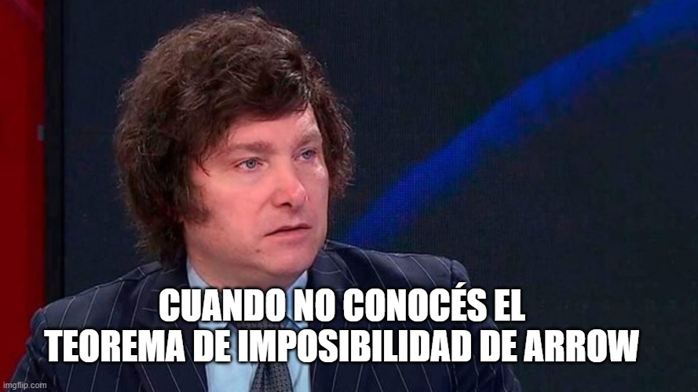

## Teorema de la Imposibilidad

-   Dados:
    -   Un conjunto de alternativas, $O$
    -   Un conjunto de individuos, $G$
    -   Una regla de decision social, $\succ$
-   Las preferencias de $i$ son "racionales" si son:
    -   **Completas** $\longrightarrow$ dadas dos alternativas
        , $A$ y $B$, c/individuo puede
        rankearlas/ordenarlas --i.e. $A \succ B$, $A=B$, o $B \succ A$.
    -   **Transitivas** $\longrightarrow$ dadas tres alternativas
        cualquiera, $A$, $B$ y $C$, si $A \succ B$ y $B \succ C$,
        entonces $A \succ C$

---

-   Dominio universal $\longrightarrow$ supone que los individuos tienen
    preferencias racionales sobre todas las alternativas del conjunto
    $O$
-   Optimalidad de Pareto $\longrightarrow$ si todo los individuos de
    $G$ prefieren $A$ a $B$, la regla de decision social debe preferir
    $A$ a $B$.
-   Independencia de alternativas irrelevantes $\longrightarrow$ si hay
    dos conjuntos de individuos, $G$ y $G'$ y en cada uno todos los
    individuos tienen el mismo orden de preferencia entre A y B, el
    ordenamiento social entre A y B debe ser el mismo independientemente
    de las preferencias por otra alternativa C.
-   No dictadura $\longrightarrow$ ningun individuo de G tal que sus
    preferencias determinen el orden social independientemente de los
    otros.

---

> **Teorema de la imposibilidad de Arrow.** No existe una funcion de
ordenamiento social $\succ$ tal que para cualquier grupo G cuyos
miembros tengan todos preferencias racionales, $\succ$ sea un
ordenamiento racional (transitivo) y que satisfaga los cuatros supuestos
de dominio universal, optimalidad de Pareto, independencia de
alternativas irrelevantes y no dictadura.

-   Houston, tenemos un problema! $\longrightarrow$ los ciclos de
    Condorcet y el tema del poder de agenda representan problemas
    centrales y fundamentales para los que no hay una solucion general.
-   Si queremos una funcion de ordenamiento social que cumpla con todas
    esas propiedades, no sera transitiva $\longrightarrow$ habra ciclos.

---

-   Es dificil relajar cualquiera de los supuestos de optimalidad de
    Pareto, independencia de alternativas irrelevantes y de no dictador
    sin caer en injusticias
-   La condicion del dominio universal, sin embargo, puede ser relajada
    ya que no es una condicion de equidad, sensatez o adecuacion; es un
    requisito de dominio.
-   Este es un requisito sumamente restrictivo ya que exige que el
    mecanismo de decision colectivo funcione en todos los ambitos
    imaginables (dominio mas amplio posible).
-   ¿Que pasa si restringimos el dominio? (menos generalidad)

## Tipos de preferencias

-   Cuestion del aborto en EEUU $\longrightarrow$ polarizacion
    -   Provida (V) $\longrightarrow$ prohibir aborto totalmente
    -   Proeleccion (E) $\longrightarrow$ derecho absoluto a
        elegir
    -   Roe-Wade (R) $\longrightarrow$ aborto en etapa temprana
-   ¿Cuales son las preferencias de los grupos?
    -   $V \succ R \succ E$ (provida)
    -   $E \succ R \succ V$ (proeleccion)
    -   $R \succ V \succ E$ (roe-wade1)
    -   $R \succ E \succ V$ (roe-wade2)
-   Ninguno de los grupos considera a $R$ como la peor alternativa
    $\longrightarrow$ ¿consenso?

---

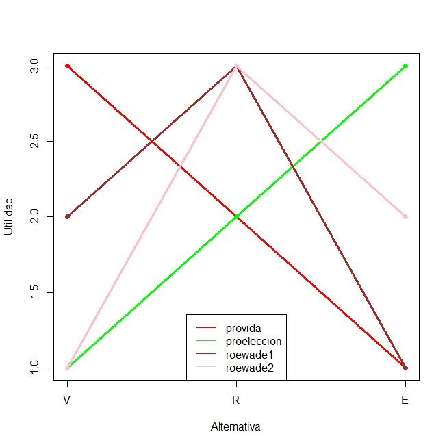

---

> **Teorema del pico unico.** Considerese un conjunto $O$ de alternativas del
cual un grupo $G$ de individuos debe escoger una. Si, por cada
subconjunto de tres alternativas de $O$, y para cada miembro del grupo,
una de estas alternativas **nunca** es la peor de las tres, entonces el
consenso es lo suficientemente generalizado como para que el metodo de
la regla de la mayoria produzca preferencias de grupo que sean
transitivas

-   Implicancia fundamental $\longrightarrow$ aun cuando los miembros
    del grupo tengan puntos de vista **muy diferentes** sobre lo que el
    grupo deberia hacer, la **regla de la mayoria funciona a la
    perfeccion** siempre y cuando se obtenga un grado minimo de consenso
    (captado mediante una curva de pico unico).

---

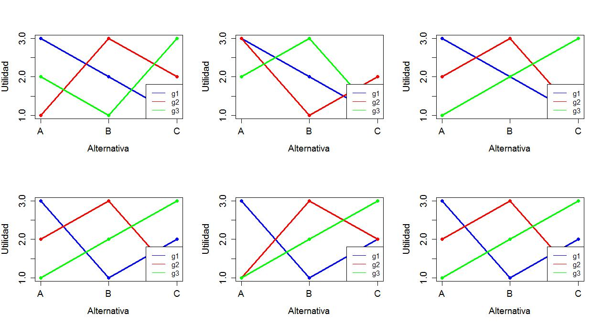

---

-   Si las preferencias de todos los $i$ son de pico unico,
    entonces la regla de la mayoria produce una agregacion de
    preferencias individuales a sociales que cumple todas las
    condiciones de Arrow y es transitiva.
-   ¿Es razonable restringir las preferencias de este modo?. Considere
    lo siguiente:

    > Suponga que hay 3 partidos: izquierda
    (I), centro (C), y derecha (D). El individuo 1 se identifica con I.
    Si puede ordenar sus preferencias por todas,
    puede que sean $I \succ C
    \succ D$. El individuo 2 se identifica con D. Haciendo lo mismo que
    uno, tendra $D \succ C \succ I$. Y el de centro podra tener $C \succ
    \ D \succ I$ o $C \succ I \succ D$.

---

-   Pueden pensarse las preferencias de ciudadanos por diferentes
    asuntos:
    -   Preferencias escala ideologica liberalismo-conservadurismo
    -   Preferencias por tasa impositiva y gasto publico en educacion
    -   Preferencias por localizacion de bien publico (plaza)
    -   Preferencias por arancel a importacion
-   En cualquier caso, una funcion de utilidad que describe preferencias
    de tipo unico es del tipo ($b_i$ es el punto ideal del individuo
    $i$):

$$\begin{aligned}
u_i=-(g-b_i)^2  \\
u_i=1-\lvert g-b_i \rvert\end{aligned}$$

---

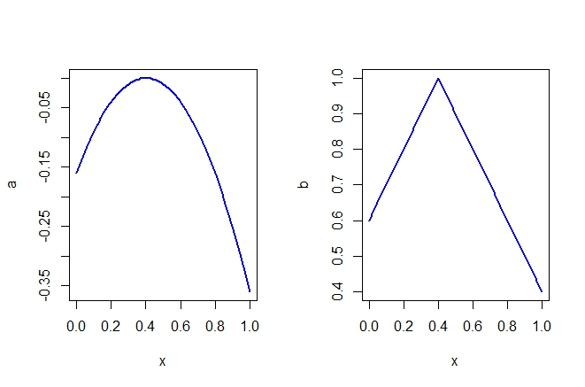

---

-   Se ha criticado la restriccion de las preferencias a las de pico
    unico sobre la base de que no aplican a muchas situaciones
    economicas y politicas
-   En realidad, muchos de los problemas economicos que nos importan
    --alicuotas impositivas; tamaño del gobierno; gasto en defensa;
    localizacion de un bien publico- son variables continuas que pueden
    ser adecuadamente modeladas con preferencias de pico unico.
-   En cambio, el problema se presenta con elecciones entre cosas que no
    tienen un orden dado --que banda deberia tocar en un evento de fin
    de curso; de que color pintar las aulas; preferencia por estrellas
    de cine, etc.

## Preferencias espaciales 

-   Problema $\longrightarrow$ escoger un punto de una linea.

> **Problema del directorio.** La junta de directores del BCRA deben adoptar
una decision sobre la tasa de interes interbancaria. Las tasas de
interes, en cuanto numeros, son en efecto puntos de una linea: el
extremo inferior es 0%, el extremo superior 10%, es decir la linea se
traza para el intervalo \[0,10\]. Supongamos que hay 5 (cinco)
directores y que cada uno tiene un punto de esa linea (tasa) que es el
que mas desea y luego sus preferencias disminuyen a medida que se alejan
de ese punto en cualquier direccion

---

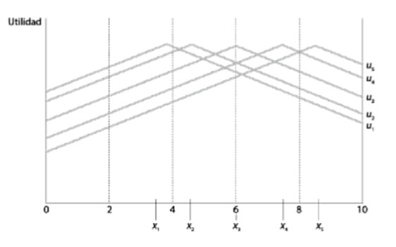

---

-   Las cinco personas, $G={1,2,3,4,5}$ tienen las preferencias
    mostradas en el grafico anterior y representadas como
    $x={x_1,x_2,x_3,x_4,x_5}$.
-   Cada individuo tiene un punto favorito $\longrightarrow$ "punto
    ideal". Esa es la tasa de interes que el/ella prefiere en primer
    lugar. Por ejemplo, para el director 1:
    -   $x_1 \succ x_2 \succ x_3 \succ x_4 \succ x_5$
-   Las preferencias se "miden" a partir de la utilidad --i.e. la altura
    de la curva; cada una de las "campanas" es una funcion de utilidad
    para cada director.

---

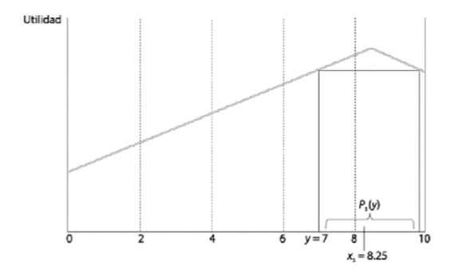

---

-   Tomemos ahora solamente al individuo 5. Su perfil de preferencias es
    $x_5 \succ x_4 \succ x_3 \succ x_2 \succ x_1$. Su tasa de interes
    favorita (punto ideal) es de $8.25$.
-   Tomemos una tasa cualquiera --i.e. $7$. El conjunto de puntos
    (tasas) que este individuo prefiere a $7$ es el que se representa
    como $P_5(y)$: ese conjunto contiene a todas las tasas de interes
    entre 7 y 9.25 \[¿Por que?\]
-   En otras palabras, si la tasa $y$ fuera una propuesta concreta, este
    individuo preferia todos los puntos del conjunto $P_5(y)$ a $y$.

---

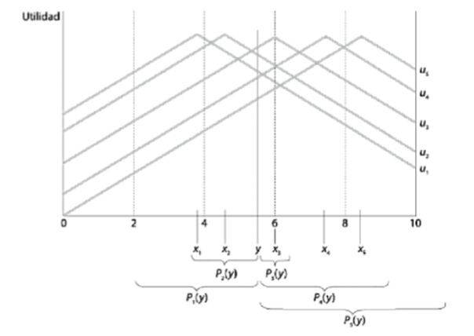

---

-   Ahora mostramos los "conjuntos preferidos a $y$" de todos los
    directores (note que $y$ esta un poco abajo de $6$). Puede verse superposicion:
    -   $P_4(y)$ y $P_5(y)$ tienen puntos en comun
    -   $P_1(y)$ y $P_2(y)$ tienen puntos en comun
    -   Los individuos 3, 4 y 5 tienen conjuntos preferidos a $y$ que se
        superponen; estos tres individuos forman una mayoria --3 contra
        2, por lo que esa mayoria vence a una propuesta como $y$.
-   Asi, se tienen todas las mayorias posibles que vencen a $y$
    dependiendo de donde este $y$ en la escala.
-   Puede ahora mostrarse todas las coaliciones de mayorias posibles que
    vencen a $y$.

## Preferencias y coaliciones

   Tamaño coalicion  Coalicion
  ------------------ ---------------------------------------------------------------------------------
          3          (1,2,3) (1,2,4) (1,2,5) (1,3,4) (1,3,5) (1,4,5) (2,3,4) (2,3,5) (2,4,5) (3,4,5)
          4          (1,2,3,4) (1,2,3,5) (1,2,4,5) (1,3,4,5) (2,3,4,5)
          5          (1,2,3,4,5)

  : Coaliciones de mayorias

## El rol del mediano

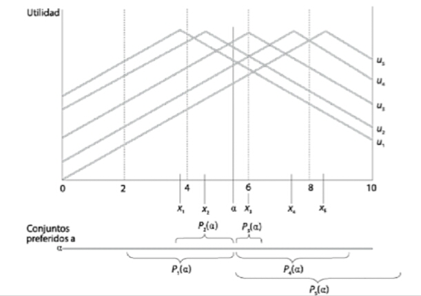

---

> **Teorema del votante mediano.** Si los miembros de un grupo $G$ tienen
preferencias de pico unico, luego el punto ideal del votante mediano es
un ganador de Condorcet.

-   En nuestro ejemplo este seria $x_3$. Suponga el punto $\alpha$ a la
    izquierda de $x_3$. Los miembros 1 y 2 prefieren $\alpha$ pero 3, 4
    y 5 prefieren $x_3$ a $\alpha$. $x_3$.
-   Suponga ahora un punto $\beta$ a la derecha de $x_3$. Los miembros 4
    y 5 pueden preferirlo a $x_3$ pero los miembros 1, 2 y 3 prefieren
    $x_3$ a $\alpha$.
-   $x_3$ vence a todos los puntos restantes. El punto ideal del votante
    mediano no es vencido por ninguno y esta es la decision de la
    mayoria.

---

-   El teorema postula que existe un unico ganador por mayoria y que ese
    ganador es el votante mediano --aquel votante en el medio de la
    distribucion en relacion a la dimension explorada
-   Uno de los resultados mas importantes en la teoria
    de la votacion $\longrightarrow$ postula una convergencia a las
    preferencias del votante mediano.
    -   La mejor forma de obtener la mayoria de los votos es acercarse a
        las preferencias del votante mediano.
-   El TVM no es aplicable a situaciones de mas de dos dimensiones de
    las preferencias $\longrightarrow$ originan ciclos tambien.
-   Tambien el TVM supone que a los politicos solo les importa ganar y
    no tienen preferencias por politica (mas sobre esto luego).

---

-   Note que la *intensidad de las preferencias* no importa para nada en
    este resultado.
    -   Puede que me desagrade mucho un candidato pero mi voto cuenta
        exactamente lo mismo que el de otra persona que es casi
        indiferente entre ese candidato y cualquier otro.
-   Se deriva del principio "una persona, un voto" $\longrightarrow$ una
    de las diferencias fundamentales entre las elecciones y las
    decisiones economicas
    -   Se puede relajar esto (volveremos mas adelante)
        $\longrightarrow$ costo de votar (registracion); contribuciones
        de campaña; influencia.

## TVM:Elegir nivel de gasto publico

> Suponga 5 (cinco) personas. Lucia prefiere 6000 pesos, Tomas 8000 pesos,
Jaime 10000 pesos, Juan 12000 pesos y Jorge 14000 pesos. Los podemos
ordenar en una escala segun su preferencia por bien publico. El votante
mediano es Jaime por lo que la opcion que gana es la de proveer 10000
pesos en bienes publicos. ¿Por que? Suponga que se decide entre
cualquier gasto menor a 10000 y 10000. Jaime, Juan y Jorge elegiran
10000 antes que un gasto menor a 10000. Si ahora se decide entre
cualquier gasto mayor a 10000 y 10000, Jaime y todos los que quieran
gastar menos de 10000 pesos, preferiran 10000 antes que una gasto mayor
a 10000. La alternativa ganadora es siempre 10000 pesos.

## Supuestos restrictivos del TVM

-   Estos ejemplos y razonamientos se basan en 3 (tres) supuestos
    implicitos:
    -   Numero impar de miembros $\longrightarrow$ el mediano es el que
        esta siempre en el medio de la distribucion (espacial). Si fuera par (4), tanto 2 y 3 son
        medianas $\longrightarrow$ hay GdC pero no
        serian unicos.
    -   Participacion total $\longrightarrow$ todos votan. No siempre
        pasa en la practica (abstenciones, ausencias, etc).
    -   Voto sincero $\longrightarrow$ si las personas no votan de
        acuerdo a sus preferencias (voto sincero), entonces existe voto
        estrategico. 

---

-   Algunas de las principales limitaciones de este tipo de modelos son:
    -   Son modelos de decision colectiva **unidimensionales**.
        Muchisimas situaciones sociales en que la cuestion no puede
        reducirse a una sola dimension.
    -   Voto a presidente/gobernador $\longrightarrow$ dimension
        economica y dimension social.
    -   Eleccion en concursos de cantantes, belleza --i.e. varias
        dimensiones
-   Cuando se generaliza a mas de una dimension, el resultado del
    VM mucho mas restrictivo.
-   No da ningun rol a las instituciones politicas $\longrightarrow$ se converge al mediano independientemente de instituciones

## Ejercitacion y practica

> **Ejercicio.** Suponga tres opciones de restaurant:

-   $A$ cuesta 5 dolares
-   $B$ cuesta 10 dolares
-   $C$ cuesta 20 dolares

Hay tres personas $G={1,2,3}$. La persona 1 prefiere $A$; la persona 2
prefiere $B$ y la persona 3 prefiere $C$.

-   ¿Que implican las preferencias de pico unico en este caso?
-   ¿Que restaurante es elegido? ¿Por que?
