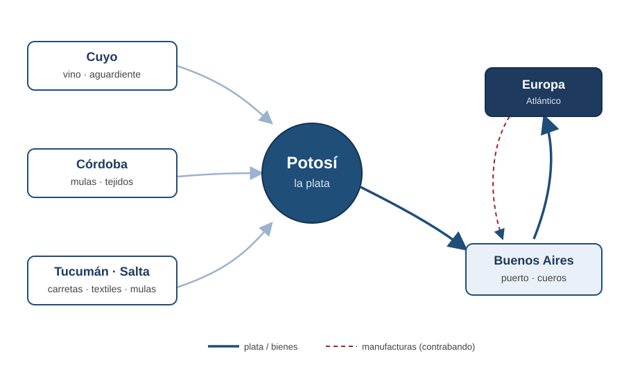
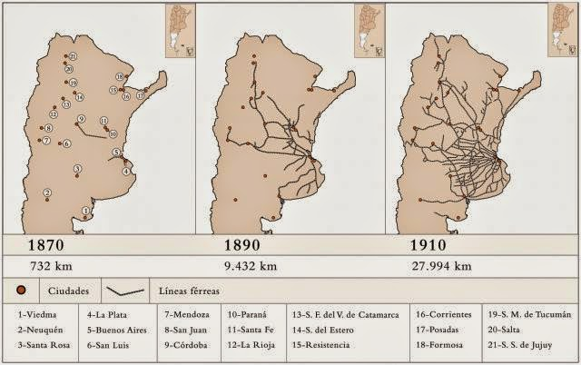
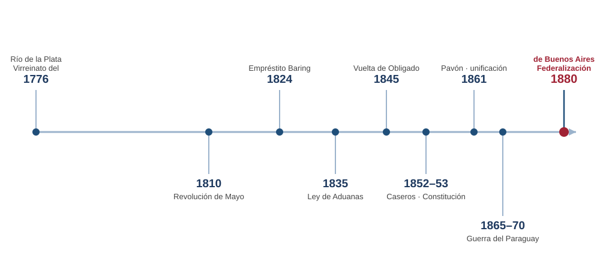

# Apertura y hoja de ruta {background="#1f3a5f"}

## Por qué esta clase

- El curso arranca en **1880**… pero 1880 **no cae del cielo**.
- Es el **punto de llegada** de un siglo de fragmentación, guerra y ensayos institucionales fallidos.
- Antes de estudiar el modelo agroexportador, necesitamos entender **de dónde venimos**.

::: {.callout-tip icon=false title="Idea clave"}
Los años **1776–1880** dejan una herencia —monetaria, económica, política e institucional— sin la cual no se entiende lo que viene.
:::

## Dos fotos, setenta años

::: {.columns}
::: {.column width="50%"}
::: {.callout-note icon=false title="Hacia 1810"}
Periferia del imperio español. Una economía organizada en torno a **la plata de Potosí**. Población: unos **pocos cientos de miles**.
:::
:::
::: {.column width="50%"}
::: {.callout-important icon=false title="Hacia 1880"}
Estado nacional unificado, frontera en expansión y puerto listo: a las puertas del **"granero del mundo"**.
:::
:::
:::

**¿Qué pasó en el medio?** Esa es la historia de hoy.

## La pregunta de la clase

> Si la economía se moderniza y el territorio se organiza, ¿por qué el camino **1810–1880** fue tan largo, conflictivo e inestable?

## Mapa de la clase

1. **Bloque 1 — La herencia colonial** (1776–1810).
2. **Bloque 2 — Revolución, guerra y desintegración** (1810–1820).
3. **Bloque 3 — La primera experiencia monetaria e institucional** (1820s).
4. **Bloque 4 — Rosas, el federalismo y la ganadería** (1829–1852).
5. **Bloque 5 — Del país dividido al Estado nacional** (1852–1880).

# Bloque 1. La herencia colonial (1776–1810) {background="#1f3a5f"}

## [1.1] El Virreinato del Río de la Plata (1776)

- En **1776** la Corona crea el **Virreinato del Río de la Plata**, con capital en **Buenos Aires**.
- Es parte de las **reformas borbónicas**: modernizar la administración y **capturar** para la Corona el comercio (y la plata) que se escapaba por el contrabando.

::: {.callout-note icon=false title="Reformas borbónicas"}
Reorganización imperial del siglo XVIII: más control fiscal, nuevas aduanas y jerarquías administrativas.
:::

## [1.2] Buenos Aires: puerto y contrabando

- Buenos Aires era, ante todo, un **puerto**: su ventaja no era producir, sino **comerciar** (legal e ilegalmente).
- El **Reglamento de Libre Comercio (1778)** habilitó el comercio directo con España y **legalizó** buena parte del tráfico atlántico.

::: {.callout-important icon=false title="Una ciudad de comerciantes"}
La riqueza porteña nace del **intercambio**, no de la tierra: una marca que atravesará todo el siglo XIX.
:::

## [1.3] El eje del sistema: la plata de Potosí

{fig-align="center" width="66%"}

::: {.fuente}
Esquema propio sobre el concepto de "espacio económico peruano" de Assadourian (1982).
:::

## [1.4] Las economías regionales

- El **interior** era **artesanal y productivo**: Cuyo (vino), Córdoba (mulas, tejidos), Tucumán/Salta (carretas, textiles) — todo orientado al **mercado de Potosí**.
- El **litoral** era **ganadero**: cueros y, más tarde, tasajo.

::: {.callout-tip icon=false title="Idea clave"}
El interior **dependía** del mercado altoperuano. Si ese mercado desaparece, su economía se queda **sin destino**.
:::

# Bloque 2. Revolución, guerra y desintegración (1810–1820) {background="#1f3a5f"}

## [2.1] La Revolución de Mayo (1810)

- El **25 de mayo de 1810** se inicia el proceso revolucionario en Buenos Aires.
- Pero la independencia no fue un acto: fue **una década de guerras** que consumió recursos, hombres y estabilidad.

## [2.2] La ruptura del espacio económico

- La guerra corta el acceso al **Alto Perú**: se pierde **Potosí** y, con él, **el circuito de la plata**.
- El sistema económico colonial —que giraba en torno a esa plata— **se desarticula**.

::: {.callout-important icon=false title="El golpe al interior"}
Sin el mercado de Potosí, las economías regionales del interior pierden su razón de ser: empieza su **larga decadencia** relativa.
:::

## [2.3] Guerra y finanzas

> La guerra fue permanente, y financiarla se volvió el problema central del nuevo poder. En la Buenos Aires posrevolucionaria, la **aduana del puerto** pasó a ser la gran fuente de recursos fiscales: quien controlara el puerto y su aduana, controlaba el Estado en formación.

::: {.fuente}
Síntesis de Halperín Donghi (1982), *Guerra y finanzas en los orígenes del Estado argentino*.
:::

## [2.4] Ganadores, perdedores y el vacío de 1820

- **Gana** el litoral y el **puerto**: la aduana crece, el comercio atlántico se reorienta.
- **Pierde** el interior artesanal, ahora expuesto a las **manufacturas importadas**.
- En **1820** se disuelve el poder central: comienza la etapa de **autonomías provinciales** y caudillos ("la anarquía").

# Bloque 3. La primera experiencia monetaria e institucional (1820s) {background="#1f3a5f"}

## [3.1] La "Feliz Experiencia" rivadaviana

- En la **provincia de Buenos Aires** (1820–1827), **Rivadavia** impulsa un ambicioso programa de **modernización**: banco, crédito, tierras, reforma administrativa.
- Es el primer gran ensayo de **construir instituciones económicas modernas**… con final abrupto.

## [3.2] El primer papel y la primera deuda

- **Banco de Descuentos (1822) → Banco Nacional (1826):** emite papel que arranca convertible pero, **sin respaldo metálico**, se declara **inconvertible y de curso forzoso desde 1826**.
- **Empréstito Baring Brothers (1824):** nominal de **£1.000.000**; Buenos Aires recibió **~£560.000** netos.

::: {.callout-important icon=false title="Una herencia que perdura"}
La deuda con Baring entró en **default en 1828** y no se saldó hasta **1842** (y del todo, décadas después). La moneda argentina **nace inconvertible**.
:::

## [3.3] La tierra: la enfiteusis

- Ante la falta de recursos, el Estado no vende la tierra pública: la **entrega en enfiteusis** (una especie de arriendo enfitéutico).
- Resultado: la tierra se concentra en **pocas manos**, sin generar los ingresos fiscales esperados.

## [3.4] El fracaso del proyecto unitario {.tight}

- La **Constitución de 1826** (unitaria) es **rechazada** por las provincias.
- La **guerra con Brasil (1825–1828)** agrava la crisis fiscal y monetaria.
- Rivadavia **renuncia en 1827**: el proyecto centralizador se derrumba.

::: {.callout-tip icon=false title="Idea clave"}
La pregunta de fondo ya está planteada: **¿unitarios o federales?** — y detrás de ella, **quién controla la aduana y el puerto**.
:::

# Bloque 4. Rosas, el federalismo y la ganadería (1829–1852) {background="#1f3a5f"}

## [4.1] Rosas y la Confederación

- **Juan Manuel de Rosas** gobierna Buenos Aires (1829–1832 y **1835–1852**) como eje de la **Confederación Argentina**.
- Federalismo en lo político… pero Buenos Aires **conserva el monopolio de la aduana** y el manejo de las relaciones exteriores.

## [4.2] Librecambio vs. proteccionismo

- El interior reclamaba **protección** frente a las manufacturas inglesas; Buenos Aires vivía del **librecambio**.
- La **Ley de Aduanas (18 dic 1835)** concede parte del reclamo: aranceles del **35–50%** y prohibiciones a ciertos productos.

::: {.callout-note icon=false title="Ley de Aduanas de 1835"}
Protege industrias del interior (vinos, textiles, **ponchos** frente a los ingleses). Pedro **Ferré** (Corrientes) había liderado el reclamo proteccionista.
:::

## [4.3] El corazón económico: la ganadería

- La economía de Buenos Aires se apoya en la **estancia** y el **saladero**: **cueros** y **tasajo** (carne salada) son las exportaciones dominantes.
- Es una economía **extensiva**: mucha tierra, poca mano de obra, orientada al mercado externo.

## [4.4] Moneda y bloqueos

- El **peso papel** se deprecia de forma crónica: financiar guerra y gasto con **emisión** tiene su precio.
- Los **bloqueos** navales golpean la aduana: **bloqueo francés (1838)** y **anglo-francés (1845)**, con el episodio de la **Vuelta de Obligado** (20 nov 1845).

## [4.5] La economía política del federalismo

> El conflicto entre Buenos Aires y el interior no era solo ideológico. En el fondo se disputaban dos recursos concretos: **la renta de la aduana** del puerto y **la libre navegación de los ríos**. Quien los controlara, controlaba el futuro económico del país.

::: {.fuente}
Tesis clásica de Burgin (1946), *The Economic Aspects of Argentine Federalism*.
:::

# Bloque 5. Del país dividido al Estado nacional (1852–1880) {background="#1f3a5f"}

## [5.1] Caseros y la Constitución de 1853

- En **Caseros (3 feb 1852)**, **Urquiza** derrota a Rosas.
- La **Constitución de 1853** organiza una república federal… pero **sin Buenos Aires**.

## [5.2] La secesión y la reunificación

- **Buenos Aires se separa** de la Confederación (1852–1861): la Confederación gobierna desde **Paraná**, **sin la aduana porteña** —y por eso, **fiscalmente asfixiada**—.
- En **Pavón (1861)**, **Mitre** se impone y **reunifica** el país bajo el liderazgo porteño.

## [5.3] La organización nacional

- Presidencias fundadoras: **Mitre (1862–68) · Sarmiento (1868–74) · Avellaneda (1874–80)**.
- Se construye el Estado: ejército, justicia, educación, estadísticas… pero **la moneda sigue fragmentada** (el peso del **Banco de la Provincia de Buenos Aires**, el peso fuerte y monedas extranjeras conviven).

## [5.4] El despegue material: la fiebre del lanar

- Entre 1850 y 1880, la **oveja** desplaza al vacuno en la pampa: hacia **1865 la lana es la principal exportación** del país.
- **Lana + cueros ≈ 50%** de las exportaciones; **~50 millones de ovejas** en los años 1870.

::: {.callout-important icon=false title="La antesala del boom"}
La "fiebre del lanar" (Sábato) **capitaliza** al campo y **conecta** a la pampa con el mercado mundial: es el ensayo previo al modelo agroexportador.
:::

## [5.5] Ferrocarriles e integración

{fig-align="center" width="52%"}

::: {.fuente}
Primer ferrocarril: **1857** (Ferrocarril Oeste, locomotora *La Porteña*). Hacia 1880, ~2.500 km de vías, con fuerte capital británico.
:::

## [5.6] Guerra, crisis y frontera

- **Guerra del Paraguay / Triple Alianza (1865–1870):** costosa en vidas y en finanzas para el Estado en formación.
- **Crisis financiera de 1873–76:** primer gran freno del ciclo, con salida de oro y tensión bancaria.
- **Conquista del Desierto (1878–79):** el Estado incorpora **~40 millones de hectáreas** a la frontera productiva.

## [5.7] 1880: se cierra el arco

- La **federalización de Buenos Aires (1880)** resuelve la vieja disputa: la ciudad-puerto pasa a ser **capital nacional** y la **aduana** queda en manos del Estado.
- Poco después, la **Ley 1130 (1881)** crea el **peso moneda nacional** y **unifica** por fin la moneda.

::: {.callout-tip icon=false title="Idea clave"}
Recién en 1880 coinciden **Estado unificado + aduana nacional + moneda única + frontera abierta**: las condiciones del modelo agroexportador.
:::

# Cierre {background="#1f3a5f"}

## El arco 1776–1880 de un vistazo

{fig-align="center" width="88%"}

## Ideas fuerza {.tight}

1. El espacio colonial giraba en torno a **Potosí**; al perderse, el **interior se rezagó**.
2. La moneda **nació inestable e inconvertible** (Banco Nacional 1826, default Baring 1828).
3. El conflicto **Buenos Aires–provincias** fue, en el fondo, por **la aduana y los ríos**.
4. La **ganadería** (cuero → tasajo → lana) puso las **bases materiales** del despegue.
5. Recién hacia **1880** se consolida el **Estado nacional** que hace posible lo que viene.

## Puente a la Clase 01

- En **1880**, con Estado unificado, aduana nacionalizada, moneda en camino a unificarse y frontera en expansión, empieza el **modelo agroexportador**.
- La próxima clase arranca **exactamente ahí**: 1880 y la Teoría del Bien Primario Exportable.

## Bibliografía de la clase {.tight}

**Obligatoria**

- **Gerchunoff y Llach (2007).** *El ciclo de la ilusión y el desencanto*, **cap. 1**.

**Complementaria**

::: {.columns}
::: {.column width="50%"}
- **Halperín Donghi, T. (1982).** *Guerra y finanzas en los orígenes del Estado argentino*.
- **Burgin, M. (1946).** *The Economic Aspects of Argentine Federalism, 1820–1852*.
:::
::: {.column width="50%"}
- **Sábato, H. (1989).** *La fiebre del lanar, 1850–1890*.
- **Cortés Conde, R. (1997).** *La economía argentina en el largo plazo*.
:::
:::

::: {.fuente}
Otras referencias del período, en el material de la cátedra.
:::

<!--
Notas de uso (no proyectar):
- Clase 00 = contexto pre-1880 (la clase también incluye presentación del programa, aparte).
- Peso en 1810–1880; sección colonial deliberadamente liviana.
- Cuatro hilos entrelazados: monetario / BA vs provincias / actividades económicas / institucional.
- Figuras self-contained: 2 SVG hand-built (espacio-economico-colonial, cronologia-1776-1880)
  + mapa FFCC existente. Se pueden sumar imágenes PD (retratos, saladeros, Vuelta de Obligado)
  más adelante, con crédito en .fuente.
- Datos verificados (búsqueda 2026-08-03) en lec-00-outline.md. Cifras con cautela:
  población 1810 (cualitativa), km FFCC 1880 (~2.500 prudente), % lana+cueros (~50%).
- Block quotes (sin cursiva): guerra y finanzas (Halperín); aduana y río (Burgin).
- Puente exacto a lec-01: 1880 + Ley 1130 (1881) moneda única.
- Overflow: verificar con `node _check-overflow.mjs lec-00-*.html`; .tight/.smaller si hace falta.
-->
