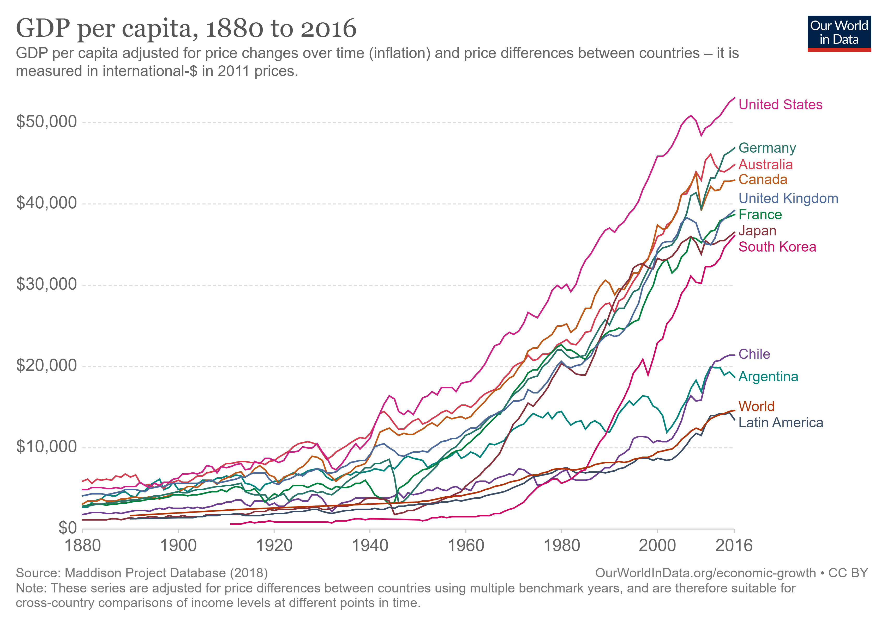
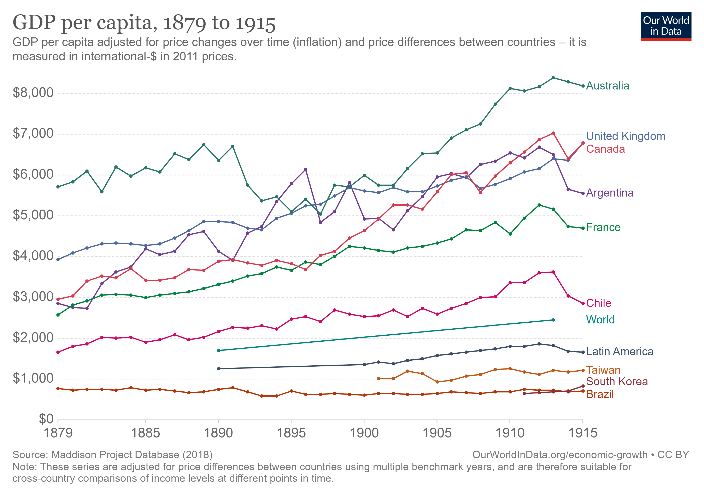
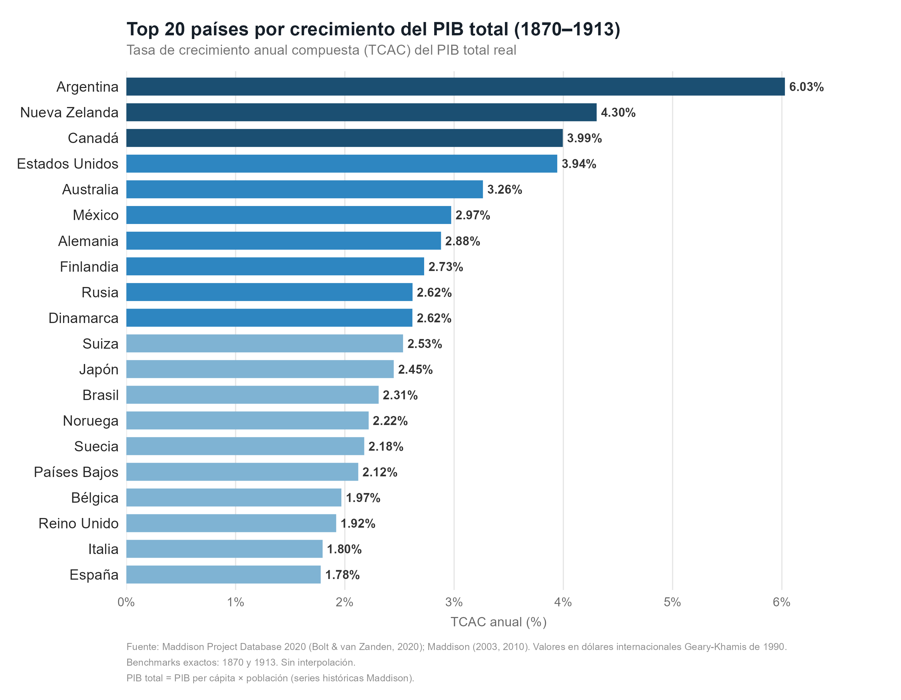
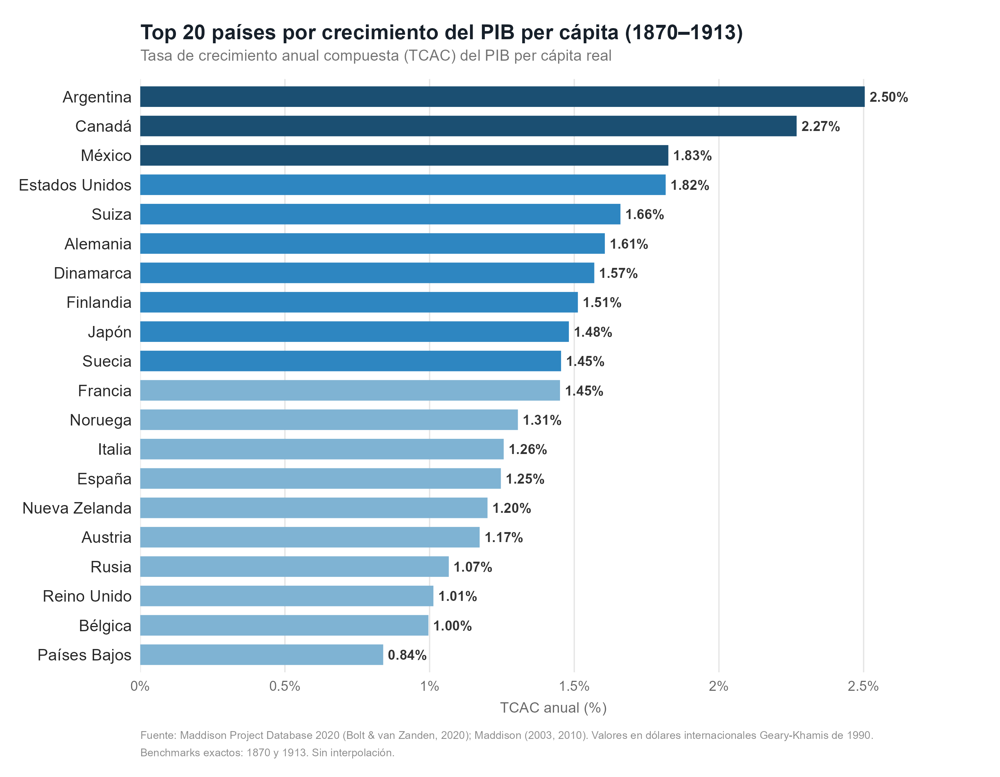
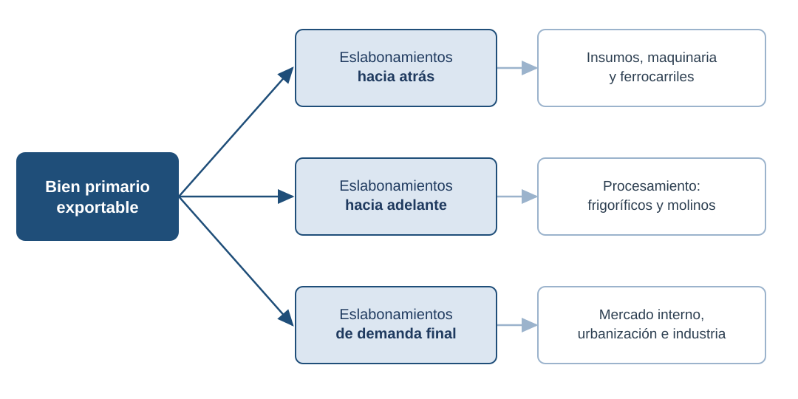

# Apertura y hoja de ruta {background="#1f3a5f"}

## ¿De qué se trata este curso?

- Vamos a recorrer **un siglo de economía argentina**: de la consolidación del Estado Nacional (1880) a las reformas de los años 90.
- El eje no son los datos sueltos: son las **políticas económicas y sus resultados**, leídos con teoría económica.
- El hilo conductor: el **"ciclo de la ilusión y el desencanto"** (Gerchunoff y Llach) — auges que prometen convergencia y crisis que la frustran.

## ¿Qué hace la historia económica?

No narra el pasado por el pasado: **usa la teoría económica para explicarlo**.

> Analizar la evolución de la economía argentina desde la consolidación del Estado Nacional en 1880 hasta la década de 1990 (…). El énfasis estará puesto en el examen de las **políticas económicas aplicadas y los resultados alcanzados**.

## Cómo trabajar el material

::: {.callout-important icon=false title="Una advertencia de la cátedra"}
Las clases y las diapositivas son un **esqueleto mínimo**: sirven para ordenar la lectura, no para reemplazarla. La bibliografía es abundante y exige leerla.
:::

- Cada clase abre una **pregunta analítica** y la responde con teoría + evidencia.
- El número de clase indica **orden de estudio**, no fecha de calendario.

## Argentina, ¿país rico?

{fig-align="center" width="66%"}

::: {.fuente}
Fuente: Maddison Project Database (2018), vía Our World in Data.
:::

## La pregunta del curso

> Hacia 1900, Argentina estaba entre los países más ricos del mundo.
> Un siglo después, no. **¿Qué pasó?**

- Antes de explicar la decadencia, hay que entender el **éxito**.
- En Europa se decía **"rico como un argentino"**.

## El país del futuro

::: {.meme}

[«Rico como un argentino», decían en 1913]{.meme-top}
[Spoiler: no termina bien]{.meme-bottom}
:::

## Mapa de la clase

1. **Bloque 1 — El punto de partida:** el mundo y la Argentina de 1880.
2. **Bloque 2 — La teoría del bien primario exportable (BPE):** el marco para entender el auge.
3. **Bloque 3 — El BPE argentino:** qué exportó el país y por qué, de la vaca al cereal.

# Bloque 1. El punto de partida: 1880 {background="#1f3a5f"}

## [1.1] Coordenadas de 1880

- **Política:** consolidación del Estado Nacional; "orden y progreso"; se cierra el ciclo de las guerras civiles.
- **Mundo:** la *primera globalización* — caen los costos de transporte y circulan libremente **bienes, capitales y personas**.
- **Rol asignado:** Argentina se inserta como **proveedora de bienes primarios** para los mercados industriales, sobre todo el Reino Unido.

## [1.2] De Roca a Sáenz Peña {.tight}

- El período lo gobierna el **Partido Autonomista Nacional (PAN)**: la "generación del 80", liberal en lo económico y restrictiva en lo político.
- **Roca (1880)** inaugura el orden conservador; la **Campaña del Desierto** incorpora tierra y fija la frontera productiva.
- La **Ley Sáenz Peña (1912)** —voto secreto y obligatorio— abre el juego político hacia el final del ciclo.

::: {.callout-important icon=false title="Para tener presente"}
El auge agroexportador ocurre bajo un régimen político **estable pero de participación restringida**: el "orden" es condición del "progreso".
:::

## [1.3] La primera globalización

- Entre 1880 y 1914 el comercio mundial y los movimientos de **capital y población** crecen a un ritmo inédito.
- El comercio bilateral de 1910 encaja con el patrón de la **ventaja comparativa clásica**: los países industriales exportan manufacturas e importan primarios.

::: {.callout-tip icon=false title="Idea clave"}
El orden internacional **premiaba** a quien pudiera exportar bienes primarios. Argentina estaba en el lugar indicado, en el momento indicado.
:::

## [1.4] Argentina en la belle époque

Entre las economías de mayor ingreso, Argentina se ubicaba **cerca de Canadá y el Reino Unido**:

{fig-align="center" width="58%"}

::: {.fuente}
Fuente: Maddison Project Database (2018), vía Our World in Data.
:::

## [1.5] La pregunta guía

- El crecimiento fue **rápido y sostenido**: cerca de **2,5% anual per cápita**, de los más altos del mundo.
- Un relato no alcanza: necesitamos un **marco teórico** para entender de dónde salió ese crecimiento.

## [1.5] La pregunta guía (cont.)

{fig-align="center" width="65%"}

::: {.fuente}
Fuente: Maddison Project Database (2018), vía Our World in Data.
:::

## [1.5] La pregunta guía (cont.)

{fig-align="center" width="65%"}

::: {.fuente}
Fuente: Maddison Project Database (2018), vía Our World in Data.
:::

# Bloque 2. La teoría del bien primario exportable {background="#1f3a5f"}

## [2.1] La teoría del BPE

- Es una **teoría del crecimiento**: la exportación de un bien primario dispara la expansión del resto de la economía.
- El motor inicial es el **factor abundante**: en la Argentina de fin de siglo, la **tierra**.

::: {.callout-note icon=false title="Staple thesis"}
Atribuida a **Harold Innis**, explica el crecimiento de economías de *reciente asentamiento* —Canadá, Australia, Argentina— a partir de la exportación de un recurso natural abundante (el *staple*). Aplicada al país por North, Cortés Conde y otros.
::: 

## [2.2] Los tres supuestos

::: {.columns}
::: {.column width="33%"}
::: {.callout-note icon=false title="1. Espacio vacío"}
País "nuevo": relación **tierra/trabajo** y **tierra/capital** muy altas.
:::
:::
::: {.column width="33%"}
::: {.callout-note icon=false title="2. Dotación específica"}
Los recursos permiten **absorber** el crecimiento exportador y moldean la estructura y la **distribución del ingreso**.
:::
:::
::: {.column width="33%"}
::: {.callout-note icon=false title="3. Sin trabas"}
No hay **restricciones institucionales** ni tradiciones que frenen el uso de recursos y tecnología.
:::
:::
:::

## [2.3] La dinámica: un sector líder

> El argumento básico de la *staple theory* es que los bienes primarios exportables son el **sector líder** de la economía y marcan el camino del crecimiento. El limitado —al principio posiblemente inexistente— mercado interno y la relativa **abundancia de tierras** respecto del capital y el trabajo crea una ventaja comparativa favorable a las exportaciones primarias. El desarrollo será un proceso de **diversificación en torno a una base exportadora**.

::: {.fuente}
Watkins (1963), en Gallo (1998).
:::

## [2.4] ¿Qué bien exportar?

La elección del bien primario está en función de:

1. **La coyuntura externa** → precios y demanda de los mercados centrales fijan rentabilidades diferenciales.
2. **La dotación de recursos naturales** → cuanto más diversificada, más chances de aprovechar los ciclos de precios.
3. **Dos condiciones para arrancar el ciclo:** una **tecnología de producción** disponible y **espíritu empresarial** que la ponga en marcha.

## [2.5] Los eslabonamientos

{fig-align="center" width="84%"}

::: {.small}
El crecimiento del sector exportador **arrastra** al resto de la economía por estos tres canales.
:::

## [2.6] Los tres canales, uno por uno

::: {.callout-note icon=false title="Hacia atrás"}
Inversión en los **insumos** del sector exportador: transporte, logística, bienes de capital.
:::

::: {.callout-note icon=false title="Hacia adelante"}
Inversión en industrias que usan el bien exportable **como insumo** (frigoríficos, molinos).
:::

::: {.callout-note icon=false title="De demanda final"}
Inversión en **bienes de consumo** para los factores empleados en el sector exportador.
:::

## [2.7] Chacra familiar vs. plantación

No da lo mismo **cómo** se produce el bien primario:

::: {.columns}
::: {.column width="50%"}
::: {.callout-tip icon=false title="Unidad agrícola familiar"}
Menos productiva por hectárea y más demandante de transporte → **eslabonamientos más fuertes** y un ingreso **más distribuido**.
:::
:::
::: {.column width="50%"}
::: {.callout-important icon=false title="Plantación"}
Más productiva y concentrada → eslabonamientos más débiles y una **distribución más desigual**.
:::
:::
:::

## [2.8] ¿Qué determina el ingreso?

- El **PBI total** depende del **tamaño absoluto** del sector exportador.
- El **PBI per cápita** depende de la **productividad** de los factores ligados al BPE.

::: {.callout-tip icon=false title="Idea clave"}
Los eslabonamientos de demanda final son mayores cuanto **más alto el ingreso medio y más equitativa su distribución**: sin equidad, se importan lujos y se produce subsistencia.
:::

# Bloque 3. El BPE argentino {background="#1f3a5f"}

## [3.1] Del modelo al caso argentino

- La teoría explica **por qué** un bien primario puede traccionar el crecimiento.
- Ahora la pregunta es empírica: **¿qué exportó la Argentina** y por qué fue cambiando?
- La respuesta es una **secuencia**: de la vaca a la oveja, y de la oveja al cereal y la carne refrigerada.

## [3.2] Del vacuno al ovino (1776–1860s)

- **1776–1860:** el exportable es el **ganado vacuno** → cuero, sebo y tasajo (carne salada): productos **no refinados** y de pocos eslabonamientos.
- **Década de 1860:** suben los precios internacionales de la **lana** y se consolida el Estado nacional → giro al **ganado ovino**, más intensivo en trabajo y con **más eslabonamientos**.

## [3.3] El gran cambio de 1880

- La coyuntura externa se vuelve **muy favorable**: crece la demanda internacional de **carne**.
- La **refrigeración** permite exportar carne enfriada y congelada (productos **refinados**), no ya salada.
- Hacia 1890 cambia la composición: cereales **26%**, lana **33%**, cueros **17%**. Entre **1900 y 1914**, cereales y carnes ya son el **54%** de las exportaciones.

## [3.4] La composición de las exportaciones {.smaller}

| Producto | 1825 | 1854 | 1863 | 1873 |
|----------|-----:|-----:|-----:|-----:|
| Cuero | 53,5 | 26,7 | 25,0 | 13,0 |
| Sebo y grasas | 32,0 | 26,7 | 21,4 | 17,4 |
| Tasajo | 9,3 | 20,0 | 10,7 | 8,7 |
| Lana | — | 20,0 | 35,7 | 45,7 |
| Piel de oveja | — | — | 3,6 | 10,9 |
| Otros | 5,2 | 6,6 | 1,8 | 4,3 |

::: {.fuente}
Participación en las exportaciones (%). Fuente: Gómez (2012). Se ve el desplazamiento del **vacuno** por el **ovino**.
:::

## [3.5] Lo que hizo posible el auge

El BPE argentino se apoyó en **tres factores** que la próxima clase veremos con datos:

::: {.columns}
::: {.column width="33%"}
::: {.callout-note icon=false title="Tierra"}
Abundante y barata; la Campaña del Desierto suma ~30 millones de hectáreas.
:::
:::
::: {.column width="33%"}
::: {.callout-note icon=false title="Capital"}
Inversión británica; el **ferrocarril** como forma dominante de capital.
:::
:::
::: {.column width="33%"}
::: {.callout-note icon=false title="Trabajo"}
**Inmigración masiva**, sobre todo de Italia y España.
:::
:::
:::

# Cierre {background="#1f3a5f"}

## Ideas fuerza {.tight}

1. La historia económica argentina se lee como un **ciclo de auges y desencantos**, no como una línea siempre ascendente.
2. Hacia 1900 Argentina era **rica en términos comparados**: hay que explicar ese éxito *antes* que la decadencia.
3. El **auge tiene un marco teórico**: el BPE, un bien primario que vía eslabonamientos arrastra al resto de la economía.

::: {.callout-tip icon=false title="La idea central"}
El bien exportable argentino **fue cambiando** —vaca, oveja, cereal— pero la lógica fue la misma: un sector líder traccionado desde afuera.
:::

## Preguntas para llevarse

- Si el modelo funcionó tan bien, **¿por qué era frágil?**
- ¿Qué implicaba que el crecimiento dependiera de **decisiones tomadas afuera** (precios, capitales, migración)?
- Actualidad: ¿en qué se parece —y en qué no— al debate exportador argentino de hoy?

## Bibliografía de la clase

**Obligatoria**

- **Gómez, M. (2012).** *El crecimiento económico argentino en el siglo XIX (1880–1914)*. Cátedra de Historia Económica Argentina, FCE-UNC. (Completo.)

**Complementaria**

- **Gerchunoff, P. y Llach, L. (2007).** *El ciclo de la ilusión y el desencanto. Un siglo de políticas económicas argentinas*. Buenos Aires: Ariel. **Cap. 1** ("A la sombra del ombú").

::: {.fuente}
La bibliografía completa por unidad está en el programa de la asignatura.
:::

<!--
Notas de uso (no proyectar):
- Layout minimalista: figuras/memes en diapositiva propia (antes/después del texto).
  Solo se combinan texto+figura cuando son mutuamente dependientes (lead breve
  ARRIBA de una figura centrada, nunca en dos columnas asimétricas).
- Marcadores [B.n] = bloque . diapositiva. Apertura y Cierre sin número.
- Callouts (icon=false): note=definición, tip=idea clave, important=curiosidad.
- División con lec-02: aquí queda la TEORÍA del BPE y la evolución del bien
  exportable (vaca->oveja->cereal). El detalle empírico de tierra/capital/trabajo,
  la industria y la urbanización van en lec-02 (solo se anticipan en [3.5]).
- Fuentes de los bloques nuevos: lect01.tex (supuestos, cita de Watkins,
  eslabonamientos, chacra vs plantación, evolución de exportables, tabla de
  composición) e intro.tex (objetivo general, advertencia sobre el material).
-->
