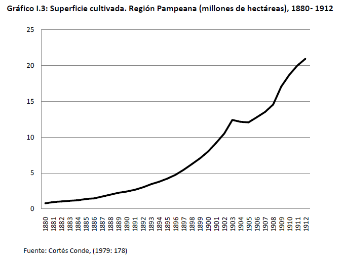
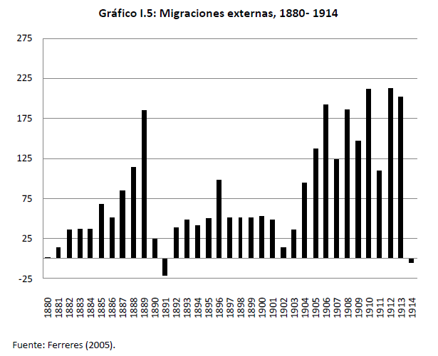
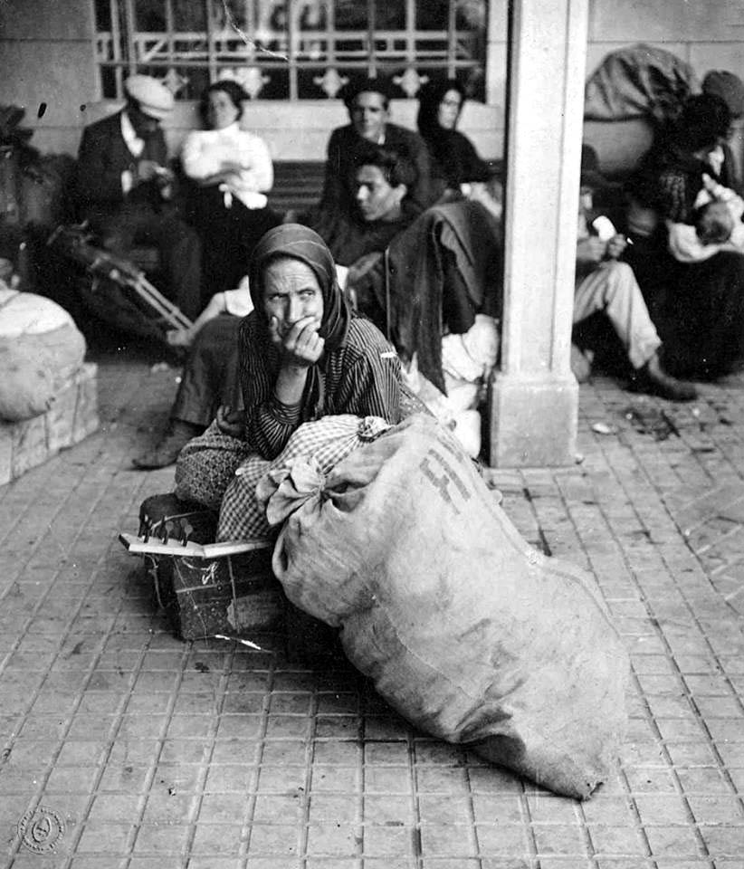
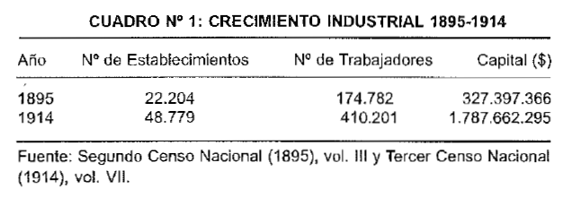
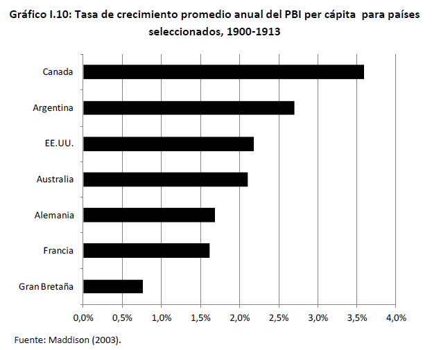

# Apertura y hoja de ruta {background="#1f3a5f"}

## Dónde quedamos

- El modelo agroexportador y la **teoría del bien primario exportable (BPE)**.
- El crecimiento del sector exportador **arrastra** al resto vía **eslabonamientos**.
- El factor abundante que pone en marcha el ciclo: la **tierra**.

::: {.callout-tip icon=false title="Idea clave"}
Hoy pasamos de la **teoría** a la **evidencia**: ¿cómo se combinaron tierra, capital y trabajo?
:::

## La pregunta de hoy

> El crecimiento fue de los más altos del mundo. **¿De dónde salió, en concreto?**

- Vamos a mirar los **factores de la oferta** uno por uno, con datos.
- Y veremos cómo el agro terminó **empujando la industria y la ciudad**.

## ¿Cómo crece una economía primaria?

Dos preguntas ordenan la clase:

1. **¿Cuánto** produce el país? → depende del **tamaño** de los factores (tierra, capital, trabajo).
2. **¿Cuánto por habitante?** → depende de la **productividad** de esos factores.

::: {.callout-note icon=false title="El hilo del BPE"}
En un país de *reciente asentamiento*, el crecimiento llega **incorporando factores** —más tierra, más gente, más rieles— antes que subiendo su productividad.
:::

## Mapa de la clase

1. **Bloque 1 — Los factores de la oferta:** tierra, capital y trabajo, con datos.
2. **Bloque 2 — Del agro a la industria:** el primer núcleo industrial y la urbanización.
3. **Bloque 3 — El crecimiento en perspectiva:** Argentina frente al mundo.

# Bloque 1. Los factores de la oferta {background="#1f3a5f"}

## [1.1] Tierra: la frontera productiva

La superficie cultivada pasa de **menos de 1** a **~20 millones de hectáreas**, con un quiebre hacia **1897–98**:

{fig-align="center" width="56%"}

::: {.fuente}
Gráfico I.3. Fuente: Cortés Conde (1979), en Gómez (2012).
:::

## [1.2] La tierra como factor *variable* {.tight}

- La **Campaña del Desierto (1880)** incorpora ~**30 millones de hectáreas** (un 50% más de superficie disponible).
- La tierra dejó de ser un factor **fijo**: se sumaba al ritmo que la exportación la hacía rentable.
- Su expansión **precede** al alza de las exportaciones con un rezago de unos **2 años**.

::: {.callout-tip icon=false title="Idea clave"}
En este período la tierra se comporta como un factor **variable**: no es un límite dado, sino una frontera que se corre.
:::

## [1.3] Capital: el ferrocarril

La red ferroviaria se multiplica —**732 → 27.994 km** (1870–1910)— con inversión mayoritariamente **británica**:

{fig-align="center" width="74%"}

::: {.fuente}
Fuente: Gómez (2012).
:::

## [1.4] Por qué el riel es *el* capital {.tight}

- El ferrocarril fue **la principal forma de capital** del siglo XIX: trasladaba insumos y sacaba la cosecha al puerto.
- Se financió sobre todo con **inversión extranjera directa** (cerca del **60%**), igual que puertos y obras de riego.
- Su expansión **acompaña** a la de la superficie cultivada: sin riel barato, la tierra del interior no valía nada.

::: {.callout-important icon=false title="Un debate abierto"}
Para **Scalabrini Ortiz (1940)**, el trazado radial hacia el puerto no fue neutral: ordenó el país en función de la exportación.
:::

## [1.5] Trabajo: la gran inmigración

Saldo migratorio **positivo casi todos los años**, con **picos de más de 200 mil personas**; la única caída fuerte es la **crisis de 1890–91**:

{fig-align="center" width="56%"}

::: {.fuente}
Gráfico I.5. Fuente: Ferreres (2005), en Gómez (2012). Sobre todo italianos y españoles.
:::

## [1.6] Quiénes vinieron, y por qué

- La población salta de **1,8 (1869) a 4 (1895) y a 7,9 millones (1914)**; la inmigración explica **entre el 44% y el 52%** de ese aumento.
- Vienen sobre todo de **Italia y España**, empujados por **diferencias salariales** y por crisis en sus países.
- No hubo una **política inmigratoria nacional** (sí para atraer capital); a la vez, corrientes **internas** llenaban la pampa desde el NOA, el NEA y Cuyo.

## [1.7] El rostro de la inmigración

{fig-align="center" width="34%"}

::: {.fuente}
Archivo General de la Nación (dominio público).
:::

# Bloque 2. Del agro a la industria {background="#1f3a5f"}

## [2.1] Nace la industria (1890s)

- La expansión agroexportadora tuvo **impactos sobre otros sectores**: hizo nacer una **industria doméstica**.
- Al integrarse los mercados regionales, por primera vez puede hablarse de un **mercado interno único**.

::: {.callout-note icon=false title="Eslabonamiento hacia adelante"}
Industrias que **agregan valor** al bien primario antes de exportarlo o consumirlo (p. ej. frigoríficos y molinos).
:::

## [2.2] Tres tipos de industria

::: {.columns}
::: {.column width="33%"}
::: {.callout-note icon=false title="1. Transables"}
Demanda interna y **externa**; con ventaja comparativa en tierra. *Hacia adelante:* frigoríficos, molinos.
:::
:::
::: {.column width="33%"}
::: {.callout-note icon=false title="2. No transables"}
Sólo demanda interna; sin ventaja comparativa. *Hacia atrás y de demanda:* muebles, herramientas, construcción.
:::
:::
::: {.column width="33%"}
::: {.callout-note icon=false title="3. Sustitutos"}
Compiten con importaciones; sin ventaja comparativa. *De demanda:* bebidas, textiles, químicos, tabaco.
:::
:::
:::

## [2.3] Cuánto creció la industria

En dos décadas los establecimientos se **duplican** y el capital se **multiplica por cinco**:

{fig-align="center" width="70%"}

::: {.fuente}
Cuadro N.º 1. Fuente: Censos Nacionales de 1895 y 1914.
:::

## [2.4] ¿Qué la hacía rentable?

Sin ventaja comparativa, muchas industrias vivían de **tres formas de protección**:

$$P_{d} = (P^{*}_{fob} + \tau)\,\cdot\,E\,\cdot\,(1 + t_{M})$$

- **Transporte ($\tau$):** la distancia daba una protección "natural" (70% de las importaciones venían de UK, Francia, Alemania y EE. UU.).
- **Tipo de cambio ($E$):** un peso depreciado encarecía lo importado.
- **Arancel ($t_{M}$):** ~**17,7%** en 1913 (como EE. UU. y Canadá), pero el efectivo rondaba el **30%**.

## [2.5] Qué se produjo… y qué no

- El gran rubro fue **alimentos** (frigoríficos y molinos harineros); detrás, **materiales de construcción**.
- Metales, textiles y químicos sumaban **menos del 5%**.

::: {.callout-important icon=false title="Por qué faltaron las 'industrias pesadas'"}
Escasez de **hierro y carbón** (metales), **competencia inglesa** imbatible (textiles) y falta de **carbón y capital humano** (químicos).
:::

## [2.6] El país se urbaniza

- La población urbana pasa del **32% (1880) al 53% (1914)**; Buenos Aires, Rosario, La Plata y Córdoba **duplican o triplican** su tamaño.
- Pero hacia 1900 la economía seguía siendo **del bien primario**: el valor agregado agropecuario superaba al industrial.

::: {.callout-important icon=false title="Una curiosidad"}
En **1913** Buenos Aires inauguró el **primer subterráneo de América Latina** (y del hemisferio sur).
:::

# Bloque 3. El crecimiento en perspectiva {background="#1f3a5f"}

## [3.1] Argentina frente al mundo

Argentina crece al **~2,5% anual**, junto a **Canadá y Australia**: las economías de *reciente asentamiento*.

{fig-align="center" width="56%"}

::: {.fuente}
Gráfico I.10. Fuente: Maddison (2003), en Gómez (2012).
:::

## [3.2] Los números del éxito

Comparada con las economías de mayor ingreso (UK, EE. UU., Alemania, Francia, Canadá, Australia):

- En **PBI per cápita**, Argentina era la **5.ª** hacia 1913 —**por delante de Alemania y Francia**—.
- En **ritmo de crecimiento** (1900–1913), **2.ª** con **2,5%**, sólo detrás de **Canadá (3,3%)**.

::: {.callout-tip icon=false title="Idea clave"}
No fue un espejismo: por nivel **y** por velocidad, Argentina jugaba en la primera división mundial.
:::

## [3.3] Un crecimiento excepcional… y frágil

- El desempeño fue **excepcional en términos comparados**.
- Pero el motor depende de **decisiones tomadas afuera**: precios, capitales y migración —los **términos de intercambio** los fija el mundo, no el país—.

::: {.callout-tip icon=false title="Idea clave"}
El éxito y la fragilidad tienen la **misma raíz**: un crecimiento traccionado desde el exterior.
:::

# Cierre {background="#1f3a5f"}

## Ideas fuerza

1. El crecimiento se explica por la **combinación de tierra, capital y trabajo**, articulados por los eslabonamientos.
2. La tierra actuó como factor **variable**, el ferrocarril fue **el** capital y la inmigración **el** trabajo.
3. El agro no frenó la industria: fue su **primer motor** —aunque el país siguió siendo **primario**—.
4. El desempeño fue **excepcional pero dependiente del exterior**.

## Preguntas para llevarse

- ¿Qué habría pasado si se **cerraba** el acceso a capitales o mercados externos?
- ¿Por qué un país que crecía tanto necesitaba un **nuevo orden monetario**?
- Puente a la próxima clase: **dinero, banca y la crisis de 1890**.

## Bibliografía de la clase {.tight}

**Obligatoria**

- **Gómez, M. (2012).** *El crecimiento económico argentino en el siglo XIX (1880–1914)*. Cátedra de Historia Económica Argentina, FCE-UNC. (Completo.)

**Complementaria**

- **Gerchunoff, P. y Llach, L. (2007).** *El ciclo de la ilusión y el desencanto*. Buenos Aires: Ariel. **Cap. 1**.
- **Cortés Conde, R. (1979).** *El progreso argentino, 1880–1914*. Buenos Aires: Sudamericana.

::: {.fuente}
La bibliografía completa por unidad está en el programa de la asignatura.
:::

<!--
Notas de uso (no proyectar):
- Layout minimalista: cada figura/tabla en diapositiva propia, con un lead breve
  ARRIBA (nunca dos columnas texto+figura). Continúa lec-01 (misma Unidad 1).
- División con lec-01: allí la TEORÍA del BPE y la evolución del bien exportable;
  aquí el detalle EMPÍRICO de los factores + industria + urbanización + crecimiento
  comparado. No re-derivar la teoría ni entrar en lo monetario (eso es lec-03).
- Figuras de Gómez (2012): tierra (bpe04), ferrocarril (bpe06), migración (bpe07),
  industria (ind01), crecimiento comparado (growth01); foto inmigrante (AGN, PD).
- Contenido nuevo desde lect01.tex (2.ª mitad): tierra como factor variable,
  ferrocarril/IED, población e inmigración, los 3 tipos de industria, factores de
  rentabilidad (τ, E, t_M) y la ecuación de precio, urbanización y ranking mundial.
- Puente hacia lec-03: dinero, banca y la crisis de Baring (1890-91).
-->
