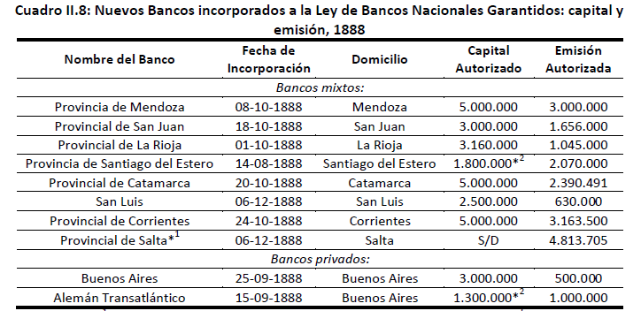
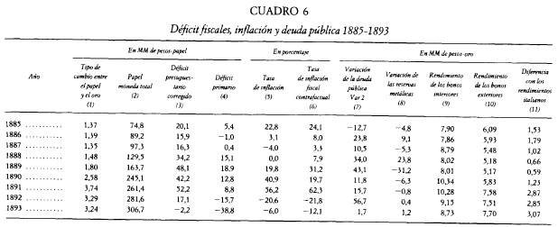
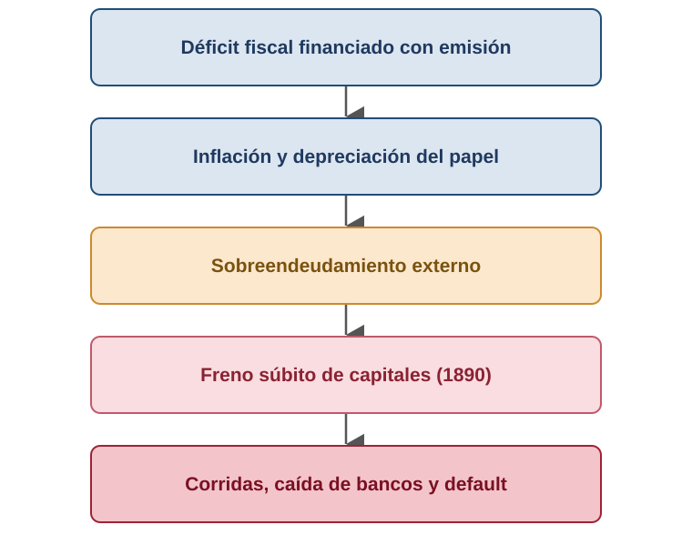

# Apertura y hoja de ruta {background="#1f3a5f"}

## Dónde quedamos

- El modelo agroexportador dio un crecimiento **excepcional pero frágil**.
- Ese crecimiento hubo que **financiarlo**: capitales externos, bancos y emisión.
- Hoy miramos el **lado monetario y financiero** — y su primer gran choque.

::: {.callout-tip icon=false title="Idea clave"}
Detrás del auge había un **orden monetario inestable**. En 1890 estalla.
:::

## Cuatro preguntas monetarias

Todo el capítulo monetario gira en torno a cuatro preguntas:

1. ¿Cómo juega el **dinero** —en sus distintas formas— en una economía en expansión?
2. ¿Hay relación entre el **crecimiento de la economía** y el del **dinero**?
3. ¿Se puede **sostener la convertibilidad** de la moneda?
4. Y si no, **¿por qué se abandona?**

## La pregunta de hoy

> ¿Cómo se financió el crecimiento… y por qué terminó en la **crisis de 1890**?

- El vínculo peligroso entre **déficit fiscal, emisión y deuda externa**.

## Mapa de la clase

1. **Bloque 1 — La cuestión monetaria:** de la anarquía a los Bancos Garantidos.
2. **Bloque 2 — Las cuentas fiscales:** el déficit y su financiamiento.
3. **Bloque 3 — La crisis de 1890:** anatomía y estallido.

# Bloque 1. La cuestión monetaria {background="#1f3a5f"}

## [1.1] Dos clases de dinero

::: {.columns}
::: {.column width="50%"}
::: {.callout-note icon=false title="Dinero metálico"}
Tiene **valor intrínseco** (oro, plata, cobre). El peso y la pureza del contenido le dan valor **como mercancía**.
:::
:::
::: {.column width="50%"}
::: {.callout-note icon=false title="Dinero fiduciario"}
**Sin valor intrínseco.** Su valor nominal se corresponde con el metálico; tiene la forma de un **pagaré** (papel moneda).
:::
:::
:::

Toda la historia monetaria del período es la **tensión entre ambos**.

## [1.2] ¿Qué es la convertibilidad?

> La convertibilidad implica que el dinero papel es **convertible legalmente a moneda dura** —divisa externa u oro—. Supone el respaldo del 100% (o menos) de la emisión. Si la conversión es del 100%, la **única fuente de emisión** son los saldos comerciales favorables o la entrada de capitales.

::: {.fuente}
Definición de la cátedra (Gómez, 2018).
:::

## [1.3] Seis convertibilidades {.tight}

Argentina intentó **seis** veces atar su moneda al metal:

- **1822–26** y **1867–73** — bancos provinciales de Buenos Aires.
- **1883–85** — la primera de alcance **nacional**.
- **1899–1914** — la **Caja de Conversión** (próxima clase).
- **1927–29** — su segunda etapa.
- **1991–2001** — la **Ley de Convertibilidad** (volveremos al final del curso).

::: {.callout-important icon=false title="El patrón común"}
En todas se buscó que la emisión resultara **sólo** de la entrada de divisas. En todas, tarde o temprano, la regla se rompió.
:::

## [1.4] De la anarquía a la unificación

- Antes de 1880: **múltiples monedas metálicas y bancos emisores**; billetes provinciales inconvertibles. No había unidad monetaria.
- La **Ley 1130 (1881)** unifica el signo: **peso oro** y **peso plata** de curso legal (el *Argentino de Oro* y el *Patacón*).
- Pero la emisión de papel quedó en manos de **cinco bancos**, sin más límite que la convertibilidad.

## [1.5] La convertibilidad que no fue

- Prevista en 1881, la convertibilidad recién arrancó a fines de **1883**… y cayó en **diciembre de 1884**: el Banco Nacional se quedó **sin reservas**.
- Los **decretos de 1885** suspendieron la conversión "por dos años" y dieron al papel **curso legal**.

::: {.callout-tip icon=false title="Idea clave"}
Se pasó de un **patrón mixto a paridad fija** a un **patrón fiduciario a paridad flexible**: la puerta abierta a la emisión.
:::

## [1.6] Los Bancos Nacionales Garantidos (1887)

Un sistema de **"banca libre"**: cualquier banco podía emitir billetes **si compraba títulos públicos en oro**.

- Capital mínimo de 250 mil pesos; reserva del **10%** en oro; los títulos rendían **4,5%** anual; tope agregado de **40 millones**.

::: {.callout-note icon=false title="El mecanismo BNG"}
El banco compra deuda pública **en oro** y, contra ese respaldo, recibe autorización para **emitir**. Emitir dinero pasa a depender de **colocar deuda**.
:::

## [1.7] Un diseño con un vicio

- Inspirado en la ley bancaria de EE. UU., tenía una **asimetría fatal**: la base monetaria **se expandía** al entrar oro, pero **no se contraía** cuando salía.
- Los bancos **no estaban obligados a convertir** sus billetes.

::: {.callout-important icon=false title="Banca salvaje (wildcat banking)"}
Muchos bancos **tomaron deuda en Londres** para comprar los títulos y sobre-emitir: puro arbitraje. Sólo el **50%** de los bonos se pagó realmente en oro.
:::

## [1.8] Una proliferación de bancos

{fig-align="center" width="72%"}

::: {.fuente}
Cuadro II.8. La emisión autorizada saltó de **85 a 295 millones** de pesos entre 1888 y 1890. Fuente: Gómez (2018).
:::

# Bloque 2. Las cuentas fiscales {background="#1f3a5f"}

## [2.1] Un Estado deficitario

- Los ingresos venían casi enteros del **comercio exterior**: los aranceles a las importaciones eran **2/3** de la recaudación.
- El grueso del gasto era **obra pública** (Ministerio del Interior, 36–40%).
- Resultado: **déficit primario durante toda la década** de 1880.

## [2.2] Financiar el déficit: dos caminos

- Un gobierno cubre su déficit con **deuda** (colocar bonos) o con **emisión** (imprimir dinero).
- La cátedra estima una **inflación contrafactual**: la que habría si el déficit se financiara **100% con emisión**.

::: {.callout-tip icon=false title="Idea clave"}
Cuando la inflación real se **acerca** a la contrafactual, es señal de que el déficit se está **monetizando** casi por completo.
:::

## [2.3] Déficit, inflación y deuda

{fig-align="center" width="82%"}

::: {.fuente}
Cuadro 6. El tipo de cambio papel/oro y la inflación se disparan hacia 1889–90.
:::

## [2.4] El giro fatal de 1889

- Hasta 1888 el déficit pudo financiarse **en parte con deuda**.
- Desde **1889**, con el crédito externo cortándose, el gobierno recurrió a la **emisión como fuente casi exclusiva**.

::: {.callout-important icon=false title="El nudo del problema"}
Más emisión inconvertible —casi toda para financiar al fisco— **socavó la estabilidad cambiaria**. El terreno de la crisis estaba listo.
:::

# Bloque 3. La crisis de 1890 {background="#1f3a5f"}

## [3.1] Anatomía de la crisis

{fig-align="center" width="42%"}

## [3.2] Las primeras señales (1889)

- El presidente **Juárez Celman** propone pagar en **pesos papel** una deuda pactada en **oro**: un **primer default parcial**.
- Se **desvanece el crédito externo**, que había sido motor de la expansión.
- En Buenos Aires, el público entrega papel y demanda **oro**, que se va del país.

## [3.3] La sangría de oro

- Con tipo de cambio flexible, la salida de oro **deprecia** el peso; el gobierno interviene para frenarla.
- Los particulares **piden préstamos en papel para comprar oro**, que sale de circulación.

::: {.callout-important icon=false title="El dato"}
Las reservas de oro pasaron de **60 a 6 millones en apenas nueve meses**.
:::

## [3.4] Las tres corridas

1. **Primera (principios de 1890):** contra el Banco Nación y el BPBA; el gobierno los asiste con **más emisión** sin respaldo.
2. **Segunda (junio 1890):** el Banco Nacional suspende el pago a **Baring**; renuncia Juárez Celman.
3. **Tercera (abril 1891):** caen **ambos** bancos y casi todo el sistema.

## [3.5] El default ante Baring

> La casa Baring Brothers había suscripto más de **100 millones de pesos oro** en títulos de deuda argentinos entre 1882 y 1890. Su cesación sería el **primer default de Argentina** —el segundo, si se cuenta el de Buenos Aires en 1827—.

::: {.callout-important icon=false title="Una curiosidad"}
La quiebra de Baring casi arrastra a la City de Londres: hizo falta un **rescate coordinado por el Banco de Inglaterra**.
:::

## [3.6] Pellegrini y las tres medidas

Asume **Pellegrini**; su ministro López toma tres decisiones que definen la salida:

1. **Emitir** 60 millones en pesos papel de curso legal.
2. **Intervenir** los bancos de emisión del interior.
3. **Crear la Caja de Conversión** — la reforma que veremos la próxima clase.

## [3.7] El saldo de la crisis {.tight}

- Depreciación del papel: **152,7%** (1889–91) y **270%** (1881–91); inflación acumulada del **163,7%**.
- Fue la **primera gran crisis de los mercados emergentes** y una de las más estudiadas.

> La crisis de 1890–91 fue el triste final de uno de los primeros **experimentos monetarios** argentinos: la reversión de los capitales, sumada a la emisión de papel inconvertible para financiar al Estado, generó una presión **insostenible** sobre el tipo de cambio.

# Cierre {background="#1f3a5f"}

## Ideas fuerza

1. El orden monetario del período fue **frágil**: convertibilidad suspendida y emisión atada a la deuda.
2. Los **Bancos Garantidos** tenían un vicio de diseño: expandían dinero al entrar oro, pero no lo retiraban al salir.
3. La crisis de 1890 fue una **crisis gemela**: fiscal **y** externa a la vez.
4. Su lección abre el camino a un **nuevo régimen monetario con reglas**.

## Preguntas para llevarse

- ¿Cómo se evita que la **emisión** dependa de las necesidades del fisco?
- ¿Qué reglas podrían **anclar** las expectativas tras semejante crisis?
- Puente a la próxima clase: **la Caja de Conversión**.

## Bibliografía de la clase

**Obligatoria**

- **Gómez, M. (2012).** *La crisis de Baring, 1890–91*. Cátedra de Historia Económica Argentina, FCE-UNC.
- **Gómez, M. (2018).** *Los avatares de la primera Caja de Conversión…*, **caps. 2 y 3**.

**Complementaria**

- **Gerchunoff, P. y Llach, L. (2007).** *El ciclo de la ilusión y el desencanto*, **cap. 1**.

::: {.fuente}
La bibliografía completa por unidad está en el programa de la asignatura.
:::

<!--
Notas de uso (no proyectar):
- Layout minimalista: tablas y diagramas en diapositiva propia con lead breve.
- Diagrama de la crisis: SVG hecho desde cero (../_shared/images/hear/).
- División con lec-04: aquí queda el sistema monetario pre-Caja (metálico/fiduciario,
  convertibilidad, unificación 1881, BNG/banca salvaje), las cuentas fiscales y la
  CRISIS de 1890. La Caja de Conversión, el trilema y el patrón oro 1900-13 van en lec-04.
- Contenido nuevo desde lect02.tex y lect02_add.tex: dos clases de dinero, definición
  de convertibilidad, las seis convertibilidades, unificación (Ley 1130), la
  convertibilidad fallida 1883-85, mecanismo y vicio del BNG, banca salvaje, cuentas
  fiscales, las tres corridas, default ante Baring, medidas de Pellegrini, el saldo.
- Block quotes (sin cursiva): convertibilidad, default ante Baring, fin del experimento.
- Puente hacia lec-04: la Caja de Conversión y el patrón oro.
-->
