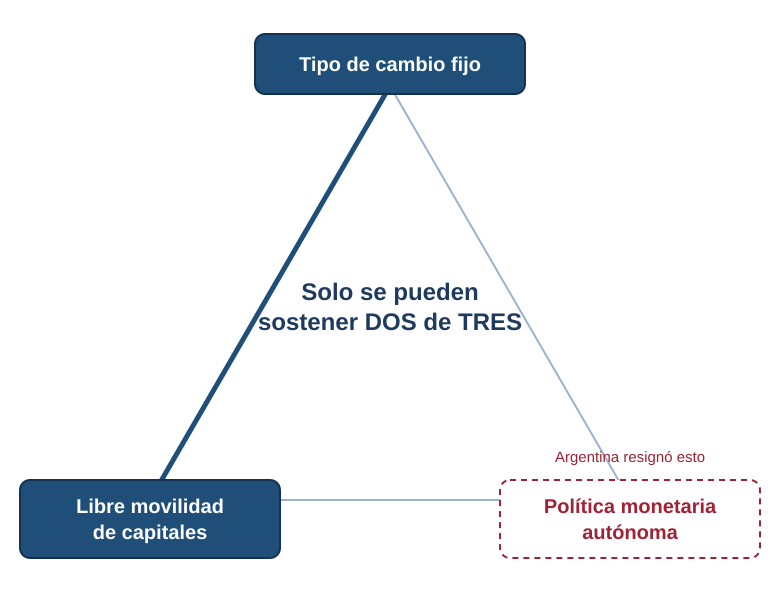
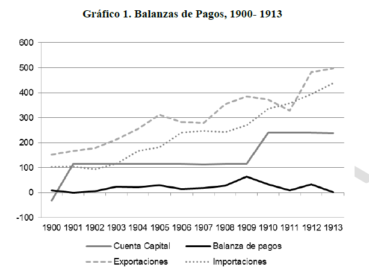
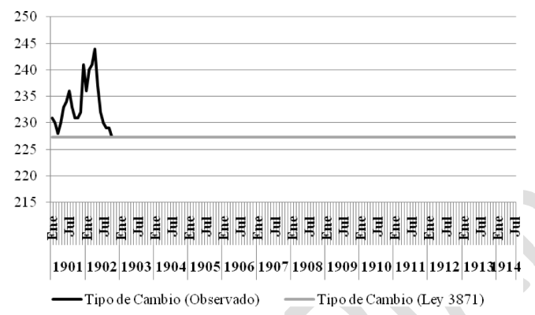
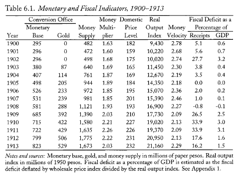

# Apertura y hoja de ruta {background="#1f3a5f"}

## Dónde quedamos

- La crisis de 1890 mostró los costos de un **orden monetario sin reglas**.
- La salida: un régimen que **quite discrecionalidad** a la emisión.
- Hoy: cómo Argentina logró **estabilidad**… y a qué **costo**.

::: {.callout-tip icon=false title="Idea clave"}
La Caja de Conversión ancla la moneda con una **regla dura**: emitir solo contra oro.
:::

## La pregunta de hoy

> ¿Cómo se alcanzó la estabilidad monetaria de 1900—1913, y qué **se resignó** a cambio?

## Mapa de la clase

1. **Bloque 1 — El sistema monetario previo (1880—1890):** de la anarquía a la Crisis de Baring.
2. **Bloque 2 — Las reformas de fin de siglo** y el nuevo modelo monetario.
3. **Bloque 3 — El trilema:** qué elige un país con tipo de cambio fijo.
4. **Bloque 4 — El patrón oro (1900—1913):** desempeño y balance.

# Bloque 1. El sistema monetario previo (1880—1890) {background="#1f3a5f"}

## [1.1] Anarquía monetaria y Ley de 1881

- Pre-1880: monedas extranjeras y billetes de **bancos provinciales** — sin unidad de cuenta ni medio de pago uniforme.
- La **Ley Monetaria del 5/11/1881** crea el peso oro y el peso plata como moneda nacional; autoriza a **cinco bancos** a emitir, pero **sin restricción cuantitativa** sobre el monto.
- 1883: convertibilidad efectiva (1 peso papel = 1 peso oro). 1884—85: la convertibilidad cae.

::: {.callout-note icon=false title="El talón de Aquiles"}
La ley unificó la **denominación** pero no la **disciplina**: sin límite a la emisión, el anclaje duró apenas dos años.
:::

## [1.2] Bancos Nacionales Garantidos

- **Banca libre condicionada:** cualquier banco podía emitir billetes si compraba bonos públicos en oro como garantía.
- **"Patrón oro de mano única":** la base monetaria se **expandía** cuando entraba oro (los bancos compraban bonos), pero **no se contraía** automáticamente cuando salía.
- El arbitraje: los bancos tomaban deuda en Londres al **6%** para comprar bonos al **4,5%** y emitir billetes → cobraban dos rentas sobre el mismo peso de oro.

::: {.callout-important icon=false title="El resultado"}
La emisión creció **73%** en doce meses (marzo 1888 — marzo 1889). El sistema incentivaba la expansión sin freno de contracción.
:::

## [1.3] La inconsistencia fiscal

- Ingresos del Estado: **65—69%** provenía de importaciones; el gasto y la deuda crecían sin esa base.
- **Deuda pública / gasto:** del **270%** (1884—87) al **630%** (1890) — el Estado vivía prestado.
- Sin crédito externo, la emisión se convierte en la **única fuente de financiamiento** del Tesoro.

::: {.callout-important icon=false title="Enero 1889: el límite"}
El gobierno propone pagar la deuda en **pesos papel** → el mercado reacciona con ira → default parcial → el crédito externo se cierra.
:::

## [1.4] La Crisis de Baring (1889—1891)

- **Corrida cambiaria (1889):** el peso cae de **1,26 a 2,83** pesos papel/oro; el gobierno liquida reservas → dic. 1889: sólo el **10,4%** del stock de marzo.
- **Corrida bancaria (1890):** cierran el Banco Nacional y el de la Provincia; julio: **Revolución del Parque**; renuncia Juárez Celman, asume **Pellegrini**.
- **Respuesta:** Ley 2741 (Caja de Conversión) + BNA (1891) + Empréstito de Consolidación (Baring/Banco de Inglaterra).

::: {.callout-tip icon=false title="Los costos"}
Depreciación **152,7%** · Inflación **163,7%** · Salarios reales **−25%** · 1890: saldo migratorio **negativo**.
:::

# Bloque 2. Las reformas de fin de siglo {background="#1f3a5f"}

## [2.1] Un período de reformas

- Tras la crisis, el gobierno de **Pellegrini** encara reformas **fiscales** e institucionales.
- En 1891: aranceles a las importaciones **pagaderos en oro** e impuestos **a la exportación** de commodities.

::: {.callout-important icon=false title="El problema del timing"}
Las reformas llegaron *"too little, too late"*: con el peso depreciándose, el servicio de la deuda trepó del **25% al 34%** del gasto entre 1890 y 1891.
:::

## [2.2] Currency School vs. Banking School

El modelo se inspira en el debate monetario inglés:

> La *Currency School* sostenía que la emisión de billetes debe estar **siempre respaldada por oro**: un banco no puede reemplazar billetes por exportación de oro, sino **reducir** su circulación en esa proporción. Esta idea llevó a la **Peel's Act (1844)**, que restringió la emisión privada — un encaje metálico del 100%.

::: {.fuente}
Gómez (2018). La *Peel's Act* dividió el Banco de Inglaterra en un departamento de **emisión** y otro **comercial**.
:::

## [2.3] La Caja de Conversión (1890-1899)

- La **Ley 2741 (1890)** crea la Caja; la **Ley 3871 (1899)** fija la paridad al valor de mercado: **2,27 pesos papel por peso oro**.
  - Argentina entra a un **patrón mixto metálico-fiduciario** $\longrightarrow$ $OM$ monedas metálicas y billete papel convertibles
- Toda variación de billetes en circulación **corresponde exactamente** a la variación de reservas de oro $\longrightarrow$ respaldo metálico del 100% de la *emisión adicional*

::: {.callout-note icon=false title="Caja de Conversión (currency board)"}
Emite moneda **solo a cambio de oro**, a tipo fijo y sin discrecionalidad. Quedan **prohibidos** los redescuentos y las operaciones de mercado abierto: la oferta monetaria es **endógena**.
:::

## [2.4] El Fondo de Conversión

> A diferencia del sistema inglés, se creó un **Fondo de Conversión**: una reserva metálica destinada a respaldar los casi **300 millones** de billetes ya en circulación —no sólo las nuevas emisiones—. Se nutría de las utilidades del Banco Nación, una sobretasa del 5% a las importaciones y otras rentas.

::: {.fuente}
Gómez (2018).
:::

## [2.5] El Banco de la Nación Argentina

- Creado sobre la base del viejo Banco Nacional, con **50 millones** de capital.
- Debía mantener un **encaje del 25%** de los depósitos.
- Dos privilegios: **agente financiero** del Estado y **"banco de bancos"** (podía redescontar documentos de otros bancos).

## [2.5] El Banco de la Nación Argentina (cont.)

- La suscripción pública fracasó: el BNA transfirió un bono a la Caja, que le adelantó billetes hasta el capital total — en la práctica, **emisión contra bono público**.
- Se argumentó una situación de emergencia (análoga al Bank of England en 1844).

## [2.5] El Banco de la Nación Argentina (cont.)

- Una nueva ley eliminó la deuda del BNA con la Caja: el banco quedó como **entidad pública** sin pasivo formal hacia ella.
- A diferencia del Departamento Comercial del Bank of England, el BNA estuvo reglamentado:
  - encaje del 25% de los depósitos.

## [2.6] Arquitectura del sistema

- **1881—1889:** sistema **descentralizado** de emisión → incentivos al aumento de emisión sin respaldo.
- **1890 en adelante:** sistema **centralizado** → estabilidad monetaria y respaldo del papel moneda de curso legal.

## [2.7] Cómo funciona la regla

- Entra oro (superávit externo) → **se emite**; sale oro → **se contrae**.
- La estabilidad se compra con la **pérdida de manejo monetario propio**.

::: {.callout-tip icon=false title="Idea clave"}
La cantidad de dinero deja de decidirla la política y pasa a decidirla el **balance externo**.
:::

## [2.8] Recuperación vía deflación

- La vuelta a la convertibilidad se hizo **apreciando** el peso: de ~3,6 a **2,27** hacia 1899.
- Con oferta monetaria casi estable y más transacciones, los precios **cayeron ~21%** ($M\cdot V = P\cdot Y$).

::: {.callout-important icon=false title="Una regla de Friedman antes de Friedman"}
La oferta monetaria creció apenas **2,6%** anual en 1892—99 (contra **21%** en los 1880), y aun así la economía creció: dinero lento y estable.
:::

## [2.9] Las variables monetarias

{fig-align="center" width="52%"}

## [2.10] Los interrogantes principales

::: {.callout-important icon=false title="¿Qué paridad debía fijarse?"}
Sectores urbanos/comerciales querían la paridad histórica (1:1); exportadores e industriales preferían una paridad **devaluada**. ¿Cuál sería?
:::

::: {.callout-important icon=false title="¿Alcanzan las reformas fiscales?"}
Las reformas debían ser suficientes para dar **credibilidad** a la convertibilidad plena y resistir ataques especulativos. ¿Qué umbral era ese?
:::

# Bloque 3. El trilema macroeconómico {background="#1f3a5f"}

## [3.1] El trilema

{fig-align="center" width="52%"}

## [3.2] Tres objetivos, solo dos posibles

De estos tres objetivos, un país puede lograr **dos** a la vez, nunca los tres:

::: {.columns}
::: {.column width="33%"}
::: {.callout-note icon=false title="Tipo de cambio fijo"}
Para estabilizar precios relativos.
:::
:::
::: {.column width="33%"}
::: {.callout-note icon=false title="Movilidad de capitales"}
Para ganar eficiencia y financiamiento.
:::
:::
::: {.column width="33%"}
::: {.callout-note icon=false title="Política monetaria"}
Para estabilizar el producto.
:::
:::
:::

## [3.3] La elección argentina

- Bajo el **patrón oro clásico (1873—1913)**, los países eligieron **tipo de cambio fijo + movilidad de capitales**.
- Argentina hizo lo mismo: la política monetaria quedó **endógena**, atada al oro.

::: {.callout-tip icon=false title="Idea clave"}
No hay régimen gratis: la regla que da estabilidad es la misma que quita **grados de libertad** ante un shock.
:::

## [3.4] Por qué 1890 fue inevitable

- El trilema explica la crisis de la clase anterior: Argentina quería sostener el **tipo fijo** con **capitales libres**…
- …pero en 1889, al **cortarse el crédito externo**, la única fuente de recursos fue la **emisión** — y el ancla cambiaria se rompió.

# Bloque 4. El patrón oro (1900—1913) {background="#1f3a5f"}

## [4.1] El sector externo

{fig-align="center" width="58%"}

::: {.fuente}
Gráfico 1. El boom de cereales y carnes lleva las exportaciones a crecer ~10% anual; la balanza es positiva desde 1901.
:::

## [4.1] El sector externo (cont.)

{fig-align="center" width="58%"}

::: {.fuente}
Gráfico 2. El tipo de cambio legal fijado por la Caja de Conversión de 1 por 2.27 recién entró en vigencia efectiva en 2002. 
:::

## [4.2] La Caja funcionando

- La paridad **2,27** se alcanza en **1902**; a partir de ahí, la base monetaria **sigue a las reservas** de oro casi uno a uno.
- El **Fondo de Conversión** pasa de 140 mil pesos oro (1902) a **30 millones** (1910): el respaldo en oro de la base llega al **73%**.

::: {.callout-tip icon=false title="La prueba de que funcionó"}
La correlación estrecha entre **reservas** y **base monetaria** confirma una Caja operando como tal: política monetaria endógena, sin discrecionalidad.
:::

## [4.3] Estabilidad monetaria y fiscal

{fig-align="center" width="74%"}

::: {.fuente}
Table 6.1. Fuente: della Paolera y Taylor (2003), en Gómez (2018).
:::

## [4.4] Un banco central que no hizo falta

- El Banco Nación fue **sólido**: los depósitos crecieron ~**15% anual** y mantuvo un ratio de reservas/depósitos de casi **50%**.
- Tenía funciones de "banco de bancos", pero **no fueron necesarias**: la liquidez del sistema **no dependía** de él.

::: {.callout-important icon=false title="El contraste con lo que vendrá"}
En la *belle époque*, la estabilidad no requirió un banco central. Cuando el mundo cambie, esa ausencia **pesará**.
:::

## [4.5] Balance del período

- Reservas de oro crecientes, precios estables y **fuerte crecimiento**.
- Pero la economía queda **atada al ciclo externo**: cuando entra oro, se expande; cuando huye, se contrae.

::: {.callout-important icon=false title="Una curiosidad"}
Con la Caja, la **oferta de dinero la decidía, en los hechos, la balanza de pagos** — no un banco central (que aún no existía).
:::

# Cierre {background="#1f3a5f"}

## Ideas fuerza {.tight}

1. La Crisis de Baring (1890) fue el **desenlace de una inconsistencia** fiscal y monetaria, no un accidente externo.
2. La Caja de Conversión dio **estabilidad con una regla dura**: emitir solo contra oro.
3. La recuperación previa (1891—99) fue **vía deflación** y dinero lento y estable.
4. El trilema explica el costo: fijo + movilidad ⇒ **sin política monetaria propia**.
5. El éxito de 1900—1913 fue **real pero dependiente** del ingreso de oro y capitales.

## Preguntas para llevarse

- ¿Qué pasa con este régimen cuando el mundo entra en **guerra**?
- ¿Se parece la Convertibilidad de los años 90 a esta Caja? *(volveremos sobre esto)*
- Puente a la Unidad 2: **la Primera Guerra Mundial rompe el patrón oro**.

## Bibliografía de la clase

**Obligatoria**

- **Gómez, M. (2018).** *Los avatares de la primera Caja de Conversión…*, **caps. 2 y 3**.

**Complementaria**

- **della Paolera, G. y Taylor, A. (2003).** *Tensando el ancla*. Buenos Aires: FCE, **caps. 2—6**.
- **Gerchunoff, P. y Llach, L. (2007).** *El ciclo de la ilusión y el desencanto*, **cap. 1**.

::: {.fuente}
La bibliografía completa por unidad está en el programa de la asignatura.
:::

<!--
Notas de uso (no proyectar):
- Cierra la Unidad 1. Layout minimalista: figuras/tablas y el trilema (SVG) en
  diapositiva propia.
- División con lec-03: allí la crisis de 1890; aquí las REFORMAS post-crisis, la Caja
  de Conversión (Ley 3871, Fondo de Conversión, BNA), el TRILEMA y el patrón oro 1900-13.
- Contenido nuevo desde lect03.tex (+ trilema de lect02.tex): reformas fiscales 1891 y
  el timing, Currency School / Peel's Act, Ley 3871 y paridad 2.27, Fondo de Conversión,
  BNA, recuperación vía deflación (M.V=P.Y, Friedman rule), los 3 objetivos del trilema,
  por qué 1890 fue inevitable, la Caja funcionando (Fondo 140mil->30mill, respaldo 73%),
  el BNA sólido y el "banco central que no hizo falta".
- Block quotes (sin cursiva): Currency School, Fondo de Conversión.
- Puente hacia la Unidad 2 (lec-05): la Primera Guerra Mundial.
-->
