# Apertura y hoja de ruta {background="#1f3a5f"}

## Dónde quedamos

- Cerramos la Unidad 1: la **Caja de Conversión** dio estabilidad con una regla dura —emitir solo contra oro—.
- Funcionó porque el mundo cooperaba: **entraban oro y capitales**.
- Hoy empieza la Unidad 2: el **PAN en su ocaso**, el **shock de la guerra** y el **fin de una era**.

::: {.callout-tip icon=false title="Idea clave"}
La misma estructura que hizo posible el modelo agroexportador —política restrictiva, economía abierta, estabilidad monetaria— entra en crisis cuando cambia el mundo *y* cambia la política doméstica.
:::

## La gran expansión nacional: 1880-1914

- La expansión conjunta y simultánea de **población**, **capital** y **producción/exportación** permitió la rápida inserción argentina en una época de rápido progreso económico internacional

::: {#tab:tab1}
| **Año** | **Población (miles)** | **Red ferroviaria (miles km)** | **Exp. cereales (miles tn)** |
|---|---|---|---|
| 1885-89 | 3.066 | 6,5 | 389 |
| 1890-94 | 3.612 | 12,7 | 1038 |
| 1895-99 | 4.219 | 15,0 | 1711 |
| 1900-04 | 4.860 | 17,7 | 3011 |
| 1905-10 | 5.803 | 22,2 | 4825 |
| 1910-14 | 7.203 | 31,1 | 5294 |
:::

## Marco político de la clase

- La Unidad 2 abarca la **era de entreguerras** argentina (1914–1939).
- Hoy cubre dos momentos articulados: el **último tramo del PAN** (1912–1916) y el **shock de la Primera Guerra Mundial** (1914–18).

::: {.callout-note icon=false title="El arco político"}
**1905**: Revolución del Parque, amnistía y fractura del roquismo (1905) --Carlos Pellegrini y Roque Saénz Peña**. 1912**: Ley Sáenz Peña —fin del sufragio restringido—. **1916**: Yrigoyen gana las primeras elecciones limpias —fin del PAN— y comienzo de hegemonía radical hasta 1930. **1914–18**: La guerra interrumpe esa transición.
:::

## La pregunta de hoy

> Cuando estalla la guerra y el patrón oro se suspende en todo el mundo, ¿cómo **sobrevive** un régimen monetario sin banco central? ¿Y qué hereda el naciente gobierno radical de la economía del PAN?

## Mapa de la clase

1. **Bloque 1 — El PAN en su última etapa:** logros, tensiones y la Ley Sáenz Peña.
2. **Bloque 2 — El fin de la época de oro:** la transición de 1913–14.
3. **Bloque 3 — La guerra y el sector externo:** el shock de 1914–18.
4. **Bloque 4 — La respuesta de política económica:** las medidas de emergencia.
5. **Bloque 5 — La Caja como cuasi–banco central:** autorregulación y sus costos.

# Bloque 1. El PAN en su última etapa {background="#1f3a5f"}

## [1.1] La república restrictiva

- El **Partido Autonomista Nacional (PAN)** gobernó Argentina ininterrumpidamente desde **1880**: el "régimen conservador" o "república restrictiva".
- Sufragio masculino y voluntario; el **fraude y el control de urnas** eran prácticas habituales.
- Bases del modelo: **elite terrateniente pampeana**, capital extranjero (mayormente británico), Estado exportador de granos y carnes.

::: {.callout-note icon=false title="El pacto oligárquico"}
El PAN no era un partido en el sentido moderno: era una **red de notables provinciales** articulada en torno al poder presidencial. La UCR y el Partido Socialista existían, pero no podían ganar.
:::

## [1.2] El modelo en su cúspide

- La primera década del siglo fue la **cúspide del modelo**: precios internacionales altos, capitales externos abundantes, inmigración masiva (3,5 millones entre 1900 y 1914).
- El PBI per cápita argentino era comparable al de **países europeos de ingreso medio-alto**.
- Las exportaciones —cereales y carnes— financiaban importaciones de capital y bienes manufacturados.

::: {.callout-important icon=false title="Un dato que sorprende"}
En 1913, el ingreso per cápita argentino era similar al de **Francia o Alemania**. La convergencia con los países ricos parecía irreversible.
:::

## [1.2] El modelo en su cúspide (cont.)

::: {#tab:tab3}
| **Tipo** | **1860-69** | **1875-79** | **1885-89** | **1895-99** | **1900-04** | **1910-14** | **1925-29** |
|---|---|---|---|---|---|---|---|
| _Producción_ |  |  |  |  |  |  |  |
| Lana | --- | --- | --- | --- | 187 | 151 | 147 |
| Trigo | --- | --- | --- | 1.621 | 2.538 | 4.003 | 6.770 |
| Lino | --- | --- | --- | 226 | 526 | 790 | 1.839 |
| Maíz | --- | --- | --- | 1.970 | 2.858 | 4.869 | 7.076 |
| _Exportaciones_ |  |  |  |  |  |  |  |
| Cueros | --- | 70 | 85 | 100 | 100 | 125 | 181 |
| Lana | 45 | 90 | 129 | 211 | 178 | 137 | 130 |
| Trigo | 0 | 6 | 111 | 801 | 1.591 | 2.277 | 4.448 |
| Lino | 0 | 0 | 51 | 209 | 475 | 679 | 1.618 |
| Maíz | 0 | 13 | 277 | 910 | 1.518 | 3.194 | 5.521 |
| Carnes | - | 34 | 45 | 95 | 161 | 437 | 805 |
:::

## [1.3] Las tensiones del modelo

- El crecimiento generó **tensiones sociales** crecientes: urbanización acelerada, clase obrera inmigrante, sindicalismo, anarquismo.
- **1902**: Ley de Residencia —el Estado puede expulsar extranjeros "peligrosos"—.
- **1909–10**: huelgas generales en vísperas del Centenario; **Estado de sitio** en plenas fiestas.
- **1912**: huelga chacarera (Grito de Alcorta) —los arrendatarios pampeanos se organizan por primera vez—.

## [1.4] La Ley Sáenz Peña (1912)

- **Roque Sáenz Peña** (1910–14) impulsó la reforma electoral más importante de la historia argentina hasta entonces.
- **Ley 8.871**: sufragio **universal, secreto y obligatorio** para varones mayores de 18 años.
- Objetivo declarado: **incorporar a las masas** al sistema político para desactivar la conflictividad social.

::: {.callout-tip icon=false title="La paradoja de la reforma"}
Una elite diseñó la reforma que iba a sacarla del poder. Sáenz Peña subestimó la organización territorial de Yrigoyen —y sobreestimó la cohesión de la propia clase dominante—.
:::

## [1.5] El ocaso del PAN

- **Sáenz Peña** fallece en agosto de 1914; asume el vicepresidente **Victorino de la Plaza**.
- De la Plaza enfrenta simultáneamente el **estallido de la guerra** y la transformación del sistema político.
- Legado económico del PAN: Estado fiscalmente sólido, Caja de Conversión funcionando, deuda externa ordenada.

::: {.callout-note icon=false title="El doble shock de 1914"}
En agosto de 1914 confluyen dos eventos: la **guerra** (shock externo) y la **crisis monetaria** (shock interno). El gobierno de De la Plaza responde con rapidez. El de Yrigoyen —que asume en 1916— hereda una economía en proceso de ajuste.
:::

## [1.6] PBI total e industrial desde 1900

{fig-align="center" width="65%"}

::: {.fuente}
Villanueva (1972), Gráfico 1 (recorte). La manufactura creció de 1.267 (1900) a 3.050 millones de pesos (1913).
:::

<!-- SCREENCAP → Villanueva (1972), Gráfico 1: recortar 1900–1914 del gráfico semilogarítmico de PBI total y manufacturero -->

# Bloque 2. El fin de la época de oro {background="#1f3a5f"}

## [2.1] Argentina en la cima

A principios de la década de 1910, los indicadores macroeconómicos estaban entre los **mejores de la historia** argentina:

::: {.callout-note icon=false title="La foto de 1910"}
Respaldo metálico de la circulación: **63%**. Riesgo país (spread de bonos): tan bajo como **1,5%**. Déficit público: menos del **20%** de los ingresos fiscales. Deuda/PBI: solo **35%**.
:::

- Muchos analistas veían el potencial para una **explosión de crecimiento**… pero también advertían los **peligros**.

## [2.2] El patrón oro para un país periférico

> El patrón oro maximizaba la capacidad de una economía para atraer inversores externos en períodos florecientes, pero también la dejaba expuesta a shocks en los términos de intercambio y en las tasas de interés internacionales. Para Alec Ford, el patrón oro **amplificaba los ciclos**: una recesión podía agravarse por una contracción monetaria.

::: {.fuente}
Gómez (2018). La vulnerabilidad a las crisis externas era el reverso de la estabilidad.
:::

## [2.3] La transición de 1913–14

- A principios de 1913, una **política monetaria contractiva en Gran Bretaña** se transmitió a Argentina vía **PPP** y **paridad de intereses**.
- Por primera vez en la década **cayó la oferta de dinero (1913)** y luego la **base monetaria (1914)**.
- La caída repercutió en los **depósitos** del sistema bancario.

## [2.4] Del crecimiento a la transición

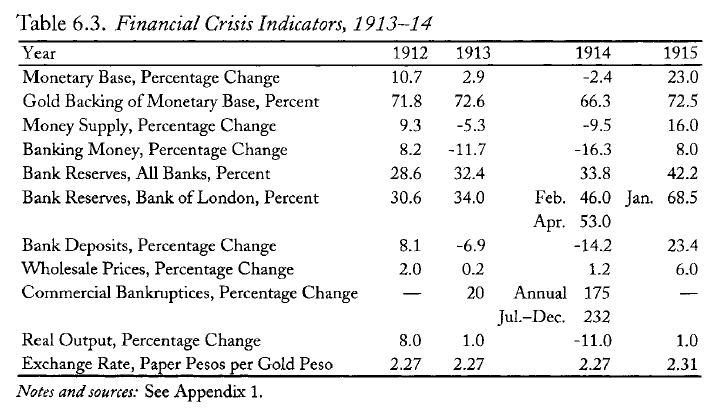{fig-align="center" width="60%"}

::: {.fuente}
Della Paolera y Taylor (2001), en Gómez (2018).
:::

## [2.5] De la deflación a la crisis

Una **presión deflacionaria importada** desde Europa golpeó al sistema bancario. En una deflación el público busca **liquidez**:

- Sustituye **depósitos** (pasivo bancario) por **efectivo**.
- Sube la razón circulante/depósitos → **cae el multiplicador**: $mm = \dfrac{1+e}{r+e}$.

::: {.callout-important icon=false title="El eslabón peligroso"}
Al caer las reservas como fracción de los depósitos, hace falta **inyectar liquidez**… justo lo que la Caja tenía **prohibido** hacer.
:::

## [2.6] La Caja sin red de seguridad

- La Caja de Conversión tenía **vedada por ley** la función de **prestamista de última instancia** —y ninguna otra institución la cumplía aunque el BNA podía hacer redescuentos y préstamos.

::: {.callout-tip icon=false title="Idea clave"}
El *trade-off* del período: **convertibilidad interna** (estabilizar el sistema financiero) vs. **convertibilidad externa** (sostener el valor de la moneda). No se pueden las dos a la vez.
:::

# Bloque 3. La guerra y el sector externo {background="#1f3a5f"}

## [3.1] Estalla la guerra

- El **28 de julio de 1914** empieza la Primera Guerra Mundial: Triple Alianza vs. Triple Entente.
- El impacto financiero fue **casi inmediato**:
  - Las principales **bolsas cerraron**.
  - Se **abandonó el patrón oro** en todo el mundo.
  - Se **restringió la movilidad del oro**.

## [3.2] Efectos sobre economía pequeña y abierta

- La **cuenta capital** se redujo casi **50%** entre 1913 y 1914.
- La **balanza comercial** fue positiva, pero por una contracción de las importaciones (**–35%**), no por más exportaciones.
  - principal razón de recesión prolongada la severa restricción de oferta [manta corta, manta larga...]
  - necesidad espontánea --no decisión política- de procurarse (y producir) manufacturas que no llegarían por otra vía
- La **balanza de pagos**, positiva todos los años desde 1900, fue **deficitaria por primera vez**.

## [3.2] Efectos sobre economía pequeña y abierta (cont.)

::: {#tab:tab2}
| **Año** | **Var. anual % PBI** | **Var. anual % inversión** |
|---|---|---|
| 1914 | -10.4 | -34.9 |
| 1915 | +0.5 | -34.8 |
| 1916 | -2.9 | -11.6 |
| 1917 | -8.1 | -24.4 |
:::

## [3.3] La balanza de pagos: panorama

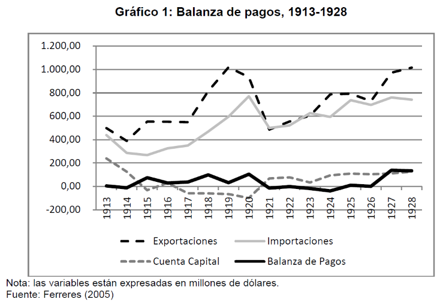{fig-align="center" width="65%"}

::: {.fuente}
Gómez (2018), Gráfico 1. El ciclo completo: déficit en 1914, superávit de guerra (1915–20), crisis 1921–24, recuperación 1925–28.
:::

<!-- SCREENCAP → Gómez (2018) / "La Caja y el Banco 1914-1928.pdf" (Parte 1), Gráfico 1: cuatro series (exportaciones, importaciones, cuenta capital, saldo BOP), 1913-1928 -->

## [3.4] La balanza de pagos se da vuelta

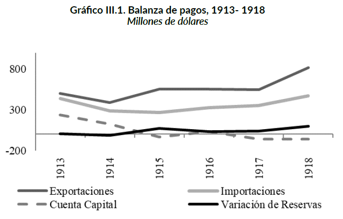{fig-align="center" width="60%"}

::: {.fuente}
Gómez (2018). Cuenta capital negativa de 1914 a 1918.
:::

## [3.5] Efecto precio, no efecto cantidad

- Los movimientos del comercio se explican por **cantidades**, no por precios: tanto $P_X$ como $P_M$ fueron **crecientes**.
- El valor de las **exportaciones** subió por precio (las cantidades cayeron con las malas cosechas); las **importaciones** también, pero sus cantidades cayeron **todos los años**.
- Clave: las **M** quedaron **por debajo** de las **X** → saldo positivo hacia el fin de la guerra.

## [3.6] Precios de EXP e IMP

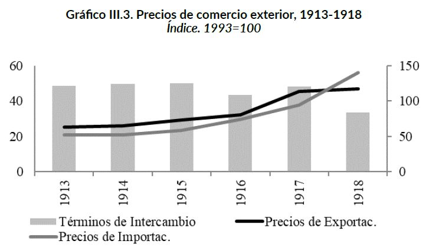{fig-align="center" width="60%"}

::: {.fuente}
Gómez (2018).
:::

## [3.7] El sector real: 1914-1918

- El PBI real **cayó en 1914** pero se recuperó; la economía argentina sorteó la guerra **sin recesión prolongada**.
- La manufactura **creció**: en 1913 valía 3.050 millones de pesos; en 1918 superaba ese nivel.
- El conflicto **aceleró** una incipiente sustitución de importaciones —aunque el salto real vendría en los años 20.

::: {.callout-tip icon=false title="Idea clave"}
La guerra no solo fue un shock financiero: también **reorganizó** la estructura productiva, favoreciendo sectores orientados al mercado interno. Los años veinte amplificarán esa tendencia.
:::

## [3.7] El sector real: 1914-1918 (cont.)

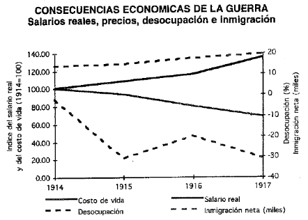{fig-align="center" width="60%"}

# Bloque 4. La respuesta de política económica {background="#1f3a5f"}

## [4.1] Las medidas de emergencia

- Primera y más urgente: **feriado bancario** de una semana (incluida la Caja), seguido de un **paquete de leyes de emergencia**.
- **Prórroga de 30 días** para obligaciones privadas —salvo las tributarias—.
- La prórroga alcanzó a los **bancos con sus depositantes**: solo pagarían hasta el **20%** de los depósitos exigibles.

## [4.2] Las legaciones como sucursales de la Caja

- El oro de transacciones comerciales se **depositaba en las legaciones argentinas** en el exterior.
- Así, las legaciones se volvían **sucursales de la Caja**: podía emitir apenas se depositara nuevo oro, en la misma relación **2,27 a 1**.

::: {.callout-important icon=false title="Un ingenio institucional"}
La regla de la Ley de Conversión (1899) se **estiró** para seguir funcionando con el oro atrapado por la guerra.
:::

## [4.3] Suspensión de la convertibilidad

- Tercera medida: **suspensión de la convertibilidad** —primero por 30 días, luego indefinida—.
- En octubre de 1914 se suspende el compromiso de convertir pesos papel a pesos oro → **sistema de papel moneda inconvertible**.
- Se autorizó **control de cambios** (prohibir exportar metálico) mientras durara la guerra… pero **no se usó**: el oro siguió entrando y saliendo según la balanza de pagos.

## [4.4] El cambio clave: los redescuentos

- Se autorizó a la Caja a **otorgar redescuentos**, con un respaldo mínimo del **40%** de la base monetaria en metálico.
- Tres vías: el BNA redescuenta a otros bancos; el BNA lleva documentos a la Caja; la Caja **crea dinero primario** contra documentos comerciales del BNA.

::: {.callout-note icon=false title="Redescuento"}
Cambio **fundamental**: por primera vez la Caja podía **emitir contra redescuentos**, no solo contra oro. En la práctica, sin embargo, **no llegó a hacerlo**.
:::

# Bloque 5. La Caja como cuasi–banco central {background="#1f3a5f"}

## [5.1] El patrón de autorregulación

- La Caja dejó de convertir a **2,27 fijo**: se alejó de la *Currency School* **y** del patrón oro de una sola vía.
- Adoptó la **autorregulación**: si las reservas caían, mantenía la **base monetaria constante**; si subían, también.

::: {.callout-important icon=false title="Un régimen a medida"}
Ni ancla rígida ni flotación pura: la base monetaria se **desacopló** de las reservas para amortiguar el shock.
:::

## [5.2] La autorregulación: evidencia estadística

:::: {.columns}
::: {.column width="50%"}
**Agosto 1914 – Diciembre 1919**

De 24 caídas de reservas, **21 (87,5%)** no cambiaron la BM.
De 39 subas, **23 (59%)** tampoco cambiaron la BM.
:::
::: {.column width="50%"}
**Enero 1920 – Julio 1927**

De 39 caídas de reservas, **32 (82%)** no cambiaron la BM.
De 51 subas, **37 (72,5%)** tampoco cambiaron la BM.
:::
::::

::: {.callout-tip icon=false title="Idea clave"}
La Caja **no seguía** las reservas —ni hacia abajo ni hacia arriba. Eso prevenía deflaciones y también evitaba apreciaciones excesivas que dificultaran la futura vuelta al oro.
:::

::: {.fuente}
Gómez (2018), Cuadros 1 y 2.
:::

## [5.3] Base monetaria y reservas se desacoplan

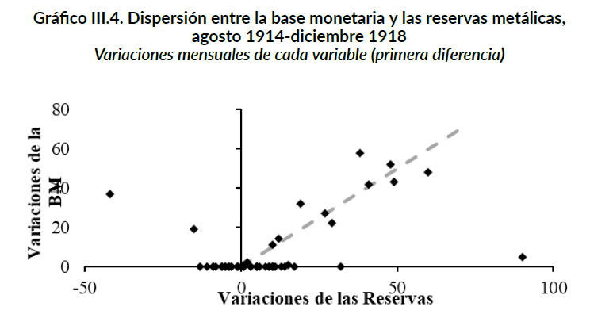{fig-align="center" width="60%"}

::: {.fuente}
Gómez (2018).
:::

## [5.4] El tipo de cambio flota

- Con la base monetaria constante, el **ajuste pasó al tipo de cambio**: $\Delta R < 0 \Rightarrow$ depreciación; $\Delta R > 0 \Rightarrow$ apreciación.
- Se usaron **20 millones** de pesos oro del **Fondo de Conversión** para asistir al sistema bancario → el respaldo de la base bajó de **73% a 66%**.

## [5.5] El tipo de cambio, 1914–18

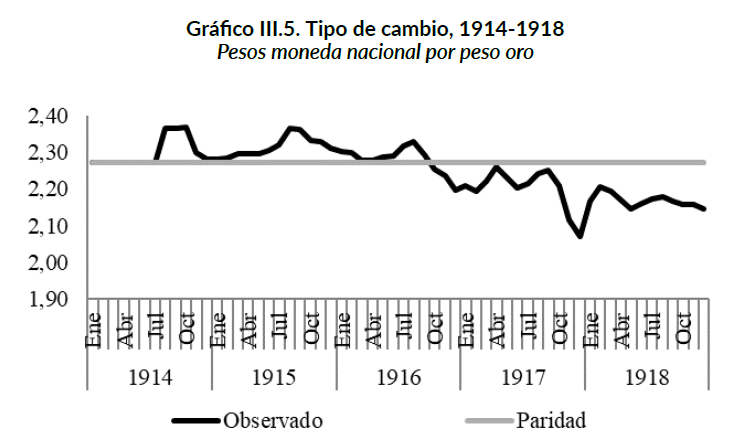{fig-align="center" width="60%"}

::: {.fuente}
Gómez (2018).
:::

## [5.6] El tipo de cambio: 1914–1929

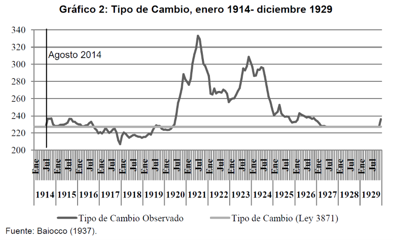{fig-align="center" width="65%"}

::: {.fuente}
Gómez (2018), Gráfico 2. La depreciación máxima ocurrió en 1920–23; la convergencia a la paridad, en 1925–27; la estabilización, bajo el patrón oro (1927–29).
:::

<!-- SCREENCAP → Gómez (2018) / "La Caja y el Banco 1914-1928.pdf" (Parte 1), Gráfico 2: tipo de cambio observado vs. paridad legal 2.27, enero 1914–diciembre 1929 -->

## [5.7] El sistema bancario resiste

- Al estallar la guerra hubo una **corrida**: la razón circulante/depósitos subió casi **30%** en el segundo semestre de 1914.
- Los bancos nacionales sufrieron más que los extranjeros y el BNA.
- Pero el sistema estaba **sólido** y los **redescuentos** ayudaron: la liquidez cayó solo un **20%** a nivel sistema.

## [5.8] Y los depósitos se recuperan

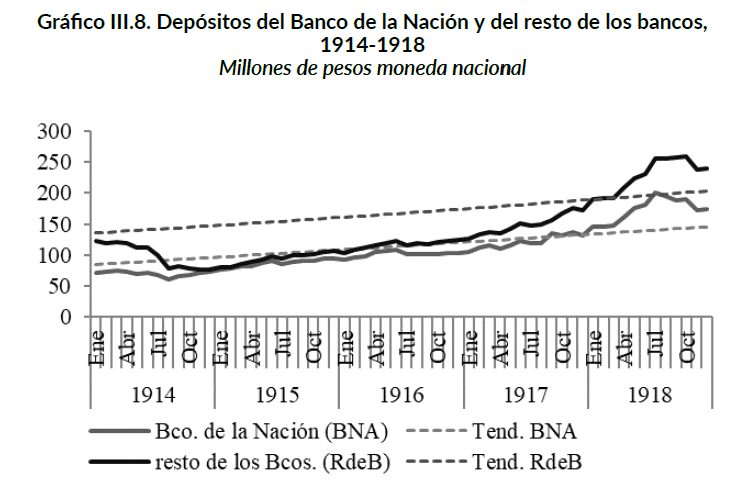{fig-align="center" width="60%"}

::: {.fuente}
Gómez (2018). Tras 1915, los depósitos crecieron ~21% (BNA) y ~36% (resto) anual.
:::

## [5.9] El Estado: talón de Aquiles

- La situación fiscal **empeoró** en 1914: resultado primario y financiero negativos (este último, **3% del PBI**).
- Recién en **1918** se volvió al superávit primario.
- Hubo **disciplina de gasto** ($GP/PBI$ cayó todos los años), pero **también cayeron fuerte los ingresos**.

## [5.10] Las cuentas fiscales

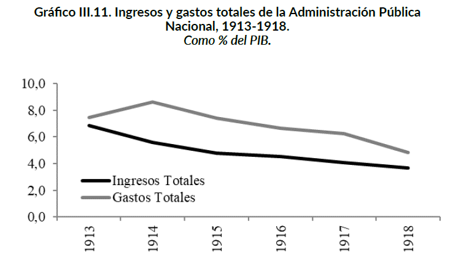{fig-align="center" width="60%"}

::: {.fuente}
Gómez (2018).
:::

## [5.11] Las fuentes de financiamiento {.tight}

El Estado recurrió a **tres vías** para financiar el déficit a través del BNA:

1. **Letras de Tesorería**: redescuento de títulos del Tesoro; crecieron **21,3% anual** entre 1915 y 1924.
2. **Préstamos oficiales**: Ley 10.350 (1918) —200 millones de pesos oro para compra de granos—.
3. **Fondos públicos**: inversión en títulos dentro del límite legal del 20% del capital.

::: {.callout-important icon=false title="La deuda indirecta"}
La vía de las letras fue diseñada para que la deuda **no apareciera a nombre del Estado**: deuda "indirecta" que sorteaba la restricción legal de la Ley 4507.
:::

::: {.fuente}
Gómez (2018), Gráfico 8.
:::

<!-- SCREENCAP → Gómez (2018) / "La Caja y el Banco 1914-1928.pdf" (Parte 1), Gráfico 8: tres fuentes extraordinarias de crédito al Estado (préstamos oficiales, fondos públicos, letras de tesorería), 1914-1928 -->

## [5.12] El BNA financia al Estado {.tight}

- Por primera vez el **BNA** usó funciones banco-centralistas: la presión vino del **Estado**.
- Contrafactual: sumando a sus reservas el financiamiento al sector público, el ratio **reservas/depósitos** habría sido **69%** —23 puntos más—.

::: {.callout-important icon=false title="A qué se renunció"}
El sacrificio por redescontar a **otros bancos** fue insignificante; el sacrificio por **financiar al Estado**, importante. El déficit fiscal se pagó con **liquidez bancaria**.
:::

## [5.13] El costo del financiamiento fiscal

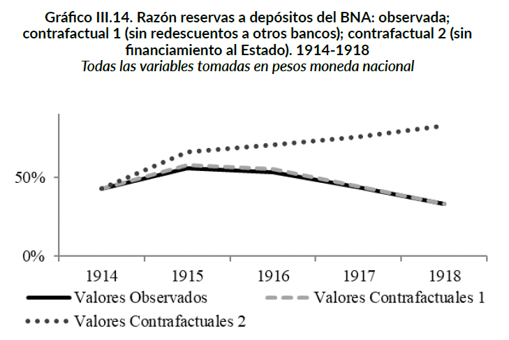{fig-align="center" width="58%"}

::: {.fuente}
Gómez (2018).
:::

# Cierre {background="#1f3a5f"}

## Ideas fuerza {.tight}

1. El PAN dejó un **legado económico sólido pero frágil**: dependiente del ciclo agroexportador, sin banco central ni política industrial autónoma.
2. La **Ley Sáenz Peña** (1912) inicia la democratización justo cuando el modelo económico entra en tensión: los cambios político y económico se superponen.
3. La política económica **se anticipó y reaccionó rápido**: feriado bancario, suspensión de la convertibilidad, uso del FDC, redescuentos habilitados.
4. La Caja adoptó un modelo de **autorregulación**: base monetaria constante y tipo de cambio flotante —confirmado estadísticamente para los dos subperíodos—.
5. El sistema bancario resistió la corrida; el **verdadero problema fue fiscal**: el BNA terminó financiando al Estado a costa de su liquidez.

## Preguntas para llevarse

- Si la Caja pudo actuar como cuasi–banco central, ¿por qué **no se creó** uno todavía?
- ¿Qué hereda el primer gobierno de Yrigoyen: una economía **estabilizada** o una economía **bajo presión**?
- Puente a la clase 07: los **años veinte**, los gobiernos **radicales** y el **origen de la industrialización** argentina.

## Bibliografía de la clase

**Obligatoria**

- **Gómez, M. (2018).** *Los avatares de la primera Caja de Conversión…*, **caps. 4 a 7**.
- **Gerchunoff, P. y Aguirre, H. (2006).** *La economía argentina entre la gran guerra y la gran depresión*. CEPAL.
- **Gerchunoff, P. y Llach, L. (2007).** *El ciclo de la ilusión y el desencanto*. Ariel. **Caps. 2 y 3**.

**Complementaria**

- **della Paolera, G. y Taylor, A. (2001).** *Straining at the Anchor*. Chicago: University of Chicago Press.

::: {.fuente}
La bibliografía completa por unidad está en el programa de la asignatura.
:::

<!--
Notas de uso (no proyectar):
- Abre la Unidad 2. Fuentes: lect04.tex (fin de la época de oro 1910-14 + 1GM 1914-18) +
  Villanueva (1972) para datos manufactureros del período PAN + Gómez (2018) / "La Caja y
  el Banco 1914-1928" (Parte 1) para panorama BOP 1913-28 y TC panorama 1914-29.
- FIGURAS A SCREENCAPEAR (nuevas, paths pendientes):
  [1.6] Villanueva (1972), Gráfico 1 → recortar 1900–1914 del gráfico semilogarítmico
        → guardar como: fig-chart-pbi-manufacturero-pan-1900-1914.png
  [3.3] "La Caja y el Banco 1914-1928" (Parte 1), Gráfico 1 → BOP cuatro series 1913-1928
        → guardar como: fig-chart-balanza-pagos-panorama-1913-1928.png
  [5.6] "La Caja y el Banco 1914-1928" (Parte 1), Gráfico 2 → TC observado vs 2.27, 1914-1929
        → guardar como: fig-chart-tipo-de-cambio-panorama-1914-1929.png
  [5.11] "La Caja y el Banco 1914-1928" (Parte 1), Gráfico 8 → tres fuentes crédito al Estado
         → guardar como: fig-chart-fuentes-financiamiento-estado-1914-1928.png
         (este gráfico también sirve para lec-07)
- FIGURAS EXISTENTES (mantener paths actuales):
  fig-chart-transicion-monetaria-1912-1915, fig-chart-balanza-de-pagos-1913-1918,
  fig-chart-precios-mx-1913-1918, fig-chart-bm-reservas-metalicas-1914-1918,
  fig-chart-tipo-de-cambio-1914-1918, fig-chart-depositos-bancarios-1914-1918,
  fig-chart-cuentas-fiscales-1914-1918, fig-chart-contrafactual-bna-1914-1918
- Hilo: PAN oligárquico → logros económicos → tensiones sociales → Sáenz Peña (1912)
  → De la Plaza + shock de la guerra (1914) → respuesta política rápida → autorregulación
  → problema fiscal: BNA financia al Estado a costa de liquidez → herencia para Yrigoyen.
- Bloque 1 es nuevo (PAN): slides 1.1–1.6.
- Bloque 2 = antiguo bloque 1 (renumerado).
- Bloque 3 agrega 3.3 (BOP panorama) y 3.7 (sector real).
- Bloque 5 agrega 5.2 (evidencia estadística autorregulación), 5.6 (TC panorama), 5.11 (fuentes).
- Overflow: verificar con `node _check-overflow.mjs lec-06-*.html`; aplicar .tight/.smaller.
-->
