# Apertura y HOJA de ruta {background="#1f3a5f"}

## Dónde quedamos

- La guerra dejó a la Caja en modo **autorregulación**: base monetaria constante, tipo de cambio flotante.
- El sistema bancario resistió; el problema de fondo fue **fiscal**: el BNA financió al Estado.
- En **1916** el PAN transfiere el poder: los **radicales** heredan una economía en ajuste y la llevan hacia un futuro incierto.

::: {.callout-tip icon=false title="Idea clave"}
Los años veinte son el momento en que la **convergencia** con los países ricos empieza a volverse **divergencia** —y también el momento en que nace la industria moderna argentina—.
:::

## Los tres presidentes radicales

:::: {.columns}
::: {.column width="33%"}
**Hipólito Yrigoyen**
1916–1922
Primer gobierno popular. Estado mediador. YPF.
:::
::: {.column width="33%"}
**Marcelo T. Alvear**
1922–1928
Ala antipersonalista. Moderación y reforma arancelaria (1923).
:::
::: {.column width="33%"}
**Hipólito Yrigoyen**
1928–1930
Segundo mandato. Crisis. Golpe del 6 de septiembre.
:::
::::

::: {.fuente}
Los tres comparten la base del sufragio ampliado (Ley Sáenz Peña) pero difieren en estilo y política económica.
:::

## La pregunta de hoy

> Si la economía se **monetiza**, se industrializa y hasta vuelve al **patrón oro**, ¿por qué Argentina empieza igualmente a **quedarse atrás**? ¿Qué hicieron —y qué no hicieron— los radicales con la economía? ¿Y hasta qué punto la respuesta está en Buenos Aires… o en Londres y Nueva York?

::: {.callout-tip icon=false title="La tesis de Gerchunoff y Llach"}
La prosperidad de los años veinte fue en parte una **ilusión**: dependía de un orden internacional reconstruido a medias, sostenido por deuda y hegemonías en transición. Entender el período exige mirar tanto la política económica doméstica como la **estabilidad perdida** del sistema mundial.
:::

## Mapa de la clase

1. **Bloque 1 — Los gobiernos radicales:** política económica y herencia.
2. **Bloque 2 — El contexto internacional y el cambio de régimen:** la estabilidad perdida, el triángulo comercial, la ilusión de Dawes.
3. **Bloque 3 — El origen de la industrialización:** la tesis de Villanueva.
4. **Bloque 4 — El sistema financiero que no alcanzó.**
5. **Bloque 5 — El frente externo y la vuelta al oro (1927).**
6. **Bloque 6 — El Estado y el BNA.**

# Bloque 1. Los gobiernos radicales: política económica {background="#1f3a5f"}

## [1.1] La UCR y sus bases sociales

- La **Unión Cívica Radical** (UCR, fundada 1891) representaba a la **clase media urbana** y a los **pequeños productores rurales** excluidos del sistema político del PAN.
- Su líder, **Hipólito Yrigoyen**, construyó una maquinaria política territorial basada en el comité y el favor.
- Primera vez en la historia argentina que el poder se transfería **pacíficamente** entre partidos distintos.

::: {.callout-note icon=false title="La UCR no era un partido de clase"}
Su base era heterogénea: empleados públicos, comerciantes, arrendatarios chacareros, inmigrantes naturalizados. Eso explica tanto su **amplitud electoral** como su **ambigüedad programática**.
:::

## [1.2] Yrigoyen (1916–22)

- El primer gobierno de Yrigoyen se destacó por la **mediación estatal en conflictos laborales**: en vez de reprimir, el Estado arbitraba entre obreros y patrones.
- **Semana Trágica (enero 1919)**: fractura del modelo —el Ejército reprimió la huelga de los talleres Vasena; cientos de muertos; **Patagonia Rebelde (1921–22)**: el Ejército masacró a huelguistas rurales en Santa Cruz.

::: {.callout-important icon=false title="El límite de la reforma"}
Yrigoyen medió en los conflictos urbanos pero no pudo —o no quiso— reformar la estructura agraria. La elite terrateniente siguió intacta. El modelo agroexportador, también.
:::

## [1.3] Yrigoyen: política exterior

- **Neutralidad argentina** en la Primera Guerra Mundial (1914–18): posición principista que generó tensiones con los aliados pero protegió las exportaciones a todos los bandos.
- **YPF (Yacimientos Petrolíferos Fiscales)**: creada por decreto en **1922**, al final del primer mandato.
- YPF fue la **primera empresa petrolera estatal del mundo**: expresión del nacionalismo económico radical.

::: {.callout-tip icon=false title="El petróleo como emblema"}
El debate sobre el petróleo dividió a la sociedad argentina: para los radicales, era un **recurso estratégico** que no podía quedar en manos extranjeras. Para los liberales, era una **fuente de inversión** que el Estado no sabía administrar.
:::

## [1.4] Alvear (1922–28)

- **Marcelo T. Alvear** representaba el ala **antipersonalista** de la UCR: más próxima a las ideas liberales y a la elite porteña.
- Política económica: **menor intervención**, mayor confianza en el mercado, estabilización monetaria.
- Buscó restablecer el equilibrio externo y retornar al patrón oro —lo que logró en 1927—.

::: {.callout-note icon=false title="El viraje del capital externo"}
Bajo Alvear, el perfil del capital extranjero comenzó a cambiar: Gran Bretaña seguía siendo el principal inversor acumulado (ferrocarriles, bancos, frigoríficos), pero el capital **estadounidense** llegaba ahora más fuerte, principalmente en el sector industrial. Para Gerchunoff y Llach, este viraje no era neutro: los intereses británicos y estadounidenses apuntaban a modelos distintos —y esa tensión se haría visible en los años treinta—.
:::

::: {.fuente}
Gerchunoff y Llach (2007), cap. 2.
:::

## [1.5] La reforma arancelaria de 1923

- En **1923**, el gobierno de Alvear elevó sustancialmente las **valoraciones oficiales** de la aduana —base de cálculo del arancel específico—.
- El efecto fue equivalente a un **aumento de la protección arancelaria real**, sin modificar las tasas nominales.
- Este cambio fue el **detonante** de la oleada de inversión industrial extranjera de la segunda mitad de los años veinte.

::: {.callout-tip icon=false title="La protección accidental de Alvear"}
Muchas empresas extranjeras —especialmente estadounidenses— prefirieron **instalarse localmente** a pagar el nuevo arancel. La reforma arancelaria de 1923 creó las condiciones del boom industrial de 1924–1930.
:::

::: {.fuente}
Villanueva (1972).
:::

## [1.6] El segundo Yrigoyen (1928–30)

- Yrigoyen regresa al poder en **1928** con el 60% de los votos —su mayor triunfo electoral—.
- Pero enfrenta un contexto completamente distinto: crisis financiera internacional, caída de los precios de las materias primas, tensiones políticas internas.
- El **6 de septiembre de 1930**, el general Uriburu lidera el **primer golpe de Estado** de la historia argentina.

::: {.callout-important icon=false title="El fin de la democracia radical"}
El golpe de 1930 no fue solo el fin del segundo gobierno de Yrigoyen: fue el inicio de **seis décadas de inestabilidad político-institucional**. Ningún presidente elegido democráticamente terminaría su mandato hasta 1983.
:::

## [1.7] Los radicales y el modelo 

- Los tres gobiernos radicales **ampliaron la democracia política** pero no cuestionaron la estructura económica heredada: el **modelo agroexportador** siguió siendo el eje.
- El gasto público creció, el Estado medió en conflictos laborales, pero la **propiedad de la tierra** no se redistribuyó y el capital agrario quedó intacto.

::: {.callout-note icon=false title="La oportunidad no aprovechada"}
Con una democracia política recién conquistada y un Estado en expansión, los radicales podían haber reformado el acceso a la tierra o diversificado deliberadamente la estructura productiva. No lo hicieron —y ese legado pesó cuando llegaron los años de crisis—.
:::

::: {.fuente}
Gerchunoff y Llach (2007), cap. 2.
:::

# Bloque 2. El contexto internacional y el cambio de régimen {background="#1f3a5f"}

## [2.1] El boom de posguerra

- Terminada la guerra, la **demanda reprimida** afloró: **boom con inflación**.
- La guerra había destruido capital e infraestructura (golpe de **oferta**); políticas fiscal y monetaria expansivas estimularon la **demanda**.
- El boom duró poco: los países subieron la tasa de interés —primero **EE.UU.**, luego Francia y Gran Bretaña— para frenar la salida de reservas. La deflación de **1920–21** fue abrupta y global.

::: {.fuente}
Gerchunoff y Llach (2007), cap. 2; Gómez (2018).
:::

## [2.2] Un mundo sin ancla

> "Un mundo en busca de la estabilidad perdida."

- La **Primera Guerra Mundial** destruyó los tres pilares del orden liberal pre-1914: el **patrón oro**, el **libre comercio** y la **hegemonía británica**.
- Los años veinte fueron el intento —en gran parte fallido— de reconstruir ese orden. Pero la estabilidad de 1914 no iba a volver: **Gran Bretaña** ya no podía financiar el sistema global y **Estados Unidos** aún no estaba dispuesto a asumir ese rol.
- Argentina había prosperado bajo aquel orden liberal. Su vulnerabilidad creció en la misma medida en que ese orden se fracturaba.

::: {.fuente}
Gerchunoff y Llach (2007), cap. 2.
:::

## [2.3] El triángulo comercial

- El comercio mundial funcionaba en un **triángulo**: Argentina exportaba granos y carnes a **Gran Bretaña**; Gran Bretaña pagaba con exportaciones industriales, servicios e ingresos de capital; Estados Unidos exportaba a Gran Bretaña pero **protegía su propio mercado** de las importaciones europeas
- En la posguerra, el triángulo se **desequilibró**: EE.UU. pasó de deudor a **mayor acreedor mundial**, pero su proteccionismo impedía que el mundo obtuviera los dólares necesarios para saldar las deudas. UK perdía reservas; su capacidad de comprar EXP argentinas se deterioraba.
- Los ingresos de exportación argentinos dependían de que Gran Bretaña siguiera siendo un comprador fuerte. Esa condición ya estaba en riesgo antes de 1929.

::: {.fuente}
Gerchunoff y Llach (2007), cap. 2.
:::

## [2.4] La ilusión del Plan Dawes (1924)

- El **Plan Dawes (1924)** reestructuró las reparaciones alemanas y abrió el flujo de **capital estadounidense** hacia Europa: EE.UU. prestaba a Alemania → Alemania pagaba a Gran Bretaña y Francia → Gran Bretaña y Francia compraban materias primas (incluyendo las argentinas).
- Este ciclo sostuvo los precios de los *commodities* y la demanda global en la **segunda mitad de los años veinte**. Argentina se benefició: exportaciones activas, capitales entrantes, retorno al patrón oro.
- Era una **cadena frágil**: dependía de que el crédito estadounidense siguiera fluyendo. Cuando la Reserva Federal elevó la tasa de interés en **1928–29**, el ciclo se interrumpió —y con él, la ilusión de prosperidad—.

::: {.callout-important icon=false title="La ilusión"}
La prosperidad de los años veinte no fue falsa en sí misma: la economía creció, la industria se expandió, el tipo de cambio se estabilizó. Pero sus bases eran prestadas —literalmente—.
:::

::: {.fuente}
Gerchunoff y Llach (2007), cap. 2.
:::

## [2.5] Un cambio de régimen

> Este período definió una transición crítica en la historia económica argentina. Casi todos los historiadores coinciden en que es aquí donde se opera un cambio de régimen: el movimiento gradual desde la convergencia y prosperidad relativa hacia la divergencia y el atraso relativo. Algunos definen a **1929** como el punto de quiebre decisivo.

::: {.fuente}
Gómez (2018).
:::

## [2.6] La desaceleración

- El crecimiento de los años 20 fue de apenas **1,7%** anual.
- La **inversión** nunca recuperó el **15% del PBI** del período de oro (fue baja justo en 1915–19 y 1930–34).
- Mayor **autarquía**: caen la cuenta corriente/PBI, el capital extranjero/PBI y los términos de intercambio.

## [2.7] La foto del período

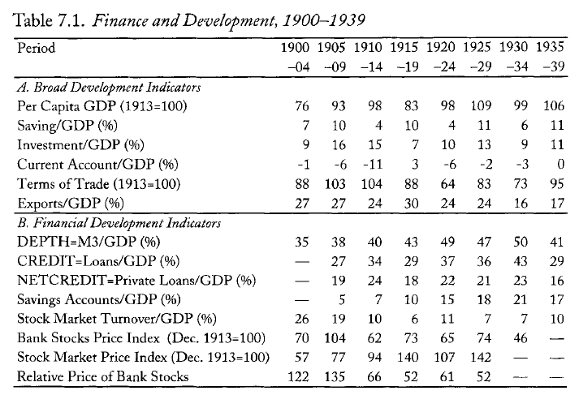{fig-align="center" width="70%"}

::: {.fuente}
Della Paolera y Taylor, en Gómez (2018). El PBI per cápita (1913=100) sube a 109 en 1925–29 y **cae a 99** en 1930–34.
:::

## [2.8] El PBI y la manufactura en perspectiva larga

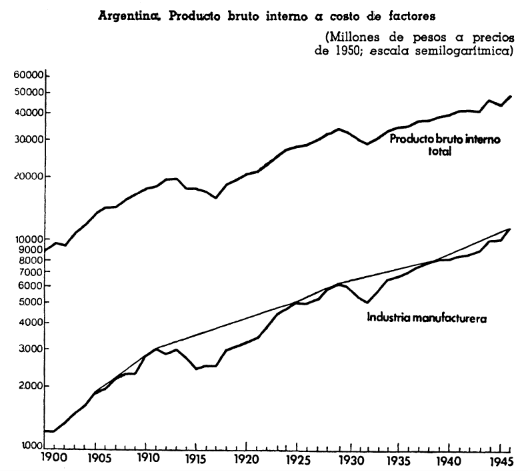{fig-align="center" width="65%"}

::: {.fuente}
Villanueva (1972), Gráfico 1. Crecimiento continuo sin ruptura en 1930: la manufactura de 1913 (3.050 M) llega a 6.244 M en 1929 y 11.823 M en 1946.
:::

<!-- SCREENCAP → Villanueva (1972), Gráfico 1: gráfico semilogarítmico con líneas de PBI total y manufacturero, 1900-1945 -->

# Bloque 3. El origen de la industrialización {background="#1f3a5f"}

## [3.1] La historia oficial y sus problemas

- La versión canónica: **la industrialización argentina nació con la Gran Depresión** (1930), cuando el colapso de las EXP forzó la sustitución de IMP. Problema: **no mira los datos** —o los mira con el sesgo ()"punto de quiebre").

::: {.callout-important icon=false title="La 'versión olímpica'"}
> "A los latinoamericanos, con frecuencia, nos parece que nuestra historia de uso corriente en los círculos internacionales hubiera sido escrita desde el Olimpo; tal es el grado de bruma en los detalles y tal la aplicación forzada de esquemas teóricos preconcebidos."
:::

::: {.callout-note icon=false title="Villanueva y Gerchunoff-Llach: coincidencia y matiz"}
Gerchunoff y Llach **coinciden con Villanueva** en el diagnóstico sobre el origen de la industrialización: el crecimiento industrial fue real y anterior a 1930. Pero añaden una dimensión: ese proceso, verdadero y verificable, no alcanzó para sostener la **convergencia relativa** con los países ricos. El fenómeno industrial fue genuino; su suficiencia, discutida.
:::

::: {.fuente}
Villanueva (1972); Gerchunoff y Llach (2007), cap. 2.
:::

## [3.2] La industria nació en los años veinte

> "La industria 'moderna' se inicia realmente en la **década del veinte** —especialmente en los últimos años de dicha década—, período en el que se observa un elevado nivel de inversión industrial y de importación de equipos para el mismo sector y la entrada de numerosas empresas extranjeras."

::: {.fuente}
Villanueva (1972).
:::

- En **1935**, el **78%** de la producción industrial venía de empresas fundadas **antes de 1930**.
- En **1946**, aún el **60%** venía de firmas establecidas antes de la Depresión.

## [3.3] El pico de inversión en maquinaria, 1924–1930

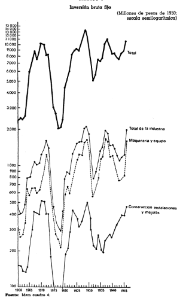{fig-align="center" width="65%"}

::: {.fuente}
Villanueva (1972), Gráfico 3. El período **1924–1930** tiene el mayor promedio histórico de importación de maquinaria. La Depresión lo interrumpe; el nivel post-1935 queda por debajo.
:::

<!-- SCREENCAP → Villanueva (1972), Gráfico 3: tres paneles de inversión bruta fija (1900-1945), destacar pico 1924-1930 en el panel de maquinaria y equipos -->

## [3.4] La oleada de empresas extranjeras

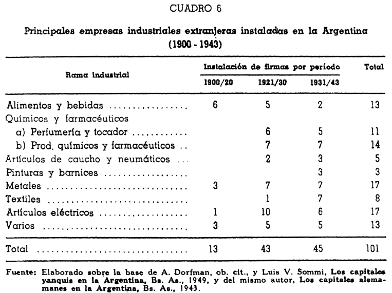{fig-align="center" width="72%"}

::: {.fuente}
Villanueva (1972), Cuadro 6. En **1921–1930** entraron **43 grandes empresas** (vs. 13 en 1900–1920). Sectores principales: química, eléctrica, metales.
:::

<!-- SCREENCAP → Villanueva (1972), Cuadro 6: tabla de empresas extranjeras por sector (filas) y período de instalación (columnas): 1900/20, 1921/30, 1931/43 -->

## [3.5] Patentes extranjeras: tecnología importada

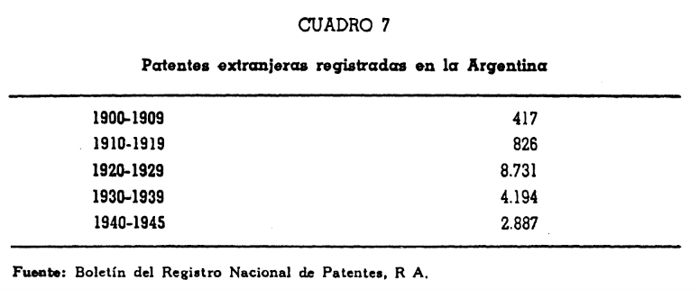{fig-align="center" width="65%"}

::: {.fuente}
Villanueva (1972), Cuadro 7. En los **años veinte**: **8.731 patentes** —el **10,5×** de la década anterior y el **2,1×** de la siguiente—. Indicador de transferencia tecnológica masiva.
:::

<!-- SCREENCAP → Villanueva (1972), Cuadro 7: patentes extranjeras registradas por década (presentar como gráfico de barras o tabla) -->

## [3.6] Energía industrial: el termómetro más preciso

| Período | Consumo promedio anual (millones de kWh) |
|---------|:----------------------------------------:|
| 1910–1919 | 38,5 |
| 1921–1925 | 114,2 |
| **1927–1930** | **356,6** |
| 1931–1935 | 612,0 |
| 1936–1939 | 942,5 |

::: {.fuente}
Villanueva (1972), Cuadro 5. El consumo se triplicó dos veces **antes de 1930**. La aceleración no nació con la Depresión.
:::

## [3.7] Participación sectorial: la transición continua

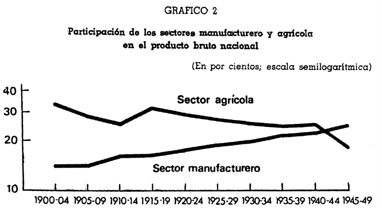{fig-align="center" width="65%"}

::: {.fuente}
Villanueva (1972), Gráfico 2. Manufactura: 14,0% (1900–04) → 18,4% (1925–29) → 19,3% (1930–34) → 24,5% (1945–49). **No hay inflexión en 1930**: la tendencia es lineal.
:::

<!-- SCREENCAP → Villanueva (1972), Gráfico 2: líneas de participación de sectores agrícola y manufacturero en el PBN, 1900-1949 -->

# Bloque 4. El sistema financiero que no alcanzó {background="#1f3a5f"}

## [4.1] Monetización sí, crédito no

- La economía se **monetizó**: cuentas de ahorro de **8% a 22%**, monetización de **46% a 55%** entre 1913–14 y 1928–29.
- Pero la **profundidad** (M3/PBI) crecía sin traducirse en **crédito**: el **crédito privado** cayó en la guerra, se recuperó en los 20 y volvió a caer en la Depresión.

::: {.callout-important icon=false title="La paradoja financiera"}
Más depósitos **no** significaron más crédito a la inversión —la mejor medida del desarrollo financiero—.
:::

## [4.2] Dependencia de una sola entidad

- El **BNA** concentraba **2/5** de todos los activos bancarios: sin banco central, cumplía un rol **cuasi-público**.
- La mitad del stock de capital de 1913 era **extranjero** (mayormente británico). En los años veinte, el capital **estadounidense** comenzó a ganar terreno en el sector industrial —con menor vocación de largo plazo que el capital británico en infraestructura—.
- El mercado de **renta variable** era casi inexistente: las empresas dependían de la banca comercial (corto plazo) y de sus propias utilidades (largo plazo).

## [4.3] La restricción de capital

- Sin capital extranjero entre **1914 y 1945**, Argentina debía financiar su inversión con **ahorro doméstico**.
- El sistema financiero **no pudo**: falló en sus dos tareas —**movilizar** más capital y **asignarlo con eficiencia**—.

::: {.callout-tip icon=false title="Idea clave"}
Un mayor desarrollo financiero podía sumar hasta **0,5% de crecimiento** anual. Argentina quedó muy lejos: la restricción de capital se volvió **retraso económico**.
:::

## [4.4] El BNA en perspectiva comparada {.tight}

| Indicador | BNA (1920–27) | Banco de Inglaterra | Bancos EE.UU. |
|-----------|:-------------:|:-------------------:|:-------------:|
| Reservas/Depósitos | 28% | 17% | 21% |
| Capital/Activos | 9% | 10% | 6% |

| Indicador | Sistema arg. (1920–27) | Sistema UK | Sistema EE.UU. |
|-----------|:---------------------:|:----------:|:--------------:|
| Reservas/Depósitos | 29% | — | — |

::: {.fuente}
Gómez (2018), Cuadros 7 y 9. El BNA era **más líquido** que sus pares anglosajones, pero la solvencia (capital/activos) se iba deteriorando por la presión del Estado.
:::

# Bloque 5. El frente externo y la vuelta al oro {background="#1f3a5f"}

## [5.1] La balanza de pagos

- Comportamiento **diverso**: positiva en 1919–21, negativa en 1921–24 (crisis internacional y deflación), positiva desde 1925.
- El movimiento más notable: la **cuenta capital** se revierte de negativa a **positiva** —vuelve a entrar capital—.
- La **balanza comercial** sigue superavitaria, pero con saldos **más bajos** que durante la guerra.

## [5.2] El revival del patrón oro

- La suspensión mundial de 1914–19 dio paso a un breve **regreso al oro** en la segunda mitad de los 20.
- Fue un **patrón oro lingote** sin acuñación (idea de **Ricardo**): **Gran Bretaña** vuelve en **1925** y, hacia el fin de la década, casi **50 países** operan bajo patrón oro.

::: {.callout-note icon=false title="Un patrón oro de cambio, no el clásico"}
El sistema restaurado era un *gold exchange standard*: los países sostenían reservas en **libras y dólares**, no solo en oro. Eso introducía un factor adicional de fragilidad: si la confianza en esas monedas caía, el sistema podía derrumbarse en cascada.
:::

::: {.fuente}
Gerchunoff y Llach (2007), cap. 2; Gómez (2018).
:::

## [5.3] El patrón oro reconstruido

- La reconstrucción del patrón oro fue **incompleta e inestable**:
  - **Gran Bretaña** volvió en **1925** a la paridad de preguerra (4,86 $/£): una **libra sobrevaluada** que encareció las exportaciones británicas y deprimió su economía
  - Sin un verdadero prestamista de última instancia global, el sistema dependía de la coordinación entre la **Reserva Federal** y el **Banco de Inglaterra** —coordinación que se rompió en 1928–29—.
- El resultado fue un **sesgo deflacionario** que recorría todo el sistema: países atados a libras sobrevaluadas ajustaban con recesión, no con devaluación.

::: {.callout-note icon=false title="Argentina vs. Gran Bretaña"}
Argentina volvió al oro en **1927 a 2,27 $/£**: aproximadamente la paridad de **1902**, lo que implicaba una **depreciación real moderada** respecto al pico de preguerra. Menos distorsionante que la vuelta británica, pero igual de atada a un sistema frágil.
:::

::: {.fuente}
Gerchunoff y Llach (2007), cap. 2.
:::

## [5.4] La Caja en autorregulación (1919–27)

- El papel moneda inconvertible con tipo de cambio flexible **continuó hasta 1927**.
- La base monetaria **no siguió** a las reservas: en el **82%** de las bajas y el **75%** de las subas de reservas, la BM **no varió**.
- Con la balanza de pagos positiva, en **1927 el tipo de cambio igualó al de 1902**.

## [5.5] Autorregulación: la nube

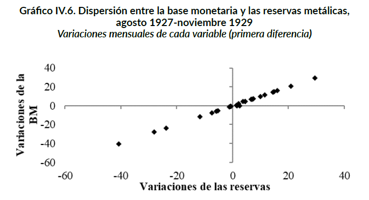{fig-align="center" width="58%"}

::: {.fuente}
Gómez (2018). Muchos puntos sobre el eje ΔBM = 0: la base **no responde** a las reservas.
:::

## [5.6] La vuelta al patrón oro (1927)

- En **1927** se levanta la suspensión: durante **28 meses** Argentina vuelve a un patrón oro convertible a **2,27**.
- Vuelve también el **trilema macroeconómico**.
- Los datos confirman que en esos meses el país siguió la **Currency School**: **correlación estricta** entre reservas y base monetaria.

## [5.7] Currency School: la recta

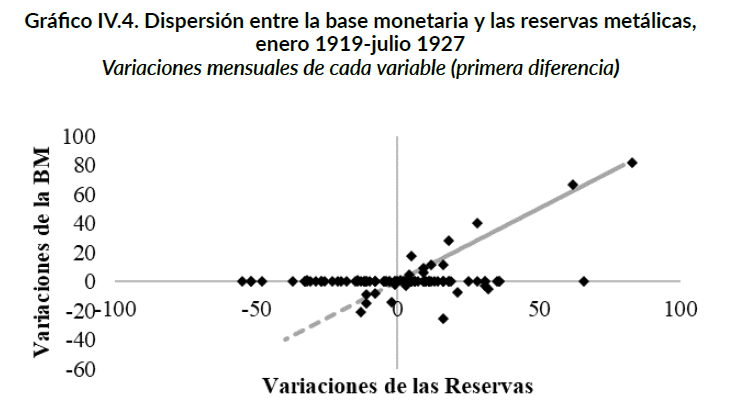{fig-align="center" width="58%"}

::: {.fuente}
Gómez (2018). Ahora los puntos se alinean: la base **sigue** a las reservas casi uno a uno.
:::

## [5.8] El FDC vuelve a financiar al Estado

- Tras usar 20 millones durante la guerra, el remanente de **10 millones** se destinó a pagar **servicios de deuda** en 1924.
- Entre **1925 y 1928** se reintegraron los **30 millones**… pero el origen de los fondos fue el **Estado**: se financió déficit acumulado vía un giro del Tesoro convertido a deuda en pesos.

# Bloque 6. El Estado y el BNA {background="#1f3a5f"}

## [6.1] Las cuentas públicas

- Tras el equilibrio de 1920, las cuentas se **deterioraron**: el resultado **financiero** fue siempre negativo; el **primario**, positivo solo de 1923 a 1926.
- Lo más importante: un **aumento de la participación del Estado** en la economía.

## [6.2] El gasto público crece

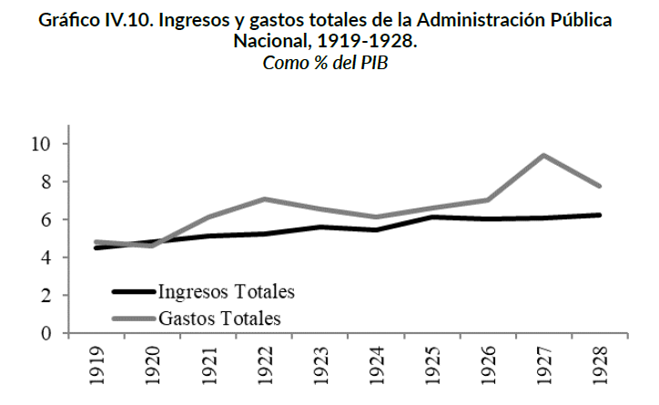{fig-align="center" width="60%"}

::: {.fuente}
Gómez (2018). El **gasto** se despega de los ingresos —el pico de 1927 marca la brecha—.
:::

## [6.3] Los tres mecanismos de financiamiento {.tight}

El Estado encontró **tres vías** para acceder al crédito del BNA más allá del límite legal del 20%:

1. **Letras de Tesorería** (principal, 1921–27): redescuento de títulos del Tesoro; crecieron **21,3% anual** entre 1915 y 1924; alcanzaron **280 millones de pesos** (1926).
2. **Préstamos oficiales**: Ley 10.350 (200 millones pesos oro para compra de granos, 1918); en declive desde 1920.
3. **Fondos públicos**: inversión en títulos dentro del límite formal del 20%.

::: {.fuente}
Gómez (2018), Gráfico 8.
:::

<!-- SCREENCAP → Gómez (2018) / "La Caja y el Banco 1914-1928.pdf" (Parte 1), Gráfico 8: tres fuentes extraordinarias de crédito al Estado (préstamos oficiales, fondos públicos, letras de tesorería), 1914-1928 — el mismo gráfico que lec-06 [5.11] -->

## [6.4] Los redescuentos en los años veinte

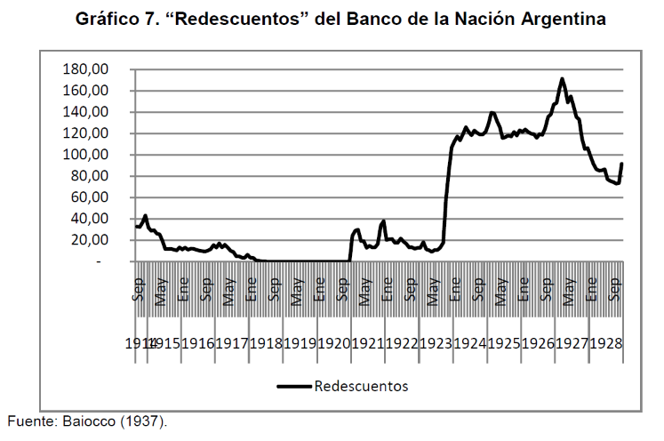{fig-align="center" width="62%"}

::: {.fuente}
Gómez (2018), Gráfico 7. Niveles bajos hasta 1920; **crecimiento acelerado 1921–1927** (pico: ~145 millones de pesos). Caída post-1927 coincide con el retorno al oro.
:::

<!-- SCREENCAP → Gómez (2018) / "La Caja y el Banco 1914-1928.pdf" (Parte 1), Gráfico 7: redescuentos del BNA, 1914-1928 -->

## [6.5] El BNA sostiene el sistema

- Desde **1923**, el BNA usa fuertemente los **redescuentos** para sostener al sistema bancario: entre 1923 y 1928 representan del **15% al 30%** de las reservas de los bancos.
- Fuerte contraste con la guerra, cuando solo fueron importantes en 1914.

## [6.6] El BNA financia al Estado

- El BNA siguió siendo la **principal fuente** de financiamiento del Estado: saldos deudores por encima del **límite legal**, redescuento creciente de Letras de Tesorería y nuevas partidas.

::: {.callout-important icon=false title="El costo oculto"}
Financiar al Estado le impidió al BNA sostener su sólida posición de reservas —y lo dejó más expuesto cuando llegara el shock de 1929—.
:::

## [6.7] Lo que costó financiar al Estado

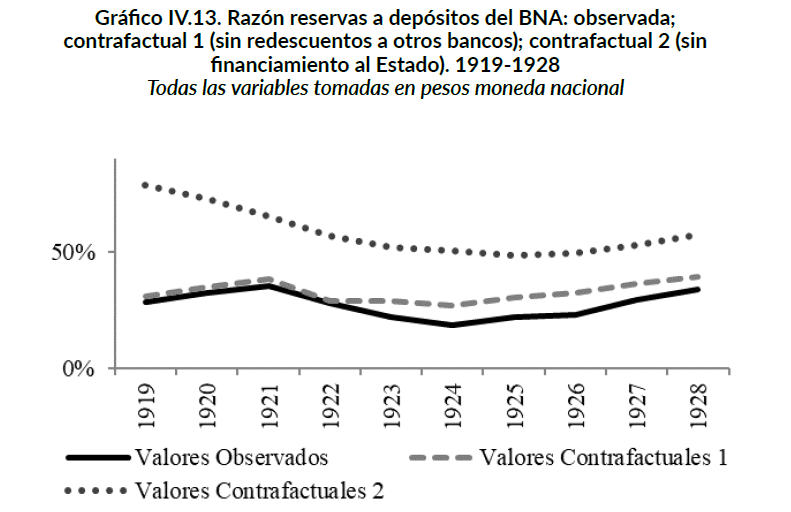{fig-align="center" width="60%"}

::: {.fuente}
Gómez (2018). Sin financiar al Estado (contraf. 2), el ratio habría sido ~**30 puntos** mayor; sin redescontar a otros bancos (contraf. 1), apenas **6**.
:::

## [6.8] El BNA en perspectiva comparada {.tight}

| Indicador | BNA observado | BNA sin Estado (contrafact.) | Banco de Inglaterra | Bancos EE.UU. |
|-----------|:-------------:|:----------------------------:|:-------------------:|:-------------:|
| Capital/Activos | 10,2% | **13,0%** | 10% | 6% |
| Reservas/Depósitos | 28% | ~38% | 17% | 21% |

::: {.fuente}
Gómez (2018), Cuadros 9 y 10. El contrafactual eleva al BNA **3 puntos porcentuales** en capital/activos (significativo al 5%). Sin la presión estatal, el BNA era la entidad **más sólida** del cuadro comparado.
:::

# Cierre {background="#1f3a5f"}

## Ideas fuerza {.tight}

1. Los **gobiernos radicales** ampliaron la democracia política pero no reformaron la estructura agraria —el modelo agroexportador siguió intacto—. YPF fue la excepción, no la regla.
2. La **reforma arancelaria de 1923** (Alvear) y la **oleada de inversión extranjera** (1924–30) son el verdadero origen de la industria moderna argentina —no la Gran Depresión— (Villanueva).
3. Los años 20 son el **cambio de régimen**: de la convergencia a la **divergencia** relativa. La desaceleración no fue coyuntural.
4. La economía se **monetizó**, pero el sistema financiero **no** movilizó el crédito que la inversión necesitaba.
5. La Caja pasó de la **autorregulación** (1919–27) a la **Currency School** con la vuelta al oro (1927–29).
6. El **Estado** ganó peso y el **BNA** lo financió, a costa de su propia solidez —vulnerabilidad que quedará expuesta en 1929—.
7. La prosperidad de los veinte fue en parte una **ilusión** (Gerchunoff y Llach): dependía de un orden internacional frágil —el Plan Dawes reciclaba deuda, no creaba riqueza genuina— y de una hegemonía británica ya en declive.
8. El **triángulo comercial** Gran Bretaña-Argentina-Estados Unidos era el talón de Aquiles del modelo agroexportador: si Gran Bretaña perdía poder de compra y EE.UU. cerraba sus mercados, los precios de los *commodities* argentinos caerían —independientemente de lo que hicieran los gobiernos radicales—.

## Preguntas para llevarse

- Si volver al oro restauró la regla dura, ¿qué pasa cuando llegue un **shock global**?
- ¿Fue el atraso un problema de **política** (radicales, elección de régimen) o de **estructura** (ahorro, capital, demografía, orden internacional)?
- ¿Podían los gobiernos radicales haber reformado el modelo —o estaban prisioneros de una estructura internacional que no controlaban? ¿Cuánto margen de acción tenían?
- ¿Habría seguido industrializándose Argentina sin la Depresión? ¿O el **shock de 1929** fue necesario para completar el proceso de sustitución de importaciones?
- Puente a la clase 08: en **1929** el mundo se derrumba —la **Gran Depresión** y el giro **intervencionista**—.

## Bibliografía de la clase

**Obligatoria**

- **Gómez, M. (2018).** *Los avatares de la primera Caja de Conversión…*, **caps. 4 a 7**.
- **Villanueva, J. (1972).** El origen de la industrialización argentina. *Desarrollo Económico*, 12(47), 451–476.
- **Gerchunoff, P. y Llach, L. (2007).** *El ciclo de la ilusión y el desencanto*. Ariel. **Cap. 2: "Un mundo en busca de la estabilidad perdida"**.

**Complementaria**

- **Gerchunoff, P. y Aguirre, H. (2006).** *La economía argentina entre la gran guerra y la gran depresión*. CEPAL.

::: {.fuente}
La bibliografía completa por unidad está en el programa de la asignatura.
:::

<!--
Notas de uso (no proyectar):
- Unidad 2, clase 07. Fuentes: lect05.tex (Gómez 2018, "Los años veinte, 1919-1928") +
  Villanueva (1972) para bloque 3 completo + Gómez (2018) / "La Caja y el Banco 1914-1928"
  para Gráficos 7, 8 y comparativos (Cuadros 7, 9, 10) + Gerchunoff y Llach (2007) cap. 2
  para bloques 1 (slides 1.4, 1.7), 2 (slides 2.2, 2.3, 2.4), 3 (slide 3.1) y 5 (slide 5.3).
- NUEVOS SLIDES vs VERSIÓN ANTERIOR:
  [1.4] — callout ampliado con G&L sobre viraje del capital extranjero (UK→US).
  [1.7] — NUEVO: los radicales y el modelo agroexportador (G&L: reforma política sin reforma
          económica estructural; YPF como excepción).
  [2.1] — fuente ampliada con G&L.
  [2.2] — NUEVO: "Un mundo sin ancla" (G&L cap. 2: fin del orden liberal pre-1914).
  [2.3] — NUEVO: "El triángulo comercial" (G&L: desequilibrio UK-Argentina-EE.UU.).
  [2.4] — NUEVO: "La ilusión del Plan Dawes" (G&L: reciclaje de deuda como base de la
          prosperidad de los 20; fragilidad estructural).
  [2.5]–[2.8] — renumerados desde [2.2]–[2.5] de la versión anterior, sin cambios.
  [3.1] — callout nuevo con contraste Villanueva/G&L (coincidencia en diagnóstico,
          divergencia en consecuencias para la convergencia relativa).
  [4.2] — adición sobre el viraje UK→US en composición del capital externo.
  [5.2] — callout nuevo sobre gold exchange standard y fragilidad adicional (G&L).
  [5.3] — NUEVO: "El patrón oro reconstruido, pero mal" (G&L: libra sobrevaluada,
          sesgo deflacionario, coordinación Fed-Banco de Inglaterra; Argentina vuelve
          a 2.27 — menos distorsionante pero igual de atada al sistema).
  [5.4]–[5.8] — renumerados desde [5.3]–[5.7] de la versión anterior, sin cambios.
  [Cierre/Ideas fuerza] — ideas 7 y 8 nuevas (G&L: ilusión de los 20, triángulo comercial).
  [Cierre/Preguntas] — pregunta nueva sobre margen de acción radical vs. determinismo externo.
  [Cierre/Bibliografía] — G&L (2007) cap. 2 pasa de complementaria a obligatoria;
                          Gerchunoff y Aguirre (2006) permanece en complementaria.
- FIGURAS A SCREENCAPEAR (nuevas, paths pendientes):
  [2.8] Villanueva (1972), Gráfico 1 → PBI total y manufacturero semilogarítmico, 1900-1945
        → guardar como: fig-chart-pbi-total-manufacturero-1900-1945.png
  [3.3] Villanueva (1972), Gráfico 3 → tres paneles inversión bruta fija, destacar 1924-1930
        → guardar como: fig-chart-inversion-bruta-fija-villanueva.png
  [3.4] Villanueva (1972), Cuadro 6 → tabla empresas extranjeras por sector y período
        → guardar como: fig-table-empresas-extranjeras-villanueva.png
  [3.5] Villanueva (1972), Cuadro 7 → patentes extranjeras por década
        → guardar como: fig-chart-patentes-extranjeras-villanueva.png
  [3.7] Villanueva (1972), Gráfico 2 → participación sectorial en PBN, 1900-1949
        → guardar como: fig-chart-participacion-sectorial-villanueva.png
  [6.4] "La Caja y el Banco 1914-1928" (Parte 1), Gráfico 7 → redescuentos BNA 1914-1928
        → guardar como: fig-chart-redescuentos-bna-1914-1928.png
  [6.3] mismo que lec-06 [5.11] (Gráfico 8) — reutilizar mismo screencap
- FIGURAS EXISTENTES (mantener paths actuales):
  fig-table-finance-and-development-1900-1939,
  fig-chart-dispersion-bm-reservas-1919-1927,
  fig-chart-dispersion-bm-reservas-1927-1929,
  fig-chart-ingresos-gastos-apn-1919-1928,
  fig-chart-contrafactual-bna-1919-1928
- Hilo narrativo (versión G&L integrada):
  Un mundo en busca de la estabilidad perdida → radicales heredan un modelo pero no lo
  reforman → triangulo comercial + ilusión de Dawes sostienen artificialmente los 20 →
  boom industrial real (Villanueva) pero insuficiente para la convergencia (G&L) → sistema
  financiero que no moviliza crédito → vuelta al oro 1927 sobre un sistema reconstruido mal
  (libra sobrevaluada, gold exchange) → BNA financia al Estado → vulnerabilidad acumulada
  → 1929 expone la ilusión.
- Overflow: verificar con `node _check-overflow.mjs lec-07-*.html`; aplicar .tight/.smaller.
-->
