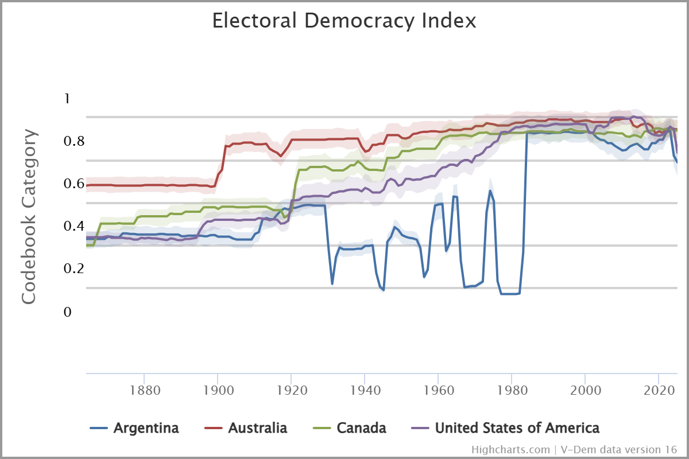
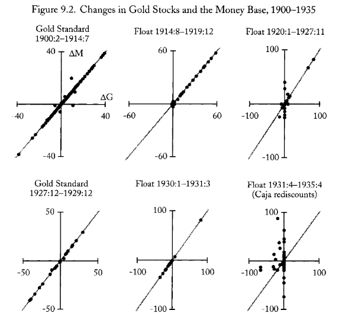
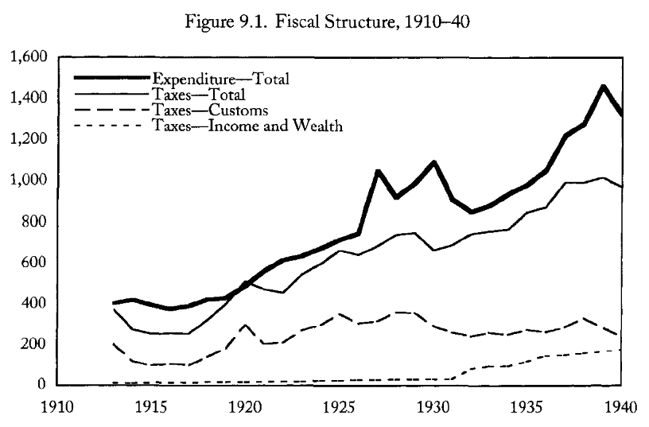

# Apertura y hoja de ruta {background="#1f3a5f"}

## Una imagen dice más que...

{fig-align="center" width="75%"}

## Dónde quedamos

- La crisis de 1929 **quebró el patrón oro**: suspensión, controles, devaluación y creación del **BCRA (1935)**.
- La respuesta monetaria fue **reactiva al principio**, pero derivó en un **régimen de controles** sin precedentes.
- Miramos la crisis desde la **política económica**: ¿qué hicieron los gobiernos de la Década Infame? ¿Defensa del *status quo* o nacimiento del **Estado intervencionista**?

::: {.callout-tip icon=false title="Idea clave"}
La Década Infame fue un tiempo en que **el Estado aprendió a administrar la economía** mediante controles, aranceles selectivos y comercio bilateral.
:::

## La pregunta de hoy

> Si la Gran Depresión fue un shock externo, ¿por qué la respuesta argentina terminó **reforzando** la orientación hacia Gran Bretaña? ¿Fue el giro intervencionista una **elección** o una **trampa**? ¿Y quién pagó el costo de la recuperación?

## Mapa de la clase

1. **Bloque 1 — El golpe de 1930 y la Década Infame:** política y economía.
2. **Bloque 2 — La vulnerabilidad de una economía abierta:** el ciclo económico argentino según O'Connell.
3. **Bloque 3 — El Pacto Roca-Runciman (1933):** bilateralismo y controversia.
4. **Bloque 4 — El giro intervencionista:** Juntas Reguladoras, comercio selectivo, creación del BCRA.
5. **Bloque 5 — Recuperación y sus límites:** 1933–1939.

# Bloque 1. El golpe de 1930 y la Década Infame {background="#1f3a5f"}

## [1.1] El 6 de septiembre de 1930

- El general **José Félix Uriburu** encabezó el **primer golpe de Estado** de la historia argentina (en siglo XX)
- El objetivo declarado: "restaurar" los valores de la república conservadora, combatir el "caos" radical y la "demagogia".
- En la práctica: **fraude electoral sistemático**, proscripción de la UCR, y un régimen que legitimó el poder por vía de la **"Concordancia"** (coalición conservadora).

::: {.callout-important icon=false title="El precio de la estabilidad política"}
La Década Infame compró "orden" con **degradación institucional**: elecciones fraudulentas, intervención federal en pcias. opositoras y legitimidad política cada vez más débil.
:::

## [1.2] De Uriburu a Justo

- **Uriburu (1930–32)**: intentó crear un partido nacionalista de corte corporativo; fracasó. Su política económica fue **ortodoxa**: ajuste fiscal, defensa del patrón oro ya caído.
- **Agustín P. Justo (1932–38)**: representaba el ala "moderna" del conservadurismo. Frente a la crisis, adoptó una política **pragmática**: controles de cambios, negociación comercial bilateral, intervención selectiva.
- **Roberto M. Ortiz (1938–40)** y **Ramón S. Castillo (1940–43)**: continuaron la línea, con creciente tensión entre alianza británica y presión estadounidense.

::: {.fuente}
Gerchunoff y Llach (2007), cap. 3.
:::

## [1.3] La Década Infame en perspectiva

- El régimen no fue un mero "retorno al pasado": fue una **adaptación** del modelo agroexportador a un mundo sin patrón oro ni flujos de capital libres.
- Terratenientes, bancos extranjeros e industriales negociaron dentro de un Estado que, por primera vez, **administraba activamente** la economía.

::: {.callout-note icon=false title="¿Continuidad o cambio?"}
Gerchunoff y Llach destacan la **paradoja** de los treinta: el régimen conservador terminó construyendo las **herramientas del intervencionismo**.
:::

::: {.fuente}
Gerchunoff y Llach (2007), cap. 3.
:::

# Bloque 2. La vulnerabilidad de una economía abierta {background="#1f3a5f"}

## [2.1] El ciclo económico argentino

- Hacia fines de los años veinte, Argentina tenía un **ciclo económico propio**.
- Las exportaciones representaban el **24% del PBI** y el **67% de la demanda final** del sector rural.
- El capital extranjero poseía el **32% del capital fijo**.

::: {.callout-tip icon=false title="Una economía pequeña y abierta"}
O'Connell: Argentina no era un "país pequeño" estándar; sus exportaciones **influían sobre precios mundiales**.
:::

::: {.fuente}
O'Connell (1984).
:::

## [2.2] Inestabilidad antes de 1929

- Los **términos de intercambio** ya eran volátiles.  Promedio de los años veinte $\longrightarrow$ **27% por debajo** de 1913.
  - Caen 24% (1919–22), suben 37% (1923-25), caen 10% (1926–27), suben 35% (1928), caen 7% (1929).
- El **servicio de la deuda externa** absorbía el 31% de las exportaciones y el 8,5% del PBI.

::: {.callout-important icon=false title="La deuda como ancla"}
Argentina necesitaba **nuevos capitales** cada año solo para pagar deuda. El ajuste lucía inevitable --luego de crecimiento del gasto 1928-1930, entre 1931-33 una fuerte baja. 
:::

::: {.fuente}
O'Connell (1984); CEPAL (1959).
:::

## [2.3] Mecanismos de transmisión

- El sistema fiscal dependía excesivamente de las importaciones: las **tres cuartas partes** de los ingresos corrientes provenían de aranceles y gravámenes a la importación.
- El sistema monetario, sin Banco Central hasta 1935, transmitía los shocks externos de manera **rígida**: la creación primaria de dinero dependía del flujo de oro y divisas.
- Resultado: un país **sin autonomía de política económica** ante los shocks externos.

::: {.fuente}
O'Connell (1984).
:::

## [2.3] Mecanismos de tranmisión (cont.)

{fig-align="center" width="75%"}

## [2.4] La crisis: 1929–1932

- **Precios rurales** cayeron 45,5% (1928–1932); precios no rurales, apenas 4,1%.
- **Términos de intercambio interno** (rural/no rural) cayeron 47,3%: transferencia masiva de ingreso del campo a la ciudad.
- PBI real cayó; desocupación subió; importaciones se derrumbaron.

::: {.callout-important icon=false title="¿Quién pagó la crisis?"}
Los productores agropecuarios asumieron el costo principal. La ciudad se industrializó a costa del campo.
:::

::: {.fuente}
O'Connell (1984).
:::

## [2.5] La estructura fiscal

{fig-align="center" width="75%"}

# Bloque 3. El Pacto Roca-Runciman {background="#1f3a5f"}

## [3.1] El contexto: Ottawa y el imperial preference

- En **1932** el Imperio Británico adoptó el **"imperial preference"** en Ottawa: aranceles preferenciales para los dominios y colmenas, a costa de los proveedores externos.
- La Argentina, aunque no era colonia, dependía del mercado británico para el **61% de sus exportaciones de carne** y una parte crucial de sus cereales.
- Si Gran Bretaña cerraba su mercado, el modelo agroexportador argentino **colapsaba**.

::: {.fuente}
Gerchunoff y Llach (2007), cap. 3; O'Connell (1984).
:::

## [3.2] La negociación de 1933

- En **mayo de 1933**, el vicepresidente **Julio A. Roca** firmó en Londres el **Pacto Roca-Runciman**.
- Cláusulas principales:
  1. Gran Bretaña mantenía importaciones de carne y cereales argentinos.
  2. Argentina **no aplicaría aranceles discriminatorios** contra productos británicos.
  3. Garantía de **libre traslado de utilidades** y pago de la deuda en libras.

::: {.callout-note icon=false title="La lógica del pacto"}
Para terratenientes y bancos británicos, era **vital**. Para industriales, una **entrega de soberanía**.
:::

::: {.fuente}
Gerchunoff y Llach (2007), cap. 3.
:::

## [3.3] Las controversias

- **Scalabrini Ortiz** y los nacionalistas denunciaron el pacto como rendición a los intereses británicos.
- Los críticos señalaron que **consagró la orientación hacia un solo mercado** y reforzó estructuras monopólicas.
- Los defensores argumentaron que, sin el pacto, las exportaciones habrían caído aún más.

::: {.callout-important icon=false title="Una pregunta estructural"}
¿Podía diversificar sus mercados en 1933? O'Connell señala que la complementariedad con EE.UU. era escasa: producía los mismos bienes que Argentina exportaba.
:::

::: {.fuente}
O'Connell (1984); Gerchunoff y Llach (2007), cap. 3.
:::

## [3.4] El acuerdo suplementario

- En **septiembre de 1933** se firmó el acuerdo suplementario:
  - Reducciones o consolidaciones de aranceles para más de **300 ítems** de interés británico.
  - Estas concesiones se extendían a terceros países por la cláusula de **"nación más favorecida"**.
- El sistema de **bilateralismo** se replicó con otros países europeos (Alemania, Italia, etc.), pero el acuerdo con Gran Bretaña fue el eje.

::: {.fuente}
O'Connell (1984).
:::

# Bloque 4. El giro intervencionista {background="#1f3a5f"}

## [4.1] Del laissez-faire al control

- **Control de cambios** (1931): el Estado administraba divisas.
- **Juntas Reguladoras** de Granos, Carnes y Algodón: fijaban **precios mínimos**.
- **Control selectivo de importaciones**: permisos previos, cuotas, licitaciones.
- **Impuesto a los réditos** (1932): primer impuesto directo a la renta personal.

::: {.callout-tip icon=false title="Intervencionismo de emergencia"}
Medidas de **emergencia** se consolidaron como **política permanente**.
:::

::: {.fuente}
O'Connell (1984); Gerchunoff y Llach (2007), cap. 3.
:::

## [4.2] Las Juntas Reguladoras

- Creadas entre 1933 y 1936 para defender precios agropecuarios.
- La **Junta de Granos** compraba cosechas a precios mínimos y vendía en el exterior; las pérdidas se financiaban con **ganancias del margen de cambio**.
- Problema: Argentina carecía de **silos y almacenamiento**. No podía retener cosechas como Brasil con el café.

::: {.callout-note icon=false title="El límite físico"}
Sin infraestructura de almacenaje, las Juntas podían fijar precios mínimos, pero no manipular stocks a gran escala.
:::

::: {.fuente}
O'Connell (1984).
:::

## [4.3] Política comercial y discriminación

- Sistema de **dos mercados de cambio** usado como **arma comercial**:
  - Importaciones británicas al **tipo oficial** (más barato).
  - Importaciones de EE.UU. y otros al **mercado libre** (más caro).
- En **1935**, **recargo del 20%** sobre importaciones del mercado libre.

::: {.callout-important icon=false title="El costo de la preferencia"}
Benefició a importadores británicos, pero encareció bienes de capital de EE.UU.
:::

::: {.fuente}
O'Connell (1984); Salera (1941).
:::

## [4.4] La creación del BCRA (1935)

- El **BCRA** se creó en marzo de 1935 (Ley 12.155).
- Fue parte del **giro intervencionista**: centralizó emisión, reguló crédito y administró controles de cambios.
- Su directorio incluía **representantes de bancos extranjeros**, lo que generó críticas sobre autonomía nacional.

::: {.callout-note icon=false title="¿Reforma o contrarreforma?"}
Para nacionalistas, reforzó la subordinación financiera. Para técnicos, era la **condición necesaria** para autonomía monetaria.
:::

::: {.fuente}
Gómez (2018), Cap. VI; O'Connell (1984).
:::

# Bloque 5. Recuperación y sus límites {background="#1f3a5f"}

## [5.1] La recuperación: 1933–1937

- A partir de **1933**, la actividad comenzó a recuperarse.
- Causa principal: **aumento de precios mundiales** de cereales por sequías en Norteamérica y Australia.
- Precios del trigo subieron **80%** (1933–34 a 1936–37).
- **Valores de exportación** crecieron 128% (1932–1937).

::: {.callout-important icon=false title="'Dios es argentino'"}
La recuperación dependió de una **sequía en los competidores**. Los términos de intercambio volvieron al nivel de 1928 en 1937.
:::

::: {.fuente}
O'Connell (1984); Revista Económica (1937).
:::

## [5.2] Crecimiento industrial

- La industria creció durante la Depresión: el empleo industrial aumentó un **14%** entre los quinquenios 1930–34 y 1935–39.
- La sustitución de importaciones se aceleró: bienes de consumo no durables primero, luego intermedios.
- Pero el crecimiento fue **desigual**: concentrado en Buenos Aires y en industrias de bajo valor agregado.

::: {.callout-note icon=false title="La industrialización de los treinta"}
La industria creció, pero no por política industrial deliberada: creció porque el **cierre de importaciones** (por falta de divisas) creó un **mercado cautivo** para la producción local.
:::

::: {.fuente}
O'Connell (1984); Gerchunoff y Llach (2007), cap. 3.
:::

## [5.3] Distribución del ingreso

- Los **términos de intercambio internos** mejoraron a favor del campo: subieron 53% (1933–1937).
- Pero los **salarios reales** tendieron a disminuir entre los dos quinquenios.
- Las **ganancias urbanas** crecieron a expensas de salarios e ingreso rural.

::: {.callout-important icon=false title="Ganadores y perdedores"}
Redistribución hacia **sectores urbanos no asalariados** y **propietarios rurales**. Los **asalariados** perdieron participación.
:::

::: {.fuente}
O'Connell (1984).
:::

## [5.4] Los límites estructurales

- A pesar de la recuperación, quedaron **vulnerabilidades**:
  - Dependencia del **mercado británico** consagrada por Roca-Runciman.
  - Industrialización **fragmentada**: sin política deliberada.
  - **Fiscalidad débil**: el Estado dependía de aranceles.
  - **BCRA débil**: capital mixto y mandato confuso.

::: {.callout-tip icon=false title="Idea clave"}
Recuperación **real pero incompleta**: solo **adaptó** la estructura productiva.
:::

::: {.fuente}
Gerchunoff y Llach (2007), cap. 3.
:::

# Cierre {background="#1f3a5f"}

## Ideas fuerza {.tight}

1. La **Década Infame** fue **continuidad adaptativa**: salvó el modelo agroexportador… pero construyó el intervencionismo estatal.
2. Economía **vulnerable por estructura**: dependencia de precios mundiales, deuda externa, sin autonomía monetaria (O'Connell).
3. El **Pacto Roca-Runciman (1933)** consolidó la **subordinación al área esterlina**.
4. **Control de cambios**, **Juntas Reguladoras** y **BCRA (1935)** inauguraron al Estado como **administrador de escasez**.
5. La **recuperación** fue **importada**; la industrialización, **espontánea**.
6. La **distribución del ingreso** favoreció a sectores urbanos propietarios; perjudicó a asalariados y pequeños rurales.

## Preguntas para llevarse

- ¿Fue el Pacto Roca-Runciman una **necesidad** impuesta por la estructura del comercio mundial o una **elección política** de una elite terrateniente dependiente?
- Si la industrialización de los treinta fue **espontánea** (por cierre de importaciones), ¿podía consolidarse sin una **política industrial deliberada**?
- ¿Por qué el Estado intervencionista de los treinta no reformó la **estructura fiscal** ni la **tenencia de la tierra**? ¿Qué lecciones dejó para el peronismo?
- Puente a la clase 10: en **1940**, la Segunda Guerra Mundial obliga a una nueva crisis… y al **Plan Pinedo**, la primera propuesta de cambio de rumbo.

## Bibliografía de la clase

**Obligatoria**

- **O'Connell, A. (1984).** La Argentina en la Depresión: los problemas de una economía abierta. *Desarrollo Económico*, 23(92).
- **Gerchunoff, P. y Llach, L. (2007).** *El ciclo de la ilusión y el desencanto*, **cap. 3**.

**Complementaria**

- **Gómez, M. (2018).** *Los avatares de la primera Caja de Conversión…*, **cap. 6** (creación del BCRA).
- **Salera, V. (1941).** *Exchange Control and the Argentine Market*.

::: {.fuente}
La bibliografía completa por unidad está en el programa de la asignatura.
:::

<!--
Notas de uso (no proyectar):
- Unidad 2, clase 09. Fuentes: O'Connell (1984) para bloques 2, 3, 4 y 5
  (vulnerabilidad, Roca-Runciman, intervencionismo, recuperación y distribución)
  + Gerchunoff y Llach (2007) cap. 3 para bloques 1, 4 y 5 (Década Infame,
  giro intervencionista, límites estructurales) + Gómez (2018) cap. 6 para
  creación del BCRA (bloque 4.4).
- FIGURAS A SCREENCAPEAR (nuevas, paths pendientes):
  [2.2] O'Connell (1984) / CEPAL (1959) → términos de intercambio 1913-1939
        → guardar como: fig-chart-terminos-de-intercambio-1913-1939.png
  [2.4] O'Connell (1984) → precios rurales vs no rurales, 1928-1937
        → guardar como: fig-chart-precios-rural-no-rural-1928-1937.png
  [5.1] O'Connell (1984) / Revista Económica → precios del trigo, 1933-1937
        → guardar como: fig-chart-precios-trigo-1933-1937.png
  [5.2] O'Connell (1984) / CEPAL (1959) → empleo industrial, 1930-1939
        → guardar como: fig-chart-empleo-industrial-1930-1939.png
- Hilo narrativo: golpe de 1930 → Década Infame → vulnerabilidad estructural
  (O'Connell) → Roca-Runciman → giro intervencionista (controles, Juntas, BCRA)
  → recuperación espontánea (precios mundiales) → industrialización sin plan
  → distribución regresiva → límites estructurales.
- Overflow: verificar con `node _check-overflow.mjs lec-09-*.html`; aplicar .tight/.smaller.
-->
