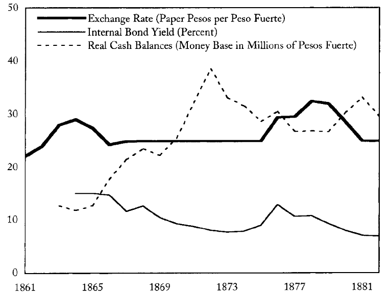
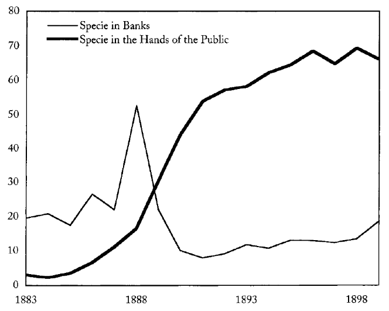
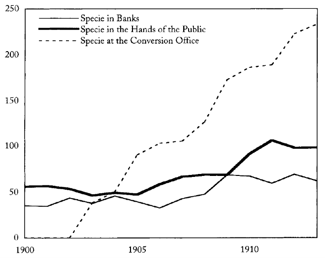
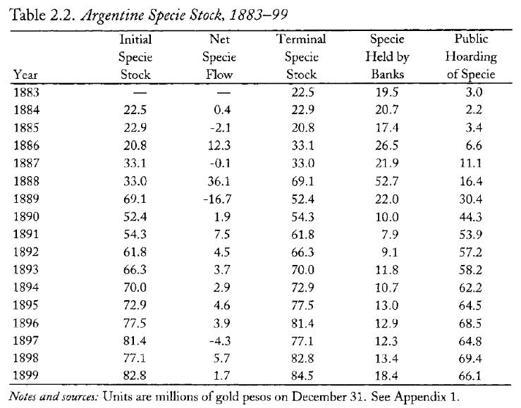
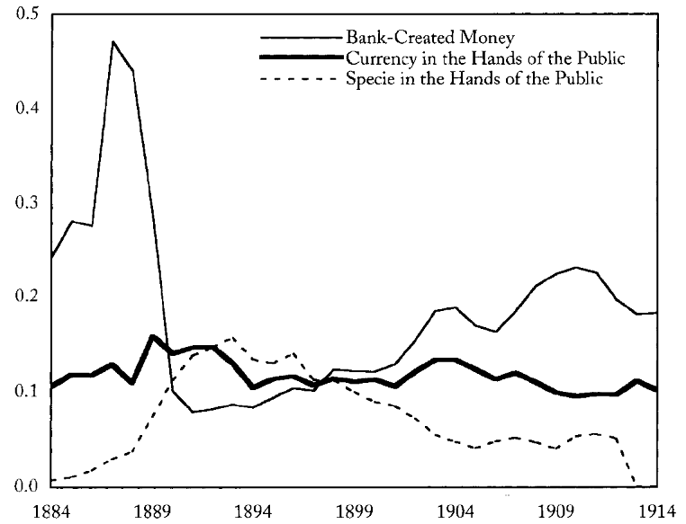
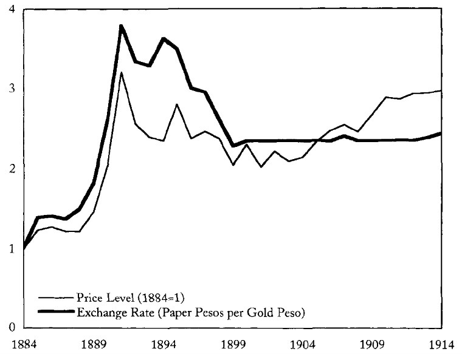

## Dinero, TDC e interés (1861–1881)

{fig-align="center" width="90%"}

## Especie por sector (1883–1898)

{fig-align="center" width="90%"}

## Especie por sector (1899–1914)

{fig-align="center" width="90%"}

## Stock de especie (1883–1899)

{fig-align="center" width="90%"}

## Billetes, metálico y depósitos

{fig-align="center" width="90%"}

## Precios y tipo de cambio (1884–1914)

{fig-align="center" width="90%"}

