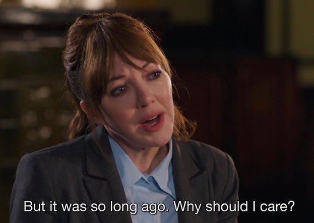
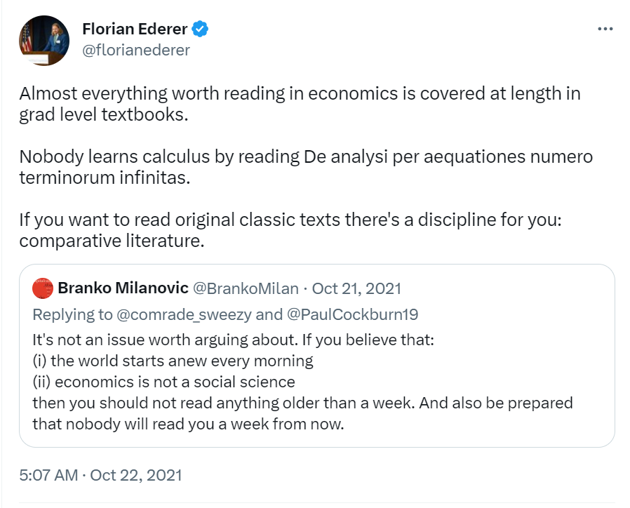
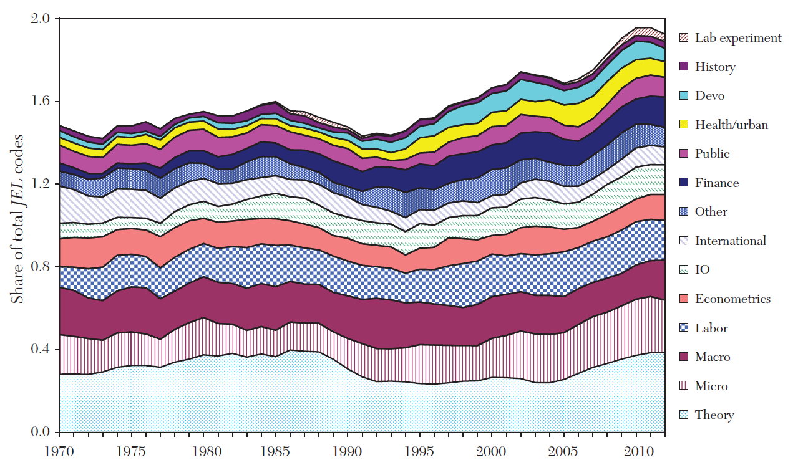
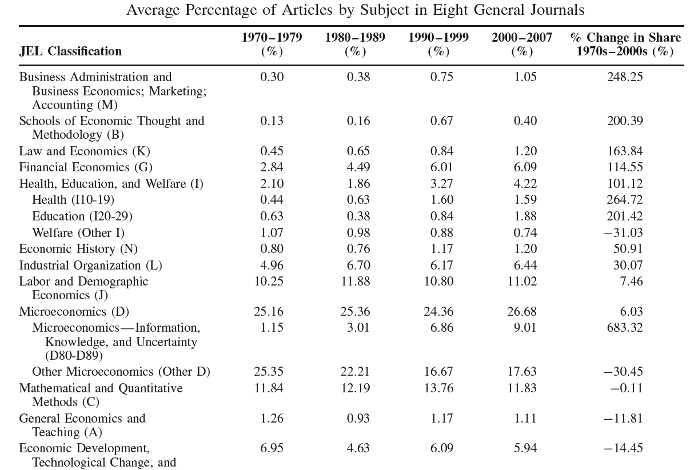

# El rol y utilidad de la HPE

- Discusión sobre el rol y utilidad de la HPE
- Sobre el carácter y naturaleza de la disciplina --economía
- Teorías y doctrinas

---

> "A science which hesitates to forget its founders is lost" 
**[Alfred Whitehead, *The Aims of Education and Other Essays* (1927)]**

> "The more perfect the science, the shorter its history"
**[Jean Baptiste Say, citado en Barber (1997)]**

> "It is from the scope and wisdom of the economists of the past that we must reap the knowledge with which to face the future"
**[Robert Heilbroner, *The Worldly Philosophers* (1953)]**

## ¿Es relevante la HPE?

{width=80%}

## Algunas razones escuchadas

- Leer a los "clásicos"
- Pedagógico
- Entender la evolución
- Formación integral

## El papel de las ideas

> …las ideas de los economistas y filósofos políticos, tanto cuando son correctas como erróneas, tienen más poder de lo que comúnmente se entiende. De hecho, el mundo está dominado por ellas. Los hombres prácticos, que se creen exentos de cualquier influencia intelectual, son usualmente esclavos de algún economista difunto. Locos con autoridad, que escuchan voces en el aire, destilan su histeria de algún escritorzuelo académico de uno años antes. Estoy seguro que el poder de los intereses creados es vastamente exagerado cuando se lo compara con el gradual avance de las ideas. No, por cierto, en forma inmediata, pero luego de un cierto intervalo; porque en el campo de la economía y la filosofía política no hay muchos que sean influenciados por nuevas teorías luego de sus veinticinco o treinta años de edad, por lo que las ideas que los funcionarios públicos y políticos, y aun los activistas aplican a los eventos actuales no es probable que sean las últimas. Pero, tarde o temprano, son las ideas, y no los intereses creados las que son peligrosas para bien o para mal 
**[John Maynard Keynes, *Teoría general del empleo, el interés y el dinero* (1936)]**

## Argumentos y contra-argumentos

{width=80%}

## HPE: el debate (cont.)

https://twitter.com/florianederer/status/1451460098316980226?s=20 

## HPE: tendencias

- Pero esto no es nuevo $\longrightarrow$ ya en 1960 había señales --Gordon (1965) encuesta principales 40 departamentos de economía en EEUU
  - Un 86% de instituciones ofrecen cursos de HPE y está en 7 de cada 10 programas de doctorado
  - Casi la mitad han visto una disminución en la oferta y/o requerimientos en los 5, 10 y 15 años anteriores
  - Profesores más jovenes serían mas reticentes a (re)contratar profesores en el área
- Sin embargo: hay cada vez más investigación, journals y conferencias en el area de la HPE

## HPE: tendencias (cont.)

{width=80%}

## HPE: tendencias (cont.)

{width=80%}

## HPE: tendencias (cont.)

{width=80%}

## ¿Está muriendo la HPE (cont.)?

- ¿Why study "the wrong opinions of dead mean"? [Pigou]
  - Válido plantearse la utilidad de la HPE para estudiantes y sus futuras carreras
  - 

## ¿Está muriendo la HPE (cont.)?

- Blaug (2001) en paper *"No History of Ideas, Please, We're Economists"* dice:

> Ninguna idea o teoría en economía, física, química, biología, filosofía y aún matemática es completa y detalladamente comprendida excepto como el resultado final de una porción de la historia, el resultado de algún desarrollo intelectual previo...el conocimiento económico es dependiente del camino. Loque conocemos acerca del sistema económico no es algo que hayamos descubierto hoy y ahora, sino que es la suma de todos los descubrimientos, ideas, y arranques falsos en el pasado. Sin Hayek, Robbins y Pigou, no había Keynes; sin Keynes, no había Friedman; sin Friedman, no había Lucas; sin Lucas, no había...

# Sobre el carácter y naturaleza de la disciplina --economía

## Sobre método y naturaleza

- Cierta idea que la economía es comparable a una ciencia natural con progreso acumulativo y que sólo hace falta leer los últimos escritos
  - Para entender conceptos de ventaja comparativa, eficiencia del mercado o los modelos de oligopolio no hace falta leer a Ricardo, Smith o Cournot
- Pero también idea de que la economía no es enteramente como las ciencias naturales...
  - la economía progresa no sólo refinando modelos (verticalmente) sino también expandiendo el rango de modelos (horizontalmente)

## Sobre método y naturaleza (cont.)

- En 1973, Leijonhufvud escribió en tono de sorna un pequeño artículo donde habló de la "tribu de los economistas" y su **obsesión por los modelos**
  - la práctica de usar y hablar a través de modelos y el énfasis puesto en la modelización explicaba tanto el status del economista y el desdén con que miraban a otras "tribus" --sociología, ciencia política
- Esas observaciones son **relevantes 50 años después** --el entrenamiento del economista consiste esencialmente en aprender una secuencia de modelos

## Sobre método y naturaleza (cont.)

- Para los críticos, esta obsesión por los modelos representa todo lo que está mal con la economía --abstracción de la compleja realidad social, supuestos cuestionables, derivar recetas de política de modelos teóricos hiperstilizados
- En la realidad, los modelos construidos por economistas son absolutamente **esenciales para entender** el funcionamiento de la sociedad. 
  - Lo que los hace útiles es que capturan *un* aspecto de la realidad
  - Lo que los hace indispensables es que capturan *el aspecto más relevante de la realidad en un contexto específico*

## Sobre método y naturaleza (cont.)

- La realidad social a diferencia de la realidad física es el resultado de elección humana en su totalidad y por lo tanto inherentemente maleable [Rodrik (2015)]
- 

