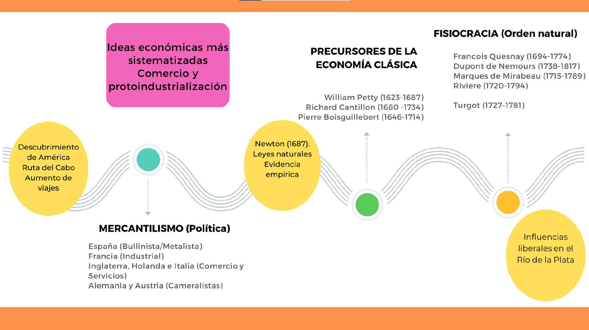
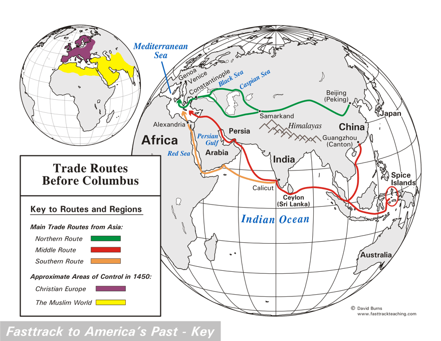
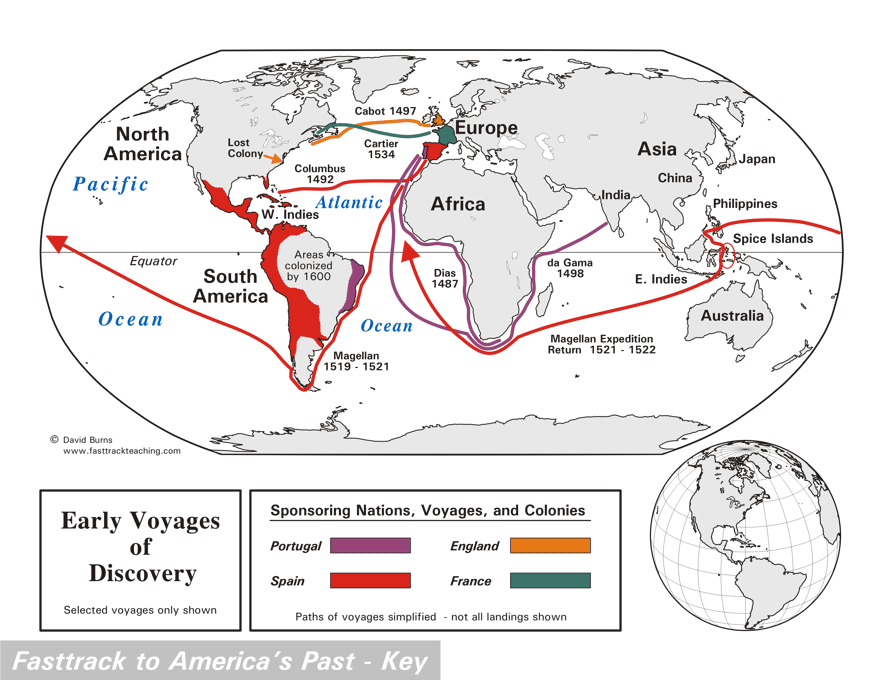
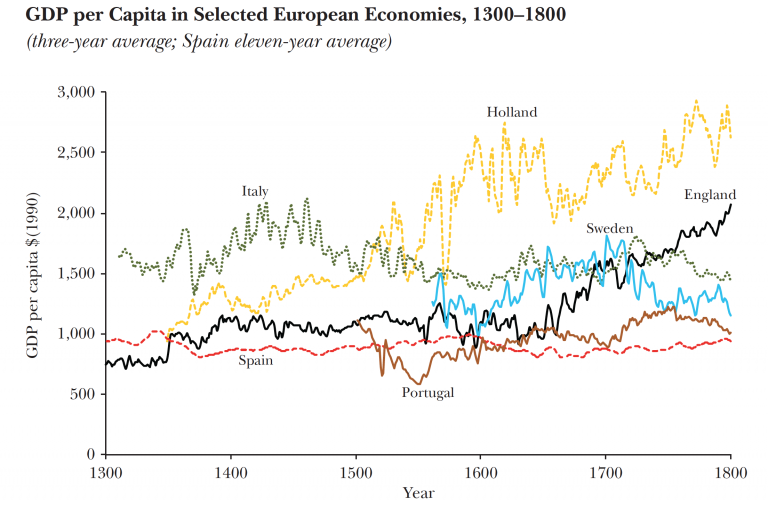
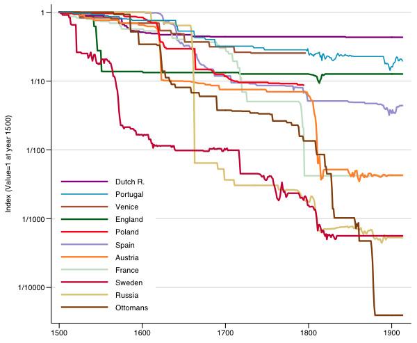
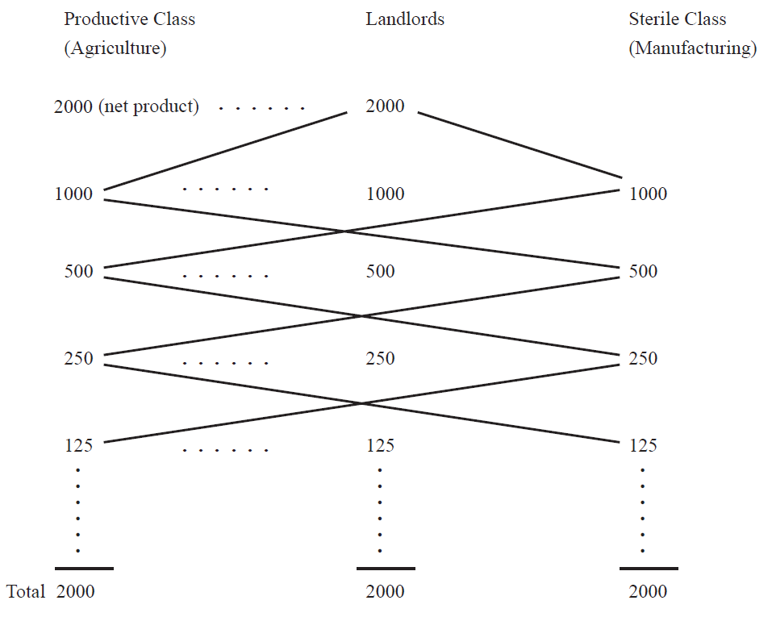

# **Motivación y encuadre** {background="#43464B"}

## El Estado-nación y la obsesión por el oro

> "The ordinary means therefore to increase our wealth and treasure is by Foreign Trade, wherein wee must ever observe this rule; to sell more to strangers yearly than wee consume of theirs in value."
**[Thomas Mun, 1630]**

- Entre 1500 y 1750 el mundo experimenta transformaciones sin precedentes
- Descubrimientos geográficos, revolución de precios, surgimiento de Estados-nación
- Por primera vez, algunos países empiezan a tener **crecimiento económico sostenido**

## ¿Por qué nos importa este período?

- Es el **primer intento sistemático** de pensar la economía a nivel nacional
- Muchas de sus ideas siguen vivas (proteccionismo, guerras comerciales, "*America First*")
- Muestra cómo **las ideas económicas responden a intereses concretos**
- La crítica al mercantilismo fue el trampolín para la economía clásica
- Aquí nacen los **fundamentos filosóficos** del liberalismo económico

## Ubicación temporal

{fig-align="center"}

# **Contexto histórico** {background="#43464B"}

## Un período de grandes cambios

- El periodo 1500-1750: transición entre la economía pre- y post-crecimiento
- Hasta el siglo XVI, la economía era esencialmente un **juego de suma cero**
- Los estándares de vida dependían del tamaño de la población (trampa malthusiana)

**El cambio decisivo**:

- Caída del Imperio Bizantino
- Desarrollo de nuevas tecnologías e inventos
- Posibilidad de aumentar el *stock* de bienes a través de la exploración

## Viajes y descubrimientos

::: {#fig-viajes layout-ncol=2}
{width=550}

{width=550}

El mundo se expande
:::

## El crecimiento económico como fenómeno nuevo

{fig-align="center"}

## La revolución de los precios

- Entre 1500 y 1750 los precios en Europa se **sextuplicaron** en promedio
- Causa principal: entrada masiva de oro y plata de América
- Este fenómeno puso en evidencia la **relación entre dinero y precios**

{fig-align="center"}

# **El mercantilismo** {background="#43464B"}

## ¿Qué es el mercantilismo?

El mercantilismo puede entenderse como tres cosas simultáneas:

1. **Colección de ideas y doctrinas teóricas** (dispersas y a veces contradictorias)
2. **Sistema de economía política** (relación Estado-comerciantes)
3. **Compendio de políticas económicas** (aranceles, subsidios, monopolios)

**No es una "escuela" en sentido estricto**: fue más bien una reacción intelectual a las condiciones de la época.

## El supuesto clave: la riqueza es fija

- Se partía del supuesto de que **la riqueza total en el mundo era constante**
- Por lo tanto, la forma de enriquecerse era **a costa de otra nación**
- Esto justificaba el uso del poder estatal para ganar ventaja comercial

## Balanza comercial y acumulación de metales

**Objetivo central**: mantener una balanza comercial superavitaria

- Fomentar exportaciones (X)
- Desincentivar importaciones (M)
- Maximizar entrada de metales preciosos (*bullion*)

**Instrumentos**: aranceles, cuotas, subsidios, monopolios estatales

## Dinero = riqueza (¿?)

- Creencia fundamental del **mercantilismo joven**: dinero y riqueza son lo mismo
- El **mercantilismo tardío** empezó a cuestionar esto
- **Jean Bodin**: el aumento de precios se debe al aumento de oro y plata
- **Thomas Mun**: las exportaciones e importaciones dependen de los **precios relativos** entre países

## El error del mercantilismo

> "This subject is an important and a complex one. Everyone knows what a difference it makes to the prosperity of the population in general and the prince in particular whether or not a state abounds in gold and silver."
**[Antonio Serra, 1613]**

Confundieron:

- Variaciones en M $\longrightarrow$ variaciones en Y (lo que creían)
- Variaciones en M $\longrightarrow$ variaciones en P (lo que ocurría)

## El mecanismo precio-flujo de metales

- Un mayor superávit comercial en país A conduce a
- Mayor entrada de metales (*bullion*) que al monetizarse implica
- Aumento en M en país A que si es mayor al aumento de Y produce
- Aumento en P en país A y disminución de P en país B
- Lo cual **reduce** el superávit comercial de A

Este mecanismo, descrito por **David Hume**, mostró que la acumulación de metales era **autolimitante**.

## Especificidades nacionales

| **Inglaterra** | **Francia** |
|----------------|-------------|
| Monarquía constitucional | Monarquía absolutista |
| Poder menos centralizado | Estado garantiza unidad social |
| Coaliciones entre grupos de interés y Estado | Conflicto más que coalición |
| Regulación local vs. nacional | **Colbert** como figura central |

## El Estado y la búsqueda de rentas

- Los mercantilistas buscaban **beneficios a través de privilegios estatales**
- El principal privilegio: **monopolios concedidos por el Estado**

**Oferta de regulación**: gobiernos

**Demanda de regulación**: comerciantes y empresas

Relación de *quid pro quo*: regulaciones a cambio de "votos" y dinero.

## Reevaluación del mercantilismo

- La escuela clásica **devastó** al mercantilismo intelectualmente
- Pero hubo intentos de rescatarlo:

**Escuela histórica alemana**: sistema racional para objetivos de la época

**Keynes**: reconoció "fragmentos de sabiduría práctica"

> Detrás de la obsesión con las entradas de *bullion* había una "intuición de la conexión entre la abundancia de dinero y las bajas tasas de interés".
**[J.M. Keynes]**

# **El concepto de ley natural** {background="#43464B"}

## Del derecho divino al derecho natural

La transición del mercantilismo al liberalismo requirió un **cambio filosófico fundamental**:

- Del **derecho divino** de los reyes al **derecho natural** de los individuos
- De la **autoridad** como fuente de legitimidad a la **razón**
- Del Estado como **creador** de orden al Estado como **protector** de un orden preexistente

::: {.importante}
El iusnaturalismo proporcionó el fundamento filosófico para la crítica al intervencionismo mercantilista.
:::

## ¿Qué es la ley natural?

**La doctrina del derecho natural sostiene que**:

1. Existen **leyes naturales** que rigen la sociedad humana
2. Estas leyes son **anteriores** a cualquier legislación positiva
3. Los derechos individuales son **preexistentes** al Estado
4. El orden social puede surgir **espontáneamente**

Pensadores clave: Grocio, Pufendorf, Locke

## Dos visiones contrapuestas del Estado

| **Hobbes** | **Locke** |
|------------|-----------|
| Estado de naturaleza = caos | Estado de naturaleza = libertad |
| Sin Estado: "guerra de todos contra todos" | Sin Estado: derechos naturales |
| Leviatán necesario | Estado como protector |
| Justifica el absolutismo | Limita el poder estatal |

## Implicaciones para la economía

De la ley natural se deduce que:

- El **intercambio voluntario** es mutuamente beneficioso
- La **propiedad privada** tiene fundamento en la naturaleza
- La **intervención estatal** puede perturbar el orden natural
- El mercado es un **orden espontáneo** que no requiere dirección central

::: {.cita}
La economía comienza a separarse de la moral y la teología.
:::

# **La filosofía política del liberalismo: Locke, Mandeville, Hume** {background="#43464B"}

## John Locke (1632-1704)

Filósofo inglés, autor del *Ensayo sobre el entendimiento humano* (1689) y los *Dos tratados sobre el gobierno* (1690).

> "Aunque la tierra y todas las criaturas inferiores han sido dadas a todos los hombres en común... cada hombre tiene una propiedad en su propia persona. El trabajo de su cuerpo y la obra de sus manos son propiamente suyos."
**[John Locke]**

## Locke: trabajo, propiedad y libertad

**Tres ideas fundamentales**:

1. **El trabajo como fuente de propiedad**: mezclar trabajo con recursos naturales crea título legítimo
2. **Los derechos naturales preceden al Estado**: "vidas, libertades y patrimonio"
3. **Límites al poder político**: el Estado protege derechos, no los crea

::: {.importante}
Locke no fue un apologista del capitalismo, sino un defensor de los derechos del individuo contra el absolutismo.
:::

## Locke: contribuciones económicas

Más allá de la filosofía política, Locke participó en debates económicos:

- **Debate sobre tipos de interés**: contra la fijación legal de tasas (vs. Josiah Child)
- **Teoría monetaria**: una de las primeras formulaciones de la velocidad de circulación
- **Acuñación de moneda**: debate sobre la reforma monetaria

> "Es la prosperidad la que favorece un nivel moderado de los tipos de interés, y cualquier intento de reducirlos por ley está condenado al fracaso."

## Bernard de Mandeville (1670-1733)

Médico holandés radicado en Londres. Autor de *La fábula de las abejas: o vicios privados, beneficios públicos* (1714).

::: {.cita}
"Los vicios privados, mediante la dirección hábil de un político diestro, pueden convertirse en beneficios públicos."
**[Bernard de Mandeville]**
:::

Condenado por "impiedad" por el Gran Jurado de Middlesex.

## Mandeville: la paradoja central

**La tesis**: el comportamiento egoísta puede conducir al bienestar colectivo

**Pero con matices cruciales**:

- No es automático: requiere "la dirección hábil de un político diestro"
- No defiende el vicio *per se*: reconoce la naturaleza humana tal como es
- Critica el moralismo ingenuo de Shaftesbury

Mandeville **no es** un teórico del laissez-faire puro.

## Mandeville: sociedad pequeña vs comercial

**Sociedad tradicional a pequeña escala** (idealizada por moralistas):
> "No tendrán artes o ciencias, y estarán tranquilos solamente cuando sus vecinos los dejen en paz; deben ser pobres, ignorantes..."

**Sociedad comercial con división del trabajo**:

- Necesariamente a mayor escala
- La división del trabajo favorece el progreso técnico
- Mayor riqueza material

## La importancia de Mandeville

1. **Anticipó a Smith**: el interés propio como motor de la prosperidad
2. **Secularizó el análisis**: separó economía de moralismo
3. **Planteó la paradoja central**: cómo el egoísmo puede producir orden social

A diferencia de Smith, Mandeville requería un "político hábil". Smith confiaría en el mercado mismo.

## David Hume (1711-1776)

- Filósofo escocés, amigo cercano de **Adam Smith**
- Describió el **mecanismo precio-flujo de metales**
- Se diferenció tanto del mercantilismo joven como de la escuela clásica:

> Un aumento gradual de M puede aumentar la producción real al menos durante cierto período de tiempo.

Vinculó **libertades económicas con libertades políticas**.

## Hume: contribuciones clave

1. **Mecanismo precio-flujo de metales**: crítica devastadora al mercantilismo
2. **Teoría cuantitativa del dinero**: relación M-P
3. **Comercio beneficia a todos**: crítica a la suma cero
4. **Filosofía moral moderada**: optimismo sobre la naturaleza humana

::: {.importante}
Hume preparó el terreno filosófico para Adam Smith.
:::

## Síntesis: la transición de ideas

| Autor | Tesis central | Rol del Estado |
|-------|---------------|----------------|
| **Locke** | Derechos naturales, propiedad del trabajo | Protector de derechos preexistentes |
| **Mandeville** | Vicios privados → beneficios públicos | Director hábil de pasiones |
| **Hume** | Orden espontáneo, libertad y comercio | Mínimo pero no nulo |

Esta progresión preparó el terreno para la "mano invisible" de Smith.

# **Los primeros economistas científicos** {background="#43464B"}

## Los precursores de la economía política

- El mercantilismo tardío vio surgir pensadores que **anticiparon la economía clásica**
- Dos figuras destacadas:
  - **William Petty** (1623-1687): padre de la aritmética política
  - **Richard Cantillon** (1680-1734): primer tratado sistemático de economía

## Sir William Petty (1623-1687)

> "Instead of using only comparative and superlative Words, and intellectual Arguments, I have taken the course to express myself in Terms of Number, Weight, or Measure."
**[William Petty]**

- Hijo de sastre pobre, se formó como médico, matemático, ingeniero
- Fundador de la **aritmética política** (estadística económica)
- Miembro fundador de la Royal Society

## Petty: una vida extraordinaria

- A los 14 años fue abandonado en las costas de Francia; educado por jesuitas
- Participó en el famoso caso de la "resurrección" de Anne Greene (1650)
- Dirigió el relevamiento territorial de Irlanda para Cromwell
- Se enriqueció con la distribución de tierras irlandesas

::: {.importante}
Marx lo consideró "el padre de la economía política inglesa".
:::

## Petty: contribuciones clave

**Concepto de velocidad de circulación del dinero**

**Ingreso Nacional**: no lo definió formalmente pero reconoció su importancia analítica

**"Father and mother"**: destacó los dos factores originales de producción (tierra y trabajo)

> "El trabajo es el padre de la riqueza y la tierra es la madre."
**[William Petty, citado por Marx]**

## Petty: valor, renta y excedente

> "Supongamos que un hombre puede plantar cierta tierra con maíz... cuando este hombre haya deducido su semilla del producto de su cosecha, y también lo que él mismo ha comido y dado a otros a cambio de ropa y otras necesidades naturales; el resto del maíz es la renta natural y verdadera de la tierra."

Aquí hay una **anticipación de la teoría del valor-trabajo**.

## Petty: capitalización e interés

- Se interesó por el problema de la **capitalización** (tiempo, interés, renta)
- Anticipó conceptos financieros modernos sobre descuento de rentas futuras
- Relativizó el problema moral de la usura:

> "La usura es el alquiler de la tierra que el dinero prestado podría comprar, donde la garantía es indudable."
**[William Petty]**

## Richard Cantillon (1680-1734): el *Essai*

- Escribió uno de los mejores tratados científicos sobre economía antes de **Adam Smith**
- Su *Essay on the Nature of Commerce* (1755) es **puramente analítico**
- Influyó en **Quesnay** y los fisiócratas

**Nota sobre su vida**: hizo fortuna con la burbuja de Mississippi, fue acusado de fraude, y murió misteriosamente en un incendio (posiblemente asesinado).

## Cantillon: contribuciones clave

**Anticipó a Malthus**:
> "Los hombres se multiplican como ratones en un granero si tienen medios ilimitados de subsistencia."

**Teoría del valor**:
> "El precio o valor intrínseco de una cosa es la medida de la cantidad de tierra y trabajo que entran en su producción."

**Introdujo el término *entrepreneur***:
> "La circulación e intercambio de bienes son llevados a cabo por empresarios y bajo riesgo."

## Cantillon: teoría monetaria

- Entendió el mecanismo de transmisión monetaria
- Describió cómo los aumentos de dinero afectan primero a ciertos sectores y luego se difunden
- Esta idea se conoce hoy como **"efecto Cantillon"**

> "De todo esto concluyo que al doblar la cantidad de dinero en un Estado los precios no siempre se doblan. Un río que serpentea por su cauce no fluirá con el doble de velocidad cuando la cantidad de agua se duplique."

# **Los fisiócratas** {background="#43464B"}

## El contexto de Francia en siglos XVII y XVIII

- Las condiciones eran brutales para la gran mayoría de habitantes
- La política económica en manos de Colbert
- Críticas al sistema desde Boisguillebert (1646-1714)

> "[En la campiña] podían observarse animales débiles y maltratados... y de repente una de las criaturas alza la mirada —sorpresa, es un hombre!"
**[La Bruyère, *The Characters*]**

## Quesnay y los fisiócratas

- Escuela francesa liderada por **François Quesnay** (1694-1774)
- Primera escuela económica propiamente dicha
- Concepto central: la tierra es la **única fuente de riqueza**

**Tableau Économique**: primer intento de modelar la economía como sistema.

{fig-align="center"}

## Rasgos distintivos de la fisiocracia

1. **Posición pro-agricultura** (y anti-promoción de manufacturas)
2. **Laissez-faire** relativo frente al gobierno
3. **Fundamento en la ley natural** (versión simplista)

> "You simply obey the laws of nature" era respuesta común a muchas inquietudes.

## Clasificación fisiocrática de la sociedad

- Sólo **la agricultura era productiva**
- No negaron la importancia de otros sectores pero hicieron distinción analítica:

| Clase | Característica |
|-------|----------------|
| **Agricultores** | Productiva: aplican trabajo a la tierra |
| **Terratenientes** | Productiva: aportan adelantos (capital) |
| **Artesanos** | Estéril: no producen nuevo valor |

Los terratenientes recibían el **producto neto (*produit net*)**.

## El *Tableau Économique*: funcionamiento

- Existen 3 columnas: agricultores, terratenientes, clase estéril
- Se parte de un *produit net* y se distribuye entre clases
- Cada clase gasta su ingreso comprando a las otras
- El sistema se reproduce período tras período

::: {.importante}
Mérito principal: ver a la economía como **sistema interconectado en el tiempo**.
:::

## Implicaciones de política

De la teoría fisiocrática se deducía:

- **Todos los impuestos** deberían recaer en el *produit net*
- Debían eliminarse todos los **impuestos intermedios**
- Solo los terratenientes debían pagar impuestos

Conclusión aparentemente conservadora pero subversiva para el *ancien régime*.

## Turgot (1727-1781)

- Escribió en lenguaje más accesible que Quesnay
- Simplificó y amplió las ideas fisiocráticas
- Trató sobre dinero, capital, adelantos

> "There is another way of being wealthy without working and without possessing land... It is necessary to explain its origin."
**[Turgot, *Reflections*, 1770]**

# **Valoración e importancia** {background="#43464B"}

## Contribuciones del período

**El mercantilismo aportó**:

- Primera reflexión sistemática sobre economía **a nivel nacional**
- Desarrollo de conceptos de balanza comercial y contabilidad nacional
- Reconocimiento de la relación dinero-precios

**La filosofía liberal aportó**:

- Fundamentos para separar economía de moral y teología
- Concepto de orden espontáneo
- Derechos naturales y límites al poder estatal

## Contribuciones del período (cont.)

**Petty y Cantillon aportaron**:

- Método cuantitativo (aritmética política)
- Análisis sistemático de la economía como sistema
- Teoría del valor basada en trabajo y tierra

**Los fisiócratas aportaron**:

- Primera "escuela" económica
- Economía como flujo circular
- Concepto de excedente (*produit net*)

## Caminos abiertos

- **Petty** y **Cantillon** prepararon el terreno para **Smith**
- La fisiocracia introdujo el concepto de sistema económico
- **Locke**, **Mandeville** y **Hume** proporcionaron la filosofía
- **Hume** anticipó la teoría cuantitativa del dinero

## Caminos cerrados (reabiertos después)

- La idea de que la política monetaria puede tener efectos reales (**Keynes**)
- El rol del Estado en el desarrollo económico (economía del desarrollo)
- La búsqueda de rentas como fenómeno central (public choice)

# **Resumiendo** {background="#43464B"}

## Ideas clave (I)

- **El mercantilismo fue la primera política económica sistemática** $\longrightarrow$ aunque sus ideas eran dispersas, compartían objetivos comunes
- **La obsesión con los metales tenía lógica en su contexto** $\longrightarrow$ pero confundieron dinero con riqueza
- **El concepto de ley natural** $\longrightarrow$ proporcionó la base filosófica para la crítica al intervencionismo

## Ideas clave (II)

- **Locke, Mandeville y Hume** $\longrightarrow$ articularon la transición filosófica hacia el liberalismo
- **Petty y Cantillon fueron precursores cruciales** $\longrightarrow$ desarrollaron métodos y conceptos que **Adam Smith** heredaría
- **Los fisiócratas crearon la primera escuela** $\longrightarrow$ y el primer modelo del sistema económico como flujo circular

## Preguntas para reflexionar

1. ¿En qué sentido las políticas comerciales actuales (aranceles, "guerra comercial" con China) son "mercantilistas"?
2. ¿Por qué la obsesión con la balanza comercial persiste a pesar de 250 años de críticas?
3. Si **Petty** y **Cantillon** fueron tan brillantes, ¿por qué **Adam Smith** se lleva todo el crédito?
4. ¿Qué se gana y qué se pierde cuando la economía se separa de la filosofía moral?

# **Bibliografía** {background="#43464B"}

## Lecturas principales

- **Ekelund, R.B. y Hébert, R.F.** (2005). *Historia de la teoría económica y de su método*. Capítulos 3-5.
- **Roncaglia, A.** (2006). *La riqueza de las ideas*. Capítulos 3-4.
- **Schumpeter, J.A.** (1954). *History of Economic Analysis*. Part II, Capítulos 3-6.

## Lecturas complementarias

- **Heckscher, E.** (1935). *Mercantilism*. Capítulos seleccionados.
- **Locke, J.** (1690). *Two Treatises of Government*. Libro II.
- **Mandeville, B.** (1714). *The Fable of the Bees*.
- **Petty, W.** (1662). *A Treatise on Taxes and Contributions*.
- **Cantillon, R.** (1755). *Essay on the Nature of Commerce*. Parte I.
