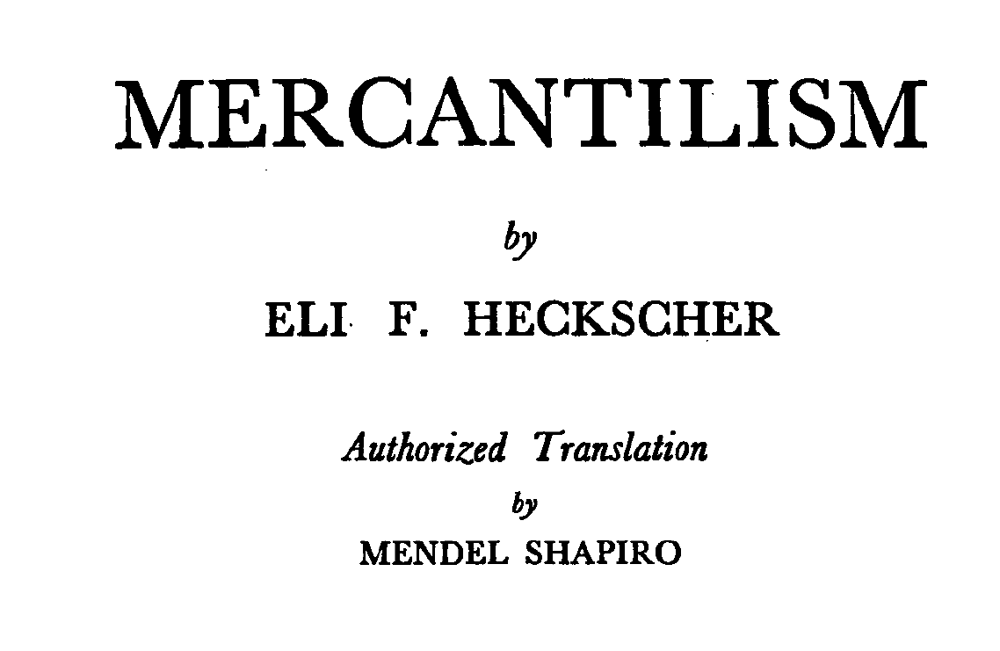

# **Motivación y encuadre** {background="#43464B"}

## El Estado-nación y la obsesión por el oro

> "The ordinary means therefore to increase our wealth and treasure is by Foreign Trade, wherein wee must ever observe this rule; to sell more to strangers yearly than wee consume of theirs in value."
**[Thomas Mun, 1630]**

Entre 1500 y 1750 el mundo experimenta transformaciones sin precedentes: descubrimientos geográficos, revolución de precios, surgimiento de Estados-nación. Por primera vez, algunos países empiezan a tener **crecimiento económico sostenido**. Esta unidad cubre el período de transición entre el pensamiento económico medieval y el nacimiento de la economía como disciplina científica con Adam Smith.

## ¿Por qué nos importa este período?

Este período es fundamental por varias razones que conectan el pasado con debates actuales:

- Es el **primer intento sistemático** de pensar la economía a nivel nacional
- Muchas de sus ideas siguen vivas hoy: proteccionismo, guerras comerciales, políticas de "*America First*"
- Muestra cómo **las ideas económicas responden a intereses concretos** de grupos específicos
- La crítica al mercantilismo fue el trampolín para la economía clásica
- Aquí nacen los **fundamentos filosóficos** del liberalismo económico que todavía debatimos

## Ubicación temporal

{fig-align="center"}

## Plan de la clase

En esta unidad vamos a cubrir cinco grandes temas que están profundamente conectados entre sí:

1. **El mercantilismo**: qué fue, qué propuso, y por qué falló
2. **El concepto de ley natural**: el fundamento filosófico de la crítica al mercantilismo
3. **La filosofía política del liberalismo**: Locke, Mandeville y Hume como arquitectos intelectuales
4. **Los primeros economistas científicos**: Petty y Cantillon, los verdaderos precursores
5. **Los fisiócratas**: la primera "escuela" económica y el Tableau Économique

# **Contexto histórico: un mundo en transformación** {background="#43464B"}

## Un período de grandes cambios

El periodo 1500-1750 representa una transición fundamental entre dos mundos económicos completamente diferentes. Hasta el siglo XVI, la economía era esencialmente un **juego de suma cero** sujeto a la denominada trampa malthusiana: los estándares de vida dependían del tamaño de la población y no de la tecnología.

**El cambio decisivo** ocurrió gracias a una conjunción de factores:

- La caída del Imperio Bizantino y la necesidad de nuevas rutas comerciales
- El desarrollo de nuevas tecnologías de navegación e inventos
- La posibilidad de aumentar el *stock* de bienes, factores y dinero a través de la exploración

## Viajes y descubrimientos

::: {#fig-viajes layout-ncol=2}
{width=550}

{width=550}

El mundo se expande dramáticamente
:::

## El crecimiento económico como fenómeno nuevo

Por primera vez en la historia, algunos países empezaron a tener crecimiento sostenido de sus ingresos per cápita. Esto fue particularmente notable en Holanda (desde el siglo XVII) e Inglaterra (desde el siglo XVIII). Varios autores de la época percibieron que este crecimiento económico se correspondía con un aumento del poder político: ganó consenso la idea de que **poder y riqueza iban de la mano**.

{fig-align="center"}

## La revolución de los precios

Entre 1500 y 1750 los precios en Europa se **sextuplicaron** en promedio. La causa principal fue la entrada masiva de oro y plata provenientes de América. Este fenómeno empírico puso en evidencia por primera vez la **relación entre cantidad de dinero y nivel de precios**, aunque los contemporáneos tardaron en comprenderla correctamente.

{fig-align="center"}

# **El mercantilismo** {background="#43464B"}

## ¿Qué es el mercantilismo?

El mercantilismo no es fácil de definir porque puede entenderse como **tres cosas simultáneas**:

| Dimensión | Descripción |
|-----------|-------------|
| **Doctrinas teóricas** | Colección dispersa de ideas sobre comercio, dinero y riqueza nacional |
| **Sistema de economía política** | Relación de intercambio entre Estado y comerciantes |
| **Políticas económicas** | Aranceles, subsidios, monopolios, regulaciones comerciales |

Es importante entender que el mercantilismo **no es una "escuela" en sentido estricto**. Fue más bien una reacción intelectual a las condiciones de la época, con ideas que variaron mucho entre países y a lo largo del tiempo.

## El supuesto fundamental y sus consecuencias

Los mercantilistas partían de un supuesto clave: **la riqueza total en el mundo era constante**. Si esto fuera cierto, la única forma de que un país se enriquezca sería a costa de otra nación. Esta visión de "suma cero" justificaba el uso de todo el poder del Estado-nación para ganar ventaja comercial.

**Objetivo central**: mantener una balanza comercial superavitaria

**Ecuación mercantilista**: Maximizar exportaciones (X) + Minimizar importaciones (M) = Maximizar entrada de metales preciosos (*bullion*)

**Instrumentos de política**: aranceles protectores, cuotas de importación, subsidios a exportadores, monopolios estatales, regulaciones comerciales

## Dinero, riqueza y el gran error

> "Everyone knows what a difference it makes to the prosperity of the population in general and the prince in particular whether or not a state abounds in gold and silver."
**[Antonio Serra, 1613]**

La creencia más notable (y errónea) del **mercantilismo joven** era su equiparación entre dinero y riqueza. El **mercantilismo tardío** comenzó a cuestionar esto: Jean Bodin identificó que el aumento de precios se debía al aumento de oro y plata, y Thomas Mun argumentó que las exportaciones e importaciones dependían de los precios relativos entre países.

**El error fundamental**: confundir variaciones en M → variaciones en Y (lo que creían) con variaciones en M → variaciones en P (lo que realmente ocurría)

## El mecanismo precio-flujo de metales

David Hume describió un mecanismo que mostraba que la acumulación de metales era **autolimitante**:

1. Un país A logra un superávit comercial
2. Entran más metales preciosos a A, aumentando la cantidad de dinero
3. Con más dinero circulando, los precios en A suben
4. Los productos de A se vuelven más caros que los de B
5. Las exportaciones de A caen y sus importaciones suben
6. El superávit comercial de A **se reduce automáticamente**

Este mecanismo fue devastador para la doctrina mercantilista porque mostraba que su objetivo era contradictorio consigo mismo.

## El Estado y la búsqueda de rentas

Más allá de las ideas económicas, el mercantilismo funcionaba como un sistema de **búsqueda de rentas** donde distintos actores perseguían sus propios intereses:

| Actor | Rol | Beneficio buscado |
|-------|-----|-------------------|
| **Gobiernos** | Oferta de regulación | Ingresos fiscales, lealtad política |
| **Comerciantes** | Demanda de regulación | Monopolios, protección de competencia |

Se configuraba una relación de **quid pro quo**: regulaciones y privilegios a cambio de "votos" y dinero. Los monopolios estatales florecieron especialmente en transporte marítimo, acuñación de moneda, banca y manufactura textil.

## Variantes nacionales y reevaluación

| **Inglaterra** | **Francia** |
|----------------|-------------|
| Monarquía constitucional | Monarquía absolutista |
| Poder descentralizado, coaliciones | Colbert como figura central, conflicto |
| Regulación local vs nacional | Regulación centralizada |

La escuela clásica **devastó** al mercantilismo intelectualmente, pero hubo intentos de rescatarlo. La **escuela histórica alemana** lo defendió como sistema racional para su época. **Keynes** reconoció "fragmentos de sabiduría práctica" y valoró la intuición mercantilista sobre la conexión entre abundancia de dinero y bajas tasas de interés.

{fig-align="center"}

# **El concepto de ley natural** {background="#43464B"}

## ¿Por qué hablar de filosofía en un curso de economía?

Antes de entrar en los pensadores liberales, necesitamos entender un concepto filosófico que fue **absolutamente fundamental** para el desarrollo de la economía: la idea de **ley natural**. Sin esta idea, no existiría ni la crítica al mercantilismo ni la economía clásica.

La pregunta central era: ¿de dónde vienen las reglas que gobiernan la sociedad? Durante siglos, la respuesta dominante fue: **de Dios, a través del rey**. El rey tenía derecho divino a gobernar y sus decisiones eran legítimas porque representaban la voluntad divina. Este era el fundamento del absolutismo.

## Del derecho divino al derecho natural

La doctrina del **derecho natural** (o iusnaturalismo) propuso una respuesta radicalmente diferente. Sus principales exponentes fueron Hugo Grocio (1583-1645), Samuel Pufendorf (1632-1694) y John Locke (1632-1704).

**La idea central del iusnaturalismo**:

Existen **leyes naturales** que rigen la sociedad humana, de la misma manera que existen leyes naturales que rigen el movimiento de los planetas. Estas leyes son **anteriores** a cualquier gobierno y pueden ser descubiertas por la **razón humana**. Los derechos de los individuos no son concesiones del Estado sino que **preexisten** a cualquier organización política.

## ¿Por qué esto importa para la economía?

Esta idea tuvo consecuencias revolucionarias para el pensamiento económico:

| Antes (derecho divino) | Después (derecho natural) |
|------------------------|---------------------------|
| El rey decide qué es justo | Existen principios de justicia previos al Estado |
| La propiedad es concesión del soberano | La propiedad es derecho natural del individuo |
| El Estado crea el orden social | El orden social puede surgir espontáneamente |
| La intervención estatal es natural | La intervención estatal requiere justificación |

Si existen leyes naturales que gobiernan la economía, entonces el mercado podría funcionar **sin necesidad de dirección central**. Esta idea sería el fundamento de toda la economía clásica.

## Dos visiones contrapuestas del Estado

Para entender mejor la ley natural, es útil contrastarla con la visión opuesta. Thomas Hobbes (1588-1679) y John Locke representan las dos posiciones extremas:

| **Hobbes** (*Leviatán*, 1651) | **Locke** (*Dos tratados*, 1690) |
|------------------------------|----------------------------------|
| El estado de naturaleza es caos | El estado de naturaleza es libertad |
| Sin Estado: "guerra de todos contra todos" | Sin Estado: los hombres tienen derechos naturales |
| El Leviatán (Estado fuerte) es necesario | El Estado debe proteger derechos que ya existen |
| Justifica el absolutismo | Justifica límites al poder estatal |

Locke "ganó" este debate en el sentido de que su visión se convirtió en la base del liberalismo político y económico.

## La ley natural aplicada a la economía

De la doctrina de la ley natural se derivaron varias conclusiones que serían centrales para el pensamiento económico liberal:

1. **El intercambio voluntario es mutuamente beneficioso**: si dos personas intercambian libremente, ambas ganan (de lo contrario no intercambiarían)

2. **La propiedad privada tiene fundamento natural**: surge del trabajo y no de la concesión estatal

3. **El mercado es un orden espontáneo**: no requiere diseño central para funcionar

4. **La intervención estatal perturba el orden natural**: debe justificarse caso por caso

Estas ideas prepararon el terreno para la crítica sistemática al mercantilismo y para la "mano invisible" de Adam Smith.

# **La filosofía política del liberalismo: Locke, Mandeville, Hume** {background="#43464B"}

## Los tres arquitectos del liberalismo económico

Vamos a estudiar tres pensadores que, cada uno a su manera, contribuyeron a construir las bases filosóficas del liberalismo económico. No fueron economistas en sentido estricto, pero sus ideas sobre la naturaleza humana, la propiedad y el orden social fueron **indispensables** para el desarrollo posterior de la economía.

| Pensador | Contribución principal |
|----------|------------------------|
| **John Locke** | La propiedad como derecho natural basado en el trabajo |
| **Bernard de Mandeville** | El egoísmo privado puede producir beneficios públicos |
| **David Hume** | El orden social surge espontáneamente; crítica monetaria al mercantilismo |

## John Locke (1632-1704): vida y contexto

Locke fue un filósofo inglés que vivió una época turbulenta: la Guerra Civil Inglesa, la Restauración, y la Revolución Gloriosa de 1688. Sus obras principales fueron el *Ensayo sobre el entendimiento humano* (1689) y los *Dos tratados sobre el gobierno* (1690).

Locke no escribió principalmente sobre economía, pero sus ideas filosóficas tuvieron enormes consecuencias económicas. Su teoría de la propiedad, en particular, se convirtió en uno de los pilares del pensamiento liberal.

## Locke: la teoría del trabajo y la propiedad

> "Aunque la tierra y todas las criaturas inferiores han sido dadas a todos los hombres en común... cada hombre tiene una propiedad en su propia persona. Nadie tiene derecho a ella excepto él mismo. El trabajo de su cuerpo y la obra de sus manos son propiamente suyos."
**[John Locke, *Dos tratados sobre el gobierno*]**

El argumento de Locke es elegante: si yo soy dueño de mi cuerpo, entonces soy dueño de mi trabajo. Y si mezclo mi trabajo con algo que no tiene dueño (como tierra virgen), entonces eso se convierte en **mi propiedad**. La propiedad no es una concesión del Estado sino un **derecho natural** que el Estado debe proteger.

## Locke: implicaciones de su teoría

La teoría de Locke tenía varias implicaciones revolucionarias:

**Para la política**: El Estado existe para proteger derechos que ya existían antes del Estado. Si el gobierno viola esos derechos, pierde legitimidad. Locke usó la fórmula "vidas, libertades y patrimonio" para describir lo que el Estado debe proteger.

**Para la economía**: El trabajo es la fuente de la riqueza y del derecho a la propiedad. Esta idea reaparecerá en la teoría del valor-trabajo de Smith, Ricardo y Marx (aunque con interpretaciones muy diferentes).

**Límite importante**: Locke no fue un apologista del capitalismo moderno. Escribía en una sociedad todavía predominantemente agrícola y feudal, y su objetivo principal era defender los derechos del individuo contra el absolutismo.

## Locke: contribuciones económicas directas

Además de su filosofía política, Locke participó en debates económicos de su época:

**Debate sobre tipos de interés**: Josiah Child argumentaba que los tipos de interés bajos causaban prosperidad y debían fijarse por ley. Locke respondió que es al revés: la prosperidad causa tipos bajos, y fijarlos por ley está condenado al fracaso.

> "Es la prosperidad la que favorece un nivel moderado de los tipos de interés, y cualquier intento de reducirlos por ley está condenado al fracaso; además, en la medida en que pueda tener éxito, tal intento puede mostrarse nocivo."

**Teoría monetaria**: Locke fue uno de los primeros en formular claramente el concepto de velocidad de circulación del dinero.

## Bernard de Mandeville (1670-1733): el provocador

Mandeville fue un médico holandés radicado en Londres, autor de una obra que escandalizó a su época: *La fábula de las abejas: o vicios privados, beneficios públicos* (1714). El libro fue condenado por "impiedad" por el Gran Jurado de Middlesex.

¿Por qué fue tan escandaloso? Porque Mandeville argumentó que los comportamientos que la moral tradicional condenaba como "vicios" (la vanidad, el lujo, el egoísmo) eran en realidad **útiles para la sociedad**.

## Mandeville: la paradoja de la fábula

La fábula cuenta la historia de una colmena próspera donde todas las abejas eran egoístas, vanidosas y perseguían su propio interés. Un día, los dioses decidieron hacer virtuosas a todas las abejas. El resultado fue desastroso: la economía colapsó porque nadie quería comprar lujos, nadie quería trabajar más de lo necesario, y la colmena entró en decadencia.

**La moraleja**: los "vicios" privados (egoísmo, vanidad, ambición) pueden producir "beneficios" públicos (prosperidad, empleo, progreso).

## Mandeville: matices importantes

Es fundamental no simplificar excesivamente a Mandeville. Él **no** dijo que los vicios automáticamente producen beneficios públicos:

> "Los vicios privados, **mediante la dirección hábil de un político diestro**, pueden convertirse en beneficios públicos."
**[Bernard de Mandeville]**

Mandeville requería un "político hábil" para canalizar las pasiones humanas hacia fines socialmente útiles. No era un teórico del laissez-faire puro. La diferencia con Adam Smith es que Smith confiaría en el **mercado mismo** (no en un político) para lograr esta transformación.

## Mandeville: sociedad pequeña vs sociedad comercial

Mandeville también hizo una distinción importante entre dos tipos de sociedad:

**Sociedad tradicional a pequeña escala** (idealizada por los moralistas):

> "No tendrán artes o ciencias, y estarán tranquilos solamente cuando sus vecinos los dejen en paz; deben ser pobres, ignorantes y estarán privados casi por completo de todo lo que hace la vida cómoda."

**Sociedad comercial con división del trabajo**: necesariamente a mayor escala, donde la división del trabajo favorece el progreso técnico y genera mayor riqueza material.

Para Mandeville, no se puede tener la riqueza de la segunda manteniendo la moral de la primera.

## La importancia de Mandeville para la economía

Mandeville fue importante por tres razones:

1. **Anticipó a Smith**: el interés propio como motor de la prosperidad colectiva

2. **Secularizó el análisis**: separó el análisis económico del moralismo religioso

3. **Planteó la paradoja central de la economía**: ¿cómo puede el egoísmo individual producir orden social y beneficio colectivo?

Esta última pregunta sería el problema central que Adam Smith intentaría resolver con su teoría de la "mano invisible".

## David Hume (1711-1776): el filósofo amigo de Smith

Hume fue un filósofo escocés y amigo cercano de Adam Smith. Es conocido principalmente por sus obras filosóficas, pero también escribió *Ensayos políticos* (1752) con contribuciones económicas importantes.

Hume representa una posición intermedia y moderada: ni el pesimismo de Hobbes ni el optimismo ingenuo de algunos moralistas. Su visión de la naturaleza humana era **moderadamente optimista**.

## Hume: contribuciones económicas

**1. El mecanismo precio-flujo de metales**: Ya lo vimos en la sección de mercantilismo. Fue la crítica más devastadora a la doctrina mercantilista.

**2. La teoría cuantitativa del dinero**: Hume argumentó que la cantidad de dinero afecta el nivel de precios, no la riqueza real.

**3. El comercio beneficia a todos**: Criticó la visión de suma cero del mercantilismo. El progreso de cualquier país beneficia a los demás.

**4. Pero con un matiz importante**: A diferencia de los clásicos posteriores, Hume admitió que un aumento *gradual* de la cantidad de dinero podía aumentar temporalmente la producción real.

## Hume: la conexión entre libertad económica y política

Una contribución particularmente importante de Hume fue vincular las **libertades económicas con las libertades políticas**:

- El comercio y la industria promueven la libertad porque crean una clase media independiente
- La prosperidad económica favorece gobiernos moderados
- El despotismo es incompatible con el desarrollo económico a largo plazo

Esta idea sería central para el liberalismo clásico y sigue siendo debatida hoy.

## Síntesis: la transición filosófica

| Autor | Pregunta central | Respuesta | Rol del Estado |
|-------|------------------|-----------|----------------|
| **Locke** | ¿De dónde viene la propiedad? | Del trabajo individual | Proteger derechos preexistentes |
| **Mandeville** | ¿El egoísmo es malo para la sociedad? | No, puede producir beneficios | Canalizar hábilmente las pasiones |
| **Hume** | ¿Puede surgir orden sin diseño? | Sí, espontáneamente | Mínimo pero no nulo |

Esta progresión preparó el terreno para que Adam Smith pudiera argumentar que el mercado, guiado por la "mano invisible", transforma el interés propio en beneficio colectivo **sin necesidad de intervención estatal**.

# **Los primeros economistas científicos: William Petty** {background="#43464B"}

## El padre de la aritmética política: Número, peso o medida

> "Instead of using only comparative and superlative Words, and intellectual Arguments, I have taken the course to express myself in Terms of Number, Weight, or Measure; to use only Arguments of Sense, and to consider only such Causes, as have visible Foundations in Nature."
**[William Petty]**

William Petty (1623-1687) fue uno de los pensadores más originales de su época. Marx lo consideró "el padre de la economía política inglesa". Su principal innovación fue metodológica: insistió en que la economía debía basarse en **medición cuantitativa**, no en argumentos retóricos.

## Petty: una vida extraordinaria

La vida de Petty parece sacada de una novela de aventuras:

- **Hijo de un sastre pobre** del sur de Inglaterra
- A los 14 años fue **abandonado en las costas de Francia** por la tripulación de un barco; se educó con jesuitas
- Se formó como **médico, matemático e ingeniero**
- Participó en el famoso caso de la **"resurrección" de Anne Greene** (1650): una mujer condenada a muerte que revivió después de ser ahorcada
- Fue **miembro fundador de la Royal Society**
- Dirigió el **relevamiento territorial de Irlanda** para Cromwell y se enriqueció con la distribución de tierras

## Petty: la aritmética política

La "aritmética política" de Petty fue el antecedente directo de la estadística económica moderna. Su idea era simple pero revolucionaria: en lugar de debatir con palabras, hay que **medir y contar**.

> "By Political Arithmetick we mean the art of reasoning by figures upon things relating to government... [Petty] first gave it that name and brought it into rules and methods."
**[Charles Davenant, 1698]**

Petty no concebía la teorización aislada de los hechos: para él, **ciencia = medición + análisis**.

## Petty: influencia del método (inductivo)

> Los hombres que experimentan son como la hormiga: sólo recogen y
usan; los razonadores se parecen a las arañas, que tejen telarañas a
partir de su propia sustancia. Pero la abeja toma el camino de en
medio: saca su material de las flores del jardín y del campo, pero lo
transforma y lo digiere en virtud de su propio poder. No es distinto el verdadero asunto de la filosofía: porque no se apoya sólo o principalmente en los poderes de la mente, ni toma la materia que recoge de la historia natural y de los experimentos mecánicos, y la guarda en el conjunto de la memoria, tal como la encuentra; sino que la guarda
alterada y digerida en el entendimiento
**[Bacon, Francis (1620), libro I de los Aforismos]**

- Fuerte contraste con el método lógico-deductivo de los escolásticos;
  también fuerte separación entre ciencia y ética --el problema moral
  no podía surgir por la ciencia en sí misma

## Petty: contribuciones conceptuales

Petty desarrolló varios conceptos que serían centrales para la economía posterior:

**1. Velocidad de circulación del dinero**: Una de las primeras formulaciones claras de este concepto crucial.

**2. Ingreso Nacional**: Aunque no lo definió formalmente, reconoció su importancia analítica para entender la economía de un país.

**3. "Father and mother"**: Identificó los dos factores originales de producción:

> "El trabajo es el padre de la riqueza y la tierra es la madre."
**[William Petty, citado por Marx]**

## Petty: valor, renta y excedente

En su *Treatise on Taxes and Contributions* (1662), Petty anticipó la teoría del valor-trabajo:

> "Supongamos que un hombre puede plantar cierta tierra con maíz... cuando este hombre haya deducido su semilla del producto de su cosecha, y también lo que él mismo ha comido y dado a otros a cambio de ropa y otras necesidades naturales; **el resto del maíz es la renta natural y verdadera de la tierra**."

Aquí está el concepto de **excedente económico**: lo que queda después de reponer los insumos y pagar la subsistencia del trabajador. Este concepto sería central para toda la economía clásica.

## Petty: la paridad entre tierra y trabajo

Petty intentó encontrar una forma de reducir tierra y trabajo a una medida común:

> "Deberíamos decir que un barco o una prenda vale cierta medida de tierra, junto con cierta otra medida de trabajo; ya que tanto barcos como prendas son criaturas de tierras y trabajos... Esto siendo verdad, nos gustaría encontrar una paridad natural entre tierra y trabajo."

Esta búsqueda de una "paridad natural" no tuvo éxito completo, pero muestra la profundidad de su pensamiento. La pregunta de cómo medir y comparar los factores de producción sigue siendo relevante.

## Petty: dinero e interés

Petty también contribuyó a la teoría monetaria:

> "El dinero es como la grasa del cuerpo político, que si abunda en demasía a menudo impide su agilidad y si es poca significa que está enfermo. Ciertamente, así como la grasa lubrica el movimiento de los músculos... así hace el dinero en el Estado, acelerando su acción."

Sobre la usura, Petty la desmoralizó completamente:

> "La usura es el alquiler de la tierra que el dinero prestado podría comprar, donde la garantía es indudable."

El interés no es un pecado sino simplemente el "alquiler" del capital.

## Petty: mercancía y mercado

En su *Diálogo sobre diamantes*, Petty hizo una distinción fundamental entre dos formas de ver el intercambio:

**El inexperto** ve cada intercambio como un evento único y riesgoso, donde puede ser estafado porque no conoce el "verdadero" precio.

**El experto** entiende que existe un **mercado**: una red de intercambios regulares que permite establecer precios de referencia predecibles.

La existencia de un mercado transforma actos únicos en **regularidades con precios predecibles**. Esta idea de que el mercado crea información es muy moderna.

# **Los primeros economistas científicos: Richard Cantillon** {background="#43464B"}

## El banquero filósofo

> "Si Petty es el padre de la economía política, Cantillon es su primer arquitecto sistemático."
**[Adaptado de William Stanley Jevons]**

Richard Cantillon (c. 1680-1734) fue un banquero irlandés que pasó la mayor parte de su vida en París. Es autor del *Ensayo sobre la naturaleza del comercio en general*, escrito probablemente entre 1728 y 1734, pero publicado póstumamente en 1755.

Su libro es considerado por muchos como el **primer tratado sistemático de economía**, superior en rigor analítico a cualquier texto previo.

## Cantillon: una vida de novela

La vida de Cantillon fue tan dramática como su pensamiento fue riguroso:

- Hizo una **enorme fortuna** especulando con la burbuja de Mississippi (el esquema de John Law)
- A diferencia de otros, **previó el colapso** y vendió a tiempo
- Fue **acusado de fraude** por quienes perdieron dinero
- Murió en **circunstancias misteriosas** en un incendio en su casa de Londres en 1734
- Algunos historiadores sospechan que fue **asesinado**, otros que fingió su muerte para escapar de sus acreedores

## Cantillon: estructura del *Ensayo*

El *Ensayo* de Cantillon está dividido en tres partes con una estructura lógica impecable:

| Parte | Tema | Contenido |
|-------|------|-----------|
| **I** | Organización interna | Valor, precios, tierra, trabajo, clases sociales |
| **II** | Dinero y circulación | Teoría monetaria, precios, interés |
| **III** | Comercio exterior | Balanza comercial, tipos de cambio |

A diferencia de la mayoría de los textos de la época, el *Ensayo* es **puramente analítico**: no mezcla análisis con recomendaciones de política ni con moralizaciones.

## Cantillon: el sistema económico como circulación

La innovación conceptual más importante de Cantillon fue ver la economía como un **sistema de circulación**:

Mientras Petty veía al "cuerpo político" como unificado por el poder estatal, Cantillon lo vio como conectado por la **circulación de mercancías y dinero**.

> "La tierra es la fuente o materia de la que se produce toda riqueza. El trabajo del hombre es la forma que la produce: y la riqueza en sí misma no es otra cosa que el sustento, las comodidades y las superfluidades de la vida."
**[Cantillon, *Ensayo*]**

## Cantillon: teoría del valor

Cantillon desarrolló una teoría del valor basada en tierra y trabajo:

> "El precio o valor intrínseco de una cosa es la medida de la cantidad de tierra y trabajo que entran en su producción."

Distinguió claramente entre:

- **Valor intrínseco**: determinado por los costos de producción (tierra y trabajo)
- **Precio de mercado**: determinado por la oferta y demanda en un momento dado

Esta distinción entre "precio natural" y "precio de mercado" sería central para Adam Smith.

## Cantillon: el empresario (*entrepreneur*)

Cantillon fue el primero en usar el término **entrepreneur** en sentido técnico económico:

> "La circulación e intercambio de bienes son llevados a cabo por empresarios y bajo riesgo."

Dividió a la sociedad en dos grupos fundamentales:

| Tipo | Característica | Ejemplos |
|------|----------------|----------|
| **Contratados** | Retribución cierta, fijada de antemano | Asalariados, funcionarios |
| **Empresarios** | Retribución incierta, especulan sobre el futuro | Comerciantes, agricultores, artesanos |

El empresario es quien asume el **riesgo** de producir sin saber con certeza a qué precio podrá vender.

## Cantillon: formación de precios de mercado

Una de las descripciones más brillantes de Cantillon es cómo se forman los precios de mercado:

> "Varios mayordomos de París han recibido orden de comprar guisantes verdes cuando aparecen por primera vez. Uno tiene orden de comprar 10 cuartos por 60 libras, otro 10 cuartos por 50 libras, un tercero 10 por 40 libras y un cuarto 10 por 30 libras. Si estas órdenes deben ejecutarse, debe haber 40 cuartos en el mercado. Supongamos que sólo hay 20. Los vendedores, viendo muchos compradores, mantendrán sus precios altos, y los compradores subirán hasta los precios que les han prescrito: así, los que ofrecen 60 libras serán los primeros servidos..."
**[Cantillon, *Ensayo*]**

Esta es una de las primeras descripciones del **mecanismo de oferta y demanda**.

## Cantillon: teoría monetaria y el "efecto Cantillon"

Cantillon entendió algo que muchos economistas posteriores olvidaron: la forma en que el dinero nuevo entra en la economía **importa**.

> "De todo esto concluyo que al doblar la cantidad de dinero en un Estado los precios de productos y mercancías no siempre se doblan. Un río que corre y serpentea por su cauce no fluirá con el doble de velocidad cuando la cantidad de agua se duplique."

**El "efecto Cantillon"**: los aumentos de dinero afectan **primero** a ciertos sectores y **luego** se difunden. Quienes reciben el dinero primero se benefician; quienes lo reciben último sufren la inflación sin haber disfrutado del dinero extra.

## Cantillon: una crítica temprana de la banca

Cantillon, que conocía muy bien el mundo financiero, fue muy crítico de las prácticas bancarias:

> "Es entonces indudable que un Banco con la complicidad de un Ministro puede elevar y sostener el precio de los valores públicos... Pero estos refinamientos que abren la puerta a hacer grandes fortunas rara vez se llevan a cabo para la sola ventaja del Estado, y quienes toman parte en ellos generalmente se corrompen... Si algún pánico o crisis imprevista llevara a los tenedores a demandar plata del Banco, la bomba estallaría y se vería que estas son operaciones peligrosas."

Esta advertencia, escrita hace casi 300 años, sigue siendo relevante.

# **Los fisiócratas: la primera escuela** {background="#43464B"}

## El contexto francés

La aparición de los fisiócratas en Francia se entiende mejor conociendo el contexto. Las condiciones en Francia durante el siglo XVII y principios del XVIII eran brutales para la gran mayoría:

> "[En la campiña] podían observarse animales débiles y maltratados, aparentemente despreocupados por lo que crecía en los alrededores, y de repente una de las criaturas alza la mirada —sorpresa, es un hombre!"
**[La Bruyère, *The Characters*]**

La política económica estaba dominada por Colbert, el superministro de Luis XIV, con su programa de promoción de manufacturas a costa de la agricultura.

## François Quesnay (1694-1774)

Quesnay fue el líder indiscutido de los fisiócratas. Su vida es fascinante:

- Nació en familia humilde dedicada a la agricultura
- Se convirtió en **cirujano y médico** (escribió sobre la circulación de la sangre)
- Llegó a ser **asistente personal de Madame de Pompadour**, la amante del rey Luis XV
- Residía en Versalles, en el centro del poder
- Se interesó por la agricultura y gradualmente pasó al análisis económico general
- Su creación más famosa: el **Tableau Économique** (no sobre la circulación de la sangre... ¡sino de la riqueza!)

## Rasgos distintivos de la fisiocracia

Los fisiócratas compartían tres características distintivas:

**1. Posición pro-agricultura**: Sólo la agricultura era verdaderamente "productiva" porque sólo ella generaba un excedente físico (se siembra un grano, se cosechan muchos).

**2. Actitud de laissez-faire**: El gobierno debía intervenir lo menos posible en la economía.

**3. Fundamento en la ley natural**: "You simply obey the laws of nature" era su respuesta a muchas inquietudes. Los fisiócratas creían que existía un "orden natural" que la política económica debía respetar.

## La clasificación fisiocrática de la sociedad

Los fisiócratas dividieron la sociedad en tres clases:

| Clase | Rol | Característica |
|-------|-----|----------------|
| **Agricultores** | Aplican trabajo a la tierra | Clase productiva |
| **Terratenientes** | Aportan "adelantos" (capital) | Clase productiva (reciben el *produit net*) |
| **Artesanos** | Transforman materias primas | Clase "estéril" |

**Importante**: "Estéril" no significaba "inútil". Los fisiócratas reconocían que los artesanos eran necesarios. Pero argumentaban que el trabajo manufacturero sólo **transformaba** valor, no lo **creaba**. El único sector que creaba valor nuevo era la agricultura.

## El *Tableau Économique*

El *Tableau Économique* fue el primer intento de representar la economía como un **sistema de flujos interconectados**:

{fig-align="center"}

## El *Tableau*: cómo funciona

El esquema muestra cómo el **producto neto** (*produit net*) circula entre las tres clases:

1. Los **terratenientes** reciben el *produit net* de los agricultores como renta
2. Gastan la mitad comprando productos agrícolas y la mitad comprando manufacturas
3. Los **agricultores** usan su ingreso para comprar insumos agrícolas y manufacturas
4. Los **artesanos** usan su ingreso para comprar alimentos y materias primas
5. El ciclo se repite año tras año

**El mérito principal**: ver a la economía como un **sistema interconectado** que se reproduce período tras período, tanto en el espacio como en el tiempo.

## Implicaciones de política

De la teoría fisiocrática se derivaban conclusiones importantes para la política:

**1. Impuesto único sobre la tierra**: Si todo el excedente se origina en la agricultura, entonces **todos los impuestos** deberían recaer sobre el *produit net* de los terratenientes. Todos los demás impuestos eran distorsivos e ineficientes.

**2. Eliminación de impuestos intermedios**: Los impuestos sobre manufacturas, comercio, etc., sólo encarecían los productos sin generar recaudación neta para el Estado.

**3. Libre comercio de granos**: Las restricciones al comercio de alimentos perjudicaban a la agricultura.

## ¿Cuál es el estatus del *Tableau*?

Los historiadores han debatido cómo interpretar el *Tableau*:

| Comparación | Resultado |
|-------------|-----------|
| ¿Precedente de Walras (equilibrio general)? | **No**: no hay mecanismo de equilibrio ni precios relativos |
| ¿Precedente de Keynes (multiplicador)? | **No**: hay flujo circular pero no multiplicador |
| ¿Precedente de Leontief (insumo-producto)? | **Sí**: puede reescribirse como matriz de relaciones intersectoriales |

El *Tableau* fue importante no por ser "correcto" sino por **plantear la pregunta correcta**: ¿cómo funciona la economía como sistema?

## Turgot (1727-1781)

Anne-Robert-Jacques Turgot fue el fisiocrático más accesible y claro. Su obra principal fue *Reflexiones sobre la formación y distribución de las riquezas* (1770).

Turgot simplificó y amplió las ideas de Quesnay:

- Escribió en **lenguaje más común** que el estilo críptico de Quesnay
- Desarrolló una **teoría del capital** más sofisticada
- Distinguió entre diferentes **usos de los adelantos** (compra de tierras vs. inversión en manufacturas)

> "There is another way of being wealthy without working and without possessing land... It is necessary to explain its origin."
**[Turgot]**

# **Valoración e importancia del período** {background="#43464B"}

## Lo que aportó cada corriente

| Corriente/Autor | Aporte principal |
|-----------------|------------------|
| **Mercantilismo** | Primera política económica sistemática a nivel nacional |
| **Ley natural** | Fundamento filosófico para la crítica al intervencionismo |
| **Locke** | Propiedad como derecho natural basado en el trabajo |
| **Mandeville** | El egoísmo puede producir beneficios colectivos |
| **Hume** | Crítica monetaria al mercantilismo; orden espontáneo |
| **Petty** | Aritmética política, medición cuantitativa |
| **Cantillon** | Primer tratado sistemático; teoría del empresario |
| **Fisiócratas** | Economía como sistema de flujos circulares |

## Caminos abiertos para Adam Smith

Todo este período preparó el terreno para *La Riqueza de las Naciones* (1776):

- **De Locke**: la propiedad basada en el trabajo
- **De Mandeville**: el interés propio como motor de la prosperidad
- **De Hume**: la crítica al mercantilismo y el orden espontáneo
- **De Petty**: el método cuantitativo y la teoría del valor-trabajo
- **De Cantillon**: el sistema económico como circulación
- **De los fisiócratas**: la economía como sistema que se reproduce

Smith pudo construir sobre estos cimientos para crear la primera síntesis completa de economía política.

## Preguntas para reflexionar

1. ¿Por qué la obsesión con la balanza comercial persiste a pesar de 250 años de críticas? ¿Son las guerras comerciales actuales "mercantilistas"?

2. ¿Qué se gana y qué se pierde cuando la economía se separa de la filosofía moral?

3. Si Petty y Cantillon fueron tan brillantes, ¿por qué Adam Smith se lleva todo el crédito?

4. ¿Tiene sentido la idea de "ley natural" en economía? ¿Hay realmente regularidades económicas que no dependen de las instituciones humanas?

# **Bibliografía** {background="#43464B"}

## Lecturas principales

- **Roncaglia, A.** (2006). *La riqueza de las ideas*. Capítulos 3-4.
- **Ekelund, R.B. y Hébert, R.F.** (2005). *Historia de la teoría económica y de su método*. Capítulos 3-5.
- **Schumpeter, J.A.** (1954). *History of Economic Analysis*. Part II, Capítulos 3-6.

## Lecturas complementarias

- **Locke, J.** (1690). *Two Treatises of Government*. Libro II.
- **Mandeville, B.** (1714). *The Fable of the Bees*.
- **Hume, D.** (1752). *Political Discourses*.
- **Petty, W.** (1662). *A Treatise on Taxes and Contributions*.
- **Cantillon, R.** (1755). *Essay on the Nature of Commerce*.
- **Heckscher, E.** (1935). *Mercantilism*.
