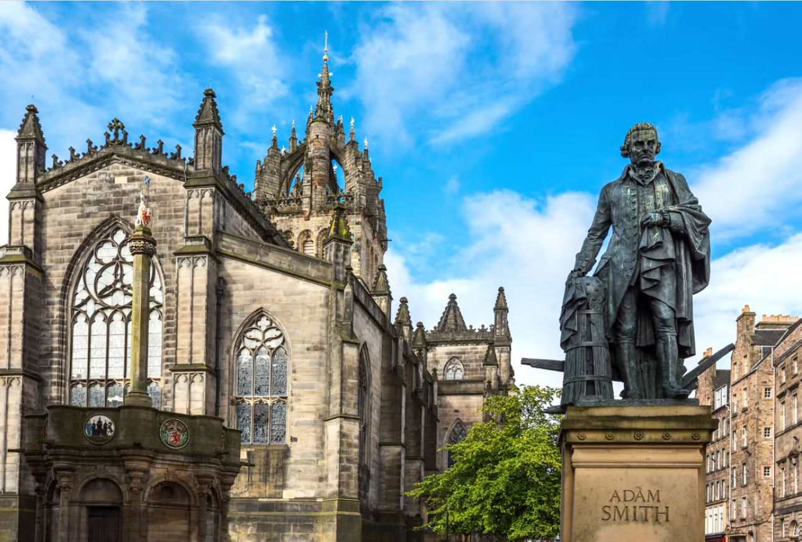
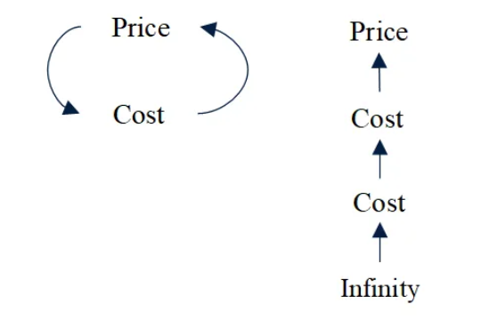
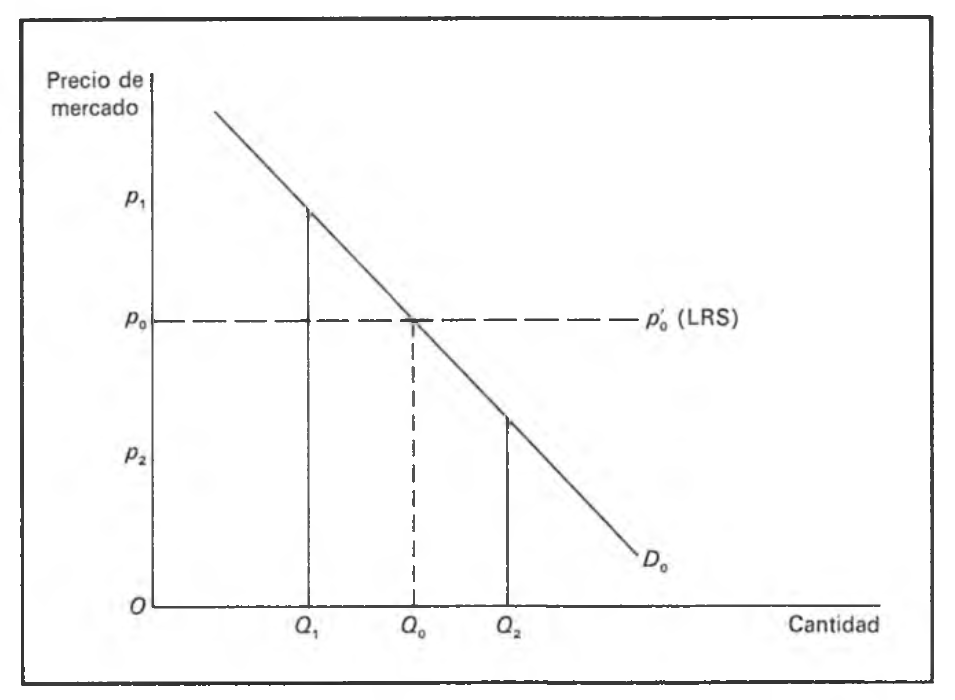
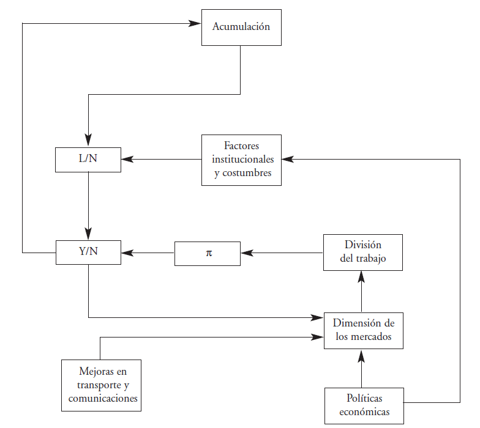
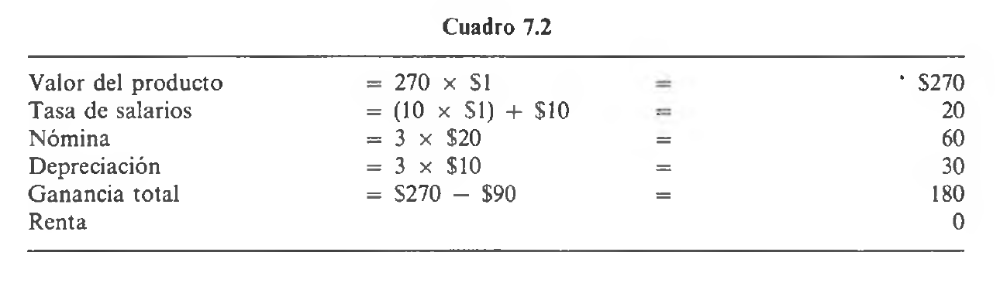
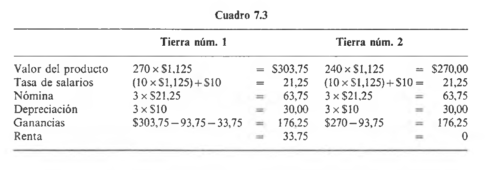

# **La economía política clásica** {background="#390040"}

## La mano invisible y el nacimiento de una disciplina

> "No es de la benevolencia del carnicero, del cervecero o del panadero que esperamos nuestra cena, sino de su atención a su propio interés."
**[Adam Smith, *La Riqueza de las Naciones* (1776)]**

- En 1776, mientras Estados Unidos declaraba su independencia, **Adam Smith** publicaba el libro que fundaría la economía moderna
- Por primera vez, alguien ofrecía una **visión sistemática** de cómo funciona una economía de mercado
- Las preguntas que planteó **Smith** siguen siendo las preguntas centrales de la economía

## ¿Por qué nos importan los clásicos?

- **Smith** estableció que el mercado puede coordinar millones de decisiones individuales
- **Ricardo** mostró por qué el comercio internacional beneficia a todos los países
- **Mill** intentó reconciliar eficiencia económica con justicia social

Estas ideas **moldean los debates actuales** sobre globalización, desigualdad y rol del Estado.

## El padre de la criatura

{fig-align="center"}

## Un mundo en transformación

- **Revolución Industrial**: producción mecanizada, fábricas, urbanización
- **Comercio internacional en expansión**: colonias, nuevos mercados
- **Cambios sociales**: nueva clase obrera, burguesía industrial
- **Debates políticos**: liberalismo vs. mercantilismo, derechos individuales

Los clásicos escribían en medio de estos cambios y trataban de **entenderlos y orientarlos**.

## Las preguntas fundamentales

La economía clásica se organizó alrededor de tres preguntas:

1. **¿Qué determina el valor de las cosas?** (Teoría del valor)
2. **¿Cómo se reparte el producto entre clases sociales?** (Teoría de la distribución)
3. **¿Qué hace que una nación sea rica o pobre?** (Teoría del crecimiento)

## De la economía pre-científica a la científica

**Antes de los clásicos**:

- Ausencia de concepción sistémica e interdependiente
- Ausencia de identificación de leyes y regularidades

**Con los clásicos**:

- La economía como **sistema** de mercados interconectados
- Identificación de **leyes naturales** que gobiernan la actividad económica

# **Adam Smith (1723-1790)** {background="#390040"}

## Vida y formación

- Nació en Kirkaldy, Escocia, en 1723
- **Universidad de Glasgow (1737)**: estudiantes pagaban directamente a profesores $\longrightarrow$ incentivos para buena enseñanza
- **Balliol College, Oxford (1740-1746)**: visión crítica del sistema autoritario y memorístico
- **1751**: Profesor de Filosofía Moral en Glasgow
- **1759**: Publica *La Teoría de los Sentimientos Morales*
- **1776**: Publica *La Riqueza de las Naciones*

## El viaje que cambió todo

- En 1764, **Smith** renuncia a su cátedra para ser tutor del duque de Buccleuch
- Viaja a Francia y conoce a:
  - **Voltaire** en Ginebra
  - **D'Alembert** y **Quesnay** en París
- Pensó en dedicar *La Riqueza de las Naciones* a **Quesnay**
- Entre 1767 y 1776 escribe el libro en Kirkaldy

## Dos libros, un sistema

| **Teoría de los Sentimientos Morales (1759)** | **La Riqueza de las Naciones (1776)** |
|-----------------------------------------------|---------------------------------------|
| La simpatía como base de la moral | El interés propio como motor económico |
| El "espectador imparcial" | La "mano invisible" |
| La naturaleza humana es social | El mercado coordina decisiones |
| **La simpatía refrena el egoísmo** | **La competencia limita el egoísmo** |

## La filosofía de Smith

- **Derecho natural**: los individuos tienen derechos *antes* de la existencia del Estado
- **Armonía natural**: la intervención gubernamental es innecesaria e indeseable en la mayoría de los casos
- **Escepticismo del burócrata**: el individuo conoce sus intereses mejor que cualquier funcionario

## La mano invisible

> "Dirigiendo esa actividad de forma que consiga el mayor valor, sólo busca su propia ganancia, y en esto como en otros casos está conducido por una **mano invisible** que promueve un objetivo que no entraba en sus propósitos."
**[Adam Smith, *La Riqueza de las Naciones*, Libro IV]**

- El mercado **coordina** millones de decisiones individuales sin planificación central
- La búsqueda del interés propio, bajo competencia, genera bienestar social
- **Pero**: **Smith** no era un apologista del capitalismo sin restricciones

## Smith crítico del capitalismo

> "Rara vez se reúnen personas del mismo oficio, aunque sea para divertirse, sin que la conversación termine en una conspiración contra el público o en alguna maquinación para subir los precios."
**[Adam Smith]**

- Criticó duramente los **monopolios** y las **coaliciones empresariales**
- Advirtió sobre la influencia de los comerciantes en el gobierno
- La "mano invisible" funciona **solo bajo competencia**

## Valor en uso vs. valor en cambio

> "Las cosas que tienen gran valor en uso frecuentemente apenas tienen valor en cambio; y las que tienen gran valor en cambio apenas tienen valor en uso. Pocas cosas hay más útiles que el agua, pero con ella no se puede comprar casi nada. Por el contrario, un diamante apenas tiene valor en uso y sin embargo se puede cambiar por una gran cantidad de bienes."
**[Adam Smith, *La Riqueza de las Naciones*, Libro I]**

Esta es la famosa **paradoja del valor** que los clásicos no pudieron resolver.

## Teoría del trabajo "ordenado"

> "El valor de cualquier bien, para la persona que lo posee y que no piensa usarlo sino cambiarlo por otros, es igual a la cantidad de trabajo que pueda adquirir."
**[Adam Smith]**

- El trabajo ordenado da el número de horas de trabajo requeridas para ganar un salario igual al precio del bien
- Es una **medida** del valor, no una explicación de qué lo determina

## La teoría de la suma de componentes

> "Los salarios, el beneficio y la renta son las tres fuentes originarias de todo ingreso, así como de todo valor de cambio."
**[Adam Smith]**

El precio de una mercancía = salarios + beneficios + renta

$$p = w + \pi + r$$

**Problema**: esto explica precios con precios (circularidad).

## El problema de la circularidad

{fig-align="center"}

## Precio natural vs. precio de mercado

- **Precio natural**: costo de producción a largo plazo (salarios + beneficios + rentas "naturales")
- **Precio de mercado**: determinado por oferta y demanda a corto plazo

> "El precio natural es el precio central hacia el que gravitan continuamente los precios de todas las mercancías."
**[Adam Smith]**

## El ajuste del mercado

{fig-align="center"}

## Los factores de producción

**Smith** dividió a la sociedad en **tres clases**:

| Clase | Factor | Retribución |
|-------|--------|-------------|
| Trabajadores | Trabajo | Salario (w) |
| Capitalistas | Capital | Beneficio (π) |
| Terratenientes | Tierra | Renta (r) |

## Salarios

- A largo plazo: **salario de subsistencia** (mínimo para reproducción)
- A corto plazo: puede variar según oferta y demanda
- En economías en crecimiento: salarios pueden estar *por encima* de subsistencia

**Diferencias salariales** por:

1. Ingratitud del empleo
2. Costo de aprendizaje
3. Continuidad del empleo
4. Confianza requerida
5. Probabilidad de éxito

## Beneficio y renta

**Beneficio**: retorno del capital + compensación por riesgo

- Es **incierto** (a diferencia del salario)
- Tiende a bajar con la acumulación de capital (más competencia)

**Renta**: pago residual después de salarios y beneficios

> "La renta entra en la composición del precio de manera distinta a salarios y beneficio. Salarios y beneficios altos son **causa** de precios altos; renta alta es **consecuencia** del precio."

## La teoría del crecimiento

> "La mayor mejora en las fuerzas productivas del trabajo parece haber sido efecto de la división del trabajo."
**[Adam Smith]**

El nivel de vida ($Y/N$) depende de:

1. La **productividad del trabajo** ($\pi$)
2. La **proporción de empleados** ($L/N$)

$$\frac{Y}{N} = \pi \times \frac{L}{N}$$

## La fábrica de alfileres

- Un trabajador solo podría hacer 1-20 alfileres por día
- **Diez trabajadores especializados** producen 48,000 alfileres por día
- La división del trabajo aumenta la productividad por:
  1. Mayor destreza individual
  2. Ahorro de tiempo entre tareas
  3. Invención de máquinas

## El mecanismo del crecimiento

{fig-align="center"}

## La extensión del mercado

> "La división del trabajo está limitada por la extensión del mercado."
**[Adam Smith]**

- Mercados más grandes $\longrightarrow$ más especialización $\longrightarrow$ mayor productividad
- Por eso **Smith** favoreció el **libre comercio**
- Toda restricción al tamaño del mercado frena el crecimiento

# **Ideas sobre población y utilidad: Malthus y Bentham** {background="#390040"}

## El contexto: la Revolución Francesa

- La Revolución planteó preguntas decisivas:
  - ¿Puede un cambio institucional mejorar la sociedad?
  - ¿Justifican los costes (violencia) las ventajas?
- **Reformistas**: Turgot, Condorcet, Smith
- **Conservadores**: Necker, Malthus

## Thomas Robert Malthus (1766-1834)

- Estudiante en Cambridge (1784-1788)
- Ministro de la Iglesia anglicana
- Profesor en el East India College (1805)
- Su obra más famosa: **"Ensayo sobre el principio de población"** (1798)

## El principio de población

> **Tesis central**: Desequilibrio entre población y recursos por medio del cual la producción agrícola crece en **proporción aritmética** mientras que la población crece en **proporción geométrica**

## El mecanismo económico

> **Proceso automático.** El crecimiento poblacional presionaba los precios de los alimentos que aumentaban. En consecuencia, esto implicaba una reducción de los salarios reales lo que repercutía en una menor calidad de vida. Eventualmente esto conducía a un aumento de la mortalidad y/o reducción de la natalidad.

## Las alternativas humanas

- **Vías de intervención** para mantener el equilibrio:
  - La senda de la "**virtud**": castidad y continencia
  - La senda del "**vicio**": anticoncepción (posición neomaltusiana)

## La dinámica de los salarios (I)

- Salario por encima del nivel de subsistencia:
  - Crecimiento poblacional
  - Insuficiente producción agrícola
  - Aumento de precios alimentarios
  - Descenso del salario real

## La dinámica de los salarios (II)

- Salario por debajo del nivel de subsistencia:
  - Reducción poblacional
  - Menor demanda de bienes básicos
  - Descenso de precios alimentarios
  - Aumento del salario real

## Críticas fundamentales

- Problemas de la teoría maltusiana:
  - **Desfase temporal**: efectos laborales solo visibles 14-16 años después
  - Presupone **ausencia de progreso tecnológico** agrícola
  - La experiencia histórica contradice la teoría

## El propósito del Ensayo

- Malthus buscaba demostrar la **inutilidad de reformas sociales**:
  - Mejoras temporales generarían mayor crecimiento poblacional
  - Los salarios volverían al nivel de subsistencia
- Las políticas contra la pobreza serían contraproducentes

## La "ciencia lúgubre"

- Las ideas maltusianas dominaron la economía política clásica
- Su **pesimismo** sobre el progreso marcó la disciplina
- Thomas Carlyle (1849) la llamó "**ciencia lúgubre**"
- Consecuencias:
  - Creciente **desconfianza** pública
  - **Separación** entre teoría económica y cuestiones sociales

## Jeremy Bentham (1748-1832)

- Filósofo y jurista inglés
- Fundador del **utilitarismo**
- Influyó en James Mill y John Stuart Mill

## El principio de utilidad

> "La naturaleza ha colocado a la humanidad bajo el gobierno de dos amos soberanos: el **dolor** y el **placer**."
**[Jeremy Bentham]**

- La mayor felicidad para el mayor número
- "Felicific calculus": cálculo de placeres y dolores

## Implicaciones del utilitarismo

- Placer y dolor como **únicos motivos** de acción humana
- Todo bien puede reducirse a **utilidad**
- Preparó el terreno para la teoría subjetiva del valor

::: {.importante}
El utilitarismo benthamita reduce las motivaciones humanas a una sola dimensión.
:::

## La "ley de Say"

- Jean-Baptiste Say (1767-1832)
- Formulación simple: **"la oferta crea su propia demanda"**
- Aceptada por la escuela ricardiana
- Criticada por Sismondi, Malthus, Lauerdale

# **La economía ricardiana** {background="#390040"}

## David Ricardo (1772-1823)

- Hijo de un **agente de bolsa judío sefardí**
- Hizo fortuna en la bolsa antes de los 30 años
- 1799: Lee *La Riqueza de las Naciones* y se convierte en economista
- **1817**: Publica *Principios de Economía Política y Tributación*
- Desde 1819: Miembro del Parlamento

## El método de Ricardo

- Más **abstracto y riguroso** que **Smith**
- Usó modelos simplificados para derivar conclusiones claras
- Método de **abstracción sucesiva**: empezar con el caso más simple, luego agregar complejidades

> "Ricardo es más sistemático que Smith, pero menos rico en observaciones."
**[Joseph Schumpeter]**

## El sistema de Ricardo

- Giraba alrededor de 3 (tres) principios básicos:
  1. La teoría clásica de la renta
  2. El principio de la población de Malthus
  3. La doctrina del fondo de salarios

## La doctrina clásica de la renta

> "La renta es la porción del producto de la tierra que se paga al terrateniente por el uso de las fuerzas originales e indestructibles del suelo."
**[David Ricardo]**

- La renta surge porque la tierra es **escasa y de calidad desigual**
- Se cultivan primero las mejores tierras; luego las peores
- La renta de las mejores tierras = diferencia de productividad con la tierra marginal

## La renta diferencial

{fig-align="center"}

## Margen extensivo e intensivo

- **Margen extensivo**: ampliación de frontera agrícola a tierras nuevas
- **Margen intensivo**: caída de rendimientos de tierra de misma calidad

::: {.importante}
Ricardo demostró que existían rendimientos decrecientes tanto en el margen intensivo como en el margen extensivo.
:::

## La teoría del valor-trabajo

- Ricardo quería entender cómo los cambios en las proporciones relativas afectaban la acumulación de capital y el crecimiento
- Relación entre valor y tiempo de trabajo:

> "Cualquier aumento de la cantidad de trabajo debe elevar el valor de este bien sobre el que se ha aplicado, así como cualquier disminución debe reducir su valor."
**[David Ricardo]**

## Diferencias con Smith

| **Adam Smith** | **David Ricardo** |
|----------------|-------------------|
| Teoría de la suma de componentes | Teoría del valor-trabajo |
| Renta incluida en costos | Renta excluida de costos |
| Competencia de capitales baja beneficios | Tierras peores bajan beneficios |
| Más observaciones, menos rigor | Más rigor, menos observaciones |

## La distribución del excedente

- El problema central: **distribución del excedente** entre rentas y beneficios
- Los salarios corresponden al consumo de **subsistencia**
- Las rentas y beneficios forman el **excedente**

## Clases sociales y uso del excedente

- **Terratenientes**: asignan sus rentas a **consumos de lujo**
- **Capitalistas**: invierten la totalidad de sus beneficios
- El **desarrollo económico** procede de la **acumulación** realizada por los capitalistas

## El progreso económico y el estado estacionario

- A medida que crece la población, se cultivan tierras peores
- La renta aumenta (terratenientes ganan)
- El beneficio cae (capitalistas pierden)
- Los salarios permanecen en subsistencia

**Pesimismo ricardiano**: el crecimiento económico beneficia principalmente a los terratenientes.

## Disminución de los beneficios

{fig-align="center"}

## El estado estacionario

- Ricardo estimaba que las tasas salariales se mantendrían al nivel de subsistencia a largo plazo
- Eventualmente se llega a un **estado estacionario**
- ¡El resultado lógico del crecimiento es el estancamiento!

::: {.importante}
No hay lugar para el progreso técnico en este modelo.
:::

## La teoría de la ventaja comparativa

> "En un sistema de comercio perfectamente libre, cada país dedica naturalmente su capital y trabajo a los empleos que le son más beneficiosos."
**[David Ricardo]**

- Incluso si un país es **menos eficiente en todo**, puede beneficiarse del comercio
- Lo que importa son los **costos relativos**, no absolutos

## Ejemplo de ventaja comparativa

| País | Vino (horas/unidad) | Tela (horas/unidad) |
|------|---------------------|---------------------|
| Portugal | 80 | 90 |
| Inglaterra | 120 | 100 |

- Portugal es más eficiente en **ambos** productos
- Pero su ventaja es mayor en vino (80 vs 120) que en tela (90 vs 100)
- **Portugal debe especializarse en vino; Inglaterra en tela**
- Ambos países ganan con el comercio

## Política económica

- Ricardo abogaba por eliminar **obstáculos al comercio internacional**
- Particularmente los derechos sobre productos agrícolas (Leyes de Granos)
- Su teoría expresaba el **conflicto** entre terratenientes y burguesía manufacturera

# **El pensamiento económico-social de J.S. Mill** {background="#390040"}

## John Stuart Mill (1806-1873)

- Hijo de **James Mill** (economista y filósofo)
- Educación extraordinaria: griego a los 3 años, economía política a los 13
- **1848**: Publica *Principios de Economía Política*
- También filósofo político: defensor del utilitarismo, la libertad individual y los derechos de las mujeres

## Mill como sintetizador

- Su objetivo era **sistematizar** y **actualizar** la economía clásica
- Incorporó elementos de críticos como **Malthus** y los socialistas
- Distinguió entre **leyes de producción** (inmutables) y **leyes de distribución** (modificables por la sociedad)

## La distinción producción/distribución

> "Las leyes y condiciones de la producción de la riqueza participan del carácter de verdades físicas. No hay nada opcional o arbitrario en ellas. [...] No es así con la distribución de la riqueza. Esa es una cuestión de instituciones humanas."
**[John Stuart Mill]**

- La distribución puede ser modificada por **política**
- Esto abrió la puerta a reformas sociales sin rechazar el capitalismo

## El estado estacionario

- **Mill** aceptó la idea ricardiana de que el crecimiento eventualmente se detendría
- Pero no lo vio como algo negativo:

> "Confieso que no me encanta el ideal de vida de aquellos que piensan que el estado normal del ser humano es una lucha por avanzar."
**[John Stuart Mill]**

- En el estado estacionario, la humanidad podría dedicarse a la **cultura y el bienestar**

## Contribuciones de política económica

- Defendió la **educación pública** universal
- Promovió los **derechos de las mujeres**
- Apoyó las **cooperativas de trabajadores**
- Propuso **reformas agrarias**
- Intentó reconciliar **eficiencia económica con justicia social**

## Mill y el método

- Promovió el método **hipotético-deductivo** en economía
- Reconoció que la economía estudia solo **una parte** de las motivaciones humanas
- Defendió la abstracción pero reconoció sus límites

# **Valoración e importancia** {background="#390040"}

## Contribuciones al desarrollo de la economía

| Autor | Contribución principal | Impacto duradero |
|-------|------------------------|------------------|
| **Smith** | Sistema económico como orden espontáneo | Fundamento del liberalismo económico |
| **Malthus** | Principio de población | Debate sobre recursos y crecimiento |
| **Bentham** | Utilitarismo | Base para teoría subjetiva del valor |
| **Ricardo** | Ventaja comparativa, renta diferencial | Comercio internacional, análisis riguroso |
| **Mill** | Distinción producción/distribución | Economía del bienestar, reformismo |

## Validez a través del tiempo

**Ideas que perduran**:

- División del trabajo y especialización
- **Ventaja comparativa** en comercio
- Precios como señales de escasez
- Competencia como disciplinador

**Ideas superadas**:

- Teoría del valor-trabajo (reemplazada por **utilidad marginal**)
- Salarios de subsistencia (refutados por la historia)
- Pesimismo sobre crecimiento (el progreso técnico cambió todo)

## Caminos abiertos y cerrados

**Caminos abiertos**:

- El mercado como mecanismo de coordinación
- El comercio internacional como juego de suma positiva
- La distribución como cuestión política

**Caminos cerrados** (temporalmente):

- Teoría subjetiva del valor (tendrían que redescubrirla los marginalistas)
- Rol de la demanda en determinación de precios
- Análisis del equilibrio general

# **Resumiendo: puntos principales** {background="#390040"}

## Ideas clave (I)

- **Smith fundó la economía como sistema** $\longrightarrow$ mostró cómo el mercado coordina decisiones descentralizadas
- **La mano invisible tiene condiciones** $\longrightarrow$ funciona bajo competencia, no con monopolios
- **Ricardo formalizó el análisis** $\longrightarrow$ su teoría de la ventaja comparativa sigue siendo central

## Ideas clave (II)

- **Malthus y el pesimismo** $\longrightarrow$ dominó el debate pero fue refutado por la historia
- **La distribución es política** $\longrightarrow$ **Mill** mostró que podemos cambiar las reglas del juego
- **Los clásicos dejaron problemas sin resolver** $\longrightarrow$ la teoría del valor esperaría a la revolución marginalista

## Preguntas para reflexionar

1. ¿Por qué la idea de la mano invisible se usa tanto para defender políticas que **Smith** habría rechazado?
2. Si **Ricardo** tenía razón sobre la ventaja comparativa, ¿por qué hay tanta oposición al libre comercio?
3. ¿Es sostenible la distinción de **Mill** entre producción y distribución?
4. ¿Por qué los clásicos no pudieron resolver la paradoja del valor?

# **Bibliografía** {background="#390040"}

## Lecturas principales

- **Ekelund, R.B. y Hébert, R.F.** (2005). *Historia de la teoría económica y de su método*. Capítulos 5-7.
- **Roncaglia, A.** (2006). *La riqueza de las ideas*. Capítulos 5-8.
- **Schumpeter, J.A.** (1954). *History of Economic Analysis*. Part III, Capítulos 3-6.

## Lecturas complementarias

- **Smith, A.** (1776). *La Riqueza de las Naciones*. Libros I y IV (selecciones).
- **Ricardo, D.** (1817). *Principios de Economía Política*. Capítulos 1-2, 7.
- **Mill, J.S.** (1848). *Principios de Economía Política*. Libro II, Capítulo 1.
