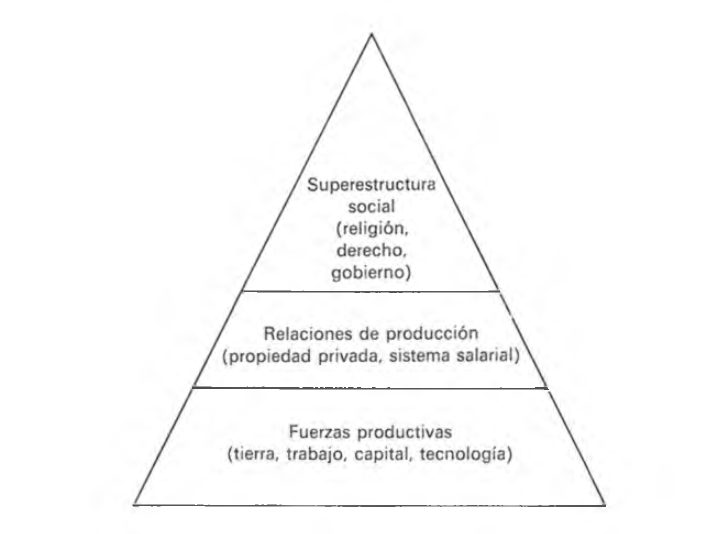
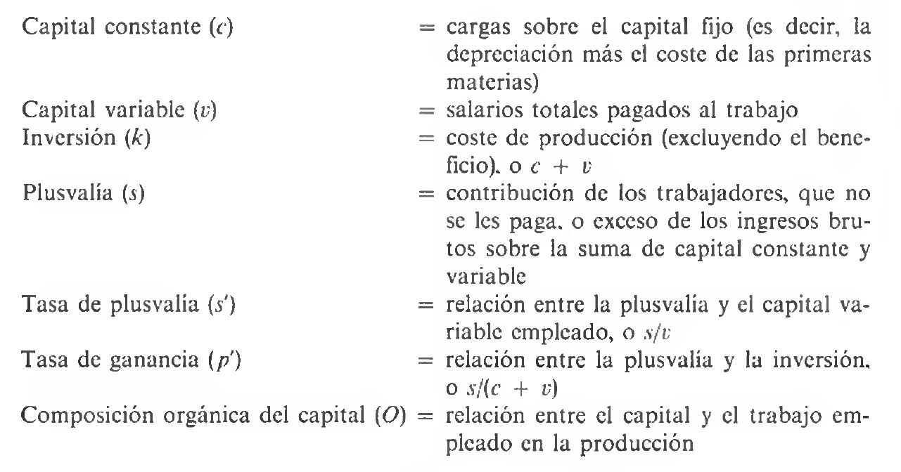
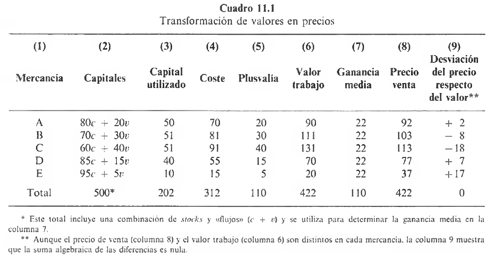
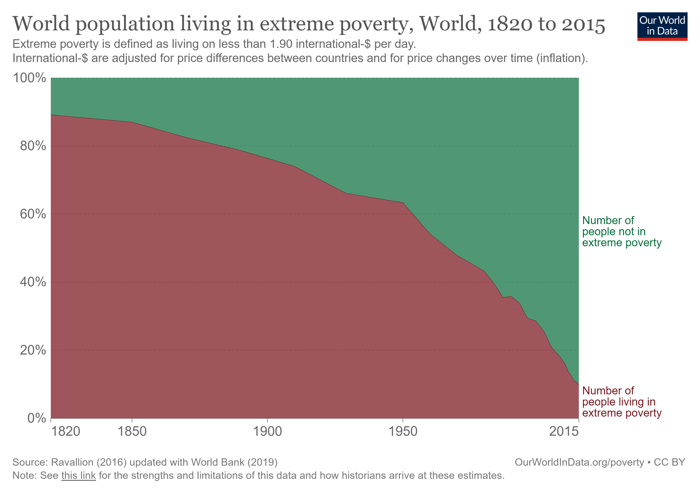
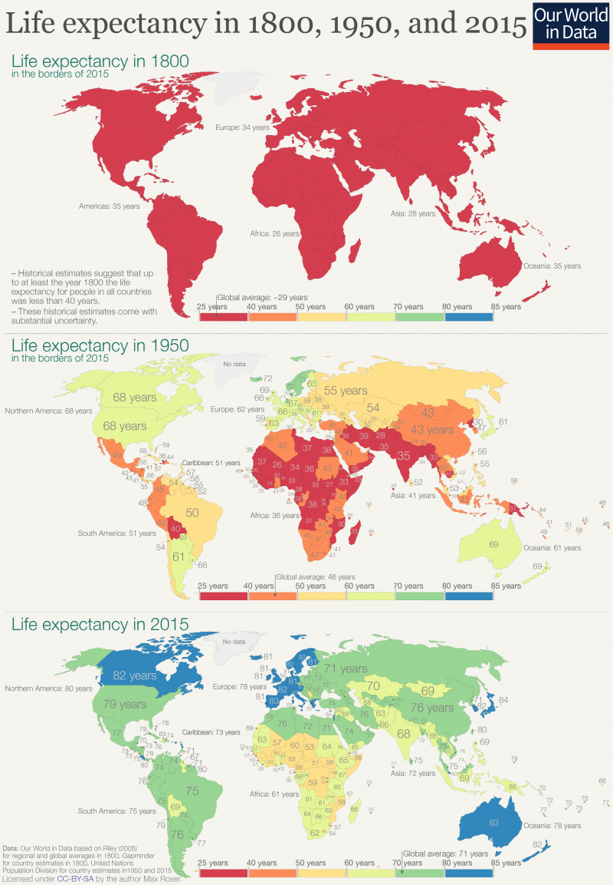
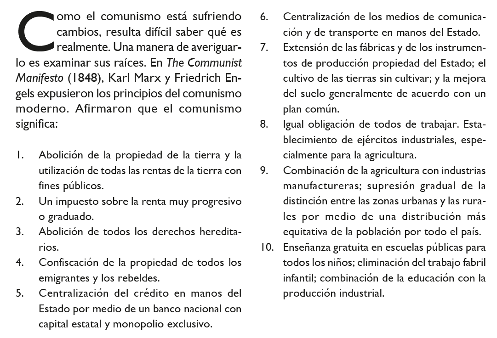

# **Introducción: Marx en contexto** {background="#390040"}

## De las reacciones al sistema

- En la unidad anterior estudiamos las **reacciones críticas** a la economía clásica: utopismo, historicismo, reformismo social
- Estas corrientes plantearon la **cuestión social** pero carecían de un marco teórico unificado
- Karl Marx (1818-1883) representa un salto cualitativo: construyó una **crítica integral** del capitalismo que unifica filosofía, historia y economía

> "Los filósofos no han hecho más que interpretar de diversos modos el mundo, pero de lo que se trata es de transformarlo."
**[Karl Marx, *Tesis sobre Feuerbach* (1845)]**

## Plan de la clase

Esta unidad está organizada en tres grandes bloques que reflejan la estructura del pensamiento marxista:

1. **Parte I: Fundamentos filosóficos e históricos**
   - Influencias: Hegel y Feuerbach
   - El materialismo histórico
   - Alienación y fetichismo de la mercancía

2. **Parte II: La economía política de Marx**
   - La teoría del valor-trabajo
   - Fuerza de trabajo, plusvalía y explotación
   - Nomenclatura y fórmulas fundamentales

3. **Parte III: Dinámica del capitalismo**
   - El problema de la transformación
   - Las leyes del movimiento capitalista
   - Crisis y caída del capitalismo

## Karl Marx: vida y obra

- Nació en Tréveris (Prusia) en 1818, hijo de padres judíos convertidos al protestantismo
- Estudió en Bonn y Berlín, donde conoció la filosofía de Hegel y Feuerbach
- Se doctoró en Jena (1841) pero no pudo acceder a la carrera académica
- En París conoció a **Friedrich Engels** (1820-1895), su colaborador de toda la vida
- Expulsado de varios países, se estableció en Londres desde 1849

## Obras fundamentales

| Período | Obras principales | Contenido central |
|---------|-------------------|-------------------|
| **1844-1849** | *Manuscritos económico-filosóficos*, *La ideología alemana*, *Manifiesto Comunista* | Alienación, materialismo histórico, programa revolucionario |
| **1857-1859** | *Grundrisse*, *Contribución a la crítica de la economía política* | Método, primeras formulaciones económicas |
| **1867-1894** | *El Capital* (3 tomos) | Sistema económico completo |

- Los tomos II y III de *El Capital* fueron publicados póstumamente por Engels

## Una observación metodológica importante

- Marx fue ante todo un **filósofo** preocupado por transformar la realidad, no solo interpretarla
- Paradójicamente, **dedicó su vida a estudiar el capitalismo**, no a describir el socialismo
- Sus referencias al comunismo se limitan esencialmente al *Manifiesto Comunista* (1848)
- La teoría económica de Marx es **una aplicación de su teoría de la historia** a la economía capitalista

> "La economía marxista ayuda a comprender las fuerzas que subyacen al mercado."
**[Oscar Lange]**

# **Parte I: Fundamentos filosóficos** {background="#390040"}

## La herencia hegeliana

- Georg Wilhelm Friedrich Hegel (1770-1831) fue la figura dominante de la filosofía alemana
- Marx quedó fascinado con su **teoría del progreso histórico**
- Para Hegel, el progreso no es un proceso suave sino que **resulta del conflicto**:

| Momento | Descripción |
|---------|-------------|
| **Tesis** | Una idea o estado de cosas dominante |
| **Antítesis** | Una fuerza opuesta que entra en conflicto |
| **Síntesis** | Una nueva realidad que supera a ambas |

- La síntesis prevalece y se convierte en nueva tesis: así avanza la historia
- Esta es la **dialéctica hegeliana**

## La inversión materialista: Feuerbach

- Ludwig Feuerbach (1804-1872) propuso el **materialismo** como corrección a Hegel
- Para Feuerbach:
  - Los seres humanos son seres *sensuales*, materiales, no solo espirituales
  - La religión es una forma de **auto-alienación**: el hombre proyecta sus cualidades en un ser imaginario (Dios)
  - Lo que se necesita es recuperar lo humano de esa proyección

> Marx adoptó la **dialéctica de Hegel** pero la invirtió con el **materialismo de Feuerbach**: no son las ideas las que mueven la historia, sino las **condiciones materiales de existencia**.

## El materialismo histórico

- Marx sintetiza a Hegel y Feuerbach en el **materialismo histórico**:

> "No es la conciencia de los hombres la que determina su ser sino que, por el contrario, su ser social determina su conciencia."
**[Karl Marx, *Contribución a la crítica de la economía política* (1859)]**

- El **primer motor de la historia** es la forma en que los seres humanos producen sus medios de vida
- La producción no es solo un acto económico, es un **acto histórico fundamental**

## Estructura y superestructura

- Marx distingue dos niveles en toda sociedad:

```
┌─────────────────────────────────────────────────┐
│    SUPERESTRUCTURA                              │
│    (ideas, leyes, política, religión, cultura)  │
├─────────────────────────────────────────────────┤
│    ESTRUCTURA ECONÓMICA                         │
│    (relaciones de producción)                   │
├─────────────────────────────────────────────────┤
│    FUERZAS PRODUCTIVAS                          │
│    (tierra, trabajo, capital, tecnología)       │
└─────────────────────────────────────────────────┘
```

- Las **fuerzas productivas** son dinámicas (cambian con la tecnología)
- Las **relaciones de producción** son relativamente estáticas (propiedad, contratos)
- Cuando entran en conflicto, se produce la **revolución social**

## La pirámide social de Marx

{#fig-piramide}

## Modos de producción y etapas históricas

- La historia avanza por etapas según el **modo de producción** dominante:

| Modo de producción | Relación característica | Ejemplo |
|--------------------|------------------------|---------|
| **Comunismo primitivo** | Propiedad colectiva | Sociedades tribales |
| **Esclavismo** | Amo-esclavo | Grecia, Roma |
| **Feudalismo** | Señor-siervo | Europa medieval |
| **Capitalismo** | Burgués-proletario | Sociedad moderna |
| **Socialismo/Comunismo** | Propiedad social | Futuro |

> "Con el molino manual tenemos la sociedad feudal; con el molino a vapor, la sociedad capitalista."
**[Karl Marx]**

## El concepto de alienación

- Marx extiende el concepto de alienación de Feuerbach a **toda la actividad económica**
- En el capitalismo, el trabajador está alienado en tres sentidos:

1. **No posee los medios de producción** (pertenecen al capitalista)
2. **No es propietario del producto** de su trabajo
3. **No controla el proceso productivo** (solo cumple un rol específico y limitado)

- Las herramientas, el producto y el proceso aparecen ante el trabajador como **entidades ajenas** ("alien")

## De la alienación al fetichismo de la mercancía

- En *El Capital*, Marx reformula la alienación como **fetichismo de la mercancía**:

> "En la producción de mercancías, la relación básica entre los hombres adopta, a sus ojos, la fantástica forma de una relación entre las cosas."
**[Karl Marx, *El Capital*, Tomo I]**

- Las relaciones sociales aparecen como relaciones entre objetos (mercancías)
- Los trabajadores no perciben que están siendo explotados porque la explotación está **oculta** en el intercambio de mercancías
- Es una **materialización de las relaciones sociales**

## Implicancias del fetichismo

- En sociedades pre-capitalistas, las relaciones de explotación eran **visibles y directas**:
  - El esclavo sabía que trabajaba para el amo
  - El siervo sabía que debía tributo al señor
  
- En el capitalismo, la explotación está **velada por el intercambio mercantil**:
  - Todos aparecen como "propietarios" intercambiando libremente
  - El trabajador "vende" su fuerza de trabajo
  - Pero no advierte que trabaja en condiciones que otro dispone

> "El proceso de producción tiene dominio sobre el hombre en lugar de ser controlado por él."

# **Parte II: La economía política de Marx** {background="#390040"}

## El objetivo analítico de Marx

- A diferencia de los clásicos, Marx se focalizó en la **dinámica**, no en la estática
- Su objetivo: **revelar las leyes del movimiento de la sociedad capitalista**

> "Poner al desnudo la ley económica del movimiento de la sociedad moderna."
**[Karl Marx, Prefacio a *El Capital*]**

- Para Marx, el capitalismo tiene **carácter histórico específico y transitorio**
- Criticó a los clásicos por dar el capitalismo por sentado, como si fuera un sistema natural y eterno

## El punto de partida: la mercancía

- Marx comienza *El Capital* analizando la **mercancía** como célula básica de la economía capitalista
- Toda mercancía tiene un doble carácter:

| Aspecto | Descripción | Tipo de relación |
|---------|-------------|------------------|
| **Valor de uso** | Utilidad, capacidad de satisfacer necesidades | Relación persona-cosa |
| **Valor de cambio** | Proporción en que se intercambia por otras | Relación persona-persona |

- Para Marx, la economía política debe estudiar el **valor de cambio** porque expresa **relaciones sociales entre personas**

## El valor cualitativo: ¿qué tienen en común las mercancías?

- Si dos mercancías se intercambian, deben tener algo en común
- Pero ¿qué puede ser? No su utilidad (valores de uso diferentes)
- Lo único que tienen en común es ser **productos del trabajo humano**

> "Es imprescindible entender que fue el análisis de las características sociales de la producción de mercancías lo que llevó a Marx a identificar el trabajo como la sustancia del valor."
**[Paul Sweezy, *Teoría del desarrollo capitalista*]**

- El valor de una mercancía representa **trabajo humano abstracto materializado**

## Trabajo útil y trabajo abstracto

- El trabajo tiene también un doble carácter:

| Tipo de trabajo | Corresponde a | Descripción |
|-----------------|---------------|-------------|
| **Trabajo útil (concreto)** | Valor de uso | Actividad específica (zapatero, carpintero, etc.) |
| **Trabajo abstracto** | Valor | Gasto de fuerza humana en general, sin distinción |

> "Por una parte, todo trabajo es, hablando fisiológicamente, un gasto de fuerza humana de trabajo, y en su carácter de trabajo humano abstracto idéntico, crea y forma los valores de las mercancías."
**[Karl Marx, *El Capital*, Tomo I]**

## El trabajo abstracto como *numeraire*

- El **trabajo abstracto** funciona como denominador común de todas las mercancías
- No era capricho de Marx: el modo de producción capitalista es compatible con esta idea
  - Alta movilidad del trabajo entre sectores
  - Los trabajadores pueden pasar de una industria a otra
  - Lo que importa no es el trabajo específico sino el trabajo *en general*

## El valor cuantitativo: trabajo socialmente necesario

- ¿Cómo se mide el valor? Por el **tiempo de trabajo socialmente necesario**:

> "La magnitud del valor expresa la conexión que existe entre cierto artículo y la parte del tiempo total de trabajo de la sociedad que se requiere para producirlo."
**[Karl Marx, *El Capital*]**

- No cualquier trabajo cuenta, sino el trabajo realizado con:
  - La tecnología promedio de la época
  - La intensidad normal de trabajo
  - Las condiciones medias de producción

## La distinción clave: trabajo y fuerza de trabajo

- Aquí está la **innovación fundamental** de Marx respecto a Ricardo:

| Concepto | Definición |
|----------|------------|
| **Trabajo** | Ejercicio efectivo de una actividad productiva |
| **Fuerza de trabajo** | La capacidad de trabajar que posee el trabajador |

- El capitalista **no compra trabajo**, compra **fuerza de trabajo**
- Es como la diferencia entre el carbón (mercancía) y el calor (lo que produce)
- Una vez adquirida, la fuerza de trabajo pertenece al comprador (capitalista)

## El valor de la fuerza de trabajo

- Si la fuerza de trabajo es una mercancía, ¿cuál es su valor?
- Como cualquier mercancía: el **tiempo de trabajo necesario para producirla**

> "El valor de la fuerza de trabajo se determina por el tiempo de trabajo necesario para la producción de los medios de subsistencia necesarios para el mantenimiento del trabajador."
**[Karl Marx, *El Capital*, Tomo I]**

- Es decir: el valor de la **comida, vivienda, vestido** que el trabajador necesita para vivir y reproducirse

## El origen de la plusvalía

- Ahora podemos entender el **secreto del capitalismo**:
  - El capitalista paga al trabajador el **valor de su fuerza de trabajo** (medios de subsistencia)
  - Pero obtiene del trabajador un **día completo de trabajo**
  - La diferencia es la **plusvalía**

**Ejemplo numérico:**

- Supongamos que los medios de subsistencia de un día equivalen a 6 horas de trabajo
- La jornada laboral es de 12 horas
- El trabajador trabaja 6 horas para reproducir su salario y **6 horas gratis** para el capitalista
- Esas 6 horas son la **plusvalía**

## La jornada de trabajo dividida

```
Jornada laboral de 12 horas
├──────────────────────────┼──────────────────────────┤
│    TRABAJO NECESARIO     │    TRABAJO EXCEDENTE     │
│       (6 horas)          │       (6 horas)          │
│                          │                          │
│  → Reproduce el salario  │  → Genera PLUSVALÍA      │
│  → Va al trabajador      │  → Va al capitalista     │
└──────────────────────────┴──────────────────────────┘
```

## La plusvalía no surge del engaño

- Punto crucial: **la plusvalía no surge porque el capitalista engañe al trabajador**

> "Todas las condiciones del problema se cumplen, en tanto que las leyes que regulan el cambio de mercancías no han sido en ninguna forma violadas. El capitalista pagó por cada mercancía su valor completo. Sin embargo, retira de la circulación más de lo que originalmente lanzó a ella."
**[Karl Marx, *El Capital*, Tomo I]**

- El capitalista paga el **valor** de la fuerza de trabajo
- Pero la fuerza de trabajo tiene la propiedad única de **crear más valor del que cuesta**
- Esta es la base de la **explotación capitalista**

## ¿Por qué no puede surgir plusvalía del intercambio?

- **No puede surgir de la circulación de mercancías**: si todos suben precios 10%, lo que gano vendiendo lo pierdo comprando
- **No puede surgir de materiales y máquinas**: estas transfieren su valor al producto pero no lo aumentan
- **Solo puede surgir de la fuerza de trabajo**: única mercancía capaz de crear más valor del que cuesta

## La especificidad del capitalismo

> "Lo específico del capitalismo no es *el hecho* de la explotación de una parte de la población por otra, sino *la forma* que adopta esta explotación, es decir, la producción de plusvalía."
**[Karl Marx]**

- En toda sociedad existe trabajo excedente (desde que existe agricultura)
- La diferencia es **cómo se extrae** ese excedente:
  - Esclavismo: coerción directa
  - Feudalismo: obligaciones personales
  - Capitalismo: intercambio "libre" en el mercado

# **Nomenclatura y definiciones fundamentales** {background="#390040"}

## Los componentes del valor de una mercancía

El **valor total de toda mercancía** se descompone en tres partes:

| Símbolo | Nombre | Contenido |
|---------|--------|-----------|
| $c$ | **Capital constante** | Valor de materiales y maquinaria usados (se transfiere, no aumenta) |
| $v$ | **Capital variable** | Valor de la fuerza de trabajo (salarios) |
| $p$ | **Plusvalía** | Excedente creado por la fuerza de trabajo |

$$\text{Valor total} = c + v + p$$

## ¿Por qué "constante" y "variable"?

- **Capital constante** ($c$): la maquinaria y los materiales **transfieren** su valor al producto pero **no lo aumentan**
  - Son "trabajo muerto" o "trabajo cristalizado"
  - Su valor permanece constante en el proceso

- **Capital variable** ($v$): la fuerza de trabajo **crea nuevo valor** más allá de lo que cuesta
  - Es la única fuente de plusvalía
  - Su valor se "expande" en el proceso productivo

## Relación con la contabilidad moderna

Esta fórmula tiene **correspondencia con las cuentas modernas**:

| Marx | Contabilidad moderna |
|------|----------------------|
| $c + v + p$ | Ventas brutas |
| $c$ | Materiales + Depreciación |
| $v$ | Sueldos y salarios |
| $p$ | Utilidad (intereses, dividendos, beneficio retenido) |

Y en términos macroeconómicos:
$$\text{PNB} = c + v + p$$
$$\text{PNN} = v + p$$

## La tasa de plusvalía ($p'$)

$$p' = \frac{p}{v}$$

- Mide la **proporción de trabajo excedente respecto al trabajo necesario**
- También llamada "tasa de explotación"
- En el ejemplo anterior (6 horas de cada tipo): $p' = \frac{6}{6} = 100\%$

**La tasa de plusvalía aumenta cuando:**

- Aumenta la duración de la jornada de trabajo
- Disminuye el salario real
- Aumenta la productividad del trabajo

## La composición orgánica del capital ($o$)

$$o = \frac{c}{c + v}$$

- Mide la **proporción de capital constante sobre el capital total**
- Indica qué tan "intensiva en capital" es la producción
- A mayor tecnificación, mayor composición orgánica

**Ejemplo:**

- Industria A: $c = 80$, $v = 20$ → $o = 80/100 = 80\%$
- Industria B: $c = 20$, $v = 80$ → $o = 20/100 = 20\%$

La industria A es más intensiva en capital.

## La tasa de ganancia ($g$)

$$g = \frac{p}{c + v}$$

- Mide la **rentabilidad del capital invertido**
- Es lo que le interesa al capitalista

**Relación fundamental:**

$$g = p'(1 - o)$$

- La tasa de ganancia depende de la tasa de plusvalía y de la composición orgánica
- A mayor composición orgánica (más máquinas), menor tasa de ganancia (para igual tasa de plusvalía)

## Tabla resumen de nomenclatura

{#fig-nomenclatura}

## Ilustración del cálculo de valor

**Ejemplo numérico completo:**

Una mercancía requiere:

- 10 horas de trabajo directo
- Materias primas que costaron 12 horas de trabajo
- 1/1000 de una máquina que costó 5000 horas producir (= 5 horas)

**Valor total = 10 + 12 + 5 = 27 horas de trabajo**

Si el trabajador necesita 6 horas de trabajo para sus medios de subsistencia:

- Salario = 6 horas
- Plusvalía = 10 - 6 = 4 horas
- Tasa de plusvalía = 4/6 = 66.7%

# **Parte III: La dinámica del capitalismo** {background="#390040"}

## Los circuitos M-D-M y D-M-D'

Marx distingue dos tipos de circulación:

**Producción simple de mercancías (M-D-M):**
$$\text{Mercancía} \rightarrow \text{Dinero} \rightarrow \text{Mercancía}$$

- El productor vende para comprar
- El objetivo es obtener valores de uso

**Producción capitalista (D-M-D'):**
$$\text{Dinero} \rightarrow \text{Mercancía} \rightarrow \text{Dinero'}$$

- El capitalista compra para vender
- El objetivo es obtener **más dinero** ($D' > D$)
- La diferencia $D' - D$ es la **plusvalía**

## La lógica del capital

> "La circulación del dinero como capital es un fin en sí misma, puesto que la expansión del valor sólo tiene lugar en el curso de este movimiento renovado sin cesar. La circulación del capital, por tanto, no tiene límites."
**[Karl Marx, *El Capital*, Tomo I]**

- El capitalista no busca valores de uso, busca **acumulación sin fin**
- Los valores de uso nunca son el fin real del capitalista
- El proceso de obtención de ganancias es "inacabable y sin descanso"

## El problema de la transformación

- Marx asumía inicialmente que las mercancías se intercambian según sus **valores-trabajo**
- Pero también observó que la competencia tiende a igualar las **tasas de ganancia** entre industrias
- El problema: industrias con diferente composición orgánica tendrían diferentes tasas de ganancia

**Ejemplo:**

| Industria | $c$ | $v$ | $p$ (si $p'=100\%$) | Valor | $g$ |
|-----------|-----|-----|---------------------|-------|-----|
| A | 80 | 20 | 20 | 120 | 20% |
| B | 50 | 50 | 50 | 150 | 50% |
| C | 20 | 80 | 80 | 180 | 80% |

Si esto fuera así, todo el capital iría a la industria C.

## La solución de Marx

{#fig-transformacion}

## Explicación de la transformación

- Marx argumentó que la **competencia de capitales** iguala las tasas de ganancia
- Los precios de mercado **se desvían** de los valores-trabajo
- Pero estas desviaciones **se compensan en el agregado**

**Procedimiento:**

1. Calcular la **tasa media de ganancia**: $\bar{g} = \frac{\sum p}{\sum (c+v)}$
2. El **precio de producción** de cada mercancía: $\text{costo} + \bar{g} \times \text{capital}$
3. Las desviaciones individuales se anulan en el total

> "Las desviaciones del precio se anulan mutuamente mediante una distribución uniforme de la plusvalía."

## Las cinco leyes del movimiento capitalista

Marx identificó cinco **tendencias inherentes** al capitalismo:

1. **Ley de la acumulación** y tasa decreciente de ganancia
2. **Ley de la concentración** y centralización del capital
3. **Ley del ejército industrial de reserva**
4. **Ley de la miseria creciente** del proletariado
5. **Ley de las crisis** y depresiones

Cada una surge del conflicto entre **fuerzas productivas** (dinámicas) y **relaciones de producción** (estáticas).

## 1. La tendencia decreciente de la tasa de ganancia

- Los capitalistas buscan más plusvalía, pero para competir **sustituyen trabajo por máquinas**
- Esto aumenta la **composición orgánica** ($o$)
- Dado que $g = p'(1-o)$, si $o$ aumenta, $g$ tiende a caer

**Paradoja:**

- Cada capitalista individual busca reducir costos mecanizando
- Pero el resultado agregado es menor tasa de ganancia para todos
- La fuente de la plusvalía (trabajo vivo) disminuye proporcionalmente

## 2. Concentración y centralización del capital

- La mecanización requiere mayor escala
- Las crisis eliminan a los productores menos eficientes
- Los "peces grandes comen a los peces chicos"

**Resultado:**

- Cada vez menos capitalistas controlan más capital
- Tendencia al monopolio
- Desaparición de la pequeña burguesía

## 3. El ejército industrial de reserva

- La sustitución de trabajo por capital genera **desempleo estructural**
- Marx distingue dos tipos de desempleo:
  1. **Tecnológico**: por sustitución de L por K
  2. **Cíclico**: por crisis de sobreproducción

- Este "ejército de reserva" cumple una función:
  - Presiona los salarios a la baja
  - Disciplina a los trabajadores empleados
  - Permite expandir la producción rápidamente cuando conviene

## 4. La miseria creciente del proletariado

- El ejército de reserva presiona los salarios hacia abajo
- Los capitalistas intentan compensar la tasa decreciente de ganancia con:
  - Salarios más bajos
  - Jornadas más largas
  - Peores condiciones de trabajo
  
- Marx preveía la incorporación de mujeres y niños al trabajo
- Esta fue quizás su predicción **más cuestionada** por la evidencia histórica

## Definiciones adicionales

{#fig-defs1}

## Definiciones adicionales (cont.)

{#fig-defs2}

## 5. Las crisis y la caída del capitalismo

- Marx fue uno de los primeros en vincular **crisis con inversión**
- Las crisis no son accidentes sino **características estructurales**:
  1. Tendencia a la acumulación
  2. Sobreproducción
  3. Caída de precios y quiebras
  4. Mayor desempleo
  5. Nueva acumulación...

- Las crisis serían cada vez **más graves y frecuentes**
- Eventualmente llevarían a la **revolución social**

## El fin del capitalismo

> "La consecuencia lógica e inevitable de todo esto es la revolución social a través de la cual el proletariado se alza, se libera de sus cadenas y se apodera de los medios de producción."

- El capitalismo cavaría su propia tumba al:
  - Concentrar a los trabajadores en fábricas
  - Crear las condiciones materiales para el socialismo
  - Generar crisis que demostrarían su irracionalidad

## Los principios del comunismo

{#fig-comunismo}

# **Valoración crítica** {background="#390040"}

## Contribuciones perdurables

1. **Enfoque histórico**: el capitalismo como sistema históricamente específico, no natural
2. **Análisis de la explotación**: reveló las relaciones de poder ocultas en el intercambio mercantil
3. **Teoría de las crisis**: anticipó el análisis del ciclo económico
4. **Concentración del capital**: tendencia confirmada históricamente
5. **Interacción economía-sociedad**: las instituciones importan

## Críticas y limitaciones

1. **Teoría del valor-trabajo**: no resuelve satisfactoriamente el problema de la transformación
2. **Predicciones fallidas**:
   - La miseria creciente no se verificó en países desarrollados
   - El capitalismo demostró mayor capacidad de adaptación
   - Las revoluciones ocurrieron en países menos desarrollados
3. **Subvaloración de la productividad del capital**: las máquinas no solo transfieren valor
4. **Determinismo económico excesivo**: subestimó la autonomía de la política y la cultura

## El legado de Marx

> "Uno puede estar de acuerdo o en desacuerdo con Marx, pero no puede ignorarlo."

- Sus categorías analíticas siguen siendo útiles para entender:
  - La desigualdad y la distribución del ingreso
  - Las crisis financieras
  - La globalización y el poder corporativo
  - Los conflictos sociales

- La economía marxista y la economía ortodoxa pueden verse como **complementarias** (Lange):
  - Marx para entender la evolución
  - La ortodoxia para la gestión

# **Bibliografía** {background="#390040"}

## Lecturas principales

- **Sweezy, P.** (1942). *Teoría del desarrollo capitalista*. Capítulos 1-7. [Texto fundamental para comprender a Marx]
- **Ekelund, R.B. y Hébert, R.F.** (2005). *Historia de la teoría económica y de su método*. Capítulo 11.
- **Roncaglia, A.** (2006). *La riqueza de las ideas*. Capítulo 9.

## Lecturas complementarias

- **Marx, K.** (1867). *El Capital*, Tomo I. Capítulos 1, 4, 6-8.
- **Marx, K. y Engels, F.** (1848). *El Manifiesto Comunista*.
- **Schumpeter, J.A.** (1954). *History of Economic Analysis*. Part III, Capítulo 6.
- **Roll, E.** (1939). *Historia de las doctrinas económicas*. Capítulo 6.

## Preguntas para reflexionar

1. ¿Es posible separar la filosofía de Marx de su economía? ¿Cuáles son las ventajas y desventajas de hacerlo?

2. ¿La distinción entre trabajo y fuerza de trabajo resuelve los problemas de la teoría del valor-trabajo de Ricardo?

3. ¿Por qué la predicción de la miseria creciente no se cumplió en los países desarrollados? ¿Invalida esto toda la teoría?

4. ¿El problema de la transformación de valores en precios es una debilidad fatal de la teoría marxista?

5. ¿Qué elementos del análisis de Marx siguen siendo relevantes para entender el capitalismo contemporáneo?
