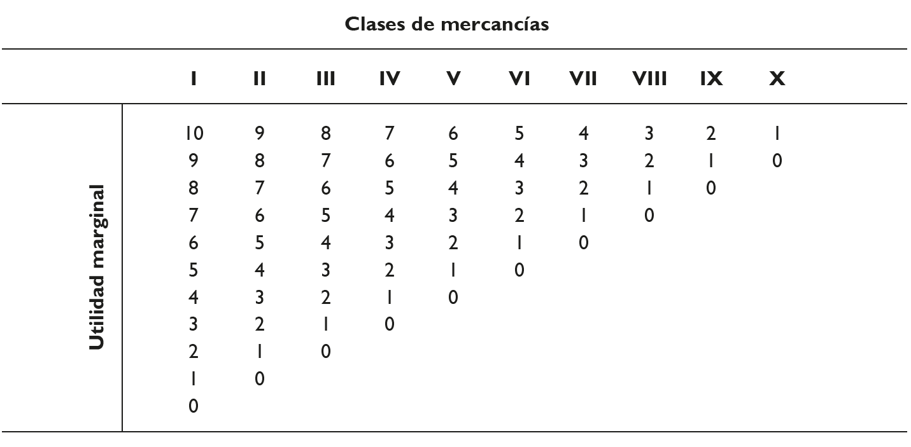
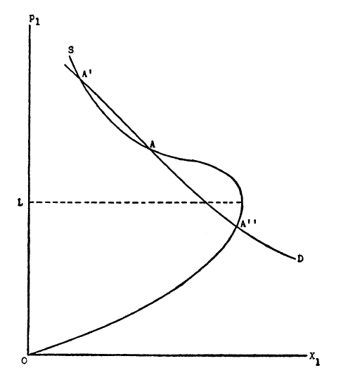

# Introducción: el cambio de paradigma {background="#43464B"}

## Del valor-trabajo al valor-utilidad

- La escuela clásica inglesa utilizó métodos formales y abstracción
  guiada por la lógica deductiva para estudiar fenómenos económicos
  $\longrightarrow$ pero el foco estaba en la *macroeconomía*: renta,
  producto, población y crecimiento
- La difusión de las ideas clásicas impactó sobre el surgimiento del
  análisis económico en el continente --Francia y Austria fueron dos
  ejemplos destacados
- A diferencia de la escuela clásica inglesa, el foco del análisis
  estuvo en la **microeconomía**: precios, cantidades y estructuras de
  mercado
  
## La irrupción del análisis microeconómico

- Se realizaron avances en finanzas públicas y economía del bienestar;
  sobre decisiones de localización y costos de transporte
- Se sentaron las bases de las teorías de discriminación de precios y
  diferenciación del producto
- Y fundamentalmente se cerró definitivamente el problema del valor
  con la contribución de la **teoría de la utilidad marginal**
- Esta "revolución" ocurrió en forma casi simultánea e independiente
  en tres lugares: Inglaterra (Jevons), Austria (Menger) y Suiza
  (Walras)

## Los tres padres de la revolución marginalista

- La teoría de la utilidad finalmente empezó a ganarse un lugar en la
  economía aceptada en los años 1870s de la mano de un tríptico de
  autores que desarrollaron versiones similares de manera
  independiente $\longrightarrow$ **Jevons, Menger y Walras**
- Cada uno de ellos criticó el "canon ricardiano" de la teoría del
  valor pero esto fue generalmente en segundo plano
  - cada uno creía que la teoría de la utilidad marginal tenía mérito
    suficiente para ser aceptada por si misma
- Para llegar a ellos debemos ver primero a los **precursores** de
  esta revolución

# Los precursores de la revolución marginalista {background="#43464B"}

## Hermann Heinrich Gossen [1810-1858]

- Gossen fue un matemático y economista alemán que buscó matematizar
  el **cálculo hedonístico de Bentham**
- Tuvo influencia en Jevons ya que fue el primero que formuló el
  principio fundamental de la teoría de la utilidad marginal
- En su libro *Entwickelung der Gesetze des menschlichen Verkehrs*
  (1854) estableció lo que hoy conocemos como las **leyes de Gossen**

## Las leyes de Gossen

> **Primera Ley de Gossen (utilidad marginal decreciente).** La
> cantidad de un mismo goce disminuye constantemente a medida que
> experimentamos dicho goce sin interrupción, hasta que se alcanza la
> saciedad.

> **Segunda Ley de Gossen (principio equimarginal).** Una persona
> maximiza su utilidad cuando distribuye su dinero disponible entre
> los diversos bienes de modo que obtiene la misma cantidad de
> satisfacción de la última unidad monetaria (*Geld-atom*) gastada en
> cada mercancía.

## Las leyes de Gossen: formalización

- En otras palabras, el principio equimarginal establece:
\begin{equation}
\frac{UMg_{1}}{p_{1}}=\frac{UMg_{2}}{p_{2}}=\frac{UMg_{3}}{p_{3}}=...=UMg_{Y}
\end{equation}
- Donde $UMg_{i}$ es la utilidad marginal del bien $i$, $p_{i}$ es su
  precio y $UMg_{Y}$ es la utilidad marginal del ingreso
- Esta condición de equilibrio del consumidor sería retomada y
  formalizada por Jevons, Menger y Walras independientemente

## Johann Heinrich von Thünen [1783-1850]

- Von Thünen fue un terrateniente y economista alemán que influyó en
  Marshall a través del **principio equimarginal**
- Fue pionero de la **teoría económica de la localización espacial**
  $\longrightarrow$ a diferencia de Ricardo priorizó diferencias de
  localización y no sólo de productividad
- Su modelo de los "anillos de Thünen" explicaba la organización del
  uso del suelo agrícola en función de la distancia al mercado y los
  costos de transporte

## Hans Karl Emil von Mangoldt [1824-1868]

- Von Mangoldt fue un teórico liberal que estudió con Roscher (Escuela
  Histórica Alemana)
- Estudió dos temas centrales:
  1. Teoría del beneficio y papel del empresario
  2. Teoría subjetiva del valor
- Anticipó elementos que serían centrales en la escuela austríaca
  posterior

# La microeconomía en Francia {background="#43464B"}

## Los "ingenieros economistas" franceses

- En paralelo a los precursores alemanes, en Francia surgió un grupo
  de pensadores que dieron impulso decisivo a la introducción del
  **análisis microeconómico**
- Fueron ingenieros de formación que concebían la economía como una
  vocación y no como profesión
- Los dos más importantes fueron **Antoine-Augustin Cournot** y
  **Jules Dupuit**
- Sus contribuciones sentaron las bases de la teoría de la empresa y
  el análisis del bienestar

## Antoine-Augustin Cournot [1801-1877]

- Mente muy original, estudió matemática en la *École Normale* de
  París y tuvo contacto fluido con físicos e ingenieros
- Su principal contribución está en el libro *Recherches sur les
  principes mathématiques de la théorie des richesses* (1838)
- Valoró y abogó por el uso de las matemáticas como procedimiento
  abreviado para expresar ideas complejas $\longrightarrow$ "para
  encontrar relaciones entre magnitudes, entre funciones"
- Descubrió "la **ley de la demanda**": $D=F(P)$ y comprendió
  perfectamente el supuesto *ceteris paribus*

## Cournot: los modelos microeconómicos

- Usó estos métodos para crear **modelos de comportamiento de la
  empresa**. Sus dos modelos más importantes fueron:
  1. **Modelo del monopolio** $\longrightarrow$ el monopolista cobra
     un precio $p$ tal que el ingreso total $pF(p)$ sea máximo, es
     decir cuando $CMg=IMg$
  2. **Modelo de duopolio** $\longrightarrow$ introdujo un vendedor
     adicional y desarrolló la famosa **curva (función) de reacción**
- El punto de equilibrio es estable; los duopolistas se reparten el
  beneficio y cargan el mismo precio --más bajo que en monopolio pero
  más alto que en competencia

## Jules Dupuit [1804-1866]

- Fue el primer economista que presentó una discusión del concepto de
  **utilidad marginal** y lo relacionó con la curva de demanda (1844)
- Argumentó que la utilidad que un individuo obtiene de un *stock* de
  bienes se determina por el uso a que se destinan las *últimas
  unidades del stock*
- Jevons reconoció honorablemente que Dupuit era quien debía ser
  *"credited with the earliest perfect comprehension of the theory of
  utility"*
- Al vincular la curva de demanda con la teoría de la utilidad
  básicamente **fundó la economía del bienestar**

## Dupuit: el excedente del consumidor

- Fue pionero en el concepto de **excedente del consumidor**
  $\longrightarrow$ "utilidad que queda a los consumidores"
- También realizó contribuciones en las áreas de monopolio y
  **discriminación de precios** estudiando factores detrás de
  formación de precios de monopolio
- Finalmente, realizó contribuciones en el **análisis
  beneficio-costo** $\longrightarrow$ la regla general era que el
  gobierno debía proveer bienes si el costo anual pudiera cubrirse
  dejando alguna "utilidad neta"

# William Stanley Jevons y la utilidad marginal {background="#43464B"}

## William Stanley Jevons [1835-1882]: vida

- Jevons nació en Liverpool en una familia unitaria de clase media
  comerciante $\longrightarrow$ estudió en el University College de
  Londres
- Con sólo 19 años, viajó a Sydney, Australia, para trabajar como
  ensayador en la Casa de Moneda --allí desarrolló su interés por la
  economía
- Regresó a Inglaterra en 1859 y publicó su obra más importante *The
  Theory of Political Economy* en 1871
- Murió trágicamente ahogado en 1882 a los 46 años

## Jevons: la crítica a Ricardo

- Jevons identificó varias deficiencias en la teoría ricardiana:
  1. Ricardo requería una teoría especial para bienes con oferta fija
     (estatuas, pinturas) --esto sugería que el costo del trabajo *no
     era esencial* al valor
  2. Altos costos de trabajo no darán alto valor a una mercancía si la
     demanda futura es erróneamente estimada
  3. El trabajo es heterogéneo y los diferentes tipos de $L$ sólo
     pueden ser comparados a través de los valores de sus productos
- Sugirió que la teoría del valor del costo de producción encaja bien
  como un **caso especial** de la teoría de la utilidad

## Jevons: la teoría de la utilidad

- La ciencia económica era para Jevons una **mecánica de la utilidad y
  el interés individual**:

> The science of Economics...is in some degree peculiar, owing to the
> fact...that its ultimate laws are known to us immediately by
> intuition...The theory here given may be described as *the mechanics
> of utility and self-interest*...Its method is as sure and
> demonstrative as that of kinematics or statics, nay, almost as
> self-evident as are the elements of Euclid...
**[William Stanley Jevons, *Theory of Political Economy* (1911)]**

## Jevons: la mensurabilidad de la utilidad

- Jevons fue ambivalente sobre la mensurabilidad de la utilidad
  $\longrightarrow$ inicialmente la rechazó pero fue mutando hacia el
  escepticismo

> There is no unit of labour, or suffering, or enjoyment. I have
> granted that we can hardly form the conception of a unit of pleasure
> or pain, so that the numerical expression of quantities of feelings
> seems to be out of question
**[William Stanley Jevons, *Theory of Political Economy* (1911)]**

- Sin embargo, luego sugirió un método ingenioso para "medir la
  utilidad" a través de la demanda observada

## Jevons: utilidad marginal y demanda

- Relacionó ingeniosamente demanda con utilidad marginal a partir de
  la siguiente fórmula:
\begin{equation}
UMg_{Y} \cdot p_{i}=UMg_{i}
\end{equation}
- Donde $UMg_{Y}$ es la utilidad marginal del ingreso
- Argumentaba que podía construirse una curva de demanda a través de
  la observación y luego pasar a la curva de utilidad marginal
- Pero reconocía que este método no aplicaba bien para bienes básicos
  como el pan cuyo precio afecta los recursos del consumidor

## Jevons: la ecuación del intercambio

- Presentó su ecuación principal del intercambio como un "hecho
  consumado":
\begin{equation}
\frac{UMg_{1}}{UMg_{2}}=\frac{p_{1}}{p_{2}}
\end{equation}
- Esta ecuación era cierta al *nivel del individuo* ($p$ dados) pero
  *no al nivel del mercado*
- Creó dos conceptos relevantes:
  1. **El cuerpo comercial** $\longrightarrow$ conjunto de compradores
     y vendedores en un mercado competitivo
  2. **La ley de la indiferencia** $\longrightarrow$ debía haber sólo
     *un* precio en el mercado

## Jevons: comparaciones interpersonales

- A diferencia de Menger y Walras, Jevons consideró el tema de las
  **comparaciones interpersonales de utilidad** y las consideró
  expresamente imposibles
  - aunque él mismo no pudo evitar incurrir en algunas comparaciones
- El tratamiento de la utilidad marginal de Jevons fue el más cercano
  al que luego haría Marshall en sus *Principios*
- Su principal aplicación fue demostrar que ambas partes en un
  intercambio ganan (aumentan su) satisfacción

# La escuela austríaca: Carl Menger y sus discípulos {background="#43464B"}

## De Alemania a Austria: raíces del análisis marginalista

- Cuando se habla de la **escuela de Viena**, hay 3 nombres
  principales que vienen a la mente:
  - **Carl Menger** (el fundador)
  - **Friedrich Wieser**
  - **Eugen Böhm-Bawerk**
- Entre ellos instalaron una aproximación sistemática y científica al
  análisis económico
- Toda una tradición de autores famosos se formaron en esa tradición:
  Schumpeter, von Mises, Hayek, Machlup, Haberler y Morgenstern

## Carl Menger [1840-1921]: el líder

- Menger no fue influido mucho por los precursores sino que sus
  principales influencias fueron de la **escuela historicista alemana**
- Estudió derecho en las universidades de Praga y Viena y luego viró
  hacia la economía; obtuvo una cátedra en Viena en 1873
- Publicó sus *Grundsätze der Volkswirtschaftslehre* (Principios de
  Economía Política) en 1871, el mismo año que Jevons publicó su
  *Theory of Political Economy*
- Fue el líder de una verdadera **revolución teórica** y además un
  fenomenal polemista verbal

## Menger: la *Methodenstreit*

- La **Methodenstreit** o "batalla de los métodos" fue una famosa
  disputa entre Menger y Gustav Schmoller
- **Menger** defendía la naturaleza atomística y subjetiva de la
  economía $\longrightarrow$ las ideas colectivas y agregadas no
  podían tener una fundamentación adecuada
- **Schmoller** defendía el método histórico $\longrightarrow$ única
  forma de considerar instituciones dinámicas; criticaba el foco en
  comportamiento individual bajo fuertes restricciones
- Eventualmente la disputa se zanjó para el lado austríaco y parte de
  la razón fueron los *Principios* de Menger

## Menger: el *homo economicus* y la utilidad

{#fig-precios}

## Menger: la tabla de utilidades

- Existían tipos/clases de bienes (mercancías) indexados por números
  romanos de menor a mayor según su condición de esencial
- Con números arábigos se representaban las utilidades a medida que se
  consumía más cantidad de cada bien
- **Ejemplo:** Si el agua es el bien I y los diamantes son el bien
  VIII y un consumidor ha consumido 8 unidades de agua y ninguna de
  diamantes:
  - La $UMg$ de una unidad de agua adicional es de sólo 2
  - La $UMg$ de diamantes (primera unidad) es de 3

## Menger: solución a la paradoja del valor

> **La paradoja del valor resuelta.** El precio de los diamantes es
> mayor que el precio del agua porque es la **utilidad marginal**
> ($UMg$) la que determina la elección del consumidor y no la utilidad
> total, y por tanto, es la que determina el precio. La utilidad total
> del agua es claramente mayor que la de los diamantes; pero la $UMg$
> de los diamantes es mayor que la $UMg$ del agua (en el margen).

## Menger: la crítica a Ricardo

- Menger añadió una crítica importante a la teoría de la renta
  ricardiana $\longrightarrow$ si el valor de la tierra no dependía de
  los costos de trabajo, esto demostraba una falta de generalidad
  bastante seria de la teoría clásica del valor
- Misma crítica compartida por Walras
- Además, desarrolló una discusión de determinación de precios en:
  - Monopolio bilateral (indeterminación)
  - Duopolio (brindó un equilibrio competitivo)
  - Competencia (ausencia de teoría de la producción)

## Menger: la mensurabilidad de la utilidad

- Menger fue tal vez el mayor militante y apologista de la
  **mensurabilidad de la utilidad**
- Representó la $UMg$ a través de números y empleó el mecanismo de la
  igualación de $UMg$ en varios usos para determinar asignación de una
  mercancía
- Para él, la teoría de la $UMg$ era *la base* de la teoría económica
  $\longrightarrow$ incluso la teoría de la producción era simplemente
  una instancia de la teoría de la $UMg$
- Los servicios de producción (factores) sólo se distinguían de los
  servicios de consumo por ser **bienes de mayor orden**

## Los discípulos: Friedrich Wieser [1851-1926]

- Wieser desarrolló la teoría del **costo de oportunidad**
  $\longrightarrow$ el valor de los factores de producción depende del
  valor de los bienes que podrían producir en usos alternativos
- Acuñó el término **"utilidad marginal"** (*Grenznutzen*)
- Desarrolló la teoría de la **imputación** $\longrightarrow$ cómo el
  valor de los bienes de consumo se "imputa" a los factores que los
  producen

## Los discípulos: Eugen Böhm-Bawerk [1851-1914]

- Böhm-Bawerk desarrolló la **teoría del capital y el interés**
  basada en preferencias temporales
- El interés surge porque los bienes presentes valen más que los
  bienes futuros $\longrightarrow$ la gente tiene una "preferencia
  temporal positiva"
- Criticó duramente la teoría marxista del valor-trabajo en su obra
  *Karl Marx and the Close of His System* (1896)
- Según Stigler, tanto Wieser como Böhm-Bawerk poco contribuyeron
  directamente a la teoría de la utilidad marginal pero fueron
  quienes más "hypearon" la teoría

# Léon Walras y el equilibrio general {background="#43464B"}

## Léon Walras [1834-1910]: vida

- Marie-Esprit-Léon Walras nació en Évreux, Francia
  $\longrightarrow$ hijo de Auguste Walras, también economista
- Fracasó inicialmente como ingeniero, novelista y periodista antes de
  dedicarse a la economía
- En 1870 obtuvo la cátedra de economía política en la Universidad de
  Lausana (Suiza) donde permaneció hasta su retiro
- Publicó sus *Éléments d'économie politique pure* en 1874

## Walras: la crítica a Ricardo

- Walras enfatizó los **efectos recíprocos** de precios de bienes y
  factores entre sí
- Negaba la existencia de bienes cuya oferta podía ser incrementada
  infinitamente (supuesto implícito en Ricardo)
- También supuso la existencia de una unidad de medida de la utilidad
  y eventualmente hablaba en términos de la utilidad como una magnitud
  absoluta

## Walras: la función de demanda

- Fue Walras quien estableció la correcta relación entre **utilidad y
  demanda**
- Primero, derivó las ecuaciones de satisfacción máxima para un
  individuo: si hay $m$ mercancías y una unidad de la mercancía
  $x_{1}$ es el *numerario*, entonces tenemos $(m-1)$ ecuaciones:
\begin{equation}
UMg_{1}=\frac{UMg_{2}}{p_{2}}=\frac{UMg_{3}}{p_{3}}=....
\end{equation}

## Walras: la restricción presupuestaria

- La restricción presupuestaria establece la igualdad de valores de
  los stocks iniciales de bienes $(x_{i}^{0})$ y los stocks luego del
  intercambio:
\begin{equation}
x_{1}+x_{2}p_{2}+x_{3}p_{3}+....=x_{1}^{0}+x_{2}^{0}p_{2}+x_{3}^{0}p_{3}+....
\end{equation}
- Entonces un sistema de $m$ ecuaciones para $m$ incógnitas
  (cantidades):
\begin{align}
x_{2}&=x_{2}(p_{2}, p_{3},...) \\
x_{3}&=x_{3}(p_{2}, p_{3},...) \\
....&= .............
\end{align}

## Walras: las funciones de demanda de mercado

- Para los **precios de mercado** sumamos las $n$ demandas
  individuales para cada mercancía:
\begin{align}
X_{2}&=\sum^{n} x_{2}=\sum^{n} x_{2}(p_{2}, p_{3}, ...) \\
X_{3}&=\sum^{n} x_{3}=\sum^{n} x_{3}(p_{2}, p_{3}, ...) \\
\end{align}
- E igualamos las cantidades demandadas a las cantidades disponibles:
\begin{align}
X_{2}^{0}&=X_{2} \\
X_{3}^{0}&=X_{3}
\end{align}

## Walras: la Ley de Walras

- Si sumamos las restricciones presupuestarias individuales:
\begin{equation}
\sum^{n}x_{1}-X_{1}^{0}=p_{2}(X_{2}^{0}-X_{2})+p_{3}(X_{3}^{0}-X_{3})+...=0
\end{equation}
- Por lo tanto, si la cantidad demandada iguala a la cantidad
  disponible en $(m-1)$ mercados, la igualdad también deberá regir en
  el mercado $m$-ésimo $\longrightarrow$ **Ley de Walras**
- La **función de demanda walrasiana** es la relación entre la
  cantidad de una mercancía y *todos los precios* cuando las
  preferencias y el ingreso de los individuos se mantienen constantes

## Walras: aplicaciones de la teoría

- Una de las aplicaciones más importantes $\longrightarrow$
  reducciones de $p$ aumentan $q$ demandada y aumentos de $p$ reducen
  $q$ demandada
- Si $p_{2}$ cae en $\delta p_{2}$ y suponiendo que al individuo no se
  le brinda su ingreso real excedente $x_{2}\delta p_{2}$:
  - Al nuevo precio $p_{2}-\delta p_{2}$, el individuo obtiene mayor
    utilidad marginal por peso de $X_{2}$ que de cualquier otra
    mercancía
  - Por lo que **sustituirá** $X_{2}$ por otras mercancías
  - Restaurando $x_{2}\delta p_{2}$ ahora comprará **más de cada una**

## Walras: equilibrios múltiples

{#fig-precios}

## Walras: equilibrios múltiples (cont.)

- Walras desarrolló la teoría de los **equilibrios múltiples**
  $\longrightarrow$ intercambio de una mercancía por otra en mercado
  competitivo y ambas dan utilidad
- Si $p_{1}$ es $0$ (no se da nada de $X_{2}$ a cambio de $X_{1}$)
  entonces $X_{1}=0$
- A mayor $p_{1}$ ofrecen más de $X_{1}$ para obtener más de $X_{2}$
  pero más allá de cierto precio, *ofrecen menos de $X_{1}$* ya que
  están relativamente saciados con $X_{2}$
- Su curva de demanda cruza a la de oferta en varios puntos --algunos
  como $A'$ y $A''$ son **estables** mientras que $A$ es **inestable**

## Walras: el equilibrio general

- El gran logro de Walras fue demostrar que todos los mercados están
  **interconectados** y que existe un sistema de precios que puede
  vaciar todos los mercados simultáneamente
- Esto constituyó la base del **análisis de equilibrio general** que
  sería formalizado matemáticamente en el siglo XX por Arrow, Debreu y
  McKenzie
- El sistema walrasiano permitía estudiar cómo un cambio en un mercado
  afecta a todos los demás

# La forma de la función de utilidad {background="#43464B"}

## La función de utilidad aditiva

- Los tres fundadores de la teoría de la utilidad *trataron a la
  utilidad de una mercancía como función solamente de la cantidad de
  esa mercancía*
- Jevons y Walras escribieron la **utilidad total de un individuo**
  como:
\begin{equation}
U=f(x_{1})+g(x_{2})+h(x_{3})+....
\end{equation}
- Además cada mercancía tenía asociada **utilidad marginal
  decreciente** $\longrightarrow$ demanda con pendiente negativa
- Y también que un aumento de $Y$ conduce a un aumento en la cantidad
  de todas las mercancías

## La generalización de Edgeworth

- Fue **Francis Edgeworth** quien pateó el tablero cuando trató de
  darle más generalidad a la función de utilidad:
\begin{equation}
U=\phi(x_{1}, x_{2}, x_{3}, ...)
\end{equation}
- El problema era importante:
  - Con la **función de utilidad total aditiva** la *utilidad marginal
    decreciente* era condición suficiente para obtener curvas de
    indiferencia convexas
  - Con la **función de utilidad total generalizada** la *utilidad
    marginal decreciente* no es condición necesaria ni suficiente para
    curvas de indiferencia convexas
- En este caso no puede garantizarse que todas las demandas tienen
  pendiente negativa

## Interdependencia de utilidades

- La otra generalización fue la inclusión de la cantidad consumida por
  otros individuos en la función de utilidad individual
  $\longrightarrow$ la utilidad del consumo de diamantes se ve
  reducida mientras más individuos consuman diamantes
- Fisher sugirió esta idea luego ampliada por Cunynghame y Pigou

> Almost the whole value of strawberries in March, to those who like
> this tasteless mode of ostentation, is the fact that others cannot
> get them. As my landlady once remarked, "Surely, sir, you would not
> like anything so common and cheap as a fresh herring?"
**[Henry Cunynghame (1892)]**

# Síntesis y evaluación {background="#43464B"}

## Comparación de los tres fundadores

| Aspecto | Jevons | Menger | Walras |
|---------|--------|--------|--------|
| Formación | Lógico/estadístico | Jurista | Ingeniero |
| Énfasis | Utilidad y trabajo | Subjetivismo puro | Equilibrio general |
| Mensurabilidad | Escéptico | Defensor | Supuesta |
| Matemáticas | Moderado uso | Mínimo uso | Uso extensivo |
| Herencia | Marshall | Escuela austríaca | Teoría moderna |

## Lo que quedó en pie

- Jevons, Menger y Walras fueron los tres padres de la teoría de la
  utilidad $\longrightarrow$ llegaron a la misma en forma independiente
  y dieron versiones muy similares entre sí
- Jevons y Walras fueron los más precisos y formalmente elegantes
- La función de utilidad total que más se utiliza es la aditiva y no
  la generalizada --tal vez por razones prácticas, tal vez por razones
  empíricas
- Pero más allá de estas discusiones, no hubo una reformulación
  significativa de la teoría de la utilidad como la concibieron
  Jevons, Menger y Walras y la inmortalizara Marshall

## Legado de la revolución marginalista

- La **revolución marginalista** representó un cambio de paradigma
  fundamental en la economía:
  1. Del valor-trabajo al **valor subjetivo basado en utilidad**
  2. Del análisis de clases sociales al **análisis del individuo**
  3. De la macroeconomía del crecimiento a la **microeconomía de la
     asignación**
  4. Del método histórico-inductivo al **método deductivo-matemático**
- Este cambio sentó las bases de lo que hoy conocemos como **economía
  neoclásica**

## Referencias principales

- Ekelund, R.B. y Hébert, R.F. *Historia de la Teoría Económica y de
  su Método*. McGraw-Hill.
  - Capítulos 12-14 (Precursores, microeconomía francesa, utilidad
    marginal)
- Roncaglia, A. *La Riqueza de las Ideas. Una Historia del Pensamiento
  Económico*. Prensas Universitarias de Zaragoza.
  - Capítulos 8-9 (La revolución marginalista)
- Stigler, G.J. (1950). "The Development of Utility Theory". *Journal
  of Political Economy*, Parts I & II.
