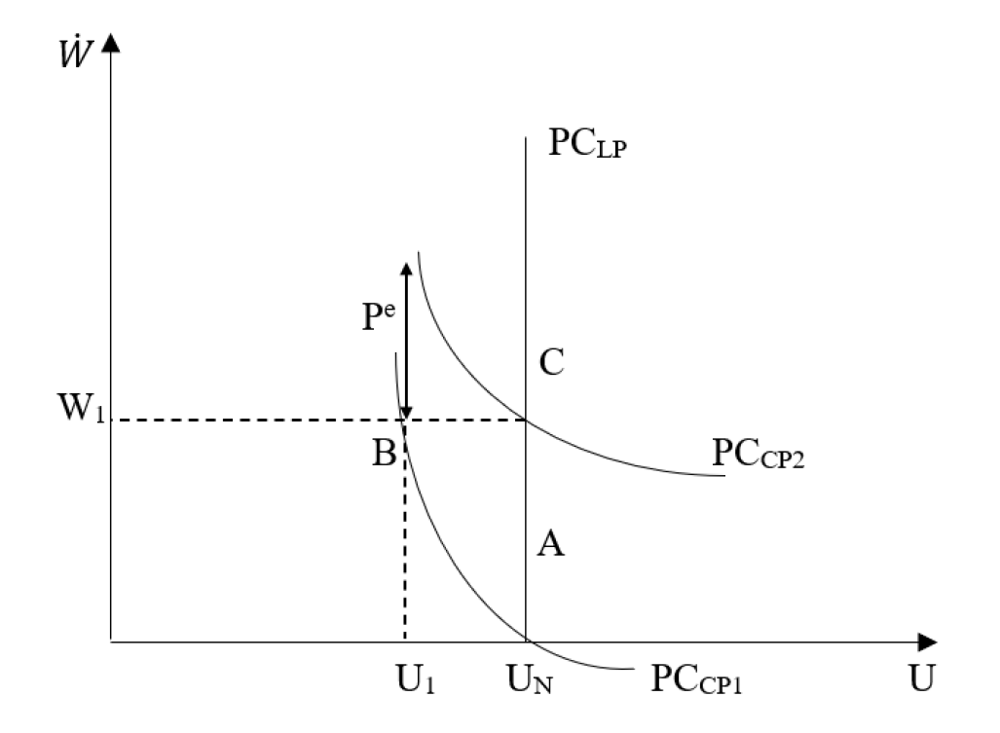

# La escuela austríaca del siglo XX {background="#43464B"}

## Introducción

- El período de entreguerras (1918-1939) fue un momento de profunda
  renovación teórica en la economía
- Tres desarrollos principales marcaron este período:
  1. La **escuela austríaca** con Mises y Hayek
  2. El surgimiento de la **macroeconomía keynesiana**
  3. Las primeras formulaciones de lo que sería el **monetarismo**
- En las décadas posteriores, surgirían el monetarismo de Friedman y
  la revolución de las expectativas racionales

## Contexto histórico

- El período de entreguerras estuvo marcado por eventos económicos
  extraordinarios:
  - Hiperinflación en Alemania y Austria (1921-1923)
  - El boom de los años 20 y la Gran Depresión (1929)
  - El ascenso del fascismo y el comunismo
- Estos eventos pusieron en cuestión las certezas de la economía
  clásica y neoclásica
  - ¿Podía el mercado autorregularse?
  - ¿Cuál era el rol del dinero y el crédito en las fluctuaciones?

## La escuela austríaca: de Menger a Mises

- La escuela austríaca fundada por **Carl Menger** (1840-1921) tuvo
  continuadores importantes:
  - **Friedrich von Wieser** (1851-1926) $\longrightarrow$ costo de oportunidad
  - **Eugen von Böhm-Bawerk** (1851-1914) $\longrightarrow$ teoría del capital e interés
- La tercera generación incluye a:
  - **Ludwig von Mises** (1881-1973)
  - **Friedrich A. Hayek** (1899-1992)
- Ambos desarrollarían una crítica fundamental tanto al socialismo
  como al keynesianismo

# Ludwig von Mises [1881-1973] {background="#43464B"}

## Vida y obra

- Nació en Lemberg (Austria-Hungría, hoy Ucrania) en una familia judía
  acomodada
- Estudió en la Universidad de Viena donde fue discípulo de Böhm-Bawerk
- Principales obras:
  - *Teoría del dinero y del crédito* (1912)
  - *El socialismo* (1922)
  - *La acción humana* (1949)
- Emigró a Estados Unidos en 1940 huyendo del nazismo
  - influyó decisivamente en la escuela austríaca americana

## La teoría del ciclo económico

- Mises desarrolló una **teoría monetaria del ciclo económico** basada
  en las ideas de Wicksell
- Distinguió entre:
  - **Tasa natural de interés** $\longrightarrow$ equilibra ahorro e inversión
  - **Tasa de mercado** $\longrightarrow$ fijada por el sistema bancario
- Cuando los bancos expanden el crédito y fijan la tasa de mercado
  *por debajo* de la natural:
  - Se produce una expansión artificial de la inversión
  - Los empresarios emprenden proyectos que no serían rentables a la
    tasa natural

## La teoría del ciclo económico (cont.)

> **El proceso de malinversión**. La expansión crediticia genera
> señales de precios distorsionadas. Los empresarios invierten en
> proyectos de largo plazo (bienes de capital) creyendo que hay más
> ahorro disponible del que realmente existe. Eventualmente, la
> realidad se impone: no hay suficientes recursos reales para
> completar todos los proyectos iniciados.

## La teoría del ciclo económico (cont.)

- La crisis es *inevitable* una vez iniciada la expansión artificial:
  1. El boom crediticio no puede mantenerse indefinidamente
  2. La inflación erosiona el poder adquisitivo
  3. Los proyectos de inversión resultan insostenibles
  4. Sobreviene la recesión como proceso de *liquidación*
- Para Mises, la recesión es el **proceso de corrección necesario**
  - las intervenciones para evitarla sólo prolongan el ajuste

## El cálculo económico en el socialismo

- En 1920 Mises publicó un artículo fundamental: *"El cálculo
  económico en la comunidad socialista"*
- Argumento central $\longrightarrow$ sin **propiedad privada de los
  medios de producción** no puede haber **precios de mercado** para
  los bienes de capital
  - Sin precios, no hay forma de calcular costos y beneficios
  - Sin cálculo económico, la asignación de recursos es *irracional*

## El cálculo económico en el socialismo (cont.)

> Sin cálculo económico no puede haber economía. De ahí que, en un
> Estado socialista donde la persecución de este cálculo es imposible,
> no puede existir en nuestro sentido del término, ninguna
> economía. En cosas triviales e insignificantes, la conducta racional
> todavía podría ser posible, pero en general ya no se podría hablar
> de una producción racional.
**[Ludwig von Mises, *El cálculo económico en la comunidad
socialista* (1920)]**

## El debate sobre el cálculo socialista

- El argumento de Mises generó un extenso debate:
  - **Oskar Lange** (1936-37) propuso un "socialismo de mercado"
    donde los planificadores simularan el mecanismo de precios
  - **Abba Lerner** desarrolló argumentos similares
- Mises y Hayek respondieron que:
  - El problema no es sólo computacional sino de **conocimiento disperso**
  - Los precios de mercado surgen de un proceso de **descubrimiento**
    que no puede ser replicado centralmente
- El colapso de la URSS en 1991 reivindicó parcialmente estos argumentos

## Praxeología: el método de la economía

- Mises desarrolló un enfoque metodológico distintivo llamado
  **praxeología** (ciencia de la acción humana)
- Características principales:
  1. La economía es una ciencia **a priori**, no empírica
  2. Se deriva de axiomas auto-evidentes sobre la acción humana
  3. El axioma fundamental: *"el hombre actúa"*
- De este axioma se derivan todas las categorías económicas:
  - Preferencia temporal, costo de oportunidad, utilidad marginal

## Praxeología: el método de la economía (cont.)

- Mises rechazaba el uso de métodos estadísticos y econométricos:
  - Los datos históricos son únicos y no permiten inferencias causales
  - Las "constantes" de la física no existen en economía
- Esta posición metodológica marcó una diferencia fundamental con:
  - El positivismo de la economía mainstream
  - El historicismo alemán
  - El empirismo keynesiano

# Friedrich A. Hayek [1899-1992] {background="#43464B"}

## Vida y obra

- Nació en Viena en una familia de académicos (su primo segundo era
  Wittgenstein)
- Estudió derecho y economía en la Universidad de Viena
- Fue discípulo de Wieser y luego de Mises
- Principales etapas de su carrera:
  - **Viena** (1920s): teoría del ciclo
  - **Londres** (1931-1950): debate con Keynes, LSE
  - **Chicago** (1950-1962): Committee on Social Thought
  - **Friburgo** (1962-1992): retorno a Europa
- **Premio Nobel de Economía** (1974, compartido con Gunnar Myrdal)

## La teoría del capital y el ciclo

- Hayek elaboró y refinó la teoría del ciclo de Mises en varias obras:
  - *Precios y producción* (1931)
  - *La teoría pura del capital* (1941)
- Introdujo el concepto de **estructura intertemporal de la producción**:
  - La producción no es instantánea sino que requiere tiempo
  - Los bienes de capital son más o menos "alejados" del consumo final
  - La tasa de interés coordina las decisiones de ahorro e inversión

## La teoría del capital y el ciclo (cont.)

> **El triángulo hayekiano**. Hayek representaba la estructura de
> producción como un triángulo donde la base representa el tiempo de
> producción (etapas) y la altura el valor del output de consumo final.
> Los bienes de orden superior (más alejados del consumo) están en la
> base; los de orden inferior (cercanos al consumo) en el vértice.

## La teoría del capital y el ciclo (cont.)

- **Efectos de un aumento del ahorro voluntario**:
  - Disminuye la tasa de interés natural
  - Se alargan los procesos productivos (base más larga)
  - Mayor inversión en bienes de capital de orden superior
  - Menor consumo presente, mayor consumo futuro
- **Efectos de expansión crediticia artificial**:
  - Disminuye la tasa de mercado (pero no la natural)
  - Se alargan los procesos *sin* ahorro real adicional
  - Conflicto inevitable entre inversión y consumo

## El efecto de la expansión crediticia

- Cuando los bancos expanden el crédito artificialmente:
  1. La tasa de interés cae por debajo de la tasa natural
  2. Los empresarios alargan la estructura de producción
  3. Pero no hay ahorro real adicional para sostenerla
  4. Se genera un **conflicto de recursos** entre:
     - Inversión en bienes de capital (estimulada por crédito barato)
     - Consumo (que no ha disminuido por falta de ahorro voluntario)
- Este conflicto se resuelve con una crisis

## El conocimiento disperso

- Hayek desarrolló una **teoría del conocimiento económico** fundamental:
  - El conocimiento relevante para la economía está **disperso** entre
    millones de individuos
  - Incluye conocimiento **tácito** (de tiempo y lugar) que no puede
    articularse ni centralizarse
- Los precios de mercado actúan como un **sistema de comunicación**
  que transmite información dispersa

## El conocimiento disperso (cont.)

> El problema económico de la sociedad no es simplemente un problema
> de cómo asignar "recursos dados"...Es más bien un problema de cómo
> asegurar el mejor uso de los recursos conocidos por cualquiera de
> los miembros de la sociedad, para fines cuya importancia relativa
> sólo estos individuos conocen. O, dicho brevemente, es un problema
> de la utilización del conocimiento que no está dado a nadie en su
> totalidad.
**[F.A. Hayek, *El uso del conocimiento en la sociedad* (1945)]**

## El orden espontáneo

- Hayek distinguió entre dos tipos de orden:
  - **Taxis** (orden construido) $\longrightarrow$ diseñado deliberadamente
  - **Cosmos** (orden espontáneo) $\longrightarrow$ emerge de la interacción
- El mercado es un **orden espontáneo** (o *catalaxia*):
  - No fue diseñado por nadie
  - Coordina acciones de millones de individuos
  - Genera resultados que ningún planificador podría lograr
- Esta visión influyó profundamente en el pensamiento liberal

## Hayek y la crítica al constructivismo

- Hayek criticó lo que llamó la **"fatal arrogancia"** del
  constructivismo racionalista:
  - La creencia de que las instituciones sociales pueden ser
    rediseñadas racionalmente
  - El desprecio por las tradiciones y reglas evolucionadas
- Para Hayek, las instituciones (derecho, moral, mercado) son:
  - Producto de la **evolución cultural**
  - Contienen más conocimiento del que cualquier mente individual
    puede comprender

# El debate Keynes vs Hayek {background="#43464B"}

## Contexto del debate

- El debate Keynes-Hayek fue uno de los más importantes del siglo XX
- Se desarrolló principalmente entre 1931 y 1936:
  - Hayek reseñó críticamente el *Tratado sobre el Dinero* de Keynes (1930)
  - Keynes respondió y luego publicó la *Teoría General* (1936)
- Representaba dos visiones opuestas:
  - **Keynes** $\longrightarrow$ el capitalismo es inestable y requiere
    gestión activa
  - **Hayek** $\longrightarrow$ las intervenciones generan más problemas
    de los que resuelven

## Diferencias fundamentales

| **Dimensión** | **Keynes** | **Hayek** |
|---------------|------------|-----------|
| Causa de la crisis | Insuficiencia de DA | Malinversión por crédito |
| Rol del ahorro | Paradoja del ahorro | Necesario para inversión |
| Política fiscal | Expansiva en recesión | Contraproducente |
| Política monetaria | Puede ser ineficaz | Causa el problema |
| Visión del mercado | Falla de coordinación | Proceso de coordinación |

: {tbl-colwidths="[25,37,38]"}

## La respuesta de Keynes a Hayek

- Keynes encontró difícil seguir los argumentos de *Precios y
  Producción*:

> La respuesta de Keynes fue demoledora en lo personal pero superficial
> en lo analítico. Escribió a Hayek: "Es una de las cosas más
> espantosas que he leído jamás... un lío extraordinario de ideas
> absurdas y descoyuntadas"

- Sin embargo, Keynes nunca respondió sistemáticamente a la crítica
  austríaca
  - El éxito de la *Teoría General* eclipsó temporalmente a la escuela
    austríaca

## La "paradoja del ahorro" y la crítica austríaca

- Para **Keynes**: en una recesión, el intento de ahorrar más puede
  reducir el ingreso agregado y terminar reduciendo el ahorro
  - De ahí la necesidad de estimular el consumo y la inversión pública
- Para **Hayek**: el ahorro es necesario para la inversión sostenible
  - Estimular artificialmente la demanda perpetúa las malinversiones
  - La recesión es el proceso de corrección, no un problema a resolver

## La "paradoja del ahorro" y la crítica austríaca (cont.)

> El curioso caso de la paradoja de la frugalidad: Keynes argumenta
> que en ciertas circunstancias si todos intentamos ahorrar más, el
> efecto agregado puede ser una caída del ingreso y paradójicamente
> un menor ahorro. Hayek respondería: esto confunde el corto plazo
> con el largo plazo, y los síntomas con las causas.

## El legado del debate

- Durante décadas (1940s-1970s), Keynes "ganó" el debate:
  - Sus ideas dominaron la política económica occidental
  - Hayek se dedicó a la filosofía política
- La estanflación de los 1970s reivindicó parcialmente a Hayek:
  - Premio Nobel en 1974
  - Influencia en Thatcher y Reagan
- Hoy se reconoce que ambos tenían parte de razón:
  - La inestabilidad financiera es real (Keynes)
  - Las intervenciones pueden tener consecuencias no intencionadas (Hayek)

# El monetarismo y la nueva economía clásica {background="#43464B"}

## Antecedentes del monetarismo

- El monetarismo tiene raíces en la tradición de la **teoría
  cuantitativa del dinero**:
  - Hume, Ricardo, Fisher, escuela de Cambridge
- La ecuación cuantitativa: $MV = PY$
- Durante el período keynesiano, la cantidad de dinero fue relegada:
  - Se enfatizó la política fiscal sobre la monetaria
  - "El dinero no importa" (visión keynesiana extrema)
- Milton Friedman lideró la contrarrevolución monetarista

# Milton Friedman [1912-2006] {background="#43464B"}

## Vida y obra

- Nació en Brooklyn, Nueva York, hijo de inmigrantes judíos húngaros
- Estudió en Rutgers, Chicago y Columbia
- Carrera en la Universidad de Chicago (1946-1976)
- Principales contribuciones:
  - *A Theory of the Consumption Function* (1957)
  - *A Monetary History of the United States* (1963, con A. Schwartz)
  - *The Role of Monetary Policy* (1968)
- **Premio Nobel de Economía** (1976)
- Columnista y divulgador (*Capitalism and Freedom*, *Free to Choose*)

## La reformulación de la teoría cuantitativa

- Friedman presentó la TCD como una **teoría de la demanda de dinero**:

\begin{equation}
\frac{M_{d}}{P}=f(Y^{P};r_{b};r_{e};\dot{P^{e}};u)
\end{equation}

- Donde:
  - $Y^{P}$ es el ingreso permanente
  - $r_{b}$ y $r_{e}$ son rendimientos de bonos y acciones
  - $\dot{P^{e}}$ es la inflación esperada
  - $u$ representa otros factores (gustos, tecnología)

## La reformulación de la teoría cuantitativa (cont.)

- Diferencias con la versión keynesiana de la demanda de dinero:
  - Friedman usó **ingreso permanente** (promedio de largo plazo) no
    ingreso corriente
  - Incluyó múltiples activos alternativos, no sólo bonos
  - Argumentó que la función era **estable** y predecible
- Implicancia: $V$ no es constante pero sí **estable y predecible**
  - Por tanto, $M$ tiene efectos predecibles sobre $PY$

## La *Monetary History* y la Gran Depresión

- En su monumental obra con Anna Schwartz, Friedman reinterpretó la
  Gran Depresión:
  - La Fed *contrajo* la oferta monetaria en 1930-33 (caída del 33%)
  - Esto transformó una recesión ordinaria en la Gran Depresión
  - "La Depresión fue producida por el gobierno" (la Fed)
- Esta reinterpretación tuvo enormes implicancias:
  - No fue una falla del capitalismo sino de la política monetaria
  - La economía de mercado es inherentemente estable

## La inflación como fenómeno monetario

- Friedman formuló su famoso dictum:

> La inflación es siempre y en todo lugar un fenómeno monetario, en el
> sentido de que sólo puede producirse por un aumento más rápido de la
> cantidad de dinero que del producto.
**[Milton Friedman, *The Counter-Revolution in Monetary Theory* (1970)]**

## La inflación como fenómeno monetario (cont.)

- Para Friedman:
  - La inflación sostenida requiere expansión monetaria continua
  - Los gobiernos son responsables de la inflación
  - No existe trade-off permanente entre inflación y desempleo
- Esta posición contrastaba con:
  - La "inflación de costos" (sindicatos, OPEP)
  - La curva de Phillips como menú de opciones políticas

# La curva de Phillips {background="#43464B"}

## El descubrimiento empírico

- En 1958, A.W. **Phillips** publicó un estudio sobre Reino Unido
  (1861-1957)
- Encontró una relación estadística estable entre:
  - Tasa de desempleo ($U$)
  - Tasa de cambio de salarios nominales ($\dot{W}$)

\begin{equation}
\dot{W}=-0.9+9.638(U)^{-1.394}
\end{equation}

- Menor desempleo $\longrightarrow$ mayor crecimiento salarial

## La curva de Phillips (cont.)

- **Samuelson y Solow** (1960) extendieron el análisis a EEUU
- Reinterpretaron la curva como un **trade-off entre inflación y
  desempleo**
  - Asumiendo markup constante: $\dot{P} = \dot{W} - \dot{a}$
  - donde $\dot{a}$ es el crecimiento de la productividad
- Implicancia de política: los gobiernos pueden **elegir** su
  combinación preferida de inflación-desempleo

## La curva de Phillips (cont.)

> **La curva de Phillips como "menú de política"**. Durante los 1960s,
> muchos economistas keynesianos creyeron que existía un trade-off
> estable. Los gobiernos podían elegir: menor desempleo a costa de
> mayor inflación, o menor inflación a costa de mayor desempleo. Esta
> interpretación dominó la política económica hasta la estanflación
> de los 1970s.

## La crítica de Friedman y Phelps

- En 1967-68, **Milton Friedman** y **Edmund Phelps** (independientemente)
  criticaron esta interpretación:
  - Sólo existe trade-off en el **corto plazo**
  - En el **largo plazo**, no hay trade-off
- Introdujeron el concepto de **tasa natural de desempleo** ($U_{N}$):
  - Determinada por factores reales (fricciones, regulaciones)
  - Independiente de la tasa de inflación

## La curva de Phillips aumentada por expectativas

- Friedman modificó la curva de Phillips:

\begin{equation}
\dot{W}=f(U)+\dot{P^{e}}
\end{equation}

- donde $\dot{P^{e}}$ es la inflación esperada
- Existen **múltiples** curvas de Phillips de corto plazo (una para
  cada nivel de expectativas inflacionarias)
- La curva de **largo plazo** es vertical en $U_{N}$

## La curva de Phillips aumentada por expectativas (cont.)

> **Mecanismo de ajuste**. Partiendo de $U_{N}$ con inflación estable,
> si el gobierno aumenta DA: (1) cae el desempleo a $U_{1}$ con mayor
> inflación; (2) los trabajadores ajustan expectativas al alza; (3)
> demandan mayores salarios nominales; (4) el desempleo vuelve a
> $U_{N}$ pero con mayor inflación. Resultado: no hay trade-off
> permanente.

## La curva de Phillips aumentada por expectativas (cont.)

{fig-align="center"}

## La hipótesis aceleracionista

- Si el gobierno insiste en mantener $U < U_{N}$:
  - Debe acelerar continuamente la inflación
  - Cada vez se requiere mayor inflación para "sorprender" a los
    trabajadores
- Esto se conoce como la **hipótesis aceleracionista**
- La estanflación de los 1970s confirmó dramáticamente esta predicción:
  - Alto desempleo Y alta inflación simultáneamente
  - El "menú" keynesiano había dejado de funcionar

## La regla monetaria de Friedman

- Friedman propuso reemplazar la discrecionalidad por **reglas**:
  - Los bancos centrales deberían aumentar $M$ a una tasa constante (k%)
  - Esta tasa debería ser aproximadamente igual al crecimiento del
    producto real
- Argumentos a favor:
  1. La política discrecional introduce incertidumbre
  2. Los rezagos hacen que la política sea desestabilizadora
  3. Los políticos tienen incentivos a inflacionar

# La revolución de las expectativas racionales {background="#43464B"}

## De expectativas adaptativas a racionales

- Friedman usó **expectativas adaptativas** (*backward-looking*):
  - Los agentes forman expectativas basándose en el pasado
  - Cometen errores sistemáticos que corrigen gradualmente

\begin{equation}
\dot{P^{e}}_{t}=\dot{P^{e}}_{t-1}+\lambda(\dot{P}_{t-1}-\dot{P^{e}}_{t-1})
\end{equation}

- En los 1970s, **Robert Lucas** y otros propusieron las **expectativas
  racionales**

## John Muth y las expectativas racionales

- **John Muth** (1961) introdujo el concepto de expectativas racionales:
  - Los agentes usan toda la información disponible
  - Sus predicciones coinciden (en promedio) con las del modelo económico
  - Los errores de predicción son aleatorios, no sistemáticos

\begin{equation}
\dot{P^{e}}=E[\dot{P}|I_{t}]
\end{equation}

- donde $I_{t}$ es toda la información disponible en $t$

## Robert Lucas y la nueva economía clásica

- **Robert Lucas** (Chicago) aplicó las expectativas racionales a la
  macroeconomía:
  - *Expectations and the Neutrality of Money* (1972)
  - *Econometric Policy Evaluation: A Critique* (1976)
- **Premio Nobel de Economía** (1995)
- Fundador de la **nueva economía clásica** (NEC)

## La crítica de Lucas

- Lucas argumentó que los modelos econométricos keynesianos eran
  inútiles para evaluar políticas:
  - Los parámetros estimados **cambian** cuando cambia la política
  - Los agentes ajustan su comportamiento ante cambios de régimen
- Esta **crítica de Lucas** devastó la econometría keynesiana:
  - Los modelos de gran escala (Cowles, Penn) perdieron credibilidad
  - Se inició la búsqueda de modelos con "microfundamentos"

## La crítica de Lucas (cont.)

> Dado que la estructura de un modelo econométrico consiste en reglas
> de decisión óptimas de los agentes económicos, y dado que las reglas
> de decisión óptimas varían sistemáticamente con cambios en la
> estructura de las series relevantes para el decisor, se sigue que
> cualquier cambio en la política alterará sistemáticamente la
> estructura de los modelos econométricos.
**[Robert Lucas, *Econometric Policy Evaluation: A Critique* (1976)]**

## Implicaciones para la política económica

- Con expectativas racionales, la política monetaria sistemática es
  **neutral** incluso en el corto plazo:
  - Los agentes anticipan los efectos de la política
  - Ajustan inmediatamente sus expectativas
  - Sólo las sorpresas monetarias tienen efectos reales
- La **proposición de ineficacia de la política** (Sargent-Wallace, 1975):
  - Las políticas anticipadas no afectan variables reales
  - Sólo la política no anticipada puede tener efectos temporales

## Implicaciones para la política económica (cont.)

- Contrastes entre escuelas:

| **Aspecto** | **Keynesiana** | **Monetarista** | **NEC** |
|-------------|----------------|-----------------|---------|
| Expectativas | Implícitas/estáticas | Adaptativas | Racionales |
| Neutralidad del dinero | No (ni CP ni LP) | CP: No, LP: Sí | Sí (anticipado) |
| Trade-off inflación-desempleo | Estable | Sólo CP | No existe |
| Política óptima | Activismo | Reglas | Reglas (o nada) |

: {tbl-colwidths="[25,25,25,25]"}

## El ciclo económico real (RBC)

- Algunos economistas de la NEC desarrollaron modelos de **ciclo
  económico real** (Kydland y Prescott, 1982):
  - Las fluctuaciones son respuestas óptimas a shocks tecnológicos
  - No hay fallas de mercado ni rol para la política de estabilización
  - Los ciclos son fenómenos de equilibrio, no de desequilibrio
- Esta visión extrema fue criticada incluso por otros economistas
  liberales
  - ¿Cómo explicar recesiones como "vacaciones tecnológicas"?

## La síntesis neoclásica-keynesiana nueva

- En las décadas siguientes surgió una **nueva síntesis**:
  - Expectativas racionales + rigideces nominales
  - Modelos DSGE (Dynamic Stochastic General Equilibrium)
  - Regla de Taylor para política monetaria
- Esta síntesis incorpora elementos de ambas tradiciones:
  - Microfundamentos y ER (de la NEC)
  - Rigideces y rol de la política (del keynesianismo)

# Evaluando las contribuciones {background="#43464B"}

## El legado de la escuela austríaca

- Contribuciones duraderas:
  - Teoría del capital y la estructura intertemporal de la producción
  - Crítica al socialismo y la planificación central
  - Teoría del conocimiento disperso y el orden espontáneo
  - Teoría del ciclo basada en el crédito
- Limitaciones:
  - Rechazo de métodos cuantitativos
  - Dificultad para generar predicciones contrastables
  - Marginalización del mainstream académico

## El legado del monetarismo

- Contribuciones duraderas:
  - Rehabilitación de la política monetaria
  - Demostración de que "el dinero importa"
  - Concepto de tasa natural de desempleo
  - Énfasis en reglas sobre discrecionalidad
- Limitaciones:
  - La velocidad del dinero resultó menos estable de lo esperado
  - Dificultades para definir y medir "dinero"
  - Sobresimplificación de la relación dinero-precios

## El legado de las expectativas racionales

- Contribuciones duraderas:
  - Crítica de Lucas a la econometría de políticas
  - Importancia de los microfundamentos
  - Reconocimiento del rol de las expectativas
  - Metodología de modelos DSGE
- Limitaciones:
  - Supuesto de racionalidad extrema
  - Dificultad para explicar persistencia de los ciclos
  - Subestimación de fricciones y fallas de coordinación

## Reflexiones finales

- El período que va de 1920 a 1980 fue extraordinariamente fértil:
  - Emergieron las grandes escuelas macroeconómicas modernas
  - Se produjo un intenso debate metodológico y teórico
- Ninguna escuela "ganó" definitivamente:
  - La macroeconomía actual incorpora elementos de todas ellas
  - El debate sobre el rol de la política continúa
- La historia del pensamiento nos recuerda:
  - Las certezas de hoy pueden ser los errores de mañana
  - La diversidad de perspectivas enriquece la disciplina

# Bibliografía utilizada {background="#43464B"}

## Bibliografía principal

- Ekelund, R.B. & Hébert, R.F. (2007). *A History of Economic Theory
  and Method*. Fifth Edition. Waveland Press. Caps. 20-22.
- Roncaglia, A. (2006). *La riqueza de las ideas: Una historia del
  pensamiento económico*. Prensas Universitarias de Zaragoza. Caps.
  15-17.
- Snowdon, B. & Vane, H.R. (2005). *Modern Macroeconomics: Its
  Origins, Development and Current State*. Edward Elgar. Caps. 1-5.

## Bibliografía complementaria

- Hayek, F.A. (1931). *Prices and Production*. Routledge.
- Hayek, F.A. (1945). The Use of Knowledge in Society. *American
  Economic Review*, 35(4), 519-530.
- Mises, L. von (1920). Economic Calculation in the Socialist
  Commonwealth. Reprinted in Hayek (ed.), *Collectivist Economic
  Planning* (1935).
- Friedman, M. (1968). The Role of Monetary Policy. *American Economic
  Review*, 58(1), 1-17.

## Bibliografía complementaria (cont.)

- Friedman, M. & Schwartz, A. (1963). *A Monetary History of the
  United States, 1867-1960*. Princeton University Press.
- Lucas, R.E. (1972). Expectations and the Neutrality of Money.
  *Journal of Economic Theory*, 4, 103-124.
- Lucas, R.E. (1976). Econometric Policy Evaluation: A Critique. In
  Brunner & Meltzer (eds.), *The Phillips Curve and Labor Markets*.
- Phelps, E. (1967). Phillips Curves, Expectations of Inflation and
  Optimal Unemployment over Time. *Economica*, 34(135), 254-281.
