# Economía y política

## Los economistas y la política

> Los economistas deben no sólo conocer sus modelos económicos, sino que
también entender de política, intereses, conflictos, pasiones, es
decir, la esencia de la vida colectiva. Por un pequeño período de
tiempo, uno puede realizar cambios a través de decretos: pero para que
ellos persistan, uno debe construir coaliciones y tener gente que los
soporte. Es decir, se debe ser un político.

*Alejandro Foxley, ex ministro de Finanzas de Chile*

## Economía y política

- Economía: uso óptimo de recursos escasos
- Política: estudio del poder y la autoridad
- Poder: habilidad (capacidad) de individuos y/o
  grupos para lograr sus objetivos
- Cualquier estudio que pretenda describir la complejidad de
  las relaciones sociales en sus dimensiones económicas y políticas,
  debe analizar estos elementos en forma conjunta.

## Economía y política (cont.)

- La economía como disciplina nace y se desarrolla como economía
  política (Smith, Ricardo, Marx, JS Mill, Say). La economia
  neoclásica enfoca en **planificador benevolente**
  $\leftarrow$ enfoque normativo 
- ¿Cómo y porqué es la política económica como es? ¿Cómo es el
    proceso político de toma de decisiones colectivas por parte de
    **agentes con preferencias diferentes** $\longrightarrow$
    enfoque positivo
- Esto último es lo que se entiende modernamente por **economia política**

## Economía política: Naturaleza

- Tres enfoques convergen en la economia política
  1. **Teoría de la política macroeconómica** $\longrightarrow$ expectativas racionales, incentivos del policy-maker y comportamiento estratégico. Eminentemente teórica; instituciones políticas poco realistas
  2. **Teoría de la elección pública** $\longrightarrow$ finanzas públicas, política regulatoria. Eje: problema de agencia entre el gobierno (agente) y ciudadanos (principal).
  3. **Teoría de la elección social** $\longrightarrow$ modelos formales de análisis político. Parte de teoría axiomática de la elección social y estudia decisiones colectivas en instituciones políticas específicas.

## Economía política: Enfoque

> La **economía política moderna** utiliza el enfoque de equilibrio general de la teoría macroeconómica y explota las herramientas de la teoría de la elección racional para el análisis de los problemás principales de la teoría de la elección pública

## Economía política: Sistema

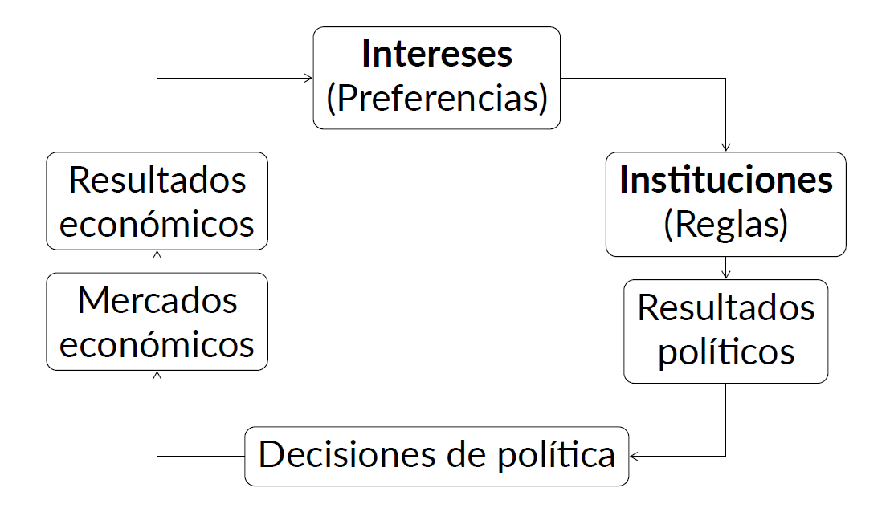

## El rol de la política

- Un aspecto relevante de la política es en lo que hace a la **heterogeneidad de intereses**
- Restricciones políticas derivadas de ello implica que las políticas adoptadas en la práctica **no son óptimas**
- Implicaciones positivas $\longrightarrow$ si la política óptima se encuentra no resulta cierto que esta se implementa (implícito en la *economía del bienestar*)
- Implicaciones normativas $\longrightarrow$ ¿cómo pueden diseñarse instituciones y políticas para lograr ciertos objetivos?

## Equilibrio sin política
- Basado en Drazen (2000) y Ferguson/Querubin (2018)
- Suponga **1 (un) individuo representativo**, Ana, quien debe elegir cuánto destinar de sus recursos iniciales $A_{o}$ para sus  vacaciones de este año y el próximo
- Note que no hay problema político (no conflicto de intereses) sino uno técnico
- ¿Cuál es la manera óptima de dividir los recursos entre dos vacaciones (presente y futuro)?

## Equilibrio sin política (cont.)

- Sea $u(x_{t})$ la utilidad de Ana por destinar $x$ a sus vacaciones en $t$ con $u'>0$ y $u''<0$. El parámetro $\beta$ compara utilidades en distintos momentos --una unidad de utilidad hoy es igual a $\beta$ unidades de utilidad mañana [$0<\beta<1$]
$$\max_{\{x_{t},x_{t+1},s\}} u(x_{t})+\beta u(x_{t+1})$$
- Sujeto a:
\begin{align*}
A_{0}(1-s)&=x_{t} \\
sA_{0}(1+r_{t})&=x_{t+1}
\end{align*}

## Equilibrio sin política (cont.)

- Sustituyendo las restricciones en la ecuación principal:
$$\displaystyle \max_{x_{t}} u(x_{t}) \beta u((A_{0}-x_{t})(1+r_{t}))$$
- Y la solución de esto es:
$$u'(x_{t}) = \beta(1+r_{t})u'(x_{t+1})$$ 
- ¿Cuál es la interpretación de esta solución? [Ecuación de Euler]
    - Nos dice cómo asignar el consumo entre el período $t$ y $t+1$ de modo que la utilidad marginal del consumo presente y futuro sean iguales

## Equilibrio con política 

- **Con individuos heterogéneos ex-ante** $\longrightarrow$
    preferencias diferentes por consumo presente/futuro [dos tipos de heterogeneidad: **ex
      ante** y **ex post**
- Los recursos son los mismos que antes pero ahora hay **dos
      individuos**, Ana (A) y Juan (J) y sea $\beta^{A}>\beta^{J}$ [Juan
      es más impaciente que Ana]
- Problema $\longrightarrow$ maximizar la función de
        bienestar social (suma ponderada de utilidades individuales)
        $\longrightarrow$ $\alpha$ ponderación de cada individuo

## Equilibrio con política (cont.)

- Problema (neoclásico):
$$\displaystyle \max_{x_{t},x_{t+1},s} \alpha\left[u(x_{t})+\beta^{A}u(x_{t+1})\right] + (1-\alpha)\left[u(x_{t})+\beta^{J}u(x_{t+1})\right]$$
- Sujeto a:
$$A_{0}=x_{t}+\frac{x_{t+1}}{(1+r_{t})}$$
- Si el bien "vacaciones" es no rival --unica fuente de conflicto la diferencia ex-ante en el grado de impaciencia de cada uno 

## Equilibrio con política (cont.)

- Sustituyendo las restricciones:
$$u'(x_{t})=(1+r_{t})[\alpha \beta^{A}+(1-\alpha)\beta^{J}]u'(x_{t+1})$$
- Para diferentes $\alpha$ trazamos **curva de contrato** con
  asignaciones de $x_{t}$ y $x_{t+1}$ eficientes en sentido de Pareto
- Varios problemas con esto: 1) cada persona requiere un
    $\alpha$ mas alto, 2) ¿cómo se determina $\alpha$, 3) ¿cómo afecta
    el valor de $\alpha$ a la asignación de recursos, 4) ¿estaremos
    sobre la curva de contrato?

## Equilibrio con política (cont.)

- **Sin individuos heterogéneos ex-ante** $\longrightarrow$
    problema converge al del individuo representativo PERO las
    vacaciones no son un bien no rival. El problema es:
\begin{align*}
\max_{x_{t},x_{t+1},s} & \alpha\left[u(\lambda x_{t})+\beta u(\lambda
      x_{t+1})\right] \\ & +(1-\alpha)\left[u((1-\lambda) x_{t})+\beta u((1-\lambda) x_{t+1})\right]
\end{align*}

- sujeto a [$\lambda$ porcentaje que disfruta Juan del gasto $x$]
\begin{align*}
                A_{0}(1-s)&=x_{t}&=&\lambda x_{t}+(1-\lambda)x_{t} \\
        sA_{0}(1+r_{t})&=x_{t+1}&=&\lambda x_{t+1}+(1-\lambda)x_{t+1} 
\end{align*}

## Equilibrio con política (cont.)

- Resolviendo:
\begin{align*}
\alpha \lambda u'(\lambda
      x_{t})+(1-\alpha)(1-\lambda)u'((1-\lambda)x_{t})= \\
      \beta(1+r_{t})\left[\alpha \lambda u'(\lambda
      x_{t+1})+(1-\alpha)(1-\lambda)u'((1-\lambda)x_{t+1})\right]
\end{align*}
- Note que $\alpha$ es crucial $\longrightarrow$ pero ahora
        $\lambda$ también lo es [aún suponiendo que $\alpha=0.5$
        existe conflicto de interés]
\begin{align*}
\lambda u'(\lambda
          x_{t})+(1-\lambda)u'((1-\lambda)x_{t})= \\
          \beta(1+r_{t})\left[\lambda u'(\lambda
      x_{t+1})+(1-\lambda)u'((1-\lambda)x_{t+1})\right]
\end{align*}
- Si $\lambda=1$, el resultado seria preferido por Juan y si
  $\lambda=0$ el resultado sería preferido por Ana.

## Equilibrio con política (cont.)

- Cuando no hay heterogeneidad, el problema es trivial
      $\longrightarrow$ problema técnico depende de parámetros
      subjetivos
- Cuando hay heterogeneidad en preferencias (**ex ante**) $\longrightarrow$ como se ponderan utilidades
      individuales [$\alpha$ exógeno]
- Cuando hay heterogeneidad en distribución (**ex
          post**) $\longrightarrow$ como se
        ponderan utilidades invididuales y como se
        distribuye/asigna las cantidades consumidas del
        bien
- ¿Cómo se determinan los parámetros $\alpha$ y $\lambda$
          en la práctica? No a través del mercado sino del proceso político

## Economía y política: Dos sistemas

- Una persona, un voto $\longrightarrow$ **política**
- Un dólar, un voto $\longrightarrow$ **economía**
- Función objetivo del gobierno incluye ambos
\begin{align}
        G&=f(W,C)=\alpha W+\sum_{i}C_{i}
\end{align}
- $W$ es bienestar agregado; $C_{i}$ es dinero aportado por grupo $i$
      --$\alpha$ ponderador del bienestar agregado.

## Economía y política: Dos sistemas (cont.)

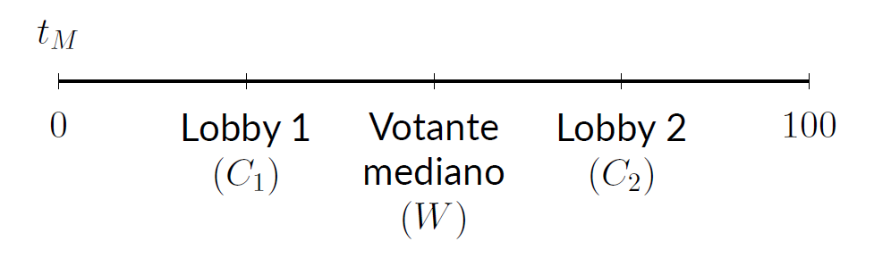

## Heterogeneidad y preferencias

- Elección de la política económica importa una decisión
      colectiva a partir de intereses (preferencias) individuales e
      instituciones políticas determinadas
- Decisiones difieren según instituciones políticas
        --dictadura versus democracia $\longrightarrow$ tanto en el
        proceso como en los resultados
- Existen dos modelos tipicos de democracia --directa y
         representativa. Si bien difieren en muchos aspectos, ambas
         tienen en el centro del proceso decisorio a mecanismos de
         votacion.
	 
## Heterogeneidad y preferencias 

- Individuos maximizan una función de utilidad
      $U(x_{1},x_{2};\alpha^{i})$ --$x_{1}$ y $x_{2}$ bienes
      privados. El gobierno le saca $\tau$ del $Y$ al individuo y le
      devuelve $T$ como transferencia de suma fija.
$$
p_{1}x_{1}+p_{2}x_{2} \leq (1-\tau)Y+T
$$
- El problema consiste en maximizar la utilidad sujeta a la
        restricción presupuestaria $\longrightarrow$ se obtienen las
        demandas individuales $x_{1}(p_{1},p_{2},Y,\tau,T;\alpha^{i})$
        y $x_{2}(p_{1},p_{2},Y,\tau,T;\alpha^{i})$
- El parámetro $\alpha$ en la función de utilidad captura
          la heterogeneidad de preferencias.

## Heterogeneidad y preferencias

- Reemplazando esas demandas en la función de utilidad, se
      obtiene la funcion de utilidad indirecta:
\begin{align*}
        V(p_{1},p_{2},Y,,\tau,T;\alpha^{i}) \equiv \\
        U(x_{1}(p_{1},p_{2},Y,\tau,T;\alpha^{i}),x_{2}(p_{1},p_{2},Y,\tau,T;\alpha^{i});\alpha^{i})
\end{align*}
- Importante $\longrightarrow$ utilidad es función de las
        variables de política [dado que $x_{1}$ y $x_{2}$ son elegidos
        de manera óptima]
\begin{align*}
V(\tau,T;\alpha^{i}) \equiv \\ V(p_{1}(\tau,T),p_{2}(\tau,T),Y(\tau,T),\tau,T;\alpha^{i})
\end{align*}

## Heterogeneidad y preferencias

- Conociendo $\tau$ conocemos $T$ [¿por qué?] y la fn UI:
$$
V(\tau;\alpha^{i})
$$
- La política preferida por el individuo se obtiene hallando $\tau$
  que maximiza utilidad indirecta:
\begin{equation*}
\frac{\partial V(\tau;\alpha^{i})}{\partial \tau}=0
\end{equation*}
-  $\tau^{*}(\alpha^{i})$ $\longrightarrow$
  dimensión política evidente --$\alpha^{i}$'s diferentes implican
  políticas (alícuotas) preferidas diferentes

## Puntos clave I

- La política económica en las sociedades modernas no puede
      explicarse sólamente en base a teorías y evidencias económicas
      $\longrightarrow$ introducir la política explícitamente en el análisis
- Hay varias formas de introducir la política
        $\longrightarrow$ optamos por la aproximación de la nueva
        economia política
- Pondremos el énfasis en algunos sencillos modelos
          teóricos --de comportamiento-- pero ilustraremos el análisis
          con evidencias empíricas

## Puntos clave II

- La heterogeneidad individual es clave para este enfoque. Dos dimensiones clave:
  1. Heterogeneidad ex-ante $\longrightarrow$ diferencias en preferencias individuales --ie. dos personas con mismo ingreso pero diferentes preferencias políticas
  2. Heterogeneidad ex-post $\longrightarrow$ diferencias en dotaciones individuales --ie. dos personas con mismas preferencias políticas pero diferentes situaciones luego de una reforma tributaria
- Esto da origen al conflicto que adopta generalmente varias formas

## Puntos clave III

- La política económica, en sus diferentes dimensiones, es generalmente el resultado último de la "resolución" de estos conflictos.
- Las variaciones en la misma pueden reflejar variaciones en intereses, instituciones e idea --foco del curso es en las dos primeras
- Los intereses afectan a las instituciones y las instituciones a los intereses --relación dinámica y compleja. Clave para entender e interpretar la variabilidad en políticas económicas

# Decisiones colectivas

## Racionalidad clásica

Los individuos que nos interesa estudiar son personas comunes que
tienen **deseos** y **creencias**. Ambos afectan su
comportamiento. Hay **deseos** que provienen desde la propia naturaleza
humana como el deseo de supervivencia y reproducción, otros que
provienen de la vida social, como el tipo de ropa que usamos o la música
que escuchamos y otros que provienen de fuentes religiosas, culturales
ideológicas, entre otras. En el mundo de la economía política, nos referimos a
los deseos como **preferencias**. Y no nos interesa explicar por
qué las preferencias son como son --son *dadas* y
*estables*, sino que nos preocupa analizar el impacto de esas preferencias. 

## Preferencias: interior y exterior

- El mundo de las preferencias es un *mundo interior*
    $\longrightarrow$ las personas no revelan en todo momento y lugar
    sus preferencias sobre todas las cosas.
- Debemos hacer algunos
   *supuestos* sobre sus preferencias --pueden derivarse de
    intuiciones, evidencias.
- Pero también existe un *entorno exterior*
      $\longrightarrow$ incertidumbre de diversa indole. Esta
      incertidumbre *afecta* la forma en que los individuos
      expresan sus preferencias.

## Preferencias: interior y exterior (cont.)

Supongamos que mi *preferencia* sea obtener
un 10 en el examen. Yo no puedo elegir "obtener un 10 en
el examen". Pero puedo elegir un *instrumento* (acción) para
llegar a obtener un *resultado* en línea con mi preferencia. Si una acción es "estudiar la noche
previa" y la otra es "ir al cine la noche previa" y si se sabe con
certeza que la primera conducirá al resultado preferido, entonces como
actor racional elijo aquella que conduzca al resultado.**Pero:** en
general los individuos no tienen conocimiento perfecto de como un
instrumento conduce al resultado. Además, eventos inesperados. Es aquí donde entran las **creencias**

## Creencias

- **Creencias** $\longrightarrow$ ideas que un individuo posee en
    relación a la eficacia de un determinado instrumento (comportamiento
    o acción) para obtener un resultado que está en línea con un
    **deseo** de ese individuo.
- Las **creencias** conectan los instrumentos con los resultados.
    Cuando un individuo actua de acuerdo tanto en base a sus
    preferencias como a sus creencias, se dice que existe **racionalidad
    instrumental**.
- Las **creencias** cambian y eso hace que se revisen las ideas sobre
    la eficacia de los instrumentos.

## Resumiendo

> Un **individuo racional** es
aquel que combina **creencias** sobre el **entorno exterior** y
**preferencias** sobre **cosas del entorno exterior** de una manera
consistente. Este enfoque implica una forma de **individualismo
metodológico**. Lo más relevante de este enfoque es la observación de
que los **individuos** tienen preferencias y creencias. Los colectivos
--grupos, clases, empresas, naciones- no tienen preferencias y creencias
en el sentido cognitivo. Aquí entra en juego el tema de la **agregación
de preferencias y creencias**

## Preferencia y elección

-   Un individuo, $i$, y tres objetos --"alternativas"-, $A$, $B$, y $C$
    sobre los cuales $i$ tiene preferencias.
-   El individuo $i$ es capaz de hacer evaluaciones del tipo:
    -   "Prefiero $A$ a $B$"
    -   "Soy indiferente entre $B$ y $C$".
-   La relación $A \succ B$ representa en simbolos el primer enunciado;
    la relación $B ~ C$ el segundo
-   La **elección** de $i$ es racional si está de acuerdo con su
    **preferencia**.

## Propiedades de las relaciones de preferencia

> **Completitud (comparabilidad).** Las alternativas son comparables si, dadas
dos alternativas posibles, $A$ y $B$, tenemos ya sea $A \succ
B$, $B \succ A$, o $A ~ B$. Las alternativas son comparables si el individuo $i$ prefiere la primera a la segunda, la
segunda a la primera, o es indiferente entre una y otra.

> **Transitividad.** La relación de preferencia es transitiva si, dadas tres
alternativas --$A$, $B$, y $C$-, si $A \succ B$ y $B \succ
C$, entonces $A \succ C$. Si el individuo $i$ prefiere $A$ a $B$ y $B$ a
$C$, entonces prefiere $A$ a $C$.

## Ordenamiento de preferencias

-   Si las preferencias de $i$ satisfacen estas propiedades, se dice que
    $i$ tiene un **ordenamiento de preferencias**. La elección racional
    será aquella que esté al inicio (a la iquierda) del ordenamiento
-   Estos ordenamientos de preferencias son **personales**. Cada persona
    puede tener un ordenamiento diferente.
-   No todas las relaciones entre "alternativas" son **completas** o
    **transitivas**. Ejemplos:
    -   La comparación debe tener sentido para el individuo
        $\longrightarrow$ elegir entre cosas desconocidas
        (comparabilidad); además, la comparación debe ser sobre algo que
        le importa al individuo

## Ejemplo: Preferencias deportivas

-   Supongamos que le pedimos a un ciudadano que elabore su relación de
    preferencias por los equipos del Mundial 2018. En total son 32
    equipos.
-   Si esta persona sólo tiene algun tipo de información sobre 31 de los
    32 equipos --desconoce absolutamente todo sobre Islandia
    $\longrightarrow$ viola propiedad de "completitud"
-   Si esta persona puede comparar todos los equipos en su deseo de
    quien le gustaría gane el Mundial y los ordena así: $Ger
        \succ Bra$ y $Bra \succ Uru$, pero prefiere que $Uru \succ Ger$
    $\longrightarrow$ viola propiedad de "transitividad".

## De lo individual a lo social

-   Teoría de la elección social $\longrightarrow$ estudio de los
    procesos colectivos de decisión a través de modelos de cómo agregar
    insumos individuales --preferencias, bienestar- en productos
    colectivos --preferencias, bienestar.
-   Condorcet y Borda plantearon el problema en el siglo 19; Arrow, Sen
    y Black lo teorizaron en el siglo 20.
-   La influencia de la teoría de la elección social ha sido fundamental
    en el progreso de la economía, la ciencia política y la sociología,
    entre otras disciplinas

## Supuestos del análisis posterior

-   Existe un **número impar de individuos** que eligen entre:
    -   Dos (2) alternativas
    -   Más de dos (2) alternativas
-   Los individuos eligen **racionalmente**
-   Los individuos votan **sinceramente** --no estrategicamente
-   Todos los individuos **participan**.

## Reglas de decisión/elección

-   Existen múltiples reglas de votación:
    -   Unanimidad $\longrightarrow$ **todos** tienen que preferir la
        misma alternativa
    -   Regla de mayoría de primera preferencia $\longrightarrow$ todos
        eligen su primera preferencia y si alguna recibe la mitad mas
        uno de los votos, es la elegida.
    -   Regla de mayoría con votación round-robin $\longrightarrow$ se
        combinan las alternativas en todos los pares posibles y se votan
        en rondas.
    -   Regla de mayoría con fijación de agenda $\longrightarrow$ se
        vota de a pares pero alguien fija la agenda

## Dos alternativas

-   Condiciones deseadas de sistema de reglas de votación:
    -   **Anonimidad** $\longrightarrow$ si dos votantes cambian sus
        votos antes de emitirlos, el resultado de la elección no cambia
        (votantes tratados simétricamente)
    -   **Neutralidad** $\longrightarrow$ si una nueva elección se hace
        y cada votante individual revierte su orden de preferencia --i.e
        originalmente votó por A, ahora por B y viceversa-,
        el resultado de la elección se revierte (alternativas tratadas
        simétricamente)
    -   **Monotonicidad** $\longrightarrow$ si se hace una nueva
        elección y un votante único que antes votó por el
        perdedor ahora vota por el ganador, el ganador
        es el mismo.

## Dos alternativas (cont.)

-   Caso de dos opciones $\longrightarrow$ siempre que el número de
    votantes sea impar, habrá un resultado cierto. Si se vota por regla
    de mayoría, se elegirá la opción preferida por una mayoría de
    votantes, i.e. $\frac{N+1}{2}$

> **Teorema de May.** El único método que satisface las condiciones de
anonimidad, neutralidad y monotonicidad para determinar un ganador de
una elección entre dos alternativas es la regla de la mayoría.

## Dos alternativas: Ejemplo

- Tres votantes, dos alternativas Suponga que:
    1.  $A \succ B$
    2.  $A \succ B$
    3.  $B \succ A$
- El ganador por mayoría simple de esta elección es $A$. ¿Que pasa si dos
votantes intercambian sus votos? (anonimidad)
    1.  $A \succ B$
    2.  $B \succ A$
    3.  $A \succ B$

## Dos alternativas: Ejemplo (cont.)

- Tres votantes, dos alternativas ¿Que pasa si cada uno revierte su
preferencia? (neutralidad)
    1.  $B \succ A$
    2.  $B \succ A$
    3.  $A \succ B$
- ¿Qué pasa si 3 ahora vota por el ganador? (monotonicidad)
    1.  $A \succ B$
    2.  $A \succ B$
    3.  $A \succ B$
- El ganador sigue siendo el mismo, $A$.

## Más de dos alternativas

-   Con dos alternativas $\longrightarrow$ regla de mayoría para agregar
    preferencias individuales en preferencias sociales produce un claro
    ganador que satisface propiedades deseadas 
-   ¿Qué sucede si, como en innumerables situaciones de la vida real,
    hay más de dos alternativas?
-   Problema $\longrightarrow$
    existe alguna regla de votación que permita agregar preferencias
    individuales en preferencias sociales y que produzca un claro
    ganador y que satisfaga propiedades deseadas?
    -   La respuesta es **no**.

## Condorcet: Teorema y paradoja

- **Teorema del jurado de Condorcet** Si cada miembro de un jurado tiene una
probabilidad igual e independiente, $0.5<p<1$ de adoptar la decisión
correcta sobre la culpabilidad o inocencia de un acusado, entonces la
probabilidad de que el jurado como un todo adopte la decisión correcta
se acercará a 1 a medida que el tamaño aumenta.
- **La paradoja de Condorcet** A pesar de que las preferencias individuales
sean "racionales" (transitivas), las preferencias del grupo (mayoría)
pueden ser "irracionales" (no transitivas).

## La solución y el problema

-   La primera idea de Condorcet permite permite justificar votaciones
    colectivas que incluyan, dentro de lo posible, el mayor tamaño
    posible de grupo --jurados populares, elecciones presidenciales.
-   La segunda idea plantea un problema en relación al metódo de
    decisión colectiva $\longrightarrow$ la elección por mayoría simple
    es un método válido de elección pero puede estar asociado a este
    problema de "irracionalidad" del colectivo.
-   Sus planteos le valieron conceptos actuales como *ganador de
    Condorcet* y *ciclos de Condorcet*

## Ilustración

-   Suponga que un colectivo debe elegir entre tres alternativas: A, B
    y C. Se pueden imaginar 6 formas diferentes en que las preferencias
    pueden ser ordenadas:
    -   $A \succ B \succ C$
    -   $A \succ C \succ B$
    -   $B \succ A \succ C$
    -   $B \succ C \succ A$
    -   $C \succ A \succ B$
    -   $C \succ B \succ A$
-   Suponga ahora que el colectivo está compuesto por sólo 3 individuos
    cuyas preferencias son:

## Ilustración (cont.)

- $A \succ B \succ C$
- $B \succ C \succ A$
- $C \succ A \succ B$
  -   Imagine ahora que se vota de a pares.
      -   Supongamos un voto entre A y B. ¿Quién gana? A
      -   Supongamos un voto entre B y C. ¿Quién gana? B
      -   Supongamos un voto entre C y A. ¿Quién gana? C
  -   ¿Qué alternativa debería ganar si hay transitividad? A. **Pero** no
    hay transitividad. Se da un *ciclo de Condorcet*
    $$A \succ B \succ C \succ A$$

## Ciclos de Condorcet

> **Ganador de Condorcet.** Un *ganador de Condorcet* es una alternativa tal
que recibe la mayoría de los votos cuando es apareada contra cada una de
las otras alternativas

> **Ciclos de Condorcet.** Un *ciclo de Condorcet* ocurre cuando existe una
violación del principio de transitividad en el ordenamiento de las
preferencias sociales

## Ciclos de Condorcet (cont.)

> **Teorema I.** Si hay un ciclo de Condorcet, no hay ganador de Condorcet
- Ejemplo. Consideremos el caso con tres alternativas. Sea
$A \succ B \succ C
\succ A$. ¿Es A un ganador de Condorcet? $\longrightarrow$ No, dado que
$C
\succ A$. ¿Algún otro (B o C) es un ganador de Condorcet?
$\longrightarrow$ No, porque $A \succ B$ (B no es). No, porque
$B \succ C$ (C no es)

> **Teorema II.** Hay ciclo de Condorcet cuando no hay ganador de Condorcet

## Orden de votación

-   La existencia de ciclos de Condorcet implica que *el orden en que se
    vota es crucial*
-   Supongamos que el orden de votación es:
    -   1ra vot: A vs B. 2da vot: ganador de A vs B contra C
        -   Dado que $A \succ B$ y $C \succ A$, [gana C]{.ul}
    -   1ra vot: A vs C. 2da vot: ganador de A vs C contra B.
        -   Dado que $C \succ A$ y $B \succ C$, [gana B]{.ul}
    -   1ra vot: B vs C. 2da vot: ganador de B vs C contra A.
        -   Dado que $B \succ C$ y $A \succ B$, [gana A]{.ul}.
-   La alternativa electa depende de cómo (y quién) se disponga el orden
    de votación!

## Orden de votacion y "agenda-setting"

-   Ilustra la importancia del "poder de
    agenda" --qué alternativas considerar y en qué orden las votamos.
-   ¿Quiénes establecen la agenda en la vida real?
    -   En el Congreso, el Presidente de la Cámara y Presidentes de
        Comisión tienen poderes para decidir que asuntos se
        giran y proponer el orden de votaciones. En
        EEUU, es el Speaker of the House y el líder del Senado
    -   En regímenes presidencialistas, los ejecutivos también tienen
        poder de agenda (DNU, vetos)
-   El poder de agenda no es ilimitado ni da control absoluto

## ¿Son relevantes en la práctica?

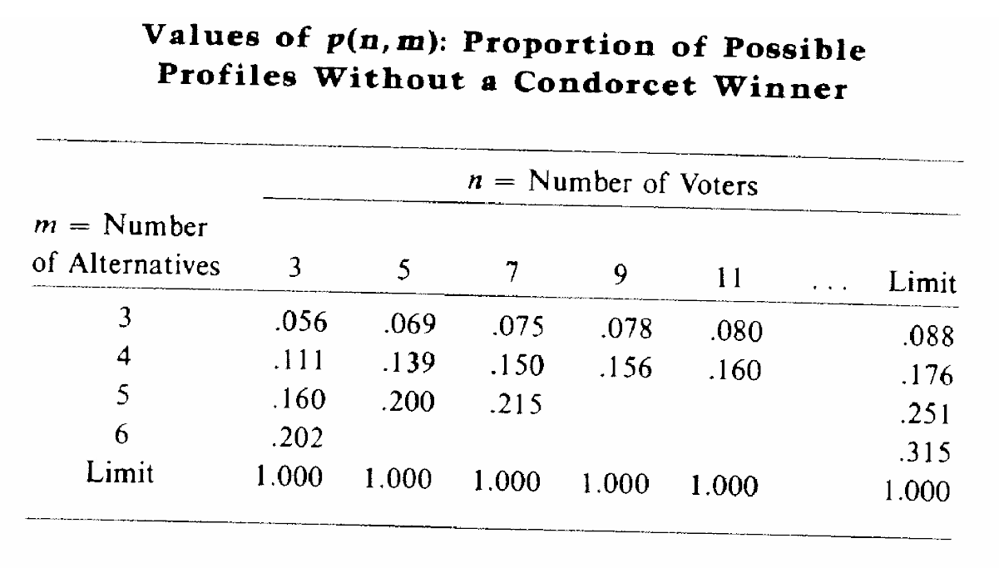

## Pero cómo que no sabías!

## Consecuencias de los ciclos 

-   Los ciclos de Condorcet existen, sobre todo, cuando existen muchas
    alternativas entre las cuales elegir y muchos individuos que elijen.
    -   ¿existe alguna forma de agregar preferencias que es mejor a
        otra?
-   La respuesta: no existe una respuesta correcta!
-   Ninguna forma es perfecta
-   Este es uno de los resultados mas famosos en la teoría de la
    elección social y se denomina el **Teorema de la Imposibilidad de
    Arrow**.

## Arrow: el padre de la criatura

-   Dados:
    -   Un conjunto de alternativas, $O$
    -   Un conjunto de individuos, $G$
    -   Una regla de decisión social, $\succ$
-   Las preferencias de un individuo son "racionales" si son:
    -   **Completas** $\longrightarrow$ dadas dos alternativas
        cualquiera, $A$ y $B$, cada individuo puede
        rankearlas/ordenarlas --i.e. $A \succ B$, $A=B$, o $B \succ A$.
    -   **Transitivas** $\longrightarrow$ dadas tres alternativas
        cualquiera, $A$, $B$ y $C$, si $A \succ B$ y $B \succ C$,
        entonces $A \succ C$

## Condiciones de Arrow (justicia)

-   Dominio universal $\longrightarrow$ supone que individuos tienen
    preferencias racionales sobre cualquier alternativas de $O$
-   Optimalidad de Pareto $\longrightarrow$ si todo los individuos de
    $G$ prefieren $A$ a $B$, la regla de decisión debe preferir $A$ a
    $B$.
-   Independencia de alternativas irrelevantes $\longrightarrow$ si hay
    dos conjuntos de individuos, $G$ y $G'$ y en cada uno sea $A
      \succ B$, el orden entre A y B debe ser el mismo
    independientemente de preferencias por C.
-   No dictadura $\longrightarrow$ ningún $i$ de G tal que sus
    preferencias fijen el orden social independientemente del resto

## Teorema de la imposibilidad

> No existe una función de
ordenamiento social $\succ$ tal que para cualquier grupo G cuyos
miembros tengan todos preferencias racionales, $\succ$ sea un
ordenamiento racional (transitivo) y que satisfaga los cuatros supuestos
de dominio universal, optimalidad de Pareto, independencia de
alternativas irrelevantes y no dictadura.

-   Houston, tenemos un problema! $\longrightarrow$ los ciclos de
    Condorcet. Si queremos una función de ordenamiento social que cumpla con todas esas condiciones, no será transitiva $\longrightarrow$ habrá ciclos.

## Preferencias espaciales y votante mediano

-   Es díficil relajar cualquiera de los supuestos de optimalidad de
    Pareto, independencia de alternativas irrelevantes y de no dictador
    sin caer en injusticias
-   La condición del dominio universal, sin embargo, puede ser relajada
    ya que no es una condición de equidad, sensatez o adecuación; es un
    requisito de dominio.
-   Es muy restrictivo ya que exige que el
    mecanismo de decisión colectivo funcione en todos los ámbitos
    imaginables (dominio más amplio). ¿Que pasa si restringimos el dominio? (menos generalidad)?

## AP: Preferencias s/ aborto

-   Aborto en EEUU $\longrightarrow$ preferencias polarizadas.
    -   Provida (V) $\longrightarrow$ prohibir aborto en cualquier
        caso
    -   Proeleccion (E) $\longrightarrow$ mujer derecho absoluto a
        elegir
    -   Roe-Wade (1973) (R) $\longrightarrow$ aborto en etapa temprana
-   ¿Cuáles son las preferencias de los grupos?
    -   $V \succ R \succ E$ (provida)
    -   $E \succ R \succ V$ (proeleccion)
    -   $R \succ V \succ E$ (roe-wade1)
    -   $R \succ E \succ V$ (roe-wade2)
-   $R$ no es la peor para ningún grupo $\longrightarrow$ ¿consenso?

## AP: Preferencias s/ aborto

{height=400}

## Teorema de pico único

> Sea un conjunto $O$ de alternativas del cual un
grupo $G$ de individuos debe elegir una. Si, por cada subconjunto de 3
alternativas, y para cada miembro, una de estas **nunca** es la peor de
las tres, entonces el consenso es lo suficientemente generalizado como
para que el método de la regla de la mayoría arroje preferencias de
grupo transitivas

-   Implicancia fundamental $\longrightarrow$ aún si miembros del
    grupo tienen ideas **muy diferentes** sobre una política, la **regla de la mayoría funciona** siempre y
    cuando haya un grado mínimo de consenso

## Forma de preferencias

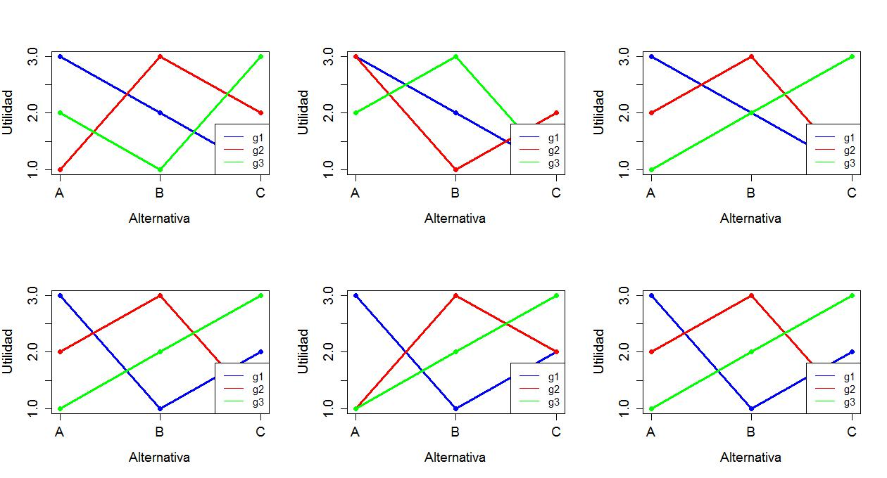

## Restricción de dominio: preferencias

-   Si las preferencias son de pico único, entonces la regla de la
    mayoría produce una agregación de preferencias individuales a
    sociales que cumple todas las condiciones de Arrow y que además es
    transitiva.
-   ¿Es razonable restringir las preferencias de este modo?
> Preferencias en la práctica Suponga 3 partidos: izquierda (I),
    centro (C), y derecha (D). El individuo 1 se identifica con I.
    Tendrá $I \succ C
    \succ D$. El individuo 2 se identifica con D y tendrá
    $D \succ C \succ I$. Y el de centro podrá tener $C \succ
    \ D \succ I$ o $C \succ I \succ D$.

## Ejemplos de preferencias de pico único

-   Pueden pensarse las siguientes preferencias:
    -   Preferencias escala ideológica lib-con
    -   Preferencias por tasa impositiva y gasto público en educación
    -   Preferencias por localización de bien público (plaza)
    -   Preferencias por arancel a importación
-   Una fn. de utilidad que describe PPU  es del tipo ($b_i$ es el punto ideal del individuo
    $i$):

$$\begin{aligned}
u_i=-(g-b_i)^2  \\
u_i=1-\lvert g-b_i \rvert\end{aligned}$$

## Ejemplos de preferencias de pico único (cont.)

## Preferencias sociales: ¿de pico único?

-   Se ha criticado la restricción de las preferencias a las de pico
    único argumentando que no aplican a muchas situaciones económicas y
    políticas
-   Muchos problemas económicos --alícuotas impositivas; tamaño del
    gobierno; gasto en defensa; localización de un bien público- son
    variables continuas que pueden modelarse con preferencias de pico
    único.
-   El problema surge con elecciones entre cosas que no tienen un orden
    dado --qué banda debería tocar en un evento; de qué color pintar las
    aulas.

## Regla de votación: Borda

-   El **método de Borda** se propone como alternativa al método de
    Condorcet para superar el problema de los ciclos. Supongamos que
    existen 5 votantes y 3 alternativas tal que:

   Orden   1   2   3   4   5
  ------- --- --- --- --- ---
     1     A   A   A   B   B
     2     B   B   B   C   C
     3     C   C   C   A   A

  : Regla de votación: Borda (cont.)

-   Cada individuo (grupo de individuos) puntuan  alternativas según el lugar (orden) que ocupen en su ordenamiento de preferencias. Diferencia c/ Condorcet: utiliza toda la información (e intensidad) de preferencias.

## Regla de votación: Borda (cont.)

-   Existen dos implementaciones alternativas de la regla de Borda:
    -   La alternativa en primer lugar recibe $n$ puntos, la alternativa
        en segundo lugar, recibe $n-1$ puntos, y así hasta la última alternativa; donde "n" es el número de alternativas. La última recibe 1 (un) punto.
    -   La alternativa en primer lugar recibe $n-1$ puntos, la
        alternativa en segundo lugar, recibe $n-2$ puntos, y así hasta la
        última alternativa; donde "n" es el número de alternativas. La última recibe 0 (cero) puntos.

-   Pueden usarse cualquiera a menos que explícitamente se indique alguno en particular.

## Regla de votación: Borda (cont.)

-   En este caso (solucionando por método "n-1", las alternativas
    recibirían:
    -   $A$ $\longrightarrow$ 6 votos
    -   $B$ $\longrightarrow$ 7 votos
    -   $C$ $\longrightarrow$ 2 votos
-   Parece un método razonable aunque algo difícil de implementar
    $\longrightarrow$ el candidato C podría desistir de presentarse
-   En ese caso, la primera alternativa recibe 1 (uno) y la segunda 0
    (cero).

## Regla de votación: Borda (cont.)

-   Ahora con este nuevo esquema, el ganador es $A$! (obtiene 3 contra 2
    votos de $B$) $\longrightarrow$ presencia o no de alternativas
    irrelevantes --$C$- puede modificar el resultado de la elección
-   Este método sin embargo se usa mucho en eventos y competiciones
    musicales y en elección de sedes, mejores jugadores, etc.
-   El principal problema del método Borda $\longrightarrow$ viola el
    principio de mayoría y viola el ganador de Condorcet

## Preferencias espaciales

> **Problema del directorio.** La junta de directores del BCRA deben adoptar
una decisión sobre la tasa de interés interbancaria. Las tasas de
interés, en cuanto números, son en efecto puntos de una línea: el
extremo inferior es 0%, el extremo superior 10%, es decir la linea se
traza para el intervalo \[0,10\]. Supongamos que hay 5 (cinco)
directores y que cada uno tiene un punto de esa linea (tasa) que es el
que más desea y luego sus preferencias disminuyen a medida que se alejan
de ese punto en cualquier dirección

## Preferencias espaciales (cont.)

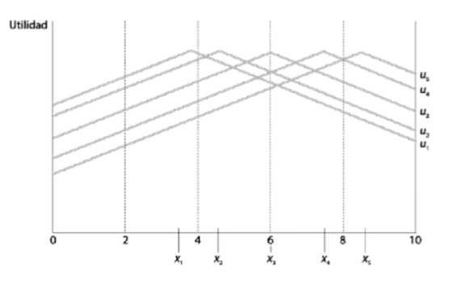

## Preferencias espaciales (cont.)

-   Las cinco personas, $G={1,2,3,4,5}$ tienen las preferencias
    mostradas en el gráfico anterior y representadas como
    $x={x_1,x_2,x_3,x_4,x_5}$.
-   Cada individuo tiene un punto favorito $\longrightarrow$ "punto
    ideal". Esa es la tasa de interés que el/ella prefiere en primer
    lugar. Por ejemplo, para el director 1:
    -   $x_1 \succ x_2 \succ x_3 \succ x_4 \succ x_5$
-   Las preferencias se "miden" a partir de la utilidad --i.e. la altura
    de la curva; cada una de las "campanas" es una función de utilidad
    para cada director.

## Preferencias espaciales (cont.)

## Preferencias espaciales (cont.)

-   Tomemos ahora solamente al individuo 5. Su perfil de preferencias es
    $x_5 \succ x_4 \succ x_3 \succ x_2 \succ x_1$. Su tasa de interés
    favorita (punto ideal) es de $8.25$.
-   Tomemos una tasa cualquiera --i.e. $7$. El conjunto de puntos
    (tasas) que este individuo prefiere a $7$ es el que se representa
    como $P_5(y)$: ese conjunto contiene a todas las tasas de interés
    entre 7 y 9.50 \[¿Por qué?\]
-   En otras palabras, si la tasa $y$ fuera una propuesta concreta, este
    individuo prefería todos los puntos del conjunto $P_5(y)$ a $y$.

## Preferencias espaciales (cont.)

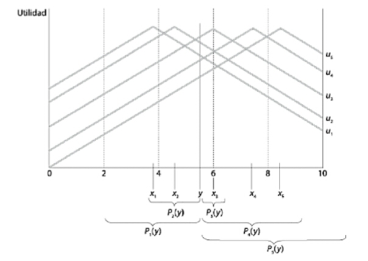

## Preferencias espaciales (cont.)

-   Ahora veamos los "conjuntos preferidos a $y$" de todos los
    directores (note $y$ un poco abajo de $6$). Puede verse que:
    -   $P_4(y)$ y $P_5(y)$ tienen puntos en común
    -   $P_1(y)$ y $P_2(y)$ tienen puntos en común
    -   Los individuos 3, 4 y 5 tienen conjuntos preferidos a $y$ que se
        superponen; estos tres individuos forman una mayoría (3 contra 2) por lo que esa mayoría vence a una propuesta como $y$.
-   Pueden pensarse en todas las mayorías posibles que vencen a $y$
    dependiendo de posición de $y$ en la escala.

## Preferencias y coaliciones

  Tamaño coalicion   Coalicion
  ------------------ ---------------------------------------------------------------------------------
          3          (1,2,3) (1,2,4) (1,2,5) (1,3,4) (1,3,5) (1,4,5) (2,3,4) (2,3,5) (2,4,5) (3,4,5)
          4          (1,2,3,4) (1,2,3,5) (1,2,4,5) (1,3,4,5) (2,3,4,5)
          5          (1,2,3,4,5)

## El rol del mediano

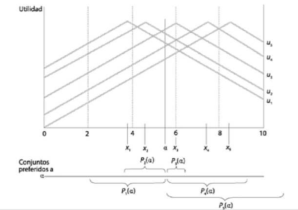

## El rol del mediano (cont.)

> **Teorema del votante mediano (TVM).** Si miembros de un grupo $G$ tienen
preferencias de pico único, el punto ideal del VM es un ganador de
Condorcet.

-   Sería $x_3$. Suponga $\alpha$ a la izquierda de $x_3$. Miembros 1 y
    2 prefieren $\alpha$ pero 3, 4 y 5 prefieren $x_3$ a $\alpha$.
    $x_3$.
-   Suponga $\beta$ a la derecha de $x_3$. Miembros 4 y 5 pueden
    preferirlo a $x_3$ pero los miembros 1, 2 y 3 prefieren $x_3$ a
    $\alpha$.
-   $x_3$ vence a todos los puntos restantes. El punto ideal del VM no
    es vencido por ninguno y esta es la decisión de mayoría.

## El teorema del votante mediano

-   El teorema postula que hay un único ganador por mayoría y que ese
    ganador es el VM --aquel el medio de la distribución en relación a
    la dimensión explorada
-   Uno de los resultados más importantes en la teoría de la votación
    $\longrightarrow$ postula una convergencia a las preferencias del
    votante mediano.
    -   En cualquier situación de elección en votación por mayoría, la
        mejor forma de obtener la mayoría de los votos es acercarse a
        las preferencias del votante mediano.
-   El TVM no aplicable a situaciones de más de dos dimensiones de las
    preferencias $\longrightarrow$ originan ciclos

## El teorema del votante mediano (cont.)

-   Note que la *intensidad de las preferencias* no importa para nada en
    este resultado.
    -   Puede que me desagrade mucho un candidato pero mi voto cuenta
        exactamente lo mismo que el de otra persona que es casi
        indiferente entre ese candidato y cualquier otro.
-   Se deriva del principio "una persona, un voto" $\longrightarrow$ una
    de las diferencias fundamentales entre las elecciones y las
    decisiones económicas
    -   Se puede relajar esto (volveremos mas adelante)
        $\longrightarrow$ costo de votar (registración); contribuciones
        de campaña; influencia.

## Supuestos restrictivos del análisis

-   Supuestos de base son:
    -   Número impar de miembros $\longrightarrow$ el mediano es el que
        está siempre en el medio de la distribución (espacial). Si fuera par (por ejemplo, 4), tanto 2 y 3 son
        medianas. Es decir, habria ganadores de Condorcet, pero no
        serían únicos.
    -   Participación total $\longrightarrow$ todos votan. No siempre
        pasa (abstenciones, ausencias). El resultado
        del mediano se aplica pero cambia la identidad del
        votante mediano --i.e. cambia el punto elegido.
    -   Voto sincero $\longrightarrow$ si las personas no votan de
        acuerdo a sus preferencias, entonces existe voto
        estratégico. 

## Limitaciones 

-   Algunas limitaciones de este modelo son:
    -   Son modelos de decisión colectiva **unidimensionales**.
        Muchísimas situaciones sociales en que la cuestión no puede
        reducirse a una sola dimensión.
    -   Voto a presidente/gobernador $\longrightarrow$ dimensión
        económica y dimensión social.
    -   Elección en concursos de cantantes, belleza --i.e. varias
        dimensiones
-   Cuando se generaliza a mas de una dimensión, el resultado del
    votante mediano es mucho más restrictivo.
-   No da ningún rol a las instituciones políticas

## Práctica

- Suponga tres votantes, tres alternativas y los siguientes ordenamientos de preferencias:

   Orden   Juan   Pedro   María
  ------- ------ ------- -------
     1      A       C       B
     2      B       A       C
     3      C       B       A

-   *¿Hay ganador por mayoría absoluta?* No. Ninguna tiene la mitad mas
    uno de los votos (2). ¿Hay ganador por mayoría simple (pluralidad)?
    No. Ninguna alternativa tiene más votos que otra --ie. hay triple
    empate.

## Práctica

- Suponga tres votantes, $G={1,2,3}$ con un
orden completo y transitivo de preferencias por tres políticas $q={q_1,q_2,q_3}$. Se elige por regla de mayoría, agenda abierta y voto sincero. Las preferencias son:
$$\begin{aligned}
q_1 \succ q_3 \succ q_2 \\
q_2 \succ q_1 \succ q_3 \\
q_3 \succ q_2 \succ q_1
\end{aligned}$$

- *¿Existe un ganador de Condorcet?* Demuestre.
- Ahora V1 fija agenda. Selecciona dos rondas de
    votación. *¿Cuál es la agenda óptima según 1?*
- *¿Puede V3 mejorar su utilidad votando estratégicamente?*

## Práctica

- Considere los siguientes perfiles de
preferencias para tres individuos:
$$\begin{aligned}
x \succ y \succ z \succ w \\
y \succ z \succ x \succ w \\
z \succ x \succ y \succ w
\end{aligned}$$

- De acuerdo a la regla de la mayoría, obtenemos que $y \succ z \succ x
\succ w$. Sin embargo, hay algo que "está mal" acerca de este
ordenamiento social. *Diga qué es y porqué.* 

## Práctica

- Suponga la siguiente distribución de preferencias por 4 (cuatro)
    alternativas entre 3 (tres) grupos de votantes.

   Ord    Pts   49   48   3  
  ----- ------ ---- ---- ---
   1ro   4pts   A    B    C  
   2do   3pts   B    D    B  
   3ro   2pts   C    C    D  
   4to   1pts   D    A    A  

- *Identifique cuál es el candidato Borda*

## Práctica

-   Suponga 30 personas cuyas preferencias por 4 (cuatro)
    alternativas son:

   votantes          preferencias
  ---------- -----------------------------
      10      $A \succ D \succ C \succ B$
      10      $B \succ A \succ D \succ C$
      10      $C \succ B \succ A \succ D$

-   ¿Puede $D$ ganar democráticamente? Si, fijando el
    orden de votación: 1) Voto entre $B$ y $A$; 2)
    Voto entre $B$ y $C$; 3) Voto entre $C$ y $D$ $\longrightarrow$
    todos disconformes con el resultado \[¿Por qué?\]

# Modelos de competencia electoral

## TVM y democracia representativa

-   El teorema del votante mediano (TVM) a pesar de ser muy intuitivo se
    cumple baja condiciones muy estrictas

-   En las democracias modernas, no se eligen directamente las políticas
    sino que ciudadanos votan a representantes y estos eligen las
    políticas $\longrightarrow$ ¿problema?

-   Esto se conoce como democracia representativa. Problemas princiales
    $\longrightarrow$ 1) elegir un candidato de un conjunto; 2)
    implementar la política anunciada

## Competencia electoral

-   Elemento central de las democracias representativas es la
    **competencia electoral** $\longrightarrow$ en el caso de 2 (dos)
    partidos (coaliciones de partidos) puede verse como un juego de suma
    cero simultáneo entre 2 (dos) jugadores.

-   Los individuos no eligen las políticas directamente --eligen
    partidos políticos que anuncian la política a implementar

-   Versión simple e idealizada de democracia represenativa

## Competencia diferenciada: ¿espacial?

-   En 1929, Hotelling observó que las empresas competidoras solían
    imitar la calidad de los bienes y la localización. ¿Por qué teniendo
    un enorme mercado geográfico para localizarse se establecen tan
    cerca (por qué imitaban calidad del producto)?

-   Ejemplo $\longrightarrow$ vendedores de helados en una playa. ¿Donde
    deben localizarse a lo largo de una playa de 1km si los individuos
    están distribuidos uniformemente?

-   Esto se observa en la vida real $\longrightarrow$ heladeras en
    supermercados; negocios en una misma cuadra/zona.

## Competencia electoral: Downs

-   Preguntas relevantes:

    -   ¿Qué determina el número de partidos políticos y las propuestas
        de política elegidas?

    -   ¿Cómo afecta el sistema electoral el resultado de una elección y
        las preferencias de los votantes?

-   Modelo fundacional $\longrightarrow$ Downs: cada candidato (de un
    total "n") elige una propuesta de política; cada ciudadano tiene
    preferencias acerca de esas propuestas de política y vota por los
    candidatos en función de aquellas.

## Competencia electoral: Downs (cont.)

-   Supuestos:

    -   Cada partido político busca ganar para obtener ingreso,
        prestigio y poder que viene con el cargo;

    -   El partido ganador tiene control completo de sus acciones hasta
        la próxima eleccion

    -   Poderes económicos del gobierno ilimitados --dentro del marco
        democrático. El único límite es político $\longrightarrow$ no
        puede restringir la libertad política

    -   Cada agente en el modelo --votante, partido o coalicion- es
        racional en todo momento

## Competencia electoral: Downs (cont.)

-   Basado en esto desarrolló el **modelo espacial de competencia
    electoral**.

-   Continuo ideológico unidimensional $[0,100]$, entre economía
    completamente socializada (0) y economía totalmente privada (100).

-   Supuesto $\longrightarrow$ todo puede reducirse a la ideología;
    unidimensional.

## Competencia electoral: Downs (cont.)

> **Hipótesis central.** Los partidos políticos en una democracia formulan la
política estrictamente como un medio para obtener votos (y ganar
elecciones). Para Downs los partidos políticos no son mas que
comerciantes vendiendo "políticas" por "votos".

## Competencia electoral: Downs (cont.)

-   Candidatos son jugadores y la propuesta de política es un numero
    (identifica *posición*). Primero, candidatos eligen las posiciones.
    Segundo, los ciudadanos votan

-   Otros supuestos:

    -   El único objetivo de cada candidato es ganar

    -   Ningún candidato tiene afinidad ideológica

    -   Cada candidato prefiere ganar a empatar --el resultado
        se decide por sorteo, y empatar a perder.

    -   *Continuo* de votantes, cada uno con punto ideal

    -   La distribucioń de las posiciones favoritas es arbitraria.

## Competencia electoral: Downs (cont.)

-   *posición mediana, $m$* $\longrightarrow$ tiene la propiedad de que
    exactamente la mitad de las posiciones favoritas de los votantes son
    como máximo $m$ y la mitad de las posiciones favoritas de los
    votantes son como mínimo $m$

-   La distancia entre cualquier posición y la posición favorita de un
    votante es una medida de la intensidad del desagrado
    $\longrightarrow$ a mayor distancia, mayor su desagrado

-   Ej $\longrightarrow$ para cualquier valor $k$, un votante cuya
    posición favorita $x^{*}$ es indiferente entre entre las posiciones
    $x^{*}-k$ y $x^{*}+k$

## Competencia electoral: Downs (cont.)

{ width=50% }

-   Cada candidato atrae los votos de ciudadanos cuyas posiciones
    favoritas están más cerca de su posición que las de cualquier otro
    candidato

## Competencia electoral: Downs (cont.)

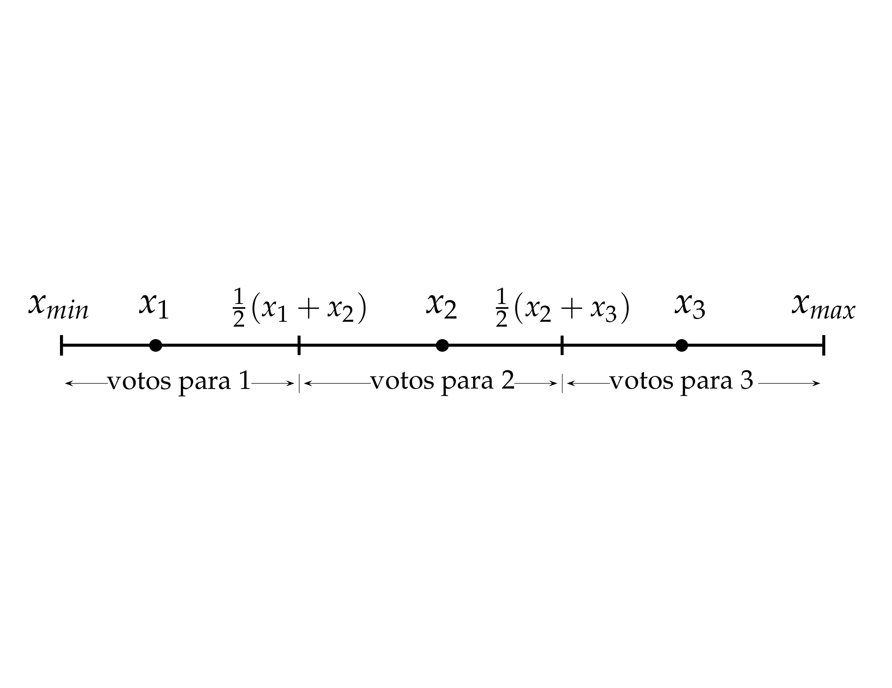{ width=50% }

-   3 candidatos: $1$, $2$ y $3$ $\longrightarrow$ 3 posiciones:
    $x_{1}$, $x_{2}$, $x_{3}$ \[$x_{1}<x_{2}<x_{3}$\]

-   Ciudadanos cuyas posición favorita es $\frac{1}{2}(x_{1}+x_{2})$
    dividen sus votos por igual entre $x_{1}$ y $x_{2}$.

-   Jugadores son los **candidatos**, acciones el conjunto de
    **posiciones posibles** y los *payoffs* son $n\succ k
      \succ 0$

## Competencia electoral: Downs (cont.)

-   Caso más simple $\longrightarrow$ dos candidatos

-   Fijamos la posición elegida $x_{2}$ del candidato 2 y consideramos
    la mejor respuesta del candidato 1.

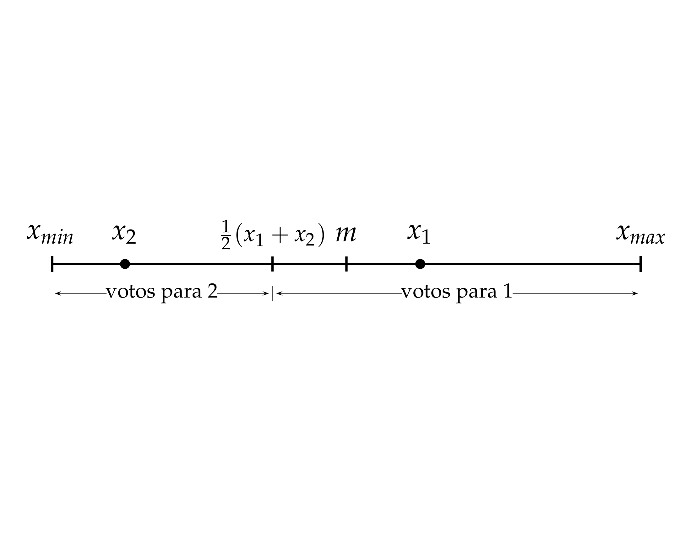{ width=50% }

-   Suponga que $x_{2}<m$ $\longrightarrow$ su mejor respuesta es el
    conjunto entre $x_{2}$ y $2m-x_{2}$ \[¿Por qué?\]

## Competencia electoral: Downs (cont.)

-   Suponga ahora que $x_{2}>m$ $\longrightarrow$ su mejor respuesta es
    el conjunto entre $2m-x_{2}$ y $x_{2}$ \[¿Por qué?\]

-   Finalmente, considere el caso en que $x_{2}=m$ $\longrightarrow$ la
    única mejor respuesta del candidato 1 es elegir *la misma posición!*
    que el candidato 2. Cualquier posición diferente de $m$ y el
    candidato perderá; si escoge $m$, empata el primer puesto.

-   La *funcion de mejor respuesta* del candidato 1:

$$B_{1}(x_{2}) = \left\{
\begin{array}{l l}
  \left\{x_{1}:x_{2}<x_{1}<2m-x_{2}\right\} & \quad \mbox{if
    $x_{2}<m$}\\
\left\{m\right\} & \quad \mbox{if $x_{2}=m$}\\
\left\{x_{1}:2m-x_{2}<x_{1}<x_{2}\right\} & \quad \mbox{if
    $x_{2}>m$} \\
\end{array} \right.$$

## Competencia electoral: Downs (cont.)

-   Downs no *requiere* que partidos siempre vayan al centro

-   Si los votantes se distribuyen uniformemente a lo largo del eje "x"
    y el partido A originalmente se ubica en A (25) y y el partido B se
    ubica en B (75), a ambos les conviene moverse hacia 50.

-   Si la distribución de votantes cambia, los partidos: a) tiende a ir
    a los extremos (figura 2); b) tenderan a posicionarse alrededor de
    nucleos de votantes (figura 3)

## Competencia electoral: Downs (cont.)

{ width=75% }

## Competencia electoral: Downs (cont.)

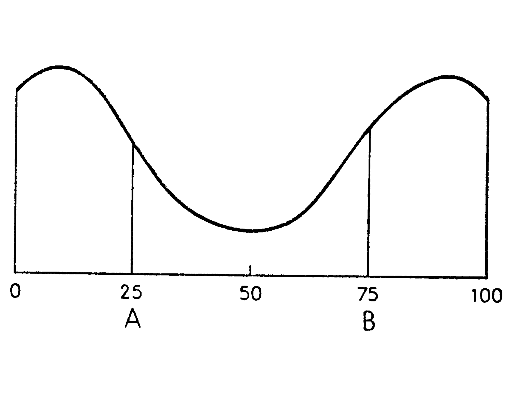{ width=75% }

## Competencia electoral: Downs (cont.)

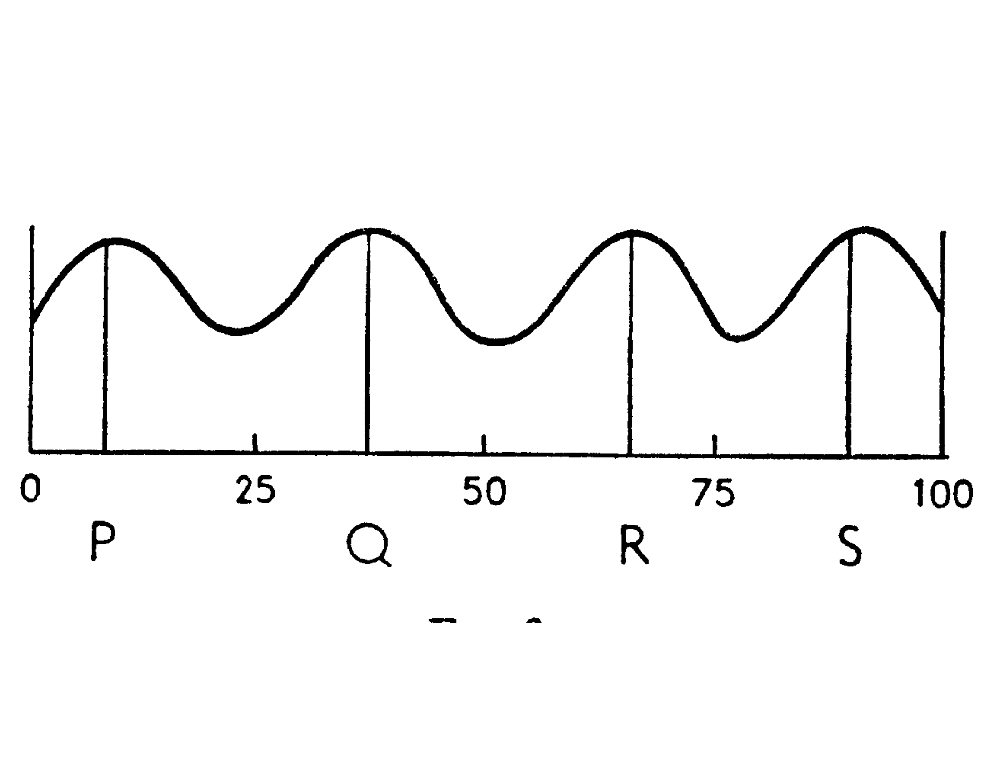{ width=75% }

## Competencia electoral: Downs (cont.)

-   Políticas estables en una democracia bi-partidista requiere
    distribucion normal $\longrightarrow$ los partidos tienden a
    parecerse. La *identidad* del partido no importa.

-   Si votantes polarizados, cambio en *identidad* del ganador implica
    cambio en la política. Si continuidad $\longrightarrow$ oposición
    busca desestabilizar; si alternancia $\longrightarrow$ inestabilidad

-   Si distribución multimodal $\longrightarrow$ sistema multi-partido.
    Cada partido se posiciona en una "moda". Implica mayor rango de
    opciones, mayor rol de ideología y menor coherencia
    $\longrightarrow$ gobierno de coaliciones

## Aplicación I: Competencia electoral

-   Existe 3 (tres) grupos políticos, **liberal**, **de centro** y
    **socialdemocrata** que deben decidir sobre el nivel de gast \[alto
    (A), medio (M) y bajo (B)\] del sector público con las siguientes
    preferencias:

{ width=50% }

## Aplicación I: Competencia electoral (cont.)

-   Sea cual fuere el orden en que se presenten las alternativas, se
    aprobará un nivel medio de gasto $\longrightarrow$ es la opción
    preferida por el votante mediano

-   Verifique por que:

    -   A vs M $\Rightarrow$ M; M vs B $\Rightarrow$ M

    -   A vs B $\Rightarrow$ B; B vs M $\Rightarrow$ M

    -   M vs B $\Rightarrow$ M; M vs A $\Rightarrow$ M

-   El modelo no funciona cuando:

    -   hay más de una dimensión (decentralización y desregulación;
        derechos civiles y derechos sociales)

    -   las preferencias no son de pico único (unimodales)

## Aplicacion II: Pre-electoral USA

-   Dos partidos políticos: Demócratas y Republicanos

-   Acciones posibles: cada partido puede colocarse en *cualquier*
    posición del arco político

-   Electores: hay 200 millones de electores.

-   Cada persona tiene preferencias de modo que vota a aquél partido que
    esté más cerca de su punto ideal.

-   Suponemos que los electores se distribuyen de forma uniforme por
    todo el arco ideológico (grafico 1).

## Aplicacion II: Pre-electoral USA (cont.)

-   Suponemos originalmente las posiciones D y R están:

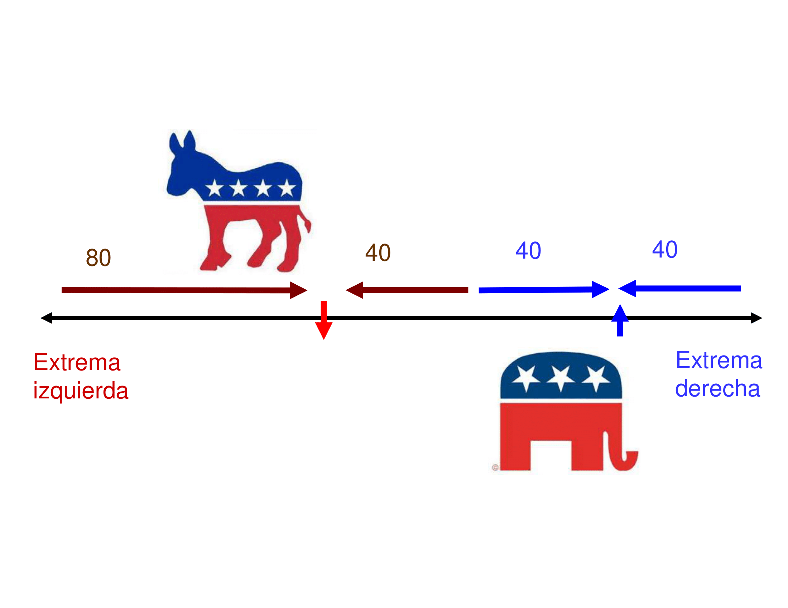{ width=60%}

## Aplicacion II: Pre-electoral USA (cont.)

-   Los Republicanos tienen incentivo a moverse hacia la izquierda

{ width=60% }

## Aplicacion II: Pre-electoral USA (cont.)

-   Y ahora los Democratas deciden colocarse en el medio!

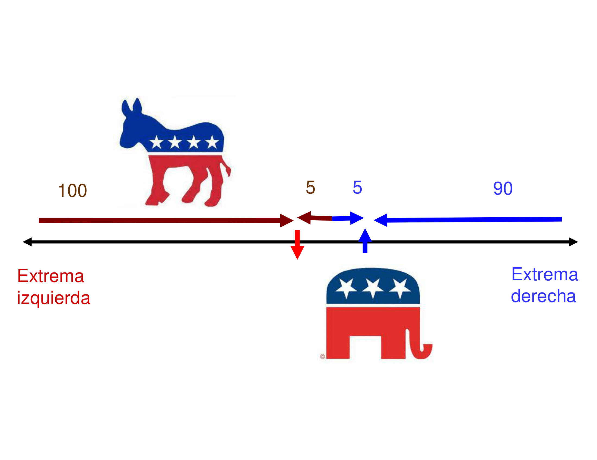{ width=60% }

## Aplicacion II: Pre-electoral USA (cont.)

-   Pero los Republicanos están perdiendo votos no estando en el medio,
    por lo que\...también van al medio!

{ width=60% }

## Aplicación III: ¿Qué alícuota fijar?

-   Suponga un gobierno que debe decidir el nivel de gasto e imposición.
    Existe un sólo impuesto $\longrightarrow$ el impuesto a la renta.
    Debe determinarse la alicuota, $\tau$. Si el ingreso individual es
    $y$, el ingreso después de impuestos es $y(1-\tau)$.

-   La imposición tiene un costo. Supongamos que el costo (distorsión)
    del impuesto es igual a $\delta \tau^2$.

-   El votante mediano quiere maximizar su consumo (depende del ingreso
    después de impuestos, del gasto público y del costo de la
    imposición).

## Aplicación III: ¿Qué alícuota fijar? (cont.)

-   El consumo final de un persona viene dado por:
    $$C=y(1-\tau)+\tau y_{avg}-\delta \tau^2$$

-   y la alícuota óptima viene dada por:
    $$\tau=\frac{y_{avg}-y_{median}}{2\delta}$$

-   Note que la *alícuota (y el tamaño del gobierno) son crecientes en
    la [diferencia]{.ul} entre el ingreso promedio y el ingreso
    mediano*.

-   Clave $\longrightarrow$ políticos toman decisiones basadas en
    votante mediano; tasas medias están basadas en el ingreso medio.

## Aplicacion III: ¿Qué alícuota fijar? (cont.)

-   Suponga 5 personas (y suponga $\delta=0.5$). Sea $y={0,1,2,3,4}$

    -   Mediana? 2 --- Media? 2 --- $\tau$? 0

    -   $C=y(1-\tau)+\tau y_{avg}-\delta \tau^2$ $\Rightarrow$
        $C=2(1-0)+0-0=2$

-   Ahora, con $y={0,1,2,3,9}$

    -   Mediana? 2 --- Media? 3 --- $\tau$? 1

    -   $C=y(1-\tau)+\tau y_{avg}-\delta \tau^2$ $\Rightarrow$
        $C=2(1-1)+1*3-0.5=2.5$

-   Ahora, con $y={0,1,2,3,59}$

    -   Mediana? 2 --- Media? 13 --- $\tau$? 11

    -   $C=y(1-\tau)+\tau y_{avg}-\delta \tau^2$ $\Rightarrow$
        $C=2(1-11)+11*13-0.5*(11)^2=62.5$

## Aplicacion III: ¿Qué alícuota fijar? (cont.)

-   ¿Qué esta ocurriendo?

    -   Lo que sucede es que en este simple modelo *la política está
        determinada por la diferencia entre el mediano y la media*

    -   Esto implica que, por ejemplo, cuando existen grandes niveles de
        desigualdad (particularmente cuando hay personas extremadamente
        ricas como en el tercer caso), el votante mediano puede ganar
        mucho al fijar una alícuota mayor y poner impuestos sobre los
        ricos.

-   ¿Por qué la alícuota era igual a cero en el caso 1 cuando el mediano
    y la media eran iguales?

    -   El mediano no se beneficia en absoluto de que haya una alícuota
        (ver consumo). Como la imposición es costosa (distorsiva), la
        alícuota optima es igual a 0.

## Utilidad del teorema del votante mediano

> Utilidad del teorema del votante mediano We appeal to this (median
voter) theorem to capture the basic idea that any government is likely
to be responsive to the wishes of the majority when key distributional
issues are at stake. Even a dictator cannot completely ignore social
demands for fear of being overthrown. Thus, even in a dictatorship,
distributional issues affecting the majority of the population will
influence policy outcomes \[Alesina and Rodrik (1994)\]

## Mas allá del votante mediano

> **Políticos unidimensionales.** Thus politicians in our model never seek
office as a means of carrying out particular policies: their only goal
is to reap the rewards of holding office *per se*. They treat policies
purely as a means to the attainment of their private ends, which they
can reach only by being elected \[Anthony Downs, *An economic theory of
democracy*\]

-   ¿Es esta una representación adecuada de los políticos en la vida
    real? Evidencia sugiere que no necesariamente.

-   Los políticos también pueden interesarse por su posición de política
    preferida; influyen intereses especiales

## Las leyes de Duverger

> Ley 1 Los sistemas de votación por mayoría en una elección conducen a un
sistema bipartidista

> Ley 2 Los sistemas de votación por representación proporcional conducen
a un sistema multipartidista.

> Ley 3 Los sistemas de votación por mayoría en 2 vueltas llevan a un
sistema multipartido con tendencia a formar coaliciones

## Número efectivo de partidos

::: {#tab:2}
  Country      no. of elections   ENP     Sistema
  ----------- ------------------ ------ ------------
  Canada              21          3.07    mayoría
  UK                  17          2.37    mayoría
  US                  17          1.99    mayoría
  Australia           27          2.60   2da vuelta
  France              14          4.31   2da vuelta
  Argentina           4           4.47       PR
  Brazil              7           9.33       PR

  : Número efectivo de partidos
:::

## Polarización: políticas y plataformas

-   Si se cumple Downs, se esperaría un bajo grado de polarización en
    las plataformas políticas de la vida real.

-   Datos del "comparative manifesto dataset" (2015), polarización
    medida en escala I-D.

::: {#tab:3}
  Country      no. Elections   polarization
  ----------- --------------- --------------
  Canada            21             0.10
  UK                17             0.15
  US                17             0.08
  Australia         27             0.16
  France            14             0.21
:::

## Explicando la divergencia

-   La literatura ha buscado explicar la divergencia relajando algunos
    de los supuestos. Tambíen incorporando mas realismo --i.e. lobbies.

-   Existen en la competencia política (electoral) fuerzas centrípetas
    que tiendan a llevar a los partidos hacia el centro. Pero también
    existen algunas fuerzas que suelen alejarlos del mismo.

## Votantes "ideológicos"

-   En ocasiones, los votantes no sólo se preocupan por la política
    implementada $\longrightarrow$ pueden tener alguna simpatía y/o
    preferencia por tal o cual candidato

-   Aparece aquí el concepto de **votante swing** en cierta
    contraposición al **votante mediano**

-   Se sigue suponiendo que los candidatos son puramente oportunistas y
    una elección mayoritaria (mayoría absoluta)

## Votantes "ideológicos" (cont.)

-   El comportamiento de los votantes individuales depende de varias
    cosas ahora:

    -   Componente de política $\longrightarrow$ cómo la plataforma de
        política del candidato "i" afecta su propia utilidad

    -   Componente de ideología individual $\longrightarrow$ simpatía
        hacia el candidato "i" basada en izquierda/derecha; escándalos,
        etc

-   Se supone también que existe **información imperfecta**
    $\longrightarrow$ los candidatos no conocen de antemano la ideología
    (simpatía) de los votantes

## Votantes "ideológicos" (cont.)

-   Existen 3 (tres) grupos de inviduos: pobres (P), medios (M) y
    ricos (R) tal que:

    -   $Y_{P}<Y_{M}<Y_{R}$

    -   $\alpha_{P}$, $\alpha_{M}$ y $\alpha_{R}$ proporciones en
        población total; $\sum \alpha{J}=1$

-   Cada grupo es homogeneo en ingresos (política) y heterogéneo en
    ideología/simpatía hacia candidatos

-   $\sigma^{i,J}$ mide la ideología del votante "i" en el grupo "J".
    $\sigma^{i,J}>0$ implica que el votante "i" es ideológicamente más
    cercano a B; $\sigma^{i,J}<0$ implica que es ideológicamente más
    cercano a A.

## Votantes "ideológicos" (cont.)

{ width=75% }

## Votantes "ideológicos" (cont.)

-   Las decisiones de los votantes también están afectadas por la
    *popularidad promedio de un candidato* antes de las elecciones
    $\longrightarrow$ los candidatos no pueden controlar esto
    \[escándalo de emails Hillary Clinton; inundaciones en PBA efecto
    sobre Scioli\]

-   Entonces, $\delta>0$ implica que el candidato B es más popular y
    $\delta<0$ implica que el candidato A es más popular

-   Los candidatos solo pueden saber con qué probabilidad un escandalo
    puede ocurrir

## Votantes "ideológicos" (cont.)

{ width=75% }

### Votantes "ideológicos" (cont.)

-   Entonces, los votantes consideran 3 (tres) elementos en base a los
    cuales decidir su voto: 1) posición de la política, $U^{J}(X_{A})$ y
    $U^{J}(X_{B})$; 2) ideología individual, $\sigma^{i,J}$; 3)
    popularidad promedio, $\delta$.

-   La predicción es que el votante "i" en el grupo "J" votará por el
    candidato B si: $$U^{J}(X_{B})+\sigma^{i,J}+\delta > U^{J}(X_{A})$$

## Votantes "ideológicos": El votante swing

-   El votante swing es aquel que, una vez consideradas la plataforma de
    política y la popularidad del candidato, es *indiferente* entres los
    candidatos A y B.

-   ¿Por qué es este votante relevante? Porque un **pequeño** cambio en
    la plataforma de política de parte de un candidato hace que obtenga
    su voto.

-   Notese que los candidatos anuncian sus plataformas antes que se
    conozca su popularidad promedio $\longrightarrow$ el candidato no
    sabe quien es el votante swing!
    $$\sigma^{J}=U^{J}(X_{B})-U^{J}(X_{A})-\delta$$

## Votantes "ideológicos" (cont.)

{ width=75% }

## Votantes "ideológicos": Implicancias

-   Mas relevancia asignada al grupo más numeroso y al grupo menos
    "ideologizado"

-   Los candidatos pueden elegir la plataforma de política pensando en
    maximizar la probabilidad de ser electos sujetos a la eventualidad
    del escándalo $\longrightarrow$ como la probabilidad es uniforme,
    ambos incorporan eso

-   Los candidatos terminan fijando las mismas plataformas

-   Son relevantes aquellos votantes menos ideologizados (swing)
    $\longrightarrow$ faciles de convencer a través de la política

